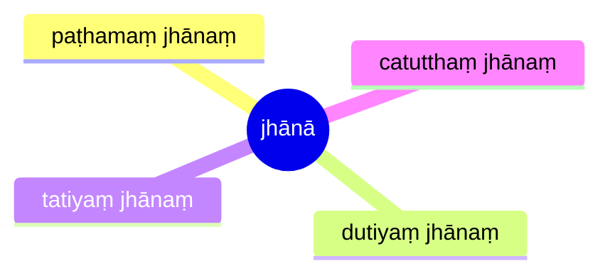

import { Tabs, TabItem } from '@astrojs/starlight/components';

[14S5/9.1.1--12 Jhānādisutta](https://tipitaka2500.github.io/tipitaka/14S5/9/9.1/9.1.1--12.html)

<Tabs syncKey="paliquote">
<TabItem label="My Translation">
1625\. [The Bhagavā] was dwelling at Sāvatthī.

There the Bhagavā said this:

> Bhikkhave, there are these `cattāro jhānā` (four mental dispositions). What four?
>
> * Here, Bhikkhave, a bhikkhu, secluding himself from sensual pleasures, detaching from unwholesome characteristics, enters and remains in the first mental disposition, `savitakkaṃ` (accompanied by reflection), `savicāraṃ` (with consideration), `vivekajaṃ` (secluded from defilements), `pītisukhaṃ` (with felicity and satisfaction).
> * `Vitakkavicārānaṃ vūpasamā` (With the conclusion of reflection and consideration), he enters and remains in the second mental disposition, `ajjhattaṃ sampasādanaṃ cetaso` (accompanied by an inner calming of intention), `ekodibhāvaṃ` (focused), `avitakkaṃ` (without reflection), `avicāraṃ` (without consideration), `samādhijaṃ` (born from focus), with felicity and satisfaction.
> * `Pītiyā ca virāgā` (With the detachment from felicity), he remains `upekkhako` (equanimous), `sato` (aware) and `sampajāno` (clearly comprehending), and experiences body comfort, as the liberated ones describe: ‘equanimous, `satimā` (aware), `sukhavihārī` (living at ease)’ — he enters and remains in the third mental disposition.
> * With the giving up of the pleasant and the unpleasant, and with the previous disappearance of mental pleasure and displeasure, he enters and remains in the fourth mental disposition, `adukkhamasukhaṃ upekkhāsatipārisuddhiṃ` (in a neutral state, and possessing purification of awareness by equanimity).
>
> These, Bhikkhave, are the four mental dispositions.
</TabItem>

<TabItem label="Pāḷi (Roman IAST)">
1625\. Sāvatthinidānaṃ. Tatra kho…pe…  “cattārome, bhikkhave, jhānā. Katame cattāro? Idha, bhikkhave, bhikkhu vivicceva kāmehi vivicca akusalehi dhammehi savitakkaṃ savicāraṃ vivekajaṃ pītisukhaṃ paṭhamaṃ jhānaṃ upasampajja viharati. Vitakkavicārānaṃ vūpasamā ajjhattaṃ sampasādanaṃ cetaso ekodibhāvaṃ avitakkaṃ avicāraṃ samādhijaṃ pītisukhaṃ dutiyaṃ jhānaṃ upasampajja viharati. Pītiyā ca virāgā upekkhako ca viharati sato ca sampajāno sukhañca kāyena paṭisaṃvedeti, yaṃ taṃ ariyā ācikkhanti—  ‘upekkhako satimā sukhavihārī’ti tatiyaṃ jhānaṃ upasampajja viharati. Sukhassa ca pahānā dukkhassa ca pahānā pubbeva somanassadomanassānaṃ atthaṅgamā adukkhamasukhaṃ upekkhāsatipārisuddhiṃ catutthaṃ jhānaṃ upasampajja viharati. Ime kho, bhikkhave, cattāro jhānāti.
</TabItem>

<TabItem label="Pāḷi (Brahmi)">
1625\. 𑀲𑀸𑀯𑀢𑁆𑀣𑀺𑀦𑀺𑀤𑀸𑀦𑀁. 𑀢𑀢𑁆𑀭 𑀔𑁄…𑀧𑁂…  “𑀘𑀢𑁆𑀢𑀸𑀭𑁄𑀫𑁂, 𑀪𑀺𑀓𑁆𑀔𑀯𑁂, 𑀛𑀸𑀦𑀸. 𑀓𑀢𑀫𑁂 𑀘𑀢𑁆𑀢𑀸𑀭𑁄? 𑀇𑀥, 𑀪𑀺𑀓𑁆𑀔𑀯𑁂, 𑀪𑀺𑀓𑁆𑀔𑀼 𑀯𑀺𑀯𑀺𑀘𑁆𑀘𑁂𑀯 𑀓𑀸𑀫𑁂𑀳𑀺 𑀯𑀺𑀯𑀺𑀘𑁆𑀘 𑀅𑀓𑀼𑀲𑀮𑁂𑀳𑀺 𑀥𑀫𑁆𑀫𑁂𑀳𑀺 𑀲𑀯𑀺𑀢𑀓𑁆𑀓𑀁 𑀲𑀯𑀺𑀘𑀸𑀭𑀁 𑀯𑀺𑀯𑁂𑀓𑀚𑀁 𑀧𑀻𑀢𑀺𑀲𑀼𑀔𑀁 𑀧𑀞𑀫𑀁 𑀛𑀸𑀦𑀁 𑀉𑀧𑀲𑀫𑁆𑀧𑀚𑁆𑀚 𑀯𑀺𑀳𑀭𑀢𑀺. 𑀯𑀺𑀢𑀓𑁆𑀓𑀯𑀺𑀘𑀸𑀭𑀸𑀦𑀁 𑀯𑀽𑀧𑀲𑀫𑀸 𑀅𑀚𑁆𑀛𑀢𑁆𑀢𑀁 𑀲𑀫𑁆𑀧𑀲𑀸𑀤𑀦𑀁 𑀘𑁂𑀢𑀲𑁄 𑀏𑀓𑁄𑀤𑀺𑀪𑀸𑀯𑀁 𑀅𑀯𑀺𑀢𑀓𑁆𑀓𑀁 𑀅𑀯𑀺𑀘𑀸𑀭𑀁 𑀲𑀫𑀸𑀥𑀺𑀚𑀁 𑀧𑀻𑀢𑀺𑀲𑀼𑀔𑀁 𑀤𑀼𑀢𑀺𑀬𑀁 𑀛𑀸𑀦𑀁 𑀉𑀧𑀲𑀫𑁆𑀧𑀚𑁆𑀚 𑀯𑀺𑀳𑀭𑀢𑀺. 𑀧𑀻𑀢𑀺𑀬𑀸 𑀘 𑀯𑀺𑀭𑀸𑀕𑀸 𑀉𑀧𑁂𑀓𑁆𑀔𑀓𑁄 𑀘 𑀯𑀺𑀳𑀭𑀢𑀺 𑀲𑀢𑁄 𑀘 𑀲𑀫𑁆𑀧𑀚𑀸𑀦𑁄 𑀲𑀼𑀔𑀜𑁆𑀘 𑀓𑀸𑀬𑁂𑀦 𑀧𑀝𑀺𑀲𑀁𑀯𑁂𑀤𑁂𑀢𑀺, 𑀬𑀁 𑀢𑀁 𑀅𑀭𑀺𑀬𑀸 𑀆𑀘𑀺𑀓𑁆𑀔𑀦𑁆𑀢𑀺—  ‘𑀉𑀧𑁂𑀓𑁆𑀔𑀓𑁄 𑀲𑀢𑀺𑀫𑀸 𑀲𑀼𑀔𑀯𑀺𑀳𑀸𑀭𑀻’𑀢𑀺 𑀢𑀢𑀺𑀬𑀁 𑀛𑀸𑀦𑀁 𑀉𑀧𑀲𑀫𑁆𑀧𑀚𑁆𑀚 𑀯𑀺𑀳𑀭𑀢𑀺. 𑀲𑀼𑀔𑀲𑁆𑀲 𑀘 𑀧𑀳𑀸𑀦𑀸 𑀤𑀼𑀓𑁆𑀔𑀲𑁆𑀲 𑀘 𑀧𑀳𑀸𑀦𑀸 𑀧𑀼𑀩𑁆𑀩𑁂𑀯 𑀲𑁄𑀫𑀦𑀲𑁆𑀲𑀤𑁄𑀫𑀦𑀲𑁆𑀲𑀸𑀦𑀁 𑀅𑀢𑁆𑀣𑀗𑁆𑀕𑀫𑀸 𑀅𑀤𑀼𑀓𑁆𑀔𑀫𑀲𑀼𑀔𑀁 𑀉𑀧𑁂𑀓𑁆𑀔𑀸𑀲𑀢𑀺𑀧𑀸𑀭𑀺𑀲𑀼𑀤𑁆𑀥𑀺𑀁 𑀘𑀢𑀼𑀢𑁆𑀣𑀁 𑀛𑀸𑀦𑀁 𑀉𑀧𑀲𑀫𑁆𑀧𑀚𑁆𑀚 𑀯𑀺𑀳𑀭𑀢𑀺. 𑀇𑀫𑁂 𑀔𑁄, 𑀪𑀺𑀓𑁆𑀔𑀯𑁂, 𑀘𑀢𑁆𑀢𑀸𑀭𑁄 𑀛𑀸𑀦𑀸𑀢𑀺.
</TabItem>
</Tabs>

```mermaid
mindmap
  root((jhānā))
    paṭhamaṃ jhānaṃ
    dutiyaṃ jhānaṃ
    tatiyaṃ jhānaṃ
    catutthaṃ jhānaṃ
```
