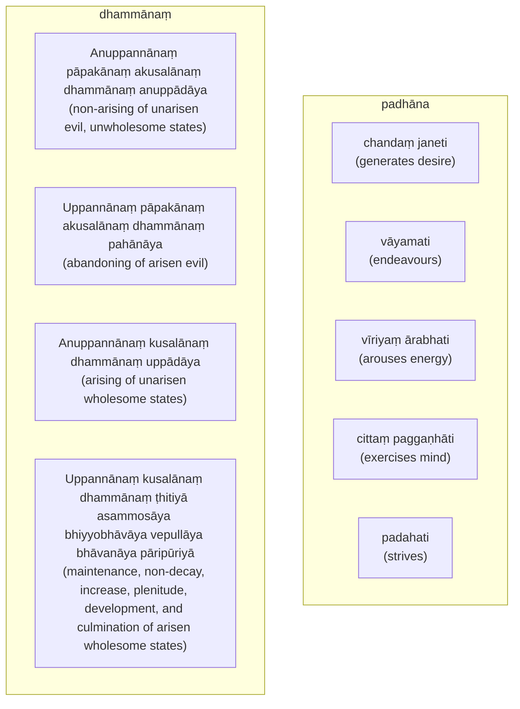

import { Tabs, TabItem } from '@astrojs/starlight/components';

[14S5/5.1.1--12 Pācīnādisutta](https://tipitaka2500.github.io/tipitaka/14S5/5/5.1/5.1.1--12.html)

<Tabs syncKey="paliquote">
<TabItem label="My Translation">
1284. [The Bhagavā] was staying at Sāvatthī.

There, indeed, the Bhagavā said this:

> "These, bhikkhave, are the four right exertions. Which four? Here, bhikkhave,
> * A bhikkhu generates desire, endeavours, arouses energy, exercises his mind, and strives for the non-arising of unarisen evil, unwholesome states.
> * He generates desire, endeavours, arouses energy, exercises his mind, and strives for the abandoning of arisen evil.
> * He generates desire, endeavours, arouses energy, exercises his mind, and strives for the abandoning of arisen evil.
> * He generates desire, endeavours, arouses energy, exercises his mind, and strives for the arising of unarisen wholesome states.
> * He generates desire, endeavours, arouses energy, exercises his mind, and strives for the maintenance, non-decay, increase, plenitude, development, and culmination of arisen wholesome states.

> These, bhikkhave, are the four right exertions."
</TabItem>

<TabItem label="Pāḷi (Roman IAST)">
1284\. Sāvatthinidānaṃ. Tatra kho bhagavā etadavoca—  “cattārome, bhikkhave, sammappadhānā. Katame cattāro? Idha, bhikkhave, bhikkhu anuppannānaṃ pāpakānaṃ akusalānaṃ dhammānaṃ anuppādāya chandaṃ janeti vāyamati vīriyaṃ ārabhati cittaṃ paggaṇhāti padahati. Uppannānaṃ pāpakānaṃ akusalānaṃ dhammānaṃ pahānāya chandaṃ janeti vāyamati vīriyaṃ ārabhati cittaṃ paggaṇhāti padahati. Anuppannānaṃ kusalānaṃ dhammānaṃ uppādāya chandaṃ janeti vāyamati vīriyaṃ ārabhati cittaṃ paggaṇhāti padahati. Uppannānaṃ kusalānaṃ dhammānaṃ ṭhitiyā asammosāya bhiyyobhāvāya vepullāya bhāvanāya pāripūriyā chandaṃ janeti vāyamati vīriyaṃ ārabhati cittaṃ paggaṇhāti padahati. Ime kho, bhikkhave, cattāro sammappadhānāti.
</TabItem>

<TabItem label="Pāḷi (Brahmi)">
1284\. 𑀲𑀸𑀯𑀢𑁆𑀣𑀺𑀦𑀺𑀤𑀸𑀦𑀁. 𑀢𑀢𑁆𑀭 𑀔𑁄 𑀪𑀕𑀯𑀸 𑀏𑀢𑀤𑀯𑁄𑀘—  “𑀘𑀢𑁆𑀢𑀸𑀭𑁄𑀫𑁂, 𑀪𑀺𑀓𑁆𑀔𑀯𑁂, 𑀲𑀫𑁆𑀫𑀧𑁆𑀧𑀥𑀸𑀦𑀸. 𑀓𑀢𑀫𑁂 𑀘𑀢𑁆𑀢𑀸𑀭𑁄? 𑀇𑀥, 𑀪𑀺𑀓𑁆𑀔𑀯𑁂, 𑀪𑀺𑀓𑁆𑀔𑀼 𑀅𑀦𑀼𑀧𑁆𑀧𑀦𑁆𑀦𑀸𑀦𑀁 𑀧𑀸𑀧𑀓𑀸𑀦𑀁 𑀅𑀓𑀼𑀲𑀮𑀸𑀦𑀁 𑀥𑀫𑁆𑀫𑀸𑀦𑀁 𑀅𑀦𑀼𑀧𑁆𑀧𑀸𑀤𑀸𑀬 𑀙𑀦𑁆𑀤𑀁 𑀚𑀦𑁂𑀢𑀺 𑀯𑀸𑀬𑀫𑀢𑀺 𑀯𑀻𑀭𑀺𑀬𑀁 𑀆𑀭𑀪𑀢𑀺 𑀘𑀺𑀢𑁆𑀢𑀁 𑀧𑀕𑁆𑀕𑀡𑁆𑀳𑀸𑀢𑀺 𑀧𑀤𑀳𑀢𑀺. 𑀉𑀧𑁆𑀧𑀦𑁆𑀦𑀸𑀦𑀁 𑀧𑀸𑀧𑀓𑀸𑀦𑀁 𑀅𑀓𑀼𑀲𑀮𑀸𑀦𑀁 𑀥𑀫𑁆𑀫𑀸𑀦𑀁 𑀧𑀳𑀸𑀦𑀸𑀬 𑀙𑀦𑁆𑀤𑀁 𑀚𑀦𑁂𑀢𑀺 𑀯𑀸𑀬𑀫𑀢𑀺 𑀯𑀻𑀭𑀺𑀬𑀁 𑀆𑀭𑀪𑀢𑀺 𑀘𑀺𑀢𑁆𑀢𑀁 𑀧𑀕𑁆𑀕𑀡𑁆𑀳𑀸𑀢𑀺 𑀧𑀤𑀳𑀢𑀺. 𑀅𑀦𑀼𑀧𑁆𑀧𑀦𑁆𑀦𑀸𑀦𑀁 𑀓𑀼𑀲𑀮𑀸𑀦𑀁 𑀥𑀫𑁆𑀫𑀸𑀦𑀁 𑀉𑀧𑁆𑀧𑀸𑀤𑀸𑀬 𑀙𑀦𑁆𑀤𑀁 𑀚𑀦𑁂𑀢𑀺 𑀯𑀸𑀬𑀫𑀢𑀺 𑀯𑀻𑀭𑀺𑀬𑀁 𑀆𑀭𑀪𑀢𑀺 𑀘𑀺𑀢𑁆𑀢𑀁 𑀧𑀕𑁆𑀕𑀡𑁆𑀳𑀸𑀢𑀺 𑀧𑀤𑀳𑀢𑀺. 𑀉𑀧𑁆𑀧𑀦𑁆𑀦𑀸𑀦𑀁 𑀓𑀼𑀲𑀮𑀸𑀦𑀁 𑀥𑀫𑁆𑀫𑀸𑀦𑀁 𑀞𑀺𑀢𑀺𑀬𑀸 𑀅𑀲𑀫𑁆𑀫𑁄𑀲𑀸𑀬 𑀪𑀺𑀬𑁆𑀬𑁄𑀪𑀸𑀯𑀸𑀬 𑀯𑁂𑀧𑀼𑀮𑁆𑀮𑀸𑀬 𑀪𑀸𑀯𑀦𑀸𑀬 𑀧𑀸𑀭𑀺𑀧𑀽𑀭𑀺𑀬𑀸 𑀙𑀦𑁆𑀤𑀁 𑀚𑀦𑁂𑀢𑀺 𑀯𑀸𑀬𑀫𑀢𑀺 𑀯𑀻𑀭𑀺𑀬𑀁 𑀆𑀭𑀪𑀢𑀺 𑀘𑀺𑀢𑁆𑀢𑀁 𑀧𑀕𑁆𑀕𑀡𑁆𑀳𑀸𑀢𑀺 𑀧𑀤𑀳𑀢𑀺. 𑀇𑀫𑁂 𑀔𑁄, 𑀪𑀺𑀓𑁆𑀔𑀯𑁂, 𑀘𑀢𑁆𑀢𑀸𑀭𑁄 𑀲𑀫𑁆𑀫𑀧𑁆𑀧𑀥𑀸𑀦𑀸𑀢𑀺.
</TabItem>
</Tabs>

