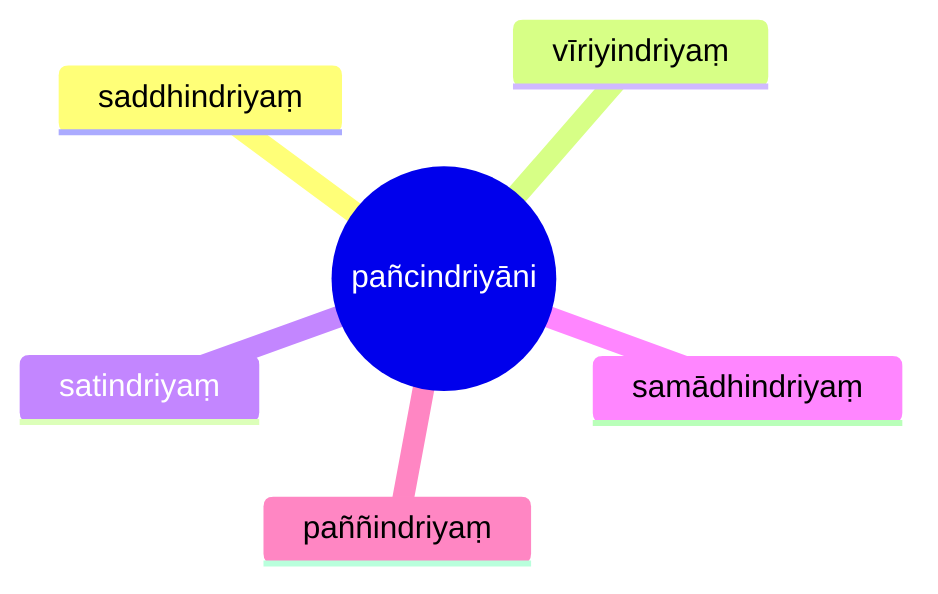

import { Tabs, TabItem } from '@astrojs/starlight/components';

[14S5/4.1.1 Suddhikasutta](https://tipitaka2500.github.io/tipitaka/14S5/4/4.1/4.1.1.html)

<Tabs syncKey="paliquote">
<TabItem label="My Translation">
1000\. [The Bhagavā] was staying at Sāvatthī.

There, the Bhagavā said this:

> “Bhikkhave, these are the `pañcindriyāni` (five faculties). Which five?
>
> * The faculty of `saddha` (faith),
> * the faculty of `vīriya` (energy),
> * the faculty of `sati` (awareness),
> * the faculty of `samādhi` (focus),
> * the faculty of `paññā` (wisdom) —
>
> these, bhikkhave, are the five faculties.”
</TabItem>

<TabItem label="Pāḷi (Roman IAST)">
1000\. Sāvatthinidānaṃ. Tatra kho bhagavā etadavoca. “Pañcimāni, bhikkhave, indriyāni. Katamāni pañca? Saddhindriyaṃ, vīriyindriyaṃ, satindriyaṃ, samādhindriyaṃ, paññindriyaṃ—  imāni kho, bhikkhave, pañcindriyānī”ti.
</TabItem>

<TabItem label="Pāḷi (Brahmi)">
1000\. 𑀲𑀸𑀯𑀢𑁆𑀣𑀺𑀦𑀺𑀤𑀸𑀦𑀁. 𑀢𑀢𑁆𑀭 𑀔𑁄 𑀪𑀕𑀯𑀸 𑀏𑀢𑀤𑀯𑁄𑀘. “𑀧𑀜𑁆𑀘𑀺𑀫𑀸𑀦𑀺, 𑀪𑀺𑀓𑁆𑀔𑀯𑁂, 𑀇𑀦𑁆𑀤𑁆𑀭𑀺𑀬𑀸𑀦𑀺. 𑀓𑀢𑀫𑀸𑀦𑀺 𑀧𑀜𑁆𑀘? 𑀲𑀤𑁆𑀥𑀺𑀦𑁆𑀤𑁆𑀭𑀺𑀬𑀁, 𑀯𑀻𑀭𑀺𑀬𑀺𑀦𑁆𑀤𑁆𑀭𑀺𑀬𑀁, 𑀲𑀢𑀺𑀦𑁆𑀤𑁆𑀭𑀺𑀬𑀁, 𑀲𑀫𑀸𑀥𑀺𑀦𑁆𑀤𑁆𑀭𑀺𑀬𑀁, 𑀧𑀜𑁆𑀜𑀺𑀦𑁆𑀤𑁆𑀭𑀺𑀬𑀁—  𑀇𑀫𑀸𑀦𑀺 𑀔𑁄, 𑀪𑀺𑀓𑁆𑀔𑀯𑁂, 𑀧𑀜𑁆𑀘𑀺𑀦𑁆𑀤𑁆𑀭𑀺𑀬𑀸𑀦𑀻”𑀢𑀺.
</TabItem>
</Tabs>

