This section of the website provides summaries of what is considered the core teachings of the Buddha, which are topics common across the canons of the various sects of Buddhism, and hence presumed to reflect a presectarian view of what the Buddha might have taught.

Various scholars such as André Migot, Edward J. Thomas, Erich Frauwallner, Rupert Gethin, and Johannes Bronkhorst have speculated that the Abhidharma of various sects were based on early and ancient lists of doctrinal terms which are called `mātikā` ([S]`mātṛkā`).

According Frauwallner[^Frauwallner1996] in pg. 3:

> The oldest Buddhist tradition has no Abhidharmapitaka but only mātṛkā. What this means is that besides the small number of fundamental doctrinal statements, the Buddha's sermons also contain a quantity of doctrinal concepts. The most suitable form for collecting and preserving these concepts would have been comprehensive lists. Lists of this kind were called mātṛkā, and it was from these lists that the Abhidharma later developed.

[^Frauwallner1996]: Frauwallner, Erich. Kidd, Sophie Francis (translator). Steinkellner, Ernst (editor) 1996. Studies in Abhidharma Literature and the Origins of Buddhist Philosophical Systems. SUNY Press. pp. 18, 100.

The following diagram shows the relationship between the various topics across the mātikās of the Abhidhamma texts of three schools (Theravāda Vibhaṅga, Sarvāstivāda Dharmaskandha, Dharmagupta Śāriputrābhidharma), originally identified by Frauwallner[^Frauwallner1996] and subsequently summarised by Sujato. The terms in **bold** are common across the mātikās and hence assumed to be pre-sectarian.

```mermaid
graph LR
  subgraph T["Theravāda Vibhaṅga"]
  direction TB
    T1["`5 **collections**
    (pañcakkhandhā)`"]
    T2["`12 **sense bases**
    (dvādasāyatanāni)`"]
    T3["`36 **properties**
    (dhātuyo)`"]
    T4["`4 **realisations**
    (cattāri ariyasaccāni)`"]
    T5["`22 **mental faculties**
    (bāvīsatindriyāni)`"]
    T6["`**Dependent origination**
    (paṭiccasamuppādo)`"]
    T7["`4 **reflections**
    (cattāro satipaṭṭhānā)`"]
    T8["`4 **right efforts**
    (cattāro sammappadhānā)`"]
    T9["`4 **bases for success**
    (cattāro iddhipādā)`"]
    T10["`7 **awakening factors**
    (satta bojjhaṅgā)`"]
    T11["`**8-fold path**
    (ariyo aṭṭhaṅgiko maggo)`"]
    T12["`4 **mental dispositions**
    (jhānā)`"]
    T13["`4 states of mind
    (catasso appamaññāyo)`"]
    T14["`5 **precepts**
    (pañca sikkhāpadāni)`"]
    T15["`4 analytical knowledges
    (catasso paṭisambhidā)`"]
    T16["`minor topics
    (khuddakavatthu)`"]
    T17["`knowledges
    (ñāṇa)`"]
    T18["`core dhammas
    (dhammahadaya)`"]
  end
  subgraph S["Sarvāstivāda Dharmaskandha"]
    direction TB
    S1["`5 **precepts**`"]
    S2["`4 stream-entry factors`"]
    S3["`4 confirmed faiths`"]
    S4["`4 fruits of asceticism`"]
    S5["`4 ways of practice`"]
    S6["`4 noble lineages`"]
    S7["`4 **right efforts**`"]
    S8["`4 **bases for success**`"]
    S9["`4 **reflections**`"]
    S10["`4 **realisations**`"]
    S11["`4 **mental dispositions**`"]
    S12["`4 states of mind`"]
    S13["`4 formless`"]
    S14["`4 focus factors (samādhi)`"]
    S15["`7 **awakening factors**`"]
    S16["`minor topics`"]
    S17["`22 **mental faculties**`"]
    S18["`12 **sense bases**`"]
    S19["`5 **collections**`"]
    S20["`62 **properties**`"]
    S21["`**dependent origination**`"]
  end
  subgraph D["Dharmagupta Śāriputrābhidharma"]
    direction TB
    D1["`12 **sense bases**`"]
    D2["`18 **properties**`"]
    D3["`5 **collections**`"]
    D4["`4 **realisations**`"]
    D5["`22 **mental faculties**`"]
    D6["`7 **awakening factors**`"]
    D7["`3 unskilful roots`"]
    D8["`3 skilful roots`"]
    D9["`4 great elements`"]
    D10["`5 **precepts**`"]
    D11["`Elements`"]
    D12["`Kamma`"]
    D13["`Persons`"]
    D14["`Knowledge`"]
    D15["`Dependent origination`"]
    D16["`4 **reflections**`"]
    D17["`4 **right efforts**`"]
    D18["`4 **bases for success**`"]
    D19["`4 **mental dispositions**`"]
    D20["`**8-fold path**`"]
    D21["`Unskilful dhammas`"]
    D22["`Saṅgraha`"]
    D23["`Sampayoga`"]
    D24["`Prasthāna`"]
  end
  T1 <--> S19
  T2 <--> S18
  T3 <--> S20
  T4 <--> S10
  T5 <--> S17
  T6 <--> S21
  T7 <--> S9
  T8 <--> S7
  T9 <--> S8
  T10 <--> S15
  T11 <--> D20
  T12 <--> S11
  T13 <--> S12
  T14 <--> S1
  T16 <--> S16
  S1 <--> D10
  S7 <--> D17
  S8 <--> D18
  S9 <--> D16
  S10 <--> D4
  S11 <--> D19
  S15 <--> D6
  S17 <--> D5
  S18 <--> D1
  S19 <--> D3
  S20 <--> D2
  S21 <--> D15
```

## 37 awakening qualities

According to Analayo[^Analayo2014], another important doctrinal list which appears in the early texts is the "thirty seven qualities that are conducive to awakening" (`bodhipākṣikā dharmāḥ`).[^Analayo2014] This mātṛkā appears in various sūtras, like the Pāsādika-sutta, the Sāmagāma-sutta (and their parallels), and in the Mahāparinirvāṇa-sūtra, where it is said to have been taught by the Buddha just before passing away.

[^Analayo2014]: Anālayo (2014) "The Dawn of Abhidharma," p. 48. Hamburg University Press.
