import { Tabs, TabItem, CardGrid, LinkCard } from '@astrojs/starlight/components';

This section of the website provides summaries of what is considered the core teachings of the Buddha, which are topics common across the canons of the various sects of Buddhism.

## Early discourses

The first three discourses are fully embedded within the Mahākhandhaka, which is part of the Vinaya, and Frauwallner argues represent an early presectarian view of what the Buddha would have taught in the early days after awakening. Some scholars argue that these discourses may not have accurately reflected how he actually taught but are reconstructions of his key teachings framed against a biographical narrative.

Regardless, these discourses represent a universally agreed view across all Buddhist sects of the Buddha's key teachings.

The first three discourses are included as individual suttas in the Saṃyutta Nikāya in the Pāḷi canon (with corresponding parallels in the other canons):

* [14S5/12.2.1 Dhammacakkappavattanasutta](https://tipitaka2500.github.io/tipitaka/14S5/12/12.2/12.2.1.html) - setting the wheel of Dhamma rolling forward
* [13S3/1.2.1.7 Anattalakkhaṇasutta](https://tipitaka2500.github.io/tipitaka/13S3/1/1.2/1.2.1/1.2.1.7.html) - the characteristic of not-self
* [13S4/1.4.3.8 Ādittapariyāyasutta](https://tipitaka2500.github.io/tipitaka/13S4/1/1.4/1.4.3/1.4.3.8.html) - the parable on burning

## Factors related to awakening (`bodhipakkhiyā dhammā`)

According to Analayo[^Analayo2014], another important doctrinal list which appears in the early texts is the "thirty seven qualities that are conducive to awakening" (`bodhipākṣikā dharmāḥ`).[^Analayo2014] This mātṛkā appears in various sūtras, like the Pāsādika-sutta, the Sāmagāma-sutta (and their parallels), and in the Mahāparinirvāṇa-sūtra, where it is said to have been taught by the Buddha just before passing away.

[^Analayo2014]: Anālayo (2014) "The Dawn of Abhidharma," p. 48. Hamburg University Press.

[7D/3.20 Ānandayācanakathā](https://tipitaka2500.github.io/tipitaka/7D/3/3.20.html):

<Tabs syncKey="paliquote">
<TabItem label="My Translation">
> 403\. Then the Bhagavā approached the assembly hall; having approached, he sat down on the seat prepared for him. Having sat down, the Bhagavā addressed the bhikkhū —
>
> > “Therefore, bhikkhave, those teachings that I have taught after direct knowledge, you should carefully learn them, practice them, and cultivate them extensively, so that this optimal life may endure for a long time, for the benefit of many, for the happiness of many, out of compassion for the world, for the good, welfare, and happiness of gods and humans. And what are those teachings, bhikkhave, that I have taught after direct knowledge, which you should carefully learn, practice, and cultivate extensively, so that this holy life may endure for a long time, for the benefit of many, for the happiness of many, out of compassion for the world, for the good, welfare, and happiness of gods and humans? Namely—
> >
> > * `cattāro satipaṭṭhānā` (the four reflections),
> > * `cattāro sammappadhānā` (the four right exertions),
> > * `cattāro iddhipādā` (the four bases for success),
> > * `pañcindriyāni` (the five faculties),
> > * `pañca balāni` (the five powers),
> > * `satta bojjhaṅgā` (the seven awakening factors),
> > * `ariyo aṭṭhaṅgiko maggo` (the eightfold path).
> >
> > These, bhikkhave, are the teachings that I have taught after direct knowledge, which you should carefully learn, practice, and cultivate extensively, so that this optimal life may endure for a long time, for the benefit of many, for the happiness of many, out of compassion for the world, for the good, welfare, and happiness of gods and mankind.
</TabItem>

<TabItem label="Pāḷi (Roman IAST)">
> 403\. Atha kho bhagavā yenupaṭṭhānasālā tenupasaṅkami; upasaṅkamitvā paññatte āsane nisīdi. Nisajja kho bhagavā bhikkhū āmantesi—  “tasmātiha, bhikkhave, ye te mayā dhammā abhiññā desitā, te vo sādhukaṃ uggahetvā āsevitabbā bhāvetabbā bahulīkātabbā, yathayidaṃ brahmacariyaṃ addhaniyaṃ assa ciraṭṭhitikaṃ, tadassa bahujanahitāya bahujanasukhāya lokānukampāya atthāya hitāya sukhāya devamanussānaṃ. Katame ca te, bhikkhave, dhammā mayā abhiññā desitā, ye vo sādhukaṃ uggahetvā āsevitabbā bhāvetabbā bahulīkātabbā, yathayidaṃ brahmacariyaṃ addhaniyaṃ assa ciraṭṭhitikaṃ, tadassa bahujanahitāya bahujanasukhāya lokānukampāya atthāya hitāya sukhāya devamanussānaṃ. Seyyathidaṃ—  cattāro satipaṭṭhānā, cattāro sammappadhānā, cattāro iddhipādā, pañcindriyāni, pañca balāni, satta bojjhaṅgā, ariyo aṭṭhaṅgiko maggo. Ime kho te, bhikkhave, dhammā mayā abhiññā desitā, ye vo sādhukaṃ uggahetvā āsevitabbā bhāvetabbā bahulīkātabbā, yathayidaṃ brahmacariyaṃ addhaniyaṃ assa ciraṭṭhitikaṃ, tadassa bahujanahitāya bahujanasukhāya lokānukampāya atthāya hitāya sukhāya devamanussānan”ti.
</TabItem>

<TabItem label="Pāḷi (Brahmi)">
> 403\. 𑀅𑀣 𑀔𑁄 𑀪𑀕𑀯𑀸 𑀬𑁂𑀦𑀼𑀧𑀝𑁆𑀞𑀸𑀦𑀲𑀸𑀮𑀸 𑀢𑁂𑀦𑀼𑀧𑀲𑀗𑁆𑀓𑀫𑀺; 𑀉𑀧𑀲𑀗𑁆𑀓𑀫𑀺𑀢𑁆𑀯𑀸 𑀧𑀜𑁆𑀜𑀢𑁆𑀢𑁂 𑀆𑀲𑀦𑁂 𑀦𑀺𑀲𑀻𑀤𑀺. 𑀦𑀺𑀲𑀚𑁆𑀚 𑀔𑁄 𑀪𑀕𑀯𑀸 𑀪𑀺𑀓𑁆𑀔𑀽 𑀆𑀫𑀦𑁆𑀢𑁂𑀲𑀺—  “𑀢𑀲𑁆𑀫𑀸𑀢𑀺𑀳, 𑀪𑀺𑀓𑁆𑀔𑀯𑁂, 𑀬𑁂 𑀢𑁂 𑀫𑀬𑀸 𑀥𑀫𑁆𑀫𑀸 𑀅𑀪𑀺𑀜𑁆𑀜𑀸 𑀤𑁂𑀲𑀺𑀢𑀸, 𑀢𑁂 𑀯𑁄 𑀲𑀸𑀥𑀼𑀓𑀁 𑀉𑀕𑁆𑀕𑀳𑁂𑀢𑁆𑀯𑀸 𑀆𑀲𑁂𑀯𑀺𑀢𑀩𑁆𑀩𑀸 𑀪𑀸𑀯𑁂𑀢𑀩𑁆𑀩𑀸 𑀩𑀳𑀼𑀮𑀻𑀓𑀸𑀢𑀩𑁆𑀩𑀸, 𑀬𑀣𑀬𑀺𑀤𑀁 𑀩𑁆𑀭𑀳𑁆𑀫𑀘𑀭𑀺𑀬𑀁 𑀅𑀤𑁆𑀥𑀦𑀺𑀬𑀁 𑀅𑀲𑁆𑀲 𑀘𑀺𑀭𑀝𑁆𑀞𑀺𑀢𑀺𑀓𑀁, 𑀢𑀤𑀲𑁆𑀲 𑀩𑀳𑀼𑀚𑀦𑀳𑀺𑀢𑀸𑀬 𑀩𑀳𑀼𑀚𑀦𑀲𑀼𑀔𑀸𑀬 𑀮𑁄𑀓𑀸𑀦𑀼𑀓𑀫𑁆𑀧𑀸𑀬 𑀅𑀢𑁆𑀣𑀸𑀬 𑀳𑀺𑀢𑀸𑀬 𑀲𑀼𑀔𑀸𑀬 𑀤𑁂𑀯𑀫𑀦𑀼𑀲𑁆𑀲𑀸𑀦𑀁. 𑀓𑀢𑀫𑁂 𑀘 𑀢𑁂, 𑀪𑀺𑀓𑁆𑀔𑀯𑁂, 𑀥𑀫𑁆𑀫𑀸 𑀫𑀬𑀸 𑀅𑀪𑀺𑀜𑁆𑀜𑀸 𑀤𑁂𑀲𑀺𑀢𑀸, 𑀬𑁂 𑀯𑁄 𑀲𑀸𑀥𑀼𑀓𑀁 𑀉𑀕𑁆𑀕𑀳𑁂𑀢𑁆𑀯𑀸 𑀆𑀲𑁂𑀯𑀺𑀢𑀩𑁆𑀩𑀸 𑀪𑀸𑀯𑁂𑀢𑀩𑁆𑀩𑀸 𑀩𑀳𑀼𑀮𑀻𑀓𑀸𑀢𑀩𑁆𑀩𑀸, 𑀬𑀣𑀬𑀺𑀤𑀁 𑀩𑁆𑀭𑀳𑁆𑀫𑀘𑀭𑀺𑀬𑀁 𑀅𑀤𑁆𑀥𑀦𑀺𑀬𑀁 𑀅𑀲𑁆𑀲 𑀘𑀺𑀭𑀝𑁆𑀞𑀺𑀢𑀺𑀓𑀁, 𑀢𑀤𑀲𑁆𑀲 𑀩𑀳𑀼𑀚𑀦𑀳𑀺𑀢𑀸𑀬 𑀩𑀳𑀼𑀚𑀦𑀲𑀼𑀔𑀸𑀬 𑀮𑁄𑀓𑀸𑀦𑀼𑀓𑀫𑁆𑀧𑀸𑀬 𑀅𑀢𑁆𑀣𑀸𑀬 𑀳𑀺𑀢𑀸𑀬 𑀲𑀼𑀔𑀸𑀬 𑀤𑁂𑀯𑀫𑀦𑀼𑀲𑁆𑀲𑀸𑀦𑀁. 𑀲𑁂𑀬𑁆𑀬𑀣𑀺𑀤𑀁—  𑀘𑀢𑁆𑀢𑀸𑀭𑁄 𑀲𑀢𑀺𑀧𑀝𑁆𑀞𑀸𑀦𑀸, 𑀘𑀢𑁆𑀢𑀸𑀭𑁄 𑀲𑀫𑁆𑀫𑀧𑁆𑀧𑀥𑀸𑀦𑀸, 𑀘𑀢𑁆𑀢𑀸𑀭𑁄 𑀇𑀤𑁆𑀥𑀺𑀧𑀸𑀤𑀸, 𑀧𑀜𑁆𑀘𑀺𑀦𑁆𑀤𑁆𑀭𑀺𑀬𑀸𑀦𑀺, 𑀧𑀜𑁆𑀘 𑀩𑀮𑀸𑀦𑀺, 𑀲𑀢𑁆𑀢 𑀩𑁄𑀚𑁆𑀛𑀗𑁆𑀕𑀸, 𑀅𑀭𑀺𑀬𑁄 𑀅𑀝𑁆𑀞𑀗𑁆𑀕𑀺𑀓𑁄 𑀫𑀕𑁆𑀕𑁄. 𑀇𑀫𑁂 𑀔𑁄 𑀢𑁂, 𑀪𑀺𑀓𑁆𑀔𑀯𑁂, 𑀥𑀫𑁆𑀫𑀸 𑀫𑀬𑀸 𑀅𑀪𑀺𑀜𑁆𑀜𑀸 𑀤𑁂𑀲𑀺𑀢𑀸, 𑀬𑁂 𑀯𑁄 𑀲𑀸𑀥𑀼𑀓𑀁 𑀉𑀕𑁆𑀕𑀳𑁂𑀢𑁆𑀯𑀸 𑀆𑀲𑁂𑀯𑀺𑀢𑀩𑁆𑀩𑀸 𑀪𑀸𑀯𑁂𑀢𑀩𑁆𑀩𑀸 𑀩𑀳𑀼𑀮𑀻𑀓𑀸𑀢𑀩𑁆𑀩𑀸, 𑀬𑀣𑀬𑀺𑀤𑀁 𑀩𑁆𑀭𑀳𑁆𑀫𑀘𑀭𑀺𑀬𑀁 𑀅𑀤𑁆𑀥𑀦𑀺𑀬𑀁 𑀅𑀲𑁆𑀲 𑀘𑀺𑀭𑀝𑁆𑀞𑀺𑀢𑀺𑀓𑀁, 𑀢𑀤𑀲𑁆𑀲 𑀩𑀳𑀼𑀚𑀦𑀳𑀺𑀢𑀸𑀬 𑀩𑀳𑀼𑀚𑀦𑀲𑀼𑀔𑀸𑀬 𑀮𑁄𑀓𑀸𑀦𑀼𑀓𑀫𑁆𑀧𑀸𑀬 𑀅𑀢𑁆𑀣𑀸𑀬 𑀳𑀺𑀢𑀸𑀬 𑀲𑀼𑀔𑀸𑀬 𑀤𑁂𑀯𑀫𑀦𑀼𑀲𑁆𑀲𑀸𑀦𑀦𑁆”𑀢𑀺.
</TabItem>
</Tabs>

## Abhidharma parallels

Various scholars such as André Migot, Edward J. Thomas, Erich Frauwallner, Rupert Gethin, and Johannes Bronkhorst have speculated that the Abhidharma of various sects were based on early and ancient lists of doctrinal terms which are called `mātikā` ([S]`mātṛkā`).

According Frauwallner[^Frauwallner1996] in pg. 3:

> The oldest Buddhist tradition has no Abhidharmapitaka but only mātṛkā. What this means is that besides the small number of fundamental doctrinal statements, the Buddha's sermons also contain a quantity of doctrinal concepts. The most suitable form for collecting and preserving these concepts would have been comprehensive lists. Lists of this kind were called mātṛkā, and it was from these lists that the Abhidharma later developed.

[^Frauwallner1996]: Frauwallner, Erich. Kidd, Sophie Francis (translator). Steinkellner, Ernst (editor) 1996. Studies in Abhidharma Literature and the Origins of Buddhist Philosophical Systems. SUNY Press. pp. 18, 100.

The following diagram shows the relationship between the various topics across the mātikās of the Abhidhamma texts of three schools (Theravāda Vibhaṅga, Sarvāstivāda Dharmaskandha, Dharmagupta Śāriputrābhidharma), originally identified by Frauwallner[^Frauwallner1996] and subsequently summarised by Sujato. The terms in **bold** are common across the mātikās and hence assumed to be pre-sectarian.

```mermaid
graph LR
  subgraph T["Theravāda Vibhaṅga"]
  direction TB
    T1["`5 **collections**
    (pañcakkhandhā)`"]
    T2["`12 **sense bases**
    (dvādasāyatanāni)`"]
    T3["`36 **properties**
    (dhātuyo)`"]
    T4["`4 **realisations**
    (cattāri ariyasaccāni)`"]
    T5["`22 **mental faculties**
    (bāvīsatindriyāni)`"]
    T6["`**Dependent origination**
    (paṭiccasamuppādo)`"]
    T7["`4 **reflections**
    (cattāro satipaṭṭhānā)`"]
    T8["`4 **right exertions**
    (cattāro sammappadhānā)`"]
    T9["`4 **bases for success**
    (cattāro iddhipādā)`"]
    T10["`7 **awakening factors**
    (satta bojjhaṅgā)`"]
    T11["`**8-fold path**
    (ariyo aṭṭhaṅgiko maggo)`"]
    T12["`4 **mental dispositions**
    (jhānā)`"]
    T13["`4 states of mind
    (catasso appamaññāyo)`"]
    T14["`5 **precepts**
    (pañca sikkhāpadāni)`"]
    T15["`4 analytical knowledges
    (catasso paṭisambhidā)`"]
    T16["`minor topics
    (khuddakavatthu)`"]
    T17["`knowledges
    (ñāṇa)`"]
    T18["`core dhammas
    (dhammahadaya)`"]
  end
  subgraph S["Sarvāstivāda Dharmaskandha"]
    direction TB
    S1["`5 **precepts**`"]
    S2["`4 stream-entry factors`"]
    S3["`4 confirmed faiths`"]
    S4["`4 fruits of asceticism`"]
    S5["`4 ways of practice`"]
    S6["`4 noble lineages`"]
    S7["`4 **right exertions**`"]
    S8["`4 **bases for success**`"]
    S9["`4 **reflections**`"]
    S10["`4 **realisations**`"]
    S11["`4 **mental dispositions**`"]
    S12["`4 states of mind`"]
    S13["`4 formless`"]
    S14["`4 focus factors (samādhi)`"]
    S15["`7 **awakening factors**`"]
    S16["`minor topics`"]
    S17["`22 **mental faculties**`"]
    S18["`12 **sense bases**`"]
    S19["`5 **collections**`"]
    S20["`62 **properties**`"]
    S21["`**dependent origination**`"]
  end
  subgraph D["Dharmagupta Śāriputrābhidharma"]
    direction TB
    D1["`12 **sense bases**`"]
    D2["`18 **properties**`"]
    D3["`5 **collections**`"]
    D4["`4 **realisations**`"]
    D5["`22 **mental faculties**`"]
    D6["`7 **awakening factors**`"]
    D7["`3 unskilful roots`"]
    D8["`3 skilful roots`"]
    D9["`4 great elements`"]
    D10["`5 **precepts**`"]
    D11["`Elements`"]
    D12["`Kamma`"]
    D13["`Persons`"]
    D14["`Knowledge`"]
    D15["`Dependent origination`"]
    D16["`4 **reflections**`"]
    D17["`4 **right exertions**`"]
    D18["`4 **bases for success**`"]
    D19["`4 **mental dispositions**`"]
    D20["`**8-fold path**`"]
    D21["`Unskilful dhammas`"]
    D22["`Saṅgraha`"]
    D23["`Sampayoga`"]
    D24["`Prasthāna`"]
  end
  T1 <--> S19
  T2 <--> S18
  T3 <--> S20
  T4 <--> S10
  T5 <--> S17
  T6 <--> S21
  T7 <--> S9
  T8 <--> S7
  T9 <--> S8
  T10 <--> S15
  T11 <--> D20
  T12 <--> S11
  T13 <--> S12
  T14 <--> S1
  T16 <--> S16
  S1 <--> D10
  S7 <--> D17
  S8 <--> D18
  S9 <--> D16
  S10 <--> D4
  S11 <--> D19
  S15 <--> D6
  S17 <--> D5
  S18 <--> D1
  S19 <--> D3
  S20 <--> D2
  S21 <--> D15
```

## Reconstructed core teachings

Based on the above analysis, the following can be regarded as the core teachings of the Buddha, presented roughly in the order that they would have been developed over the Buddha's lifetime.

### Core concepts in the first three discourses

<CardGrid>
<LinkCard title="Dependent Origination" href="/buddhavacana/sutta/deporig" />
</CardGrid>

In addition, the Mahākhandhaka also lists the five precepts, originally intended as rules for novices. This has been adopted more widely amongst Buddhists (and expanded into eight precepts, ten precepts etc.) but it is unclear whether these precepts were originally anything more than a minimal set of guidance for young novices so that they meet community standards for moral behaviour and appropriate conduct.

###  Factors related to awakening (`bodhipakkhiyā dhammā`)

These are a set of concepts listed in various suttas, common across different sects:

* `cattāro satipaṭṭhānā` (the four reflections),
* `cattāro sammappadhānā` (the four right exertions),
* `cattāro iddhipādā` (the four bases for success),
* `pañcindriyāni` (the five faculties),
* `pañca balāni` (the five powers),
* `satta bojjhaṅgā` (the seven awakening factors),
* `ariyo aṭṭhaṅgiko maggo` (the eightfold path).

### Additional pre-sectarian concepts

These concepts are common across the Abhidharma literature of three different sects, so these presumably represent pre-sectarian teaching.

* `dhātuyo` (properties)
* `jhānā` (4 mental dispositions)

## Later additions or "non-core" teachings

The following is a non-exhaustive list of concepts that are likely to have been introduced following the Buddha's death and unlikely to have been taught by him:

* kamma - this is a Jain concept, and not mentioned at all in the Vinaya
* 4 states of mind (`catasso appamaññāyo`), also referred to as the "divine dwellings" - these are not common across the literature of the various sects so presumably is a later addition
* the four stages of liberation - also not discussed in the Vinaya, and not common across the Abhidharma literature of the various sects
* arupa jhānā - these are Jain meditative techniques, two of which were refuted by the Buddha in [9M/3.6 Pāsarāsisutta](https://tipitaka2500.github.io/tipitaka/9M/3/3.6.html) and [9M/4.6 Mahāsaccakasutta](https://tipitaka2500.github.io/tipitaka/9M/4/4.6.html), also not common across the Abhidharma literature of the various sects
* the three higher knowledge - not mentioned in the Mahākhandhaka, also refuted as a necessary prerequisite to liberation in [12S2/1.7.10 Susimaparibbājakasutta](https://tipitaka2500.github.io/tipitaka/12S2/1/1.7/1.7.10.html).
* meditation - not mentioned in the Mahākhandhaka. Common concepts associated with meditation in the core teachings actually refer to other concepts such as awareness, reflective thinking and mental dispositions.

Accordingly, the above concepts will not be analysed any further in this website.
