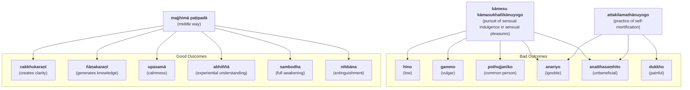

import { Tabs, TabItem } from '@astrojs/starlight/components';

The Middle Way is the primary feature of the Buddha's teaching, a moderate soteriological approach avoiding the extremes of sensual gratification and austerity practices such as self-mortification.

* [3V/1.6 Pañcavaggiyakathā #69](https://tipitaka2500.github.io/tipitaka/3V/1/1.6.html#69)
* [14S5/12.2.1 Dhammacakkappavattanasutta #2207](https://tipitaka2500.github.io/tipitaka/14S5/12/12.2/12.2.1.html#2207)

<Tabs syncKey="paliquote">
<TabItem label="My Translation">
“These two extremes, bhikkhave, should not be pursued by one who has gone forth (renounced). Which two?

* Pursuit of sensual indulgence in sensual pleasures, which is
  * low,
  * vulgar,
  * of the common person,
  * ignoble, and
  * unbeneficial; and
* Practice of self-mortification, which is
  * painful,
  * ignoble, and
  * unbeneficial.

Avoiding these two extremes, the Middle Way realised by the Tathagata

* creates clarity,
* generates knowledge, and
* leads to:
  * calmness,
  * experiential understanding,
  * full awakening,
  * Nibbāna (extinguishment).”
</TabItem>

<TabItem label="Pāḷi (Roman IAST)">
> “Dveme, bhikkhave, antā pabbajitena na sevitabbā. Katame dve? Yo cāyaṃ kāmesu kāmasukhallikānuyogo hīno gammo pothujjaniko anariyo anatthasaṃhito, yo cāyaṃ attakilamathānuyogo dukkho anariyo anatthasaṃhito. Ete kho, bhikkhave, ubho ante anupagamma majjhimā paṭipadā tathāgatena abhisambuddhā cakkhukaraṇī ñāṇakaraṇī upasamāya abhiññāya sambodhāya nibbānāya saṃvattati.
</TabItem>

<TabItem label="Pāḷi (Brahmi)">
> “𑀤𑁆𑀯𑁂𑀫𑁂, 𑀪𑀺𑀓𑁆𑀔𑀯𑁂, 𑀅𑀦𑁆𑀢𑀸 𑀧𑀩𑁆𑀩𑀚𑀺𑀢𑁂𑀦 𑀦 𑀲𑁂𑀯𑀺𑀢𑀩𑁆𑀩𑀸𑁇 𑀓𑀢𑀫𑁂 𑀤𑁆𑀯𑁂? 𑀬𑁄 𑀘𑀸𑀬𑀁 𑀓𑀸𑀫𑁂𑀲𑀼 𑀓𑀸𑀫𑀲𑀼𑀔𑀮𑁆𑀮𑀺𑀓𑀸𑀦𑀼𑀬𑁄𑀕𑁄 𑀳𑀻𑀦𑁄 𑀕𑀫𑁆𑀫𑁄 𑀧𑁄𑀣𑀼𑀚𑁆𑀚𑀦𑀺𑀓𑁄 𑀅𑀦𑀭𑀺𑀬𑁄 𑀅𑀦𑀢𑁆𑀣𑀲𑀁𑀳𑀺𑀢𑁄, 𑀬𑁄 𑀘𑀸𑀬𑀁 𑀅𑀢𑁆𑀢𑀓𑀺𑀮𑀫𑀣𑀸𑀦𑀼𑀬𑁄𑀕𑁄 𑀤𑀼𑀓𑁆𑀔𑁄 𑀅𑀦𑀭𑀺𑀬𑁄 𑀅𑀦𑀢𑁆𑀣𑀲𑀁𑀳𑀺𑀢𑁄𑁇 𑀏𑀢𑁂 𑀔𑁄, 𑀪𑀺𑀓𑁆𑀔𑀯𑁂, 𑀉𑀪𑁄 𑀅𑀦𑁆𑀢𑁂 𑀅𑀦𑀼𑀧𑀕𑀫𑁆𑀫 𑀫𑀚𑁆𑀛𑀺𑀫𑀸 𑀧𑀝𑀺𑀧𑀤𑀸 𑀢𑀣𑀸𑀕𑀢𑁂𑀦 𑀅𑀪𑀺𑀲𑀫𑁆𑀩𑀼𑀤𑁆𑀥𑀸 𑀘𑀓𑁆𑀔𑀼𑀓𑀭𑀡𑀻 𑀜𑀸𑀡𑀓𑀭𑀡𑀻 𑀉𑀧𑀲𑀫𑀸𑀬 𑀅𑀪𑀺𑀜𑁆𑀜𑀸𑀬 𑀲𑀫𑁆𑀩𑁄𑀥𑀸𑀬 𑀦𑀺𑀩𑁆𑀩𑀸𑀦𑀸𑀬 𑀲𑀁𑀯𑀢𑁆𑀢𑀢𑀺𑁇
</TabItem>
</Tabs>

## Summary

