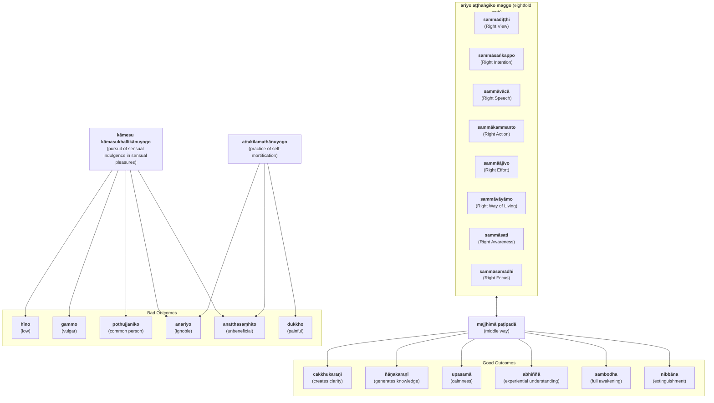

import { Tabs, TabItem } from '@astrojs/starlight/components';

The Middle Way is the primary feature of the Buddha's teaching, a moderate soteriological approach avoiding the extremes of sensual gratification and austerity practices such as self-mortification.

## Middle Way (`majjhimā paṭipadā`)
* [3V/1.6 Pañcavaggiyakathā #69](https://tipitaka2500.github.io/tipitaka/3V/1/1.6.html#69)
* [14S5/12.2.1 Dhammacakkappavattanasutta #2207](https://tipitaka2500.github.io/tipitaka/14S5/12/12.2/12.2.1.html#2207)

<Tabs syncKey="paliquote">
<TabItem label="My Translation">
“These two extremes, bhikkhave, should not be pursued by one who has gone forth (renounced). Which two?

* Pursuit of sensual indulgence in sensual pleasures, which is
  * low,
  * vulgar,
  * of the common person,
  * ignoble, and
  * unbeneficial; and
* Practice of self-mortification, which is
  * painful,
  * ignoble, and
  * unbeneficial.

Avoiding these two extremes, the Middle Way realised by the Tathagata

* creates clarity,
* generates knowledge, and
* leads to:
  * calmness,
  * experiential understanding,
  * full awakening,
  * Nibbāna (extinguishment).”
</TabItem>

<TabItem label="Pāḷi (Roman IAST)">
> “Dveme, bhikkhave, antā pabbajitena na sevitabbā. Katame dve? Yo cāyaṃ kāmesu kāmasukhallikānuyogo hīno gammo pothujjaniko anariyo anatthasaṃhito, yo cāyaṃ attakilamathānuyogo dukkho anariyo anatthasaṃhito. Ete kho, bhikkhave, ubho ante anupagamma majjhimā paṭipadā tathāgatena abhisambuddhā cakkhukaraṇī ñāṇakaraṇī upasamāya abhiññāya sambodhāya nibbānāya saṃvattati.
</TabItem>

<TabItem label="Pāḷi (Brahmi)">
> “𑀤𑁆𑀯𑁂𑀫𑁂, 𑀪𑀺𑀓𑁆𑀔𑀯𑁂, 𑀅𑀦𑁆𑀢𑀸 𑀧𑀩𑁆𑀩𑀚𑀺𑀢𑁂𑀦 𑀦 𑀲𑁂𑀯𑀺𑀢𑀩𑁆𑀩𑀸𑁇 𑀓𑀢𑀫𑁂 𑀤𑁆𑀯𑁂? 𑀬𑁄 𑀘𑀸𑀬𑀁 𑀓𑀸𑀫𑁂𑀲𑀼 𑀓𑀸𑀫𑀲𑀼𑀔𑀮𑁆𑀮𑀺𑀓𑀸𑀦𑀼𑀬𑁄𑀕𑁄 𑀳𑀻𑀦𑁄 𑀕𑀫𑁆𑀫𑁄 𑀧𑁄𑀣𑀼𑀚𑁆𑀚𑀦𑀺𑀓𑁄 𑀅𑀦𑀭𑀺𑀬𑁄 𑀅𑀦𑀢𑁆𑀣𑀲𑀁𑀳𑀺𑀢𑁄, 𑀬𑁄 𑀘𑀸𑀬𑀁 𑀅𑀢𑁆𑀢𑀓𑀺𑀮𑀫𑀣𑀸𑀦𑀼𑀬𑁄𑀕𑁄 𑀤𑀼𑀓𑁆𑀔𑁄 𑀅𑀦𑀭𑀺𑀬𑁄 𑀅𑀦𑀢𑁆𑀣𑀲𑀁𑀳𑀺𑀢𑁄𑁇 𑀏𑀢𑁂 𑀔𑁄, 𑀪𑀺𑀓𑁆𑀔𑀯𑁂, 𑀉𑀪𑁄 𑀅𑀦𑁆𑀢𑁂 𑀅𑀦𑀼𑀧𑀕𑀫𑁆𑀫 𑀫𑀚𑁆𑀛𑀺𑀫𑀸 𑀧𑀝𑀺𑀧𑀤𑀸 𑀢𑀣𑀸𑀕𑀢𑁂𑀦 𑀅𑀪𑀺𑀲𑀫𑁆𑀩𑀼𑀤𑁆𑀥𑀸 𑀘𑀓𑁆𑀔𑀼𑀓𑀭𑀡𑀻 𑀜𑀸𑀡𑀓𑀭𑀡𑀻 𑀉𑀧𑀲𑀫𑀸𑀬 𑀅𑀪𑀺𑀜𑁆𑀜𑀸𑀬 𑀲𑀫𑁆𑀩𑁄𑀥𑀸𑀬 𑀦𑀺𑀩𑁆𑀩𑀸𑀦𑀸𑀬 𑀲𑀁𑀯𑀢𑁆𑀢𑀢𑀺𑁇
</TabItem>
</Tabs>

## Eightfold Path (`ariyo aṭṭhaṅgiko maggo`)

* [3V/1.6 Pañcavaggiyakathā #70](https://tipitaka2500.github.io/tipitaka/3V/1/1.6.html#70)
* [14S5/12.2.1 Dhammacakkappavattanasutta #2208](https://tipitaka2500.github.io/tipitaka/14S5/12/12.2/12.2.1.html#2208)

<Tabs syncKey="paliquote">
<TabItem label="My Translation">
“And what, bhikkhave, is that Middle Way realised by the Tathagata (which creates clarity ... leading to Nibbāna)? It is this Eightfold Path, namely:

* `sammādiṭṭhi` (Right View),
* `sammāsaṅkappo` (Right Intention),
* `sammāvācā` (Right Speech),
* `sammākammanto` (Right Action),
* `sammāājīvo` (Right Way of Living),
* `sammāvāyāmo` (Right Effort),
* `sammāsati` (Right Awareness),
* `sammāsamādhi` (Right Focus).

This, bhikkhave, is that Middle Way realised by the Tathagata (which creates clarity ... leading to Nibbāna).”
</TabItem>

<TabItem label="Pāḷi (Roman IAST)">
> Katamā ca sā, bhikkhave, majjhimā paṭipadā tathāgatena abhisambuddhā, cakkhukaraṇī ñāṇakaraṇī upasamāya abhiññāya sambodhāya nibbānāya saṃvattati? Ayameva ariyo aṭṭhaṅgiko maggo, seyyathidaṃ—  sammādiṭṭhi, sammāsaṅkappo, sammāvācā, sammākammanto, sammāājīvo, sammāvāyāmo, sammāsati, sammāsamādhi. Ayaṃ kho sā, bhikkhave, majjhimā paṭipadā tathāgatena abhisambuddhā, cakkhukaraṇī ñāṇakaraṇī upasamāya abhiññāya sambodhāya nibbānāya saṃvattati.
</TabItem>

<TabItem label="Pāḷi (Brahmi)">
> 𑀓𑀢𑀫𑀸 𑀘 𑀲𑀸, 𑀪𑀺𑀓𑁆𑀔𑀯𑁂, 𑀫𑀚𑁆𑀛𑀺𑀫𑀸 𑀧𑀝𑀺𑀧𑀤𑀸 𑀢𑀣𑀸𑀕𑀢𑁂𑀦 𑀅𑀪𑀺𑀲𑀫𑁆𑀩𑀼𑀤𑁆𑀥𑀸, 𑀘𑀓𑁆𑀔𑀼𑀓𑀭𑀡𑀻 𑀜𑀸𑀡𑀓𑀭𑀡𑀻 𑀉𑀧𑀲𑀫𑀸𑀬 𑀅𑀪𑀺𑀜𑁆𑀜𑀸𑀬 𑀲𑀫𑁆𑀩𑁄𑀥𑀸𑀬 𑀦𑀺𑀩𑁆𑀩𑀸𑀦𑀸𑀬 𑀲𑀁𑀯𑀢𑁆𑀢𑀢𑀺? 𑀅𑀬𑀫𑁂𑀯 𑀅𑀭𑀺𑀬𑁄 𑀅𑀝𑁆𑀞𑀗𑁆𑀕𑀺𑀓𑁄 𑀫𑀕𑁆𑀕𑁄, 𑀲𑁂𑀬𑁆𑀬𑀣𑀺𑀤𑀁—  𑀲𑀫𑁆𑀫𑀸𑀤𑀺𑀝𑁆𑀞𑀺, 𑀲𑀫𑁆𑀫𑀸𑀲𑀗𑁆𑀓𑀧𑁆𑀧𑁄, 𑀲𑀫𑁆𑀫𑀸𑀯𑀸𑀘𑀸, 𑀲𑀫𑁆𑀫𑀸𑀓𑀫𑁆𑀫𑀦𑁆𑀢𑁄, 𑀲𑀫𑁆𑀫𑀸𑀆𑀚𑀻𑀯𑁄, 𑀲𑀫𑁆𑀫𑀸𑀯𑀸𑀬𑀸𑀫𑁄, 𑀲𑀫𑁆𑀫𑀸𑀲𑀢𑀺, 𑀲𑀫𑁆𑀫𑀸𑀲𑀫𑀸𑀥𑀺𑁇 𑀅𑀬𑀁 𑀔𑁄 𑀲𑀸, 𑀪𑀺𑀓𑁆𑀔𑀯𑁂, 𑀫𑀚𑁆𑀛𑀺𑀫𑀸 𑀧𑀝𑀺𑀧𑀤𑀸 𑀢𑀣𑀸𑀕𑀢𑁂𑀦 𑀅𑀪𑀺𑀲𑀫𑁆𑀩𑀼𑀤𑁆𑀥𑀸, 𑀘𑀓𑁆𑀔𑀼𑀓𑀭𑀡𑀻 𑀜𑀸𑀡𑀓𑀭𑀡𑀻 𑀉𑀧𑀲𑀫𑀸𑀬 𑀅𑀪𑀺𑀜𑁆𑀜𑀸𑀬 𑀲𑀫𑁆𑀩𑁄𑀥𑀸𑀬 𑀦𑀺𑀩𑁆𑀩𑀸𑀦𑀸𑀬 𑀲𑀁𑀯𑀢𑁆𑀢𑀢𑀺𑁇
</TabItem>
</Tabs>

## Summary

## Explanation?

The Middle Way is best undertaken by following the "Eightfold Path" (`ariyo aṭṭhaṅgiko maggo`). Note, the constituents of the eightfold path are not explained in the first discourse. Anālayo in **Definitions Of Right Concentration In Comparative Perspective**[^Anālayo2019] says the eightfold path, and in particularly `sammāsamādhi` (right focus) has various conflicting explanations in the Pāḷi Tipiṭaka. It is often explained as the four jhānas in [7D/9.4.5.4 Maggasaccaniddesa](https://tipitaka2500.github.io/tipitaka/7D/9/9.4/9.4.5/9.4.5.4.html), [11M/4.11 Saccavibhaṅgasutta](https://tipitaka2500.github.io/tipitaka/11M/4/4.11.html) and [14S5/1.1.8 Vibhaṅgasutta](https://tipitaka2500.github.io/tipitaka/14S5/1/1.1/1.1.8.html). However, other texts offer different explanations. Because of this, Anālayo suggests that these various explanations are all late additions, and it is possible the Buddha originally only provided a "bare listing" of the eightfold path with no further explanation. He writes:

[^Anālayo2019]: Anālayo, B. (2019). Definitions Of Right Concentration In Comparative Perspective. Singaporean Journal of Buddhist Studies, 5, 9–39.

> Such bare listing conveys the basic notion that the path of practice involves eight factors which are to be cultivated in conjunction. This much is fairly self-evident and also meaningful, especially when given in the context of an exposition of the four truths, whose formulation appears to reflect an ancient Indian scheme of medical diagnosis. This should have been intelligible, without further exposition. In other words, it seems fair to assume that at least these elements would have been comprehensible to someone in the ancient Indian setting who had as yet no familiarity with Buddhist doctrine and that they could therefore have functioned as triggers for Koṇdañña's insight leading to his attainment of stream-entry.
>
> In this way, the bare enumeration of the path factors found frequently in the discourses could have originally been a self-sufficient pointer to the path of practice as the fourth truth. Here the first two path factors of view and intention are informed by the basic diagnostic perspective of the four truths, thereby providing the needed directive for ethical conduct in the form of speech, action, and livelihood. The same diagnostic perspective stands in the background of cultivation of the mind, which takes the form of making an effort, establishing mindfulness, and cultivating concentration. In this setting, right concentration emerges quite naturally as an integral component of the path of practice.

In line with the above, I prefer to adopt the conservative position that the Buddha did not originally explain the eightfold path, so the terms used reflect the common meaning of the words rather than the technical meanings in the explanations.

The Buddha may have many reasons for not explaining the path. Firstly, he may have felt the terms are self explanatory (see below). He may also have thought it best to leave the terms unexplained, because the exact implementation of the path may depend on the individual (due to phenomenal and subjective perception). Finally, at this stage in his teaching career, he may not have yet thought too deeply what these terms may imply.

`ariya` can mean many things, such as "noble", "distinguished", of high birth, member of the Aryan race, etc. but in this instance is referring to those who are awakened or liberated. I have decided to leave this word untranslated as it is clear the path that is referred is being expounded by someone who is awakened and liberated and intended for those who wish to achieve the same goal.

Therefore the Buddha is simply saying the path to the cessation of `dukkha` can be guided by exemplary and optimal behaviour and actions - this is completely consistent with the insight from dependent origination.

`sammā` according to the PTS dictionary means "properly, rightly; in the right way, as it ought to be best, perfectly".

Some Buddhists have weaponised the eightfold path, ie. they use it as a way of criticising those that do not agree with their views. Ie. if someone is articulating a view that they do not agree with, then they accuse their opponent of having "wrong" views, "wrong" speech etc. This is rather unfortunate, and reflects personal, unconscious bias, opinions and a judgemental attitude which is probably the opposite of what the Buddha was trying to say. `sammā` is probably better understood as "optimal" rather than "correct" or "ethical".

Let's examine the contituents using dictionary definitions:

1. `sammādiṭṭhi` (right view): `diṭṭhi` means "view, belief, opinion; theory, doctrine" so in this context is referring to holding the "right" beliefs or knowledge (which in accordance to dependent origination would be an understanding of the phenomenological framework and perception of reality, and the dependent or causal nature of `dukkha`).

2. `sammāsaṅkappa` (right resolve): `saṅkappa` means "intention; purpose" and it is clear those who wish to undertake the path should have the commitment and the determination to do so.

3. `sammāvācā` (right speech): `vācā` means "word, speech, saying" and could refer to an ethical manner of speaking (ie. avoiding lies and criticisms) but could simply mean saying the appropriate things at the appropriate times, avoiding unnecessary and untruthful and harmful statements etc. As we saw in [2. Ajapālakathā (The Account of the Goatherd's Banyan Tree)](./1.2.md) The Buddha was fond of "twisting" or "adapting" words and redefining their meanings ([S] `upāyakauśalya`), so perhaps right speech simply means the ability to use words skilfully and cleverly to an advantageous purpose.

4. `sammākammanta` (right action): `kammanta` means "what is done, what one does; deed, act, action" and this simply refers to "doing the right thing" where "right" probably refers to the appropriate or correct action from a rational perspective rather than just from a "moral" or "ethical" perspective.

5. `sammāājīva` (right livelihood): `ājīva` means "livelihood, means of subsistence; way of living" and again this is referring to living a way of life that is optimal for the purposes of liberation, and not necessary a specific class of professions. Nor does it necessarily imply a way of living based on renunciation, becoming a recluse or wanderer, or joining a monastic community. Clearly, some Buddhists have interpreted it this way, but at this stage there was no saṅgha and therefore no formal community, and the Buddha's path of becoming a renunciate wanderer was not necessarily a path he advocated to others (as implied by the Middle Way).

6. `sammāvāyāma` (right effort): `vāyāma` means "striving, effort, exertion, endeavour" and again it is fairly clear that those who wish to undertake the path should work diligently towards it.

7. `sammāsati` (right awareness): `sati` can mean many things. The primary meaning is "memory, recognition, consciousness" but it can also mean "intentness of mind, wakefulness of mind, mindfulness alertness, lucidity of mind, self-possession, conscience self-consciousness". This is often mistranslated as "mindfulness" implying a meditative state, but as we understand the Buddha's experience of awakening was not a result of meditation so this is not an exhortation to achieve meditative "mindfulness" but simply advice to be aware and conscious, remembering, recognising and analysing one's past and current mental constructions.

8. `sammāsamādhi` (right focus): PTS translates `samādhi` as "concentration; a concentrated, self-collected, intent state of mind and meditation which, concomitant with right living, is a necessary condition to the attainment of higher wisdom and emancipation" but clearly this is an over-reach and based on retro-fitting a meditative interpretation rather than common usage of the word. Probably a common-usage interpretation would be "concentration" or "focus." Following the eightfold path and replicating the Buddha's awakening and liberation requires a number of related attributes and disposition, including calmness, composure, reflection, focus, contemplation, self-introspection, and I believe this is what the Buddha intended here.

As can be seen from the above analysis, `ariyo aṭṭhaṅgiko maggo` (the eightfold path of the awakened or liberated) can be perfectly understood using commonplace and ordinary definitions of the underlying words and does not require additional explanation or technical definition.

Norman in **A Philological Approach To Buddhism**[^Norman1997] claims that the eightfold path represents an "alternate" and more "gradual" way towards awakening:

[^Norman1997]: Norman, K. R. (1997). A Philological Approach To Buddhism: The Bukkyō Dendō Kyōkai Lectures 1994: Vol. V.

> The fourth noble truth is about the path which leads to the destruction of suffering, and this was a more gradual way to release, making use of the precepts of the eight-fold path to gain a better rebirth. This is the so-called kammic way. One might hope in time, after entering the stream, by amassing good kamma, to get to the point where the number of future birth in this world would be limited. Rebirths after that would be heavenly rebirths, leading at last to release from samsāra.

This is certainly the way that a lot of Buddhists have interpreted it. However, I note at this stage in the narrative the Buddha has not really defined `kamma` so I don't believe this is an alternate or more gradual path, it simply states the optimal conditions by which awakening can be achieved. For more discussion on `kamma` see [On Kamma and Rebirth](/buddhavacana/articles/kamma).

For a discussion on how the eightfold path could be aligned to a reflective thinking process, see [The Eightfold Path as an application of Kolb's Experiential Learning Cycle](/buddhavacana/articles/elc).
