import { Tabs, TabItem } from '@astrojs/starlight/components';

The Middle Way is the primary feature of the Buddha's teaching, a moderate soteriological approach avoiding the extremes of sensual gratification and austerity practices such as self-mortification.

## Middle Way (`majjhimā paṭipadā`)
* [3V/1.6 Pañcavaggiyakathā #69](https://tipitaka2500.github.io/tipitaka/3V/1/1.6.html#69)
* [14S5/12.2.1 Dhammacakkappavattanasutta #2207](https://tipitaka2500.github.io/tipitaka/14S5/12/12.2/12.2.1.html#2207)

<Tabs syncKey="paliquote">
<TabItem label="My Translation">
“These two extremes, bhikkhave, should not be pursued by one who has gone forth (renounced). Which two?

* Pursuit of sensual indulgence in sensual pleasures, which is
  * low,
  * vulgar,
  * of the common person,
  * ignoble, and
  * unbeneficial; and
* Practice of self-mortification, which is
  * painful,
  * ignoble, and
  * unbeneficial.

Avoiding these two extremes, the Middle Way realised by the Tathagata

* creates clarity,
* generates knowledge, and
* leads to:
  * calmness,
  * experiential understanding,
  * full awakening,
  * Nibbāna (extinguishment).”
</TabItem>

<TabItem label="Pāḷi (Roman IAST)">
> “Dveme, bhikkhave, antā pabbajitena na sevitabbā. Katame dve? Yo cāyaṃ kāmesu kāmasukhallikānuyogo hīno gammo pothujjaniko anariyo anatthasaṃhito, yo cāyaṃ attakilamathānuyogo dukkho anariyo anatthasaṃhito. Ete kho, bhikkhave, ubho ante anupagamma majjhimā paṭipadā tathāgatena abhisambuddhā cakkhukaraṇī ñāṇakaraṇī upasamāya abhiññāya sambodhāya nibbānāya saṃvattati.
</TabItem>

<TabItem label="Pāḷi (Brahmi)">
> “𑀤𑁆𑀯𑁂𑀫𑁂, 𑀪𑀺𑀓𑁆𑀔𑀯𑁂, 𑀅𑀦𑁆𑀢𑀸 𑀧𑀩𑁆𑀩𑀚𑀺𑀢𑁂𑀦 𑀦 𑀲𑁂𑀯𑀺𑀢𑀩𑁆𑀩𑀸𑁇 𑀓𑀢𑀫𑁂 𑀤𑁆𑀯𑁂? 𑀬𑁄 𑀘𑀸𑀬𑀁 𑀓𑀸𑀫𑁂𑀲𑀼 𑀓𑀸𑀫𑀲𑀼𑀔𑀮𑁆𑀮𑀺𑀓𑀸𑀦𑀼𑀬𑁄𑀕𑁄 𑀳𑀻𑀦𑁄 𑀕𑀫𑁆𑀫𑁄 𑀧𑁄𑀣𑀼𑀚𑁆𑀚𑀦𑀺𑀓𑁄 𑀅𑀦𑀭𑀺𑀬𑁄 𑀅𑀦𑀢𑁆𑀣𑀲𑀁𑀳𑀺𑀢𑁄, 𑀬𑁄 𑀘𑀸𑀬𑀁 𑀅𑀢𑁆𑀢𑀓𑀺𑀮𑀫𑀣𑀸𑀦𑀼𑀬𑁄𑀕𑁄 𑀤𑀼𑀓𑁆𑀔𑁄 𑀅𑀦𑀭𑀺𑀬𑁄 𑀅𑀦𑀢𑁆𑀣𑀲𑀁𑀳𑀺𑀢𑁄𑁇 𑀏𑀢𑁂 𑀔𑁄, 𑀪𑀺𑀓𑁆𑀔𑀯𑁂, 𑀉𑀪𑁄 𑀅𑀦𑁆𑀢𑁂 𑀅𑀦𑀼𑀧𑀕𑀫𑁆𑀫 𑀫𑀚𑁆𑀛𑀺𑀫𑀸 𑀧𑀝𑀺𑀧𑀤𑀸 𑀢𑀣𑀸𑀕𑀢𑁂𑀦 𑀅𑀪𑀺𑀲𑀫𑁆𑀩𑀼𑀤𑁆𑀥𑀸 𑀘𑀓𑁆𑀔𑀼𑀓𑀭𑀡𑀻 𑀜𑀸𑀡𑀓𑀭𑀡𑀻 𑀉𑀧𑀲𑀫𑀸𑀬 𑀅𑀪𑀺𑀜𑁆𑀜𑀸𑀬 𑀲𑀫𑁆𑀩𑁄𑀥𑀸𑀬 𑀦𑀺𑀩𑁆𑀩𑀸𑀦𑀸𑀬 𑀲𑀁𑀯𑀢𑁆𑀢𑀢𑀺𑁇
</TabItem>
</Tabs>

## Eightfold Path (`ariyo aṭṭhaṅgiko maggo`)

* [3V/1.6 Pañcavaggiyakathā #70](https://tipitaka2500.github.io/tipitaka/3V/1/1.6.html#70)
* [14S5/12.2.1 Dhammacakkappavattanasutta #2208](https://tipitaka2500.github.io/tipitaka/14S5/12/12.2/12.2.1.html#2208)

<Tabs syncKey="paliquote">
<TabItem label="My Translation">
“And what, bhikkhave, is that Middle Way realised by the Tathagata (which creates clarity ... leading to Nibbāna)? It is this Eightfold Path, namely:

* `sammādiṭṭhi` (Right View),
* `sammāsaṅkappo` (Right Intention),
* `sammāvācā` (Right Speech),
* `sammākammanto` (Right Action),
* `sammāājīvo` (Right Way of Living),
* `sammāvāyāmo` (Right Effort),
* `sammāsati` (Right Awareness),
* `sammāsamādhi` (Right Focus).

This, bhikkhave, is that Middle Way realised by the Tathagata (which creates clarity ... leading to Nibbāna).”
</TabItem>

<TabItem label="Pāḷi (Roman IAST)">
> Katamā ca sā, bhikkhave, majjhimā paṭipadā tathāgatena abhisambuddhā, cakkhukaraṇī ñāṇakaraṇī upasamāya abhiññāya sambodhāya nibbānāya saṃvattati? Ayameva ariyo aṭṭhaṅgiko maggo, seyyathidaṃ—  sammādiṭṭhi, sammāsaṅkappo, sammāvācā, sammākammanto, sammāājīvo, sammāvāyāmo, sammāsati, sammāsamādhi. Ayaṃ kho sā, bhikkhave, majjhimā paṭipadā tathāgatena abhisambuddhā, cakkhukaraṇī ñāṇakaraṇī upasamāya abhiññāya sambodhāya nibbānāya saṃvattati.
</TabItem>

<TabItem label="Pāḷi (Brahmi)">
> 𑀓𑀢𑀫𑀸 𑀘 𑀲𑀸, 𑀪𑀺𑀓𑁆𑀔𑀯𑁂, 𑀫𑀚𑁆𑀛𑀺𑀫𑀸 𑀧𑀝𑀺𑀧𑀤𑀸 𑀢𑀣𑀸𑀕𑀢𑁂𑀦 𑀅𑀪𑀺𑀲𑀫𑁆𑀩𑀼𑀤𑁆𑀥𑀸, 𑀘𑀓𑁆𑀔𑀼𑀓𑀭𑀡𑀻 𑀜𑀸𑀡𑀓𑀭𑀡𑀻 𑀉𑀧𑀲𑀫𑀸𑀬 𑀅𑀪𑀺𑀜𑁆𑀜𑀸𑀬 𑀲𑀫𑁆𑀩𑁄𑀥𑀸𑀬 𑀦𑀺𑀩𑁆𑀩𑀸𑀦𑀸𑀬 𑀲𑀁𑀯𑀢𑁆𑀢𑀢𑀺? 𑀅𑀬𑀫𑁂𑀯 𑀅𑀭𑀺𑀬𑁄 𑀅𑀝𑁆𑀞𑀗𑁆𑀕𑀺𑀓𑁄 𑀫𑀕𑁆𑀕𑁄, 𑀲𑁂𑀬𑁆𑀬𑀣𑀺𑀤𑀁—  𑀲𑀫𑁆𑀫𑀸𑀤𑀺𑀝𑁆𑀞𑀺, 𑀲𑀫𑁆𑀫𑀸𑀲𑀗𑁆𑀓𑀧𑁆𑀧𑁄, 𑀲𑀫𑁆𑀫𑀸𑀯𑀸𑀘𑀸, 𑀲𑀫𑁆𑀫𑀸𑀓𑀫𑁆𑀫𑀦𑁆𑀢𑁄, 𑀲𑀫𑁆𑀫𑀸𑀆𑀚𑀻𑀯𑁄, 𑀲𑀫𑁆𑀫𑀸𑀯𑀸𑀬𑀸𑀫𑁄, 𑀲𑀫𑁆𑀫𑀸𑀲𑀢𑀺, 𑀲𑀫𑁆𑀫𑀸𑀲𑀫𑀸𑀥𑀺𑁇 𑀅𑀬𑀁 𑀔𑁄 𑀲𑀸, 𑀪𑀺𑀓𑁆𑀔𑀯𑁂, 𑀫𑀚𑁆𑀛𑀺𑀫𑀸 𑀧𑀝𑀺𑀧𑀤𑀸 𑀢𑀣𑀸𑀕𑀢𑁂𑀦 𑀅𑀪𑀺𑀲𑀫𑁆𑀩𑀼𑀤𑁆𑀥𑀸, 𑀘𑀓𑁆𑀔𑀼𑀓𑀭𑀡𑀻 𑀜𑀸𑀡𑀓𑀭𑀡𑀻 𑀉𑀧𑀲𑀫𑀸𑀬 𑀅𑀪𑀺𑀜𑁆𑀜𑀸𑀬 𑀲𑀫𑁆𑀩𑁄𑀥𑀸𑀬 𑀦𑀺𑀩𑁆𑀩𑀸𑀦𑀸𑀬 𑀲𑀁𑀯𑀢𑁆𑀢𑀢𑀺𑁇
</TabItem>
</Tabs>

## Summary

```mermaid
graph
  A["`**kāmesu kāmasukhallikānuyogo**
  (pursuit of sensual indulgence in sensual pleasures)`"]
  M["`**majjhimā paṭipadā**
  (middle way)`"]
  C["`**attakilamathānuyogo**
  (practice of self-mortification)`"]
  subgraph bad["Bad Outcomes"]
    low["`**hīno**
    (low)`"]
    vulgar["`**gammo**
    (vulgar)`"]
    common["`**pothujjaniko**
    (common person)`"]
    ignoble["`**anariyo**
    (ignoble)`"]
    unbeneficial["`**anatthasaṃhito**
    (unbeneficial)`"]
    painful["`**dukkho**
    (painful)`"]
  end
  subgraph good["Good Outcomes"]
    vision["`**cakkhukaraṇī**
    (creates clarity)`"]
    knowledge["`**ñāṇakaraṇī**
    (generates knowledge)`"]
    calmness["`**upasamā**
    (calmness)`"]
    understanding["`**abhiññā**
    (experiential understanding)`"]
    awakening["`**sambodha**
    (full awakening)`"]
    extinguishment["`**nibbāna**
    (extinguishment)`"]
  end
  E <--> M
  A --> low & vulgar & common & ignoble & unbeneficial
  M --> vision & knowledge & calmness & understanding & awakening & extinguishment
  C --> painful & ignoble & unbeneficial
  subgraph E["`**ariyo aṭṭhaṅgiko maggo** (eightfold path)`"]
    P1["`**sammādiṭṭhi**
    (Right View)`"]
    P2["`**sammāsaṅkappo**
    (Right Intention)`"]
    P3["`**sammāvācā**
    (Right Speech)`"]
    P4["`**sammākammanto**
    (Right Action)`"]
    P5["`**sammāājīvo**
    (Right Effort)`"]
    P6["`**sammāvāyāmo**
    (Right Way of Living)`"]
    P7["`**sammāsati**
    (Right Awareness)`"]
    P8["`**sammāsamādhi**
    (Right Focus)`"]
  end
```

