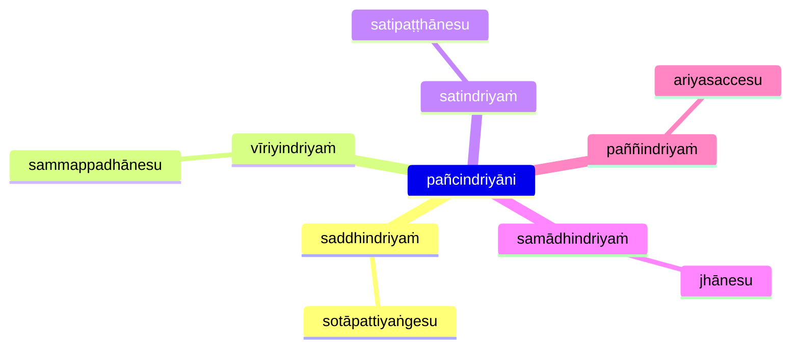
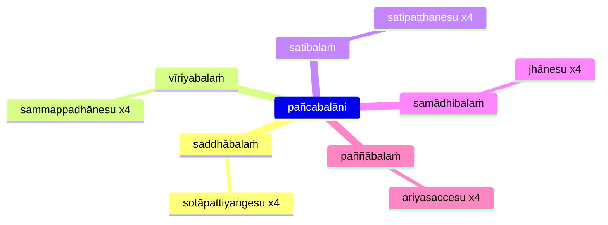
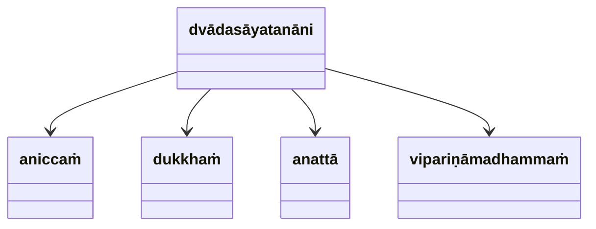
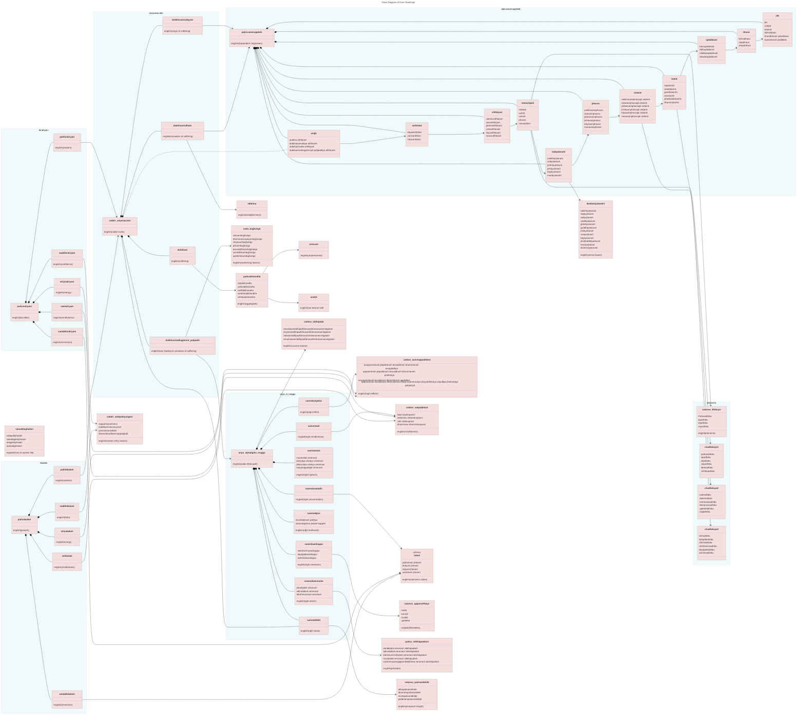
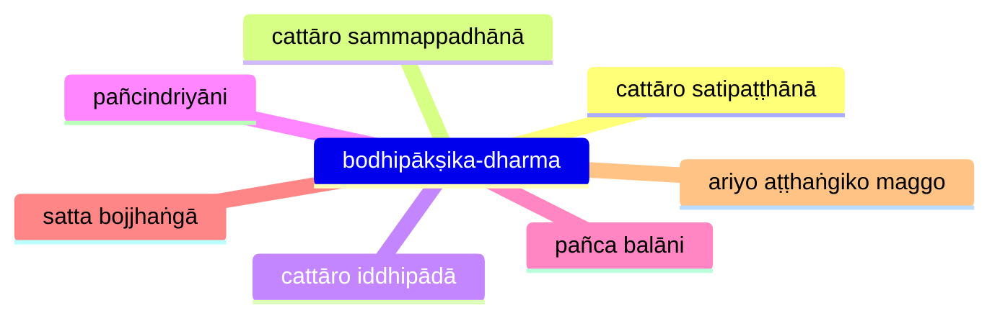

* [14S5/4.1.8 Daṭṭhabbasutta](https://tipitaka2500.github.io/tipitaka/14S5/4/4.1/4.1.8.html)

* [16A5/1.2.5 Daṭṭhabbasutta](https://tipitaka2500.github.io/tipitaka/16A5/1/1.2/1.2.5.html)

## Seven Sets

Somestimes called "Wings to Awakening", originally intended for communal recital as described in in [8D/6.6 Saṅgāyitabbadhamma](https://tipitaka2500.github.io/tipitaka/8D/6/6.6.html)

Also mentioned several other places:

* [7D/3.20 Ānandayācanakathā #403](https://tipitaka2500.github.io/tipitaka/7D/3/3.20.html#403)
* [8D/5.1.1 Kusaladhammadesanā](https://tipitaka2500.github.io/tipitaka/8D/5/5.1/5.1.1.html)
* [17A8/1.2.9 Pahārādasutta #196](https://tipitaka2500.github.io/tipitaka/17A8/1/1.2/1.2.9.html#196)
* [11M/1.3 Kintisutta #74](https://tipitaka2500.github.io/tipitaka/11M/1/1.3.html#74)
* [11M/1.4 Sāmagāmasutta #91](https://tipitaka2500.github.io/tipitaka/11M/1/1.4.html#91)

