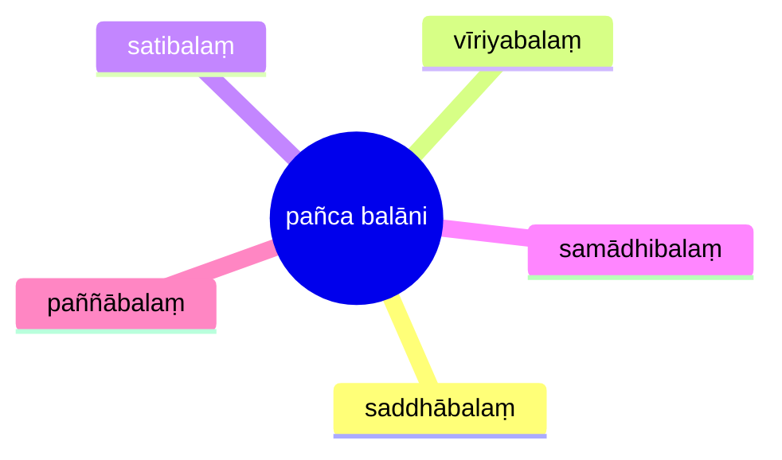

import { Tabs, TabItem } from '@astrojs/starlight/components';

[14S5/6.1.1--12 Balādisutta](https://tipitaka2500.github.io/tipitaka/14S5/6/6.1/6.1.1--12.html)

<Tabs syncKey="paliquote">
<TabItem label="My Translation">
1310\. “Bhikkhave, these are five powers. Which five?
>
> * The power of `saddha` (faith),
> * the power of `vīriya` (energy),
> * the power of `sati` (awareness),
> * the power of `samādhi` (focus),
> * the power of `paññā` (wisdom) —
>
> Just as, bhikkhave, the river Ganges slopes, inclines, and tends towards the east; so too, bhikkhave, a bhikkhu who develops these five powers, who makes them abundant, slopes, inclines, and tends towards Nibbāna.
>
> And how, bhikkhave, does a bhikkhu who develops these five powers, who makes them abundant, slope, incline, and tend towards Nibbāna? Here, bhikkhave,
>
> * A bhikkhu develops the power of faith, based on seclusion, based on dispassion, based on cessation, culminating in relinquishment.
> * He develops the power of energy ...
> * He develops the power of awareness ...
> * He develops the power of focus ...
> * He develops the power of wisdom ...
>
> Thus, bhikkhave, a bhikkhu who develops these five powers, who makes them abundant, slopes, inclines, and tends towards Nibbāna.”
</TabItem>

<TabItem label="Pāḷi (Roman IAST)">
1310\. “Pañcimāni, bhikkhave, balāni. Katamāni pañca? Saddhābalaṃ, vīriyabalaṃ, satibalaṃ, samādhibalaṃ, paññābalaṃ—  imāni kho, bhikkhave, pañca balānīti. Seyyathāpi, bhikkhave, gaṅgā nadī pācīnaninnā pācīnapoṇā pācīnapabbhārā; evameva kho, bhikkhave, bhikkhu pañca balāni bhāvento pañca balāni bahulīkaronto nibbānaninno hoti nibbānapoṇo nibbānapabbhāro. Kathañca, bhikkhave, bhikkhu pañca balāni bhāvento pañca balāni bahulīkaronto nibbānaninno hoti nibbānapoṇo nibbānapabbhāro? Idha, bhikkhave, bhikkhu saddhābalaṃ bhāveti vivekanissitaṃ virāganissitaṃ nirodhanissitaṃ vossaggapariṇāmiṃ, vīriyabalaṃ…pe…  satibalaṃ…  samādhibalaṃ…  paññābalaṃ bhāveti vivekanissitaṃ virāganissitaṃ nirodhanissitaṃ vossaggapariṇāmiṃ. Evaṃ kho, bhikkhave, bhikkhu pañca balāni bhāvento pañca balāni bahulīkaronto nibbānaninno hoti nibbānapoṇo nibbānapabbhāro”ti.
</TabItem>

<TabItem label="Pāḷi (Brahmi)">
1310\. “𑀧𑀜𑁆𑀘𑀺𑀫𑀸𑀦𑀺, 𑀪𑀺𑀓𑁆𑀔𑀯𑁂, 𑀩𑀮𑀸𑀦𑀺. 𑀓𑀢𑀫𑀸𑀦𑀺 𑀧𑀜𑁆𑀘? 𑀲𑀤𑁆𑀥𑀸𑀩𑀮𑀁, 𑀯𑀻𑀭𑀺𑀬𑀩𑀮𑀁, 𑀲𑀢𑀺𑀩𑀮𑀁, 𑀲𑀫𑀸𑀥𑀺𑀩𑀮𑀁, 𑀧𑀜𑁆𑀜𑀸𑀩𑀮𑀁—  𑀇𑀫𑀸𑀦𑀺 𑀔𑁄, 𑀪𑀺𑀓𑁆𑀔𑀯𑁂, 𑀧𑀜𑁆𑀘 𑀩𑀮𑀸𑀦𑀻𑀢𑀺. 𑀲𑁂𑀬𑁆𑀬𑀣𑀸𑀧𑀺, 𑀪𑀺𑀓𑁆𑀔𑀯𑁂, 𑀕𑀗𑁆𑀕𑀸 𑀦𑀤𑀻 𑀧𑀸𑀘𑀻𑀦𑀦𑀺𑀦𑁆𑀦𑀸 𑀧𑀸𑀘𑀻𑀦𑀧𑁄𑀡𑀸 𑀧𑀸𑀘𑀻𑀦𑀧𑀩𑁆𑀪𑀸𑀭𑀸; 𑀏𑀯𑀫𑁂𑀯 𑀔𑁄, 𑀪𑀺𑀓𑁆𑀔𑀯𑁂, 𑀪𑀺𑀓𑁆𑀔𑀼 𑀧𑀜𑁆𑀘 𑀩𑀮𑀸𑀦𑀺 𑀪𑀸𑀯𑁂𑀦𑁆𑀢𑁄 𑀧𑀜𑁆𑀘 𑀩𑀮𑀸𑀦𑀺 𑀩𑀳𑀼𑀮𑀻𑀓𑀭𑁄𑀦𑁆𑀢𑁄 𑀦𑀺𑀩𑁆𑀩𑀸𑀦𑀦𑀺𑀦𑁆𑀦𑁄 𑀳𑁄𑀢𑀺 𑀦𑀺𑀩𑁆𑀩𑀸𑀦𑀧𑁄𑀡𑁄 𑀦𑀺𑀩𑁆𑀩𑀸𑀦𑀧𑀩𑁆𑀪𑀸𑀭𑁄. 𑀓𑀣𑀜𑁆𑀘, 𑀪𑀺𑀓𑁆𑀔𑀯𑁂, 𑀪𑀺𑀓𑁆𑀔𑀼 𑀧𑀜𑁆𑀘 𑀩𑀮𑀸𑀦𑀺 𑀪𑀸𑀯𑁂𑀦𑁆𑀢𑁄 𑀧𑀜𑁆𑀘 𑀩𑀮𑀸𑀦𑀺 𑀩𑀳𑀼𑀮𑀻𑀓𑀭𑁄𑀦𑁆𑀢𑁄 𑀦𑀺𑀩𑁆𑀩𑀸𑀦𑀦𑀺𑀦𑁆𑀦𑁄 𑀳𑁄𑀢𑀺 𑀦𑀺𑀩𑁆𑀩𑀸𑀦𑀧𑁄𑀡𑁄 𑀦𑀺𑀩𑁆𑀩𑀸𑀦𑀧𑀩𑁆𑀪𑀸𑀭𑁄? 𑀇𑀥, 𑀪𑀺𑀓𑁆𑀔𑀯𑁂, 𑀪𑀺𑀓𑁆𑀔𑀼 𑀲𑀤𑁆𑀥𑀸𑀩𑀮𑀁 𑀪𑀸𑀯𑁂𑀢𑀺 𑀯𑀺𑀯𑁂𑀓𑀦𑀺𑀲𑁆𑀲𑀺𑀢𑀁 𑀯𑀺𑀭𑀸𑀕𑀦𑀺𑀲𑁆𑀲𑀺𑀢𑀁 𑀦𑀺𑀭𑁄𑀥𑀦𑀺𑀲𑁆𑀲𑀺𑀢𑀁 𑀯𑁄𑀲𑁆𑀲𑀕𑁆𑀕𑀧𑀭𑀺𑀡𑀸𑀫𑀺𑀁, 𑀯𑀻𑀭𑀺𑀬𑀩𑀮𑀁…𑀧𑁂…  𑀲𑀢𑀺𑀩𑀮𑀁…  𑀲𑀫𑀸𑀥𑀺𑀩𑀮𑀁…  𑀧𑀜𑁆𑀜𑀸𑀩𑀮𑀁 𑀪𑀸𑀯𑁂𑀢𑀺 𑀯𑀺𑀯𑁂𑀓𑀦𑀺𑀲𑁆𑀲𑀺𑀢𑀁 𑀯𑀺𑀭𑀸𑀕𑀦𑀺𑀲𑁆𑀲𑀺𑀢𑀁 𑀦𑀺𑀭𑁄𑀥𑀦𑀺𑀲𑁆𑀲𑀺𑀢𑀁 𑀯𑁄𑀲𑁆𑀲𑀕𑁆𑀕𑀧𑀭𑀺𑀡𑀸𑀫𑀺𑀁. 𑀏𑀯𑀁 𑀔𑁄, 𑀪𑀺𑀓𑁆𑀔𑀯𑁂, 𑀪𑀺𑀓𑁆𑀔𑀼 𑀧𑀜𑁆𑀘 𑀩𑀮𑀸𑀦𑀺 𑀪𑀸𑀯𑁂𑀦𑁆𑀢𑁄 𑀧𑀜𑁆𑀘 𑀩𑀮𑀸𑀦𑀺 𑀩𑀳𑀼𑀮𑀻𑀓𑀭𑁄𑀦𑁆𑀢𑁄 𑀦𑀺𑀩𑁆𑀩𑀸𑀦𑀦𑀺𑀦𑁆𑀦𑁄 𑀳𑁄𑀢𑀺 𑀦𑀺𑀩𑁆𑀩𑀸𑀦𑀧𑁄𑀡𑁄 𑀦𑀺𑀩𑁆𑀩𑀸𑀦𑀧𑀩𑁆𑀪𑀸𑀭𑁄”𑀢𑀺.
</TabItem>
</Tabs>

