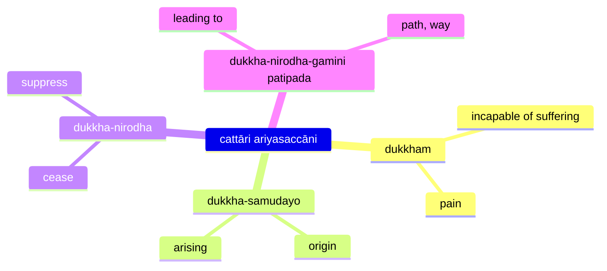

The Four Realisations (often called Noble Truths) form the core of Buddha's soteriology, and framework for the rest of his teachings. The framework states that life itself is suffering, provides the cause and the way out of suffering through the Eightfold Path.

The basic teaching of the Four Realisations (`dukkham samudayo nirodho magga`) can be expressed as a medical diagnosis ([The Dawn of Abhidharma](https://www.buddhismuskunde.uni-hamburg.de/pdf/4-publikationen/hamburg-buddhist-studies/hamburgup-hbs2-analayo-abhidharma.pdf) p. 113):

* disease: dukkha (suffering)
* pathogen: craving
* health: nibbāna
* cure: eightfold path

## References

* [3V/1.6 Pañcavaggiyakathā #71-80](https://tipitaka2500.github.io/tipitaka/3V/1/1.6.html#71)
* [14S5/12.2.1 Dhammacakkappavattanasutta #2209-2215](https://tipitaka2500.github.io/tipitaka/14S5/12/12.2/12.2.1.html#2209)

Other references (expansions):

* [7D/9.4.5 Dhammānupassanāsaccapabba](https://tipitaka2500.github.io/tipitaka/7D/9/9.4/9.4.5.html)
* [11M/4.11 Saccavibhaṅgasutta](https://tipitaka2500.github.io/tipitaka/11M/4/4.11.html)
## The Realisation of Suffering (`dukkhaṃ ariyasaccaṃ`)

> 𑀇𑀤𑀁 𑀔𑁄 𑀧𑀦, 𑀪𑀺𑀓𑁆𑀔𑀯𑁂, 𑀤𑀼𑀓𑁆𑀔𑀁 𑀅𑀭𑀺𑀬𑀲𑀘𑁆𑀘𑀁𑁇 𑀚𑀸𑀢𑀺𑀧𑀺 𑀤𑀼𑀓𑁆𑀔𑀸, 𑀚𑀭𑀸𑀧𑀺 𑀤𑀼𑀓𑁆𑀔𑀸, 𑀩𑁆𑀬𑀸𑀥𑀺𑀧𑀺 𑀤𑀼𑀓𑁆𑀔𑁄, 𑀫𑀭𑀡𑀫𑁆𑀧𑀺 𑀤𑀼𑀓𑁆𑀔𑀁, 𑀅𑀧𑁆𑀧𑀺𑀬𑁂𑀳𑀺 𑀲𑀫𑁆𑀧𑀬𑁄𑀕𑁄 𑀤𑀼𑀓𑁆𑀔𑁄, 𑀧𑀺𑀬𑁂𑀳𑀺 𑀯𑀺𑀧𑁆𑀧𑀬𑁄𑀕𑁄 𑀤𑀼𑀓𑁆𑀔𑁄, 𑀬𑀫𑁆𑀧𑀺𑀘𑁆𑀙𑀁 𑀦 𑀮𑀪𑀢𑀺 𑀢𑀫𑁆𑀧𑀺 𑀤𑀼𑀓𑁆𑀔𑀁𑁇 𑀲𑀁𑀔𑀺𑀢𑁆𑀢𑁂𑀦, 𑀧𑀜𑁆𑀘𑀼𑀧𑀸𑀤𑀸𑀦𑀓𑁆𑀔𑀦𑁆𑀥𑀸 𑀤𑀼𑀓𑁆𑀔𑀸𑁇
>
> Idaṃ kho pana, bhikkhave, dukkhaṃ ariyasaccaṃ. Jātipi dukkhā, jarāpi dukkhā, byādhipi dukkho, maraṇampi dukkhaṃ, appiyehi sampayogo dukkho, piyehi vippayogo dukkho, yampicchaṃ na labhati tampi dukkhaṃ. Saṃkhittena, pañcupādānakkhandhā dukkhā.

This, bhikkhave, is the realisation of suffering. Suffering is:

* birth,
* aging,
* illness,
* death;
* sorrow, lamentation, pain, grief, and despair;
* association with the disliked;
* separation from the liked;
* not getting what one wants is suffering.

In brief, the five collections acting as fuel are suffering.

## The Realisation of the Cause of Suffering (`dukkhasamudayaṃ ariyasaccaṃ`)

> 𑀇𑀤𑀁 𑀔𑁄 𑀧𑀦, 𑀪𑀺𑀓𑁆𑀔𑀯𑁂, 𑀤𑀼𑀓𑁆𑀔𑀲𑀫𑀼𑀤𑀬𑀁 𑀅𑀭𑀺𑀬𑀲𑀘𑁆𑀘𑀁—  𑀬𑀸𑀬𑀁 𑀢𑀡𑁆𑀳𑀸 𑀧𑁄𑀦𑁄𑀩𑁆𑀪𑀯𑀺𑀓𑀸 𑀦𑀦𑁆𑀤𑀻𑀭𑀸𑀕𑀲𑀳𑀕𑀢𑀸 𑀢𑀢𑁆𑀭𑀢𑀢𑁆𑀭𑀸𑀪𑀺𑀦𑀦𑁆𑀤𑀺𑀦𑀻, 𑀲𑁂𑀬𑁆𑀬𑀣𑀺𑀤𑀁—  𑀓𑀸𑀫𑀢𑀡𑁆𑀳𑀸, 𑀪𑀯𑀢𑀡𑁆𑀳𑀸, 𑀯𑀺𑀪𑀯𑀢𑀡𑁆𑀳𑀸𑁇
> 
> Idaṃ kho pana, bhikkhave, dukkhasamudayaṃ ariyasaccaṃ—  yāyaṃ taṇhā ponobbhavikā nandīrāgasahagatā tatratatrābhinandinī, seyyathidaṃ—  kāmataṇhā, bhavataṇhā, vibhavataṇhā.

This, bhikkhave, is the realisation of the cause of suffering:

* craving leading to renewed existence,
* accompanied by delight and desire,
* seeking delight here and there;

In other words:

* craving for sensual pleasures,
* craving for existence,
* craving for non-existence.

## The Realisation of the Cessation of Suffering (`dukkhanirodhaṃ ariyasaccaṃ`)

> 𑀇𑀤𑀁 𑀔𑁄 𑀧𑀦, 𑀪𑀺𑀓𑁆𑀔𑀯𑁂, 𑀤𑀼𑀓𑁆𑀔𑀦𑀺𑀭𑁄𑀥𑀁 𑀅𑀭𑀺𑀬𑀲𑀘𑁆𑀘𑀁—  𑀬𑁄 𑀢𑀲𑁆𑀲𑀸𑀬𑁂𑀯 𑀢𑀡𑁆𑀳𑀸𑀬 𑀅𑀲𑁂𑀲𑀯𑀺𑀭𑀸𑀕𑀦𑀺𑀭𑁄𑀥𑁄, 𑀘𑀸𑀕𑁄, 𑀧𑀝𑀺𑀦𑀺𑀲𑁆𑀲𑀕𑁆𑀕𑁄, 𑀫𑀼𑀢𑁆𑀢𑀺, 𑀅𑀦𑀸𑀮𑀬𑁄𑁇
> 
> Idaṃ kho pana, bhikkhave, dukkhanirodhaṃ ariyasaccaṃ—  yo tassāyeva taṇhāya asesavirāganirodho, cāgo, paṭinissaggo, mutti, anālayo.

This, bhikkhave, is the realisation of the cessation of suffering: it is the:

* complete fading away and cessation of that same craving,
* its abandonment,
* relinquishment,
* release, and
* non-attachment.

## The Realisation of the Path Leading To The Cessation of Suffering (`dukkhanirodhagāminī paṭipadā ariyasaccaṃ`)

> 𑀇𑀤𑀁 𑀔𑁄 𑀧𑀦, 𑀪𑀺𑀓𑁆𑀔𑀯𑁂, 𑀤𑀼𑀓𑁆𑀔𑀦𑀺𑀭𑁄𑀥𑀕𑀸𑀫𑀺𑀦𑀻 𑀧𑀝𑀺𑀧𑀤𑀸 𑀅𑀭𑀺𑀬𑀲𑀘𑁆𑀘𑀁—  𑀅𑀬𑀫𑁂𑀯 𑀅𑀭𑀺𑀬𑁄 𑀅𑀝𑁆𑀞𑀗𑁆𑀕𑀺𑀓𑁄 𑀫𑀕𑁆𑀕𑁄, 𑀲𑁂𑀬𑁆𑀬𑀣𑀺𑀤𑀁—  𑀲𑀫𑁆𑀫𑀸𑀤𑀺𑀝𑁆𑀞𑀺, 𑀲𑀫𑁆𑀫𑀸𑀲𑀗𑁆𑀓𑀧𑁆𑀧𑁄, 𑀲𑀫𑁆𑀫𑀸𑀯𑀸𑀘𑀸, 𑀲𑀫𑁆𑀫𑀸𑀓𑀫𑁆𑀫𑀦𑁆𑀢𑁄, 𑀲𑀫𑁆𑀫𑀸𑀆𑀚𑀻𑀯𑁄, 𑀲𑀫𑁆𑀫𑀸𑀯𑀸𑀬𑀸𑀫𑁄, 𑀲𑀫𑁆𑀫𑀸𑀲𑀢𑀺, 𑀲𑀫𑁆𑀫𑀸𑀲𑀫𑀸𑀥𑀺𑁇
> 
> Idaṃ kho pana, bhikkhave, dukkhanirodhagāminī paṭipadā ariyasaccaṃ—  ayameva ariyo aṭṭhaṅgiko maggo, seyyathidaṃ—  sammādiṭṭhi, sammāsaṅkappo, sammāvācā, sammākammanto, sammāājīvo, sammāvāyāmo, sammāsati, sammāsamādhi.

This, bhikkhave, is the realisation of the path leading to the cessation of suffering: it is this Eightfold Path, that is:

* Right View,
* Right Intention,
* Right Speech,
* Right Action,
* Right Way of Living,
* Right Effort,
* Right Awareness,
* Right Focus.

Other references (expansion):

* [14S5/1.1.8 Vibhaṅgasutta](https://tipitaka2500.github.io/tipitaka/14S5/1/1.1/1.1.8.html)

## Three Phases (`tiparivaṭṭaṃ`) and Twelve Aspects (`dvādasākāraṃ`)

> 𑀇𑀤𑀁 𑀤𑀼𑀓𑁆𑀔𑀁 𑀅𑀭𑀺𑀬𑀲𑀘𑁆𑀘𑀦𑁆𑀢𑀺 𑀫𑁂, 𑀪𑀺𑀓𑁆𑀔𑀯𑁂, 𑀧𑀼𑀩𑁆𑀩𑁂 𑀅𑀦𑀦𑀼𑀲𑁆𑀲𑀼𑀢𑁂𑀲𑀼 𑀥𑀫𑁆𑀫𑁂𑀲𑀼 𑀘𑀓𑁆𑀔𑀼𑀁 𑀉𑀤𑀧𑀸𑀤𑀺, 𑀜𑀸𑀡𑀁 𑀉𑀤𑀧𑀸𑀤𑀺, 𑀧𑀜𑁆𑀜𑀸 𑀉𑀤𑀧𑀸𑀤𑀺, 𑀯𑀺𑀚𑁆𑀚𑀸 𑀉𑀤𑀧𑀸𑀤𑀺, 𑀆𑀮𑁄𑀓𑁄 𑀉𑀤𑀧𑀸𑀤𑀺𑁇 𑀢𑀁 𑀔𑁄 𑀧𑀦𑀺𑀤𑀁 𑀤𑀼𑀓𑁆𑀔𑀁 𑀅𑀭𑀺𑀬𑀲𑀘𑁆𑀘𑀁 𑀧𑀭𑀺𑀜𑁆𑀜𑁂𑀬𑁆𑀬𑀦𑁆𑀢𑀺 𑀫𑁂, 𑀪𑀺𑀓𑁆𑀔𑀯𑁂, 𑀧𑀼𑀩𑁆𑀩𑁂 𑀅𑀦𑀦𑀼𑀲𑁆𑀲𑀼𑀢𑁂𑀲𑀼 𑀥𑀫𑁆𑀫𑁂𑀲𑀼 𑀘𑀓𑁆𑀔𑀼𑀁 𑀉𑀤𑀧𑀸𑀤𑀺, 𑀜𑀸𑀡𑀁 𑀉𑀤𑀧𑀸𑀤𑀺, 𑀧𑀜𑁆𑀜𑀸 𑀉𑀤𑀧𑀸𑀤𑀺, 𑀯𑀺𑀚𑁆𑀚𑀸 𑀉𑀤𑀧𑀸𑀤𑀺, 𑀆𑀮𑁄𑀓𑁄 𑀉𑀤𑀧𑀸𑀤𑀺𑁇 𑀢𑀁 𑀔𑁄 𑀧𑀦𑀺𑀤𑀁 𑀤𑀼𑀓𑁆𑀔𑀁 𑀅𑀭𑀺𑀬𑀲𑀘𑁆𑀘𑀁 𑀧𑀭𑀺𑀜𑁆𑀜𑀸𑀢𑀦𑁆𑀢𑀺 𑀫𑁂, 𑀪𑀺𑀓𑁆𑀔𑀯𑁂, 𑀧𑀼𑀩𑁆𑀩𑁂 𑀅𑀦𑀦𑀼𑀲𑁆𑀲𑀼𑀢𑁂𑀲𑀼 𑀥𑀫𑁆𑀫𑁂𑀲𑀼 𑀘𑀓𑁆𑀔𑀼𑀁 𑀉𑀤𑀧𑀸𑀤𑀺, 𑀜𑀸𑀡𑀁 𑀉𑀤𑀧𑀸𑀤𑀺, 𑀧𑀜𑁆𑀜𑀸 𑀉𑀤𑀧𑀸𑀤𑀺, 𑀯𑀺𑀚𑁆𑀚𑀸 𑀉𑀤𑀧𑀸𑀤𑀺, 𑀆𑀮𑁄𑀓𑁄 𑀉𑀤𑀧𑀸𑀤𑀺𑁇
> 
> 𑀇𑀤𑀁 𑀤𑀼𑀓𑁆𑀔𑀲𑀫𑀼𑀤𑀬𑀁 𑀅𑀭𑀺𑀬𑀲𑀘𑁆𑀘𑀦𑁆𑀢𑀺 𑀫𑁂, 𑀪𑀺𑀓𑁆𑀔𑀯𑁂, 𑀧𑀼𑀩𑁆𑀩𑁂 𑀅𑀦𑀦𑀼𑀲𑁆𑀲𑀼𑀢𑁂𑀲𑀼 𑀥𑀫𑁆𑀫𑁂𑀲𑀼 𑀘𑀓𑁆𑀔𑀼𑀁 𑀉𑀤𑀧𑀸𑀤𑀺, 𑀜𑀸𑀡𑀁 𑀉𑀤𑀧𑀸𑀤𑀺, 𑀧𑀜𑁆𑀜𑀸 𑀉𑀤𑀧𑀸𑀤𑀺, 𑀯𑀺𑀚𑁆𑀚𑀸 𑀉𑀤𑀧𑀸𑀤𑀺, 𑀆𑀮𑁄𑀓𑁄 𑀉𑀤𑀧𑀸𑀤𑀺𑁇 𑀢𑀁 𑀔𑁄 𑀧𑀦𑀺𑀤𑀁 𑀤𑀼𑀓𑁆𑀔𑀲𑀫𑀼𑀤𑀬𑀁 𑀅𑀭𑀺𑀬𑀲𑀘𑁆𑀘𑀁 𑀧𑀳𑀸𑀢𑀩𑁆𑀩𑀦𑁆𑀢𑀺 𑀫𑁂, 𑀪𑀺𑀓𑁆𑀔𑀯𑁂, 𑀧𑀼𑀩𑁆𑀩𑁂 𑀅𑀦𑀦𑀼𑀲𑁆𑀲𑀼𑀢𑁂𑀲𑀼 𑀥𑀫𑁆𑀫𑁂𑀲𑀼 𑀘𑀓𑁆𑀔𑀼𑀁 𑀉𑀤𑀧𑀸𑀤𑀺, 𑀜𑀸𑀡𑀁 𑀉𑀤𑀧𑀸𑀤𑀺, 𑀧𑀜𑁆𑀜𑀸 𑀉𑀤𑀧𑀸𑀤𑀺, 𑀯𑀺𑀚𑁆𑀚𑀸 𑀉𑀤𑀧𑀸𑀤𑀺, 𑀆𑀮𑁄𑀓𑁄 𑀉𑀤𑀧𑀸𑀤𑀺𑁇 𑀢𑀁 𑀔𑁄 𑀧𑀦𑀺𑀤𑀁 𑀤𑀼𑀓𑁆𑀔𑀲𑀫𑀼𑀤𑀬𑀁 𑀅𑀭𑀺𑀬𑀲𑀘𑁆𑀘𑀁 𑀧𑀳𑀻𑀦𑀦𑁆𑀢𑀺 𑀫𑁂, 𑀪𑀺𑀓𑁆𑀔𑀯𑁂, 𑀧𑀼𑀩𑁆𑀩𑁂 𑀅𑀦𑀦𑀼𑀲𑁆𑀲𑀼𑀢𑁂𑀲𑀼 𑀥𑀫𑁆𑀫𑁂𑀲𑀼 𑀘𑀓𑁆𑀔𑀼𑀁 𑀉𑀤𑀧𑀸𑀤𑀺, 𑀜𑀸𑀡𑀁 𑀉𑀤𑀧𑀸𑀤𑀺, 𑀧𑀜𑁆𑀜𑀸 𑀉𑀤𑀧𑀸𑀤𑀺, 𑀯𑀺𑀚𑁆𑀚𑀸 𑀉𑀤𑀧𑀸𑀤𑀺, 𑀆𑀮𑁄𑀓𑁄 𑀉𑀤𑀧𑀸𑀤𑀺𑁇
> 
> 𑀇𑀤𑀁 𑀤𑀼𑀓𑁆𑀔𑀦𑀺𑀭𑁄𑀥𑀁 𑀅𑀭𑀺𑀬𑀲𑀘𑁆𑀘𑀦𑁆𑀢𑀺 𑀫𑁂, 𑀪𑀺𑀓𑁆𑀔𑀯𑁂, 𑀧𑀼𑀩𑁆𑀩𑁂 𑀅𑀦𑀦𑀼𑀲𑁆𑀲𑀼𑀢𑁂𑀲𑀼 𑀥𑀫𑁆𑀫𑁂𑀲𑀼 𑀘𑀓𑁆𑀔𑀼𑀁 𑀉𑀤𑀧𑀸𑀤𑀺, 𑀜𑀸𑀡𑀁 𑀉𑀤𑀧𑀸𑀤𑀺, 𑀧𑀜𑁆𑀜𑀸 𑀉𑀤𑀧𑀸𑀤𑀺, 𑀯𑀺𑀚𑁆𑀚𑀸 𑀉𑀤𑀧𑀸𑀤𑀺, 𑀆𑀮𑁄𑀓𑁄 𑀉𑀤𑀧𑀸𑀤𑀺𑁇 𑀢𑀁 𑀔𑁄 𑀧𑀦𑀺𑀤𑀁 𑀤𑀼𑀓𑁆𑀔𑀦𑀺𑀭𑁄𑀥𑀁 𑀅𑀭𑀺𑀬𑀲𑀘𑁆𑀘𑀁 𑀲𑀘𑁆𑀙𑀺𑀓𑀸𑀢𑀩𑁆𑀩𑀦𑁆𑀢𑀺 𑀫𑁂, 𑀪𑀺𑀓𑁆𑀔𑀯𑁂, 𑀧𑀼𑀩𑁆𑀩𑁂 𑀅𑀦𑀦𑀼𑀲𑁆𑀲𑀼𑀢𑁂𑀲𑀼 𑀥𑀫𑁆𑀫𑁂𑀲𑀼 𑀘𑀓𑁆𑀔𑀼𑀁 𑀉𑀤𑀧𑀸𑀤𑀺, 𑀜𑀸𑀡𑀁 𑀉𑀤𑀧𑀸𑀤𑀺, 𑀧𑀜𑁆𑀜𑀸 𑀉𑀤𑀧𑀸𑀤𑀺, 𑀯𑀺𑀚𑁆𑀚𑀸 𑀉𑀤𑀧𑀸𑀤𑀺, 𑀆𑀮𑁄𑀓𑁄 𑀉𑀤𑀧𑀸𑀤𑀺𑁇 𑀢𑀁 𑀔𑁄 𑀧𑀦𑀺𑀤𑀁 𑀤𑀼𑀓𑁆𑀔𑀦𑀺𑀭𑁄𑀥𑀁 𑀅𑀭𑀺𑀬𑀲𑀘𑁆𑀘𑀁 𑀲𑀘𑁆𑀙𑀺𑀓𑀢𑀦𑁆𑀢𑀺 𑀫𑁂, 𑀪𑀺𑀓𑁆𑀔𑀯𑁂, 𑀧𑀼𑀩𑁆𑀩𑁂 𑀅𑀦𑀦𑀼𑀲𑁆𑀲𑀼𑀢𑁂𑀲𑀼 𑀥𑀫𑁆𑀫𑁂𑀲𑀼 𑀘𑀓𑁆𑀔𑀼𑀁 𑀉𑀤𑀧𑀸𑀤𑀺, 𑀜𑀸𑀡𑀁 𑀉𑀤𑀧𑀸𑀤𑀺, 𑀧𑀜𑁆𑀜𑀸 𑀉𑀤𑀧𑀸𑀤𑀺, 𑀯𑀺𑀚𑁆𑀚𑀸 𑀉𑀤𑀧𑀸𑀤𑀺, 𑀆𑀮𑁄𑀓𑁄 𑀉𑀤𑀧𑀸𑀤𑀺𑁇
> 
> 𑀇𑀤𑀁 𑀤𑀼𑀓𑁆𑀔𑀦𑀺𑀭𑁄𑀥𑀕𑀸𑀫𑀺𑀦𑀻 𑀧𑀝𑀺𑀧𑀤𑀸 𑀅𑀭𑀺𑀬𑀲𑀘𑁆𑀘𑀦𑁆𑀢𑀺 𑀫𑁂, 𑀪𑀺𑀓𑁆𑀔𑀯𑁂, 𑀧𑀼𑀩𑁆𑀩𑁂 𑀅𑀦𑀦𑀼𑀲𑁆𑀲𑀼𑀢𑁂𑀲𑀼 𑀥𑀫𑁆𑀫𑁂𑀲𑀼 𑀘𑀓𑁆𑀔𑀼𑀁 𑀉𑀤𑀧𑀸𑀤𑀺, 𑀜𑀸𑀡𑀁 𑀉𑀤𑀧𑀸𑀤𑀺, 𑀧𑀜𑁆𑀜𑀸 𑀉𑀤𑀧𑀸𑀤𑀺, 𑀯𑀺𑀚𑁆𑀚𑀸 𑀉𑀤𑀧𑀸𑀤𑀺, 𑀆𑀮𑁄𑀓𑁄 𑀉𑀤𑀧𑀸𑀤𑀺𑁇 𑀢𑀁 𑀔𑁄 𑀧𑀦𑀺𑀤𑀁 𑀤𑀼𑀓𑁆𑀔𑀦𑀺𑀭𑁄𑀥𑀕𑀸𑀫𑀺𑀦𑀻 𑀧𑀝𑀺𑀧𑀤𑀸 𑀅𑀭𑀺𑀬𑀲𑀘𑁆𑀘𑀁 𑀪𑀸𑀯𑁂𑀢𑀩𑁆𑀩𑀦𑁆𑀢𑀺 𑀫𑁂, 𑀪𑀺𑀓𑁆𑀔𑀯𑁂, 𑀧𑀼𑀩𑁆𑀩𑁂 𑀅𑀦𑀦𑀼𑀲𑁆𑀲𑀼𑀢𑁂𑀲𑀼 𑀥𑀫𑁆𑀫𑁂𑀲𑀼 𑀘𑀓𑁆𑀔𑀼𑀁 𑀉𑀤𑀧𑀸𑀤𑀺, 𑀜𑀸𑀡𑀁 𑀉𑀤𑀧𑀸𑀤𑀺, 𑀧𑀜𑁆𑀜𑀸 𑀉𑀤𑀧𑀸𑀤𑀺, 𑀯𑀺𑀚𑁆𑀚𑀸 𑀉𑀤𑀧𑀸𑀤𑀺, 𑀆𑀮𑁄𑀓𑁄 𑀉𑀤𑀧𑀸𑀤𑀺𑁇 𑀢𑀁 𑀔𑁄 𑀧𑀦𑀺𑀤𑀁 𑀤𑀼𑀓𑁆𑀔𑀦𑀺𑀭𑁄𑀥𑀕𑀸𑀫𑀺𑀦𑀻 𑀧𑀝𑀺𑀧𑀤𑀸 𑀅𑀭𑀺𑀬𑀲𑀘𑁆𑀘𑀁 𑀪𑀸𑀯𑀺𑀢𑀦𑁆𑀢𑀺 𑀫𑁂, 𑀪𑀺𑀓𑁆𑀔𑀯𑁂, 𑀧𑀼𑀩𑁆𑀩𑁂 𑀅𑀦𑀦𑀼𑀲𑁆𑀲𑀼𑀢𑁂𑀲𑀼 𑀥𑀫𑁆𑀫𑁂𑀲𑀼 𑀘𑀓𑁆𑀔𑀼𑀁 𑀉𑀤𑀧𑀸𑀤𑀺, 𑀜𑀸𑀡𑀁 𑀉𑀤𑀧𑀸𑀤𑀺, 𑀧𑀜𑁆𑀜𑀸 𑀉𑀤𑀧𑀸𑀤𑀺, 𑀯𑀺𑀚𑁆𑀚𑀸 𑀉𑀤𑀧𑀸𑀤𑀺, 𑀆𑀮𑁄𑀓𑁄 𑀉𑀤𑀧𑀸𑀤𑀺𑁇
> 
> 𑀬𑀸𑀯𑀓𑀻𑀯𑀜𑁆𑀘 𑀫𑁂, 𑀪𑀺𑀓𑁆𑀔𑀯𑁂, 𑀇𑀫𑁂𑀲𑀼 𑀘𑀢𑀽𑀲𑀼 𑀅𑀭𑀺𑀬𑀲𑀘𑁆𑀘𑁂𑀲𑀼 𑀏𑀯𑀁 𑀢𑀺𑀧𑀭𑀺𑀯𑀝𑁆𑀝𑀁 𑀤𑁆𑀯𑀸𑀤𑀲𑀸𑀓𑀸𑀭𑀁 𑀬𑀣𑀸𑀪𑀽𑀢𑀁 𑀜𑀸𑀡𑀤𑀲𑁆𑀲𑀦𑀁 𑀦 𑀲𑀼𑀯𑀺𑀲𑀼𑀤𑁆𑀥𑀁 𑀅𑀳𑁄𑀲𑀺, 𑀦𑁂𑀯 𑀢𑀸𑀯𑀸𑀳𑀁, 𑀪𑀺𑀓𑁆𑀔𑀯𑁂, 𑀲𑀤𑁂𑀯𑀓𑁂 𑀮𑁄𑀓𑁂 𑀲𑀫𑀸𑀭𑀓𑁂 𑀲𑀩𑁆𑀭𑀳𑁆𑀫𑀓𑁂 𑀲𑀲𑁆𑀲𑀫𑀡𑀩𑁆𑀭𑀸𑀳𑁆𑀫𑀡𑀺𑀬𑀸 𑀧𑀚𑀸𑀬 𑀲𑀤𑁂𑀯𑀫𑀦𑀼𑀲𑁆𑀲𑀸𑀬 𑀅𑀦𑀼𑀢𑁆𑀢𑀭𑀁 𑀲𑀫𑁆𑀫𑀸𑀲𑀫𑁆𑀩𑁄𑀥𑀺𑀁 𑀅𑀪𑀺𑀲𑀫𑁆𑀩𑀼𑀤𑁆𑀥𑁄𑀢𑀺 𑀧𑀘𑁆𑀘𑀜𑁆𑀜𑀸𑀲𑀺𑀁𑁇
> 
> 𑀬𑀢𑁄 𑀘 𑀔𑁄 𑀫𑁂, 𑀪𑀺𑀓𑁆𑀔𑀯𑁂, 𑀇𑀫𑁂𑀲𑀼 𑀘𑀢𑀽𑀲𑀼 𑀅𑀭𑀺𑀬𑀲𑀘𑁆𑀘𑁂𑀲𑀼 𑀏𑀯𑀁 𑀢𑀺𑀧𑀭𑀺𑀯𑀝𑁆𑀝𑀁 𑀤𑁆𑀯𑀸𑀤𑀲𑀸𑀓𑀸𑀭𑀁 𑀬𑀣𑀸𑀪𑀽𑀢𑀁 𑀜𑀸𑀡𑀤𑀲𑁆𑀲𑀦𑀁 𑀲𑀼𑀯𑀺𑀲𑀼𑀤𑁆𑀥𑀁 𑀅𑀳𑁄𑀲𑀺, 𑀅𑀣𑀸𑀳𑀁, 𑀪𑀺𑀓𑁆𑀔𑀯𑁂, 𑀲𑀤𑁂𑀯𑀓𑁂 𑀮𑁄𑀓𑁂 𑀲𑀫𑀸𑀭𑀓𑁂 𑀲𑀩𑁆𑀭𑀳𑁆𑀫𑀓𑁂 𑀲𑀲𑁆𑀲𑀫𑀡𑀩𑁆𑀭𑀸𑀳𑁆𑀫𑀡𑀺𑀬𑀸 𑀧𑀚𑀸𑀬 𑀲𑀤𑁂𑀯𑀫𑀦𑀼𑀲𑁆𑀲𑀸𑀬 𑀅𑀦𑀼𑀢𑁆𑀢𑀭𑀁 𑀲𑀫𑁆𑀫𑀸𑀲𑀫𑁆𑀩𑁄𑀥𑀺𑀁 𑀅𑀪𑀺𑀲𑀫𑁆𑀩𑀼𑀤𑁆𑀥𑁄𑀢𑀺 𑀧𑀘𑁆𑀘𑀜𑁆𑀜𑀸𑀲𑀺𑀁𑁇 𑀜𑀸𑀡𑀜𑁆𑀘 𑀧𑀦 𑀫𑁂 𑀤𑀲𑁆𑀲𑀦𑀁 𑀉𑀤𑀧𑀸𑀤𑀺—  𑀅𑀓𑀼𑀧𑁆𑀧𑀸 𑀫𑁂 𑀯𑀺𑀫𑀼𑀢𑁆𑀢𑀺, 𑀅𑀬𑀫𑀦𑁆𑀢𑀺𑀫𑀸 𑀚𑀸𑀢𑀺, 𑀦𑀢𑁆𑀣𑀺 𑀤𑀸𑀦𑀺 𑀧𑀼𑀦𑀩𑁆𑀪𑀯𑁄”𑀢𑀺𑁇 𑀇𑀤𑀫𑀯𑁄𑀘 𑀪𑀕𑀯𑀸 𑀅𑀢𑁆𑀢𑀫𑀦𑀸 𑀧𑀜𑁆𑀘𑀯𑀕𑁆𑀕𑀺𑀬𑀸 𑀪𑀺𑀓𑁆𑀔𑀽 𑀪𑀕𑀯𑀢𑁄 𑀪𑀸𑀲𑀺𑀢𑀁 𑀅𑀪𑀺𑀦𑀦𑁆𑀤𑀼𑀦𑁆𑀢𑀺𑁇
>
> Idaṃ dukkhaṃ ariyasaccanti me, bhikkhave, pubbe ananussutesu dhammesu cakkhuṃ udapādi, ñāṇaṃ udapādi, paññā udapādi, vijjā udapādi, āloko udapādi. Taṃ kho panidaṃ dukkhaṃ ariyasaccaṃ pariññeyyanti me, bhikkhave, pubbe ananussutesu dhammesu cakkhuṃ udapādi, ñāṇaṃ udapādi, paññā udapādi, vijjā udapādi, āloko udapādi. Taṃ kho panidaṃ dukkhaṃ ariyasaccaṃ pariññātanti me, bhikkhave, pubbe ananussutesu dhammesu cakkhuṃ udapādi, ñāṇaṃ udapādi, paññā udapādi, vijjā udapādi, āloko udapādi.
> 
> Idaṃ dukkhasamudayaṃ ariyasaccanti me, bhikkhave, pubbe ananussutesu dhammesu cakkhuṃ udapādi, ñāṇaṃ udapādi, paññā udapādi, vijjā udapādi, āloko udapādi. Taṃ kho panidaṃ dukkhasamudayaṃ ariyasaccaṃ pahātabbanti me, bhikkhave, pubbe ananussutesu dhammesu cakkhuṃ udapādi, ñāṇaṃ udapādi, paññā udapādi, vijjā udapādi, āloko udapādi. Taṃ kho panidaṃ dukkhasamudayaṃ ariyasaccaṃ pahīnanti me, bhikkhave, pubbe ananussutesu dhammesu cakkhuṃ udapādi, ñāṇaṃ udapādi, paññā udapādi, vijjā udapādi, āloko udapādi.
> 
> Idaṃ dukkhanirodhaṃ ariyasaccanti me, bhikkhave, pubbe ananussutesu dhammesu cakkhuṃ udapādi, ñāṇaṃ udapādi, paññā udapādi, vijjā udapādi, āloko udapādi. Taṃ kho panidaṃ dukkhanirodhaṃ ariyasaccaṃ sacchikātabbanti me, bhikkhave, pubbe ananussutesu dhammesu cakkhuṃ udapādi, ñāṇaṃ udapādi, paññā udapādi, vijjā udapādi, āloko udapādi. Taṃ kho panidaṃ dukkhanirodhaṃ ariyasaccaṃ sacchikatanti me, bhikkhave, pubbe ananussutesu dhammesu cakkhuṃ udapādi, ñāṇaṃ udapādi, paññā udapādi, vijjā udapādi, āloko udapādi.
> 
> Idaṃ dukkhanirodhagāminī paṭipadā ariyasaccanti me, bhikkhave, pubbe ananussutesu dhammesu cakkhuṃ udapādi, ñāṇaṃ udapādi, paññā udapādi, vijjā udapādi, āloko udapādi. Taṃ kho panidaṃ dukkhanirodhagāminī paṭipadā ariyasaccaṃ bhāvetabbanti me, bhikkhave, pubbe ananussutesu dhammesu cakkhuṃ udapādi, ñāṇaṃ udapādi, paññā udapādi, vijjā udapādi, āloko udapādi. Taṃ kho panidaṃ dukkhanirodhagāminī paṭipadā ariyasaccaṃ bhāvitanti me, bhikkhave, pubbe ananussutesu dhammesu cakkhuṃ udapādi, ñāṇaṃ udapādi, paññā udapādi, vijjā udapādi, āloko udapādi.
> 
> Yāvakīvañca me, bhikkhave, imesu catūsu ariyasaccesu evaṃ tiparivaṭṭaṃ dvādasākāraṃ yathābhūtaṃ ñāṇadassanaṃ na suvisuddhaṃ ahosi, neva tāvāhaṃ, bhikkhave, sadevake loke samārake sabrahmake sassamaṇabrāhmaṇiyā pajāya sadevamanussāya anuttaraṃ sammāsambodhiṃ abhisambuddhoti paccaññāsiṃ.
> 
> Yato ca kho me, bhikkhave, imesu catūsu ariyasaccesu evaṃ tiparivaṭṭaṃ dvādasākāraṃ yathābhūtaṃ ñāṇadassanaṃ suvisuddhaṃ ahosi, athāhaṃ, bhikkhave, sadevake loke samārake sabrahmake sassamaṇabrāhmaṇiyā pajāya sadevamanussāya anuttaraṃ sammāsambodhiṃ abhisambuddhoti paccaññāsiṃ. Ñāṇañca pana me dassanaṃ udapādi—  akuppā me vimutti, ayamantimā jāti, natthi dāni punabbhavo”ti. Idamavoca bhagavā attamanā pañcavaggiyā bhikkhū bhagavato bhāsitaṃ abhinandunti.

"This is the realisation of suffering" — thus, bhikkhave, in regard to things unheard before, there arose in me vision, knowledge, wisdom, science, and light. "This realisation of suffering should be comprehended" — thus, bhikkhave, in regard to things unheard before, there arose in me vision, knowledge, wisdom, science, and light. "This realisation of suffering has been comprehended" — thus, bhikkhave, in regard to things unheard before, there arose in me vision, knowledge, wisdom, science, and light.

"This is the realisation of the origin of suffering" — thus, bhikkhave, in regard to things unheard before, there arose in me vision, knowledge, wisdom, science, and light. "This realisation of the origin of suffering should be abandoned" — thus, bhikkhave, in regard to things unheard before, there arose in me vision, knowledge, wisdom, science, and light. "This realisation of the origin of suffering has been abandoned" — thus, bhikkhave, in regard to things unheard before, there arose in me vision, knowledge, wisdom, science, and light.

"This is the realisation of the cessation of suffering" — thus, bhikkhave, in regard to things unheard before, there arose in me vision, knowledge, wisdom, science, and light. "This realisation of the cessation of suffering should be realized" — thus, bhikkhave, in regard to things unheard before, there arose in me vision, knowledge, wisdom, science, and light. "This realisation of the cessation of suffering has been realized" — thus, bhikkhave, in regard to things unheard before, there arose in me vision, knowledge, wisdom, science, and light.

"This is the realisation of the path leading to the cessation of suffering" — thus, bhikkhave, in regard to things unheard before, there arose in me vision, knowledge, wisdom, science, and light. "This realisation of the path leading to the cessation of suffering should be developed" — thus, bhikkhave, in regard to things unheard before, there arose in me vision, knowledge, wisdom, science, and light. "This realisation of the path leading to the cessation of suffering has been developed" — thus, bhikkhave, in regard to things unheard before, there arose in me vision, knowledge, wisdom, science, and light.

As long, bhikkhave, as my knowledge and vision of these Four realisations, in their three rounds and twelve modes, was not thoroughly purified, so long, bhikkhave, I did not claim to have awakened to the unexcelled perfect enlightenment in this world with its devas, Māras, and Brahmās, among this generation with its ascetics and brahmins, its devas and humans.

But when, bhikkhave, my knowledge and vision of these Four realisations, in their three rounds and twelve modes, was thoroughly purified, then, bhikkhave, I claimed to have awakened to the unexcelled perfect enlightenment in this world with its devas, Māras, and Brahmās, among this generation with its ascetics and brahmins, its devas and humans. And knowledge and vision arose in me: 'My liberation is unshakeable; this is my last birth; now there is no more re-becoming.' This is what the Blessed One said. The five bhikkhave were delighted and rejoiced in the Blessed One's words.

## cattāri ariyasaccāni

