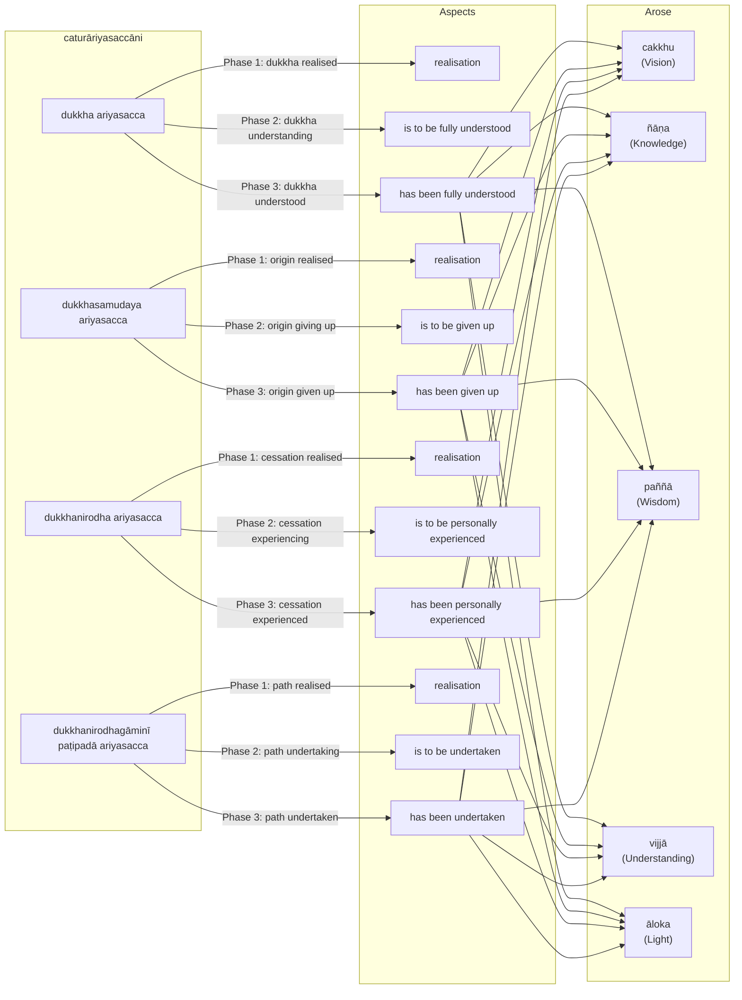
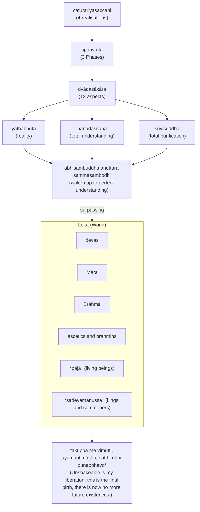

import { Tabs, TabItem } from '@astrojs/starlight/components';

The Four Realisations (often called Noble Truths) form the core of Buddha's soteriology, and framework for the rest of his teachings. The framework states that life itself is suffering, provides the cause and the way out of suffering through the Eightfold Path.

The basic teaching of the Four Realisations (`dukkham samudayo nirodho magga`) can be expressed as a medical diagnosis ([The Dawn of Abhidharma](https://www.buddhismuskunde.uni-hamburg.de/pdf/4-publikationen/hamburg-buddhist-studies/hamburgup-hbs2-analayo-abhidharma.pdf) p. 113):

* disease: `dukkha` (suffering)
* pathogen: `taṇhā` (desire)
* health: `nibbāna` (extinguishment)
* cure: eightfold path

The four realisations can also be expressed in terms of the well known consulting framework SCQA (Situation - Complication - Question - Answer)

* Situation: life is `dukkha` (suffering)
* Complication: suffering is caused by `taṇhā` (desire)
* Question: how to achieve `nibbāna` (extinguishment) of suffering?
* Answer: follow the eightfold path

The Buddha's exposition of the four realisations follow the [Minto Pyramid](https://www.barbaraminto.com).

## References

* [3V/1.6 Pañcavaggiyakathā #71-80](https://tipitaka2500.github.io/tipitaka/3V/1/1.6.html#71)
* [14S5/12.2.1 Dhammacakkappavattanasutta #2209-2215](https://tipitaka2500.github.io/tipitaka/14S5/12/12.2/12.2.1.html#2209)

Other references (expansions):

* [7D/9.4.5 Dhammānupassanāsaccapabba](https://tipitaka2500.github.io/tipitaka/7D/9/9.4/9.4.5.html)
* [11M/4.11 Saccavibhaṅgasutta](https://tipitaka2500.github.io/tipitaka/11M/4/4.11.html)

## The Realisation of Suffering (`dukkhaṃ ariyasaccaṃ`)

<Tabs syncKey="paliquote">
<TabItem label="My Translation">
This, bhikkhave, is the realisation of suffering. Suffering is:

* birth,
* aging,
* illness,
* death;
* sorrow, lamentation, pain, grief, and despair;
* association with the disliked;
* separation from the liked;
* not getting what one wants is suffering.

In brief, the five collections acting as fuel are suffering.
</TabItem>

<TabItem label="Pāḷi (Roman IAST)">
> Idaṃ kho pana, bhikkhave, dukkhaṃ ariyasaccaṃ. Jātipi dukkhā, jarāpi dukkhā, byādhipi dukkho, maraṇampi dukkhaṃ, appiyehi sampayogo dukkho, piyehi vippayogo dukkho, yampicchaṃ na labhati tampi dukkhaṃ. Saṃkhittena, pañcupādānakkhandhā dukkhā.
</TabItem>

<TabItem label="Pāḷi (Brahmi)">
> 𑀇𑀤𑀁 𑀔𑁄 𑀧𑀦, 𑀪𑀺𑀓𑁆𑀔𑀯𑁂, 𑀤𑀼𑀓𑁆𑀔𑀁 𑀅𑀭𑀺𑀬𑀲𑀘𑁆𑀘𑀁𑁇 𑀚𑀸𑀢𑀺𑀧𑀺 𑀤𑀼𑀓𑁆𑀔𑀸, 𑀚𑀭𑀸𑀧𑀺 𑀤𑀼𑀓𑁆𑀔𑀸, 𑀩𑁆𑀬𑀸𑀥𑀺𑀧𑀺 𑀤𑀼𑀓𑁆𑀔𑁄, 𑀫𑀭𑀡𑀫𑁆𑀧𑀺 𑀤𑀼𑀓𑁆𑀔𑀁, 𑀅𑀧𑁆𑀧𑀺𑀬𑁂𑀳𑀺 𑀲𑀫𑁆𑀧𑀬𑁄𑀕𑁄 𑀤𑀼𑀓𑁆𑀔𑁄, 𑀧𑀺𑀬𑁂𑀳𑀺 𑀯𑀺𑀧𑁆𑀧𑀬𑁄𑀕𑁄 𑀤𑀼𑀓𑁆𑀔𑁄, 𑀬𑀫𑁆𑀧𑀺𑀘𑁆𑀙𑀁 𑀦 𑀮𑀪𑀢𑀺 𑀢𑀫𑁆𑀧𑀺 𑀤𑀼𑀓𑁆𑀔𑀁𑁇 𑀲𑀁𑀔𑀺𑀢𑁆𑀢𑁂𑀦, 𑀧𑀜𑁆𑀘𑀼𑀧𑀸𑀤𑀸𑀦𑀓𑁆𑀔𑀦𑁆𑀥𑀸 𑀤𑀼𑀓𑁆𑀔𑀸𑁇
</TabItem>
</Tabs>

## The Realisation of the Cause of Suffering (`dukkhasamudayaṃ ariyasaccaṃ`)

<Tabs syncKey="paliquote">
<TabItem label="My Translation">
This, bhikkhave, is the realisation of the cause of suffering:

* craving leading to renewed existence,
* accompanied by delight and desire,
* seeking delight here and there;

In other words:

* craving for sensual pleasures,
* craving for existence,
* craving for non-existence.
</TabItem>

<TabItem label="Pāḷi (Roman IAST)">
> Idaṃ kho pana, bhikkhave, dukkhasamudayaṃ ariyasaccaṃ—  yāyaṃ taṇhā ponobbhavikā nandīrāgasahagatā tatratatrābhinandinī, seyyathidaṃ—  kāmataṇhā, bhavataṇhā, vibhavataṇhā.
</TabItem>

<TabItem label="Pāḷi (Brahmi)">
> 𑀇𑀤𑀁 𑀔𑁄 𑀧𑀦, 𑀪𑀺𑀓𑁆𑀔𑀯𑁂, 𑀤𑀼𑀓𑁆𑀔𑀲𑀫𑀼𑀤𑀬𑀁 𑀅𑀭𑀺𑀬𑀲𑀘𑁆𑀘𑀁—  𑀬𑀸𑀬𑀁 𑀢𑀡𑁆𑀳𑀸 𑀧𑁄𑀦𑁄𑀩𑁆𑀪𑀯𑀺𑀓𑀸 𑀦𑀦𑁆𑀤𑀻𑀭𑀸𑀕𑀲𑀳𑀕𑀢𑀸 𑀢𑀢𑁆𑀭𑀢𑀢𑁆𑀭𑀸𑀪𑀺𑀦𑀦𑁆𑀤𑀺𑀦𑀻, 𑀲𑁂𑀬𑁆𑀬𑀣𑀺𑀤𑀁—  𑀓𑀸𑀫𑀢𑀡𑁆𑀳𑀸, 𑀪𑀯𑀢𑀡𑁆𑀳𑀸, 𑀯𑀺𑀪𑀯𑀢𑀡𑁆𑀳𑀸𑁇
</TabItem>
</Tabs>

## The Realisation of the Cessation of Suffering (`dukkhanirodhaṃ ariyasaccaṃ`)

<Tabs syncKey="paliquote">
<TabItem label="My Translation">
This, bhikkhave, is the realisation of the cessation of suffering: it is the:

* complete fading away and cessation of that same craving,
* its abandonment,
* relinquishment,
* release, and
* non-attachment.
</TabItem>

<TabItem label="Pāḷi (Roman IAST)">
> Idaṃ kho pana, bhikkhave, dukkhanirodhaṃ ariyasaccaṃ—  yo tassāyeva taṇhāya asesavirāganirodho, cāgo, paṭinissaggo, mutti, anālayo.
</TabItem>

<TabItem label="Pāḷi (Brahmi)">
> 𑀇𑀤𑀁 𑀔𑁄 𑀧𑀦, 𑀪𑀺𑀓𑁆𑀔𑀯𑁂, 𑀤𑀼𑀓𑁆𑀔𑀦𑀺𑀭𑁄𑀥𑀁 𑀅𑀭𑀺𑀬𑀲𑀘𑁆𑀘𑀁—  𑀬𑁄 𑀢𑀲𑁆𑀲𑀸𑀬𑁂𑀯 𑀢𑀡𑁆𑀳𑀸𑀬 𑀅𑀲𑁂𑀲𑀯𑀺𑀭𑀸𑀕𑀦𑀺𑀭𑁄𑀥𑁄, 𑀘𑀸𑀕𑁄, 𑀧𑀝𑀺𑀦𑀺𑀲𑁆𑀲𑀕𑁆𑀕𑁄, 𑀫𑀼𑀢𑁆𑀢𑀺, 𑀅𑀦𑀸𑀮𑀬𑁄𑁇
</TabItem>
</Tabs>

## The Realisation of the Path Leading To The Cessation of Suffering (`dukkhanirodhagāminī paṭipadā ariyasaccaṃ`)

<Tabs syncKey="paliquote">
<TabItem label="My Translation">
This, bhikkhave, is the realisation of the path leading to the cessation of suffering: it is this Eightfold Path, that is:

* Right View,
* Right Intention,
* Right Speech,
* Right Action,
* Right Way of Living,
* Right Effort,
* Right Awareness,
* Right Focus.

Other references (expansion):
</TabItem>

<TabItem label="Pāḷi (Roman IAST)">
> Idaṃ kho pana, bhikkhave, dukkhanirodhagāminī paṭipadā ariyasaccaṃ—  ayameva ariyo aṭṭhaṅgiko maggo, seyyathidaṃ—  sammādiṭṭhi, sammāsaṅkappo, sammāvācā, sammākammanto, sammāājīvo, sammāvāyāmo, sammāsati, sammāsamādhi.
</TabItem>

<TabItem label="Pāḷi (Brahmi)">
> 𑀇𑀤𑀁 𑀔𑁄 𑀧𑀦, 𑀪𑀺𑀓𑁆𑀔𑀯𑁂, 𑀤𑀼𑀓𑁆𑀔𑀦𑀺𑀭𑁄𑀥𑀕𑀸𑀫𑀺𑀦𑀻 𑀧𑀝𑀺𑀧𑀤𑀸 𑀅𑀭𑀺𑀬𑀲𑀘𑁆𑀘𑀁—  𑀅𑀬𑀫𑁂𑀯 𑀅𑀭𑀺𑀬𑁄 𑀅𑀝𑁆𑀞𑀗𑁆𑀕𑀺𑀓𑁄 𑀫𑀕𑁆𑀕𑁄, 𑀲𑁂𑀬𑁆𑀬𑀣𑀺𑀤𑀁—  𑀲𑀫𑁆𑀫𑀸𑀤𑀺𑀝𑁆𑀞𑀺, 𑀲𑀫𑁆𑀫𑀸𑀲𑀗𑁆𑀓𑀧𑁆𑀧𑁄, 𑀲𑀫𑁆𑀫𑀸𑀯𑀸𑀘𑀸, 𑀲𑀫𑁆𑀫𑀸𑀓𑀫𑁆𑀫𑀦𑁆𑀢𑁄, 𑀲𑀫𑁆𑀫𑀸𑀆𑀚𑀻𑀯𑁄, 𑀲𑀫𑁆𑀫𑀸𑀯𑀸𑀬𑀸𑀫𑁄, 𑀲𑀫𑁆𑀫𑀸𑀲𑀢𑀺, 𑀲𑀫𑁆𑀫𑀸𑀲𑀫𑀸𑀥𑀺𑁇
</TabItem>
</Tabs>

* [14S5/1.1.8 Vibhaṅgasutta](https://tipitaka2500.github.io/tipitaka/14S5/1/1.1/1.1.8.html)

## Three Phases (`tiparivaṭṭaṃ`) and Twelve Aspects (`dvādasākāraṃ`)

