import { Tabs, TabItem } from '@astrojs/starlight/components';

The Four Realisations (often called Noble Truths) form the core of Buddha's soteriology, and framework for the rest of his teachings. The framework states that life itself is suffering, provides the cause and the way out of suffering through the Eightfold Path.

The basic teaching of the Four Realisations (`dukkham samudayo nirodho magga`) can be expressed as a medical diagnosis ([The Dawn of Abhidharma](https://www.buddhismuskunde.uni-hamburg.de/pdf/4-publikationen/hamburg-buddhist-studies/hamburgup-hbs2-analayo-abhidharma.pdf) p. 113):

* disease: `dukkha` (suffering)
* pathogen: `taṇhā` (desire)
* health: `nibbāna` (extinguishment)
* cure: eightfold path

The four realisations can also be expressed in terms of the well known consulting framework SCQA (Situation - Complication - Question - Answer)

* Situation: life is `dukkha` (suffering)
* Complication: suffering is caused by `taṇhā` (desire)
* Question: how to achieve `nibbāna` (extinguishment) of suffering?
* Answer: follow the eightfold path

The Buddha's exposition of the four realisations follow the [Minto Pyramid](https://www.barbaraminto.com).

## References

* [3V/1.6 Pañcavaggiyakathā #71-80](https://tipitaka2500.github.io/tipitaka/3V/1/1.6.html#71)
* [14S5/12.2.1 Dhammacakkappavattanasutta #2209-2215](https://tipitaka2500.github.io/tipitaka/14S5/12/12.2/12.2.1.html#2209)

Other references (expansions):

* [7D/9.4.5 Dhammānupassanāsaccapabba](https://tipitaka2500.github.io/tipitaka/7D/9/9.4/9.4.5.html)
* [11M/4.11 Saccavibhaṅgasutta](https://tipitaka2500.github.io/tipitaka/11M/4/4.11.html)

## The Realisation of Suffering (`dukkhaṃ ariyasaccaṃ`)

<Tabs syncKey="paliquote">
<TabItem label="My Translation">
This, bhikkhave, is the realisation of suffering. Suffering is:

* birth,
* aging,
* illness,
* death;
* sorrow, lamentation, pain, grief, and despair;
* association with the disliked;
* separation from the liked;
* not getting what one wants is suffering.

In brief, the five collections acting as fuel are suffering.
</TabItem>

<TabItem label="Pāḷi (Roman IAST)">
> Idaṃ kho pana, bhikkhave, dukkhaṃ ariyasaccaṃ. Jātipi dukkhā, jarāpi dukkhā, byādhipi dukkho, maraṇampi dukkhaṃ, appiyehi sampayogo dukkho, piyehi vippayogo dukkho, yampicchaṃ na labhati tampi dukkhaṃ. Saṃkhittena, pañcupādānakkhandhā dukkhā.
</TabItem>

<TabItem label="Pāḷi (Brahmi)">
> 𑀇𑀤𑀁 𑀔𑁄 𑀧𑀦, 𑀪𑀺𑀓𑁆𑀔𑀯𑁂, 𑀤𑀼𑀓𑁆𑀔𑀁 𑀅𑀭𑀺𑀬𑀲𑀘𑁆𑀘𑀁𑁇 𑀚𑀸𑀢𑀺𑀧𑀺 𑀤𑀼𑀓𑁆𑀔𑀸, 𑀚𑀭𑀸𑀧𑀺 𑀤𑀼𑀓𑁆𑀔𑀸, 𑀩𑁆𑀬𑀸𑀥𑀺𑀧𑀺 𑀤𑀼𑀓𑁆𑀔𑁄, 𑀫𑀭𑀡𑀫𑁆𑀧𑀺 𑀤𑀼𑀓𑁆𑀔𑀁, 𑀅𑀧𑁆𑀧𑀺𑀬𑁂𑀳𑀺 𑀲𑀫𑁆𑀧𑀬𑁄𑀕𑁄 𑀤𑀼𑀓𑁆𑀔𑁄, 𑀧𑀺𑀬𑁂𑀳𑀺 𑀯𑀺𑀧𑁆𑀧𑀬𑁄𑀕𑁄 𑀤𑀼𑀓𑁆𑀔𑁄, 𑀬𑀫𑁆𑀧𑀺𑀘𑁆𑀙𑀁 𑀦 𑀮𑀪𑀢𑀺 𑀢𑀫𑁆𑀧𑀺 𑀤𑀼𑀓𑁆𑀔𑀁𑁇 𑀲𑀁𑀔𑀺𑀢𑁆𑀢𑁂𑀦, 𑀧𑀜𑁆𑀘𑀼𑀧𑀸𑀤𑀸𑀦𑀓𑁆𑀔𑀦𑁆𑀥𑀸 𑀤𑀼𑀓𑁆𑀔𑀸𑁇
</TabItem>
</Tabs>

## The Realisation of the Cause of Suffering (`dukkhasamudayaṃ ariyasaccaṃ`)

<Tabs syncKey="paliquote">
<TabItem label="My Translation">
This, bhikkhave, is the realisation of the cause of suffering:

* craving leading to renewed existence,
* accompanied by delight and desire,
* seeking delight here and there;

In other words:

* craving for sensual pleasures,
* craving for existence,
* craving for non-existence.
</TabItem>

<TabItem label="Pāḷi (Roman IAST)">
> Idaṃ kho pana, bhikkhave, dukkhasamudayaṃ ariyasaccaṃ—  yāyaṃ taṇhā ponobbhavikā nandīrāgasahagatā tatratatrābhinandinī, seyyathidaṃ—  kāmataṇhā, bhavataṇhā, vibhavataṇhā.
</TabItem>

<TabItem label="Pāḷi (Brahmi)">
> 𑀇𑀤𑀁 𑀔𑁄 𑀧𑀦, 𑀪𑀺𑀓𑁆𑀔𑀯𑁂, 𑀤𑀼𑀓𑁆𑀔𑀲𑀫𑀼𑀤𑀬𑀁 𑀅𑀭𑀺𑀬𑀲𑀘𑁆𑀘𑀁—  𑀬𑀸𑀬𑀁 𑀢𑀡𑁆𑀳𑀸 𑀧𑁄𑀦𑁄𑀩𑁆𑀪𑀯𑀺𑀓𑀸 𑀦𑀦𑁆𑀤𑀻𑀭𑀸𑀕𑀲𑀳𑀕𑀢𑀸 𑀢𑀢𑁆𑀭𑀢𑀢𑁆𑀭𑀸𑀪𑀺𑀦𑀦𑁆𑀤𑀺𑀦𑀻, 𑀲𑁂𑀬𑁆𑀬𑀣𑀺𑀤𑀁—  𑀓𑀸𑀫𑀢𑀡𑁆𑀳𑀸, 𑀪𑀯𑀢𑀡𑁆𑀳𑀸, 𑀯𑀺𑀪𑀯𑀢𑀡𑁆𑀳𑀸𑁇
</TabItem>
</Tabs>

## The Realisation of the Cessation of Suffering (`dukkhanirodhaṃ ariyasaccaṃ`)

<Tabs syncKey="paliquote">
<TabItem label="My Translation">
This, bhikkhave, is the realisation of the cessation of suffering: it is the:

* complete fading away and cessation of that same craving,
* its abandonment,
* relinquishment,
* release, and
* non-attachment.
</TabItem>

<TabItem label="Pāḷi (Roman IAST)">
> Idaṃ kho pana, bhikkhave, dukkhanirodhaṃ ariyasaccaṃ—  yo tassāyeva taṇhāya asesavirāganirodho, cāgo, paṭinissaggo, mutti, anālayo.
</TabItem>

<TabItem label="Pāḷi (Brahmi)">
> 𑀇𑀤𑀁 𑀔𑁄 𑀧𑀦, 𑀪𑀺𑀓𑁆𑀔𑀯𑁂, 𑀤𑀼𑀓𑁆𑀔𑀦𑀺𑀭𑁄𑀥𑀁 𑀅𑀭𑀺𑀬𑀲𑀘𑁆𑀘𑀁—  𑀬𑁄 𑀢𑀲𑁆𑀲𑀸𑀬𑁂𑀯 𑀢𑀡𑁆𑀳𑀸𑀬 𑀅𑀲𑁂𑀲𑀯𑀺𑀭𑀸𑀕𑀦𑀺𑀭𑁄𑀥𑁄, 𑀘𑀸𑀕𑁄, 𑀧𑀝𑀺𑀦𑀺𑀲𑁆𑀲𑀕𑁆𑀕𑁄, 𑀫𑀼𑀢𑁆𑀢𑀺, 𑀅𑀦𑀸𑀮𑀬𑁄𑁇
</TabItem>
</Tabs>

## The Realisation of the Path Leading To The Cessation of Suffering (`dukkhanirodhagāminī paṭipadā ariyasaccaṃ`)

<Tabs syncKey="paliquote">
<TabItem label="My Translation">
This, bhikkhave, is the realisation of the path leading to the cessation of suffering: it is this Eightfold Path, that is:

* Right View,
* Right Intention,
* Right Speech,
* Right Action,
* Right Way of Living,
* Right Effort,
* Right Awareness,
* Right Focus.

Other references (expansion):
</TabItem>

<TabItem label="Pāḷi (Roman IAST)">
> Idaṃ kho pana, bhikkhave, dukkhanirodhagāminī paṭipadā ariyasaccaṃ—  ayameva ariyo aṭṭhaṅgiko maggo, seyyathidaṃ—  sammādiṭṭhi, sammāsaṅkappo, sammāvācā, sammākammanto, sammāājīvo, sammāvāyāmo, sammāsati, sammāsamādhi.
</TabItem>

<TabItem label="Pāḷi (Brahmi)">
> 𑀇𑀤𑀁 𑀔𑁄 𑀧𑀦, 𑀪𑀺𑀓𑁆𑀔𑀯𑁂, 𑀤𑀼𑀓𑁆𑀔𑀦𑀺𑀭𑁄𑀥𑀕𑀸𑀫𑀺𑀦𑀻 𑀧𑀝𑀺𑀧𑀤𑀸 𑀅𑀭𑀺𑀬𑀲𑀘𑁆𑀘𑀁—  𑀅𑀬𑀫𑁂𑀯 𑀅𑀭𑀺𑀬𑁄 𑀅𑀝𑁆𑀞𑀗𑁆𑀕𑀺𑀓𑁄 𑀫𑀕𑁆𑀕𑁄, 𑀲𑁂𑀬𑁆𑀬𑀣𑀺𑀤𑀁—  𑀲𑀫𑁆𑀫𑀸𑀤𑀺𑀝𑁆𑀞𑀺, 𑀲𑀫𑁆𑀫𑀸𑀲𑀗𑁆𑀓𑀧𑁆𑀧𑁄, 𑀲𑀫𑁆𑀫𑀸𑀯𑀸𑀘𑀸, 𑀲𑀫𑁆𑀫𑀸𑀓𑀫𑁆𑀫𑀦𑁆𑀢𑁄, 𑀲𑀫𑁆𑀫𑀸𑀆𑀚𑀻𑀯𑁄, 𑀲𑀫𑁆𑀫𑀸𑀯𑀸𑀬𑀸𑀫𑁄, 𑀲𑀫𑁆𑀫𑀸𑀲𑀢𑀺, 𑀲𑀫𑁆𑀫𑀸𑀲𑀫𑀸𑀥𑀺𑁇
</TabItem>
</Tabs>

* [14S5/1.1.8 Vibhaṅgasutta](https://tipitaka2500.github.io/tipitaka/14S5/1/1.1/1.1.8.html)

## Three Phases (`tiparivaṭṭaṃ`) and Twelve Aspects (`dvādasākāraṃ`)

```mermaid
graph
    NT["caturāriyasaccāni<br>(4 realisations)"] --> P3["tiparivaṭṭa<br>(3 Phases)"] --> A12["dvādasākāra<br>(12 aspects)"] --> A & B & C --> D["abhisambuddha anuttara sammāsambodhi<br>(woken up to perfect understanding)"] -->|surpassing| L --> O["*akuppā me vimutti, ayamantimā jāti, natthi dāni punabbhavo*<br>(Unshakeable is my liberation, this is the final birth, there is now no more future existences.)"]
    A["yathābhūta<br>(reality)"]
    B["ñāṇadassana<br>(total understanding)"]
    C["suvisuddha<br>(total purification)"]
    subgraph L["Loka (World)"]
        L1["devas"]
        L2["Māra"]
        L3["Brahmā"]
        L4["ascetics and brahmins"]
        L5["*pajā* (living beings)"]
        L6["*sadevamanussa* (kings and commoners)"]
    end
```

## Are the Four Realisations self-evident?

The Four Realisations need to be understood in the context of dependent origination. This is made clear when Koṇḍañña attains `dhammacakkhu` (insight into the dhamma) immediately after hearing the four realisations, his "liberating insight" consist of the following words:

> `yaṃ kiñci samudayadhammaṃ sabbaṃ taṃ nirodhadhamman` \
> ("Whatever phenomena is subject to origination is completely subject to cessation.")

Without this context, the Four Realisations can seem banal or self-evident, and perhaps limited in their salvific value. For example, Frauwallner in **History Of Indian Philosophy, Volume 1**[^Frauwallner1973] writes:

[^Frauwallner1973]: Frauwallner, E. (1973). History Of Indian Philosophy, Volume 1: The Philosophy Of The Veda And Of The Epic The Buddha And The Jina The Sāmkhya And The Classical Yoga System. Motilal Banarsidass Publishers.

> But in general the emptiness or hollowness, from the point of contents, of this sermon is surprising. Measured according to the standard of that time, there is nothing special in it. The view that everything earthly is full of sorrow lies at the basis of the whole striving for Release which fills that period. To find the source of sorrow in thirst is also no new thought. Because, as we have already seen earlier, the teaching of Yājñavalkya knows the desire as the cause of entanglement in the cycle of births. Only its designation as thirst is a more rare and less common expression. What finally concerns the way to Deliverance — the noble eight-fold path — it is not a clearly sketched out way but merely an undefined frame worded in general colourless expressions. The question now urges itself as to how this emptiness of contents (of the doctrine of four noble truths) is to be explained, and whether there is nothing in the Buddhistic canonical text which completes or supplements the preaching of four noble truths and represents the things taught in it in a more detailed manner.

It would seem Frauwallner has not really appreciated how radical and original the concept of phenomenalism (conceptualised as dependent origination) would have been in Buddha's time. Confronted with this radical notion, the four realisations would indeed have seemed "earth and heaven shaking" to the five ascetics.

Polak in **REEXAMINING JHĀNA**[^Polak2011] states:

[^Polak2011]: Polak, G. (2011). REEXAMINING JHĀNA: Towards a Critical Reconstruction of Early Buddhist Soteriology. WYDAWNICTWO UMCS.

> I would like to investigate the issue of the three doctrines, which are supposed to be the theoretical pinnacle of early Buddhism: the four noble truths, the dependant co-arising, and the five khandhas. Whenever one opens any popular book on the early Buddhism, one is due to bump into these concepts. All these concepts have already been evaluated by several scholars, including Schmithausen, Bronkhorst (1986: 101), and Wynne, as later developments not belonging to the earliest stratum of Buddhism. They have noted that insight into the four noble truths during the fourth jhāna, is impossible from the psychological standpoint. I will attempt to show that the acceptation of these concepts as the 'methods of insight' caused great problems for the ancient Buddhists. There are suttas, which report that many monks found these 'theoretical methods' inefficient in the dispelling of the 'self-view' and in attaining the ultimate breakthrough. There are also suttas presenting the four noble truths in opposition to the release from the āsavas, describing them as a preliminary insight attained at the initial stages of the path to liberation. I want to emphasize the fact that these three theories possess a very limited explanative power, when it comes to elucidating the causes of the arising of the ignorance and of the self-view. If we are to accept the fact, that these three concepts are the pinnacle of the theoretical background of early Buddhism, we must also accept the fact that it was a rather crude and primitive doctrine.

There seems to be an assumption in Polak's article that these concepts do not explain how liberation is achieved, only that it is possible. Let's question this assumption. The Eightfold Path seems to be clear enough, and can be understood without referencing any spiritual or meditative practice. The Buddha's "solution" also seems simple enough: it's basically ceasing or stopping unproductive and non-optimal mental constructs.

Therefore the implied issue seems to be that the Buddha has not provided any instructions on how to cease these mental constructs, or that the cessation of mental constructs did not result in a sense of liberation.

Perhaps the analogy to losing weight may be apt. The Buddha is saying the benefit of ceasing non optimal mental constructs should be self-evident, ie. liberation from `dukkha`, just like a successful weight loss regimen should be physically observable, in that the subject will no longer be overweight.

So perhaps the issue is the difficulty or lack of guidance on how to cease mental constructs. The Buddha did not provide specific instructions on how to achieve cessation because this depends on the individual. Similarly, losing weight is a combination of eating less and being more physically active - the specifics will depend on the individual's eating and physical habits. Therefore, ceasing mental constructions will depend on the nature of the mental constructs. In both cases (losing weight and eradicating `dukkha`), the person's "willpower" or resolve is important, as are a number of additional factors (enumerated in the Eightfold path).

Based on this, I do not believe the Buddha's discourse "possess a very limited explanative power" - it would seem the Buddha explained what needed to be explained, and the rest is up to the individual to "figure out" based on their circumstances.

## Are the Four Realisations a late addition or synthesis rather than what the Buddha may have originally thought?

Some scholars have speculated that the Four Realisations are a late invention, a synthesis and simplification of dependent origination into a framework reminiscent of a medical diagnosis and cure. Clues that the realisations may have been a later synthesis reformulated as the first discourse include the presence of various anomalies and anachronisms embedded within the text. For example, the five collections (`khandha`s) are mentioned as part of the the first realisation, yet are not introduced and explained until the second discourse. The five ascetics should have been referred to as `samaṇa` (recluses or renunciants) rather than `bhikkhu`, as the `saṅgha` has not been formalised yet. Thirdly, the introduction of the proclamations of the various levels of deities seem fanciful and potentially inserted at a late stage when the Buddha has been reified and his teachings elevated to a religious doctrine.

Norman in **The Four Noble Truths**[^Norman2003] also points out many editions that refer to the four realisations contain syntactic and grammatical errors, indicating a less than perfect mastery of the language, or possibly text that have originated in a local dialect and then converted or standardised into Pāḷi. This accounts for the possibly misleading translation of the four realisations as the "four noble truths" which leads to interpretative and translative difficulties.

[^Norman2003]: Norman, K. R. (2003). The Four Noble Truths. In K.R. Norman Collected Papers II: Vol. Volume for J.W. de Jong (pp. 210–223). Pali Text Society.

For example, Bronkhorst in **Buddhist Teaching in India**[^Bronkhorst2009] comments that "... in some versions of the first sermon — probably the older ones — the Four Noble Truths or other forms of liberating knowledge are not mentioned at all." He also adds that the three phases and 12 aspects are "probably later additions." Rhys Davids in **Curious Omissions in Pali Canonical Texts**[^RhysDavids1935] points out that the four realisations are absent from the Fours of the Añguttara-nikāya.

[^Bronkhorst2009]: Bronkhorst, J. (2009). Buddhist Teaching in India. Wisdom Publications.

[^RhysDavids1935]: Rhys Davids, C. A. F. (1935). Curious Omissions in Pali Canonical Texts. Journal of the Royal Asiatic Society, 721–724.

Anderson in **Pain and its Ending, The Four Noble Truths in the Theravāda Buddhist Canon**[^Anderson2001] concludes that "the Ariyapariyesana-sutta shows that certain redactors of the canon conceived of the Buddha's act of teaching without the four noble truths" and "... the four noble truths emerged into the canonical tradition at a particular point and slowly became recognized as the first teaching of the Buddha ... [being] a doctrine that came to be identified as the central teaching of the Buddha by the time of the commentaries".

[^Anderson2001]: Anderson, C. S. (2001). Pain and its Ending, The Four Noble Truths in the Theravāda Buddhist Canon. Motilal Banarsidass.

However, Anālayo in **The Chinese Parallels to the Dhammacakkappavattana-sutta (1)**[^Anālayo2012] argues against the theory that the Four Realisations are a late addition, proposing instead that the shorter texts are intentional extracts from a longer, multi-part discourse, and that the Mūlasarvāstivāda and Sarvāstivāda traditions considered the teaching on the "three turnings" to be the central element that set the wheel of Dharma in motion.

[^Anālayo2012]: Anālayo. (2012). The Chinese Parallels to the Dhammacakkappavattana-sutta (1). Journal of the Oxford Centre for Buddhist Studies, 3, 12–46.

Dhammananda in **What Buddhists Believe**[^WhatTheBuddhaThought] speculates that "... there was an earlier, probably shorter, version, which contained the gist of the present version; and that the entire text rested on a memory in the Sangha, quite likely buttressed by the Buddha while he was still alive, that those were the topics he talked about on that occasion."

[^WhatTheBuddhaThought]: **"What Buddhists Believe"** by *Dr K Sri Dhammananda*

My view is that the Four Realisations would have been "accepted" as part of Buddha's teachings by the time the Khandhaka was compiled, but may or may not have been incorporated in his very first discourse. Perhaps the author/compiler of the Khandhaka incorporated it into the narrative because he felt this was the "best" way to explain the Buddha's teachings to a fresh audience, rather than the philosophical concept of dependent origination. In any case, dependent origination was already explained earlier, so there is no need to repeat it in this section. Based on this, it would seem plausible that the entire contents of the First Discourse is an invention of the author/compiler of the Khandhaka, formed from combining various stories and teachings into a single narrative.

## `yathābhūta` (reality)

This is a phrase that has often been misunderstood by Buddhists as somehow pertaining to a divine or mystical ability to "see things as they truly are", or perhaps to see things that cannot normally be seen, such as deities and non-human beings in different worlds or realms of existence, the ability to see past lives, other people's thoughts, the undelying or true nature of the universe, etc.

These are excessive speculations. What is meant here is presumably that the Buddha was able to perceive the phenomenal nature of our subjective and perceptual experience of reality. The "reality" we perceive may be quite different from external reality. Indeed, it could be said we are all living in our own constructed "world", sharing some features but fundamentally different of other perceptions of their reality. As an extreme, we could even argue we have no definite proof that an actual reality exists, and everything could be a figment of our imagination, including other living beings.

According to Kalupahana in **The Philosophy of Early History in Buddhism**[^Kalupahana1981]: `yathābhūta` pertains to:

[^Kalupahana1981]: Kalupahana, D. J. (1981). The Philosophy of Early History in Buddhism. Journal of the Pali Text Society, IV(10, 117–126.

> 'knowledge of things as they have come to be' (yathābhüttañāna), not 'knowledge of things as they are' isolated from the background. Knowledge of things as they have come to be would involve the past as well as present events conditioned by the past.

Was the Buddha a realist or anti-realist? Ie. did he believe that an "extrinsic reality" exists outside of our perceptual experience, and we may be able to determine what it is, or is "the world an illusion", purely constructed out of our lived experience?

The answer, as per the Buddha's opinion of the "self", is that the Buddha neither confirmed nor denied the existence of "true" reality. Smith in **Was the Buddha an Anti-Realist?**[^Smith2015] argues that the Buddha was probably not an anti-realist but propounded 'an intentionally incomplete or "inchoate" metaphysics with realist suggestions'.

[^Smith2015]: Smith, D. (2015). Was the Buddha an Anti-Realist? Journal of the Oxford Centre for Buddhist Studies, 11, 143–178.

On one hand, it would seem the Buddha did experience a physical reality post awakening - he experienced sickness, physical pain, aging and eventually death. He still needed to eat, rest and sleep. These are documented in the Khandhaka and various suttas. So it would seem `yathābhūta` does not exclude these very human experiences. Moreover, this reality was shared with the bhikkhus and bhikkhunis in the community. Living in peace post `nibbāna` does not exclude potentially unpleasant events. `nibbāna` probably represents the "unconstructed", "ungenerated" and therefore "unexperienced." Physical pain need not result in feelings of suffering - the former is extrinsic reality, the latter are mental constructions.

On the other hand, it could be argued that the ability to perform "magic" or supernatural powers, or the ability to perceive and interact with non-human or celestial beings could imply our reality is "constructed" or "imagined" (having no physical basis), and can therefore be reconstructed or altered by the Buddha. Moreover, it could also imply the Buddha was able to influence the constructed reality of other beings. This is clearly possible if these other beings were also constructed by him, but then the Buddha's teachings would then be interpreted as him teaching other personality instances of himself.

Generations of Buddhists of different sects have probably speculated on the true nature of reality. Theravādins believe that reality (`dhamma`) can be ultimately deconstructed into "moments" - atomic mental constructions. The true nature of reality (or "ultimate reality") are simply these moments and nothing more. There is no other reality (that can be perceived by or known to us). Hence the `dhamma` of mind moments is reality.

The Sarvāstivādins extended the concept of these dhammas, or "mind moments", even further - not only do they postulate that ultimately reality is nothing more than these mind moments - they believe the past, present and future are nothing more than these `dhamma`s - they all simultaneously exist in our minds. This is true to an extent - our memories of the past coexist along with our present thoughts and conceptions about the future. However, the Sarvāstivādins are essentially claiming time itself is constructed, and subjectively experienced. This would imply a deterministic universe - that the future can be fully determined from the actions of the past and present. However, it does not necessarily imply we have no free will - by unconstructing these dhammas, we are essentially unconstructing the future.

In a sense, the Sarvāstivādin notion of `dhamma` resembles the [one-electron universe](https://en.wikipedia.org/wiki/One-electron_universe) theory, proposed by John Wheeler and further explored by Richard Feynman. This is a speculative hypothesis suggesting that all electrons and positrons (the antimatter counterpart of an electron) are actually manifestations of a single, fundamental entity traversing through time.

The Mahāyānans took this concept to it's ultimate conclusion: if our reality is nothing more than mind moments, which are constructed by us, then reality is nothing more than an illusion - there is no physical reality, only constructed reality. Therefore, `yathābhūta` ultimately is the experience of emptiness, or no experience at all. Once we realise everything is constructed, we can deconstruct it all and then there is nothing left (`suññatā`). This is the fundamental realisation in the Heart Sutra, a highly influential work that have been embraced by many, even today, though not all fully understand it's core thesis.

The Mahāyānan position may seem extreme, but it does resolve a number of outstanding philosophical issues surrounding the Buddha's teachings. If everyone around us are constructed, ie. imagined by ourselves or perhaps representing alternate versions of ourselves, then the Buddha is not a real human being but an abstract concept, a construct in our minds. Therefore, the Buddha's teachings can be regarded as a set of "absolute truths" that will become self evident once we have dispelled ignorance, and the Buddha is an idealised version of ourselves - there is a Buddha within each of us. The "Buddha" can be regarded as an eternal omniscient being living in an idealised "Pure Land" surrounded by a "Buddha field". The Mahāyānans can disregard the physical nature of the Buddha, and regard his human frailty and failings as yet another illusion caused by our imperfections. It also explains why the Mahāyānans believe true liberation can only be achieved when all living beings are liberated, not just ourselves.

In a sense, the Mahāyānan beliefs in many ways resemble the [Simulation Hypothesis](https://en.wikipedia.org/wiki/Simulation_hypothesis) proposed by Nick Bostrom, which suggests that reality could be an artificial simulation, such as a computer simulation. If we are living in a simulation, then our reality is indeed constructed, and can be deconstructed.

All these are extensions of the Buddha's teachings. As can be seen in these early discourses, they are not necessarily implied or explicitly articulated by him. In some ways, Mahāyāna Buddhism has many parallels to Brahmanical and Hindu beliefs, and it is possible that the Mahāyānan doctrines were influenced by these beliefs. The concept of an eternal, abstract Buddha can be seen as a parallel to the Brahmanical concept of an eternal, abstract Brahman. The Mahāyānan concept of `śūnyatā` (emptiness) can be seen as a parallel to the Hindu concept of `maya` (illusion). The Mahāyānan concept of `buddha-dhatu` (Buddha-nature) can be seen as a parallel to the Hindu concept of `ātman` (self). I have spoken to a number of Hindus who believe Buddhism is simply an extreme, fringe version of Hinduism.

## `punabbhavo` (future existences)

> `akuppā me vimutti, ayamantimā jāti, natthi dāni punabbhavo` \
> ("Unshakeable is my liberation, this is the final birth, there is now no more future existences.")

This phrase has often been interpreted as the Buddha claiming he is no longer subject to `saṃsāra` (the endless cycle of births and rebirths).

However, note that up to this point the Buddha has not explicitly mentioned rebirth. Yes, `jāti` can be used to refer to a rebirth, but what the Buddha is referring to here is the liberation from `bhavataṇhā` (the craving for existence).

`punabbhavo` means "existence again, or repeated existence" so is apparently a clear reference to rebirth. However, given the context is `vimutti` (liberation), the Buddha is referring to the liberation from `dukkha`, and therefore this phrase could be interpreted as "liberation from (concern about) future existence, or ongoing existence." This does not necessarily endorse the concept of rebirth, simply that it is no longer something the Buddha is concerned about.

It is important to note that the Buddha did not invent the concept of rebirth, it was already a commonly-accepted notion during his time (see [On Kamma and Rebirth](/buddhavacana/articles/kamma)). He neither advocated it, nor rejected it, but felt that his soteriology was compatible with it. Here the Buddha is possibly addressing the potential criticism that liberation may not be permanent and the liberated person may be subject to dukkha in future lives, The Buddha is emphasising that if one is truly liberated, then this concern should also have ceased.
