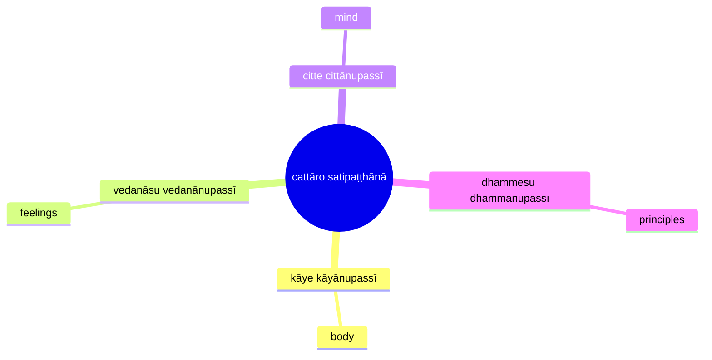
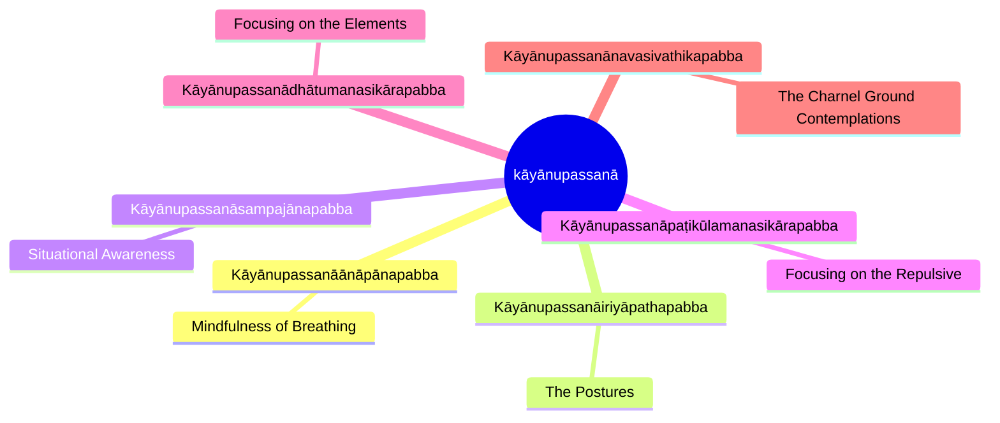
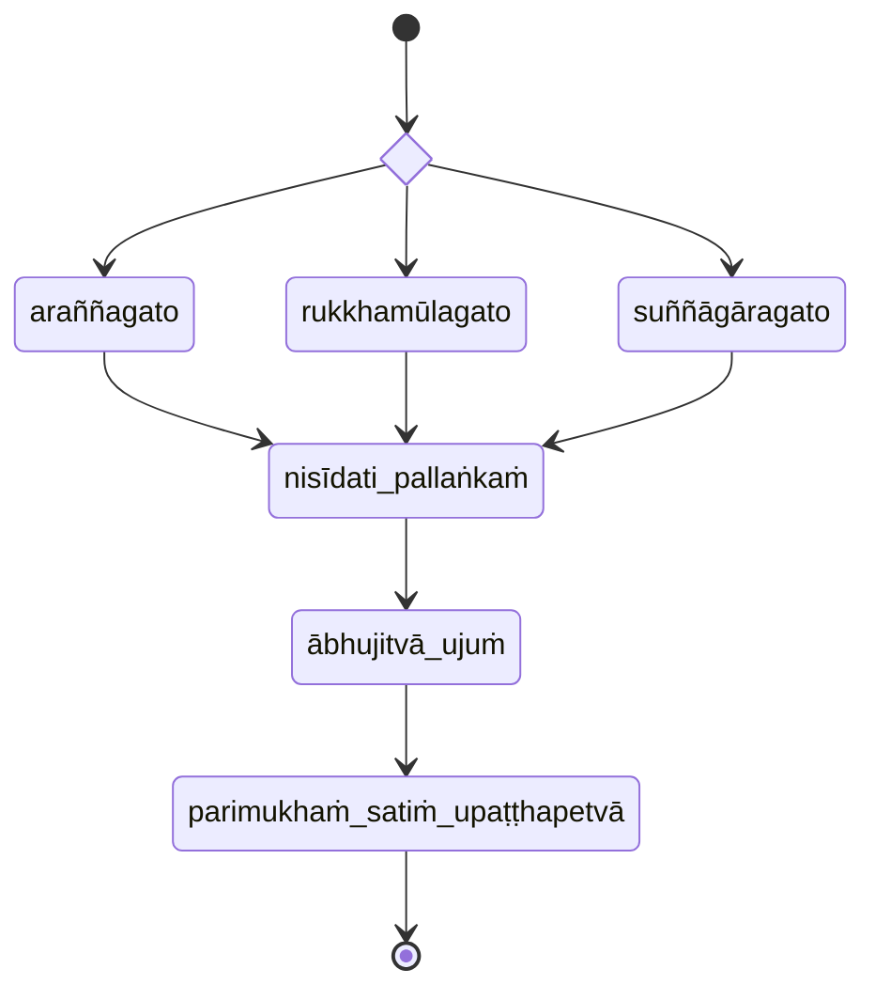

## Four Reflective Methods (`cattāro satipaṭṭhānā`)

* [7D/9 Mahāsatipaṭṭhānasutta](https://tipitaka2500.github.io/tipitaka/7D/9.html)

viharati ātāpī sampajāno satimā vineyya loke abhijjhādomanassaṁ (keen, aware, and mindful, rid of desire and aversion for the world)

### Kāyānupassanā

#### Kāyānupassanāānāpānapabba

