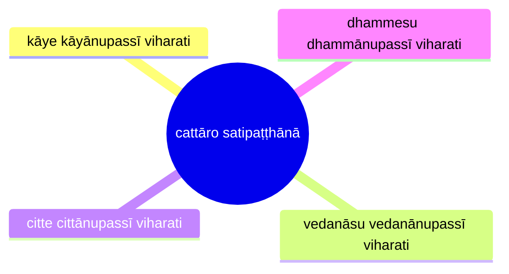
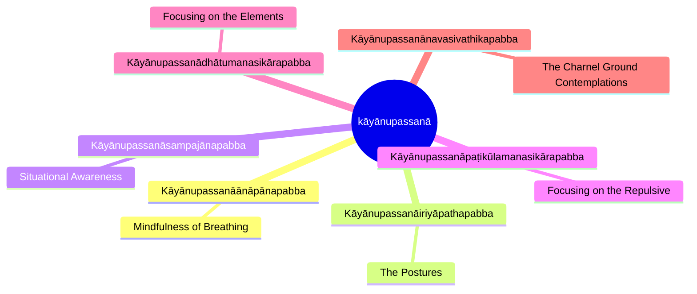
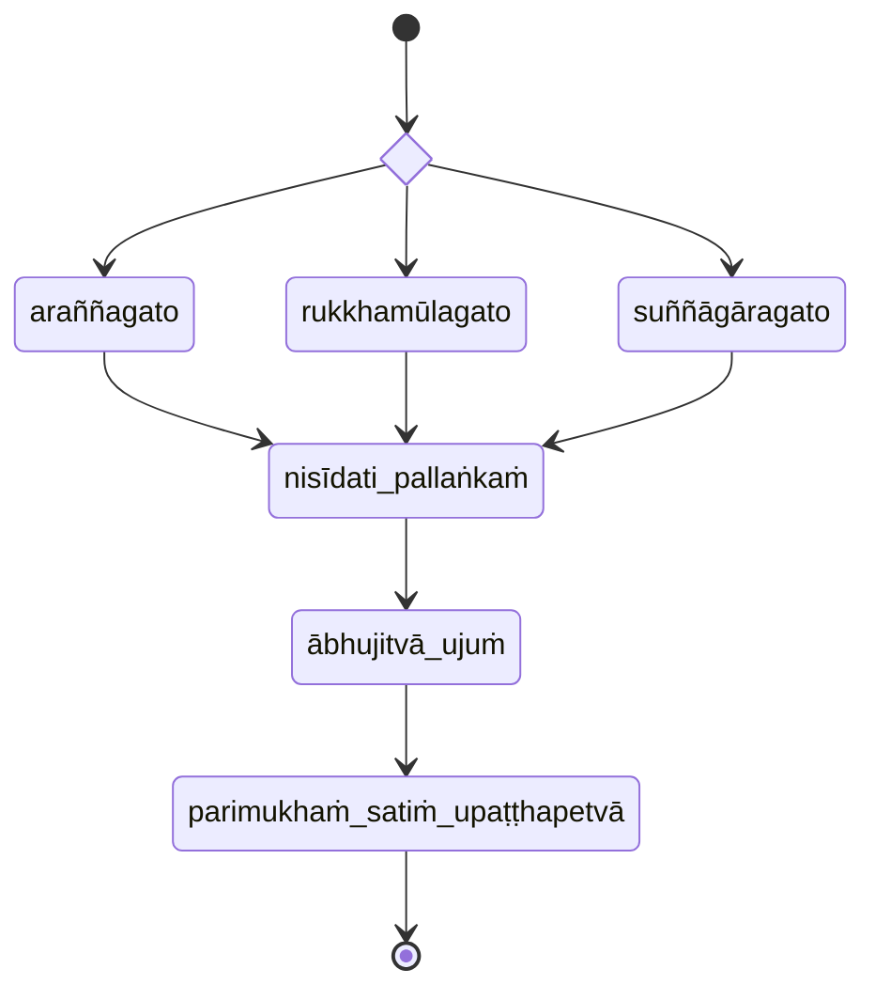

import { Tabs, TabItem } from '@astrojs/starlight/components';

* [14S5/3.1.1 Ambapālisutta](https://tipitaka2500.github.io/tipitaka/7D/9.html)

<Tabs syncKey="paliquote">
<TabItem label="My Translation">
> 751\. “Bhikkhave, this is the one and only way
>
> * for the purification of beings,
> * for the overcoming of sorrow and lamentation,
> * for the disappearance of pain and distress,
> * for the attainment of the right method,
> * for the realisation of Nibbāna
>
> — namely, `cattāro satipaṭṭhānā` (the four reflections). Which four? Here, bhikkhave:
>
> * a bhikkhu `kāye kāyānupassī viharati` (dwells contemplating the body [or, physical objects] in the body), ardent, clearly comprehending, and mindful, having overcome covetousness and aversion in the world;
> * he dwells contemplating `vedanā` (feelings) in feelings ... ;
> * he dwells contemplating `citta` (the mind) in the mind ... ;
> * he dwells contemplating `dhamma` (perceptual objects) in dhamma ... .
>
> This is the one and only way for the purification of beings, for the overcoming of sorrow and lamentation, for the disappearance of pain and distress, for the attainment of the right method, for the realization of Nibbāna — namely, the four reflections.”
</TabItem>

<TabItem label="Pāḷi (Roman IAST)">
751\. “Ekāyanvāyaṃ, bhikkhave, maggo sattānaṃ visuddhiyā sokaparidevānaṃ samatikkamāya dukkhadomanassānaṃ atthaṅgamāya ñāyassa adhigamāya nibbānassa sacchikiriyāya, yadidaṃ—  cattāro satipaṭṭhānā. Katame cattāro? Idha, bhikkhave, bhikkhu kāye kāyānupassī viharati ātāpī sampajāno satimā, vineyya loke abhijjhādomanassaṃ; vedanāsu vedanānupassī viharati ātāpī sampajāno satimā, vineyya loke abhijjhādomanassaṃ; citte cittānupassī viharati ātāpī sampajāno satimā, vineyya loke abhijjhādomanassaṃ; dhammesu dhammānupassī viharati ātāpī sampajāno satimā, vineyya loke abhijjhādomanassaṃ. Ekāyanvāyaṃ, bhikkhave, maggo sattānaṃ visuddhiyā sokaparidevānaṃ samatikkamāya dukkhadomanassānaṃ atthaṅgamāya ñāyassa adhigamāya nibbānassa sacchikiriyāya, yadidaṃ—  cattāro satipaṭṭhānā”ti.
</TabItem>

<TabItem label="Pāḷi (Brahmi)">
751\. “𑀏𑀓𑀸𑀬𑀦𑁆𑀯𑀸𑀬𑀁, 𑀪𑀺𑀓𑁆𑀔𑀯𑁂, 𑀫𑀕𑁆𑀕𑁄 𑀲𑀢𑁆𑀢𑀸𑀦𑀁 𑀯𑀺𑀲𑀼𑀤𑁆𑀥𑀺𑀬𑀸 𑀲𑁄𑀓𑀧𑀭𑀺𑀤𑁂𑀯𑀸𑀦𑀁 𑀲𑀫𑀢𑀺𑀓𑁆𑀓𑀫𑀸𑀬 𑀤𑀼𑀓𑁆𑀔𑀤𑁄𑀫𑀦𑀲𑁆𑀲𑀸𑀦𑀁 𑀅𑀢𑁆𑀣𑀗𑁆𑀕𑀫𑀸𑀬 𑀜𑀸𑀬𑀲𑁆𑀲 𑀅𑀥𑀺𑀕𑀫𑀸𑀬 𑀦𑀺𑀩𑁆𑀩𑀸𑀦𑀲𑁆𑀲 𑀲𑀘𑁆𑀙𑀺𑀓𑀺𑀭𑀺𑀬𑀸𑀬, 𑀬𑀤𑀺𑀤𑀁—  𑀘𑀢𑁆𑀢𑀸𑀭𑁄 𑀲𑀢𑀺𑀧𑀝𑁆𑀞𑀸𑀦𑀸. 𑀓𑀢𑀫𑁂 𑀘𑀢𑁆𑀢𑀸𑀭𑁄? 𑀇𑀥, 𑀪𑀺𑀓𑁆𑀔𑀯𑁂, 𑀪𑀺𑀓𑁆𑀔𑀼 𑀓𑀸𑀬𑁂 𑀓𑀸𑀬𑀸𑀦𑀼𑀧𑀲𑁆𑀲𑀻 𑀯𑀺𑀳𑀭𑀢𑀺 𑀆𑀢𑀸𑀧𑀻 𑀲𑀫𑁆𑀧𑀚𑀸𑀦𑁄 𑀲𑀢𑀺𑀫𑀸, 𑀯𑀺𑀦𑁂𑀬𑁆𑀬 𑀮𑁄𑀓𑁂 𑀅𑀪𑀺𑀚𑁆𑀛𑀸𑀤𑁄𑀫𑀦𑀲𑁆𑀲𑀁; 𑀯𑁂𑀤𑀦𑀸𑀲𑀼 𑀯𑁂𑀤𑀦𑀸𑀦𑀼𑀧𑀲𑁆𑀲𑀻 𑀯𑀺𑀳𑀭𑀢𑀺 𑀆𑀢𑀸𑀧𑀻 𑀲𑀫𑁆𑀧𑀚𑀸𑀦𑁄 𑀲𑀢𑀺𑀫𑀸, 𑀯𑀺𑀦𑁂𑀬𑁆𑀬 𑀮𑁄𑀓𑁂 𑀅𑀪𑀺𑀚𑁆𑀛𑀸𑀤𑁄𑀫𑀦𑀲𑁆𑀲𑀁; 𑀘𑀺𑀢𑁆𑀢𑁂 𑀘𑀺𑀢𑁆𑀢𑀸𑀦𑀼𑀧𑀲𑁆𑀲𑀻 𑀯𑀺𑀳𑀭𑀢𑀺 𑀆𑀢𑀸𑀧𑀻 𑀲𑀫𑁆𑀧𑀚𑀸𑀦𑁄 𑀲𑀢𑀺𑀫𑀸, 𑀯𑀺𑀦𑁂𑀬𑁆𑀬 𑀮𑁄𑀓𑁂 𑀅𑀪𑀺𑀚𑁆𑀛𑀸𑀤𑁄𑀫𑀦𑀲𑁆𑀲𑀁; 𑀥𑀫𑁆𑀫𑁂𑀲𑀼 𑀥𑀫𑁆𑀫𑀸𑀦𑀼𑀧𑀲𑁆𑀲𑀻 𑀯𑀺𑀳𑀭𑀢𑀺 𑀆𑀢𑀸𑀧𑀻 𑀲𑀫𑁆𑀧𑀚𑀸𑀦𑁄 𑀲𑀢𑀺𑀫𑀸, 𑀯𑀺𑀦𑁂𑀬𑁆𑀬 𑀮𑁄𑀓𑁂 𑀅𑀪𑀺𑀚𑁆𑀛𑀸𑀤𑁄𑀫𑀦𑀲𑁆𑀲𑀁. 𑀏𑀓𑀸𑀬𑀦𑁆𑀯𑀸𑀬𑀁, 𑀪𑀺𑀓𑁆𑀔𑀯𑁂, 𑀫𑀕𑁆𑀕𑁄 𑀲𑀢𑁆𑀢𑀸𑀦𑀁 𑀯𑀺𑀲𑀼𑀤𑁆𑀥𑀺𑀬𑀸 𑀲𑁄𑀓𑀧𑀭𑀺𑀤𑁂𑀯𑀸𑀦𑀁 𑀲𑀫𑀢𑀺𑀓𑁆𑀓𑀫𑀸𑀬 𑀤𑀼𑀓𑁆𑀔𑀤𑁄𑀫𑀦𑀲𑁆𑀲𑀸𑀦𑀁 𑀅𑀢𑁆𑀣𑀗𑁆𑀕𑀫𑀸𑀬 𑀜𑀸𑀬𑀲𑁆𑀲 𑀅𑀥𑀺𑀕𑀫𑀸𑀬 𑀦𑀺𑀩𑁆𑀩𑀸𑀦𑀲𑁆𑀲 𑀲𑀘𑁆𑀙𑀺𑀓𑀺𑀭𑀺𑀬𑀸𑀬, 𑀬𑀤𑀺𑀤𑀁—  𑀘𑀢𑁆𑀢𑀸𑀭𑁄 𑀲𑀢𑀺𑀧𑀝𑁆𑀞𑀸𑀦𑀸”𑀢𑀺.
</TabItem>
</Tabs>

[7D/9 Mahāsatipaṭṭhānasutta](https://tipitaka2500.github.io/tipitaka/7D/9.html):

* kāye kāyānupassī viharati (dwells contemplating the body in the body)
* vedanāsu vedanānupassī viharati (dwells contemplating feelings in feelings)
* citte cittānupassī viharati (dwells contemplating the mind in the mind)
* dhammesu dhammānupassī viharati (dwells contemplating phenomena in phenomena)

### Kāyānupassanā

#### Kāyānupassanāānāpānapabba

