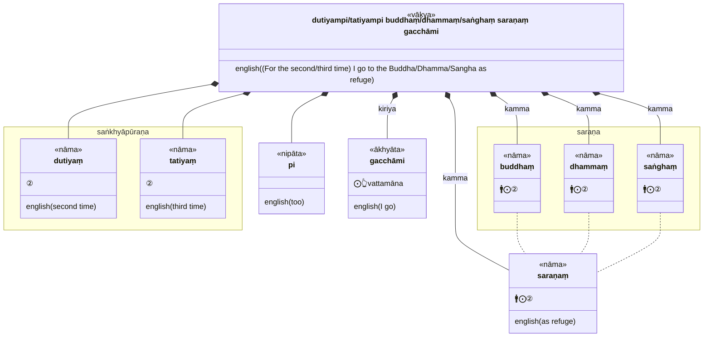
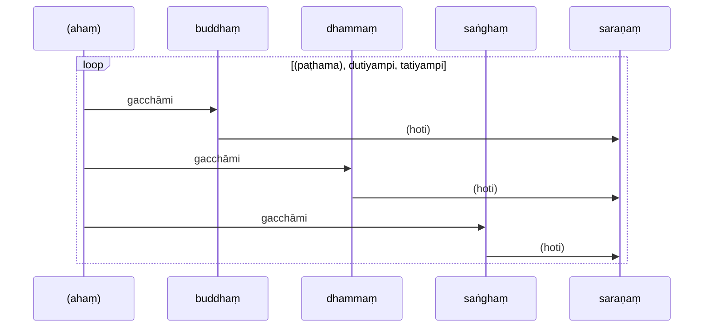
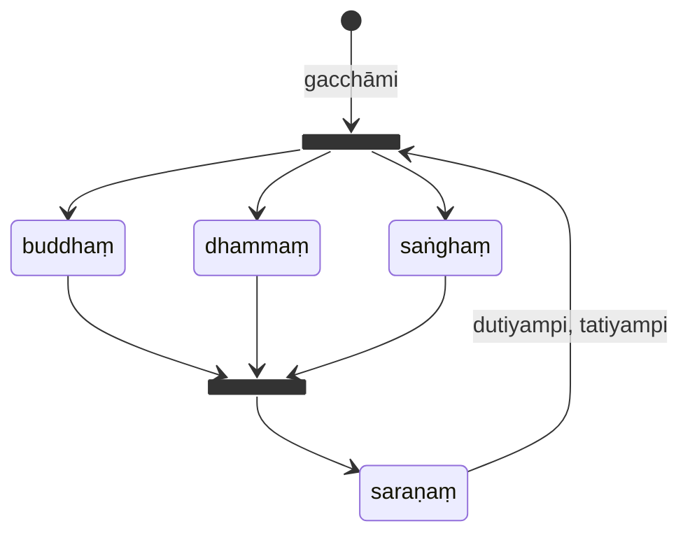

* [18Kh/1 Saraṇattaya](https://tipitaka2500.github.io/tipitaka/18Kh/1.html)

>buddhaṃ saraṇaṃ gacchāmi,  
>dhammaṃ saraṇaṃ gacchāmi,  
>saṅghaṃ saraṇaṃ gacchāmi.  
>dutiyampi buddhaṃ saraṇaṃ gacchāmi,  
>dutiyampi dhammaṃ saraṇaṃ gacchāmi,  
>dutiyampi saṅghaṃ saraṇaṃ gacchāmi.  
>tatiyampi buddhaṃ saraṇaṃ gacchāmi,  
>tatiyampi dhammaṃ saraṇaṃ gacchāmi,  
>tatiyampi saṅghaṃ saraṇaṃ gacchāmi.

