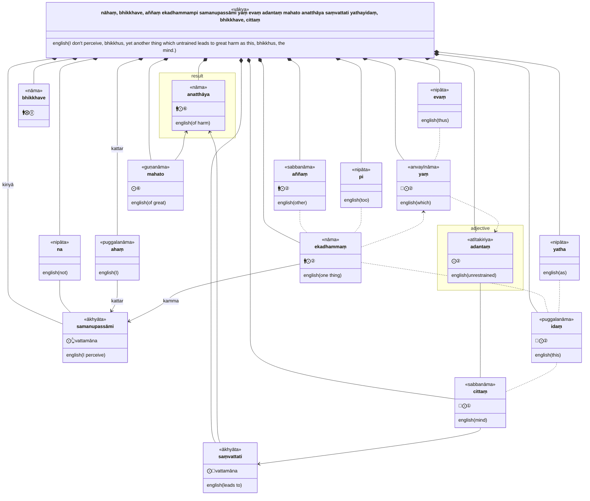
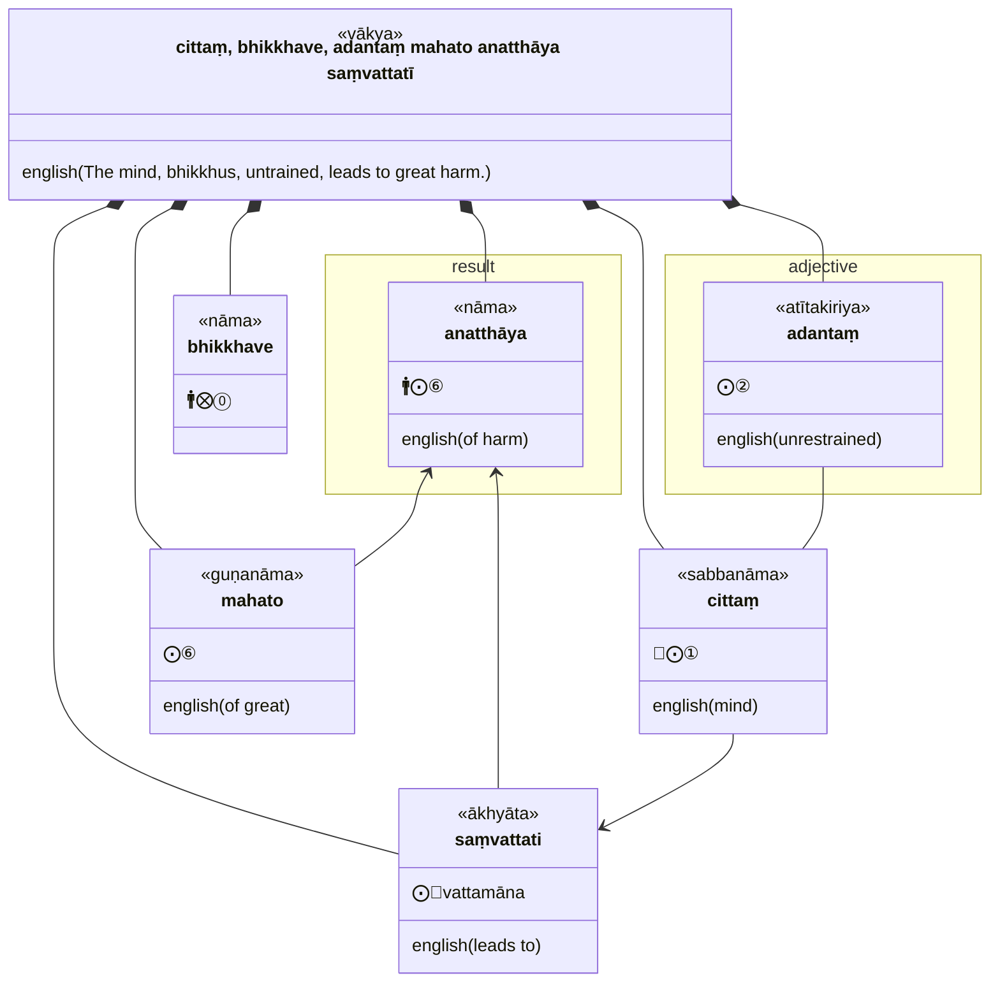
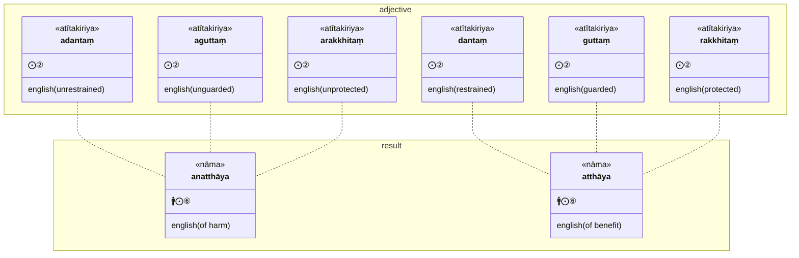
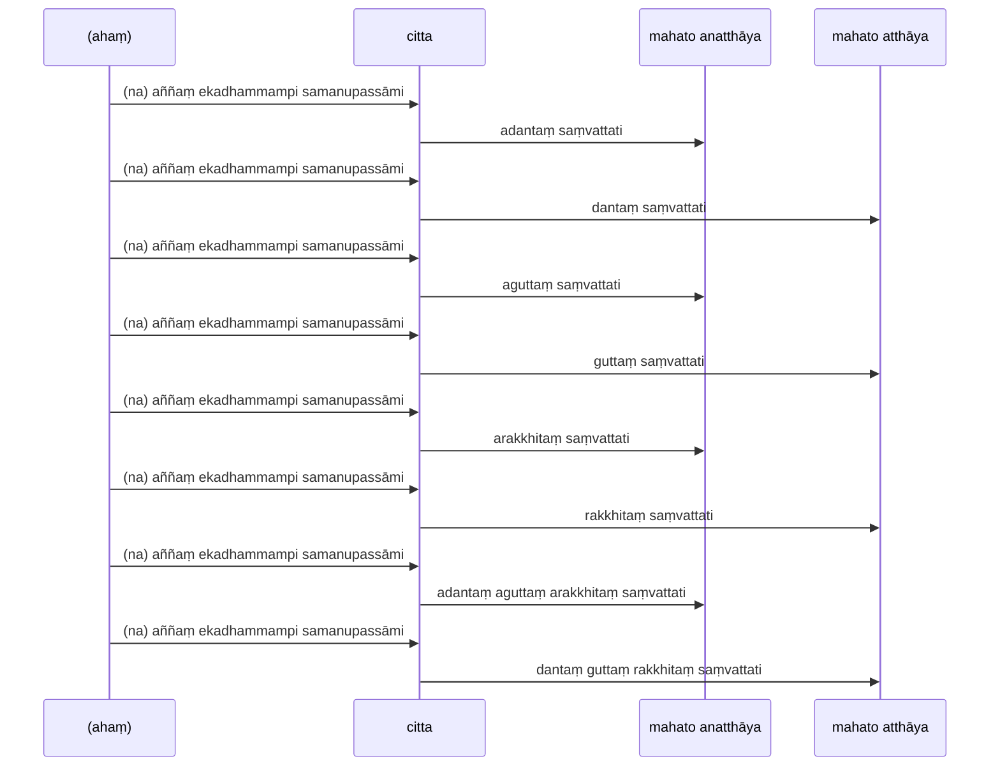
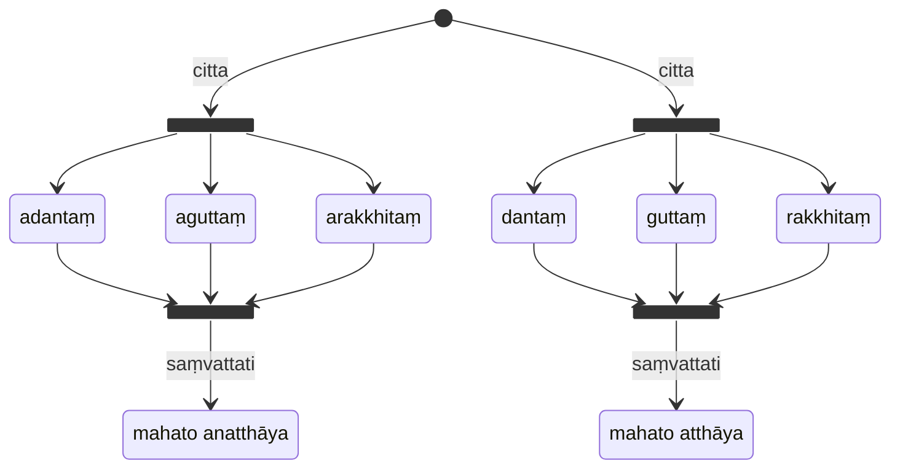

Restraining, Guarding and Protecting the Mind

* [15A1/4 Adantavagga](https://tipitaka2500.github.io/tipitaka/15A1/4.html)

>31. "nāhaṃ, bhikkhave, aññaṃ ekadhammampi samanupassāmi yaṃ evaṃ adantaṃ mahato anatthāya saṃvattati yathayidaṃ, bhikkhave, cittaṃ. cittaṃ, bhikkhave, adantaṃ mahato anatthāya saṃvattatī"ti.
>32. "nāhaṃ, bhikkhave, aññaṃ ekadhammampi samanupassāmi yaṃ evaṃ dantaṃ mahato atthāya saṃvattati yathayidaṃ, bhikkhave, cittaṃ. cittaṃ, bhikkhave, dantaṃ mahato atthāya saṃvattatī"ti.
>33. "nāhaṃ, bhikkhave, aññaṃ ekadhammampi samanupassāmi yaṃ evaṃ aguttaṃ mahato anatthāya saṃvattati yathayidaṃ, bhikkhave, cittaṃ. cittaṃ, bhikkhave, aguttaṃ mahato anatthāya saṃvattatī"ti.
>34. "nāhaṃ, bhikkhave, aññaṃ ekadhammampi samanupassāmi yaṃ evaṃ guttaṃ mahato atthāya saṃvattati yathayidaṃ, bhikkhave, cittaṃ. cittaṃ, bhikkhave, guttaṃ mahato atthāya saṃvattatī"ti.
>35. "nāhaṃ, bhikkhave, aññaṃ ekadhammampi samanupassāmi yaṃ evaṃ arakkhitaṃ mahato anatthāya saṃvattati yathayidaṃ, bhikkhave, cittaṃ. cittaṃ, bhikkhave, arakkhitaṃ mahato anatthāya saṃvattatī"ti.
>36. "nāhaṃ, bhikkhave, aññaṃ ekadhammampi samanupassāmi yaṃ evaṃ rakkhitaṃ mahato atthāya saṃvattati yathayidaṃ, bhikkhave, cittaṃ. cittaṃ, bhikkhave, rakkhitaṃ mahato atthāya saṃvattatī"ti.
>37. "nāhaṃ, bhikkhave, aññaṃ ekadhammampi samanupassāmi yaṃ evaṃ asaṃvutaṃ mahato anatthāya saṃvattati yathayidaṃ, bhikkhave, cittaṃ. cittaṃ, bhikkhave, asaṃvutaṃ mahato anatthāya saṃvattatī"ti.
>38. "nāhaṃ, bhikkhave, aññaṃ ekadhammampi samanupassāmi yaṃ evaṃ saṃvutaṃ mahato atthāya saṃvattati yathayidaṃ, bhikkhave, cittaṃ. cittaṃ, bhikkhave, saṃvutaṃ mahato atthāya saṃvattatī"ti.
>39. "nāhaṃ, bhikkhave, aññaṃ ekadhammampi samanupassāmi yaṃ evaṃ adantaṃ aguttaṃ arakkhitaṃ asaṃvutaṃ mahato anatthāya saṃvattati yathayidaṃ, bhikkhave, cittaṃ. cittaṃ, bhikkhave, adantaṃ aguttaṃ arakkhitaṃ asaṃvutaṃ mahato anatthāya saṃvattatī"ti.
>40. "nāhaṃ, bhikkhave, aññaṃ ekadhammampi samanupassāmi yaṃ evaṃ dantaṃ guttaṃ rakkhitaṃ saṃvutaṃ mahato atthāya saṃvattati yathayidaṃ, bhikkhave, cittaṃ. cittaṃ, bhikkhave, dantaṃ guttaṃ rakkhitaṃ saṃvutaṃ mahato atthāya saṃvattatī"ti.

