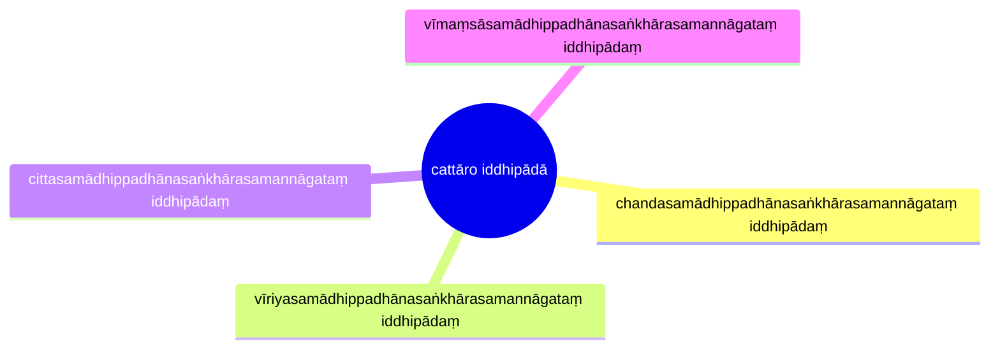

import { Tabs, TabItem } from '@astrojs/starlight/components';

[14S5/7.1.1 Apārasutta](https://tipitaka2500.github.io/tipitaka/14S5/7/7.1/7.1.1.html)

<Tabs syncKey="paliquote">
<TabItem label="My Translation">
1341\. “Bhikkhave, these four bases of success, when developed and cultivated, lead from the near shore to the far shore. Which four? Here, bhikkhave, a bhikkhu
>
> * develops the basis of success that possesses focus born of `chanda` (eagerness), along with the formations of exertion;
> * develops the basis of success that possesses focus born of `vīriya` (energy) ...;
> * develops the basis of success that possesses focus born of `citta` (mind) ...;
> * develops the basis of success that possesses focus born of `vīmaṃsā` (discrimination) ....
>
> Indeed, bhikkhave, these four bases of success, when developed and cultivated, lead from the near shore to the far shore.”
</TabItem>

<TabItem label="Pāḷi (Roman IAST)">
1341\. “Cattārome, bhikkhave, iddhipādā bhāvitā bahulīkatā apārā pāraṃ gamanāya saṃvattanti. Katame cattāro? Idha, bhikkhave, bhikkhu chandasamādhippadhānasaṅkhārasamannāgataṃ iddhipādaṃ bhāveti, vīriyasamādhippadhānasaṅkhārasamannāgataṃ iddhipādaṃ bhāveti, cittasamādhippadhānasaṅkhārasamannāgataṃ iddhipādaṃ bhāveti, vīmaṃsāsamādhippadhānasaṅkhārasamannāgataṃ iddhipādaṃ bhāveti. Ime kho, bhikkhave, cattāro iddhipādā bhāvitā bahulīkatā apārā pāraṃ gamanāya saṃvattantī”ti.
</TabItem>

<TabItem label="Pāḷi (Brahmi)">
1341\. “𑀘𑀢𑁆𑀢𑀸𑀭𑁄𑀫𑁂, 𑀪𑀺𑀓𑁆𑀔𑀯𑁂, 𑀇𑀤𑁆𑀥𑀺𑀧𑀸𑀤𑀸 𑀪𑀸𑀯𑀺𑀢𑀸 𑀩𑀳𑀼𑀮𑀻𑀓𑀢𑀸 𑀅𑀧𑀸𑀭𑀸 𑀧𑀸𑀭𑀁 𑀕𑀫𑀦𑀸𑀬 𑀲𑀁𑀯𑀢𑁆𑀢𑀦𑁆𑀢𑀺. 𑀓𑀢𑀫𑁂 𑀘𑀢𑁆𑀢𑀸𑀭𑁄? 𑀇𑀥, 𑀪𑀺𑀓𑁆𑀔𑀯𑁂, 𑀪𑀺𑀓𑁆𑀔𑀼 𑀙𑀦𑁆𑀤𑀲𑀫𑀸𑀥𑀺𑀧𑁆𑀧𑀥𑀸𑀦𑀲𑀗𑁆𑀔𑀸𑀭𑀲𑀫𑀦𑁆𑀦𑀸𑀕𑀢𑀁 𑀇𑀤𑁆𑀥𑀺𑀧𑀸𑀤𑀁 𑀪𑀸𑀯𑁂𑀢𑀺, 𑀯𑀻𑀭𑀺𑀬𑀲𑀫𑀸𑀥𑀺𑀧𑁆𑀧𑀥𑀸𑀦𑀲𑀗𑁆𑀔𑀸𑀭𑀲𑀫𑀦𑁆𑀦𑀸𑀕𑀢𑀁 𑀇𑀤𑁆𑀥𑀺𑀧𑀸𑀤𑀁 𑀪𑀸𑀯𑁂𑀢𑀺, 𑀘𑀺𑀢𑁆𑀢𑀲𑀫𑀸𑀥𑀺𑀧𑁆𑀧𑀥𑀸𑀦𑀲𑀗𑁆𑀔𑀸𑀭𑀲𑀫𑀦𑁆𑀦𑀸𑀕𑀢𑀁 𑀇𑀤𑁆𑀥𑀺𑀧𑀸𑀤𑀁 𑀪𑀸𑀯𑁂𑀢𑀺, 𑀯𑀻𑀫𑀁𑀲𑀸𑀲𑀫𑀸𑀥𑀺𑀧𑁆𑀧𑀥𑀸𑀦𑀲𑀗𑁆𑀔𑀸𑀭𑀲𑀫𑀦𑁆𑀦𑀸𑀕𑀢𑀁 𑀇𑀤𑁆𑀥𑀺𑀧𑀸𑀤𑀁 𑀪𑀸𑀯𑁂𑀢𑀺. 𑀇𑀫𑁂 𑀔𑁄, 𑀪𑀺𑀓𑁆𑀔𑀯𑁂, 𑀘𑀢𑁆𑀢𑀸𑀭𑁄 𑀇𑀤𑁆𑀥𑀺𑀧𑀸𑀤𑀸 𑀪𑀸𑀯𑀺𑀢𑀸 𑀩𑀳𑀼𑀮𑀻𑀓𑀢𑀸 𑀅𑀧𑀸𑀭𑀸 𑀧𑀸𑀭𑀁 𑀕𑀫𑀦𑀸𑀬 𑀲𑀁𑀯𑀢𑁆𑀢𑀦𑁆𑀢𑀻”𑀢𑀺.
</TabItem>
</Tabs>

