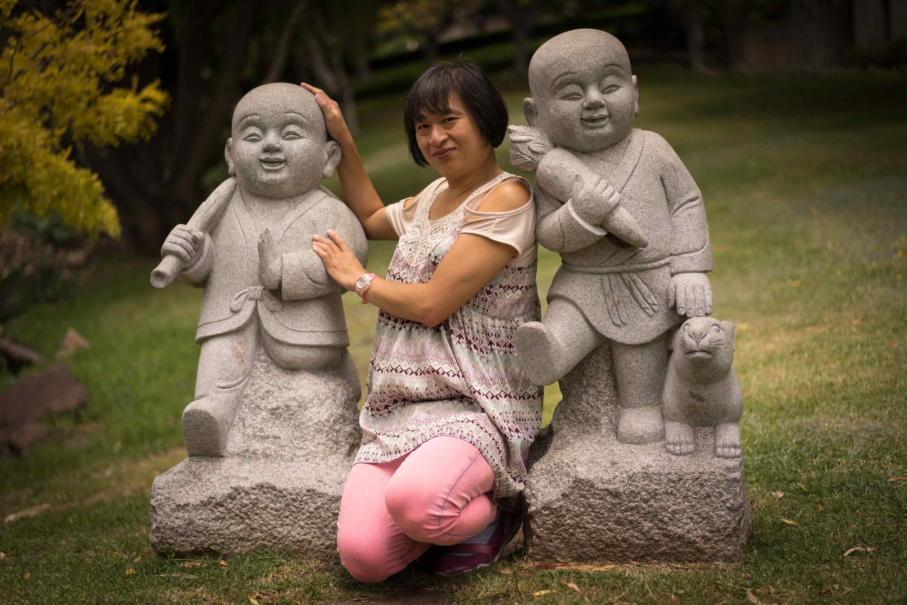

## 𑀩𑀼𑀤𑁆𑀥𑀯𑀘𑀦 is `buddhavacana` (in Brahmi script)

`buddhavacana` is a Pāḷi word meaning "the word (or the utterance) of the Buddha."

:::note
Unless otherwise stated, all translations from Pāḷi to English on this website are done by me.
:::

[Brahmi](/buddhavacana/reference/brahmi/) script is one of the earliest scripts known to India. It came into existence in the form of stone inscriptions during the reign of Asoka, in 4th - 3rd century BCE. Buddhist scriptures inscribed in Brahmi have been found in a collection of manuscripts in caves in Bamiyan (eastern Afghanistan), Gandhara in 1993-95. These are among the earliest surviving Buddhist scriptures that have been discovered.

This website documents my journey reading and studying Buddhist texts, from the Pāḷi Canon (Tipiṭaka) and other texts, but also from various books and articles on Buddhism. It also currently contains some Pāḷi learning resources, such as my Pāḷi dictionary and textbook. Lately I have also started to include Sanskrit texts from a wider corpus. My knowledge of Sanskrit is not as strong as my knowledge of Pāḷi, so please forgive the higher propensity for errors appearing in my Sanskrit to English translations.

This website also allows me to explore my thoughts on what the Buddha may have meant in his teachings, alternative views, and how Buddhism has developed over time. Lately, I have been exploring a larger collection of Buddhist texts and teachings from various traditions.

:::caution
I do not vouch for the truth of the contents in this website. I also do not claim that I have accurately represented the Buddha's intention or the meaning of what he taught. I may revise the content from time to time as my understanding improves.

This website is created out of a need to document my learning progress, that I can reference from time to time to refresh my understanding.

Specifically, this is not a website intended to guide or teach others. In reading this website, you acknowledge that you are interested in understanding my current perspective, and it is not a recommendation or an exhortation for you.
:::

From [7D/3.12 Veḷuvagāmavassūpagamana #351](https://tipitaka2500.github.io/tipitaka/7D/3/3.12.html#351)

> 𑀢𑀲𑁆𑀫𑀸𑀢𑀺𑀳𑀸𑀦𑀦𑁆𑀤, 𑀅𑀢𑁆𑀢𑀤𑀻𑀧𑀸 𑀯𑀺𑀳𑀭𑀣 𑀅𑀢𑁆𑀢𑀲𑀭𑀡𑀸 𑀅𑀦𑀜𑁆𑀜𑀲𑀭𑀡𑀸, 𑀥𑀫𑁆𑀫𑀤𑀻𑀧𑀸 𑀥𑀫𑁆𑀫𑀲𑀭𑀡𑀸 𑀅𑀦𑀜𑁆𑀜𑀲𑀭𑀡𑀸𑁇
> 
> Tasmātihānanda, attadīpā viharatha attasaraṇā anaññasaraṇā, dhammadīpā dhammasaraṇā anaññasaraṇā.
> 
> Therefore, Ānanda, live relying on yourself as your own island, relying on yourself as your own refuge, relying on the Dhamma as your island, relying on the Dhamma as your refuge, not relying on anyone else.

## The World Tipiṭaka Edition

All references to the Pāli Tipiṭaka in this website are links to the [The World Tipiṭaka Edition](https://tipitaka2500.github.io/) - “The Buddhist Era 2500 Great International Council Pāḷi Tipiṭaka, Roman Script 2005” (Mahāsaṅgīti Tipiṭaka Buddhavasse 2500).

The **World Tipiṭaka Edition** is a complete 40-volume Roman-script edition of the 25-century old teaching of the Buddhist Theravāda tradition in the Pāḷi language from the B.E. 2500 (1957) Great Internatonal Buddhist Council.

It is derived from the Chaṭṭhasaṅgīti Council Edition, the Pāḷi-language text in Burmese Script, the result of the Great International Tipiṭaka Council convened in B.E. 2500 (1957) at Yangon by 2,500 erudite Theravāda Buddhist monks from all over the world.

There was initially a website version of the The World Tipiṭaka Edition that was sadly decommissioned, but fortunately an archive of the contents was preserved as a [Github repository](https://github.com/yuttadhammo/World-Tipitaka) by [Yuttadhammo Bhikkhu](https://yuttadhammo.sirimangalo.org/). I have converted this archive into a modern website in 2025 and it can now be accessed [here](https://tipitaka2500.github.io/).

## Who Am I?

My name is Chris Tham. I discovered Buddhism in my early teens, whilst visiting Singapore during a school vacation. An uncle took us to a Buddhist temple, and afterwards gave me a book called **"What Buddhists Believe"** by *Dr K Sri Dhammananda*. I read the whole book overnight and it all made sense to me, so I informally became a Buddhist after that.

Much later on, I stumbled upon another book called **"The Buddha's Explanation of the Universe"** by *C.P. Ranasinghe* which purports to explain in greater explain "Life, the Universe, and Everything" from a Buddhist perspective. These were taken from the Abhidhamma section of the Tipiṭaka. I wanted to study the original texts directly but at that time translations to English were not easily available. For years, I asked anyone who was visiting India or Sri Lanka to buy me books on the Abhidhamma and over the years I have a collected a few works but never the discourses themselves.

I have spent the last several years learning Pāḷi and are now finally able to read the Pāḷi canon and translate them into English. I have created a brand new translation of selections from the Tipiṭaka now available on [tidipa.github.io](https://tidipa.github.io). I have also started reading Buddhist texts in Sanskrit from other traditions outside the Pāḷi canon. As I am not a Buddhist, I don't feel compelled to only follow texts from one tradition and I feel I will have a better understanding of the Buddha's teachings by sampling from multiple traditions.

:::note

## On the writing and translation style

These days, we are increasingly becoming inundated with AI-generated content. It is important to preserve and maintain a human "authenticity" in what gets published. Most of the content on this website are handcrafted by me, so the writing reflects my personal style and there may likely be spelling and grammatical errors. I wish to apologise for that in advance.

I often mix singular and plural forms in the same sentence, which annoys me and I suspect it annoys you too. I am often careless with getting diacritics correct with Pāḷi and Sanskrit words, and it doesn't help that some of these words have also entered the English vocabulary without the diacritics, for example "nirvana" vs `nirvāṇa`, "sutra" vs `sūtra` etc. I also sometimes present Pāḷi and Sanskrit words in nominative form, and sometimes in so called "plain form" or as "lemmas". My preference is for the nominative form, but this is not common practice and sometimes I bow to using the plain form, especially in cases where I am not translating but presenting the words representing themselves. I apologise for the inconsistency.

I sometimes use AI to assist me in summarising other people's content - when I do so I will put in a disclaimer that the text has been generated by an AI model.

With regards to translations, I have a unique translation style which I have not seen elsewhere. First of all, I tend to retain Buddhist technical terms (and I provide the nearest English equivalent within parentheses after the technical term). I also use my own English equivalents rather than relying on popular renditions.

For example, instead of "four noble truths" I will use `cattāri ariyasaccāni` (four realisations). As explained by K. R. Norman and Peter Harvey, the four "truths" are not "noble", but they are the truths of the Noble Ones (who are awakened, liberated, etc.). Also, these are not "universal" or "self-evident" truths but experienced realisations. Rather than using the long winded term "four realisations of the awakened ones" I simply say "four realisations."

Also, rather than saying "five grasping aggregates" I will use `pañcupādānakkhandhā` ("five collections acting as fuel", or simply, "five collections"). The word `upādāna` means "fuel" and according to Richard Gombrich was intended as a reference to the Third Discourse (the parable on burning).

I also dislike some terms used by other translators, such as "cankers", "taints", "defilements"  for `āsavā` (I use "non optimal flows") - I feel it is important not to use emotive or ethicised words to refer to thoughts and mental conditions, however some flows will lead to extinguishment, others lead away from extinguishment. I also dislike the words "conditioned" and "unconditioned" and prefer to refer to `saṅkhato` as "constructed" and `asaṅkhato` as "unconstructed" since the literal meaning of `saṅkhato` is "put together."

I understand that you may find my translation irritating and you may disagree with my rendition of various Buddhist terms. I do not apologise for this. At the very least, I hope you will appreciate that my translations are not generated by AI and not reliant on other translations but represent my unique perspective and understanding of the Buddha's teachings.
:::

## Technical details regarding this website

This website is hosted on [Github](https://github.com) using [Github Pages](https://pages.github.com). It was generated from Markdown and MDX using [Astro](https://astro.build) and the [Starlight](https://starlight.astro.build) theme.
