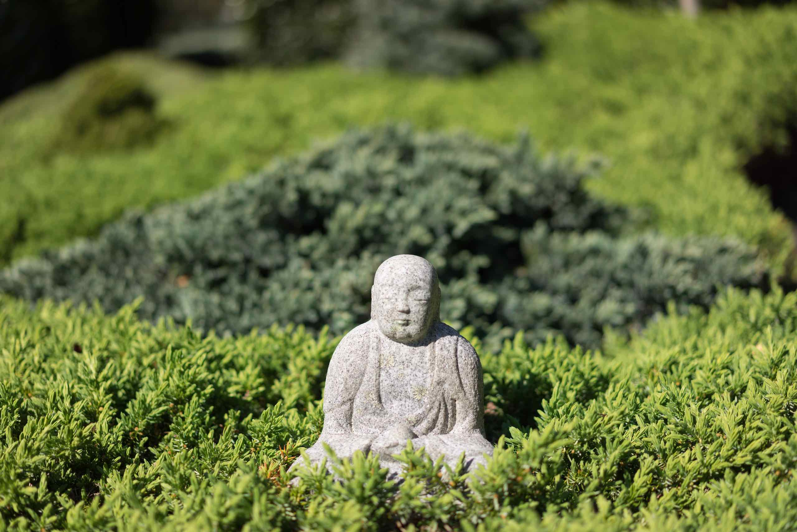

import { CardGrid, Card, LinkCard } from '@astrojs/starlight/components';

## TL;DR

<LinkCard title="Too Long; Didn't Read" description="If you can't be bothered or too busy, and just want to get a gist of what the Buddha taught, click here. I provide a one paragraph overview in plain, ordinary English, without resorting to Buddhist terminology or aspects of Buddhism as a religion. Then, if you are still interested, read beyond the first paragraph to get a better understanding. After that, determine for yourself whether you want to continue exploring the website." href="/buddhavacana/tldr" />

## What is 𑀩𑀼𑀤𑁆𑀥𑀯𑀘𑀦?

𑀩𑀼𑀤𑁆𑀥𑀯𑀘𑀦 is the word `buddhavacana` written in the [Brahmi](/buddhavacana/reference/brahmi/) script in the Pāḷi language.

According the [Dictionary of Pāḷi by Margaret Cone](https://gandhari.org/dictionary?section=dop), `buddhavacana` means:

> the words, the teaching of the Buddha

It is a compound word made up of:

- `buddha` (𑀩𑀼𑀤𑁆𑀥𑀸) meaning "understood", and
- `vacana` (𑀯𑀘𑀦) meaning "speaking, utterance, word"

`Buddha` is often used as an epithet for a specific person who allegedly lived in ancient India over 2500 years ago, born in the Gotama clan of the Sakyan tribe in the foothills of the Himalayas. It is debatable whether this person is a historical figure or a mythical one. He is said to have been dissatisfied with life, searched for and found a way to cease suffering, and then spent the rest of his life teaching others how to do the same. He founded a movement that is now referred to as Buddhism. Buddhism can be viewed as either a religion, spiritual practice, philosophy, or practical way of life.

However `buddha` can also be used to generically refer to anyone who has understood the phenomenological nature of reality and is liberated from suffering. In Buddhist mythology, there have been many Buddhas in the past, and there will be many more in the future. Gotama Buddha was simply one of many, and perhaps not even the most recent. Some Buddhists believe that the `Buddha` is a "concept" or "ideal" that anyone can aspire to. There is a potential `Buddha` within each of us, and we become `Buddha` when we achieve understanding and liberation. Some Buddhists even believe that the world we experience is devoid of substantive existence or reality, and therefore everything we perceive, including other living beings and even Buddhas, are simply manifestations of our own mind (or, "mental constructions"). We become `buddha` when we realise this `dhamma` ("truth, or nature of reality"), discard these mental constructions and end suffering.

So `buddhavacana` can refer to the words, or utterances, of a specific Buddha, or to the words of any Buddha, or to the words that lead one to become a Buddha.

## About This Website

This website documents my journey reading and studying Buddhist texts, from a variety of sources and languages. I have also studied various books related to Buddhism, and articles published in journals.

The website also explores my thoughts on what the Buddha may have meant in his teachings. I too wanted to be liberated from suffering, and I found his teachings to be useful and effective.

I acknowledge that it is impossible to ascertain whether there was a historical Buddha, what his actual words were, or what he actually meant, since he lived before writing was used in India and there are no historical records. In addition, his teachings has been debated, misinterpreted, reinterpreted, and expanded upon by many in the intervening centuries, so we cannot distinguish between what he may have originally taught vs what was added on by others, and perhaps borrowed from other beliefs and religions. However, I believe that the core ideas and principles of his teachings have been preserved well enough for us to understand and apply them.

However, I do not consider myself to be a "Buddhist." I am not convinced that the Buddha was necessarily a historical figure (although I would like to think he was), and I definitely do not subscribe to the mythological concept of him as a divine or perfect being. In any case, even if the Buddha was a historical figure, he is long dead and not someone I can take refuge in. Also, I do not believe that all the teachings attributed to him are necessarily authentic or accurate. Lastly, I do not agree with the rules of the `saṅgha` (the community of Buddhists) as laid down in various Vinaya texts.

I believe the Buddha's teachings can be evaluated like any hypothesis or scientific theory: they can be tested and validated through direct experience and personal verification. Anyone who has achieved realisation, understanding and liberation through his teachings have no need to take refuge in anything or anyone, including the Buddha himself. They will discard the `Buddha`, the `Dhamma` and the `Saṅgha` because they will have no need for them.

> 𑀇𑀤𑀫𑀯𑁄𑀘 𑀪𑀕𑀯𑀸𑁇 𑀅𑀢𑁆𑀢𑀫𑀦𑀸 𑀢𑁂 𑀪𑀺𑀓𑁆𑀔𑀽 𑀪𑀕𑀯𑀢𑁄 𑀪𑀸𑀲𑀺𑀢ṁ 𑀅𑀪𑀺𑀦𑀦𑁆𑀤𑀼𑀦𑁆𑀢𑀺𑁇 \
> Idamavoca bhagavā. Attamanā te bhikkhū bhagavato bhāsitaṁ abhinandunti. \
> The Bhagavā said this. The bhikkhū rejoice in the Bhagavā's speech.

*mini sculpture of The Buddha in front of Mt Sumeru*, photo taken at a private garden at Robertson, NSW, Australia on 12 October 2014 on a Sony α7R and Zeiss FE 55mm lens.

## Content

:::danger
This is not a website intended to guide or teach others. In reading this website, you acknowledge that you are interested in understanding my current perspective, and it is not a recommendation or an exhortation for you.
:::

<CardGrid stagger={true}>
  <Card title="Who Was The Buddha?" icon="seti:vala">
    The Buddha may or may not have been a historical figure. He was supposedly born somewhere near modern day Nepal on the slopes of the Himalayas. He lived and traveled in the Greater Magadha region in ancient India around the 4th century BCE, over 2500 years ago.
    
    <LinkCard title="Biography" description="A very short biography of Gotama Buddha" href="/buddhavacana/buddha/biography" />
    <LinkCard title="Was He A Real Person?" description="How do we know the Buddha existed and his teachings are authentic?" href="/buddhavacana/buddha/authenticity" />
  </Card>
  <Card title="What Did He Do?" icon="seti:xml">
    He searched for, and found, a way to end suffering. He then taught thousands of others how to do the same, and today millions of people still try to follow his teachings.
    
    <LinkCard title="What Did The Buddha Teach?" description="A summary of the key concepts, based on the early discourses" href="/buddhavacana/buddha/teach" />
    <LinkCard title="Evolution" description="How his teachings may have evolved over his lifetime, and after his death" href="/buddhavacana/articles/evolution" />
  </Card>
  <Card title="Was The Buddha A Divine Being?" icon="starlight">
    According to (some of) his preserved teachings, the Buddha was not a god or divine being, but a man who became liberated from suffering. He lived a normal human life, needing food, sleep, and shelter. He experienced sickness and old age, and eventually died. However, some of his followers later deified him as a Perfect, Eternal, Omniscient Conceptual Being.

    <LinkCard title="Was the Buddha Omniscient?" description="Did he really have 'perfect understanding'?" href="/buddhavacana/buddha/omniscient" />
  </Card>
  <Card title="What Is So Special About His Teachings?" icon="seti:smarty">
    The Buddha was quite possibly the earliest known “phenomenologist”:  he observed that our sense of self, our consciousness, and indeed our experience of the world, is based on our perception of phenomena. By letting go, we cease to experience suffering.

    <LinkCard title="`Nibbāna`" description="What happens when we are liberated from suffering?" href="/buddhavacana/articles/enlightenment" />
  </Card>
  <Card title="Was The Buddha A Philosopher Or Spiritual Leader?" icon="seti:react">
    Neither. His preserved core teachings are not philosophy, nor spiritual guidance, but are practical and experiential. Unlike religions, his teachings are not based on faith or belief, but on direct experience and personal verification.

    <LinkCard title="Determinism" description="Did the Buddha advocate determinism, or free will?" href="/buddhavacana/articles/determinism" />
  </Card>
  <Card title="What Language Did The Buddha Teach In?" icon="translate">
    We do not know. He may possibly have taught in an Indo-Aryan Prakrit dialect, or perhaps a mixture of dialects and autochthonous languages. His teachings have been preserved in various languages including Pāḷi, Sanskrit, Tibetan, Chinese, and others. Pāḷi is probably the closest language to what he may have originally taught, and many of his preserved teachings are in that language. However, some argue that the Pāḷi canon represents a late sectarian edited perspective, and that some of his teachings translated into other languages may be closer to what he originally taught.
  
    <LinkCard title="My Pāḷi Textbook" description="Want to learn Pāḷi? Start here" href="/buddhavacana/pali-textbook/0-index" />
  </Card>
  <Card title="Can We Possibly Ascertain What Were His Actual Words?" icon="open-book">
    We can't. His teachings were transmitted orally for several centuries before being written down. His followers do not always agree on how to interpret his teachings. Over time, the teachings were adapted to different languages and cultures, and incorporated other beliefs, making it impossible to know the exact words of the Buddha or what he actually taught. However, I believe that the core ideas and principles of his teachings have been preserved well enough for us to understand and apply them.
  
    <LinkCard title="Devolution" description="How his teachings may have declined over centuries" href="/buddhavacana/articles/devolution" />
    <LinkCard title="Failure?" description="Are the Buddha's teachings still effective?" href="/buddhavacana/articles/failure" />
  </Card>
  <Card title="Why Should We Bother To Understand His Teachings?" icon="heart">
    The Buddha claims that if we understood and applied his teachings, we can directly experience and validate what he taught and end suffering. Ultimately, his teachings can be distilled to very simple ideas: eliminate craving and desire and other unwholesome or unskillful thoughts, be the best person one can possibly be, have a calm and dispassionate disposition, have a positive attitude towards life and other living beings, and one will be rid of suffering and dissatisfaction. Even if one does not believe in anything he taught, is there nothing better than to follow that path?
  
    <LinkCard title="My Approach" description="My Approach to studying the Buddha's teachings" href="/buddhavacana/overview/approach" />
    <LinkCard title="Core Teachings" description="The Buddha's early and pre-sectarian teachings, in his own words" href="/buddhavacana/sutta/intro" />
  </Card>
</CardGrid>

<LinkCard title="Want to read everything?" description="Start by clicking here. Then use the sidebar menu on the left (on a desktop) or the menu button on the top right (mobile/tablet) to select a page. This website is not a blog, the articles are not chronologically ordered, so feel free to jump around and read in any order." href="/buddhavacana/about" />

:::info
This site is open source based on the [Apache license](https://github.com/ChristineTham/buddhavacana/blob/master/LICENSE). You can find the source code on [GitHub](https://github.com/ChristineTham/buddhavacana).
:::
