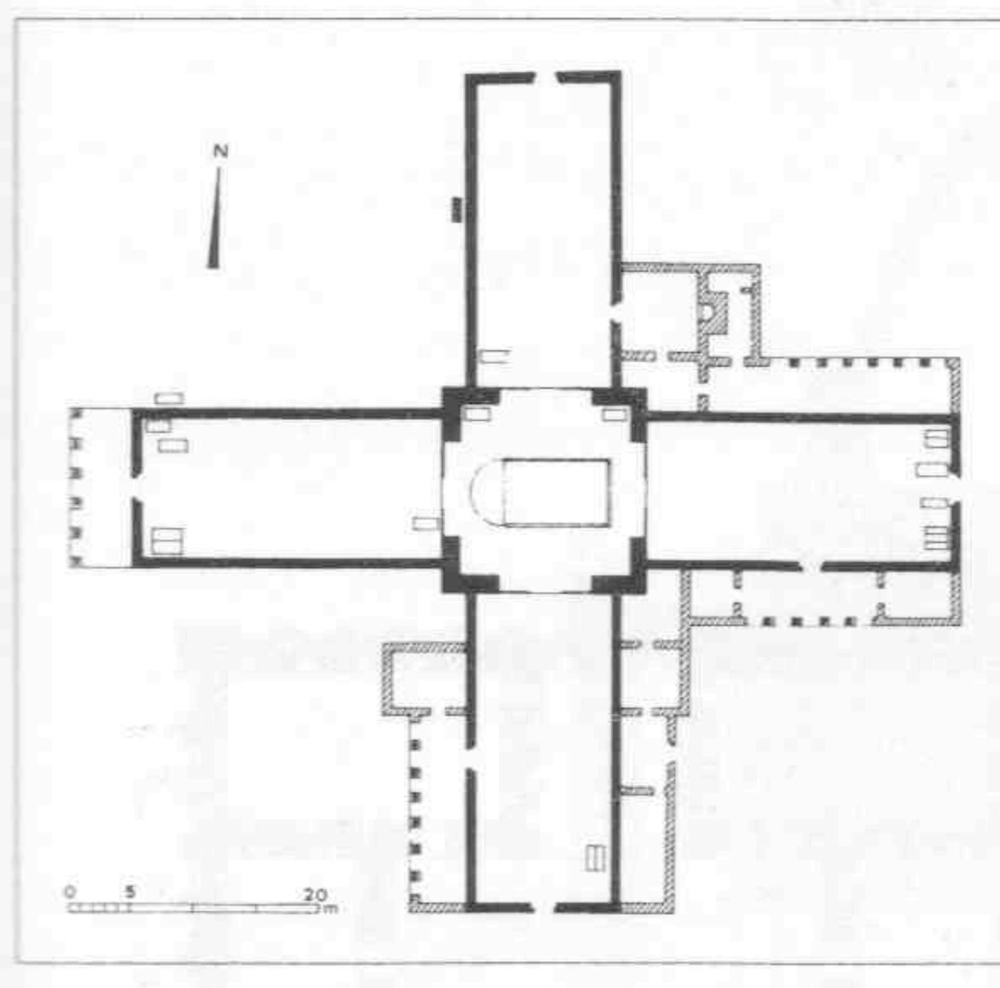
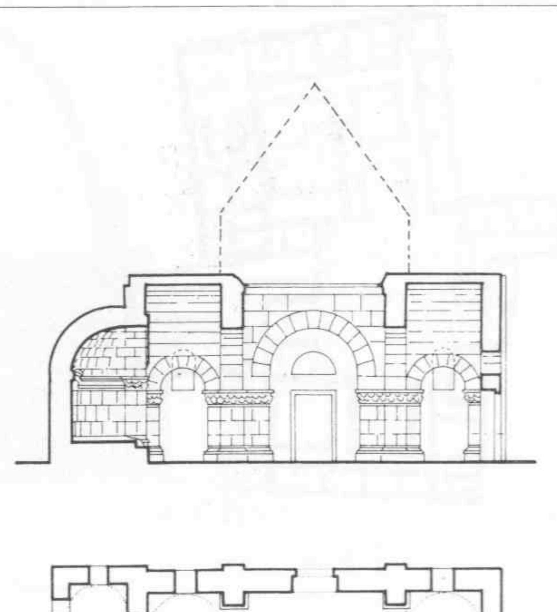
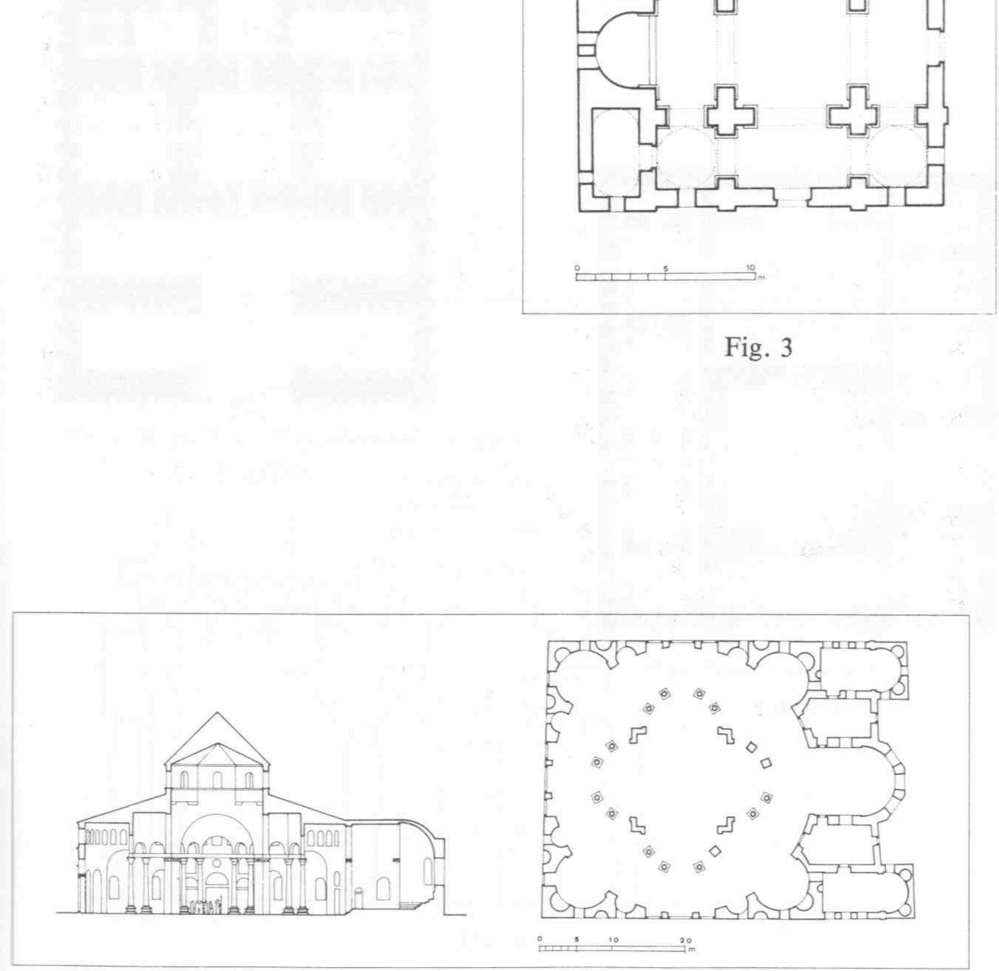
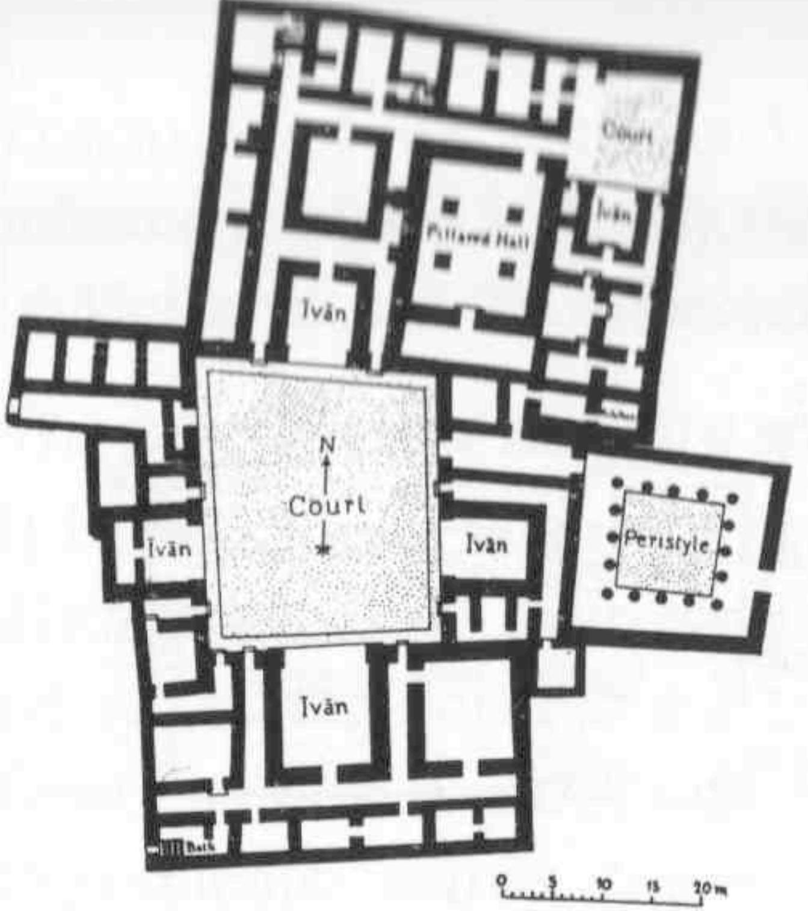
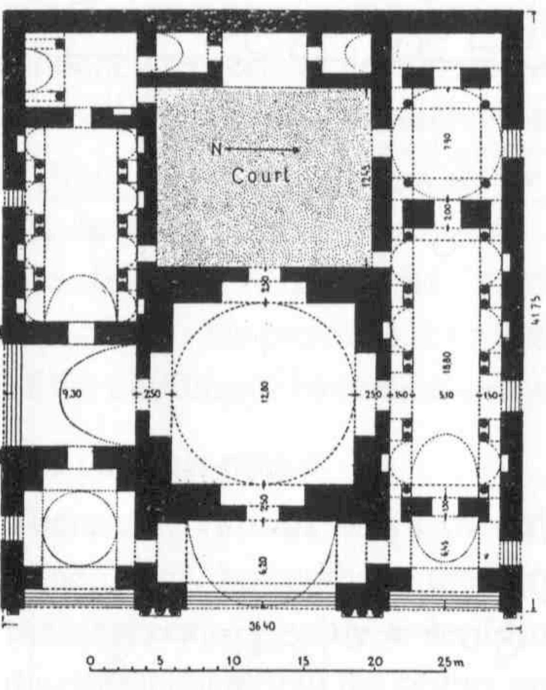
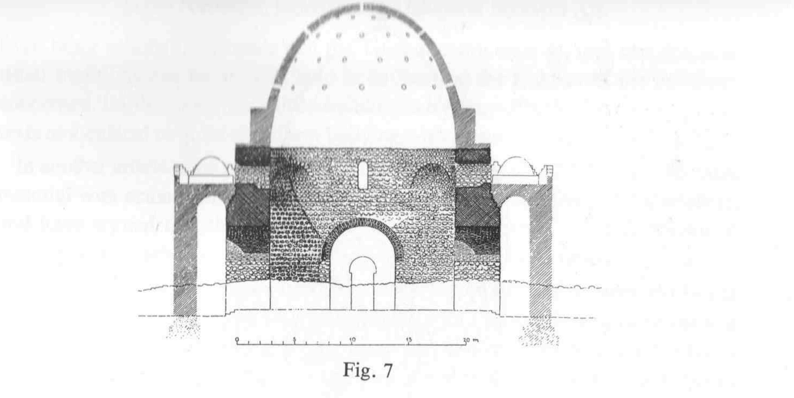
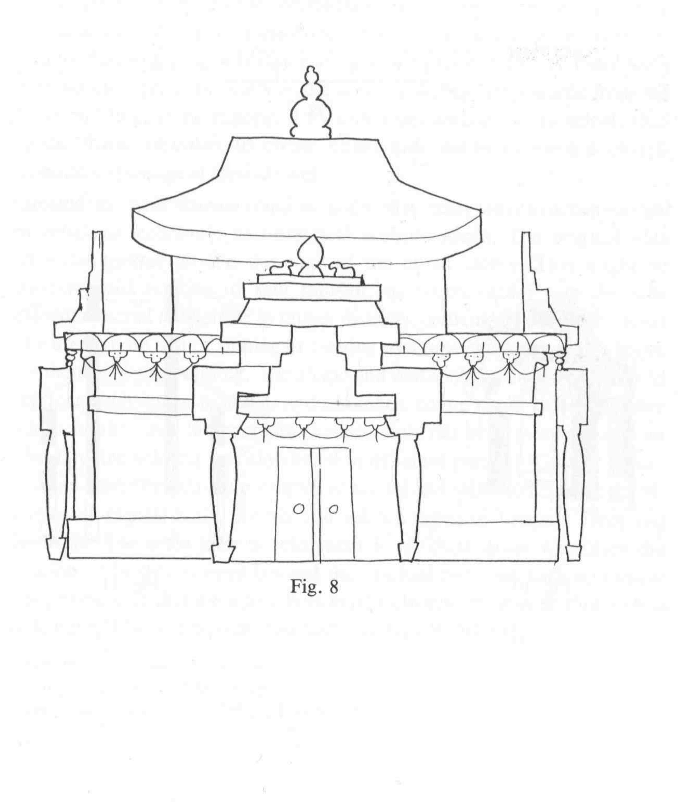
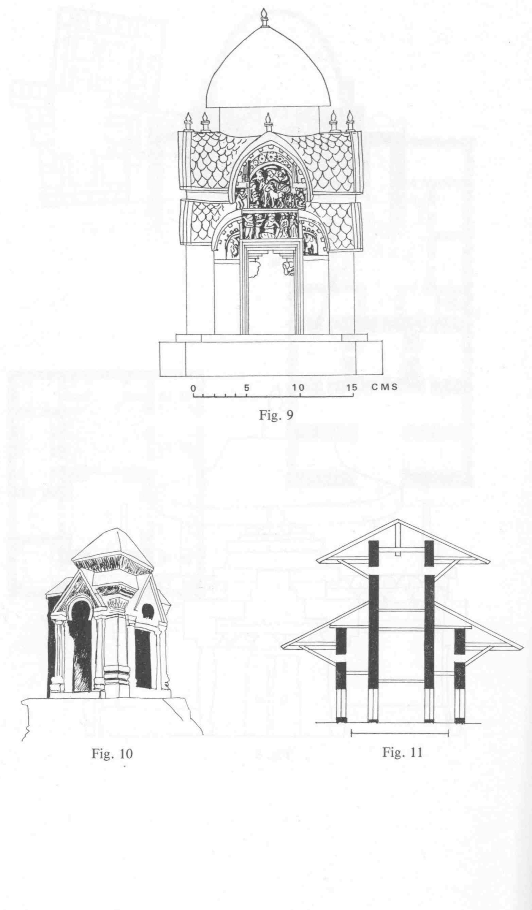
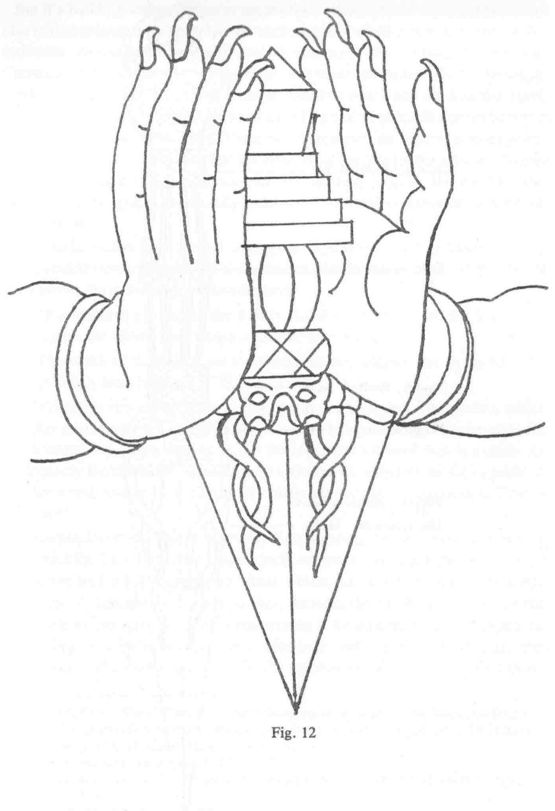

# **THE BUDDHIST FORUM**

# **VOLUME II Seminar Papers 1988–90**

Edited by Tadeusz Skorupski

THE INSTITUTE OF BUDDHIST STUDIES, TRING, UK THE INSTITUTE OF BUDDHIST STUDIES, BERKELEY, USA 2012

First published by the School of Oriental and African Studies (University of London), 1992 First published in India by Heritage Publishers, 1992

- © Online copyright 2012 belongs to: The Institute of Buddhist Studies, Tring, UK & The Institute of Buddhist Studies, Berkeley, USA
British Library Cataloguing in Publication Data The Buddhist forum. Vol. II 1. Buddhism I. University of London, *School of Oriental and African Studies* 294.3 ISBN 81-7026-179-1

## **CONTENTS**

*The online pagination 2012 corresponds to the hard copy pagination 1992*

| Abbreviations vii |
| --- |
| List of Illustrations ix |
| Introduction xi |
| T.H. Barrett |
| Devil's Valley ot Omega Point: Reflections on the Emergence |
| of a Theme from the Nō 1 |
| T.H. Barrett |
| Buddhism, Taoism and the Rise of the City Gods 13 |
| L.S. Cousins |
| The 'Five Points' and the Origins of the Buddhist Schools 27 |
| P.T. Denwood |
| Some Formative Inf1uences in Mahāyāna Buddhist Art… 61 |
| G. Dorje |
| The rNying-ma Interpretation of Commitment and Vow… 71 |
| Ch.E. Freeman |
| Saṃvṛti, Vyavahāra and Paramārtha in |
| the Akṣamatinirdeśa and its Commentary by Vasubandhu… 97 |
| D.N. Gellner |
| Monk, Househo1der and Priest: What the Three Yānas |
| Mean to Newar Buddhists 115 |
| C. Hallisey |
| Councils as Ideas and Events in the Theravāda…………… 133 |
| S. Hookham |
| The Practical Implications of the Doctrine of Buddha-nature…… 149 |

| R. Mayer |
| --- |
| Observations on the Tibetan Phur-ba and the Indian Kīla 163 |
| K.R. Norman |
| Theravāda Buddhism and Brahmanical Hinduism: |
| Brahmanical Terms in a Buddhist Guise…………… 193 |
| References 201 |

#### **ABBREVIATIONS**

| A | Aṅguttara-nikāya |
| --- | --- |
| AO | Acta Orientalia |
| AM | Asia Major |
| As | Aṭṭhasālinī |
| BEFEO | Bulletin de l'Ecole Française d'Extrême Orient |
| BHSD | F. Edgerton, Buddhist Hybrid Sanskrit Grammar and Dictionary |
| BM | Burlington Magazine |
| BSOAS | Bulletin of the School of Oriental and African Studies |
| BSR | Buddhist Studies Review |
| CIS | Contributions to Indian Sociology |
| CPD | Critical Pāli Dictionary |
| CSSH | Comparative Studies in Society and History |
| CSLCY | Chin-so liu-chu yin, in TC, no. 1015 |
| D | Dīgha-nikāya |
| Dīp | Dīpavaṃsa |
| EA | Études Asiatiques |
| EFEO | Ecole Française d'Extrême Orient |
| EJS | European Journal of Sociology |
| EI | Epigraphia Indica |
| ERE | Encyclopedia of Religion and Ethics, edited by James Hastings, Edinburgh, |
|  | T.&T. Clark, 1911 |
| HJAS | Harvard Journal of Asiatic Studies |
| HR | History of Religions |
| IASWR | Institute for Advanced Studies of World Religions |
| IBK | Indogaku Bukkyōgaku kenkyū |
| IHQ | Indian Historical Quarterly |
| IIJ | Indo-Iranian Journal |
| IT | Indologica Taurinensia |
| JA | Journal Asiatique |
| JAS | Journal of Asian Studies |
| JHR | Journal of the History of Religions |
| JIABS | Journal of the International Association of Buddhist Studies |

| JNCBRAS | Journal of the North China Branch of the Royal Asiatic Society |
| --- | --- |
| JNRC | Journal of the Nepal Research Centre |
| JPTS | Journal of the Pali Texts Society |
| JRAS | Journal of the Royal Asiatic Society |
| JS | Journal des Savants |
| Kv | Kathāvatthu |
| Kv-a | Kathāvatthu-aṭṭhakathā |
| MCB | Mélanges Chinois et Bouddhiques |
| M | Majjhima-nikāya |
| Mhbv | Mahābodhivaṃsa |
| Mhv | Mahāvaṃsa |
| Mp | Manoratha-pūranī |
| MSMS | Monumenta Serica Monograph Series |
| Pạtis | Paṭisambhidā-magga |
| PTS | Pali Text Society |
| RH | Revue Historique |
| RO | Rocznik Orientalistyczny |
| S | Saṃyutta-nikāya |
| SBE | Sacred Books of the East |
| Saddhamma-s | Saddhamma-saṅgaha |
| SLJBS | Sri Lanka Journal of Buddhist Studies |
| Sp | Samantapāsādikā |
| SSAC | Studies in South Asian Culture |
| T | The Taishō edition of the Buddhist Canon in Chinese (vol. no.) |
| Th | Theragāthā |
| TMKFTCC | Tao-men k'o-fa ta-ch'üan-chi, in TC, no. 1215 |
| TP | T'oung Pao |
| TC | The Taoist Canon, text numbered in accordance with the Harvard-Yenching |
|  | Index to its titles |
| TTD | Tibetan Tripiṭaka, sDe-dge Edition |
| TTP | Tibetan Tripiṭaka, Peking Edition |
| UCR | Univeristy of Ceylon Review, Colombo |
| VBA | Visva-bharati Annals |
| Vin | Vinaya-piṭaka |
| Vism | Visuddhimagga |
| WZKSO | Wiener Zeitschrift für die Kunde Süd- (und Ost) asiens |
| ZDMG | Zeitschrift der Deutschen Morgenländischen Gesellschaft |

*Between pages 64–65:*

- Fig. 1. Plan of martyrium of St Babylas, Antioch-Kausiye.
- Fig. 2. Plan and reconstructed section of cathedral, Bosra.
- Fig. 3. Plan and section of 'Audience Hall of Al-Mundhir', Resafa.
- Fig. 4. Plan of Parthian palace at Assur-Labbana.
- Fig. 5. Plan of Palace at Firuzabad with Audience Hall in centre.
- Fig. 6. Plan of Palace at Sarvistan.
- Fig. 7. Section of the Chahar Qapu at Qasr-i-Shirin.
- Fig. 8. Elevation of model maṇḍala-palace made by Tibetans at Dharamsala, India.
- Fig. 9. Reconstructed elevation of cruciform reliquary in the shape of a building, Shaikhan Dheri, Pakistan.
- Fig. 10. Cruciform Hindu Temple at Patan, Kashmir.
- Fig. 11. Section of Char Narayan Temple, Nepal.
- *Between pages 168–169:*
- Fig. 12. Vajrakīla rolls the Mt Meru Phur-ba
- Fig. 13. A standard Tibetan *phur-ba (k*ī*la).*

Acknowledgements: Figures 1, 2 & 3 taken from C. Mango, *Byzantine Architecture*, New York, 1975; Figures 4, 5, 6 & 7 from A.U. Pope, *A Survey of Persian Art,* Oxford, 1938–39; Figures 12 & 13 were drawn by Cathy Cantwell.

## **INTRODUCTION**

The present publication, the second volume in the Buddhist Forum series, contains a selection of the papers presented for discussion at the SOAS Buddhist Forum seminars during the past two academic years, namely, 1988–89 and 1989–90. The seminars which are held once a month during term time are open to everyone who has an interest in Buddhism and cover a whole range of topics relating to the various areas of Buddhist studies such as philosophy, doctrines, philology, history, art and other relevant subjects. The seminars are in progress and it is hoped that further volumes will appear in future years.

The rather enigmatic title of the first paper only becomes clear on a full reading, but its subject matter could more or less be summed up as "Buddhahood for the nonsentient: an encounter between Buddhist and Taoist traditions". Professor Barrett's main concerns in this paper are not the doctrinal issues involved in the interpretation of Buddhahood with regard to inanimate things, but rather certain historical and religious interactions between the Buddhists and the Taoists in China between the fourth and the eighth centuries. At the outset the paper establishes that so far as Taoism is concerned, the nature of the Tao, the ultimate and inherent Way, as being present in all inanimate things, was already formulated several centuries before the common era, a considerable time before the advent of Buddhism in China Apart from quoting a conversation attributed to Chuang-llu, the author also refers to several other Tao philosophers, including Kuo P'u. It is through Kuo P'u that a connecting link is made to Kuei-ku-tzu, the Master of Devil's Valley, a place which is difficult to locate. So far as Buddhism is concerned, although there may be some indications in the canonical texts, the Indian tradition has never taken much interest in the question of Buddhahood for non-sentient things. But in China this matter was widely discussed and various opinions were expressed. It seems that a clear formulation of this doctrine developed in China as part of a much larger discussion which was concerned with the sudden attainment of Buddhahood. The theme of the attainment of Buddhahood by the non-sentient was given a most prominent place in Japanese Nō plays of the fourteenth and fifteenth centuries. However, as already mentioned, the major part of Professor Barrett's paper focuses not on doctrinal issues but on the mutual influences and

interactions between the Buddhists and the Taoists in connection with this concept. Thus on the whole this is a paper that falls within the category of comparative religion. Those who are specifically interested in the question of Buddhahood for the non-sentient or its treatment in the Nō plays should refer to the sources provided in Professor Barrett's informative annotations.

The second paper, also by Professor Barrett, is similar in nature to the first, but this time deals with the origin of city gods. Like the preceding contribution this is an excellent study that takes into account not only the religious elements but also the sociocultural factors that might have influenced the emergence of the cult of city gods within the Taoist tradition. Here the concern is to trace the adaptations made within Taoism to accommodate and justify a new group of minor deities.

A long and learned paper by Lance Cousins discusses the formulation and nature of the five propositions attributed to Mahādeva. His detailed treatment of the 'Five Points' is not restricted to doctrinal matters but covers a wide range of issues such as the historical background, the validity of the available sources and the formulation of the *Kath*ā*vattu.* Among the historical considerations arc included the dates of the early Buddhist councils, the origin of the Mahāsāṅghika school, the accession of Aśoka and the chronology of events after the Buddha's final demise. The author attaches more importance and validity to the Theravāda sources than to the material preserved in Chinese and Tibetan. However, in treating his subject he makes use of all the available sources. An examination of the historical formulation and of the doctrinal content of the *Kathv*ā*tthu* leads him to suggest a new logical sequence for the 'Five Pomts'. In doing so Cousins seeks to demonstrate that there were certain complex developments that influenced their nature and interpretation, something that is reflected in the three formative phases of the *Kath*ā*vatthu.* Apart from exploring the original sources Cousins also expresses his opinion on certain important contributions written in Western languages, such as those by Louis de La Vallée Poussin, Etienne Lamotte and others.

While Lance Cousins attaches great importance to the Pāli sources and follows meticulously the classical path of interpreting historical events and doctrinal issues, the paper by Professor Charles Hallisey of Loyola University, Chicago, offers a new approach to the study and interpretation of the Buddhist councils. Its specific concern is more with the functional role of the Buddhist councils in the Theravāda tradition and rather less with establishing historical facts. Professor Hallisey suggests two possibilities or orientations which taken together can be helpful in enhancing or even rectifying our understanding of the Buddhist councils and of the Theravāda tradition as such. One orientation is referred to as 'event' and the other as 'idea', the former being more rooted in history and the latter more in anthropology. It is argued that past events, whether truly or allegedly historical, in

this case the Buddhist councils, provide inspiration for certain conceptual formulations that derive their authority from those events and in turn inspire or sanction new events; or to put it differently, the idealized past validates present actions. When applied to the Theravāda, this general model can provide new insights into the pattern in which the Theravāda developed, justified and validated its own internal evolution. The concept of 'events' and 'ideas' as such is not introduced here as something entirely new. However, Professor Hallisey makes excellent use of it to demonstrate how the history of phenomena with a dual character as events and ideas can help us to understand the Theravāda as it actually evolved.

Roy Norman's paper, like those by Cousins and Hallisey, is also related to the Theravāda tradition and is concerned with Buddhist terminology. It has been argued by some scholars in the past that Buddhism was merely an offshoot of Hinduism. There were also scholars who tended to assume that there were no traces of Hinduism in Buddhism. However, these two extremely opposed approaches to the understanding of Buddhism arc hardly tenable in the light of the vast number of studies produced by modem scholarship. It is difficult to see how Buddhism could exist in isolation and produce a whole body of complex doctrines without employing or making adaptations of the already existing religious and philosophical terminology. Modem comparative studies demonstrate beyond any reasonable doubt that Buddhism has always interacted with other contemporary religious traditions of India. Some scholars refer to this interaction between Buddhism and the other traditions as drawing from the common repository of India's religious and philosophical wealth, while others tend to stress borrowing on the part of Buddhism. Norman does not accept that Buddhism can be seen as an offshoot of Hinduism nor as being without any trace of Hinduism. His paper demonstrates that Buddhism remains indebted to Brahmanical Hinduism, in particular insofar as terminology is concerned. Taking into account the vast body of Buddhist terminology, this is rather a succinct paper. Nevertheless it offers a full enough coverage of a number of important Brahmanical terms to demonstrate how they were adapted, reinterpreted or modified within the context of the Buddha's teachings. There is no doubt that more studies of this kind are needed to unravel the complexities of Buddhist terminology; they would also enhance our understanding of Buddhist thought as a whole.

The papers by Gyurme Dorje and Shenpen Hookham relate to Tibetan Buddhism. Gyurme Dorje's paper is based on two of his substantial works, namely, his doctoral thesis "The Guhyagarbha-tantra and its Commentary", and his forthcoming annotated translation of bDud-'joms Rin-po-che's history of the rNying-ma school. His doctoral thesis, over one thousand pages long, consists of an English translation and a critical study of the *Guhyagarbha-tantra* and its fourteenth-century commentary, entitled *Phyogs-bcu mun-sel.* This work,

unfortunately still unpublished, and the forthcoming translation of bDud-'joms Rin-po-che's text constitute an important contribution to the study of Tibetan Buddhism. The seminar paper itself represents a scholarly assessment and interpretation of vows and commitments as found in the rNying-ma *tantras.* Since the notion of vows and commitments is considered within the context of the Nine Vehicles, one learns about their interpretation across the whole spectrum of Buddhist traditions; but of course through the rNying-ma approach.

The fierce and at times violent controversy which evolved in Tibet between the Buddhist thinkers who upheld the view of self-emptiness and those who defended the view of other-emptiness is well known to scholars of Tibetan Buddhism. What is interesting about Dr Hookham's papers is the connection she makes between these two controversial interpretations of the notion of emptiness and two distinct trends within Buddhism as a whole with regard to the nature of man and the path to spiritual perfection. It is possible to argue that within Buddhism, right from the outset, or at least from the time of the early schools, there emerged two very broadly defined orientations with regard to doctrinal formulations and spiritual practices: one stressing the weaknesses of human nature and the importance of spiritual purification and elimination of impediments on the path to liberation; and one placing more emphasis on the positive aspects of man, such as the view of mind as being pure by nature although temporarily obscured by adventitious impurities. The doctrine of Buddha-nature as being present in all living beings can be comfortably accommodated into the second category. It is interesting to follow Hookham's argument and see how she divides Buddhism into these two doctrinal orientations and relates them to particular schools of Tibetan Buddhism. However, she docs not limit herself to doctrinal considerations alone but takes a step further to apply her findings to the structure and functioning of Tibetan society.

Charlotte Freeman, a SOAS Ph D student, has for the past five or more years been working under the supervision of Dr Piatigorsky on the Akṣ*yamatinirde*śa-sūtra and its commentary by Vasubandhu. The material contained in her paper represents a small part of her extensive researches. Although saṃvṛti and other concepts discussed in the paper have been fairly well explored in Indian sources and in the writings of Western scholars, Freeman's particular style and her persuasive presentation of Vasubandhu's interpretation add a fresh and further dimension to our knowledge of those concepts.

The papers by David Gellner and Rob Mayer, while dealing with different topics, have in common the challenge they offer to earlier scholarship in their specific fields.

David Gellner's main concern is to correct certain approaches to the treatment of Newar Buddhism and to provide a new and positive method for its interpretation. He makes an opening assertion to the effect that some scholars in the past and

contemporary Westerners educated by modem Western means have failed to understand Newar Buddhism because of certain preconceptions which they had or have about Buddhism as such. In order to remedy this situation, he proposes a different approach which would justify and validate the nature of Newar Buddhism. He makes use of certain anthropological insights which he relates to historical developments within Buddhism in order to explain the pattern on which Newar Buddhism evolved and crystalized into a unique religious and socio-cultural entity. The main aim of the paper is to disprove the views of Newar Buddhism as anything like a remnant of Indian Buddhism or its decadent descendant, and to demonstrate that when understood on its own terms and within its own context it represents a perfectly valid form of Buddhism.

Rob Mayer's paper deals with the origin, history and symbolism of the ritual implement known as kīla in Sanskrit and *phur-ba* in Tibetan. This is the second longest paper in this volume and it covers a wide range of issues connected with the nature and use of the kī*la.* He surveys and assesses not only the material produced in Western languages but also refers to sources in Sanskrit, Tibetan, and even Chinese; his survey of Indian literary material includes both Buddhist and Hindu sources. A number of secondary issues apart, the main aim of the paper is to demonstrate that the kīla had a long and complex history in India and that it was not a Tibetan invention.

Philip Denwood, apart from being specialist teacher of Tibetan language and culture, takes a keen and professional interest in art and architecture. In this particular paper, he aims to demonstrate that certain architectural elements present in Iran and developed in connection with the concept of universal sovereignty had some inspirational influence on the design of the Buddhist maṇḍala. He also makes similar observations with regard to the position of images in architectural constructions such as the maṇḍala palace.

Finally, I would like to express my gratitude to those who helped me in bringing out this volume. Apart from the people who gave me their moral support and encouragement, I wish to thank Susan Madigan for typing the majority of the papers, Martin Daly for his administrative help and advice, Diana Matias for her professional editorial help, and to Anne Glazier for reading the proofs. Words of gratitude are also due to the School of Oriental and African Studies for accepting responsibility for the cost and distribution of this second volume of the Buddhist Forum.

# **Devil's Valley to Omega Point: Reflections on the Emergence of a Theme from the N**ō

# **T.H. Barrett**

Despite the mention of Japanese literature in my subtitle, and the naming of a destination on a specifically Christian horizon, the itinerary I propose to lay before the reader lies strictly within the confines of China. The Japanese section of the road has already been well covered by other scholars dealing with the ultimate salvation of plants and trees as a literary theme in mediaeval Japan.1 As for the twentieth-century conception of an Omega Point towards which creation yet proceeds, although this, too, was arguably the product of a sojourn in China, my reading so far suggests that no more than coincidence is involved here: the singular, lonely intelligence responsible for fusing Christian doctrine and evolution theory into this splendid, dazzling vision seems to have been if anything completely at odds with the religious sensibilities of its Chinese environment,2 and those who have made it their business to compare Buddhist and Catholic notions of spirituality have (sometimes quite explicitly) kept this particular thinker's work out of consideration.3

By bringing in the term Omega Point I wish to indicate merely that more than one civilization has come up with the ultimate in what I would call "cosmic optimism ", the notion that the entire phenomenal world can look forward to a glorious future of religious fulfilment: no more detailed comparison is intended. I do not even wish to tackle the question as to why such "cosmic optimism " should

1 By Donald H. Shively, "Buddhahood for the Nonsentient: a theme in No plays ", *HJAS*, 20, 1957, 135–161, whence (p. 150) my epigraph; W. LaFleur, "Saigyō and the Buddhist Value of Nature ", HR, 13.2, 1973, 93–128, and 13.3, 1974, 227–248. LaFleur, 94, note 1, lists the main Japanese studies of the development of the doctrine.

2 See Claude Rivière, *En Chine avec Teilhard*, 1938–1944, Paris, 1968, 130–6, 143–5: her summary on page 132 ("le Père aimait peu la Chine et les Chinois") alas says it all.

3 One recent comparative work does consider the "grass and trees becoming Buddhas" as understood in the T'ien-t'ai tradition of Buddhism, but simply as a prologue to some inter-faith reflections on environmentalism: see Nanzan shūkyō bunka kenkyūjo, ed., *Tendai Bukky*ō *to Kirisuto-ky*ō, Tokyo, 1988, 183–206. For an explicit exclusion of Teilhard from consideration in a comparative discussion of Zen and Christian mysticism, see the following note.

emerge—though I note that some would argue that a sentiment of hope constitutes one of the primary forms of religious life4 —my only interest is in how the idea came to the fore in China; who was the Chinese equivalent of that remarkable Jesuit thinker?

Our journey of discovery must, however, start a long way from Omega Point, a long way even from Devil's Valley, in a dilapidated barnyard (or so it would seem) somewhere in the state of Sung, some four centuries before the Christian era. Here the iconoclastic philosopher Chuang-tzu is represented as discoursing on the Tao, the ultimate unseen Way, with a neighbour. In the translation of Angus Graham:

> "Tung-kuo-tzu inquired of Chuang-tzu 'Where is it, that which we call the Way?' 'There is nowhere it is not.' 'Unallowable unless you specify.' 'It is in molecrickets and ants.' 'What, so low?' 'It is in the weeds of the ricefields.' 'What, still lower?' 'It is in the tiles and shards.' 'What, worse than ever!' 'It is in the shit and piss.' Tung-kuo-tzu did not reply."5

Now as a statement of the omnipresence of the underlying Tao, these remarks attributed to Chuang-tzu could hardly be improved upon, but what they do not tell us about this Tao, this Way, is where it was supposed to lead. Indeed, throughout all the writings ascribed to Chuang-tzu, or to his alleged predecessor Lao-tzu, this does not seem to be an issue: the unchanging nature of the hidden Way is affirmed; any suggestion that it is going anywhere is completely avoided.6 So we must pass on, and stop off again in the early fifth century of the Christian era, in the southern Chinese capital of Nanking, or Chien-k'ang as it was then known. Here in this vast metropolis the monasteries of an originally alien way of thought,

4 See Peter L. Berger, *A Rumor of Angels*, Garden City, New York, 1970, 54–5. William Johnston, *The Still Point: Reflections on Zen and Christian Mysticism*, New York, Evanston, San Francisco, London, 1971, contains the best part of a chapter on Teilhard, but finds him wanting (pages 167–8) in some important respects, and less similar to Zen (page 172) than might be assumed.

5 A.C. Graham, *Chuang-tzu*, London, 1981, 161; note (page 158) that this passage is seen as part of a cycle of stories later than Chuang-tzu's authentic work and distinguished by themes adumbrating the concerns which emerged centuries afterwards in Chinese Buddhism.

6 I have referred to G. Finazzo, *The Notion of Tao in Lao Tzu and Chuang Tzu*, Taipei, 1968, to check this.

Buddhism, are very much in evidence, and here learned Chinese monks may be found debating the key concepts of the new religion in the light of their own cultural heritage. The greatest of these controversialists is Tao-sheng (c. 360–434), who is particularly exercised by a question of latency, of hiddenness—not quite the same one as Chuang-tzu, though; he seems to have in mind the Confucian thinker Mencius and his theory of the 'beginnings of goodness ' hidden within the individual, which allow every man to become a sage like the paragons Yao and Shun.

But the question is now posed in a Buddhist form; does everyone possess the 'Buddha-nature', *fo-hsing*, the potential within them for achieving Buddhahood? Taosheng's answer is yes, even the most depraved have this capacity. Nor did he stop there: such a capacity could, he declared, be realised very rapidly, 'in one go', as it were. This proved to be a particularly controversial thesis, generating a protracted argument over 'sudden' versus 'gradual' enlightenment, even though (to judge by the recent research of Whalen Lai) Tao-sheng seems to have wandered almost nonchalantly into this controversy: maybe it was just that there was an argument there already waiting to happen.7

One point that was not in dispute for Tao-sheng or for his Buddhist successors in the following two centuries was that Buddhahood, fast or slow, was the prerogative of sentient beings only: the external world remained, as in Indian Buddhist thought, no more than a vessel, no more than a backdrop against which the great drama of enlightenment was played out.8

But, meanwhile, what of Chuang-tzu's spiritual descendants—or at least those who claimed him as their forefather, the Taoists? Their monasteries, too, were in the first half of the fifth century on the verge of spreading across the land also, in emulation of the Buddhists. Originally Taoist clergy had not lived apart from the faithful, it seems, except in small hermitages—though some of these were by this time well established. A source contemporary with Tao-sheng, for instance, notes that a Taoist hermitage already existed in Ching-chou (modern Hubei province) on a mountain by a stream known as the Clear Brook or (through a minor orthographic alteration) the Blue Brook, Ch'ing-hsi.9 The author of this record would have known that a poet of the early fourth century, Kuo P'u (276–324), had already written of a mysterious 'Taoist of the Blue Brook' glimpsed in

7 . See Whalen Lai, "Tao-sheng's Theory of Sudden Enlightenment Re-examined ", in Peter N. Gregory, ed., *Sudden and Gradual: Approaches to Enlightenment in Chinese Thought*, Honolulu, 1987, 169–200: note that the historical development uncovered by Lai actually suggests a process the reverse of that given in my summary: the notion of a universal Buddha-nature was a by-product of polemics over sudden enlightenment.

8 The bhā*jana-loka* of standard Buddhist texts.

9 See the *Ching-chou chi*, as preserved in Wang Mo, ed., *Han-T'ang ti-li shu ch'ao*, Peking, 1961, 414.

the vicinity, and that in his poetic imagination this lone figure had been identified with Kuei-ku-tzu, the Master of Devil's Valley, a shadowy political thinker and strategist almost as ancient as Chuang-tzu.10 Other places claimed the Master for themselves; other places claimed the name Blue or Clear Brook.11 But on the basis of Kuo's poetic flight of fancy this scenic valley in Ching-chou seems to have become a favourite haunt of religious recluses and scholars.

The Buddhists arrived about a century later, in the person of the redoubtable monk Tao-hsien, who in 517 started a twenty-eight year occupancy of Blue Brook mountain in the face of sustained hostility from the Taoists already present.12 By 594, when the Buddhist polemical essayist Fa-lin (572–640) arrived, the mountain was evidently a major centre of learning, for we read that he was able to acquire an education in both Confucianism and Taoism there, besides a training in his own faith:13 the wealth of citations in his works of the literature of his opponents' traditions gives ample testimony to the accuracy of this account.14 A brief picture of the communal life of study and meditation practised by Buddhists on Blue Brook Mountain in the late sixth century may also be found in the biography of Fa-hsi (572–632), who appears to have had some forty students to his name.15

Another older Buddhist contemporary, Fa-lun (528–c. 605), on the other hand, seems to have supplemented his studies (evidently, again, encompassing Taoism and Confucianism)16 at the Blue Brook by recourse to a separate Buddhist centre some fifty kilometers away, the Jade Spring Monastery, Yü-ch'üan ssu.17 There are perhaps some grounds for wondering whether two separate monks, both called

10 See Hsiao T'ung, comp., *Wen-hsüan* 21, Hong Kong, 1960, 461: commentary on this passage provided Wang Mo (see preceding note) with the fragment of the *Ching-chou chi* just cited.

11 The spot most usually favoured for the location of Devil's Valley was quite elsewhere, at Yangch'eng in Henan, to judge from the materials collected in Ch'in En-fu, ed., *Kuei-ku-tzu*, Beijing, 1985, reprint of 1805, though the valley of the Blue Brook did at one time lay claim to a cave allegedly inhabited long ago by the Master: see Wang Hsiang-chih, *Yü-ti chi-sheng* (comp. 1227), Taipei, 1962 reprint of 1860 ed., 73.7b. Cf. also note 33 below. Identifying the Blue Brook has been a matter of some concern to Japanese scholars: cf. Yoshioka Yoshitoyo, Dōkyō to Bukkyō, Vol. One, Tokyo, 1959, 311–14; Kamata Shigeo, Chūgoku Bukkyō shisōshi kenkyū, Tokyo, 1969, 173–218; the matter has been resolved by the discovery of the new source cited in n. 32 below.

12 See Tao-hsüan (596–667), comp., *Hsü Kao-seng chuan* 25, 651a–b, in T, vol. 50.

13 See Yen-tsung, *T'ang hu-fa shamen Fa-lin pieh-chuan* 1, 198b, in T, vol. 50.

14 See Ishii Masako, Ōfuchi Ninji, comp., *Rikuch*ō, Tō, Sō *no kobunken shoin D*ōkyō *tenseki mokuroku, sakuin*, Tokyo, 1988, 312–321, for a complete listing of the Taoist works cited in his writings.

15 <i>Hsü Kao-seng chuan 19, 587a-b.

16 <i>Hsü Kao-seng chuan 9, 500a.

17 To judge by Chih-p'an, comp. (c.1270), *Fo-tsu t'ung chi* 9, 199c, in T, vol. 49.

Fa-lun, may not have studied consecutively at the two centres,18 yet the Jade Spring and the Blue Brook were certainly in communication during the seventh century, in the person of another monk named Tao-yüeh, who started his career at the former site, but for most of his life lived on Blue Brook Mountain.19 The Jade Spring Monastery was a much newer factor in the religious life of Ching-chou: it had first been constructed and served as a base during the years 592 to 595 for Chih-i (538–597), the great systematizer of the T'ien-t'ai school of Chinese Buddhism.20

Here later followers of the school maintained throughout the seventh and eighth centuries a centre of doctrinal study independent of the school's main base in the T'ient'ai mountains of Zhejiang.21 Though the T'ien-t'ai tradition as a whole seems to have possessed a coherence spanning such local centres unusual for Buddhist groups in China at this period,22 continuing support for the school in the Ching-chou area was to be expected, since Chih-i himself hailed from the region,23 and many Ching-chou monks like Fa-lin and Fa-lun could claim some connection with him.24

But a word is now necessary once more concerning the Taoists, who by the seventh century were in a difficult position, despite strong imperial support. Taoism during this period has been described as "crypto-Buddhist",25 which is an unjustified slur, since the religion had ancient and purely indigenous roots, whether it went back to Chuang-tzu or not. But certainly the Chinese had always been staggered by the overwhelming prolixity of Buddhist literature,26 and it is quite

18 It is clear that Chih-p'an, as cited in the preceding note, does not explicitly identify his Fa-lun with the famous Fa-lun who died early in the seventh century; there are also grounds for believing that the famous Fa-lun was already too prominent and too busy by the time of the founding of the Jade Spring Monastery to have had any opportunity to study there: cf. L. Hurvitz, *Chih-i*, 538–597: An introduction to the life and ideas of a Chinese Buddhist monk, MCB, 12, 1962, 154.

19 <i>Hsü Kao-seng chuan 25, 661c–662a.

20 Hurvitz, *Chih-i*, 154-7.

21 Sekiguchi Shindai, *Tendai Shikan no kenky*ū, Tokyo, 1969, 185–205.

22 There are signs that T'ien-t'ai saw itself not simply as a teaching tradition but as a much more organized system of both theory and practice: see Muranaka Yushō, "Tendai shoki gyōhō no shūsei ni tsuite ", IBK, 23.2, March, 1975, 561–6.

23 See Hurvitz, *Chih-i*, 106.

24 For Fa-lin, note the point raised by Muranaka on the last page of the article cited in note 22 above. For Fa-lun, see Hurvitz, *Chih-i*, 154, note 1, and cf. Fo-tsu t'ung-chi 7, 186c. For a general study of Chih-i's disciples, which reveals a strong Ching-chou connection, see Ikeda Rosan, "Chigi metsugo no Tendai kyōdan to dōkō ", IBK, 21.1, December, 1972, 338–343.

25 Thus A.F. Wright, in *The Cambridge History of China*, vol. 3, Cambridge, 1979, 77. In fairness to Professor Wright's memory, he did do much to promote the scholarship which has led since his death to a revision of this view.

26 See the remarks of Mou-tzu (early fourth century?) preserved in Seng-yu, comp., *Hung-ming chi* 1, 2b, in T, vol. 52.

clear that, faced with such fecund opposition, the Taoists succumbed to the temptation to plagiarize Buddhist materials more or less wholesale—a practice in which they were, of course, found out and which drew from the Buddhists quite predictable ridicule. For the Taoists had been at times quite mechanical in their rewriting, replacing 'Buddha' with 'Tao' 27—and hence, it seems, 'Buddha-nature' with a new coinage, 'Tao-nature', *taohsing*, which first appears in the late sixth or early seventh century.28

But, of course, the Tao-nature is in everything, and so even in inanimate objects. The explicit assertion that it is in "tiles and shards", in "trees and stones", is made by the Taoist Meng An-p'ai in his *Tao-chiao i-shu*. 29 We do not know exactly when this text was written, but one thing that is patently obvious is that although it only quotes Taoist sources,30 it is organized in such a way as to mark a strong debt to T'ien-t'ai Buddhism.31 As for Meng, he is described as a "Taoist of the Blue Brook "—and just by chance a literary anthology has preserved a record by Ch'en Tzu-ang (661–702), a well-known poet, of Meng's success in securing imperial support for the renovation of a Taoist foundation in Ching-chou in 699.32 So Meng's *Tao-chiao i-shu* is a late seventh or early eighth century product of the Blue Brook religious environment—an environment which, incidentally, seems to have continued to attract admirers of the Master of Devil's Valley well into the ninth century.33

What is most striking is that Meng's assertion of the religious potential of inanimate objects must antedate by several decades the first explicit statement that trees and stones possess the Buddha-nature—and that that statement may be found in the writings of Chan-jan (711–782), next to Chih-i the most famous

27 See the remarks in K. Ch'en, *Buddhism in China*, Princeton, 1964, 474, for some occasional lapses in this process; Kamata's study of Buddhism and Taoism, cited above, note 11, provides ample examples of borrowing, too.

28 According to Kamata, 53ff.

29 Kamata, 67–74.

30 See Ishii and Ōfuchi, 150–160, for a complete listing of its copious citations of Taoist texts.

31 See the analysis in Kamata, 185–198.

32 Li Fang et al., comp. (987), *Wen-yüan ying-hua*, Beijing, 1966, 822.1a-2b. For Ch'en, see (pending the appearance of a SOAS publication on his work) the discussion in Stephen Owen, The Poetry of the Early T'ang, Yale U.P., 1977, 157–183: the *Wen-yüan ying-hua* 848.5a-b, 734.8a-b, provides ample testimony to his interest in Taoism. Meng, like Shen-hsiu (see McRae's remarks cited below, note 39), seems to have taken advantage of the Empress Wu's family connections with the Ching-chou area.

33 See the poem by Li She in P'eng Ting-ch'iu et al., comp., *Ch'üan T'ang shih* 477, Peking, 1960, 5423–4; Li styled himself 'Master of the Clear Brook', apparently in imitation of the Master of Devil's Valley.

thinker in the T'ien-t'ai tradition.34 Now it must be conceded that any link between Meng and Chan-jan can only have been indirect: Chan-jan is most unlikely to have ever visited Ching-chou, and represents a strand within the T'ien-t'ai tradition apparently unconnected with the Jade Spring Monastery.35 By the time that Meng was active, moreover, there is some evidence of Taoist familiarity with T'ien-t'ai thought which may be traced not to Ching-chou but to a Taoist presence on the T'ien-t'ai mountains themselves.36

It must also be admitted that there is also a considerable consensus amongst students of Chinese Buddhism that Buddhahood for the nonsentient was already on the agenda during the seventh century. No one seems to have felt obliged to make explicit claims in the way that Chan-jan later did, but such thinkers as Chi-tsang (549–623) and Fa-tsang (643–712), it has been argued, already concede the possibility in their discussions of the Buddha-nature.37

Some evidence has also been adduced which would make the Northern Ch'an leader Shen-hsiu (606?–706) a very clear (if tacit) supporter of the religious prospects of the non-sentient.38 This is of particular interest, since Shen-hsiu was

34 See note 31 above. It will have become obvious that this essay owes a very great deal to the remarkable pioneering research of Kamata Shigeo, which was, however, carried out prior to the realization by Japanese scholarship of the true date of Meng An-p'ai. The source listed in note 32 invalidates Kamata's belief that Meng was influenced by Chan-jan, and raises the strong possibility that the direction of the influence was the other way round; it does not invalidate Kamata's research into the similarities between Meng and Chiao-jan. Chan-jan's writings have long served as the *locus classicus* for the notion that vegetation too has a spiritual destiny: they are even treated briefly in English in Fung Yu-lan's well-known *History of Chinese Philosophy*. 35 Hibi Senshō, Tō*dai Tendaigaku josetsu*, Tokyo, 1966, gives a full account of the historical

background to Chan-jan's writings, including a detailed study of his travels, which took him nowhere near Ching-chou.

36 This is the view taken by Livia Köhn; see her Seven Steps to the Tao, Monumenta Serica Monograph Series XX, Nettetal, 1987, 27, 67, though the matter is somewhat more complex than this study allows, as is shown by the research of Meng Wen-t'ung, e.g. as republished in *Chung-kuo chehsüeh* 4, 1980, 318.

37 For some discussion in English, see La Fleur, 95, and also T. Unnō, "The Buddhatā theory of Fatsang ", *Transactions of the International Conference of Orientalists in Japan* 8, 1963, 34–41. Japanese scholarship continues to interest itself in the part played by the writings of these two men in the emergence of the doctrine of Buddhahood for the non-sentient; the most recent study that I have been able to consult has been Akao Eikei, "Hōzō ni mieru sōmoku jōbutsu ni tsuite ", IBK, 32.2, March, 1984, 404–411. All the work done in this vein tends to view the process of development as taking place solely within the Chinese Buddhist tradition itself: there is, of course, much to be said for this, but Kamata's work has (to my mind) shown that Taoism cannot simply be left out of the picture. For one Japanese survey that does adopt a broader perspective, see the following note.

38 Kamata, 203–4. Fukunaga Mitsuji, "Issai shujō to sōmoku doseki ", *Bukky*ō *shigaku*, 23.2, March, 1981, 103–118, gives a masterly diachronic survey of the religious prospects of non-sentient objects in China, including some reference to Neo-Confucianism: note the problems raised for example by Wang Yang-ming (1472–1529) in Julia Ching, To *Acquire Wisdom: The Way of Wang Yang-ming*, Columbia U.P., 1976, 127, 142. Fukunaga does not, however, indulge in any excursions into local history like the present essay.

a resident of the Jade Spring Monastery at the very time we know that Meng An-p'ai was active in Ching-chou.39 The interrelationship between the later T'ien-t'ai leader Chan-jan and the various Ch'an factions of the eighth century is a complex topic, and one which may well have a bearing on Chan-jan's open advocacy of the potential Buddhahood of plants and trees.40

But the very fact that eighth-century discussion of their issue in Buddhist circles uses phrases such as "tiles and shards", and even "molecrickets and ants" suggests that, whatever their internal disagreements, these Buddhists were conscious of the Taoist background to the question. And not simply the ultimate source of such phrases in Chuang-tzu: the *Pao-tsang lun*, which mentioned molecrickets and ants as well as vegetation, demonstrates quite irrefutably a familiarity with Taoist doctrinal writings similar to Meng's *Tao-chiao i-shu*. 41

I set out at the start of this trip to seek a Buddhist Teilhard, but that search must be abandoned in the face of the evidence presented above suggesting not the flash of insight of one solitary thinker but the slow emergence of an idea within a protracted process of interaction encompassing two rival religions and several rival schools. But at least it seems possible to identify the type of milieu, and maybe even the very locality, where a Chinese view of the cosmos finally fused with an Indian conception of spiritual development so as to produce in time an important theme in Japanese literature.42 That process surely could not have taken place without the existence of communities of religious scholars such as those on Blue Brook Mountain who looked back to the Master of Devil's Valley—what better title for the principal of a mediaeval college!—as their founder, and who exchanged ideas (and no doubt traded insults) with other centres such as the Jade Spring Monastery in a wider world of learning. And if I am right, this raises a shocking possibility, one undreamed of even in Chuang-tzu's scatological imagination: that the profound truth of the Way may be found even in so vile a place as the Devil's

39 See John McRae, *The Northern School and the Formation of Early Ch'an Buddhism*, Honolulu, 1986, 50–51, and cf. 265–6.

40 One attempt to sort out these interrelationships may be found in Yagi Nobuyoshi, "Tai-Zen ryōshū no kōshō ni tsuite ", IBK, 18.2, March, 1970, 611–12, though both he and the other scholars who have touched upon this area would appear to have been faced with problems in Chan-jan's biography requiring careful historical research.

41 On this, see yet again Kamata, *op. cit.*, 204–5 and 237–242.

42 This is not to deny that in Japan purely Japanese attitudes towards nature further played an important part in the acceptance of the theme in literature, as is noted, for example, by the contributors to *Tendai Bukky*ō to *Kirisuto-ky*ō (see note 3 above), 191, 193.

Valley of academic debate; that the road to Omega Point may even pass through precincts of modern universities.

#### *The Postscript*

The preceding pages reproduce almost without alteration a paper presented to the Buddhist Forum in March, 1989; this paper, however, represented a reworking of unpublished materials first drafted ten years earlier as a result of my discovery of the source concerning the Taoist Meng An-p'ai given in n. 32 above. These materials were laid aside as the result of the almost simultaneous publication in English of a lengthy footnote discussing the same source by Ōfuchi Ninji,43 and only taken up again because subsequent discussion in English of the Buddhahood of plants and trees had not taken Meng An-p'ai's writings, used much earlier by Japanese scholars, into account. During the intervening period, however, my own concerns had shifted away from the debate over the Buddhahood of plants and trees as such towards an interest in the institutional environment in which contacts with Taoist thought were possible. As a result rewriting produced a certain imbalance between text and notes.

Professor Seyfort Ruegg, who attended the Forum when the paper was presented, quite rightly drew attention to its consequent tendency to minimize internal development within the Buddhist tradition as an important cause for the eventual prominence of the notion of Buddhahood for the non-sentient. Indeed, to the studies mentioned in n. 36 above it would be possible to add at least one further article in English exploring this theme in the thought of Chi-tsang from a purely Buddhist perspective.44 Of particular interest was Professor Seyfort Ruegg's suggestion that even the most undeveloped Buddhist materials show a markedly positive attitude to vegetable life. Certainly the Chinese did notice some of these materials, at least by the tenth century, when they were excerpted in the Buddhist encyclopedia *I-ch'u liu-t'ieh*: 45 earlier encyclopedias may do the same, but a rapid check has not turned up any exactly parallel examples.46 But these particular materials simply suggest that all the vegetable kingdom, as well as the animal kingdom, is provided with tutelary deities; there is nothing here that resonates with Chinese ideas of spiritual progress, so it is unlikely that they played a part in

43 See note 5, 225–6 of Ninji Ofuchi, "The Formation of the Taoist Canon", in H. Welch and A. Seidel, eds., *Facets of Taoism*, New Haven & London, 1979, 253–267.

44 Namely, Aaron K. Koseki, "Prajñāpāramitā and the Buddhahood of the Non-sentient World: The San-lun assimilation of Buddha-nature and Middle Path Doctrine", *JIABS*, 3, 1, 1980, 16–33.

45 See Makita Tairyō, ed., *I-ch'u, Giso Rokuj*ō*/I-ch'u liu-t'ieh*, Kyoto, 1979, 16.34a, page 364. I-ch'u completed this work in A.D. 954.

46 Pao-ch'ang, ed., *Ching-lü i-hsiang* 46, page 240b in T, vol. 53, notes that trees over seven foot tall and a foot in girth harbour spirits, but this would seem to indicate an acceptance of hamadryads in decent size trees only (hardly a startling notion), not the sanctity of all vegetation suggested by Ich'u's citation.

nurturing Chinese speculation on Buddhahood for the non-sentient. Buddhist attitudes towards the natural environment, however, do still deserve to be explored in yet more depth than hitherto.

But so, too, does the institutional environment which promoted Buddho-Taoist contacts in seventh-century China, and which in my view must at least have added a further stimulus to Buddhist thinking. Most accounts of these contacts have concentrated on events at court;47 indeed, our knowledge of T'ang intellectual life as a whole is largely dominated by the perspective afforded by central government.48 But not all higher learning was in the hands of, nor at the service of, the state: many mountains other than the Blue Brook Mountain attracted individuals and communities of different religious affiliations to pursue contemplation and study in what must have amounted virtually to a 'university' setting. Some research on this aspect of T'ang intellectual life has already been undertaken in East Asia, 49 but in Western languages only accounts of individual study, such as the poet Po Chü-i's retreat to Lu-shan, have been published.50

What is intriguing about the Blue Brook is its rise to major prominence in the seventh century, followed by a subsequent almost total eclipse: most other centres, like Lu-shan or T'ien-t'ai, remains important into much later times, even into the twentieth century. As suggested above, the start of the story of the Blue Brook cannot be pushed back any further than the fifth century, though in subsequent reading I have come across a tale, perhaps ultimately of that period, alleging a Buddhist presence by the Blue Brook in the last quarter of the fourth century A.D.51 This concerns a young Buddhist monk who dreams that the "Lady of the Blue Brook Temple" appears to him and demands that he should take over as the god of her shrine: he tells his companions as a result that he must be fated to die to take up this charge, and asks them to visit him when he assumes his new

47 Such is the emphasis of standard accounts like Kubota Ryōon, Shina Ju-Dō-Butsu kōshōshi, Tokyo, 1943, and Lo Hsiang-lin, " T'ang-tai san-chiao chiang-lun k'ao", *Tung-fang wen-hua*, 1,1, 1954, 85- 97, following the emphasis in their main sources.

48 This is the standpoint taken, for example, in D.L. McMullen's excellent *State and Scholars in T'ang China*, Cambridge, 1988.

49 The classic study in this vein is Yen Keng-wang, " T'ang-jen tu-shu shan-lin ssu-yüan chih fengshang", *Chung-yang yen-chiu-yüan Li-shih yü-yen yen-chiu-so chi-k'an*, 30.2, 1959, 689–728, which does not, however, collect materials on Blue Brook Mountain. Earlier works on the eremitic tradition in Chinese history, such as Chiang Hsing-yü, *Chung-kuo yin-shih yü Chung-kuo wen-hua*, Shanghai, 1947, also make clear the role of mountain centres in higher edcuation.

50 See Arthur Waley, *The life and times of Po Chü-i*, London, 1949, 120.

51 See Wang Shao-ying, ed., *Sou-shen hou-chi*, 5, Beijing, 1981), 31–2: this text, attributed to the poet T'ao Ch'ien (365-427), is already cited under his name in the early sixth century, as noted by Yü Chia-hsi, who is quoted on page 147 of Wang's edition. The passage on the 'Lady of the Blue Brook' is cited in a seventh-century Buddhist encyclopedia, Tao-shih, ed., *Fa-yüan chu-lin* 90, page 953a in T, vol. 53.

role. When, after his subsequent sudden death, they do visit the temple, his voice converses with them, requesting them to sing psalms and regretting his separation from their company. This tale is clearly to do with a problem of 'previous spiritual occupancy', a topic to which I revert in the next paper, though it provides an unusual twist when compared with better known accounts of pioneer monks vanquishing chthonic deities, often in ophidian form.52 One may presume that it dates to a time when the Buddhists were relatively insecure newcomers, but it is difficult to pin down the period of composition precisely, and a late T'ang reworking of the story (moralizing ponderously over the young monk's fate as the karmic result of earlier persistent gross immorality) sets it in the fifth century, under the Liu-Sung dynasty.53

During the mid-sixth century the Blue Brook Mountain became (though apparently not for long) the scene of a genuine historical episode almost as bizarre, when it was chosen as a base by the remarkable Lu Fa-ho, a charismatic leader who combined the roles of warlord and magus, and who reconciled a declared commitment to Buddhism with a penchant for Taoist thaumaturgy.54 Lu's regime, one presumes, must have featured in the monograph on Blue Brook Mountain said to have been compiled by Fa-lin: unfortunately, not a single word of this survives, so far as I am aware.55 Fa-lin, however, very probably did not live long enough to include in his work any account of the Blue Brook's most illustrious Buddhist alumnus, the monk Tao-lin, who succeeded in the midseventh century in reaching India by the sea route and studying at the famous Buddhist university of Nālandā, where he is said to have much impressed the great Buddhist logician Dignāga.56

Tao-lin's biography reveals that he was also associated in his early days with the Jade Spring Monastery; one of the advantages of the Blue Brook Mountain seems to have been its ease of communication with Chiang-ling, administrative centre of Ching-chou, nearer to which the Jade Spring Monastery lay. The biography of the late sixth century monk Fa-hsing implies that he frequently made the journey from mountain to town, passing the future site of the Jade Spring Monastery on the way.57 Chiang-ling itself was at this point no mean city; it had briefly been capital of the Liang dynasty, and then became the chief city of the Later Liang dynasty—

52 For a classic example of such an account, see pages 94–6 of Hisayuki Miyakawa, "Local cults around Mount Lu at the time of Sun En's rebellion", in Welch and Seidel, *Facets of Taoism*, pp. 83– 101, concerning the second century A.D. Buddhist missionary An Shih-kao.

53 See Huai-hsin, *Shih-men tzu-ching lu* 1, 808a in T, vol. 51.

54 The chief account of Lu's extraordinary career may be found in Li Pai-yao, Pei-Ch'i shu, 32, Beijing, 1972, 427–431; Lu is said to have started his active military career from Blue Brook Mountain at the time of the rebellion of Hou Ching (548–552) on page 427.

55 See the preface to Fa-lin, *Po-hsieh lun*, 475a, in T, vol. 52.

56 See I-ching, *Ta-T'ang Hsi-yü ch'iu-fa kao-seng chuan*, 2, 6c–7a in T, vol. 51.

57 Tao-hsüan, *Hsü Kao-seng chuan* 25, 658a.

not one of the period's most powerful political units, admittedly, but one which continued to maintain its nominal independence for about a generation, from 555 to 588.58 But from the seventh century onwards the region quite manifestly declined in importance and lost population—probably to the south bank and to the delta of the Yangtse—and it also suffered increasing administrative fragmentation into the tenth century, as it came within the orbit of several more successful centres.59 This may explain the paucity of later references to Blue Brook Mountain: a medical text by the 'Master of the Clear Brook' which is said to have circulated in the T'ang must presumably be attributed to the ninthcentury poet mentioned in n. 33 above,60 but it is difficult to find any eminent Buddhists associated with the site in later times.61 The connection with the Master of Devil's Valley—remarked on already in the preface to one of Fa-lin's works62—was reaffirmed constantly in Taoist hagiography,63 but the area does not seem to have supported any later Taoist communities of note, either. Thus while monographs on other mountains like Lushan and T'ien-t'ai were compiled and recompiled as the communities on them continued to flourish, Fa-lin's work on the Blue Brook was lost, and its role as an ancient seat of ecumenical learning became obscured.

In sum, then, I would stress not simply the need to see the development of Buddhist ideas within their full Chinese intellectual context. What is also necessary is some appreciation of the institutional arrangements which made interaction between different religious traditions possible, and here a study of local history can be of value also: if one can find one's way through Devil's Valley, the road to Omega Point becomes far clearer.

58 See Hurvitz, *Chih-i*, 105, 107 note 2, etc., for some of this political background as it affected Buddhism.

59 See Wang Gungwu, " The Middle Yangtse in T'ang politics", 203 (and page 199 for the tenthcentury outcome), in A.F. Wright and D.C. Twitchett, eds., *Perspectives on the T'ang*, New Haven and London, 1973, 193–235.

60 See Lo Shih-lin, ch'en Li, Liu Wen-chi and Liu Yü-sung, comps., *T'ang-shu ching-chi i-went hochih*, New Haven & London, 1973, 193–235.

61 The tenth-century Ch'an monk Hung-chin may have resided on our Clear Brook Mountain, though it is described as lying in the territory of Hsiang-yang, further north, rather than Ching-chou: see Taoyüan*, Ching-te ch'uan-teng lu*, 24, 400a in Taishō Canon vol. 51. An inscription, apparently describing events dated in the late eleventh century, preserved in Wang, *Yü-ti chi-sheng*, 73-8a, records that a 'Dharma-master of the Severed Arm' had connections with both the Jade Spring and the Clear Brook. I suspect that the date is a mistake for 617: the author of the inscription, Li Chou, would appear to be the same man who in the late eighth century wrote a biography of the Sixth Patriarch of Ch'an: see Yanagida Seizan, *Shoki Zenshu shisho no kenky*ū, Tokyo, 1967, 99, note 16, for the significance of this lost biography.

62 In the preface to his *Po-hsieh lun*, 475a.

63 The standard form for the Master's biography from the early tenth century onward, which reconciles his sojourn at the Blue Brook with his residency of Devil's Valley, appears on page 9 of Tu Kuang-t'ing, *Hsien-chuan shih-i*, in Yen I-p'ing, ed., *Tao-chiao yen-chiu tzu-liao*, vol. 1, Taipei, 1974.

If one can learn much about a religious tradition from observing its interaction with its rivals, and particularly from the encounter of a great, well-established tradition like Buddhism with new forms of religiosity, then China is perhaps the best place of all to observe this process. This is not simply because of the outstanding Chinese historiographic traditions which allow us to put so much of its religious history into context—in fact for the type of religion examined here historiographic problems are far from absent, as we shall see. Rather, the simultaneous existence in mediaeval times of another great and established tradition, Taoism, allows us to treat the question of reactions to novelty from a comparative perspective by tracing through the same period of time the evolving reactions of both 'old' religions to the newcomer. In this study the role of newcomer is played by the so-called *ch'eng-huang* cults.

The class of Chinese deities known as *ch'eng-huang* or city gods has long excited the interest of scholars. I have only glanced at what I take to be the earliest serious studies of these gods, which appeared in 1910 and 1924;1 as with David Johnson's recent and very stimulating historical examination of these cults,2 the point of departure for this study goes back no further than Teng Ssu-yü's research of 1935.3 One of Teng's aims at this time was to explore the connections between Buddhism and Taoism and the city gods in order to assess the possible influences of these religions on the appearance of the city god cults. The evidence which he uncovered, to which we shall revert, led him to believe that the origins of the city

* An earlier version of this paper was read at UCLA, October, 1989; my thanks to all those who offered comments at that time.

1 P.A. Volpert, "Tsch'öng huang", *Anthropos*, 5,5/6 (Sept.–Dec., 1910), 991–1026; F. Ayscough, "The Chinese cult of *Ch'eng-huang* lao-yeh", *JNCBRAS*, 55, 1924, 131–155. To judge by the last couple of pages of each study, the line of inquiry pursued here was not contemplated by these pioneers.

2 David Johnson, "The City-god cults of T'ang and Sung China", *HJAS*, 45,2, Dec. 1985, 363–457. As an examination of the rise of these cults from the point of view of social history, this article leaves little room for additional comment; the approach adopted here, however, concentrates on the history of religion.

3 Teng Ssu-yü, "Ch'eng-huang k'ao", *Shih-hsüeh nien-pao*, 2.2, 1935, 249–76.

gods might not be found within either traditions, and this conclusion is further underlined by Johnson's article.

Our present concern is somewhat different. I take it as more or less axiomatic that neither Buddhists nor Taoists were responsible as such for the emergence of this type of cult. I do not know who precisely was; Johnson points to the role of groups described as 'elders', whom he suspects of having had merchant connections.4 The terminology as such does not carry such connotations; intriguingly enough we find it used at a very early date to describe the religious leadership of non-Chinese peoples of the South.5 But merchant connections cannot be ruled out: the research of Kanai Noriyuki has uncovered direct evidence for merchant involvement in local religion during the Sung,6 if not in support of the *ch'eng-huang* cults themselves. The only instance I have noticed in my own reading where the source of financial support for refurbishing a *ch'eng-huang* temple is specified (in the eleventh century) uses the unrevealing term hao to describe the man who stepped in to take over the cost from the community as a whole—in other words, a 'boss', a man of local power who was not considered by the writer (a Buddhist monk) part of the elite.7

This, of course, fits in well with the recent findings of Robert P. Hymes concerning Sung religion,8 but the whole question lies rather beyond the scope of the present essay. My own question is simple: confronted with what was indubitably a novel phenomenon in the history of Chinese religion, how did the established traditions react? Convention requires that some words should be said about Confucianism also, and I have certainly not excluded Confucianism from my title because this tradition had nothing to say in response to the appearance of the *ch'eng-huang*. For though Confucianism tended to keep a low profile as a religion, it did possess a clear-cut canon, and the rise of a noncanonical cult could be treated in but two ways: either it was denounced (as those Neo-Confucian zealots, the Ch'eng brothers, preferred),9 or it was explained away as a development implicitly present in the Confucian Classics, by means of the philological sleight of hand at which Chinese scholars have always excelled; examples of the latter can be found going back to the ninth century.10 But during the period when the *ch'enghuang*

4 Johnson, "The City-god cults of T'ang and Sung China", 419.

5 Hsü Chia-jui, *Ta-li ku-tai wen-hua-shih kao*, Hong Kong, 1979 reprint of second ed., 266.

6 See pp. 45–6 of Kanai Noriyuki, "Sōdai no sonsha to Bukkyō", *Bukky*ō *shigaku kenky*ū, 18.2, March 1976, 31–56: here 'elders' actually appear to be distinguished from merchants, to include other local notables, 'patrons'.

7 Wen-ying, *Hsiang-shan yeh-lu* 2, Peking, 1984, 26.

8 See Robert P. Hymes, *Statesmen and Gentlemen*, Cambridge, 1986, especially ch. 7.

9 Ch'eng I and Ch'eng Hao, *Ho-nan Ch'eng-shih i-shu* 22A, in *Erh-Ch'eng chi*, Peking, 1981, 295–6.

10 Teng's article (n. 3 above) opens with some good examples of this. An inscription dated 840 preserved (via a Sung source) in Lu Hsin-yüan, ed., *T'ang-wen shih-i*, Taipei, 1962 reprint, 29.3a–4b, provides an excellent early instance of Confucian casuistry: this is no. 51 in Johnson's list (see next note).

spread across the land (roughly, the T'ang and early Sung), Confucianism itself underwent a transformation affecting its own self-image far more deeply than the concurrent changes in Buddhism and Taoism, thus rendering it far less suitable for purposes of comparison, albeit historiographically far more convenient.

For when one forsakes Johnson's master list of datable inscriptions,11 in which typically a representative of the state, usually in some sense a Confucian, records his interaction with a specific community, in order to trawl through literature of an explicitly Buddhist or Taoist inspiration, precise details of time and place are often harder to come by. I would, nonetheless, like to think that I have pinned down the earliest Taoist source to mention the city gods, the *Chin-so liu-chu yin*, to the century following the An Lu-shan rebellion of 755: still a little vague, but better than can be achieved for many Taoist texts.12 It provides, at all events, an intriguing picture of change and continuity, quite consistent with what we know of other aspects of Taoism at this time.

The *Chin-so liu-chu yin* is nominally divided between text and commentary, the former ascribed to late Han revelation, the latter to the early T'ang. The first of its references to city-gods is in the text itself, in the middle of a long list of gods of the powers of nature (wind, rain) and of localities (mountains, rivers) who will respond to a Taoist possessed of the right magic; a note from the commentator observes that the granting of city-godships is in the gift of the Lord of the Latter Days (*hou-sheng chün*), the supreme deity presiding over the text as a whole, and quotes the Su-Wu chi (evidently a topographical text, of which no trace survives) as listing Jui, King of Wu, as an example—of him, more shortly.13

Later on in the commentary, in directions for how to counteract drought, we are told that anciently there were no cities, but now their spirit officers (*ch'eng-huang shenkuan*) should head the list of local deities prayed to,14 in dealing with epidemics and hauntings, too, another note advises adding them in;15 and in supplications for 'journeying mercies' the note suggesting their addition remarks that such deities had already appeared in the Chin dynasty.16 These reminders are

11 Johnson, "The City-god cults of T'ang and Sung China", 451–7.

12 See T.H. Barrett, "Towards a date for the *Chin-so liu-chu yin*", *BSOAS*, 52,2, July 1990. Further consideration of this text, especially in relation to its references to Buddhism, has not caused me to alter my opinion, but I should point out that this dating as yet awaits acceptance.

13 <i>CSLCY 16.5b. For the 'Lord of the Latter Days', see Isabelle Robinet, *La Révélation du Shangqing dans l'histoire du Taoisme*, Tome II, Paris, 1984, 107.

14 <i>CSLCY 18.5a.

15 <i>CSLCY 23.7b.

16 <i>CSLCY 24.7a.

followed later by a rite of exorcism in which temple-shrines (*miao-she*) and cities (*ch'eng-huang*) are, according to the main text itself, to be notified: no comment at all is offered on this.17 The next main text reference, a method of counteracting black magic calling, inter alia, upon the spirit officers of cities, provokes a lengthy burst of aetiological commentary, as follows, in summary:

> "In high antiquity they only spoke of *she-miao*, there were no *ch'eng-huang shen*. These started from King Jui of Wu, whose tomb is in Wu. In Chin times the prefect Liu Wen-ching was building a city-wall in Wu and reached the top of the tomb. At night the walls were all broken down and the earth carted off by spirit soldiers so that it was nowhere to be seen".

After this happened seven or eight times Liu posted a watch, which arrested Jui when he came out of the ground at the head of a ghost army several tens of thousands strong. Jui complained about the disturbance to his tomb, but offered to protect the city if the wall was resited one hundred paces away. Nowadays, our text says, anywhere that has a prior burial (presumably of someone numinous) in its underworld, may, as the result of consultation between the local underworld and God (*t'ai-shang t'ien-ti*) be granted a landlord (*ti-chu*, sic!), who is appointed chief of the spirit-officials of the city.18

Here is a story worthy of comparison with any discussed in Johnson's article. Note in particular the attempted historical reference. I cannot at this stage comment on the historicity of Liu Wen-ching, but there never was a King Jui of Wu. Wu Jui, King of Ch'ang-sha, is however well known to history. He was a leader of the Yüeh tribes of the mid-Yangtse who distinguished himself through his constant loyalty to the founder of the Han; Ch'ang-sha was the kingdom he was granted as a reward for his services.19 Though it is no more than a guess, I would suggest that one of the underlying reasons for the rise of the city gods was the expansion of Chinese settlement into non-Chinese areas: walls and moats (the literal meaning of *ch'eng-huang*) were needed to give a sense of security, and even more than these material and visible symbols of reassurance, in a territory thick with alien ghosts a spiritual bulwark against the psychic resentment of the land was an even greater necessity. What better champion than a local leader who in his life had demonstrated himself to be a true friend of the Chinese, especially one

17 *CSLCY* 25.4b.

18 <i>CSLCY 25.7b–8a. This use of the term *ti-chu* as a type of god rather than a specific god is not listed in dictionaries (except in a Japanese context in the *Engi-shiki* of 927), but cf. its mention in the passage dealt with below, at n. 43, in T. 21, p. 375b, and in the same volume, p. 466c in no. 1315 another one of the problematic group of texts mentioned below, n. 47. See also *Yün-chi ch'i-ch'ien* 79.19a, TC, n. 1026, the precise date of which passage is also difficult to determine.

19 Pan Ku, *Han Shu* 34, Peking, 1962, 1894.

whose family line (according to the histories) had died out entirely, thus making him, as it were a supernatural freelance, suitable for deification?20

To return once more to the *Chin-so liu-chu yin*, the next note on the *ch'eng-huang* gods in the text deals with history on a grand scale. A passage on exorcism which mentions shrines to gods of the earth is interrupted with the following information: in high antiquity there were only gods of the heavens and of the earth (*t'ien-shen*, *ti-chih*, Japanese *jingi*), and no *she-miao*; in middle antiquity there was the altar of the soil on the left, of grain on the right, and still no *she-miao*; since the Han, Wei, Chin and Sung (note the Southern outlook) there had been spirit officials of the altars of soil and grain; since the Ch'i, Liang, Ch'en and Sui there had also been spirit officials of cities; spirit officials of *she-miao* and *ch'eng-huang* now cooperated in maintaining otherworldly law and order just like *chou* and *hsien* officials.21 Two references further on in the commentary also support the view that the *ch'eng-huang* should be seen as a new force collaborating with the *she-miao*. 22 Now periodization of religious history is basic to Taoism: the Taoist religion, after all, first appeared in the late Han as a self-declared new dispensation,23 and far from believing in a single historical revelation, the notion of a series of revelations seems, too, to have been present from the start.24 But what reminds one (as so often in Taoism) of secular, bureaucratic parallels is the way here in which these changes are treated largely as changes in nomenclature in our text: we are presented with a fragment of an otherworldly *Li-tai chih-kuan piao*, a diachronic table of the bureaucracy in which titles of posts change, but the overall structure is alleged to be more or less constant, even if to some extent there is (as there was in the T'ang bureaucracy) a cumulation of new posts upon old.25 It is

20 See the preceding note, and for the significance of this information, pp. 259–60 of Alvin P. Cohen, "Coercing the Rain Deities in Ancient China", HR, 17, 3, 4, 1980, 224–65.

21 <i>CSLCY 25.13a–b. Cf. Johnson, "The City-god cults of T'ang and Sung China", 436, n. 219, though given the untenably early date Johnson accepts for our text, he is forced to indulge in some special pleading at this point.

22 <i>CSLCY 25.14b, 15a.

23 The Yellow Turbans certainly proclaimed a new era at the time; the evidence for the Way of the Celestial Masters is lacking, but they also looked back to their founding as a new start: see D.C. Twitchett and M.A.N. Loewe, eds., *The Cambridge History of China*, vol. 1, Cambridge, 1986, 815– 820, 875–6; Ch'en Kuo-fu, *Tao-tsang yüan-liu k'ao*, Peking, 1963, 311–314.

24 See Anna Seidel's study, *La divinisation de Lao tseu dans le Taoisme des Han*, Paris, 1969, for the early notions of a series of revelations. Though later Taoism chose to be cautious over the appearance of new Messiahs, the appearance of new texts (sometimes specifically labelled 'newly appeared', as with those bestowed on K'ou Ch'ien-chih in the early fifth century) continued unabated.

25 For a brief characterization of this work (the product of a long historiographic tradition stressing the continuities behind institutional change), see S.Y. Teng and K. Biggerstaff, *An Annotated Bibliography of Selected Chinese Reference Works*, 3rd ed., Cambridge Mass., 1971, 200. For an overview of institutional change during the early imperial period, see M.A.N. Loewe, *Imperial China*, London, 1966, 150–166. The relationship between imperial bureaucracies, mundane and supernatural, in China has excited much comment; the latest treatment of the theme is Jean Levi, *Les Fonctionnaires Divins*, Paris, 1989.

this "plus ça change" response to religious change in the *Chin-so liu-chu yin* which led to its early quotation in a much more conventional work,26 and which contrasts sharply with the 'either/or' tendency notes earlier in Confucianism.

At the same time our text is clearly not simply handing out a stock response: throughout the work one gets a strong sense of an author struggling, as if for the first time, with a problem of explanation. Subsequent early evidence for Taoist attitudes towards the city gods becomes steadily more anticlimactic, though the next earliest I have noticed, in the *Hsü Hsien Chuan* of Shen Fen, a late ninth century or early tenth century work, is a trifle startling, since in it a Taoist priest flicks nails into the eyes of a city god statue to alleviate drought.27 This, however, cannot be taken as a sign of religious antipathy, both because of what we know of the coercing of rain deities,28 and because the hero of this episode is a holy man of the well-known Chinese 'outrageous' variety, much addicted to wine and women—the sort of Taoist, in other words, from whom bad behaviour is expected. Shen Fen's contemporary, the great Taoist courtier and author Tu Kuang-t'ing (850–933), also counteracts any impression of early Taoist antipathy towards city gods by including a brief nod in the direction of 'the lords of the *she-miao* and *ch'eng-huang*' in a 'mass for the dead' preserved in his best-known collection of rituals.29

Similar passing references to the city gods may be found in materials ascribed to Tu preserved in another large collection, evidently of Southern Sung date, the *Tao-men k'o-fa ta-ch'üan-chi*, 30 in rituals devoted to combatting baleful stars,31 and securing rainfall.32 His Sung editor, for his part, includes them in rituals for seeking heirs,33 invoking the Warrior God Chen-wu, 34 expressing repentance,35

26 See Roman Malek, *Das Chai-chieh-lu*, Frankfurt am Main, 1985, 47, 86.

27 Shen Fen, *Hsü Hsien chuan*, p. 1.13a, TC. no. 295; for the date of this work, cf. Yü Chia-hsi, *Ssuk'u t'i-yao pien-cheng*, Peking, 1958, 19XX, 1214, where the author is identified as having served under the T'ang.

28 See the study of Cohen cited in n. 20 above.

29 <i>T'ai-shang huang-lu chai-i 35.6b, TC. no. 507. On Tu, see F. Verellen, *Du Guangting (850–933): Taoïste de cour à la fin de la Chine médiévale*, Paris, 1989, and especially page 212 for an entry on this ritual compilation.

30 Listed in Verellen, Du Guangting, 215. Note the reference, 63.5a, to the period 1127–30.

31 <i>TMKFTCC 9.3a.

32 <i>TMKFTCC 12.6a, 13.3a, 5b, 14.3a, 15.3a, 17.3a.

33 <i>TMKFTCC 25.4b, 26.3a, 27.3a, 28.3a.

34 <i>TMKFTCC 63.1b.

35 <i>TMKFTCC 70.2b, 71.2b, 72.2b, 73.2b.

and achieving immortality.36 From other rituals, though, they are excluded. It is not, however, possible to make much of this pattern of inclusion and exclusion, since it covers not only the city gods but also other lesser local divinities: what one can say is that within this source the city gods are firmly ensconced among the ranks of such lower-order spiritual powers. There is indeed ample evidence from the Sung for the incorporation of the city gods cults into the Taoist liturgy: one can point to *pro forma* petitions to them37—precursors of a whole Ming text devoted to their supplication38—and even a lengthy note on why the *ch'eng-huang* god in the capital could not (contrary to common opinion) be held to have empire-wide responsibilities.39

This last discussion seems to have convinced Teng Ssu-yü that the city gods could not be Taoist in origin: if the Taoists had invented them, they would not have been so divided over their beliefs concerning them.40 This argument appears not entirely sound it could be used, for example, to prove that the eucharist was not in origin a Christian ritual—but the conclusion reached is beyond dispute. Equally admirable are his conclusions concerning the non-Buddhist origins of the city gods, though here he does linger over the legend of the Buddhist warrior king Vaiśravana, P'i-sha-men, who is depicted in China as a defender of Chinese city walls.41 This legend has intrigued others, too, since it could be taken to indicate some connection with the city gods, but a recent study by Yoritomi Motohiro reveals that it draws upon a number of separate sources, and emerges too late to have itself prompted the *ch'eng-huang* cults.42 For reasons which will become clear shortly, I am not even sure that it could have been promoted by Buddhist monks as a deliberate alternative to the new gods, either.

For in the case of Buddhism again it is not possible to find any signs of religious antipathy to the *ch'eng-huang* deities: in ritual, and in anecdote, the new gods simply turn up and make themselves at home—or are made at home. The only problem is when. The text which in all likelihood marks the earliest Buddhist occurrence of the new cult, the *Yen-lo wang kung-hsing fa tz'u-ti*, ascribed to

36 TMKFTCC 75.3b, 76.2b, 77.2b, 78.2b—the first reference is actually under Tu's name, but the rest are not attributed to him.

37 <i>Tao-men ting-chih 2.19b etc., TC. no. 1214. On this text, see Judith Boltz, *A Survey of Taoist Literature: Tenth to Seventeenth Centuries*, Berkeley, 1987, 50–51.

38 <i>T'ai-shang Lao-chün ch'eng-huang kan-ying hsiao-tsai chi-fu miao-ching, TC. no. 1435. My judgement on the date of this text is based on the administrative geography which it mentions.

39 <i>Shang-ch'ing ling-pao ta-fa, in 44 ch., TC. no. 1213, 27.25b–26b. For this text, see Boltz, *op. cit.*, 45–46.

40 Teng, "*Ch'eng-huang* k'ao", 272: I may be characterising his remarks a little unfairly. Teng provides a number of references to Sung ritual compilations of the type I have touched on more briefly.

41 Teng, "Ch'eng-huang k'ao", 269.

42 Yoritomi Motohiro, Chū*goku Mikky*ō *no kenky*ū, Tokyo, 1979, 147–159.

Amoghavajra (Pu-k'ung, 705–774),43 has defeated the best efforts of the most erudite Japanese scholar Osabe Kazuo at achieving any precise dating for it.44 Its subject is the abode of the dead, here organized according to a scheme already attested in the seventh century in which the Buddhist King Yama ranks higher than the Lord of Mount T'ai, who ranks higher than the generals of the Five Ways in their government of the underworld.45 Yet the text, presumably, is later than Amoghavajra, since though that master himself may conceivably have sponsored such a highly syncretic form of religion,46 it forms one of a number of highly sinified works surveyed by Osabe which, far from having been part of the canon in China, are never mentioned, and only show up in Japan, usually in fairly late copies.47 But in many cases they cannot be Japanese forgeries: their terminology (as here) relates distinctly to Chinese forms of religion the Japanese never practised. Despite the lack of bibliographical supporting evidence, this text is perhaps late T'ang, since (as Osabe points out) we must provisionally assume that it antedates the development of a new vision of hell associated with the cult of the Ten Kings, which rose to prominence in the tenth century.48 Admittedly, such a judgement ignores the possibility of regional variations in the speed of development of the Ten Kings system, and assumes that their domination became total, though conversely the failure of Tsung-mi (780–841), our chief authority on T'ang Buddhist ritual, to mention the city gods in the list of minor deities he uses

43 <i>Yen-lo wang kung-hsing fa tz'u-ti, p. 375b, T.21, no. 1290.

44 Osabe Kazuo, Tō-Sō *Mikky*ō*shi Ronk*ō, Kobe, 1982, 41-48.

45 See S.F. Teiser, *The Medieval Chinese Ghost Festival*, Princeton, 1988, 188.

46 As has been argued most recently by Charles Z. Orbach, "Seeing Chen-yen Buddhism: Traditional Scholarship and the Vajrayana in China", HR, 29,2, Nov. 1989, 87–114; see also the earlier remarks on page 642 of Iyanaga Nobumi, "Récits de la soumission de Maheśvara par Trailokavijaya, d'après

les sources chinoises et japonaises", in M. Strickmann, ed., *Tantric and Taoist Studies in Honour of R.A. Stein*, vol. 3, *MCB,* Brussels, 1985, 633–745. The monograph of Yoritomi, cited above, n. 42, also reinforces the point.

47 See Osabe's listings on page 214 of Tō-Sō *Mikky*ō, and quotations, pp. 228–231; note for comparison his conclusion on no. 28 in his list, pp. 229–230.

48 Osabe, Tō-Sō *Mikky*ō, page 50. Cf. Teiser, Ghost Festival, 182–5, from whom a more detailed study is forthcoming.

in his work may equally be due to his own regional or sectarian biases.49 There is room, as they say, for further research on this point.50

The first appearance of a city god playing a Buddhist role in anecdotal literature, on the other hand, coincides fairly exactly with Shen Fen and Tu Kuang-t'ing, for as David Johnson notes, the collection including the tale, the *Pao-ying lu*, dates to the late ninth century,51 or at the most pessimistic to the early tenth.52 Another tale in which a city god appears as part of the otherworldly mechanism of the karmic system turns up in the *Sung Kao-seng chuan* of 988, but appear to be set in about the same period as the *Paoying lu*. 53 And even if the text discussed earlier attributed to Amoghavajra is actually the product of some conservative out-group of an unusually late date, the city gods were definitely incorporated into Buddhist ritual by round about the year 1000 of the Western calendar, since they are included in a text by Tsun-shih (946–1032).54

As in the case of Taoism, acceptance thereafter appears to have been total: they have kept their place in Buddhist ritual into modern times,55 and Buddhist clergy seem actively to have supported their cults. I have already referred to one Buddhist author of the eleventh century who gives some information on the source of financial support for one temple restoration, and this cleric, Wen-ying, tells us that he tried to secure support for an inscription recording a miracle associated

49 Kamata Shigeo, Shū*mitsu ky*ō*gaku no shis*ō*shiteki kenky*ū, Tokyo, 1975, 512.

50 The questions raised by T. 21, no. 1290 and similar texts are at the moment virtually insoluble, unless perhaps art historical evidence is used to break the impasse. We do find at Tun-huang false attributions to Amoghavajra, dating perhaps to the early tenth century: see Tanaka Ryōshō, *Tonk*ō *Zensh*ū *bunken no kenky*ū, Tokyo, 1983, 644–48. But how late might such attributions occur? Orbach's article (note 46 above) strongly contests the idea that interest in Amoghavajra waned after the T'ang; even such standard works as Kamio Katsuharu, *Kittan bunkashi k*ō, Dairen, 1937, 102–106, attest that an interest in Tantric Buddhism was still live and well under the Liao dynasty in the eleventh century. Again, if this and other doubtful works attributed to Amoghavajra were from the start (perhaps even from their genuine composition by Amoghavajra) only transmitted secretly, this would explain their late appearance. By the same token, however, works transmitted because they were in constant use for ritual purposes would have been more susceptible to interpolation designed to update the religious practices involved to accord with shifts in the surrounding religious environment than works enshrined in the imperially-sponsored canon, which was in theory tamper-proof. By far the best discussion of the problem of authenticating late Tantric works is in Osabe, Tō-Sō *Mikky*ō, 150– 181 (note especially his conclusions concerning Amoghavajra, pages 177–8), but even this is only a beginning.

51 Johnson, "The City-god cults of T'ang and Sung China", 446.

52 The author of the collection, Wang Ku, was an examination graduate (*chin-shih*) of 898, according to the *T'ang ts'ai-tzu chuan*, as quoted in Hsü Sung, *Teng-k'o chi k'ao* 24.20b, Taipei, 1972 reprint; other sources agree in putting his career at this time.

53 <i>Sung Kao-seng chuan 11, 771c–772a in T. 50: the tale is dated *circa* 920.

54 <i>Ch'ih-sheng-kuang tao-ch'ang nien-sung, page 980b, in T. 46.

55 Kamata Shigeo, Chū*goku no Bukky*ō *girei*, Tokyo, 1986, 700.

with this 1067 rebuilding.56 Kanai Noriyuki has noted in an early-fourteenth-century gazetteer a reference to a monk actually organizing the construction of a *ch'eng-huang* temple in the early twelfth century.57 Though I have not searched systematically in Sung sources, I have not so far found like examples of Taoist support.

Nor, looking back, is it possible to see in any of the early references I have found any of the sense of innovation detectable in the *Chin-so liu-chu yin*. That such a phase never existed for Buddhism may in one sense be an *argumentum ex silentio*, given the historiographical thinness of my evidence. But there is material to support the claim that the absence of a Buddhist source similar to the *Chin-so liu-chu yin* is no accident. For a reading of the Buddhist canon, as translated for Indian sources, reveals that the cult of the *ch'eng-huang* gods can only be termed a Buddhist cult from the start—not, it should be stressed again, a Buddhist cult in origin, but a Chinese cult for which there was a readymade place in Chinese Buddhism—because Indians, too, worshipped city gods. Look into any type of Buddhist source and you will find them: vinaya,58 Mahayana sūtra, 59 Tantric text, 60 biography of the Buddha.61

Mostly they are just faces in a crowd of lesser gods, in the same sort of minor league as the dryads and hamadryads of our Classical World, but in the last-named type of materials, the biographies, they are sometimes assigned brief speaking parts. Typical is a story later included in the T'ang Buddhist encyclopaedia *Fa-yüan chu-lin*, in which the Buddha-to-be, having decided to forsake his father's palace for a religious career by leaving the city at the dead of night, is accosted by the god of the city wall (in another version of this incident, the god of the gate in the wall),62 and is assured by him that over this thirteen *kalpa* career as a *ch'eng-shen* he has seen all the past Buddhas behave in just the same way—and here is a present from one of them.63

In the massive, and yet in China highly popular *Hua-yen ching* (that is, the *Avata*ṃ*saka-s*ūtra), the role of the city-god, as Teng Ssu-yü noticed (up to a

56 See n. 7, above.

57 Kanai Noriyuki, on page 402 of his "Sōdai no gōsha to tochishin", *Nakajima Satoshi sensei koki kinen ronsh*ū, vol. 1, Hamamatsu-shi, 1980, 385–407.

58 <i>Ssu-fen lü 46, 911a, in T. 22: this vinaya became standard in China.

59 <i>Lo-mo-ch'ieh ching 3, 871c in T. 10: this is actually an early translation of part of the Gaṇḍavyūha, dealt with below.

60 <i>P'u-ti-ch'ang so-shuo i-tzu ting lun-wang ching, 193c, in T.19 (translated by Amoghavajra); in the same volume, 225a, is the same passage as translated by Bodhiruci.

61 <i>Ta chuang-yen lun ching 15, 344c in T. 4.

62 <i>Hsiu-hsing pen-chi ching 2, 468a in T. 3; cf. also *Te-kuang t'ai-tzu ching*, 417c–418a, in the same volume.

63 <i>Fa-yüan chu-lin 35, 562 in T. 53.

point),64 is unusually prominent. Here the Buddha himself declares that in the distant beginnings of his spiritual career in earlier incarnations, he too had spent some time as a *ch'eng-shen*. 65 Under the distinctive name *chu-ch'eng-shen*, gods in charge of cities, this type of divinity is mentioned in many other places in the text, and in the section known as the Gaṇḍavyūha, usually dubbed a Buddhist equivalent to Pilgrim's Progress, a specific *chu-ch'eng-shen* named Ratnanetra delivers a brief homily to the young seeker Sudhana on guarding the city walls of one's mind,66 a passage which in due course attracted a considerable amount of Chinese commentary. The existence of the Gaṇḍavyūha in Sanskrit even enables us to establish the original terminology upon which the Chinese translations are based: 'city of the mind' is revealed (not very surprisingly) as *cittanagara*; 67 'gods in charge of cities' renders *nagaradevat*ā. 68

Yet not all these are *ch'eng-huang* gods: throughout such translated Buddhist sources the native term is either studiously avoided, or was perhaps simply unknown. The closest one gets is in a text translated *circa* 400 A.D., which speaks of *ch'eng-ch'ih shen*, gods of city wall and pond (meaning moat?).69 But the existence of these miscellaneous Indian deities, even if functionally different from *ch'eng-huang* gods (they do not in India seem to connect with the world of the dead, for example) must nonetheless have made it easier for Buddhists in China to accept the new cults as compatible with their own religion. Or is this the right way to look at it?

If we review the admittedly somewhat slender evidence discussed so far once more from our initial standpoint of reactions to the *ch'eng-huang* gods, we may now be able to make one or two provisional and not particularly exciting generalizations. In Buddhism, for example, the new gods take their place in the organization of the afterlife, in line with Buddhism's primary religious concern

64 Teng, "Ch'eng-huang k'ao", 269–70: he seems to have been aware of some Hua-yen materials, but does not systematically exploit the resources contained in the Buddhist canon.

65 <i>Ta-fang-kuang Hua-yen ching (T'ang version) 73, 400b in T. 10; cf. also the same text, 1, 2c; 4, 19b; 61, 330c; 75, 408b. For the popularity of this scripture, see Kamata Shigeo, Chū*goku Kegon shis*ō*shi no kenky*ū, Tokyo, 1965, 17–50.

66 <i>Hua-yen ching 76, 413c–414a. Cf. the English translation by Thomas Cleary, *Entry into the Realm of Reality: the Text*, Boston and Shaftesbury, 1987, 306–7. The name of the goddess is found in P.L. Vaidya, ed., Gaṇḍavyūhasūtra, Darbhanga, 1960, 339, 1.14. Here and below I am indebted to Dr. T. Skorupski for checking the Sanskrit reference on my behalf.

67 Vaidya, *op. cit.*., 36, 1.12; 239, 1.20; 339, 1.16; etc. Passages such as these, too, excited considerable comment within the Chinese Hua-yen school and among Japanese commentators also.

68 Vaidya, *op. cit.*., 36, 1.13; 278, 1.26; 339, 1.14: cf. Cleary, Entry into the Realm of Reality, 45-6; 254; 306, respectively, for a sample of such passages.

69 <i>Mi-lo ta ch'eng-fo ching, 431c, in T. 14.

with the fate of the individual (or non-individual); Taoist reactions encompass a somewhat broader spread of roles, including rain-maker, in line with Taoism's more general aim of providing expertise on the occult. But is there, after all, still something we can say about influence on the cults, at any rate in the case of Buddhism?

I would like to conclude by raising the possibility that Buddhism may have played a part in promoting a sense of unity between diverse phenomena. I am aware that I touch here upon one of the most sensitive topics in the study of Chinese religion.70 I am also consciously recycling here an argument of Japanese origin, which I accept, concerning the importance of Buddhism in providing a model of unity for Taoism, an argument that not everyone would accept.71 But the notion that listings in well-known Buddhist texts of a class of city gods, which (in the *Hua-yen ching*, at least) are given individual names and (minimally) personalities but are usually subsumed into one lump, might have provided the means whereby a diversity of local cults concerned with the protection of walled communities came to be treated as expressions of a single idea—that does have its appeal.72 Such classifications of gods are not unknown in earlier Chinese history: perhaps 'mountain gods' and 'river gods' were dealt with both as individual cults and also as a group even before the arrival of Buddhism; the rise of the *ch'eng-huang* cults as a group would, I think, be quite conceivable without Buddhism.73

70 The problem is confronted e.g. by Robert Weller, *Unities and Diversities in Chinese Religion*, Seattle, 1987, one of a number of recent studies reviewed by Catherine Bell, "Religion and Chinese Culture: Toward an Assessment of 'Popular Religion'", HR, 29.1, Aug. 1989, 35–57. From the historian's standpoint, I would suggest that what has been missing from discussion so far is an awareness that as Chinese religion grew in complexity, it presented conceptual problems for the Chinese themselves, and that a study of these historical attempts to cope with unity and diversity can yield important clues to guide our own contemporary analytical efforts.

71 My argument is presented (in severely compressed form) in an essay, "Religious Traditions in Chinese Civilization: Buddhism and Taoism", in Paul S. Ropp, ed., *The Heritage of China: Essays on Chinese Civilization in Comparative Perspective*, Berkeley, 1990.

72 There are certain hints that the *ch'eng-huang* cults became over time far more standardized than they were at the start. Thus one late Ming author, commenting on inscription no. 1 on Johnson's list (see n. 11 above), notes that it implies a temple outside the city walls, which was only a highly localized phenomenon in some large villages to the west of Sian in his day: see Chao Han, *Shih-mo chien-hua* (*Chih-pu-tsu-chai ts'ung-shu* ed.) 4.8a. Wen-ying's temple (see n. 7 above) also appears to have been some way from the community it protected.

73 In favour of this supposition, it must be pointed out that in the earliest texts used above, Buddhist and Taoist, *ch'eng-huang* appear primarily in long lists of such 'class' divinities. But (to put the problem one stage further back) long lists of 'class' divinities may themselves be an innovation brought in by Buddhist translations—they are not conspicuously present in early Chinese literature, though perhaps examples could be found.

But cults associated with mountains and rivers go back to the dawn of time in China; as far as we are aware on current evidence cults centred on cities as such do not.74 I still believe that the *ch'eng-huang* gods were an East Asian development, and one probably intimately linked to the tensions between an expanding China and the non-Chinese south. In coming to terms with this novelty, however, the Chinese would have found in the Indian experience a ready, if imprecise analogy for what was before them.

For, after all, Buddhism had once been in India a 'new religion' itself, a religion 'in opposition' to existing beliefs. In cutting down to size its opponents and assigning them to the 'other ranks' of figures worshipped it had evolved a technique which was suitable in theory to any time and any place. True, observers of the *ch'eng-huang* cults in China such as those cited at the start of this study suggest that the city gods obstinately refused to play the extremely minor role assigned to them by Buddhist texts—Taoism seems to have been prepared to be more realistic in that respect—but as a normative statement of religious priorities the Buddhist writings we have examined cannot be faulted. Some further cross-cultural comparisons of Buddhism's relations with other religions might, however, prove illuminating; one suspects, for example, that Buddhism and Shintō in Japan interrelated in a somewhat different fashion. And on this point the forthcoming 1990 Jordan lectures will doubtless provide much food for thought.

74 Art-historical evidence has not been used in this essay: as noted above (n. 50) it remains our best hope of locating problematic textual materials in their correct context, but the constant advance of Chinese archaeology may yet clarify many more aspects of the appearance of the *ch'eng-huang* cults—perhaps, indeed, it has already done so. Any reconsideration of the problem will, however, surely have to take into account the materials presented here. They, for their part, have largely been located by means of the existing indexes and concordances to texts of the period covered, rather than a comprehensive search of all conceivable sources: doubtless a number of passages of potential value have been missed.

## *1. The historical background*

The history of Buddhism in India between the death of the founder and the beginning of the Suṅga period is remarkably little known. Apart from the account of the first two communal recitations (saṅgīti) or Councils and a certain amount of information relating to the reign of the Emperor Aśoka, we are largely dependent upon traditional Buddhist accounts of the origin of the eighteen schools. As Frauwallner has commented: "These accounts are late, uncertain and contradictory, and cannot be relied upon blindly".1 The number eighteen is probably symbolic in nature and should perhaps not be taken too seriously. Nevertheless it is clear that there is a generally accepted tradition that in the course of the second and third centuries after the Buddha's mahā*parinibb*āna the saṃgha divided into a number of teacher's lineages (ā*cariyakula*) 2 or doctrines (vāda; 3 ā*cariyav*āda4 ) or fraternities (nikāya).5 At a later date these terms became in effect synonymous, but this may well not have been the case earlier.

In the early centuries AD the Sinhalese commentators and chroniclers assembled the data available to them and constructed a consistent chronology of the early history of Buddhism and of the kings of Magadha. The absolute chronology which they created has not proven acceptable as it places the reigns of the Mauryan Emperors Candragupta and Aśoka more than sixty years too early. However, the general account they provide has been reconciled with other data, mainly from the Purāṇas, to create a widely accepted chronological framework for the history of India during this period. For our purposes, the essential points of this account are that the accession of Aśoka occurs in 218 BE and all eighteen schools were already

1 E. Frauwallner, *The Earliest Vinaya and the Beginnings of Buddhist Literature*, Rome, 1956, 5.

2 e.g. Kv-a 2–3.

3 e.g. Dīp V, 51.

4 e.g. Kv-a 3.

5 <i>ibid.

in existence by 200 BE.6 This we will call the 'long chronology', to use a convenient term of Lamotte's.7

A number of works of Sarvāstivādin origin (and later works influenced by them) date the accession of Aśoka to 100 BE. In fact it seems clear that during the early centuries AD the Vaibhāṣika commentators attempted to create a chronological framework for the early history, probably using a version of the Aśoka legend as their starting point. Of course, many of the Sanskrit texts simply give isolated statements, which could not be called a chronology. However, we do possess a work on the doctrines of the eighteen schools which does go some way towards achieving a unified framework. This is a treatise attributed to Vasumitra, extant in three Chinese and one Tibetan translation. In fact the verses naming the author as the 'bodhisattva Vasumitra' are absent from the earliest Chinese translation (beginning of the fifth century AD) and were clearly added in India at a later date. The first translation would hardly have failed to mention his name, if its attribution to one of the famous figures of Sarvāstivādin history bearing the name of Vasumitra had been known at the time. Probably it is a work of the third or fourth centuries AD. For our purposes the essential points to note are that for Pseudo-Vasumitra divisions begin during the reign of Aśoka in the second century BE.8 By the end of the second century the Mahāsāṅghikas had eight new branches but the Sthaviras were still undivided. During the course of the third century BE nine new branches of the Sthaviras emerge and the Sautrāntikas arrive in the fourth century BE. This we will call the 'short chronology'.

The difference between the two chronologies is rather considerable. According to the long chronology all eighteen schools existed eighteen years before the accession of Aśoka. According to the short chronology divisions among the Sthaviras do not begin until 100 years after the accession of Aśoka. We do not know whether other major schools than the Theravādins and the Sarvāstivādins had created their own chronologies. The Śā*riputraparip*ṛcchā, a Mahāsāṅghika work translated into Chinese between AD 317 and 420, follows more or less the same chronology as Pseudo-Vasumitra.9 Bhavya preserves various traditions which may be old, but it seems dangerous to rely on material only collected as late as the sixth century AD.

6 Dīp V, 53; Kv-a 3.

7 E. Lamotte, *Histoire du Bouddhisme indien*, Louvain, 1958, 14–15.

8 Later translations mention 116 BE, but it seems clear that originally the work, like the Dī*pava*ṃsa, specified only the century. See A. Bareau, "Trois traités sur les sectes bouddhiques attribués à Vasumitra", JA, 1954, 236ff.

9 E. Lamotte, *Histoire du Bouddhisme indien*, 310; 587–8; A. Bareau, *Les sectes bouddhiques du Petit Véhicule*, Saigon, 1955, 17.

A number of scholars have expressed doubts as to whether we can still accept a version of the long chronology as authoritative.10 At present it does not seem possible to decide the question. Here only a few of the relevant issues can be addressed, since our concern is to examine the nature of the earliest divisions in the Buddhist community and of the earliest schools of thought. However, some points cannot be avoided entirely. One of our earliest sources relates the first schism of all to the second communal recitation—usually known as the Council of Vaiśāli.

#### *2. The Council of Vai*śāli

An account of the first two communal recitations is contained in all surviving recensions of the *Vinayapi*ṭaka. We possess one version in Pāli, parts of two in Sanskrit, one in Tibetan and five in Chinese. There is also a summary of the *Vinaya* of the Haimavata school in Chinese.11 This material has been conveniently collected in French by Hofinger.12

The date of the events described is given as 100 BE in the Pāli *Vinaya* and in the *Vinaya*s of the Mahīśāsakas, Dharmaguptakas and Haimavatas. These schools are closely related as regards their *Vinaya*s.13 The *Vinaya*s of the Sarvāstivādins and Mūlasarvāstivādins give the date as 110 BE. No doubt this divergence is due to a wish to reconcile the account of the second communal recitation with the tradition found in Sarvāstivādin works that the accession of Aśoka took place in 100 BE.14 The rather brief account in the Mahāsāṅghika *Vinaya* gives no date at all. In any case it seems likely that the figure of 100 years was known in the last centuries

10 E.J. Thomas, "Theravādin and Sarvāstivādin Dates of the Nirvāṇa", *B.C. Law Volume*, Part II, Poona, 1946, replied to by J. Filliozat, "Les deux Aśoka et les conciles bouddhiques", JA, 1948, 189– 95; E. Lamotte, *Histoire du Bouddhisme indien*, 13–15, however, adopts the long chronology as a working hypothesis; H. Bechert's several recent articles: "The Date of the Buddha Reconsidered", IT, 1982, 29–36, "A Remark on the Problem of the Date of Mahāvīra", IT, 1983, 187–90, *Die Lebenszeit des Buddha—das älteste fest stehende Datum der indischen Geschichte?*, Göttingen, 1985, "Remarks on the Date of the Historical Buddha", *Buddhist Studies,* 1988, 97–117.

11 According to E. Mayeda, "Japanese Studies on the Schools of the Chinese Āgamas", in H. Bechert, *Zur Schulzugehörigkeit von Werken der H*īnayā*na-Literatur*, Göttingen, 1985, 101, most Japanese scholars take this to be a Dharmaguptaka work. A. Bareau, *Les sectes bouddhiques du Petit Véhicule*, 201ff. suggests Kāśyapīya which seems plausible.

12 M. Hofinger, *Étude sur le concile de Vai*śāli, Louvain, 1946, usefully criticized by P. Demiéville, "À propos du concile de Vaiśāli", TP, 1951, 239–96.

13 M. Hofinger, *op. cit.*, 167; E. Frauwallner, *The Earliest Vinaya and the Beginnings of Buddhist Literature*, 55.

14 The Vinaya of the Mūlasarvāstivādins is well known to have been revised at a late date, while the portion of the Sarvāstivādin Vinaya which contains the account of the councils is an addition translated at a later time—P. Demiéville, "À propos du Concile de Vaiśāli", 242ff. See also P.H.L. Eggermont, "New Notes on Aśoka and his Successors, II", 88, and H. Bechert, *Die Lebenszeit des Buddha*, 160.

BC, whether or not it is original. This would still be far earlier than most of our historical information for the early period.

One hundred years is a round figure, and was almost certainly not intended as an exact count of years. It is more interesting to examine the accounts of the event to see what they tell us as to its likely dating. What is immediately striking is the paucity of claims to direct connection with Buddha.15 Yet even as late as 60 BE there would have been monks in their eighties who would have received *upasampad*ā in the lifetime of the Buddha (even perhaps some in their seventies who were novices at a young age). Given the emphasis upon seniority in the saṅgha, such monks would have played a major role (ceremonially even if not in fact) and their connection with the Buddha would have been mentioned in all extant accounts. They are not mentioned. We can assume therefore that the second communal recitation did not take place much before about 70 BE.

On the other hand every account we have emphasizes the connection with Ānanda (except the Mahāsāṅghika).16 The very brief Mahāsāṅghika account is however one of the few to claim a direct relationship with the Buddha. At the very least it seems likely that in the original version the presiding monk (very probably the oldest living monk)17 was specifically claimed to have been a pupil of Ānanda. No early tradition survives as to the date of the death of Ānanda, but it seems reasonable to suppose that he might have lived until around 20 BE.18 In this kind of context being a pupil of Ānanda does not necessarily involve a long period of contact. In his old age Ānanda would no doubt have been the head of a large group of monks and even the pupils of his pupils would have had Ānanda as their nominal teacher so long as Ānanda was still alive.

At the traditional date (taken literally) of 100 BE it would just about be possible for the most senior monk alive to be reckoned a pupil of Ānanda—he would have to be an active centenarian. A date ten or so years earlier would be more likely. In the form in which we have the tradition, however, it is quite impossible—a whole group of active centenarians is not believable! A group of active octogenarians is certainly possible—we are after all dealing with a group of elders selected precisely because of their age.19

15 M. Hofinger, *op. cit.*, 26, 146, 147 and also the list of years of *upasampad*ā on page 124. Only the Mahīśāsaka and Mahāsāṅghika accounts in fact make such a claim.

16 M. Hofinger, *op. cit.*, 27, 48, 50, 51, 57, 80, 92, 93, 99, 101, 133, 139, 140, 143.

17 Paṭ*haviy*ā saṃ*ghathero*—see M. Hofinger, *op. cit.*, 90–93.

18 According to Th 1039–43 Ānanda attended the Buddha for 25 years. He could not, therefore, have

been less than 45 years old at the time of the parī*nibb*āna. 19 It might be argued that life expectancy would have been lower at the time. However, we are dealing with a group of individuals who are teetotal, non-smoking and celibate. They would have had plenty of exercise and would usually be regarded as noncombatants in situations of conflict. Data on life expectancy from Egypt in the early centuries AD suggest a 50% mortality rate for each decade of life after adolescence, but this would be for the general population. See N. Lewis, *Life in Egypt under Roman Rule*, 54. Even the later Dīp IV 50, 52; V 23 claim that they had all 'seen the Tathāgata' is not entirely ruled out. A small child could well have been taken to 'see the Tathāgata' at a very young age and told about the event when it was older. As late as 80 BE the oldest monk alive would very likely have some such memory.

What emerges from this is that a date of around 70–80 BE is implied by the accounts as we have them.20 Two further points should be noted. Firstly, the early traditions do not mention the name of the king, presumably because it was of no interest and because he played no special role in these events. Secondly, all the early accounts (including that of the Mahāsāṅghikas) leave us to understand that the decisions taken were accepted by all parties.

#### 3. *The First Schism*

The earliest accounts we have of the first schism in the Buddhist order are quite late. Even by the short chronology we are speaking of sources between four and six centuries subsequent to the event. By the long chronology we could be dealing with sources no earlier than eight centuries after. The earliest source is possibly the Mahā*vibh*āṣā, which is posterior to Kaniṣka in date.21 However, the relevant passage is absent from the earliest translation into Chinese of this work.22 It could therefore be a later addition made in India. This account claims that the first schism was the result of doctrinal controversies over the 'Five Points' advanced by a monk named Mahādeva.23 Let us note that Mahādeva is not named in this context in any other early source and is therefore not certainly named before the fifth century AD—nearly a thousand years later (by the long chronology)!

Pseudo-Vasumitra, also a Sarvāstivādin source, likewise attributes the schism to doctrinal disputes over 'Five Points'. The earliest Chinese translation refers to three monks named Nāga, Pratyaya (?) and Bahuśruta. The Tibetan translation is similar. The two later Chinese translations refer to four groups of monks.24 This is clearly related to a later passage from a work attributed to Bhavya (sixth or seventh century) which attributes the schism to a worthy monk (unnamed or named Bhadraka), subsequently supported by two learned (*bahu*ś*ruta*) Elders named

20 This line of thought was first suggested to me by Richard Gombrich, but my conclusions differ slightly from his. See R. Gombrich, "The History of Early Buddhism: Major Advances since 1950", *Indological Studies and South Asian Bibliography—a Conference*, Calcutta, 1986, 17.

21 E. Lamotte, *Le Traité de la Grande Vertu de Sagesse*, Louvain, 1944, 111n.

22 P. Demiéville, "À propos du concile de Vaiśāli", 263n.

23 E. Lamotte, *Histoire du Bouddhisme indien*, 303ff.

24 A. Bareau, "Trois traités sur les sectes bouddhiques attribués à Vasumitra, Bhavya et Vinītadeva", 1954, 236; *Les premiers conciles bouddhiques*, 98ff. See also E. Lamotte's Histoire du Bouddhisme indien, 302, and E. Frauwallner, "Die buddhistischen Konzile", 243ff

Nāga(sena) and Sthiramati (according to Bu-ston Valguka).25 Tāranātha infers from the contents of the subsequent list of the propositions attributed to the different schools that this is a tradition of the Sammitīya school.

The same source (quoted by Bhavya) dates these events to 137 BE under the kings Nanda and Mahāpadma and mentions that the work of the Elder Vātsīputra took place in 200 BE. This date for the origins of the Pudgalavāda is too late in terms of the long chronology, but reasonably compatible with the short chronology which dates the beginning of divisions among the Sthaviras to 200 BE. The first date is more in line with the long chronology. Probably the Sammitīyas had their own chronology.

By contrast the Sinhalese tradition knows nothing of a doctrinal cause for the first schism. The oldest source is the Dī*pava*ṃsa which probably dates from immediately after the reign of Mahāsena when its account ends. This would be early fourth century AD.26 It traces the origin of the schism to the defeated party at the second communal recitation and is followed in this by later Sinhalese chronicles.27 Noticeably, however, Buddhaghosa does not give an account of the origin of the eighteen schools in the *Samantap*āsādikā. The commentary to the *Kath*ā*vatthu* does.28 Its account is closely related to that in the Mahāvaṃsa, but also quotes the Dī*pava*ṃsa in full. This strongly suggests that no account of the 'eighteen schools' was preserved in the commentarial tradition of the Mahāvihāra.

This can also be inferred from the Dī*pava*ṃsa. The first part of Chapter V is given a separate title Ā*cariyav*āda. It contains the account of the schools preceded by an account of the first two communal recitations or *dhamma* recensions (saṃ*gaha*). Since Chapter IV had already given an account of these it is obvious that the Dī*pava*ṃsa is drawing on a second older source, presumably in Sinhala Prakrit. We can go further than this. That older source has clearly taken a list of schools of northern origin and added to it an introduction giving an account of the two communal recitations based on the Mahāvihāra commentarial tradition. That it is a list of northern origin emerges clearly from its close relation to the lists given

25 A. Bareau, "Trois traités sur les sectes bouddhiques attribués à Vasumitra, Bhavya et Vinītadeva", 1956, 172; C. Vogel, "Bu-ston on the Schism of the Buddhist Church and on the Doctrinal Tendencies of Buddhist Scriptures", in H. Bechert, *Zur Schulzugehörigkeit von Werken der H*īnayā*na-Literatur*, Calcutta, 1984, 104.

26 AD 274–302 (G.C. Mendis, "The Chronology of the Early Pāli Chronicles of Ceylon", UCR, 1947, 54). Mendis, following Paranavitana, rejects the notion that an era based on 483 BC was known in ancient Ceylon. H. Bechert, "The Date of the Buddha Reconsidered", 32, agrees but R. Gombrich, *Therav*ā*da Buddhism*, London, 1988, 141n., prefers to retain the traditional dating of Wickremasinghe (followed by Geiger). For Mahāsena this would give dates of 334–361/2.

27 Dīp V 30 ff; Mhv V 3–4; Mhbv 96.

28 Kv-a 2–5.

by Pseudo-Vasumitra and the Śā*riputraparip*ṛcchā. 29 In fact it is possible to infer that it derives from a Sarvāstivādin original, probably mediated by a Mahīśāsaka source.

The reason this can be inferred is that the first schism in the Theravāda is attributed to the Mahīśāsakas from whom the other divisions descend. This is the position where one would expect the Sarvāstivādins who are found conversely in the position where one would expect the Mahīśāsakas (i.e. in close connection with the Dharmaguptakas). The list gives details of minor Sarvāstivādin branches such as the Suttavādins and clearly lacked information on the later Mahāsāṅghika schools of Amarāvati and Nāgārjunikoṇḍa. On the other hand the Sinhalese were well aware of the Andhakas. Their views are often referred to in the commentary to the *Kath*ā*vatthu*. There is inscriptional evidence of the presence of the Sinhalese school at Nāgārjunikoṇḍa in the third century AD.30 One of Buddhaghosa's sources is an *Andhaka*ṭṭ*hakath*ā. 31

In these circumstances it is easy to understand why the list of schools given in *Kath*ā*vatthu-a*ṭṭ*hakath*ā does not relate very well to the attributions given in the body of that very text. Not surprisingly, therefore, the Ceylon texts add a further list of six Indian schools.32 These do relate to the *Kath*ā*vatthu* and are obviously based upon the Mahāvihāra commentary to that work. We may note the mention of schools such as the Rājagirikas and the Siddhathikas, hardly mentioned in Indian literature but known from inscriptions at Amarāvati. Even more suggestive is the presence of the otherwise unknown Vājiriyas.33 It is not then surprising that *Kath*ā*vatthu* Commentary often feels the need to add the word *etarahi* 'nowadays' when it attributes particular views to particular schools.34

Like the Ceylon tradition, the eclectic Sā*riputraparip*ṛcchā gives a list of the eighteen schools of northern origin. It too knows nothing of a first schism due to discussion of doctrinal points. Neither, however, does it describe the origin of the Mahāsāṅghikas as deriving from the defeated party at the second communal recitation. Rather it sees the Mahāsāṅghikas as the conservative party which has

29 A. Bareau, *Les sectes bouddhiques du Petit Véhicule*, 16ff.

30 EI, XX, 22.

31 E.W. Adikaram, *Early History of Buddhism in Ceylon*, Colombo, 1946, 12; K.R. Norman, Pāli Literature, Wiesbaden, 1983, 121–2.

32 Dīp V 54; Mhv V 12–13; Kv-a 5; Mhbv 97; cf. Kv-a 52.

33 Probably the later term *Vetullaka* has been substituted for them in the extant version of Kv-a, just as the term *Vetulyav*āda (Mhv XXXVI, 41) replaces the earlier *Vita*ṇḍavāda (Dīp XXII 43–44).

34 <i>Etarahi occurs throughout *vaggas* 2 and 3, predominates in *vaggas* 1 and 4 and peters out in *vagga* 5. Apart from one occurrence in the eighth *vagga* it does not occur again except in *vaggas* 17 and 18 where it is always applied to the Vetullakas. This may be because one is intended to take it as read after the first few *vaggas*. Alternatively, it is possible that the original information available for these did not make sense and so the commentator has substituted a reference to the contemporary situation.

preserved the original *Vinaya* unchanged against reformist efforts to create a reorganized and stricter version.35 Like the Dī*pava*ṃsa it sees the origin of the name partly in a council where the Mahāsāṅghikas were in the majority and their opponents included many senior monks. This must however be largely a myth based upon a folk etymology. Clearly the Mahāsāṅghikas are in fact a school claiming to follow the *Vinaya* of the original, undivided saṅgha, i.e. the mahāsaṅgha. Similarly the *therav*āda is simply the traditional teaching, i.e. the original teaching before it came to be divided into schools of thought.36 The Dī*pava*ṃsa makes this clear when it explicitly identifies the term *therav*āda with the term *aggav*āda in the sense of primal teaching.37

We have then two accounts of the origins of the first schism. The first is of Sarvāstivādin origin. Known from two sources of around the third and fourth centuries AD and in many later sources based on these, it attributes the origin to doctrinal disputes over the 'Five Points'. The second is of Theravādin and Mahāsāṅghika origin. Known from two sources of around the third and fourth centuries AD, and in many later sources based on these, it attributes the origin to *Vinaya* issues. It is obviously important to examine carefully the evidence for the content of the doctrinal disputes. As we shall see, it is very much earlier in date than the evidence for the 'eighteen schools'.

#### *4. The 'Five Points'*

The most detailed account we have of the 'Five Points' is contained in a canonical Pāli text, the *Kath*ā*vatthu*. Traditionally this work is attributed to Moggaliputta Tissa in the reign of Aśoka, i.e. the latter part of the third century BC. Although some scholars have supported the traditional view, it is in fact clear that it is not a unitary work in the form in which we have it.38

If the authenticity of the Ceylon tradition that the Canon was closed in the first century BC is accepted, then even the latest portions would not be subsequent to the first century BC. This cannot in any case be far wrong. The *Kath*ā*vatthu* on the one hand contains arguments against some Mahāyānist or proto-Mahāyānist notions and on the other clearly does not know the developed Mahāyāna. A good example would be the assertion in one of the final sections of the *Kath*ā*vatthu* that Buddhas stand in all directions.39 The supporter of this view denies that they are in any of the recognized heaven realms but is not able to name any such Buddhas

35 E. Lamotte, *Histoire du Bouddhisme indien*, 189.

36 So M i 164–5.

37 Dīp IV 13; V 14.

38 K.R. Norman, Pā*li Literature*, 103–5; E. Frauwallner, "Abhidharma-Studien IV", *WZKS*, 1972, 124.

39 Kv 608–609.

when challenged to do so. Such an argument would not have been possible once the developed Mahāyāna literature was known.

We can in any case be certain of an early date for the oldest portions of the *Kath*ā*vatthu*. The first *vagga* (known as the mahā*vagga*) discusses mainly but not exclusively the views of the 'person' and of *sabbam atthi* 'all exists'; it contains a number of anomalous linguistic forms.40 These are not quite absent in the remaining *vaggas* but relatively few. Norman has convincingly established that these cannot be due to influence from Sinhala Prakrit but must be of North Indian origin.41 He has also suggested that there was originally a dialect difference between the two speakers in the framework of the *puggalakath*ā (the first portion of the first *vagga*).

This gains support from the fact that a canonical Sarvāstivādin *abhidharma* work, the *Vijñ*ānakāya, devotes its first two chapters to defending the doctrine of *sarvam asti* and criticizing the notion of the *pudgala*—the same two topics that we find in the mahā*vagga* but in reverse order.42 In the first chapter the opponent of *sarvam asti* is named as Maudgalyāyana (Mou-lien). As was pointed out by La Vallée Poussin, this must refer to Moggaliputta Tissa, the author of the *Kath*ā*vatthu*. 43 The earliest portion of the *Kath*ā*vatthu* is then likely to date from the third century BC or very soon thereafter.

It is worth noting at this point that this suggests a three-way split. Party A would oppose both the *puggala* and *sabbam atthi*. Led by Moggaliputta they would be Vibhajyavādins and ancestors of the Ceylon tradition among others. Party B espouses *sarvam asti* and opposes the doctrine of the 'person', preferring its own teaching referred to by the *Vijñ*ānakāya as śū*nyat*āvāda. They would be the ancestors of the Sarvāstivāda. Party C would be the Pudgalavādins who presumably rejected the doctrine of *sarvam asti*. This three-way split gains some support from a Pāli commentarial passage which treats *puggalav*āda and *suññatav*āda as extremes to be avoided.44 In any case it is not clear whether these were yet distinct fraternities (nikāya) or merely schools of opinion. Nor is it clear what the relationship of these three schools would be to the Mahāsāṅghikas.

40 Māgadhisms outside the *puggalakath*ā are particularly prominent at Kv 119-120 and 159-162 i.e. in

discussions related to *sabbam atthi*. 41 K.R. Norman, "Māgadhisms in the *Kath*ā*vatthu*"; also K.R. Norman, "Pāli and the language of the heretics"; cf. H. Bechert, "Über Singhalesisches im Pālikanon", 71–75.

42 Louis de La Vallée Poussin, "La controverse du temps et du *pudgala* dans le *Vijñ*ānakāya", EA, 1925; F. Watanabe, *Philosophy and its Development in the Nik*ā*yas and Abhidhamma*, Delhi, 1983, 174ff., and next.

43 Kośa, (= *L'Abhidharmako*ś*a de Vasubandhu*, tr. L. de La Vallée Poussin), I, xxxiv; so also E. Frauwallner, "Die buddhistischen Konzile", *ZDMG*, 1952, 258.

44 Mp ii, 309–10.

The very next section of the *Kath*ā*vatthu* deals precisely with the 'Five Points'. 45 This portion of the text must also be quite early. It seems to represent a genuine debate with a real opponent. The tone of it is still very similar to the mahā*vagga*. It is probably part of the original core of the text. Even if not, it cannot plausibly be dated later than the second century BC.

It is a matter of some surprise that most scholars have in fact given more weight to much later accounts than to the actual content of the *Kath*ā*vatthu* itself. Let us note that by the short chronology the relevant portions of the text would be close in time to the original disputes. Even by the long chronology they would only be a century or so later. This contrasts sharply with sources belonging to the commentarial period some five centuries later. Moreover, such sources mostly represent a genre of literature which handed down supposed views of different schools in short statements. Out of context in this way they are subject to error and reinterpretation. In some instances it is quite clear that this has been the case. Such works do not constitute a good source for the understanding of controversial points. Wherever possible, these must be understood in their original context, that is to say in the actual *abhidhamma* literature itself.

It is by no means clear that most of the views we are given as sectarian views were ever the positions of clearly defined schools. Many of them are surely constructed dilemmas, intended as debating points to sharpen understanding of the issues. They could never have been the cause of serious sectarian division. It is much more probable that they, like much else in the canonical *abhidhamma*, are simply the distant ancestors of the dialectic of the Mādhyamikas.

#### *5. The 'Five Points' in the Kath*ā*vatthu*

The thing that stands out most clearly about the treatment of this subject in the *Kath*ā*vatthu* is that it is closely related to the earlier discussion as to whether an arahat can fall away. The same structure is applied to each of the first four points as is applied in the earlier discussion. The parallel is so close that it is difficult to doubt that they are part of one and the same discourse.46 The view that an arahat

45 First identified by La Vallée Poussin, "The 'Five Points' of Mahādeva and the Kathāvatthu", *JRAS*, 1910, 413–23. See also on the 'Five Points': P. Demiéville, "Les versions chinoises du Milindapañha", *BEFEO*, 1924, 60-62; "L'origine des sectes bouddhiques d'après Paramārtha", MCB, 1932, 30–40; "À propos du Concile de Vaiśāli", TP, 1951, 262ff.; E. Lamotte, "Buddhist Controversy over the Five Propositions", IHQ, 1956, 148–62; J. Nattier and C. Prebish, "Mahāsaṃghika Origins", HR, 250–257; A. Bareau, "Les controverses relatives à la nature de l'arhant", IIJ, 1957, 241–50.

46 Compare even Kv 69–70 with 195 for the fifth point but mainly Kv 79ff. with 168ff., 175, 182, 189ff. (ten *kilesas*); 85–86 with 169, 175–6, 182, 190 (*bodhipakkhiya-dhammas*, followed by a stock phrase on the arahat); 86ff. with 170–2, 176–8, 182–4, 190–2 (*samayavimutta*/*asamayavimutta* parallelled by *sadhammakusala/paradhammakusala*); the parallelism continues with citations from *suttanta*. This structural similarity is badly obscured by the translation.

can fall away is standard in the Sarvāstivāda and the orthodox Vaibhāṣika position on the subject is recounted at length by Vasubandhu in the *Abhidharmako*śa. 47 The *Kath*ā*vatthu* is clearly criticizing a very similar position, i.e. one in which the arahat, never-returner and once-returner can fall away, but the stream-enterer cannot. The opponent in the *Kath*ā*vatthu* and the Vaibhāṣika both support their case by reference to the obscure distinction between the *samayavimutta* and the *asamayavimutta*.

The context in which we should see the 'Five Points' is then that of the *abhidhamma* debates which refine the interpretation of some of the more recondite points of *suttanta* teaching. We shall see that such a context gives little support to notions which see the 'Five Points' as involving some kind of downgrading of the arahat as against a Buddha. This is not the issue. If there is a downgrading, it is rather a devaluing of the arahat who has not developed the *abhiññ*ā.

#### *6. The arahat has doubt*

The simplest of the 'Five Points' to understand is certainly the proposition that the arahat has doubt. The first thing to notice is how remarkable this proposition is. It is a frequent declaration of the *suttanta* literature that the stream-enterer has overcome doubt. So basic is this notion that the statement that an arahat has doubt must be intended to startle. In fact when the argument is examined in detail it is clear that it has been carefully constructed in order to generate a challenging proposition.

In the first place, the word used for doubt is kaṅkhā. Now this is just slightly less specialized in its usage in the earlier literature than the more technical *vicikicch*ā. It is immediately agreed by both parties that the arahat does not have either *vicikicch*ā or kaṅkhā in the technical sense of doubt as to Teacher, Dhamma, Saṅgha, etc. It is equally agreed by both parties that an arahat may be in doubt as to name and family, as to right and wrong roads and as to ownership of grass, wood and trees, but cannot be in doubt as to the four fruitions (*phala*). In this restricted sense the proposition cannot really be disputed; so an initially counter-intuitive thesis achieves the aim of both stimulating the hearer and sharpening the understanding. Clearly all that is at issue is at most a terminological question, if

47 Kośa, VI, 56–65, etc.; cf. A. Bareau, "Les controverses relatives à la nature de l'arhant", 244; it does not seem that this can be a Mahāsāṅghika view since they appear to have held the reverse thesis that it is the stream-winner and not the arahat who can fall away. It is just possible that Pudgalavādins could be meant here.

that. It is significant that the *Satyasiddhi*śā*stra* gives a parallel account of the nature of doubt.48

Of special interest is the distinction made between an arahat skilled in his own *dhamma*  (*sadhammakusala*) and an arahat skilled in *paradhamma*. Only the latter is free from doubt in both senses. The commentary is probably right to equate this to the distinction between *paññ*ā*vimutta* and *ubhatobh*ā*gavimutta*. In this context that is equivalent to the distinction between an arahat without higher knowledges (*abhiññ*ā) and one who has developed such abilities. Interestingly this is not a standard term in the Pāli *abhidhamma* and appears to be drawn from the terminology of the opponent.

#### *7. The arahat has ignorance*

Hardly less surprising is the proposition that an arahat has ignorance. Here again a slightly less specific term—aññāṇa is used for ignorance rather than the more usual technical term—*avijj*ā, but the conclusions are practically identical. In fact the whole course of the discussion is on the same lines as in the case of doubt.

A number of scholars have followed the Mahā*vibh*āṣā in interpreting this as referring to unafflicted (*akli*ṣṭa) ignorance.49 It is perhaps worth noting that this, if correct, would situate the discussion very much in the context of the Sarvāstivādin tradition. Such a terminology is absent from the Pāli *abhidhamma* literature. Of course the substantial point is very similar. However, the Jñā*naprasth*āna appears to have understood that an arahat could be ignorant as to his own liberation.50

#### *8. Paravit*āraṇā

This is the fourth proposition in all the extant lists. *Paravit*āraṇā51 can mean:

- A. induction of comprehension by others;
- B. induction of investigation by others;
- C. being made to overcome by others;
- D. being made to complete by others.52

48 N.A. Sastri, *Satyasiddhi*śā*stra* of Harivarman, Baroda, 1978, II, 288ff. Ki-tsang gives a similar interpretation: P. 32, but the Jñā*naprasth*āna appears to apply it to doubt on the part of arahats as to their own liberation (*ibid.*).

49 P. Demiéville, *op. cit.*, 32n.; E. Lamotte, "Buddhist Controversy over the Five Propositions", 148; Nattier and Prebish, *op. cit.*, 253.

50 P. Demiéville, *op. cit.*, 35 n.

51 One MS has *parivit*āraṇā. Some such reading is probably the source of Bhavya's interpretation: 'la connaissance parfaite'—A. Bareau, "Trois traités sur les sectes bouddhiques attribués à Vasumitra, Bhavya et Vinītadeva", JA, 1956, 173.

52 See PTC s.v. tīraṇa and tī*reti* as well as Pāli-English Dictionary, s.v. *vitarati*. Some of these senses are more plausible in the *abhidhamma* context. Later interpreters have tended to take the primary Sanskrit meaning of 'crossing over'; cp. also tiṇṇā kaṅkhā D ii 276; 279; 281–3.

One suspects that a deliberate wordplay of the kind so frequent in the Paṭ*isambhid*ā*magga* is intended.53 The *Kath*ā*vatthu* seems to take it in the first two senses. The context54 suggests sense C which recalls the notion of kaṅkhāvitaraṇa 'overcoming doubt'. 55 It is clear that the variations in the translations of Pseudo-Vasumitra, etc. are simply the different options. The Jñā*naprasth*āna probably had the same term as the *Kath*ā*vatthu*. 56

Again we have a superficially startling notion. The whole point of being an arahat is to have an independent knowledge of truth such that no assistance would be required from others. Note that this is the first point raised in the *Kath*ā*vatthu* and the opponent immediately concedes that an arahat is not dependent on another and does not lack wisdom in the sense of knowledge of the Buddhist path.

In fact each of the four senses given above requires *abhidhamma* analysis. Sense A is true if what is meant is comprehension of mundane information. It is false if what is meant is the liberating knowledge. Sense B is false if what is meant is the arousing of insight since the arahat must have active wisdom at the time of realization. It would be possible, however, to argue that someone might attain arahatship, but not label their experience: 'this is arahatship'. If the question were raised, they would be able to identify it.57 It is also possible to argue that not all *ariyas* would have the relevant reviewing knowledge.58 Indeed this would be generally agreed for stream-enterers (cf. the story of Mahānāma); some would only be able to identify themselves as stream-enterers after being told the relevant criteria and investigating to establish the absence of doubt, etc.

Sense C, however, implies the existence of arahats who can only overcome defilements after a stimulus from someone else and sense D implies arahats who can only complete the path, etc. after such a stimulus. The need for such a stimulus (*parato ghoso*) is of course standard for stream-enterers and reasonably widely exemplified for arahats.59 It would, however, be felt in the Theravādin *abhidhamma* and other *ekâbhisamaya* schools that the individual concerned was not

53 Paṭis is certainly another text of this formative period. See A.K. Warder's introduction to Paṭis tr.

54 The second of the 'Five Points' is precisely kaṅkhā in the *Kath*ā*vatthu*. Most other sources reverse the order of the second and third points, which means that kaṅkhā immediately precedes *paravit*āraṇā. This may be earlier, but one late source, Vinītadeva follows the Pāli order—A. Bareau, *op. cit.*, 194. It is also possible that the verse cited by Pseudo-Vasumitra, etc. has changed the order for metrical reasons (see n. 71 below).

55 Cf. Paṭis ii, 63.

56 P. Demiéville, *op. cit.*, 32n.

57 <i>ibid., 39–40.

58 This would not be acceptable in later Theravāda, since all arahats are held to have reviewing of defilements abandoned (in contradistinction to *sekhiyas* who need not), cf. Vism 676ff.

59 P. Masefield, *Divine Revelation in Pali Buddhism*, Colombo, 1986, collects the data on this.

yet an arahat—he would perhaps have experienced the ordinary (*lokiya*) path of arahatship but not yet the transcendent (*lokuttara*) path. Such a view would be more appropriate to an early version of the gradualism of the Sarvāstivāda.60

It is perhaps significant that the final point made in the *Kath*ā*vatthu* is an acknowledgement that arahats are not made to comprehend the (fruit of) arahatship by others. La Vallée Poussin61 is misleading here. The opponent *accepts* this point. No-one is arguing that an arahat can be mistaken as to his fruition. This possibly implies a school in which experience of *magga* is not necessarily immediately followed by the *phala*. Again, I suggest, an early version of *anup*ū*rvâbhisamaya*. 62

In the seminal article in which he identified the 'Five Points' in the *Kath*ā*vatthu*, La Vallée Poussin offers three possible translations of 'Points' 2–4. The third, which he considers, to be "probably (?) the original meaning of Mahādeva", is: "being ignorant and subject to doubt, an arhat ought to receive instruction". To my mind, this is unfortunate. La Vallée Poussin's article has been extremely influential and widely followed—in particular in his view that the "general import seems to be a strong depreciation of the arahats". In fact the other two translations which he offers are more to the point. The first refers simply to acquiring mundane information while the second is the case of an arahat unaware of his arahatship who "gets certitude from the asseveration of another".

What we have here is a constructed dilemma which clarifies the distinction between the knowledge of *dhamma* which every arahat must have and the more mundane knowledges of name and family, etc. which are only known to some arahats. There is no depreciation of arahats as such, here. At most it is only arahats without higher attainments and higher knowledges who are being (slightly) depreciated. Why then did La Vallée Poussin think there was? Partly it must be because of relying on the accounts associated with the name of Mahādeva—accounts which we now know to be late and probably subsequent to the period of conflict between Mahāyāna and the early schools which seems to have occurred around the third century AD.63 Even more important was his interpretation of the first of the 'Five Points' to which we must now turn.

#### *9. Parûpah*āra

Unusually there are two terms given for the first 'Point' in the *Kath*ā*vatthu*. In the uddāna we find *parûpah*āra. This, in isolation rather cryptic expression, is found

60 Prior to the development of the theory of the *nirvedhabh*ā*giyas* which contains elements of a synthesis with *ekâbhisamaya* views.

61 &quot;The 'Five Points' of Mahādeva and the Kathāvatthu", 420.

62 Item 9 in the same *vagga* of the *Kath*ā*vatthu*. 63 This is attested both for Ceylon (e.g. Mhv XXXVI 41; 111–2) and for Central Asia. See Z. Tsukamoto, A History of Chinese Buddhism, Tokyo, 1985, index s.v. Hīnayāna, Khotan, Kucha, etc.

also in Pseudo-Vasumitra. Demiéville64 points out that the different Chinese translations must derive from different interpretations of the term.65 The earliest translation and also the Tibetan translation interpret it in the sense of 'providing'. Bhavya clearly had the same word but the Tibetan translators appear to have resolved the compound as 'providing for another' instead of being 'provision by another'. 66 Unfortunately both Lamotte and Bareau have chosen to follow Hsüan-tsang and translate this point as "the arahat can be seduced by others".67

In the body of the text of the *Kath*ā*vatthu* the proposition is put at first as "an arahat has emission of impure seminal fluid". Demiéville renders the Jñā*naprasth*āna version as: "Il y a chez l'Arhat, molesté par le dieu Māra, émission d'impureté". Just as with the other 'Points' the proposition is very startling. The question of the emission of semen is extremely important in the *Vinaya* literature and hence in the practical life of the *bhikkhu*. It is discussed there not infrequently and the emphatic statement in the Mahā*vagga* 68 that it cannot occur that an arahat's semen would be released would have been well-known.

La Vallée Poussin suggested that the notion here is that of a succubus. The *Kath*ā*vatthu* refers to the opponent's claim that divinities of the Māra class (Mārakāyikā *devat*ā) bring about the arahat's emission of seminal impurity. The Jñā*naprasth*āna also attributes this to the activity of Māra. According to Paramārtha, Mahādeva claimed that all bodily outflows (tears, phlegm, etc.) in an arahat are the work of Māra.69 The same source attributed to Mahādeva a sūtra in which occurs the statement: "Le roi Māra et ses femmes divines, afin de faire déchoir *l'a*śaikṣa, souillent d'impureté son vêtement…". What is important to note is that no source claims that this could occur as a result of a dream. Of course it is suggested that a dream occurred in the case of Mahādeva, but this is precisely because he is, according to the Mahā*vibh*āṣā, a false arahat. Arahats do not dream.

The key to the interpretation of this passage lies in the presentation of the opponent's argument at the end.70 The *Kath*ā*vatthu* often allows the opponent to make a telling point near the end of the discussion. Here the point made is that others may provide (*upasa*ṃ*hareyyu*ṃ) the five requisites; therefore there is parūpahāra for an arahat. This is textually slightly clumsy as it stands. The reason

64 P. Demiéville, "L'origine des sectes bouddhiques d'après Paramārtha", 31n.

65 See also A. Bareau, *op. cit.*, 242 n.

66 A. Bareau, *ibid.*, 172n. The second list in Bhavya (*ibid.* 174) and Vinītadeva must be interpreting *upah*āra as 'providing teaching'.

67 So E. Lamotte, "Buddhist Controversy over the Five Propositions", 148; cf. A. Bareau ("Les controverses relatives à la nature de l'arhant", 242) "séduit par autrui"; A.K. Warder, *Indian Buddhism*, 216 '…an *arahat* may have erotic dreams due to visitations by goddesses'.

68 Vin i 295.

69 P. Demiéville, "L'origine des sectes bouddhiques d'après Paramārtha", 35.

70 Kv 172.

is clear. In the 'Five Points' as they originally stood what was asserted was the proposition that an arahat can be provided (with material things) by others. This is obviously closely analogous to the provision of mundane information as envisaged in the following 'Points'. As we have seen, it is precisely this original proposition which is preserved by Pseudo-Vasumitra and Bhavya, undoubtedly because it was enshrined in a verse.71

The *Kath*ā*vatthu* and Jñā*naprasth*āna have focussed on what they see as the weak point in the opponent's argument in a kind of *reductio*. One may guess that there really was a sūtra in which Māra was depicted as doing some such thing. This would not be so far out of line with some of the other things Māra is shown as doing in the Canon. The logic is after all clear: deities can provide the requisites for monks.72 If supernatural beings can create food and robes for arahats, then they can create other things. If so, Māras can create undesirable things. We have a *sutta* to support this.

It is interesting to see how the *Kath*ā*vatthu* seeks to oppose the point. Initially it establishes agreement that arahats do not have passionate attachment (rāga) and implies that seminal emission is appropriate only for those who do. Then it seeks to establish the origin of the seminal fluid produced by deities of the Māra class. The opponent agrees that it is not from those deities nor the arahat's own nor from other people. Deities and arahats do not have seminal emissions in the ordinary way. If from other people, how does it get into the body? The opponent agrees that it is not provided through the pores of the body. This rules out either a source from other human beings or a creation by those deities outside the body.

The question is then asked why these deities do this, and we learn that it is in order to produce doubt (*vimati*). It is established that this is not doubt in the Teacher, etc. Presumably, then, it is some kind of mundane doubt. This topic is then left—presumably because it will be taken up in discussion of the subsequent 'Points'. Then we return to the question of the origin of the seminal fluid. The point to note is that Māras are Paranimmitavasavattin deities—they have power over the creations of others, they do not merely create. The opponent is clearly working on the basis of traditional Indian medicine in which seminal fluid (*sukka*) is one of the seven elements beginning with chyle (*rasa*) into which food is successively transformed. The objection is raised that not all who eat have emissions of seminal fluid (e.g. boys, eunuchs and deities). It is also objected that

71 The first line must be, in Middle Indian form, something comparable to:

<i>parûpahā*ro aññ*āṇaṃ */ ka*ṅkhā *paravit*āraṇā *//* 

Note that this requires the change in the order of the second and third 'points'. Compare Sp iv, 874. (See notes 76 and 84 below.)

72 M i 243: deities offer to introduce food by means of the pores of the body (*dibba*ṃ ojaṃ*…ajjhohareyyu*ṃ); cp. later the *ehibhikkhûpasampad*ā.

the case of excretion is not analogous, since there is no reservoir (ā*saya*) for seminal fluid as there is for digested food.73

All this seems a little out of harmony with the next section which is an *abhidhamma* style 'circulating discourse'. First it is established that an arahat has completely and utterly made an end of passionate attachment. Then the same is established for each of the other nine *kilesas*. Next it is established that the path has been brought into being in order to abandon passionate attachment (rā*gappah*ānā*ya maggo bh*ā*vito*). The same is then established one by one for each of the other six sets which make up the *bodhipakkhiyadhammas*. This whole process is then gone through one by one for each of the other nine *kilesas* (which include both delusion and doubt). A fine mnemonic chant! What is its purpose? The answer must be, to emphasize the thoroughness with which an arahat has accomplished his task in order to counter the suggestion that an arahat may fall away.

What follows is a quotation emphasizing the qualities of the arahat. Then comes the distinction between the two kinds of arahat. Then the whole process involving the ten *kilesas* and the seven sets applied to each of the ten is applied to the two arahats. In fact a *catu*ṣkoṭi is employed in each case to point out the oddity of the proposition. It is this circulating discourse which recurs for the next three 'Points' and is found in very similar form in the earlier discussion of an arahat's falling away.

#### *10. The original form of the 'Five Points'*

Analysis of the *Kath*ā*vatthu* gives, then, clear evidence of a historical development in the materials from which it is composed. We can divide this into three phases.

*Phase One* is the development of a literature consisting of constructed dilemmas. Of course, some of these were probably very old but a fashion, as it were, for them would be associated with the rise of *abhidhamma*. They would not really be a radical departure of any kind, just a stimulating formulation for purposes of clarification. It is material of this sort which has been used as the basis for many of the *kath*ā*vatth*ūni 'points for discussion'. No doubt, too, they continued to be composed.

*Phase Two* would be slightly later than, but overlapping with, *Phase One*. This would be the period of the three-way doctrinal discussions between Pudgalavādins, Sarvāstivādins and Vibhajyavādins. It is just these three schools for whom we have a coherent doctrinal structure emerging from the early period and *no others*. 74 In

73 See J. Jolly, *Indian Medicine*, Poona, 1951, 65 for the list of the seven reservoirs, which does not include one for *sukka*. 74 For the Pudgalavāda, see now P. Skilling, "The Saṃskṛtāsaṃskṛta-Viniśaya of Daśabalaśrīmitra",

BSR, 1987, 3–23, and T.T. Chau, "Le personnalisme du Bouddhisme ancien", ICO, 1973; "The Literature of the Pudgalavādins", *JIABS*, 1984, 7–16; "Les réponses des Pudgalavādin", *JIABS*, 1987, 33–53 as well as K. Venkataramanan, "Sāmmitīyanikāya Śāstra", VBA, 1953, 153–243, La Vallée Poussin, "La controverse du temps et du *pudgala* dans le *Vijñ*ānakāya"; *L'Abhidharmako*ś*a de Vasubandhu*, ch. 9, S. Schayer, "Kamalaśīla's Kritik des Pudgalavāda", RO, 1932, 68–93 and my forthcoming article "Person and Self" to appear in the proceedings of the Buddhism 2000 conference (Bangkok, 1990). E. Frauwallner, "*Abhidharma*-Studien III", *WZKS*, 1971, 69–121 makes plain the origin of the Sarvāstivāda as a coherent whole. For the Vibhajyavāda it is manifest in the Pāli canonical *abhidhamma*.

this period, however, we must certainly think in terms of schools of thought rather than separate, organized sects. In the *Kath*ā*vatthu* this would be evidenced by the Puggalakathā and the sections in the early chapters dealing with the Sarvāstivāda.75

The original version of the 'Five Points', if it was originally a set of five, would be:

- a. provision by others (parūpahāra)
- b. lack of knowledge (aññāṇa)
- c. uncertainty (kaṅkhā)
- d. induction of comprehension/investigation by others (*paravit*āraṇā)
- e. the arahat falls away (*parih*ā*yati arah*ā).76

This would be a mnemonic for the following argument. There are certain individuals who attain a temporary liberation. They require an external stimulus. How do we know that arahats of any kind may require external aid? It is agreed that they can receive material aid from others. Equally they can be in doubt as to the correct road to take on a journey and can lack knowledge of mundane things. In such cases they require external information if they do not have psychic powers. Similarly certain individuals can momentarily achieve arahatship but external confirmation or an external stimulus to stabilize their achievement is required if they do not have sufficient concentration.

*Phase Three* in the development of the *Kath*ā*vatthu* would represent a subsequent reshaping in a changed historical situation. The northern Sarvāstivādin tradition has receded from awareness. Its centres in Kashmir, Gandhāra and Mathurā are far away. Contact now is with the Mahāsāṅghika traditions further south. It is to this period that we should attribute the work of Mahādeva. Pseudo-Vasumitra describes the origin of three schools as due to the work of Mahādeva.77

75 Pudgalavādin are: 1–69; 93–115; Sarvāstivādin are: 69–93; 103–9; 115–51; 212–20; 225–7; closely related are: 151–55; 159–63. If the first four 'Points' were originally Sarvāstivādin (i.e. 163–95), there can have been very little in the first two *vaggas* concerned with schools other than these two.

76 If there was originally a mnemonic verse (note 71 above), then the pādas of the second line might have been either:

<i>arahā *parih*ā*yati / eta*ṃ *Buddh*āna

<i>arahattā *parih*ā*ni / eta*ṃ

<i>Buddhānusā*sanam //*

77 E. Lamotte, *Histoire du Bouddhisme indien*, 309–10.

The Śā*riputraparip*ṛcchā refers to the 'school of Mahādeva' in the same context.78 It is with the same group of schools that the *Kath*ā*vatthu* Commentary associates the 'Five Points'. These and later schools are grouped by the *Kath*ā*vatthu* Commentary under the name of Andhaka and it is precisely in inscriptions from Amarāvati and Nāgārjunikoṇḍa that we meet them.

According to the earliest translation of Pseudo-Vasumitra we should date this Mahādeva's work to the period before 200 BE. This is a short chronology work; so it must refer to a date about one hundred years after the accession of Aśoka, i.e. the early second century BC. Since Pāli sources also imply a date after the reign of Aśoka, it is probably safe to date the formation of these later Mahāsāṅghika schools to the second century BC.79 What I wish to argue is that the *Kath*ā*vatthu* was expanded and reshaped precisely at this time in response to ideas coming from these schools. In fact the commentary attributes the bulk of the views in the *Kath*ā*vatthu* either to the schools it calls Andhakas or to the Uttarāpathakas. This must be a recollection of the situation at an earlier date. Probably many views originally of Sarvāstivādin origin have been transferred to the more familiar Andhakas.80 The term 'Andhaka' itself is a reflection of Śātavāhana times.

Mahādeva would then have taken up the 'Five Points' and reformulated them for his own purposes. It is this reformulation which is evidenced in the *Kath*ā*vatthu*. Probably it is at this stage that the first 'Point' was transformed from a simple statement that arahats can receive material aid from divinities to a claim that (some?) arahats are subject to physical interference by divinities of the Māra class. Very possibly the subsequent points were also reinterpreted in a stronger sense. What then of the fifth 'Point'?

#### *11. The fifth 'Point'*

The early Mahāsāṅghikas appear to have rejected the idea that an arahat could fall away.81 This must be the reason why Mahādeva has changed the fifth 'Point'. It might have seemed natural simply to transfer it to the stream-enterer, but this has

78 *ibid.*

79 See Nattier and Prebish, *op. cit.*, 258–64 for the view that Mahādeva and the 'Five Points' must be associated with 'southern' Mahāsāṅghika schools.

80 A good example of this is at Kv-a 60 where the distinction between *appa*ṭisaṅkhā*-nirodha* and paṭisaṅkhā*-nirodha* is attributed to the Mahiṃsāsakas and the Andhakas. Yet it must surely be Sarvāstivādin.

81 See A. Bareau, *op. cit.*, 244; Les *Sectes bouddhiques du Petit Véhicule*, 66. This seems to be what is said in Pseudo-Vasumitra, although the earliest translation differs: A. Bareau, "Trois traités sur les sectes bouddhiques attribués à Vasumitra, Bhavya et Vinītadeva", 243 n. Bhavya is silent, but Vinītadeva (*idem*, page 194) attributes the view that there is no falling away from either arahatship or stream-entry to the Lokottaravādins. Bareau cites the *Vibh*āṣā. Kv-a 37 attributes the view that arahats can fall away to *some* Mahāsāṅghikas. Probably this idea was admitted later in the Andhaka schools.

not been done explicitly. Instead, other questions related to stream-entry have been taken up, which could approach the same question more obliquely.

The second *vagga* of the *Kath*ā*vatthu* preserves two items. In fifth place we have the proposition that there could be verbal utterance (vacī*bheda*) on the part of someone in a meditative attainment (samā*pannassa*), while in sixth place we have another statement in cryptic form: *dukkhâh*ā*ro magga*ṅgaṃ. 82 Within the text of the first item we have the question: "When knowing 'suffering', does one utter the word 'suffering'?", while in the text of the second is the question: "Do all those who utter the word 'suffering' bring into being (bhā*venti*) the path?"

Bhavya has the same two items, but in reverse order, in his account of the views of the Ekavyavahārikas.83 It is the second item which corresponds with the fifth 'Point' of the Sanskrit sources.84 It is suitably ambiguous. At first sight it could easily be taken to mean: "the nutriment of suffering is a factor of the path"—a rather unexpected notion.85 It could mean "evoking [knowledge of] suffering is the cause of the path", but this would not be at all controversial. What must be in fact intended is: "pronouncing [the word] 'suffering' is the cause of the path" or it could be "…is a sign of the path".86

Paramārtha and his interpreters preserve two explanations.87 One is that repeating a verse can provide the stimulus required to arouse the path of stream-entry as in the case of Sāriputta. The point here seems to be that attainment of stream-entry normally requires some form of teaching from the Buddha or a

*parûpah*ā*ro aññ*āṇaṃ / kaṅkhā *paravit*āraṇā *// dukkhâh*ā*ro ca magga*ṅgaṃ / etaṃ *Buddh*ā*na (or ˚*ā*nu) s*ā*sana*ṃ //

82 <i>Maggapariyā*panna*ṃ must be an intrusion into the text of *Kath*ā*vatthu* from the commentary.

83 A. Bareau (*op. cit.*, 174)—duḥ*khah*āni has probably been translated in place of duḥ*khâh*āro, presumably a manuscript error.

84 Vinītadeva—A. Bareau, "Trois traités sur les sectes bouddhiques attribués à Vasumitra, Bhavya et Vinītadeva", 194 is very close. The other two occurrences in Bhavya must be related (*idem*, 173 and 188). No less than three alternative versions of it have been added in the later translations of Pseudo-Vasumitra (*idem*, p. 243). In the version of the Mahā*vibh*āṣā and in the actual list of the 'Five Points' given in Pseudo-Vasumitra a version is given in which an expression meaning 'verbal enunciation' seems to have replaced 'enunciating *dukkha*'. Certainly if the pāda could be replaced easily by one meaning: "Ce sont là tes paroles démentes", as Ki-tsang tells us, then some word from the root vac must have been introduced—cf. P. Demiéville, *op. cit.*, 36). Nevertheless it seems fairly likely that the verse attributed to Mahādeva would in Pāli form be similar to:

85 Later interpreters have ingeniously understood that suffering is the food that keeps beings alive in the *nirayas*—J. Masuda, "Origin and Doctrines of the Early Buddhist Schools", AM, 1925, 25n.

86 CPD s.v. aṅga. 87 P. Demiéville, "L'origine des sectes bouddhiques d'après Paramārtha", 32–3; 36; 40.

disciple.88 The second explanation, derived from the Mahā*vibh*āṣā, is that the deliberate repetition of the word 'suffering' can act as the necessary impulse to arouse that path. By themselves such explanations seem fairly straightforward. What does the *Kath*ā*vatthu* have to say?

The first thing to notice is that there are an additional three related topics. The question as to whether one can hear sounds while in an attainment89 is closely related both conceptually and in literary form to the question as to whether one can make utterances. Similarly the question90 as to whether the knowledge "this is suffering" occurs for one uttering the words "this is suffering" is clearly another formulation of the same issues. More interesting than either of these is a third point, which emerges when the literary form of the discussion of *dukkh*āhā*ro magga*ṅgaṃ is examined.

The treatment of this topic is brief, but the identical form is repeated later in the second *vagga*. 91 The immediate question is: "Do all those who hear the utterance (vohāra) of Lord Buddha bring into being the path?" This is part of the larger question as to whether the utterance of the Lord Buddha is transcendent (*lokuttara*). This is important and must be examined, but for now it is sufficient to note that the issue in this topic is partly the question of momentariness. Can different things go on at the same time or do they occur in a rapid, sequential process? That of course is precisely the question of *suttanta* versus *abhidhamma*.

This is the hallmark of the *Kath*ā*vatthu*'s treatment of many of the views which later tradition associates with the Mahāsāṅghikas. They are again and again criticized for overgeneralizing, for lack of precision or for excessive enthusiasm.92 Of course, the criticism is usually in the form of asking questions rather than overt criticism but it is no less real for that. This is what one would expect if the views current among them were *suttanta* formulations lacking in *abhidhamma* exactitude—a rather conservative doctrinal approach. In this context it is interesting to notice that the *Vinaya* of the Mahāsāṅghikas seems to define *abhidharma* as the ninefold sūtrānta. 93 This suggests that the early Mahāsāṅghikas (or some of them) may have rejected the *abhidharma* developments.

#### *12. Mah*āsāṅ*ghika origins*

If the 'Five Points' and Mahādeva were not involved in the First Schism, then we are left with *vinaya* issues as the cause. It has been realized for some time that it is

88 P. Masefield, *op. cit.*

89 Kv 572–573.

90 Kv 453–455.

91 The bottom 15 lines of p. 223 correspond very closely to the top 14 lines on p. 204.

92 A good example of the last is the irony which greets the notion of the fragrance of the Buddha's excrement (Kv 563)—"due to inappropriate affection for the Lord".

93 G. Roth, *Bhik*ṣuṇī*-vinaya*, Patna, 1970, 248n.

unlikely that the Mahāsāṅghikas are directly descended from the defeated party at the second communal recitation.94 They would hardly give a favourable account of their own defeat! It is of course quite possible that they, or some of them, originated in the same geographical area as the Vajjiputtakas and were associated with them in the minds of their opponents.

Human nature being what it is, it is perfectly credible that the Mahāsāṅghikas believed that they had preserved the original form of the *Vinaya* which had been altered by others. Their opponents are unlikely to have agreed. They probably felt that things had become lax and it was necessary to restore the pristine teaching. In such a dispute historians should not take sides.95 We may be sure that each party was able to make a case for its position.

What is important is that the picture which now emerges96 is one in which the earliest division of the saṅgha was primarily a matter of monastic discipline. The Mahāsāṅghikas were essentially a conservative party resisting a reformist attempt to tighten discipline. The likelihood is that they were initially the larger body, representing the mass of the community, the mahāsaṅgha. Subsequently, doctrinal disputes arose among the reformists as they grew in numbers and gathered support. Eventually these led to divisions on the basis of doctrine. For a very long time, however, there must have been many fraternities (nikāyas) based only on minor *vinaya* differences. They would have been very much an internal affair of the saṅgha and the laity would have been hardly aware of them. Geographical differences and personalities would have been more important than doctrine.

What then of the early schools within the Mahāsāṅghikas? According to the Sammitīya tradition preserved by Bhavya the Mahāsāṅghikas divided into two schools, at a point subsequent to the origination of the Pudgalavāda. 97 The Dī*pava*ṃsa and other Pāli sources mention the same two schools as the first division of the Mahāsāṅghikas. The two schools concerned are the Kaukkuṭikas and the Ekavyavahārikas. A few sources connected with the North West mention a third: the Lokottaravādins. This may be due to the later prominence of that school in the area of modern Afghanistan. In fact, however, it seems likely that the Lokottaravādins and the Ekavyavahārikas are two names for the same school.

The Pāli form (Gokulika) and the various translations make it clear that three distinct interpretations of the name of the Kaukkuṭikas were current. The first gives the Pāli form, but is almost certainly an error or popular etymology based on the

94 e.g. M. Hofinger, *op. cit.*, 178-9; A. Bareau, *Les premiers conciles bouddhiques*, 86ff.; C.S. Prebish, "A Review of Scholarship on the Buddhist Councils", JAS, 1974, 251ff.; A.K. Warder, Indian Buddhism, Delhi, 1970, 214; G. Roth, *op. cit.*, x.

95 Nattier and Prebish, *op. cit.*, 265–70 accept the Mahāsāṅghika account too readily.

96 H. Bechert, *Zur Schulgehörigkeit von Werken der H*īnayā*na-Literatur*, 20–44.

97 A. Bareau, "Trois traités sur les sectes bouddhiques attribués à Vasumitra, Bhavya et Vinītadeva", 1956, 173.

Middle Indian form. The second interpretation explains it as connected with the Pāli *kukku*ḷa (Skt. kukūla) 'a burning ember' or 'a chaff fire'. The only view that the commentary to the *Kath*ā*vatthu* attributes to this school is that "all constructions without exception are burning embers (*kukku*ḷa)". The *Kath*ā*vatthu* criticizes this as an over-generalization.98 If this is a genuine recollection of the teachings of this school, as its context in the second *vagga* might suggest, then this school could have been promulgating some teachings related to insight meditation.99 However, this too may well be a popular etymology. Most probably the name Kaukkuṭika originated from the name of the Kukkuṭârāma100 in Pāṭaliputra—a monastery associated in some sources with the Mahāsāṅghikas. This would be a school centred on that monastery. Possibly the connection became unfamiliar when Pāṭaliputra ceased for a while to be the effective capital of India or after some destruction in that city.101

We can, I think, say more about the Ekavyavahārikas. To do so, we must return to the question as to whether the utterance (vohāra) of the Lord Buddha is transcendent (*lokuttara*). As we saw, this is closely related to Mahādeva's new version of the fifth 'Point' in the *Kath*ā*vatthu*'s treatment. What is also interesting is that it in fact deals with two distinct views. With the first, all utterance on the part of the Buddha is transcendent, just as "Both a heap of corn and a heap of gold can be pointed to with a golden rod".102 For the second view, the Buddha's utterance is ordinary (*lokiya*) when he makes an utterance about ordinary things, but transcendent when he makes an utterance about transcendent things. The commentary remarks at this point that "…this is one view; it is the view nowadays of some Andhakas".

It can then be clearly understood that the Ekavyahārikas or 'One-utterancers' are so called because they held the belief that Buddhas have only one kind of utterance, i.e. a transcendent utterance. Hence too their alternative name of Lokottaravādins "those whose doctrine is transcendent" or "those who affirm the transcendent speaking (of the Buddha)". The Kaukkuṭikas on the other hand must have espoused the alternative proposition that the Buddha had two kinds of speech. This

98 Kv 208–212.

99 cf. A iii 443–444.

100 Possibly the inhabitants of that monastery interpreted its name as derived from the Māgadhī equivalent to Kukūla. Bhavya's first list includes mention of a school called Kurukula supposed to be another name for the Sammitīyas. This list does not include the Kaukkuṭikas; so Kurukula is probably a rendering of their name. In BHSD we also have Kurkuṭârāma.

101 This could be due to invasion, but note that the Aś*okâvad*āna and other sources attribute the destruction of this monastery to Puṣyamitra—E. Lamotte, *Histoire du Bouddhisme indien*, 425–30. 102 Kv 224.

seems very appropriate if we examine the two schools into which the Kaukkuṭikas appear to have divided at an early date.

The commentary does not identify any of the views found in the *Kath*ā*vatthu* as belonging to these schools, but there is some information in later sources. Taking first the school of the Bahuśrutīyas, Pseudo-Vasumitra tells us that they distinguish between the transcendent and the ordinary teaching of the Buddha. The former consists of five words which have the power to lead out of saṃsāra: impermanence, suffering, emptiness, no-self and the peace of *nirv*āṇa. All other words uttered by the Buddha are his ordinary teaching. This is clearly a development of the thesis of those opposed to the 'One-utterancers'. It is not clear how their views differed from those of the second school, the Prajñaptivādins. Their name could refer to some kind of doctrine concerning 'descriptions' or 'concepts', but it is perhaps more likely in the context that it concerned the Buddha's 'making known' of some aspect of the teaching.103

The Dī*pava*ṃsa knows only one further school among the Mahāsāṅghikas—the Caitya school. According to the Sammitīya tradition given by Bhavya it is this school which was founded by Mahādeva. It was probably the mother school, based at Amarāvati, of the later schools which the Sinhalese know as the Andhakas.104 The fuller form of their name means either those with a doctrine about shrines, i.e. stūpas or those who honour shrines.105 The latter is supported by archaeology—the remains at Amarāvati certainly testify to an interest in stūpa symbolism. Pseudo-Vasumitra tells us that this school held that honouring stūpas does not bring much merit, which would rather support the former interpretation. Perhaps it is also relevant that there is some evidence of deprecation of the stūpa cult in certain of the early Mahāyāna sū*tras*.

What then is the significance of Mahādeva's, if Mahādeva it was, alteration of the fifth 'Point'? To understand this, we need to turn to another aspect.

#### *13. The experiential dimension*

As it is presented in the *suttanta* literature, the enlightenment experience is the result on the one hand of meditational practice (including devotion and study) and on the other of immediate triggering events. Traditionally, these immediate causes are expressed as the two conditions for the arising of the *ariya* path: teaching of *dhamma* by someone who has already experienced it (*parato ghoso*) and appropriate bringing to mind (*manasik*āra) on the other—the external and internal conditions

103 Compare the series at Kv 315–6 where we learn that disciples do not make known the aggregates (*khandhapaññatti*), …bases, …elements, …truths, …faculties and …persons.

104 E. Lamotte, *op. cit.*, 582–3.

105 Dīp V, 42; Mhv V 5; Kv-a 2; 4 indicate the Pāli as Cetiyavādā(ī). Inscriptions give both CetiyavaṂdaka and Cetiavadaka (Lamotte, *idem*, p. 500).

which combine at an opportune moment. When such a moment arrives, the enlightenment experience can occur quite suddenly.

An individual who has had such an experience and stabilized it is an *ariya*, a person who is genuinely noble as opposed to merely noble by birth. His experience is referred to as transcendent (*lokuttara*) and when, subsequently, he acts or speaks on the basis of that experience, his speech or action are also referred to as transcendent.106 Presumably the notion is that the experience he has had and continues to have somehow suffuses and transforms his speech. This must obviously be even more true in the case of a Buddha or an arahat.

As a description of how it should appear in practice, this is not controversial for any school of early Buddhism. The problem arises when the attempt is made to give a more exact formulation. This attempt was made in the *abhidhamma* literature. Here the mind is defined as momentary and intentional in nature; a given mental event involves the knowing by a single mind of a single object. The enlightenment experience was defined as the moment in which a transformed and hence transcendent mind, in association with the mental structuring of the path,107 takes as its object the element (dhātu) which is unconstructed (asaṅ*khata*), i.e. its basis is an experience of an aspect of reality which is uncaused and which does not construct new mental and physical events. Yet this aspect somehow acts as the support for the transformed and newly harmonious balance of mental events.

Obviously the notion of an intentional consciousness experiencing an object which is effectively without boundaries or limits raises some philosophical problems and there are differences between the various *abhidhamma* systems precisely at this point. Fortunately these issues can be disregarded for the present purpose. The important thing to note is that in general the *abhidhamma* systems of the Vibhajyavāda and the Sarvāstivāda do not allow the simultaneous occurrence of different consciousnesses. In the present context this means that the experiences of hearing or speaking or bodily action or experiencing the *dhamma* which does not construct must all involve different objects. Speaking or hearing cannot therefore be transcendent in strict *abhidhamma* terms.

We should not misunderstand this. Seeing and hearing do not occur simultaneously in *abhidhamma* terms. Obviously, however, we seem to experience them as occurring together and in ordinary language we can speak of them as occurring at the same time. In just the same way the experience of the transcendent and sensory activity are not simultaneous. However, we could

106 M iii 74.

107 R. Gethin, "The Path to Awakening. A Study of the Thirty Seven *Bodhipakkhiya-dhamm*ā in the Nikāyas and *Abhidhamma*", Ph D thesis, University of Manchester, 1987, gives a full account of the development of the theory of the *magga* and associated ideas.

experience them in alternation as effectively occurring at the same moment. The *suttanta* way of putting things is not wrong from the *abhidhamma* perspective. It is simply that there is a more exact form of expression which is more appropriate for the development of insight.

#### *14. The reformulation of Mah*ā*deva*

We can now return to Phase Three in the evolution of the *Kath*ā*vatthu*'s treatment of the 'Five Points'. There could be no objection to the proposition that repeating the word *dukkha* might sometimes act as the necessary stimulus to enlightenment and it is not obvious why the notion that its utterance might occur spontaneously at such a time would be unacceptable. Nor could the claim that the Buddha's speech was transcendent be rejected as such, especially not if it was limited to his speech on *dhamma* topics. These things can only be objected to from the *abhidhamma* point of view.

Not surprisingly, then, the *Kath*ā*vatthu* rarely criticizes these points as such. Usually it simply attacks them as generalizations. Not everyone who pronounces the word *dukkha* immediately gains enlightenment regardless of their previous behaviour, nor even everyone who has developed insight! Quite often the typical *abhidhamma* emphasis on the impossibility of two simultaneous consciousnesses occurs.108 What is interesting, however, is the precise position which is being commented on. The opponent is making a very specific claim. The spontaneous utterance of the word 'suffering' occurs only in one case. It does not occur in ordinary jhāna, whether of the form or formless realms. Neither does it occur in an ordinary path attainment (strong insight of the later terminology). Nor does it occur if the path attainment, although transcendent, is higher than the first jhāna in level. The commentary even understands that it is restricted to the path of stream-entry on the grounds of the denial that it occurs in all cases. However, it would seem difficult to justify this position from the text.

This restriction to the first jhāna is very suggestive. It immediately recalls the pure insight worker who achieves the jhāna level of concentration only at the moment of stream-entry and perhaps the arahat who is *paññ*ā*vimutta*. This places the reformulation of the five 'Points' firmly in the context of the distinction between the arahat skilled in *paradhamma* and the one skilled in his own *dhamma*. Probably then this too is part of Mahādeva's reformulation. There are a number of reasons why this should be so.

Firstly, it seems odd to have a difference between the case of the arahat's falling away and the other four cases. Secondly, it is easy to replace the references to *paradhammakusala*, etc. with those to *asamayavimutta*, etc. but the converse is not possible. Only the question of temporary versus non-temporary liberation is

108 See *Kath*ā*vatthu* Index s.v. *samodh*ānaṃ.

appropriate to the issue as to whether an arahat falls away. This of course explains why the substitution could not take place in that case. Thirdly, as suggested above, this is an unfamiliar terminology. It must come from the opponent. Yet it is not, as far as I am aware, a Sarvāstivādin usage; it may very well, then, be Mahāsāṅghika. Fourthly, it suggests a later period when an emphasis on concern for others as a higher spiritual motivation is beginning to be formulated more specifically. Finally, it seems to be associated with an emphasis on the value of practising the higher jhānas and the *abhiññ*ās. This is perhaps not especially characteristic of the Sarvāstivādins.

It is certainly characteristic of the Yogācārins and it may be suggested that this may be a feature in which they were influenced by the Mahāsāṅghikas. There is some reason to believe that practice of the jhānas is of great antiquity109 and the Mahāsāṅghikas, or this branch of them, may well have been conservative in this respect as well as others. Frauwallner has suggested that the Yogācārins must have taken over many of the non-Sarvāstivādin aspects of the Mahāyānist *abhidharma* system from an earlier system.110 It would not be very surprising if that source proved to be the Mahāsāṅghikas of central India, an area that seems to have gone over to the Mahāyāna en masse at a relatively early date.111

The two key features of Asaṅga's *abhidharma* are the acceptance of the possibility of more than one consciousness at a time and the introduction of the notion of the ā*layavijñ*āna. The former might very well have been part of Mahādeva's formulation, to judge by the *Kath*ā*vatthu*'s criticisms, while the latter was attributed by the Yogācārins precisely to earlier concepts of the Sinhalese school and of the Mahāsāṅghikas.112 It would not be at all unexpected if the Vibhajyavādin concept of the *bhava*ṅga consciousness, already current in the later canonical Abhidhamma period, was taken over or shared in some form by their neighbours, the southern Mahāsāṅghikas.

Can we then assess precisely how and why the 'Five Points' were reformulated by Mahādeva? I think the answer is yes. His argument must have run something like this. There are two ways of practising—a selfish one in which you are concerned with getting your own enlightenment as quickly as possible and a more altruistic approach with more concern for others. In the latter case you must

109 J. Bronkhorst, *The Two Traditions of Meditation in Ancient India*, Stuttgart, 1986.

110 E. Frauwallner, "*Abhidharma*-Studien III", 103.

111 A. Bareau, *Les sectes bouddhiques du Petit Véhicule*, 296–305. However, I would not wish to rule out an association of the Madhyamaka with the Sarvāstīvāda. Both schools are largely insightorientated and Madhyamaka dialectic can be seen as emerging from *abhidharma* debate. If so, we would expect Mahāyāna literature of a Madhyamaka orientation to be of northern origin and reach China more rapidly. This does seem to be the case, but such a suggestion is speculative at present.

112 L.S. Cousins, "The Paṭṭhāna and the Development of the Theravādin *abhidhamma*", *JPTS*, 1981, 22; L. Schmithausen, Ā*layavijñ*āna, Tokyo, 1987, II, 255, n. 68.

develop the jhānas and the higher attainments. There are serious snags to the selfish approach. You can be subjected to material assistance, even harassment by Māras. You can lack crucial understanding and have doubt as to your own achievement. You may also lack the information you need to help others. You could well require the aid of others in order to reach your goal or at any rate to finalize it. Because your concentration development is limited, you may need to verbalize your insight meditation in order to stimulate the necessary absorption or to compensate for the absence of teaching by another person when it is required. None of this will be necessary if you develop the jhānas in order to become an arahat skilled in *paradhamma*.

Clearly there must have been more to it than this. Obviously the fact that it was felt necessary to reorganize the *Kath*ā*vatthu* treatment of the 'Five Points' indicates at the least that the old formulation had lost relevance, presumably because of the success of Mahādeva's new version. We may guess however that a more substantial development of some kind would be required. Most probably a Mahāsāṅghika (or Andhaka) version of *abhidhamma* had been created on the lines suggested above. Very probably many of its key features are recorded in the *Kath*ā*vatthu*.

It may eventually be possible to reconstruct it but the task is formidable. The attributions of the commentary cannot be trusted without confirmation. The later literature on the schools reflects a later situation when the Mahāsāṅghikas had largely adopted the Mahāyāna. Sarvāstivādin writers may attribute Mahāyānist notions to the Mahāsāṅghikas in order to discredit one or both. Mahāyānist writers of a later date (e.g. Paramārtha) associate the two in order to show the antiquity of the Mahāyāna. Probably most later Mahāsāṅghikas believed that their particular tradition had always been Mahāyānist. It is however clear that the Mahāyāna cannot be this early.113 That is to say, Mahāyāna as a movement distinct from and opposed to the early schools cannot be. Undoubtedly some of the tendencies which led to the Mahāyāna literature were already extant. To reconstruct the ideas of the early Mahāsāṅghikas we will have to discount this material and draw instead on the *Kath*ā*vatthu* and the early Sarvāstivādin literature.

#### *15. Chronological aspects*

The three phases in the development of *abhidhamma* discussion which have been identified (section 10 above) can be approximately located in time. The Sammatīya tradition cited by Bhavya would suggest that *Phase One* might correspond to the period of debates at and just before the Mauryan period. *Phase Two* would be

113 See now G. Schopen, "The Inscription on the Kuṣān Image of Amitābha and the Character of the Early Mahāyāna in India", *JIABS*, 1987, 99–137 and P. Harrison, "Who Gets to Ride in the Great Vehicle? Self-image and Identity Among the Followers of the Early Mahāyāna", *JIABS*, 1987, 67–89.

during the Mauryan period and Phase Three at the end of the Mauryan period. The Pāli sources would locate the second phase in the reign of Aśoka. The third phase must then be later. The Pāli sources and the Sammatīya tradition are in that case approximately in line. There is, however, no way in which this can be reconciled with the Sarvāstivādin sources according to which the divisions among the Sthaviras do not begin until a hundred years after the accession of Aśoka.

It does not seem possible in the present state of historical knowledge to reach a firm decision either way. Perhaps, however, the balance of advantage still lies with the long chronology. Certain things follow, it seems, from whichever choice is made. If the long chronology is correct, then the Sarvāstivādin traditions as to the date of the works contained in their own *Abhidharmapi*ṭ*aka* may not be correct. We should probably date some of the later works earlier than tradition claims. Their dates will have been brought down in time to fit a shorter period than was actually the case.

Conversely, if the Sarvāstivādin tradition is correct, then certain aspects of the Sinhalese tradition cannot be accepted. In particular it will be difficult to accept the claim114 that the Pāli canonical texts were set in writing for the first time at the end of the reign of Vaṭṭagāmaṇi Abhaya (89–77 BC) after a Tamil invasion leading to a period of Tamil rule and soon after the separation of the Abhayagirikas from the Mahāvihāra. As Bechert has commented,115 "…beginning with that period [second century BC] the Ceylonese chronicles can be considered as highly reliable sources of historical information". They are in fact often confirmed by archaeological evidence. Given that this is the case, it is difficult to reject their testimony about events in Ceylon.

Bechert has recently revived the suggestion that there are indications of the presence of the short chronology in Ceylon at an early date.116 This, I think, is mistaken, but there is evidence of a slightly different version of the long chronology. Most Ceylonese sources date the accession of Aśoka to 218 BE and the third communal recitation to 236 BE (i.e. 218 + 18). The commentary to the first book of the *Abhidhammapi*ṭaka, the Aṭṭhasālinī three times states that Moggaliputta Tissa promulgated the *Kath*ā*vatthu* in 218 BE.117 This strongly suggests that there may have been an earlier tradition which dated the third communal recitation to 218 BE. The precise authorship of the Aṭṭhasālinī is debated118 but it is clear that, whether it was an early work of Buddhaghosa

114 e.g Dīp XX, 20–21.

115 H. Bechert, "The Date of the Buddha Reconsidered", 34–35.

116 H. Bechert, *Die Lebenszeit des Buddha*, 146–9; "Remarks on the Date of the Historical Buddha", 101–2.

117 As 3–4; 6. The first occurrence is attributed to a Vitaṇḍavādin, the other two to a prophecy of the Buddha.

118 P.V. Bapat & R.D. Vadekar, Aṭṭhasālinī, xxxiii ff.; Norman, Pā*li Literature*, 122–5.

himself or the work of an associate, it is less carefully edited than most of the other commentaries and sometimes preserves earlier traditions which have been normalized elsewhere.119

It we turn to the *Samantap*āsā*dika*, we find an account of the legend of Moggaliputta Tissa.120 This begins with the Elders of the second communal recitation searching the future to see if the sā*sana* will have such a scandal again. They see that "in the 118th year from now" a king named Dhammāsoka will arise, will generously give support, and many non-Buddhist mendicants (titthiya) will enter the sā*sana* and cause such an affair. The Elders decide to visit the future Moggaliputta who is at that time dwelling in the Brahmā world. They inform him that there would be a great scandal in the sā*sana* "in the 118th year from now". So we see that *both* the accession of Aśoka and the third communal recitation are attributed to 218 BE. Very probably this is the tradition that the Sinhalese found in the old commentary to the *Abhidhammapi*ṭaka when they set out to determine the chronology of past events.

The Mahāvaṃsa gives an account of the life of Aśoka first and so only refers back to the elders' beholding the future, but it then goes on to the story of their visit to the future Moggaliputta and gives the same prediction of a time of trouble 'after 118 years'. 121 The Dī*pava*ṃsa simply begins with the prophecy regarding Moggaliputta: "That monk, an exemplary *sama*ṇa, will arise 118 years in the future".122 It is clear that the reason that no introductory account is given is that the ā*cariyav*āda has been inserted between the prophecy and the first account of the second communal recitation. Nevertheless it clearly belongs in the context we find in the *Samantap*āsādikā. It must belong in the same context here, since the *parinibb*āna of the Elders of the second communal recitation is immediately mentioned, which would be unnecessary if the prophecy was by the Buddha. This cannot then be evidence of the presence of the short chronology. It is simply that the earlier prediction of the 'time of trouble' has become a prediction of the 'arising' of Moggaliputta.

The other passage in the Dī*pava*ṃsa which is cited as evidence for the short chronology occurs in the first chapter. The first communal recitation is mentioned; then the next ś*loka*  declares: "118 years after that will be the third recension."123 As Oldenberg points out in his edition, the simplest explanation for this is that a ś*loka* which mentioned the second communal recitation has dropped out.124 This

- 120 Sp 35ff. The Chinese version is almost the same; see P.V. Bapat, *Han-chien-p'i-p'o-sha*, 20–21.
- 121 Mhv V, 100.
- 122 Dīp V, 55.

119 L.S. Cousins, *op. cit.*, 38–9.

123 Dīp I, 25.

124 <i>ibid., 15n.; cf. J. Filliozat, "Les deux Aśoka et les conciles bouddhiques", 190.

passage, then, like the Aṭṭhasālinī passage mentioned above is evidence for the date of 218 BE for the third communal recitation. The only other evidence known to me for the short chronology in Ceylonese sources is a verse attributed to the 'Ancients' (Porāṇā) in the late fourteenth century *Saddhamma-sa*ṅ*gaha*. 125 However, this text refers to verses from the Cū*lava*ṃsa as by the 'Ancients'; so it is not evidence for an early date. Moreover, it has not been critically edited and the verse concerned is easily amended.126

There is, then, no reason to believe that the short chronology was known in ancient Ceylon, but considerable support for the existence of a tradition that the third communal recitation took place 118 years after the second. One might guess that originally the commentorial tradition recorded the same figure for both the king and the recitation. Subsequently it was realized that this was unlikely and the date of the recitation was moved a further eighteen years on. It seems better to adopt the reverse procedure. This would suggest that the accession of Aśoka took place about a hundred years after the second communal recitation (assuming that the third recitation took place about eighteen years later).127 However, it is more likely that the figure is notional and slightly exaggerated as with the second communal recitation. In this case the accession of Aśoka should have taken place between about 140 and 160 BE (70/80 + 70/80).

This has the virtue of bringing the Sinhalese traditions into line with Bhavya's Sammatīya account. If we date Aśoka's accession at 52 years after the accession of Candragupta in c. 313 BC,128 then the work of the founder of the Pudgalavādins will take place around 261 BC with Moggaliputta's response and the third communal recitation, if there was one, at c. 243 BC. The beginning of the controversies would be 63 years before Aśoka, i.e. c. 324 BC under Mahāpadma Nanda. We know of course that a Nanda was ruling in Magadha at the time of Alexander's invasion (327–324 BC). This would imply a date for the beginning of

125 Saddhamma-s 47.

126 J. Filliozat, *op. cit.*, 191. Two other verses attributed to the Purāṇā are also relevant. Saddhamma-s 35 gives a date for the third communal recitation of 228 BE, while Saddhamma-s 44 gives the date of 238 BE for Mahinda's 'Fourth Council'.

127 K.R. Norman, "Aśoka's 'Schism' Edict", *Buddhist Seminar*, Kyoto, 1987, 16–18, summarizes the various Pāli accounts relating to the third communal recitation. The figure 'eighteen' is probably notional for a number of years. See G. Obeyesekere, "Myth, History and Numerology in the Buddhist Chronicles", to appear in the volume mentioned below (note 129).

128 J. Filliozat, "La date de l'avènement de Candragupta roi du Magadha (313 avant J.-C.)". Filliozat's arguments are not conclusive. However, since Candragupta's accession must be between Alexander's departure from India in 325 BC and the return of Seleucus from India to the battle of Ipsus in 302 BC, it represents a convenient median date. Magas of Cyrene probably died in c. 250 BC.—see F. Chamoux and further references in Peremans and Van't Dack, *Prosopographica Ptolemaica* VI; E. Will, *Histoire politique du monde hellénistique*, Nancy, 1979, I, 66ff; 264ff.

the Buddhist era between 400 and 420 BC. Other evidence would also seem to support a date close to the end of the fifth century BC.129

It may be suggested that one reason why the length of time has been increased is an attempt to fit a king list with the Buddhist traditions. It seems most unlikely that the Buddhist saṅgha would have preserved a list of the kings of Magadha together with their regnal years. When the Sinhalese found a need for such a list, there is only one place they could have got it: the brahmins. If there is a general similarity between the Sinhalese tradition and that in the Purāṇas, it is because the Sinhalese got it from the Purāṇas or from where the Purāṇas got it. In fact we have no certainty of the existence of any other source from which they could have got it.

#### *Summary*

Sections 1–4 examine the historical problems and background, suggest a date of around 70–80 BE for the Council of Vaiśāli and discuss the available sources of information on the early Buddhist schools. The significance for this of the 'Five Points' is indicated. A discussion of the date of the *Kath*ā*vatthu* indicates a stage in which there was a three-way controversy: Sarvāstivāda, Pudgalavāda and Vibhajyavāda.

Sections 5–10 examine the first four 'Points' in detail and seek to show that in their original form the fifth 'Point' was the question as to whether an arahat can fall away. The logical structure of the original 'Five Points' is indicated and it is suggested that in this form they were probably Sarvāstivādin. Three phases in the development of the *Kath*ā*vatthu* are proposed.

Sections 11–14 examine the fifth 'Point' and explore its connection with the Mahādeva associated with the development of the later (southern) Mahāsāṅghika schools. Evidence from the *Kath*ā*vatthu* is brought to bear on the nature of the earliest Mahāsāṅghika schools. The new formulation of the 'Five Points' is examined and suggestions are made as to the nature of the new developments among the Mahāsāṅghikas. In particular, trends to emphasize the altruistic value of developing the higher jhānas and a new formulation of a Mahāsāṅghika *abhidharma* seem likely.

Section 15 examines the chronological implications. Evidence in the Ceylon sources is advanced to support the existence of an early tradition dating the 'Third Council' to 218 BE. The suggestion that there is evidence for a 'short chronology' tradition in the Pāli sources is refuted.

129 See K.R. Norman, "Observations on the Dates of the Buddha and the Jina" (to be published in a volume on the date of the Buddha edited by H. Bechert).

#### *Addendum*

In late 1989 Professor Richard Gombrich circulated a paper on the date of the Buddha.130 He has kindly given permission for it to be referred to here prior to publication. In this paper he has offered an ingenious reinterpretation of the data given in the Dī*pava*ṃsa and has convincingly shown that the information given there on the ages of the teachers in the *vinaya* lineage of Mahinda (traditionally interpreted as their age since ordination) is better and more consistently interpreted as their age since birth (or conception). This produces a date for the accession of Aśoka of c. 136 BE (with a margin of uncertainty due to the addition of a series of life-spans given in figures rounded to whole years).

Gombrich takes the date of the accession of Aśoka to be c. 268 BC and therefore suggests that the Buddha's death took place "within six or even five" years of 404 BC. His argument can, I believe, be taken one step further. Gombrich discards all data given in the Pāli chronicles as to regnal years. This seems in general appropriate. However, the information in chapter five of the Dī*pava*ṃsa about the date of accession of Candragupta is likely to have been handed down as part of the *vinaya* lineage.131 If so, Candragupta ascended the throne in c.100 BE.132

Taking the accession of Candragupta to occur in c. 313 BC, the following approximate chronology arises:

| BC |  | BE |
| --- | --- | --- |
| 413 | Mahāparinibbāna of the Buddha | 0 |
| 343/333 | Second communal recitation | 70/80 |
| 331 | Birth of Moggaliputta Tissa133 | 82 |
| 326/5 | Alexander in India | 87/88 |
| 313 | Accession of Candragupta | 100 |
| 277 | Accession of Aśoka134 | 136 |
| 271 | Ordination of Mahinda | 142 |
| 259 | Third communal recitation | 154 |
| 245 | Death of Moggaliputta Tissa | 168 |

130 The title of the manuscript was "Dating the Buddha: A Red Herring Revealed".

131 Dīp V 69.

132 Could this be the source of some of the 'short chronology' traditions? The later more familiar name of Aśoka could have been substituted for that of Candragupta.

133 The story in Sp of the Elders of the second communal recitation visiting Moggaliputta Tissa in the Brahmā world and requesting him to take birth now fits in very well (see pp. 47–48 above).

134 The five Greek kings mentioned in the 13th Rock Edict would then be:

1. The Seleucid Antiochus I (281/280–261 BC) or Antiochus II (261–246 BC)

2. Ptolemy II of Egypt (285/283–246 BC)

3. Antigonus II of Macedonia (276–239 BC)

4. Alexander II of Epirus (from 272/271 BC—date of death not known)

5. Magas of Cyrenaica (c. 275–c. 250 BC).

The Edict could not have been inscribed before the accession of Alexander of Epirus in 272/271 BC nor much after 250 BC.

Although these dates are only approximate, they offer a real possibility of establishing a definitive chronology, if new archaeological or other information should come to light.

The reason why the Ceylon chronicles went astray is now clear. They must have had access to brahmanical traditions on the regnal years of the kings of Magadha (as well as to a northern account of the development of the 'eighteen' schools). They constructed (in the Mahāvaṃsa or its sources) a new, more consistent chronology in an attempt to reconcile their own traditions (which must have been based on the lineage of Mahinda) with the new data. Ironically, it transpires that they would have been better advised to be less open to overseas influences and keep their own tradition.

# **Some Formative Influences in Mah**āyā**na Buddhist Art P.T. Denwood**

## *The importance of art in Vajray*ā*na Buddhism*

Religions differ in the importance they place on representational art. Some—such as orthodox Islam, one phase of Zoroastrianism, and some forms of protestant Christianity—have actively discouraged it. Others—catholic and orthodox Christianity and some forms of Hinduism—encourage it but can live happily without it. Vajrayāna Buddhism appears to be a religion in which representational art is essential. The tantras themselves, presented by their adherents as the fundamental documents of their system, place great importance on iconographical descriptions of the deities and of their maṇḍ*alas*, which constitute a representational simulacrum of totality, and form the basis of most of the practices of the religion. Although the philosophical argumentation taken for granted by the *tantras* could be said to be equally or perhaps more fundamental, it is hard to see how a Buddhism stripped of iconography could possibly function in the distinctive way which the Vajrayāna does. The investigation of artistic elements and motifs, their meanings, associations and symbolism, origins and historical development is therefore of peculiar importance in the study of Vajrayāna Buddhism, because it touches on the very core of the religious system. In this paper I shall indicate what I think may be some formative influences on the development of the maṇḍala, which will necessitate going back to a presumably pre-Vajrayāna phase of Mahāyāna Buddhism, and further afield into the history of India and of western Asia.

The first few centuries of the first millennium AD saw the rapid spread of the universal religions of Christianity and Buddhism in western and central Asia, territories ruled by the imperial powers of Rome, the Parthians, Kushans and Sasanians, in parts of which Zoroastrianism also flourished. Imperial and universal ideologies contributed to a burgeoning of new iconographic and architectural forms at a time of great cultural interchange between different regions.

#### *Byzantine architecture*

The architectonic form of the classical, pre-Christian temple of Greece and Rome is wellknown with its axial plan, its inner cella, surrounding columns and gabled

pitched roof. When from the third century AD the Christians of the Roman Empire (then centred on Constantinople) embarked on ambitious church-building programmes, they perhaps deliberately avoided the form of the classical temple, and developed two types of church design. The first, the basilica, is familiar in western Europe as the normal type of axial layout with a nave flanked by aisles and leading up to the apse with its altar. The type was borrowed from an existing type of building used for many secular purposes meeting halls, lawcourts and markets.1

The second type, or rather range of types, now more familiar in the lands of orthodox Christianity, has been called the "centralised congregational church", usually built around or constituting a memorial shrine for a saint or martyr called a "martyrium".2 Although existing in many forms, a common factor of the plan is fourfold symmetry around a central point. (see figs. 1, 2, 3). Thus the plan may be round, square, hexagonal, octagonal or cruciform (or some combination of these). Sometimes there are entrances to the four quarters. (An example of a cruciform ground plan with four such entrances is shown in fig. 2.) The main body of the building is of one storey, though this might be quite tall, while over the central part, supported by columns, walls or piers, is an upper storey in the form of a low tower, spire or dome. This additional storey is not intended for any 'practical' use and is not usually separated from the lower storey by any ceiling of the latter. Its purpose is purely symbolic or decorative. I shall leave further discussion of this building type to a later section, mentioning only the fact that somewhat similar architectonic forms are known from certain Roman palace building3 (and in one or two cases, such as the 'audience hall of al-Mundhir' at Resafa,4 shown in fig. 3, archaeologists have found it hard to decide whether the remains represent a church or a royal audience hall).

#### *Iran*

Moving further east to the Iranian sphere, we can also find many buildings displaying fourfold symmetry in a square or cruciform plan, during the Parthian and Sasanian periods (2nd century BC to 7th century AD). Again both religious buildings and royal palaces are in question. The so-called 'square house' excavated by the Russians at Nysa seems to be part of the palace complex built by Mithridates I in the second century BC. It consists of a large hall some 20 metres square with a main entrance and other entrances on two of the other sides. Four massive columns supported the roof, though whether they also held up any superstructure is not known. In the upper register of the walls were niches holding

1 C. Mango, *Byzantine Architecture*, New York, Abrams, 1975, 81.

2 C. Mango, *op. cit.*, 87.

3 C. Mango, *op. cit.*, 85ff.

4 C. Mango, *op. cit.*, 89.

"huge clay statues, today very fragmentary but probably representing deified ancestors".5 The Parthian palace at Assur/Labbana on the Tigris (1st century AD) incorporates a roughly square space flanked on all four sides by *iwans* or open-fronted rooms facing into the centre. It is thought that the central space was not roofed over, but there was also a four-columned hall nearby similar to the one at Nysa, and roofed with brick barrel vaults6 (see fig. 4).

Sasanian palaces also incorporated rectangular or quasi-cruciform audience halls with entrances in the centre of all four sides: for example the palace of Ardashir I (3rd century AD) at Firuzabad (fig. 5); the palace of Shapur I at Bishapur (also 3rd century); the palace at Sarvistan (?4th–6th century) (fig. 6), and the palace built by Khusrau II at Qasr-i-Shirin (6th–7th century). Where the roofing system of these Sasanian audience halls is known, it takes the form of a central dome, set back slightly from the edge of the building to leave a narrow surrounding flat terrace7 (fig.7).

Some of the characteristics of these Parthian and Sasanian audience halls are shared with temple buildings of the same periods. Temples possibly as early as Achaemenid date (pre-4th century BC) at Persepolis, Susa and elsewhere; of Parthian date at Hatra; Graeco-Bactrian date at Ai Khanum and Sasanian date at Bishapur and Takht-i Sulaiman and elsewhere show the square plan, sometimes with four internal columns and four entrances, and with another feature shared with several of the palace buildings mentioned above: corridors surrounding the main chamber which might form a circumambulatory passageway.

Much of this Iranian material has been discussed in a useful article by D. Stronach8 on the evolution of the early Iranian fire temple. (Many of the buildings have been seen as fire temples by different scholars, though in many cases this identification is open to serious doubt. In some cases the temples are more likely to have housed iconic images.) In his conclusion Stronach points to a "transference, from about 200 BC onwards, of certain architectural concepts from what might be termed the 'east Iranian world' to the 'west Iranian world', associated with the rise of the Parthian dynasty."

Many of the same buildings are discussed by A.U. Pope in his *Survey of Persian*  Art. 9 Here again there is sometimes cause for dispute as to whether certain buildings were royal audience halls or fire temples (e.g. the Chahar Qapu at Qasr-i-Shirin10). Pope also touches on the question of the relationship between

5 G. Herrmann, *The Iranian Revival*, Oxford, Elsevier, 1977, 34.

6 G. Herrmann, *op. cit.*, 57.

7 G. Herrmann, *ibid.*

8 D. Stronach, "On the Evolution of the Early Iranian Fire Temple", in *Papers in Honour of Professor Mary Boyce*, Leiden, E.J. Brill, 1985.

9 A.U. Pope, ed., *A Survey of Persian Art*, Oxford, 1938–9, vol. 2, 533–559.

10 <i>ibid., 552 ff.

Zoroastrian fire temples and early Christian buildings, mentioning the building referred to above at Resafa (here regarded as a 'mortuary church'; the Praetorium of Musmiya, and the Armenian type of domed church.

#### *The two phases of Buddhist art and architecture*

It is useful now to turn to the works of the Austrian scholar G. Franz, who has distinguished two main phases in the art and architecture of Buddhism. The first phase, lasting down to the 1st century AD, was characteristed by 'aniconic' art forms as cult objects, and by what he calls 'anarchitectonic' forms as cult monuments: stūpas, treeshrines, and pillars. Associated building forms were normally circular or partly circular (apsidal) in plan at ground level.11

The second phase began in northern India and the lands to the northwest in the late 1st century AD, and many of its developments came to be shared by Hinduism. It was marked in architecture by the appearance of the rectangular, particularly square (and also, I would add, cruciform) groundplans of buildings designed to house iconic cult images.The rectangular plan was also applied to the base of the stupa at this time. Further architectural features associated with this phase were a circumambulatory passage within the square temple-building, and the tendency to vertical development of both stūpas and temples (also, the placing of the building on a substantial rectangular podium or terrace).

Franz is in no doubt about the origins of the new style, which he traces to the 1st century AD in present-day Afghanistan and Pakistan, where there arose a "combination of Buddhist art with the forms of the Hellenistic-Parthian-Iranian repertoire". He provides abundant evidence to support this claim, describing many of the buildings I have indicated above, among others.

#### *The ma*ṇḍ*ala-palace*

There are various ways of envisaging or representing the maṇḍ*ala* in two dimensions, but perhaps the commonest, given much prominence in the tantras themselves, is with a building—called a palace—shown somewhat diagrammatically in the centre, and housing the main divinity with his/her retinue.

In an article written some years ago and shortly to be published,12 I argued that the Tibetan and Sanskrit descriptions of the maṇḍala-palace to be found in the *tantras*  and the related two-dimensional drawings and paintings could profitably be studied alongside the descriptions of Brahmanical temples in the Indian ś*ilpa-*śā*stras*, to their mutual benefit. Much of the technical terminology of the two genres seems related, and at bottom a similar or even near-identical concept of an ideal building is shared by both. Further study, helped by personal communications

11 G. Franz, *Von Gandhara bis Pagan*, Akademische Druck, Graz, 1979, 7ff.

12 By the Percival David Foundation.

from other scholars,13 reveals that the Tibetan commentarial, oral and practical ritual traditions can be of great help in delineating the features of the buildings concerned. Furthermore, the palace-building which is envisaged in the Tibetan maṇḍ*ala* texts as a cubical or quasi-cruciform building with a smaller upper storey (fig. 8).

In another article to be published shortly14 I have compared the literary and ritual material with actual full-size buildings to be found in Tibet, India and elsewhere, and have argued that the texts and buildings can in some cases be shown to correspond (though of course it is not easy to say which came first).

As a result of these studies I have postulated that in the late Kushan and Gupta eras in many parts of north and northwest India there had been developed a distinctive concept of a religious building (no doubt only one among others). Erected on a square or cruciform ground plan, it essentially comprised a chamber of roughly cubical proportions, housing any images or cult objects. Over it as an upper storey was a second chamber of reduced width and height, and either square or circular in plan. This upper chamber might be shut off from the lower one by its floor, or it might form an upward continuation of the central part of the lower storey. In either case it was not intended to be regularly entered or to have any other function than to mark the building as something special. Practical necessity would commonly require the walls of the upper chamber, set inwards from the edge of the building, to be supported by either columns or walls below, thus dividing the lower chamber to create either side aisles or even a closed circumambulatory passage at ground level.

Once created, the basic schema could be modified in many ways to accommodate different religious, economic and practical considerations. The original idea involved a flat terrace around the edge of the upper storey. This might be practicable in arid regions of low rainfall, or where stone was the sole constructional material to be used. In rainier districts, particularly if brick or wood were to be used, some sort of sloping or curving roof was necessary at this point, as also at the top of the building. The shape and materials of these roofs would depend on local techniques, materials and resources, giving rise to quite a number of variations on the basic theme. Once this principle has been grasped, one can readily see how the schema was elaborated in different parts of 'Greater India', from the stone-built Draviḍa-style temples of central and south India to the tiered-roof temples of Nepal, Kulu, Kerala and related types in Bengal, Tibet and Southeast Asia. The main later development in all these areas was often the multiplication of further stories beyond the original two, but with no radical change of principle in that the upper tiers nearly always continue to diminish in size and do not fulfil any 'practical' function. (see figs. 9, 1 0, 11).

13 Particularly M. Murray and M. Boord.

14 In *South Asian Studies*, no.6, 1990, 95–104.

I would contend, then, that there arose, perhaps in the eastern parts of the Iranian cultural world during the 1st millennium BC, a type of building exhibiting in plan fourfold symmetry—probably originally square—and often with internal columns, domed or other superstructure over the central part, entrances to the four quarters and circumambulatory passages. This was developed within Iran and exported perhaps to the eastern Roman Empire and certainly to India, in neither of which regions anything like it had previously been known.

#### *Royal cults*

My next task is to explore some aspects of the religio-cultural context in which these building types spread. Presumably foreign building styles are not adopted without some rationale over and above mere fashion or desire for change. Since the western end of the ancient world has been on the whole more thoroughly studied than the eastern, I shall start with the Byzantine Empire and refer first of all to Cyril Mango,15 who in his book on Byzantine architecture puts the question, "where did the inspiration (for the centralised church) come from?" His answer is worth quoting at some length:

> "The most likely answer is that it came from the audience halls of palaces, where the earthly monarchs were surrounded by a liturgy in many ways comparable to that of the heavenly King. Indeed, what could have been more natural? Imperial art was older than Christian art, and it is generally accepted that in the realm of triumphal iconography it exerted a decisive influence on the latter. The Byzantine mind imagined God's habitat as a vastly expanded and more splendid version of the emperor's Sacred Palace, so that God's house could logically be cast in the same mould.

> There is considerable evidence to suggest this line of derivation. The centralized *triclinium* or reception hall… was a regular feature of Roman palace architecture as far back as Nero's Domus Aurea (mid 1st century AD)."

The context here adverted to is that of the ritual surrounding the king as he receives his subjects in audience. One feature of oriental kingship in many periods from Alexander on was the divinisation of kings who were worshipped as gods. This practice, with its associations of universal sovereignty, was widespread in Hellenistic times in kingdoms with rulers of Greek or Roman origin, and could become conflated with an ancestor cult in which the ruling house and its divine origins were the object of veneration. Perhaps the most remarkable monumental expression of such a cult is the 'Hierothesion' built by Antiochus of Commagene at Nimrud Dagh in eastern Anatolia (1st century BC). Here colossal stone images

15 C. Mango, *Byzantine Architecture*, 87ff.

of the king, his family, ancestors and divine beings are arranged in the open air around three sides of a square, and show a unique blend of Iranian and Greek religious ideas. A recently excavated palace of Claudius now submerged in the Bay of Naples (1st century AD) is a Roman equivalent of this 'ancestral portrait gallery' with strong religious overtones.

As far as I know the Parthians and Sasanians did not adopt the cult of divinised kings, though the latter certainly had an elaborate court ritual enacted in specially designed buildings. The Parthians at least seem to have had galleries of ancestral statues at Nysa and also Toprak-kala in Soviet Central Asia, and at Shami in Iran. The Kushans, with whom the development of the new styles of Buddhist art and architecture in northwest India is closely associated, seem to have had both ancestor cults and divine kingship. Their royal cult under the new title of *devaputra* and their remarkable ancestral portrait galleries at Surkh Kotal in Afghanistan and Mat at Mathura have been ably discussed by J. Rosenfield.16

It seems possible that this type of royal gallery of statues (which, at least in Parthian Nysa was combined with the 'centralised' type of royal audience hall) could have contributed to the idea of the array of carefully positioned divinites around the central figure in the Buddhist maṇḍala. Royal associations are certainly not absent from Mahāyāna and early tantric Buddhism, as D.L. Snellgrove clearly showed in an article on the notion of divine kingship in tantric Buddhism.17 Thus:

> "There need be no doubt that a form of royal consecration had been adopted in certain Buddhist circles already by the 7th century AD."

[Translated from the *Mañju*śrīmū*lakalpa*]

"They [those to be consecrated in the maṇḍala] should be kshatriyas, those who have been consecrated great kings, or their sons or daughters, those who are unacquainted with the ways of common folk…(Ratnaketu) the great *cakravartin* chief is to be placed in the centre [of the maṇḍala]. He has the colour of saffron and is like the rising sun… he is like a great king with his palace and his decorations…"

Snellgrove also drew attention in that article to a possible association between the maṇḍ*ala* and the Buddhist temples of Nepal, without I think being aware of the antecedents discussed in this paper. U. Wiesner has more recently emphasised the intimate connection between king, temple and national divinity in later Hindu

16 J.M. Rosenfield, *The Dynastic Arts of the Kushans*, Berkeley & Los Angeles, University of California Press, 1967.

17 D.L. Snellgrove, "The Notion of Divine Kingship in Tantric Buddhism", in International Congress for the History of Religions, *The Sacral Kingship*, Leiden, E.J. Brill, 1959, 204–218.

Nepal: thus "For the power of the king to be legitimated, it seems to have been essential for the supreme deity of the country to reside near the seat of the ruler."18

#### *Conclusion*

The equating of universal Buddhahood with universal sovereignty and its imagery in Mahāyāna Buddhism is well enough known by now. What I have tried to show in this paper is that the notion of the monarch as potentially universal sovereign (and often of divine ancestry) was associated with a particular type of building. This was the centralised audience hall whose features might include fourfold symmetry in plan, entrances to the four quarters, an upper tier of reduced proportions, and circumambulatory passages. Over the whole area from India to Europe the type came to be shared by certain religious buildings, at a time when emperor-cults are known to have formed models for the cults of developing universal religions, with their rapidly growing iconography. Another phenomenon, the royal gallery of ancestral and divine statues, might exist separately or in combination with this type of building. In the case of Buddhist India this complex of ideas and images is clearly in part an import from the Iranian lands to the northwest.

That the complex was readily adopted in India is no doubt partly due to the preexistence there of related, if differently developed ideas. The *cakravartin* or world-ruler was an ancient concept in India. Already in Vedic times the maṇḍala, probably in simple two-dimensional form, existed; thus in the Gṛ*hyas*ū*tras*: 19

> "For studying the Ā*ranyaka* teacher and student go to a 'circle (maṇḍala) in the north-eastern direction… a king who is to be consecrated sits down in a specially prepared 'circle' (maṇḍ*alam*)"

As a matter of fact, as noted by Snellgrove, the conscious royal imagery evident in the *Mañju*śrīmū*lakalpa* had already waned in importance even by the time of the *Sarvatath*ā*gatatattvasa*ṃ*graha*:

> "Already in the *Sarvatath*ā*gatatattvasa*ṃ*graha* the followers of the Buddha were far beyond the stage of conscious adaptation of the symbols of sovereignty, for they had now become an accepted part of the tradition. From now on the central divinity resides in his own right in the

18 See Wiesner, *Nepalese Temple Architecture*, Leiden, E.J. Brill, 1978, 3ff. This association is a very ancient one. Compare the following: "The cosmological aspect of the city (in the ancient near east) has its roots in the idea of the city as the abode of the god, the ruler of cosmos and nation, because the temple, as the visible expression of his domain, was, at the same time, the king's property, the capital was the ruling center of both the god and his vice regent… the king. Therefore, temple and palace should be seen as two aspects of the same phenomenon; together they constituted the essence of the state." (G.W. Ahlstrom, *Royal Administration and National Religion in Ancient Palestine*, Leiden, 1982, 3ff.)

19 J. Gonda, *Vedic Ritual: the Non-solemn Rites*, Leiden, E.J. Brill, 1980, 233, 244.

temple-palace in the centre of the maṇḍ*ala* and he appears spontaneously wearing full royal regalia."

Similarly, I suggest, the royal associations of the building type of the maṇḍalapalace and the idea of a formal group of royal statues fade into the background of tantric Buddhism in the course of time, though the architectural and statuary forms live on, to be given other layers of symbolism. So it was thousands of miles away in the Christian world, where the royal associations of the centralised church were largely forgotten though the building form lives on to this day. At both extremes, the decay of imperial ideologies, due probably in large part to the very success of the new universal religions and to other historical factors, led to the loss of the architectural and sculptural forms which were the original model.

#### *1. Preamble*

The persecution of Buddhism in 838 marked a great watershed in the history of Tibet, one which may well turn out to be even more divisive than the events of the last forty years. It heralded a dark age which was to endure for over a century until the Buddhist restoration of 953, and which effectively ended the powerful Yarlung dynasty in 869. In retrospect, historians have considered this period to demarcate decisively the earlier phase (*snga'-dar*) and the later phase (*phyi-dar*) of Buddhist propagation in Tibet.1 Those who adhered to the transmissions and teachings introduced during the earlier phase became known as the rNying-ma-pa, in contrast to the proponents of the various new translation schools, who were known as gSar-ma-pa. However, the hardening of attitudes during the tenth and eleventh centuries, which is clearly evident in the rNying-ma writings of Rong-zom Chos-kyi bZang-po, as well as in the ordinances of Lha bLa-ma Ye-shes 'od, and in the polemical broadsides of 'Gos-khug-pa Lhas-btsas and 'Bri-gung dPal-'dzin, more accurately reflects certain differences between the Indian Vajrayāna Buddhism of the seventh/eighth centuries and that of the tenth/eleventh centuries.2 The texts transmitted during the earlier period, notably the tantras of Mahāyoga, Anuyoga and Atiyoga, are referred to as the "ancient translations" (*snga'-'gyur*) when contrasted with the "later translations" (*phyi-'gyur*) of Anuttara Yogatantra. As distinct genres of Buddhist literature, these texts undoubtedly exhibit differences in terminology, style, versification, and maṇḍ*ala* formation, with the former in many cases appearing to conform iconographically to even earlier developments within the sū*tra* and tantra traditions of Indian Mahāyāna Buddhism and the latter appearing to incorporates more non-Buddhist imagery.3

1 e.g. 'Gos Lo-tsā-ba, tr. by G.N. Roerich, *The Blue Annals*, Delhi, 1976, 60 ff.

2 G. Dorje, "The Guhyagarbha-tantra and its Commentary", PhD thesis, SOAS, University of London, 1987, 14–17, 61–72.

3 D.L. Snellgrove, *Indo-Tibetan Buddhism*, London, 1987, 147–160.

Historians have sought to explain this development within Indian Buddhism as a reaction either to the resurgence of Hinduism in India, or to the Islamic incursions and persecutions, and it is indeed interesting to note that the Indian Buddhist tradition itself describes Anuttara Yogatantra as the preferred mode of practice during periods of social degeneration.4 Nonetheless, the internal evidence of the rNying-ma philosophical systems and literature reveals that such differences as there are arose, not in an abrupt divisive manner, but rather by way of a gradual transition.

From the Tibetan perspective also, it is clear that the events of 838 act as a watershed not because the earlier lineages of Padmasambhava, Vimalamitra and Buddhaguhya disappeared but because the eleventh-century Tibetans responsible for the restoration of Buddhism were exposed to a new generation of Indian masters—Naropa, Gayadhara, Virūpa and Atiśa, with their own distinct lineages, in addition to the earlier traditions. Tibetan polemists of the rNying-ma school have sometimes sought to distinguish the ancient and new translations on the basis of their translation style rather than their textual content, attributing the earlier to be meaningful and the later as lexical interpretations of the Sanskrit originals.5

While such differences in translation style are undeniably present, we know from the *sGra-'byor-bam-gnyis* that, with the notable exception of the inner tantras, the Tibetan Buddhist terminology had been subjected to continuous revision since the time of the religious kings.6 Again the process seems to be one of gradual transition. The eleventh-century scholar Rong-zom-pa appears to have been well-versed in both 'ancient' and 'new' translation styles.7 Conversely, certain proponents of the new translations schools have attempted to disprove the authenticity of a number of rNying-ma tantras which were not included in the bKa'-'gyur by Bu-ston because he had no access to their Sanskrit originals. More often than not, these controversial arguments have been eclipsed by the subsequent discovery of the relevant Sanskrit manuscripts.8

It is not the purpose of this paper to elaborate further on the Indian background or the Tibetan polemics which gave rise to the rNying-ma/gSar-ma division. This would merit more attention than could possibly be given in the space available. Rather, it will focus on the concept of commitment or sacrament (*dam-tshig*, Skt. *samaya*) as found in the tantras according to the rNying-ma tradition, and its relationship with the vows maintained by adherents of the sū*tras*.

4 D.L. Snellgrove, *op. cit.*, 149-50; bDud-'joms Rin-po-che, *The Nyingma School of Buddhism*, London & Boston, forthcoming, vol. 1, Book I, 269–69.

5 G. Dorje, "The Guhyagarbha-tantra and its Commentary", 17, notes 12–13.

6 <i>ibid., 28, note 55.

7 bDud-'joms Rin-po-che, *op. cit.*, vol. 1, Book II, 703–9.

8 e.g. G. Dorje, *op. cit.*, 69–70.

*2. Definition of commitment and the distinctions between commitment and vows* In his Indo-Tibetan Buddhism, Professor Snellgrove indicates the subtle range of meanings which this term conveys.9 The Tibetan term *dam-tshig*, which translates the Sanskrit *samaya* has three traditional definitions:10

> Firstly, the 'commitments' are laid down because benefits are obtained when they are guarded. As it is said in the *sGyu-'phrul-rdo-rje*: 11

> > "If one who has obtained empowerment and consecration In the intention of the genuine (or committed) ones Acts precisely according to the genuine commitments (dam).

Discrepancies will be burnt away (*tshig*)."

Secondly, 'commitments' are so-called because retribution is exacted when they degenerate. The same text indeed says:

> "One who swears to maintain the injunctions And blessings of the genuine (dam) ones Naturally becomes accomplished. One who transgresses these commitments (dam) Is burnt away (*tshig*), even when belonging to (The vehicle of) indestructible reality."

Thirdly, 'commitments' are so-called because a conventional oath of allegiance is taken. It says in the Jñā*nottaraparip*ṛcchā-sūtra:

> "In order that the most secret amazing Doctrine of the conquerors Might be firmly held without degeneration, Pledges of allegiance are steadfastly upheld In accordance with the teaching given by the *guru*. This is explained to be 'commitment'."

Giving this definition, kLong-chen Rab-'byams-pa equates the keeping of commitments with the "virtuous nature of one who perseveres with body, speech and mind not to break the pledges one has undertaken concerning the renunciation of what should be renounced, and the attainment of what should be attained."12 As for the distinctions between commitments (*dam-tshig*, Skt. *samaya*) and vows (*sdom-pa*, Skt. saṃ*vara*): Vows depend on individual mental control, whereas commitments are held by maintaining the Buddha-body, speech and mind without degeneration. In terms of the observance of vows, there are three kinds, namely, the vows of prā*timok*ṣa, Bodhisattva, and awareness-holder (*vidy*ā*dhara*). The eight classes of prā*timok*ṣa vows should be guarded by one who desires peace and

9 D.L. Snellgrove, *op. cit.*, 165–66.

10 G. Dorje, *op. cit.*, ch. 19, 1190–91.

11 <i>rNying-ma-rgyud-'bum, vol. 15.

12 <i>ibid., ch. 19, 1191.

happiness for oneself alone, for the duration of one's life. The Bodhisattva vows bind the mind with moral discipline which has a dual purpose—they cause one to attain realization and extraordinary enlightened attributes through the gathering of the virtuous doctrine, and they benefit others by actions on behalf of sentient beings. The vows of the awareness-holders bring a great wave of benefit for others and transform conflicting emotions (kleśa) into pristine cognition (jñāna). Commitments, on the other hand, are said to guard the indestructible nature of the Buddha-body, speech and mind without degeneration, so that one is consequently and exclusively devoted to activity for the sake of others.

## *3. Commitments and vows* and *the views* of *the Nine Vehicles*

The holding of vows and commitments has always had great importance for the social cohesion of Buddhism and indeed for those intent on spiritual progression within it, to the mystification of many a student confronted by the apparent trivialities which gave rise to early schisms within the saṅgha.13 A study of the nine vehicles, into which the rNyingma-pa have traditionally classified the diverse levels of Buddhist experience, reveals that at each sequence of the path, the philosophical view maintained by its adherents requires the concomitant observance of specific vows or commitments.

The distinctions between the nine vehicles, or sequences of the vehicle, are discussed in the many philosophical treatises of the rNying-ma school which focus on philosophical systems.14 The present account is derived from Lo-chen Dharmaśrī, *gSangbdag-zhal-lung* and bDud-'joms Rin-po-che, *bsTan-pa'i-rnam-gzhag* who, following the Anuyoga text *sPyi-mdo-dgongs-pa-'dus-pa*, make a fundamental distinction between the first three sūtra-based vehicles, i.e. Śrā*vakay*āna, *Pratyekabuddhay*āna and *Bodhisattvay*āna, "which control the cause of suffering" (*kun-'byung 'dran-pa'i theg-pa*), adopting a causal approach to enlightenment or Buddhahood, and the last six or tantrabased vehicles which maintain the resultant view that Buddhahood is atemporally or primordially attained, and realized as such by the removal of the obscurations covering enlightened mind. As for the remaining six tantra-vehicles, the outer *Kriy*ā*tantra*, *Ubhayatantra* and *Yogatantra* are known as "vehicles of the outer tantras of austere awareness" (*phyi dka'-thub rig-pa'i rgyud-kyi theg-pa*), while the inner tantras of Mahāyoga, Anuyoga and Atiyoga are known as "vehicles of overpowering means" (*dbang-bsgyur thabs-kyi theg-pa*). Lo-chen Dharmaśrī emphasizes that this enumeration of nine is itself provisional because the structure

13 e.g. The second council, on which see M. Hofinger, *Étude sur le Concile de Vai*śālī, Louvain, 1946, and J. Nattier and C. Prebish, "Mahāsāṅghika Origins: The Beginnings of Buddhist Sectarianism", HR, 1977, 237–72.

14 S.G. Karmay, "Origin and Early Development of the Tibetan Religious Traditions of the Great Perfection", PhD thesis, SOAS, University of London, 1986, 254–314.

may be simplified, e.g. into the twofold classification of Hīnayāna and Mahāyāna, or extended, e.g. by adding the mundane Manuṣyayāna or Devayāna as preliminaries.15 Despite the rather stereotyped presentation, we should bear in mind that the nine sequences of the vehicle are viewed as a single dynamic momentum, because a śrā*vaka*  or Solitary Buddha in one situation could well be a Bodhisattva or yogin in another.

#### 4. *Commitments and vows in the Causal Vehicles*

Śrā*vakay*āna: This vehicle is entered when one disillusioned with suffering comprehends the four truths and aspires towards peace and happiness. In view, selflessness of the individual (*pudgalanair*ā*tmya*) is realized, but selflessness of phenomena (*dharmanair*ā*tmya*) remains unrealized because the substrata of objective atomic particles and subjective time moments of consciousness are held to be ultimately real and discernible, either in association with each other, as is postulated by the Vaibhāṣika, or forming a single sensum, as held by the Sautrāntika. While in meditation the śrā*vaka*  practises tranquillity (ś*amatha*) and higher insight (*vipa*śyanā) in order to experience sixteen aspects of truth in sixteen successive moments, the spiritual path in question is characterized above all by renunciation (*spang-ba*). In order to become a stream-winner, or indeed an arhat, the śrā*vaka* is required to observe a number of vows, corresponding to the eight classes of prā*timok*ṣa. In the case of more advanced renunciates, the twelve ascetic virtues (*dvada*śadhū*tagu*ṇa), which entail further restrictions on diet, attire and residence, will also be observed.16

*Pratyekabuddhay*āna: This vehicle is entered when one of highest, mediocre or inferior provisions is born without a master and alone comes to meditate on and understand dependent origination (*prat*ī*tyasamutp*āda) and its reversal in a single sitting. In view, the selflessness of the individual and the selflessness of objective atomic particles are realized, but the ultimate reality of subjective time moments is maintained. For this reason, they are said to be realized in "one and a half parts of selflessness". In order to become a full-fledged arhat "with supreme bliss of purpose", the Solitary Buddha will naturally maintain the same monastic vows which the śrā*vaka* strenuously observes since his meditative abilities are enhanced by the fusion of tranquility, higher insight and dependent origination. However, he is distinguished from the samyaksambuddha by an inability to verbalize his realization for the sake of others, and instead must rely on communication through symbolic gestures.17

*Bodhisattvay*āna: This vehicle is entered by one who seeks enlightenment (*bodhi*) through great compassion (mahā*karu*ṇā) in order to remove the sufferings of all

15 Lo-chen Dharmaśrī, *gSang-bdag zhal-lung*, 17–19.

16 bDud-'joms Rin-po-che, *op. cit.*, vol. 1, Book I, 223–27.

17 <i>ibid., vol. 1, Book I, 227–31.

sentient beings, and who realizes through discriminative awareness (*prajñ*ā) the two aspects of selflessness and the quiescence of all conceptual elaboration (*prapañca*). The Bodhisattva comprehends the two truths (*dvisatya*) within the context of the Mahāyāna philosophical schools. From the standpoint of Vijñānavāda *abhidharma* he equates the relative truth (*samv*ṛ*tisatya*) with the subject-object dichotomy, and ultimate truth (*param*ā*rthasatya*) with the consciousness of the ground-of-all (ā*layavijñ*āna), although the objects of consciousness may or may not be independent existents. Through Svātantrika reasoning, he analyses the relative to be either correct or false in terms of its causal effectiveness, and the ultimate to be with or without synonyms. Through Prāsaṅgika dialectic, he realizes the relative to comprise both worldly and non-worldly appearances, and the ultimate to be without synonyms. Then, through the experiences of Great Madhyamaka, he comprehends the relative as the "disharmony of the abiding and apparitional natures", i.e. of emptiness and the appearance of Buddha-attributes, and the ultimate as the "harmony of these abiding and apparitional natures".18 To sustain this compassionate and discriminating vision, and to make possible the attainment of *samyaksambuddhatva*, the Bodhisattva meditates on the so-called thirty-seven aspects of enlightenment (*bodhipak*ṣ*adharma*). As a discipline, he is required to gather virtue (i.e. the six pā*ramit*ā), to act on behalf of sentient beings, and to control malpractices by avoiding the root downfalls and observing the Bodhisattva vows which lead to the cultivation of enlightened mind (*bodhicittotp*āda).

Second turning sū*tras* and commentaries enumerate nineteen or twenty root downfalls (*rtsa-ltung bcu-dgu/nyi-shu*), as follows:19 There are five root downfalls certain for kings, namely, to steal the wealth of the Three Precious Jewels, to punish disciplined monks, to direct a renunciate away from his or her training, to commit the five inexpiable sins, and to hold wrong views; five for ministers, namely, to subjugate towns, countryside, citadels, cities, and provinces; eight for ordinary persons, namely, to teach emptiness to those of unrefined intelligence, to oppose those who enter into the greater vehicle, to join the greater vehicle having rejected the prā*timok*ṣa vows, to uphold or cause one to uphold the vehicles of śrā*vakas* and Solitary Buddhas, to praise oneself and depreciate others, to speak of one's own patience as profound, to give and receive the wealth of the precious jewels, and to give the riches of tranquillity to those who are loudmouthed; and one which is common to all, namely, to abandon the enlightened attitude of aspiration (*smon-pa'i sems-bskyed*). The enumeration of twenty root downfalls

18 *gnas-snang mthun mi-mthun*. On the philosophical schools, from the rNying-ma standpoint, see bDud-'joms Rin-po-che, *op. cit.*, vol. 1, Book 1, 156–86.

19 Ākāś*agarbha-s*ūtra, as summarised in Śāntideva's Śikṣā*samuccaya*, ch. 4; and kLong-chen-pa, *Grub-mtha 'mdzod*, 200.

includes that which occurs when the enlightened mind of undertaking or entrance *('jugpa'i sems-bskyed*) is also abandoned.

The cultivation of enlightened mind requires observance of the six or ten transcendental perfections (pā*ramit*ā), but monastic vows, as observed by śrā*vakas* and Solitary Buddhas, are optional.20 As for the third turning commentarial tradition, the *Bodhisattva-sa*ṃ*varavim*śaka mentions forty-six transgressions (*nges-byas zhe-drug*),21 which include thirty-four contradicting the gathering of virtuous doctrines and twelve contradicting activity on behalf of others. The former comprise seven contradicting liberality, nine contradicting moral discipline, four contradicting patience, three contradicting perseverence, three contradicting concentration, and eight contradicting discriminative awareness. The latter comprise those transgressions which separate living beings from both general and particular acts of benefit.

#### *5.Commitment in the Outer Tantras*

In Buddhism, the term *tantra* is well known to refer not only to the various cycles of texts which bear the name tantra, but to the three continua of ground, path and result which underlie the experience of these same texts, indicating the abiding nature of reality (*gnaslugs*) which is to be realized, the means of realizing it (*thabs*), and the culminating Buddha-body (sku) and pristine cognition (*ye-shes*) resulting from that realization. It is this structure of ground, path and result around which the tantra-texts, both rNying-ma and gSar-ma are developed.22

Tantra-texts are said to surpass the sū*tras* for a number of reasons, notably because they are able to make the actual result of Buddhahood into the path and can bring relative appearances into the path without renouncing them. They are therefore distinguished by their limitless approaches, by their diverse skilful means, their swiftness, bliss and so forth. The *Rali-Cakrasa*ṃ*vara-tantra* enumerates fifteen such ways in which the tantras are superior.23

A number of commentaries on the tantra-texts have identified ten categories or topics, which form the actual subject matter of the tantras (*rgyud-don-gyi dngos-po byebrag-tu phye-nas bcu*).24 These are a view of the real (*de-kho-na-nyid lta-ba*), determinate conduct (*la-dor-ba spyod-pa*), maṇḍ*ala* array (*bkod-pa dkyil-'khor*), successive gradation of empowerment (*rim-par bgrod-pa dbang*), commitment

20 e.g. Śākyaśrī's response to Nyang-ral's sons in bDud-'joms Rin-po-che, *op. cit.*, vol. 1, Book II, 758.

21 See M. Tatz, trans., *Candragomin's Twenty Verses on the Bodhisattva Vow and Its Commentary*, and 'Jam-mgon Kong-sprul, *Shes-bya kun-khyab mdzod*, vol. 2, 114–117.

22 bDud-'joms Rin-po-che, *op. cit.*, vol. 1, Book I, 263–67, and for a specific example, "The Guhyagarbha-tantra and its Commentary", 59–61.

23 Enumerated and explained in bDud-'joms Rin-po-che, *op. cit.*, vol. 1, Book I, 243–56.

24 G. Dorje, *op. cit.*, 114-23, which is based on Mi-pham rGya-mtsho, *gSang-snying spyi-don 'od-gsal snying-po*.

which is not to be transgressed (*mi-'da'-ba dam-tshig*), enlightened activity which is displayed (*rol-pa phrin-las*), fulfilment of aspiration (*don-du gnyer-ba sgrub-pa*), offerings which brings the goal to fruition (*gnas-su stobs-pa mchod-pa*), unwavering contemplation (*mi-g.yo-ba ting-nge-'dzin*) and *mantra* recitation (*zlos-pa sngags*), accompanied by the seal which binds the practitioner to realization ('*ching-ba phyagrgya*). Within this structure, commitment is regarded as an important linch-pin, enabling one who has received the appropriate empowerments (*abhi*ṣeka) to focus more clearly upon the goal.

*Kriy*ā*tantra*: This vehicle is entered by a yogin who receives the water and crown empowerments, and who then performs ablutions and regards the meditational deity (yidam), sacraments of offering (*dam-rdzas*) and *mantras* as objects of purity. In view, he understands ultimate truth to be mind-as-such (*sems-nyid*) or pristine cognition (jñāna) beyond conceptual elaboration (*prapañca*) and extremes, and the relative truth to comprise both the correct relative appearances of divine maṇḍalas and the incorrect relative appearances of mundane perception. In order to attain the status of a *rigs-gsum rdo-rje 'dzin-pa* within sixteen life-times, the yogin meditates symbolically on himself as the visualized *samayasattva*, into which the jñā*nasattva* will be invited to confer accomplishments, and non-symbolically on the alternation of the two truths.25

This practice is sustained by the basic commitments (*rtsa-ba'i dam-tshig*) not to abandon the Three Precious Jewels, the *bodhicitta*, the *mantras* and seals, the *vajra* and bell, or the deity and the *guru*; and the ancillary commitments (*yan-lag-gi dam-tshig*) not to eat meat/garlic/radishes, drink ale, or sleep on a high bed. In other words, by relating to the meditational deity as a servant to a master, the *Kriy*ā*tantra* emphasizes external observances of diet, cleanliness, attire, astrology and so forth.26

*Ubhayatantra*: This vehicle is entered by a yogin who receives the *vajra*, bell, and name empowerments. Its discipline and conduct conform to *Kriy*ā*tantra*, and its meditation to *Yogatantra*, although there is more emphasis on the recitation of *mantra*. In result, the yogin is said to become a *rigs-bzhi rdo-rje 'dzin-pa*. 27

*Yogatantra*: This vehicle is entered by the *vajr*ācārya empowerment. In view, the yogin understands ultimate truth to be inner radiance (*prabh*ā*svara*), emptiness (śū*nyat*ā), and absence of conceptual elaboration (niḥ*prapañca*) with reference to all phenomena, and relative truth to comprise both the correct appearances of the *vajradh*ā*tuma*ṇḍ*ala* and the incorrect mundane appearances. In order to become a *rigs-lnga rdo-rje 'dzin-pa* within three lifetimes, he meditates symbolically on the generation of the *samayasattva* by means of five awakenings (*pañc*ā*bhisambodhi*)

25 bDud-'joms Rin-po-che, *op. cit.*, vol. 1, Book I, 348–52.

26 <i>ibid., vol. 1, Book I, 350–51.

27 <i>ibid., vol. 1, Book I, 352–53.

and on the invitation of the jñā*nasattva* to confer accomplishment by means of the 'four miracles' (*cho-'phrul bzhi*).28 The union of *samayasattva* and jñā*nasattva* is then secured by means of the four seals (*phyag-rgya bzhi*)—the great seal (mahā*mudr*ā) which secures the body as Buddha-body and the mirror-like pristine cognition (ādarśajñāna), the doctrinal seal (*dharmamudr*ā) which secures speech as Buddha-speech and the pristine cognition of discernment (*pratyavek*ṣ*anajñ*āna), the commitment seal (*samayamudr*ā) which secures kleśa consciousness (kliṣṭ*amanovijñ*āna) as Buddha-mind and the pristine cognition of sameness (*samat*ājñāna), and the action seal (*karmamudr*ā) which secures the five senses as Buddha-activity and the pristine cognition of accomplishment (kṛ*tyupasth*ā*najñ*āna). In non-symbolic meditation, there is no dichotomy between nonsymbolic ultimate reality and its divine apparition or blessing.

In order to sustain this meditation, the yogin cultivates *bodhicitta* as in the *Bodhisattvay*āna, and observes the fourteen commitments associated with the *pañcajina*, along with the commitments to avoid contact with those who have violated their own commitments. The fourteen commitments are to guard against: disparaging the teacher; transgressing the three levels of vows; hostility to *vajra* brothers and sisters; rejection of loving kindness for sentient beings; abandoning the enlightened mind; disparaging one's own doctrine or that of others; divulging secrets to the immature; abusing the five components (*pañcaskandha*) which are primordially pure; narrow views concerning the intrinsic purity of phenomena; lack of compassion for evil beings who harm the doctrine; application of conceptual thought to wordless natures; belittling those who have faith; violating the commitments that have been undertaken; disparaging women, the source of discriminative awareness.29

We can see from this synopsis of the six lower vehicles that the observance of vows and commitments is intimately connected with the view and meditation upheld at each stage of development. The Śrāvakayāna which emphasizes the selflessness of the individual requires vows of arduous renunciation. The Pratyekabuddhayāna with its subtler appreciation of dependent origination can sustain the same vows with less effort. The Bodhisattvayāna with its base in compassion and discriminative awareness requires commitments of total sacrifice for the sake of others. The Kriyātantra requires the yogin to adopt an attitude of purity vis-à-vis the meditational deity, and Yogatantra requires the yogin to reject those views which distance him from union with the meditational deity, and at the same time maintain purity by avoiding contact with violators of the commitments.

28 On the *pañc*ā*bhisambodhi* and *cho-'phrul bzhi*, see bDud-'joms Rin-po-che, *op. cit.*, vol. 1, Book I, 353–57.

29 Aśvaghoṣa's Mūlā*pattisa*ṃ*graha*, as quoted by F. Lessing and A. Wayman, *Mkhas Grub Rje's Fundamentals of the Buddhist Tantras*, The Hague & Paris, 1968, 328.

## 6. *General commitments of the Inner Tantras*

The three classes of inner tantras are distinguished from the outer tantras in a number of ways. sGro-phug-pa identifies five such distinctions, namely: the inner tantras identify mind-as-such with the Great Identity (*bdag-nyid chen-po*, i.e. the central Heruka of the maṇḍala); they consider attainment to be intrinsically present, they are entered through the three higher empowerments; they retain elements of saṃsāra through skilful means; they may lead the yogin to the desired result in one lifetime.30 In particular, Mahāyoga emphasizes the ground, *utpattikrama* and ritual activities. Anuyoga emphasizes the path, sampannakrama and contemplation (samādhi), while Atiyoga emphasizes the result, great perfection (*rdzogs-pa chen-po*, Skt. mahā*sandhi*), and view.31

The general commitments upheld by yogins of the inner tantras comprise five basic observances which elaborate on the basic commitments followed by adherents of the Kriyātantra, with the addition of ten ancillary commitments.32

> "Basic commitments are said to be those which, in the manner of the roots of a tree, are the source of attributes when they are guarded and cultivated but not when they are unguarded. Ancillary commitments are said to be the skilful means and aids through which those (basic commitments) are guarded."

The five basic commitments are: not to abandon the unsurpassed vehicle; to venerate the guru; not to interrupt the *mantras* and seals; to have loving kindness for those who enter the Mahāyāna; not to divulge secret truths to others.33

The first basic commitment, not to abandon the unsurpassed vehicle, means that, according to the ground, the yogin should not abandon all sentient beings because they abide primordially as the Three Precious Jewels. According to the path, he should not abandon the two aspects of enlightened mind (*bodhicitta*), ultimate and relative, which unify the creation stage (*utpattikrama*) and the perfection stage (*sampannakrama*); and according to the result, he should not abandon the three Buddha-bodies (*trik*āya), their Buddha-speech which comprises the sū*tra* and tantra-texts along with their respective realizations, and the Buddhist community.

The second basic commitment, veneration of the teacher, concerns the various categories of teacher and the means of veneration. The former are five in number, namely, those teachers who guide or introduce one of the doctrine or the renunciate vows (*pravrajy*ā); who liberate one's mundane consciousness by

30 On these distinctions, see bDud-'joms Rin-po-che, *op. cit.*, vol. 1, Book I, 346-48.

31 <i>ibid., 358-59.

32 G. Dorje, *op. cit.*, ch. 19, 1191.

33 The source for this section on the five basic commitments is "The Guhyagarbha-tantra and its Commentary", ch. 19, 1192–1204.

expounding the doctrine; who teach the esoteric instructions (*upade*śa) and, as spiritual benefactors (*kaly*ā*namitra*), grant transmissions (ā*gama*) concerning the cultivation of enlightened mind; who repair violations of the commitments; who grant the commitments and empowerments. In addition to these types there is also explained a sixth, namely, the teacher whom all venerate as a holy being, and from whom all obtain a little kindness.34

As for the means of veneration, all teachers in general are to be regarded as a genuine object of offering. Consequently:35

> "The self is considered as a disease, the teaching as a medication, its experiential cultivation to be efficacious in the mind, and the spiritual benefactor to resemble a learned physician."

The 'master of indestructible reality' (*vajr*ācārya), however is to be venerated in three special ways: as a fourth precious jewel, as the Buddha's equal or superior.

The third basic commitment, that the mantras and seals should not be interrupted, has two aspects. The *mantras* are a skilful means for attaining the accomplishments of the different deities, in which recitation is performed in five sequential steps.36 This attainment is then actually secured by the four seals, namely, the doctrinal seal of thought, the commitment seal of speech, the action seal of transformation, and the great seal of the deity's body:37

> "The best way not to interrupt these (*mantras* and seals) is when their continuity resembles the flow of a river, the mediocre way is when one abides in sessions (of meditation) by day and night, and the worst is when they are not interrupted for a set period of months or years (in retreat), beginning on the fifteenth or eighth day of the month."

The fourth basic commitment is loving kindness for those siblings who enter the Mahāyāna. In general, six types of sibling are recognized: all sentient beings who are said primordially to be one's own 'universal siblings'; all adherents of Buddhism who are described as 'siblings in the unique teaching'; all 'harmonious siblings' who hold identical views and conduct; 'dear siblings' who have the same teacher; 'close siblings' who listen to the doctrine together; and 'intimate siblings' or *vajra*-brothers who receive empowerment together.38

The fifth basic commitment, not to divulge secret truths, indicates that the profound view, meditation, conduct and result of the secret *mantras* are most

34 Vilāsavajra/Līlāvajra, *Clarification of Commitments* (*Samayavivyakti*), TTP, vol. 83, 147.2.4– 149.4.8.

35 G. Dorje, *op. cit.*, ch. 19, 1196.

36 These are enumerated in G. Dorje, *op. cit.*, ch. 9, 850. They concern the visualization of oneself, the deity, the mantra, its recitation and the emanation and absorption of light.

37 G. Dorje, *op. cit.*, ch. 19, 1197.

38 <i>ibid., ch. 19, 1198.

secret to unworthy recipients. As stated in the *Propensity for the Commitments* (TTP. 4745), profound view, profundity of conduct, retention of the deity's name, and signs of accomplishment are described as the 'four general secrets'. The places, times, assistants, and sacraments for attainment (*sgrub-rdzas*) are the 'four interim secrets'. The sacraments of commitment (*dam-rdzas*) including the first fruits of offering and *tgtor-ma* are the 'worthy secrets' which it is improper to display.39 The action of maintaining secrecy is also known as 'entrustment' (*gtad-pa*).

Concerning those from whom secrecy should be maintained, the same text says they should be kept secret:40

> "From all those whose commitments have been violated, From those who have erred in their commitments, And those without commitments Who have not seen the maṇḍala, Whether they are intimate or not."

If such secrecy is kept, then, as is said in the Jñānāś*caryadyuticakra*. 41

"The mind should not think to teach, The body performs all its activities covertly, And speech should not be expressed, Even though one has the tongue of indestructible reality."

Among these basic commitments, the first three are "commitments to be attained" because they enable the yogin to attain extraordinary enlightened attributes, while the latter two are "commitments to be guarded" because they guard against contradictions respectively of the teacher's mind, and of the secret *mantra*.

Now these five basic commitments are said to be inherent in the three fundamental Mahāyoga commitments of Buddha-body, speech and mind.42 For example, in the commitments not to abandon the unsurpassed, to venerate the teacher and to have loving kindness for siblings, the yogin should practise veneration through body, praise through speech and respect through mind. Then, the commitment not to interrupt the *mantras* and seals also utilizes the body, speech, and mind in their entirety; while the commitment to secrecy is itself maintained by activities of body, speech, and mind.

The ten ancillary commitments comprise five not to be abandoned (*spang-bar mibya-ba lnga*) and five to be acquired (*blang-bar bya-ba lnga*).

39 The Tibetan terms for these ten categories are given in "The Guhyagarbha-tantra and its

Commentary", ch. 19, 1201, note 6; see also Lo-chen Dharmaśrī, *gSang-bdag dgongs-rgyan*, 419–20.

40 Vilāsavajra/Līlāvajra, *Samay*ānuś*ayanirde*śa, TTP, vol. 83, 149.4.8–150.3.8.

41 Quoted in "The Guhyagarbha-tantra and its Commentary", ch. 19, 1202.

42 On these commitments of buddha-body, speech and mind, see below, 83.

The former are the five conflicting emotions (*pañcakle*śa), which are not to be abandoned for three reasons, corresponding to the ground, path and result.43

Firstly, they are known to be the seeds of Buddha-nature and to be naturally pure, without having to be accepted or rejected. Ultimately they are without inherent existence, and even on a relative level they need not be abandoned since they resemble a mirage. Secondly, when retained by skilful means, conflicting emotions assist the path. This is because the yogin who knows them to be the nature of the five pristine cognitions (*pañcajñ*āna), resorts to a short path by experientially cultivating them according to the esoteric instructions. When known correctly, they do produce the enlightened attributes of Buddhahood because they are experienced as pristine cognition. Nor do they bind beings within negative existences, because the yogin is utterly unblemished. The same object endowed with conflicting emotion, which is seen as an object of renunciation by śrā*vakas* and Solitary Buddhas, is seen as an object of conduct by Bodhisattvas, as an object of purity by ordinary adherents of the secret *mantras*, and it is seen as an object to be acquired by the uncommon yogins:44

> "For example, just as things fashioned from gold have a single nature but are dirty when made into a wash-basin, clean when made into a trough, ornamental when made into bracelets, and become receptacles of offering when made into the representative images of deities, although (conflicting emotions) are conditionally perceived in that way by the different vehicles, their essence is primordially pure pristine cognition. This is truly why the nature of conflicting emotions which are transformed into the realities of ground, path and result are not to be renounced."

Thirdly, conflicting emotions are not to be abandoned because they themselves are described as the resultant Buddha-bodies and pristine cognitions:45

> "In this way, delusion is the commitment of Vairocana, who has the pristine cognition of reality's expanse and belongs to the enlightened family of the Tathāgata. Hatred is the commitment of Akṣobhya who has the mirror-like pristine cognition and belongs to the enlightened family of the vajra. Pride is the commitment of Ratnasambhava who has the pristine cognition of sameness and belongs to the enlightened family of gemstones. Desire is the commitment of Amitābha who has the

43 The source for this section on the ancillary commitments is "The Guhyagarbha-tantra and its Commentary", ch. 19, 1204–11.

44 <i>ibid., ch. 19, 1208–9.

45 <i>ibid., 1209–10, based on Vilāsavajra, *Samayavivyakti*.

pristine cognition of discernment and belongs to the enlightened family of the lotus. And envy is the commitment of Amoghasiddhi who has the pristine cognition of accomplishment and belongs to the enlightened family of activity. Therefore, it is taught that from the moment of the appearance of the five conflicting emotions which arise in all the minds of living beings they are not to be abandoned because they are present as the Buddha-bodies and pristine cognitions."

As for the five commitments to be acquired: these are the five nectars (*pañc*āmṛta). They are to be acquired for four reasons: Firstly, they are actually regarded as "a display of primordial reality where there is neither acceptance nor rejection". Secondly, they are the essential nature of the Buddhas of the five enlightened families (*pañcakula*), as it is said in the *sGyu-'phrul thal-ba*:

> "The five nectars are the bodies (flesh), Excrement, urine, and seminal fluids Of the five enlightened families."

Thirdly, they are sacraments for attaining accomplishment (*sgrub-rdzas*),46 fourthly, dependent on the five nectars and the five meats, the ḍākinīs are gathered and accomplishments are approached.47 The nectars are therefore to be acquired because they assist the yogin in the conduct of ascetic discipline.

The five basic and ten ancillary commitments, which have been described are said to have three hundred and sixty branches, of which one hundred and sixty are derived from the five basic commitments, and two hundred are derived from the ten ancillary commitments.48 Furthermore, the branches of these commitments are also regarded as inconceivable since they may equal the number of ideas accumulated by sentient beings.49

#### 7. *Commitment in Mah*ā*yoga*

This vehicle is entered by the yogin who receives the eighteen aspects of empowerment, known as "beneficence, ability and profundity" (*phan-nus-zab-dbang*). These comprise ten empowerments of beneficence which employ the sacramental objects of crownornament, diadem, rosary, armour, victory-banner, seals, parasol, vase, food and drink, and the five nectars (*pañc*āmṛta) as well as five inner empowerments of ability (*nangnus-pa'i dbang-lnga*) and three secret empowerments of profundity (*gsang-ba zab-mo'i dbang-gsum*).50 In view, the

46 i.e. through the sacrament of the *pañc*āmṛta, accomplishments (*siddhi*) are received. See *ibid.*, 1210. 47 The five meats (*pañcam*āṃsa) are those of human flesh, elephant, horse, dog, and cow (or in other traditions—lion and peacock). See *ibid.*, 1211.

48 See *ibid.*, 1211–13, where each basic commitment is subdivided into thirty-two aspects according with *prajñop*āya and buddha-body, speech and mind, attributes, activities, etc., and where each ancillary commitment has twenty aspects, comprising *prajñop*āya, the *pañcajñ*āna and the

<i>pañcadhātu. 49 See *ibid.*, 1213, which cites verses from Vilāsavajra, *Samayayiyyakti*. 50 "The Guhyagarbha-tantra and its Commentary", ch. 10, 865–81.

yogin realizes ultimate truth to be awareness (*rig-pa*) that is spontaneously present without conceptual elaboration, and the relative truth to be the mental energy of this awareness (*rig-pa'i rtsal*) manifesting as a maṇḍ*ala* of Buddha-body and pristine cognition. Then the non-dual truth (*advayasatya*) is realized to be the unity of emptiness/awareness and pure appearance.51

In order to realize the *pañcak*āya, either in one lifetime or in the *bar-do* (Skt. *antar*ā*bhava*), the yogin applies the non-symbolic contemplation of ultimate reality and symbolic meditation of the two stages. The latter comprises the creation stage (*utpattikrama*) and the perfection stage (*sampannakrama*). In the creation stage, the indivisibility of deity and thought is gradually visualized through three contemplations (*ting-'dzin gsum*), namely great emptiness (*stong-pa chen-po*) which purifies death, great compassion (*snying-rje chen-po*) which purifies the intermediate states after death (bardo) and the seals and attainment of the maṇḍala-clusters (*phyag-rgya dang tshom-bu tshogs-sgrub*) which purify life itself, from conception to old age. In the perfection stage visualization focuses on the energy channels, currents and seminal points (*rtsa-rlung thig-le*) in the body—either in the 'upper door' of one's own body (*rang-lus steng-sgo*) or the 'lower door' (sexual centre) of one's partner's body (*gzhan-lus 'og-sgo*).52

Twenty-eight commitments (*rnal-'byor chen-po'i dam-tshig nyi-shu-rtsa-brgyad*) are upheld in relation to this meditative practice, renunciation and attainment.53 These are, namely, the three basic commitments of Buddha-body, speech and mind, and twenty five ancillary commitments, namely, five aspects of *sbyor-sgrol*, which are to be practised (*spyad-par bya-ba*), five conflicting emotions of desire, hatred, delusion, pride, and envy which are not to be renounced (*spang-par mi-bya-ba*), five nectars of semen, blood, urine, excrement, and flesh to be adopted (*blang-bar bya-ba*), five aspects to be known (*shes-par bya-ba*), namely, the components, elements, sense-objects, sacraments of the five meats which are considered taboo by mundane beings, and propensities in their pure nature, and five aspects to be attained (*bsgrub-par bya-ba*), namely, Buddhabody, speech, mind, attributes and activities.

#### 8. *Commitment in Anuyoga*

This vehicle is entered by one who receives the thirty six basic and eight hundred and thirty one ancillary empowerments which are derived from all nine sequences of the vehicle, including the sū*tras*.

51 bDud-'joms Rin-po-che, *op. cit.*, vol. 1, book I, 359–63.

52 See the section on the paths of Mahāyoga in bDud-'joms Rin-po-che, *op. cit.*, vol. 1, Book I, 278– 81.

53 These twenty-eight commitments are enumerated in Vilāsavajra, *Samayavivyakti*, 147–48, and 'Jam-mgon Kong-sprul, *Shes-bya kun-khyab-mdzod*, vol. 2, 182–185.

The view of Anuyoga is that all phenomena are the primordial maṇḍ*ala* of Samantabhadrī (*ye ji-bzhin-pa'i dkyil-'khor*), the uncreated awareness if the spontaneously present maṇḍ*ala* of Samantabhadra (*rang-bzhin lhun-grub-kyi dkyil- 'khor*), and the supreme bliss of their offspring is the fundamental maṇḍ*ala* of enlightened mind (*byang-chub sems-kyi dkyil-'khor*), without duality of expanse and pristine cognition. In order to realize the body of supreme bliss (mahā*sukhak*āya) with its twenty-five Buddha-aspects in one lifetime, the yogin practices meditation according to the path of skilful means (*thabs-lam*) or the path of liberation (*grol-lam*). The former utilizes the energy channels, currents and seminal points either with reference to one's own body or in union with a partner, and the latter comprises the non-conceptual contemplation of reality (*dharmat*ā) and symbolic contemplation of the deities, who are said to appear instantly "in the manner of a fish leaping from the water".54

To sustain this practice, Anuyoga requires the nine enumerations of commitments which are described in the sixty-sixth chapter of the *mDo dgongs-pa 'dus-pa*. These are derived from all the nine vehicles in common, and when abridged they comprise commitments with and without limits to be guarded:55

- (a) four commitments definitive to the important Anuyoga sū*tras* (*gal-mdo nges-pa'i dam-tshig bzhi*), namely, purity of body, speech, mind and the entire perceptual range.
- (b) twenty-eight common commitments (*thun-mongs-gi nyi-shu rtsa-brgyad*) which are identical to the commitments of Mahāyoga.
- (c) four superior commitments (*lhag-pa'i bzhi*) which derive from Atiyoga, namely, there are no limits to guard because the essence of commitment is free from transgression and violation; there is an attitude of apathy and evenness because the forms of the subject-object dichotomy have been transcended; all diverse commitments are gathered in the single expanse of mind-as-such; there is commitment to reality (*dharmat*ā) itself.
- (d) twenty-three commitments relating to ascetic discipline (*brtul-zhugs-kyi nyergsum*), which sustain the paths of the inner tantras in general. Since these are described in fine imagery, I cite them here in full:
	- "(1) In the manner of a fox (va) who has been trapped, and turns away without regard for life itself, having had a limb torn off, the yogin guards the commitments even at the cost of life itself. This is the skilful means which destroys disharmonious aspects and enters into the power of the commitments.

54 On Anuyoga, see bDud-'joms Rin-po-che, *op. cit.*, vol. 1, Book I, 284–89, 363–69.

55 These nine enumerations of commitments are all given in 'Jam-mgon Kong-sprul, *Shes-bya kunkhyab mdzod*, vol. 2, 188–192.

(2) In the manner of the all-knowing horse (*cang-shes*) who knows everything and swiftly encircles everything in a moment, discriminative awareness is unimpeded discipline with respect to all things with individual and general characteristics that can be known.

(3) In the manner of a Gyiling steed (*gyi-ling*) which roams anywhere with great energy, therespectful body disciplines itself with perseverence and without idleness in the dance, *mudr*ās and exercises.

(4) In the manner of a rutting elephant (*glang-chen spyod*), who, incensed, destroys whatever enemies appear without investigating them, one who knows saṃsāra and *nirv*āṇa to be indivisible performs conduct which destroys the four enemies of view and conduct.56

(5) In the manner of a tiger (*stag*) whose aggressive spirit is fierce, overbearing and hostile, the powerful discipline of heroic contemplation which realizes the abiding nature performs rites of 'liberation' (*sgrol-ba*) and transference of consciousness (saṃkrānti) for those students who are aggressive.

(6) In the manner of a great *garu*ḍa (*khung-chen*) who glides effortlessly through the sky and discerns all without special regard, the view is one of effortless conduct, realized in the indivisibility of the expanse and pristine cognition.

(7) In the manner of a bear (dom) who terrifies and crushes whatever it focuses upon without hesitation, one who has plumbed the depths of the view and conduct of yoga is disciplined in the rites of *abhic*āra and sexual union without hesitation.

(8) In the manner of an ocean (*rgya-mtsho*) whose golden depths are unmoved, is the discipline of firm unchanging mind which is able (to understand) the profound secret meaning and experiential cultivation.

(9) In the manner of a dumb mute (*lkug-pa gti-mug-can*) who neither accepts nor rejects, is the discipline which reaches the limit of discriminative awareness, realizing selflessness by impartial meditative absorption.

(10) In the manner of unmoving Mount Sumeru (*ri-rab mi-g.yo-ba*) is the discipline of skilful means which depends on the unwavering antidote of unchanging loyalty to teacher and friends, and on contemplative absorption.

(11) In the manner of the vast and extensive sky (*nam-mkha'*) which accommodates everything without acceptance and rejection is the

56 <i>lta-spyod-kyi dgra bzhi. Perhaps these are to be identified with the *caturm*āra, namely, the four 'demons' of *devaputra/k*ā*madeya*, kleśa, mṛ*tyupati*, and *skandha*.

discipline which is warm, and hospitable to fraternal yogins and the conduct which, without shunning the vehicles of saṃsāra and *nirv*āṇa, remains within this view and conduct of the Great Identity.

(12) In the manner of a thunderbolt (*thog-geng*) which falls and destroys is the discipline which unimpededly destroys all enemies and obstacles by forceful contemplation.

(13) In the manner of Vajrapāṇi (*lag-na rdo-rje*) who destroys all who hold erroneous views, the yogin performs the discipline through which, having meditated on the wrathful deity, one cuts through and destroys these views without hesitation.

(14) In the manner of a crow (*bya-rog*) who looks out for both enemies and plunder at the same time, is the discipline of skilful means which perseveres simultaneously in constant renunciation and acceptance.

(15) In the manner of an elephant (*glang-chen*) who plunges into water without regard for wetness and dryness, one who has plumbed the depths of the view and conduct of Great Identity practises without the duality of renunciation and acceptance; and practises the four rites of enlightened activity without discriminating among those who require training.

(16) In the manner of a friendless lion (*seng-ge*) who sits alone, is the discipline which sustains the view and meditation by abiding in solitude after renouncing those disharmonious associations in view and conduct.

(17) In the manner of a swan (*ngang-pa*) who easily associates without marriage, so is the discipline which associates without ties and the skilful means causing sentient beings to reach the happiness of liberation through compassion and loving kindness.

(18) In a manner of a magician (*sgyu-ma-mkhan*) who constructs illusions, one who meditates and teaches, having understood the components and activity fields to be the apparitional maṇḍ*ala* of the conquerors, enacts discipline through skilful means.

(19) In the manner of a pig (*phag*), who eats everything without discerning purity and impurity, are the discipline and conduct of sameness, without accepting and rejecting the five sacramental substances.

(20) In the manner of a jackal (*ce-spyang*), who likes to kill without impediment, is the discipline of skilful means which 'liberates' heretical thoughts through compassion experienced in view and conduct, and then perfects the provisions by arraying such (deluded) consciousness in an uncorrupted (realm).

(21) In the manner of lightning (*glog*), which illuminates everything swiftly and simultaneously, is the discipline which perseveres so that one's own and others' benefit be swiftly attained through experiential cultivation of the path. (22) In the manner of a vulture (*bya-rgod*), who avoids the taking of life as a moral discipline, is the discipline which delights in and sustains commitments associated with the Great Identity (i.e. Heruka) but appears not to indulge in other vehicles connected with austere observances.

(23) In the manner of a modest king (*rgyal-po bag-ldan*), who rules the kingdom and dearly protects his subjects rather than himself, the yogin performs acts of pure delightful discipline, protects living beings by realising all things on behalf not of himself but of others and overpowers the kingdom by the discipline which strives through skilful means to experience and realize the indivisibility of the expanse and pristine cognition as supreme bliss. "

- (e) twenty commitments concerning the attainments (*sgrub-pa'i nyi-shu*), which internalize the fourteen commitments of Yogatantra in combination with the five basic commitments of the inner tantras.
- (f) four of daily conduct (*spyod-lam rgyun-gyi bzhi*) which are associated with Ubhayatantra and Kriyātantra, namely, to abandon sleep which interrupts concentration; to abandon alcohol; to propound the symbolic language of the secret mantras; to destroy idleness.
- (g) four enemies to be destroyed (*dgra-bzhi gzhom-pa*) which are associated with the Bodhisattvayāna, namely, artificiality of view, meditation and conduct; prattle about lower views and trainings; violations of basic and ancillary commitments; deprivation of the goal through speculation and idleness.
- (h) five demons to be renounced (bdud-lnga spang-ba), which are associated with the Śrāvakayāna and Pratyekabuddhayāna, namely, insecurity caused by divisive thoughts; laziness with respect to equanimity; caprice with regard to pleasure and social diversions; the sharp sword of harsh speech; fierce wrathful disturbances.
- (i) Lastly there is the commitment of the view (*lta-ba'i dam-tshig*), which unifies all the previous commitments.

## *9. Commitment in Atiyoga*

This vehicle is entered by one who receives the empowerment of the expressive power of awareness (*rig-pa'i rtsal-dbang*) in its elaborate and unelaborate aspects. In view, things of saṃsāra and *nirv*āṇa are primordial Buddhahood in the unique seminal point (*thig-le nyag-gci*g) or *dharmak*āya. Liberation occurs in this primordial Buddhahood without hope or doubt. In order to attain the goal at the

present moment on this level of spontaneously perfect Samantabhadra, there are three classes of meditation—mental, spatial and esoteric instructional (*sems-klong man-ngag gi sde-gsum*)—the last of which includes the esoteric instructions of Cutting Through Resistance (*khregs-chod*) and All-Surpassing Realization (*thod-rgal*), which actualize the dharmakāya respectively as the "youthful vase body" (*gzhon-nu bum-pa'i sku*) and the "body of great transformation / rainbow-light body" (*'ja'-lus 'pho-ba chen-po'i sku*).57

In conformity with this goal, conduct is without discipline, including the commitments of nothingness, evenness, uniqueness and spontaneity.58

#### *10. Integration of the Three Vows*

Aware of the dynamic momentum formed by these diverse vehicles and the particular ways in which their philosophical views are associated with the holding of commitments or vows, rNying-ma authors have sought to integrate and present them as a unified blueprint for the practitioner. Perhaps the best known work of this type is mNga'-ris Paṇchen's *Ascertainment of the Three Vows* (*sDom-gsum rnam-nges*). The present account is derived from kLong-chen-pa, *Phyogs-bcu mun-sel*, Chapter 19, which concerns the gathering of the three trainings of the prā*timok*ṣa, Bodhisattva and *mantra* vows without contradiction.

Despite the apparent contradictions between the commitments of *guhyamantra* and the prā*timok*ṣa vows of the śrā*vakas* who regard the four inimical defeats (*catu*ḥparā*jikadharma*) as the basic transgressions to be avoided, and maintain ancillary prohibitions on the drinking of ale and so forth, there is in fact no such contradiction:59

> "When the defeat of murder occurs, four elements are required to complete it the ground or the human being, the thought of hatred which freely incites murder when it is not bewildered in other respects, the main part which is the impeding of the life-breath with weapons and so forth, and the aftermath or satisfaction. In this context (of the secret *mantras*) however, when the rites of 'liberation' are performed, there is no defect at all because the aspect of the ground (of murder) is incomplete—the form (of the victim) is visualized as the syllable hūṃ, and because it is essentially uncreated, there is no human being, non-human animal or other creature. The aspect of the thought (of murder) is incomplete because one has compassion which desires to separate (the

57 On Atiyoga see bDud-'joms Rin-po-che, *op. cit.*, vol. 1, Book I, 294–345, 369–72.

58 On the textual references for these four commitments of Atiyoga, see H.V. Guenther, *Matrix of Mystery*, Boulder & London, 1984, 238. The terms 'nothingness' and 'apathy' are reminiscent of, but quite distinct in meaning from their usage in *laukikadharma*. See bDud-'joms Rin-po-che, *op. cit.*, vol. 1, Book I, 63–67. 59 G. Dorje, "The Guhyagarbha-tantra and its Commentary", ch. 19, 1218–20.

being) from suffering and the attitude of a wilful murderer is not present; the aspect of the main part (of the murder) is also incomplete because there is neither an object to be killed, nor a subject which kills, so that there is neither life nor the taking of life; and the aspect of the conclusion (of the murder) is incomplete because afterwards there is no satisfaction motivated by hatred.

Similarly when stealing occurs, the foundation is the need to acquire property as one's own possession. Here however (in the secret *mantras*), because oneself and others are realized to be without duality, one takes property which is selfmanifesting in the manner of a dream, and rather than the need for the thought of theft, in this context there is no thought of theft because (the property) is simply the appearance of one's own mind, and is a self-manifesting display. As for the main part (of the action), quite apart from taking possession of (the property) by conceiving elaborately of its full value, that too is incomplete. There is no conceptual elaboration because in the manner of an apparition or a dream there is no duality. As for the aftermath (of the theft), rather than having the thought that one has acquired something, here there is no apprehension of an obtained object or an obtaining subject.

Again, when the defeat of sexual misconduct occurs, the foundation is the need for another man's woman and so forth. However in this context (of the rites of sexual union) the individual (yogins and yoginīs) are creatively visualized as deities. Rather than the need for one who has inserted the penis into the vagina to experience a climax (*bags-rim 'das-pa*), (here) these two organs are visualized as a *vajra* and a lotus, and they are not therefore complete with independently existing characteristics. Even the aspect of thought (associated with sexual misconduct), namely, the desire to experience bliss with an unbewildered attention is incomplete (in this context) because here (bliss) is known within the three maṇḍ*alas*. 60 Therefore there is no defect.

Then, when lies are told, one has to convey a distorted perception to other beings, as when saying that one sees a deity though one actually does not. In this context, however, one knows that all phenomena are considered to be lies, and may be beneficially expressed for the sake of others. Therefore, there is no defect.

Similarly when ale is drunk, it is transformed (through the secret *mantras*) into nectar. The statement that it is improper to taste ale is not contradicted."

60 Tib. *dkyil-'khor gsum*, i.e. those of the male consort, the female consort, and their coalescence.

In order to avoid these four 'inimical defeats' within the śrā*vaka* tradition, it is necessary to be a monk or nun, unbewildered by objects and undistorted in perception. However, according to the *guhyamantra*, the prā*timok*ṣa vows are not contradicted because all phenomena in this instance are transformed into the maṇḍ*ala* of deities.

Nor are the Bodhisattva vows contradicted by *guhyamantra* although they oppose the performance of acts harmful to sentient beings. The great compassion and skilful means which desire to benefit others are retained by both the great spiritual warriors (mahā*sattva*) of the sū*tras* and the yogins who follow the tantras.

It is mind-control and purity of vision with respect to the conflicting emotions which enable the yogin to gather and integrate all these levels of training. The śrā*vaka*  vows are gathered to bind the mind in order that the yogin might be released from his own suffering:61

> "At the time when life is taken (by the rites of 'liberation'), there are no nonvirtuous thoughts of hatred and so forth. Indeed, the vow which renounces killing is actually subsumed in that rite in order to control one's own corrupt components with their individual characteristics. The remaining (prā*timok*ṣa vows) are similarly incorporated. However coarse the conduct of skilful means may appear, all vows of the śrā*vakas* are essentially and absolutely gathered because the corrupt components with their individual characteristics are under control. For example, when certain doctors prepare a cooling medication for the sickness of fever, they are opposed by some but benefit comes swiftly through the cure. Although these two seem contradictory there is in fact no contradiction. Likewise, although the skilful means of the path appear contradictory, they are actually in complete harmony with the renunciation of conflicting emotions and the attainment of virtue in one's own mind."

Similarly, the Bodhisattva vows are gathered in the following way:62

"At the time when one engages in any conduct, the moral discipline of control is present because the wilful indulgence of ordinary conflicting emotions is controlled. Dependent on this, the moral discipline which gathers virtuous doctrines is present because the enlightened attributes of the path are further increased. And, through that skilful means the moral discipline of action on behalf of sentient beings is present because others are benefited and taken into one's following."

61 G. Dorje, *op. cit.*, ch. 19, 1221–22.

62 <i>ibid., 1222.

*Benefits and retributions*

Those who have successfully guarded their commitments are said to accomplish all their purposes, provisional and conclusive. As is said in the *Array of the Three Commitments* (*Dam-tshig gsum-bkod*):63

> "One who keeps the commitments of secret *mantras*, (The vehicle of) indestructible reality, Will fulfil all aspirations, And will always be guarded by the deities. The conquerors, supreme conquerors and their sons too Assuredly think of that one as their son. There are inestimable attributes of contemplation, And one achieves the genuine awareness of Samantabhadra."

Conversely, the same text describes the retribution exacted when commitments have been violated or divulged to others with a defective attitude:

> "When the commitments have been transgressed, One's happiness consequently declines. One experiences diverse unpleasant things And abides for ten million 'countless' aeons In the suffering caused by terrestrial fires."

#### *Restoration of commitments*

On the question of the repairing or restoration of broken commitments, kLong-chen Rab- 'byams-pa says:64

> "According to the śrā*vakas*, it appears that degenerations can be restored seven times if not kept secret, but if kept secret they cannot be restored even once, just like a broken clay vase. To Bodhisattvas, (this reparation) resembles a broken vase made of gemstones, because degenerations can be restored by relying on a spiritual benefactor, just as a craftsman can (use the gemstones) to make a container superior to the previous one. According to the secret *mantras*, (degeneration) resembles a container of gemstones which has been broken, but can be restored by its own power. It is as if that which has been destroyed is rectified by its own creative energy without the need for a craftsman (*mgar-ba mkhas-pa*)."

Therefore, while śrā*vakas* claim there are no means of restoring broken vows, the secret *mantras* apparently do possess the means capable of repairing violations of the commitments. Purification is said to occur when one has practised fulfilment and confession, attempting to apply one's own body, speech and mind to the

63 *ibid.*, 1213–14.

64 <i>ibid., 1215–16.

foremost commitments of Buddha-body, speech and mind, which have been violated and broken. It says in the Jñānāś*caryadyuticakra*:

> "If, when degeneration of commitments has occurred, One understands the importance of pleasing one's venerable lord, This (degeneration) becomes a source of fulfilment. If one has abused one's *guru* and siblings, And if, pleasing them during this very lifetime, One is remorseful, with fervent confession, That (abuse) becomes a supreme mode of fulfilment. If one passes away from this life Without having fulfilled (violations of commitments) Relating to oneself or to one's *guru* and siblings, One will transgress the bounds of fulfilment. If one's pledge of Buddha-speech has been torn to shreds, Meditate on oneself as Vajradharma, And recite many hundreds of thousands of times The pledge which one has lost. If one's pledge of Buddha-mind has been torn to shreds, Meditate on oneself as Vajrasattva, And without speaking for three years, Be well united in meditative concentration. If ancillary pledges have been torn to shreds, They are fulfilled by means of the different Respective enlightened families (of deities)."

#### *Conclusion*

Future detailed studies of the integration of commitments and vows will derive much information from mNga'-ris Paṇ-chen's *Ascertainment of the Three Vows* (*sDom-gsum rnam-nges*), the most important practical manual for the living monastic tradition of the rNying-ma school, which maintains the 'Lower Tibetan Vinaya Lineage' in O-rgyan sMin-grol-gling and its branch monasteries. The present discussion provisionally indicates some aspects of the relationship between commitment and view, and between commitment and vow, within the context of the nine vehicles in general. In particular, it clarifies that the *sbyor-sgrol* practices of Mahāyoga are fundamentally in harmony with the prā*timok*ṣa and Bodhisattva vows. In view of the anxiety which has occasionally been expressed regarding the public reaction to the treatment of the rites of 'liberation' (*sgrol*ba) in Part Five of *bDud-'joms Rin-po-che's rNying-ma'i chos-'byung*, which will shortly appear in its English version, I would argue that the clarity of kLong-chen-pa's interpretation should remove such doubts and anxieties. While a very strong case can undoubtedly be made for keeping secret from 'unworthy recipients' the actual

means for attainments (sā*dhana*) and esoteric instructions which enable the yogin to practice such rites, the publication of general works which clarify these practices from the theoretical standpoint of the view can help remove many misconceptions. Indeed, as the biographies of the great lineage-holders of the *bka'-ma* tradition outlined in Part Five of this text themselves reveal, such attainments and abilities are the products of limitless years or lifetimes of intensive application, rooted continuously in compassion, and rarely seen in this world. They are the preserve of a minute number of yogins, whose attainments of the nine vehicles are beyond the perceptual range of mundane beings such as the beggarly author of this paper, who on account of his clouded thoughts has not the slightest chance of reaching even the first Bodhisattva level.

# Saṃvṛti, *Vyavah*āra **and** *Param*ā*rtha* **in the** Akṣ*ayamatinirde*śa **and its Commentary by Vasubandhu**

## **Ch. E. Freeman**

### *1. In defence of dichotomies*

Dichotomies are rather out of fashion at the moment. The traditional divisions into sacred and profane, religious and secular, mystical and scientific and so on are being dismantled: carving up the world in this way is no longer thought to be very helpful methodologically (or ontologically for that matter) and approaches are being adopted which stress either the non-difference of things previously presented as different, or the multiplication of categories to provide a much more complex scheme than that afforded by the old binary oppositions. This process undoubtedly has some value in Religious studies especially where the divisions of the investigator (the etic side) have imposed a structure on the investigated (the emic side) which, in failing to take into account the divisions consciously made within the investigated itself, is unfaithful to it. If this process is taken too far, however, the baby is in danger of being thrown out with the bathwater. This is certainly the case with the Buddhism of the great Mahāyāna sū*tras* and their commentaries and in the following investigations the dichotomy will once more take centre stage.

The reason for this is simply that such dual divisions are to be found as elements of the inner presentations, or self-descriptions, both of the canonical literature of the Mahāyāna and of its hermeneutical tradition. They are not only to be found but are of central importance as heuristic or soteriological devices. Indeed, it may not be too much of an exaggeration to claim that the entire system of philosphical speculation combined with spiritual practice (not intended as a dichotomy) of the Mahāyāna rests, in the final analysis, upon one crucial fundamental opposition: the distinction between saṃvṛti, the conventional, and *param*ā*rtha*, the ultimate. Or, more specifically, between saṃvṛ*tisatya*, conventional truth; and *param*ā*rthasatya*, ultimate truth.

This distinction is already made in the Hīnayāna schools. The Vaibhāṣikas, for example, distinguish between conventional truths as those entities, such as pots etc., which are capable of being broken up, either physically or by a mental

operation, and ultimate truths as those which cannot be so treated, such as space, form and so on.1 This rather narrow, scholastic usage, and the failure of the śrā*vakas* to realise the profound implications of these ideas mark them out, according to Vasubandhu wearing his Mahāyāna hat, as inferior in understanding. For the Mahāyānanists, who invest the notions with much deeper soteriological meaning, saṃvṛ*tisatya*, very roughly speaking, refers to the relative world of appearances—things not seen directly as they are but mediated through language and obscured by dualistic and 'realistic' thinking;2 and *param*ā*rthasatya* is the emptiness of all *dharmas* of inherent, or independent, existence.

While there is reasonable agreement among the various philosophical schools— Yogācāra, Mādhyamika, Svātantrika etc.—on the subject of *param*ā*rthasatya* discord arises over the exact sense of saṃvṛ*tisatya*, in what way the concept may properly be applied, and its relationship to *param*ā*rtha*. Vasubandhu makes an interesting contribution to this debate in the Akṣ*ayamatinirde*śa-ṭīkā, the gist of which will be given in Part 2.

Generally, where the words saṃvṛti and *param*ā*rtha* are used (appropriately inflected) without the accompanying *satya* they may be rendered in English adverbially as 'conventionally' and 'ultimately', or as nouns, 'the conventional', 'the ultimate'. No great significance need be attached to the separation, it is merely a kind of shorthand. Given, however, that two semantically distinct concepts are in fact present in the compound saṃvṛ*tisatya* it is possible for an interpreter, in certain contexts, to stress the difference between 'mere saṃvṛti' and saṃvṛ*tisatya*. Candrakīrti does this in his *Madhyamak*āvatā*ra-bh*āṣyā3 in order to make what is essentially a doctrinal point. When Vasubandhu comments on the constituent elements of a similar compound, *vyavah*ā*rasatya*, his primary concern is

1 Louis de La Vallee Poussin, *L'Abhidharmako*ś*a de Vasubandhu*, Paris, 1923–31, ch. 4, 139 ff.

2 Three definitions of saṃvṛti are given in Candrakīrti's *Prasannapad*ā *Madhyamakav*ṛtti, 492, 10. According to the third "by saṃvṛti is meant a symbolic system (saṃ*keta*): the ordinary means of communication of the world involving verbal expression and referent; cognition and cognised etc." In the commentary to Akṣ*ayamatinirde*śa-sūtra Vasubandhu operates mainly with this more 'linguistic' aspect of saṃvṛti rather than the epistemological or ontological ones under which it refers to the way things appear so as to conceal the ultimate truth.

3 <i>Madhyamakāvatāra-bhāṣya, TTP, vol. 98, 124-1-8. This brief, but obscure, passage bristles with interpretational difficulties. What it appears to say is that whatever is taken to be ultimate by ordinary people (inherent existence) is mere saṃvṛti for the ā*ryas*, for it is the essential emptiness of things which is ultimate. As for saṃvṛ*tisatya*, it is because it *deceives* that it is not *param*ā*rthasatya*. The point is probably that while ordinary people accept unquestioningly the apparent inherent existence of things as their ultimate nature, i.e. accept as true that which is false, and so do not really possess the truth, only the ā*ryas*, or Bodhisattvas, perceive the distinction between *param*ā*rthasatya* and saṃvṛ*tisatya* and can know their relationship. See Michael Broido: "Padma dKar-po on the Two satyas", *JIABS*, 8.2, 1985, 15.

to establish a formal principle of interpretation. In other words Candrakīrti answers the question "why did the Buddha teach so and so?" While Vasubandhu answers the question "what do the words *vyavah*āra and *satya* mean when considered separately?" The principle can be applied to other Sanskrit compounds of an analogous structure, e.g. *satyavacana* and will be shown in some detail later on.

It is not easy to find a single English word capable of translating adequately the Sanskrit *vyavah*āra whose meaning includes both the broad notion of established social conventions and practices, in particular, in the context under consideration, conventions associated with communication in the natural languages, whose operations are decided by common consent; and convention in the more technical sense of the ability of a word to convey a sense of the function of its referent.4 Broadly, then, it denotes "conventions used in communicative acts based on what is heard, seen, judged and cognised",5 i.e. based on everyday experience involving sense perception and conceptual thought. It is the means of articulation, which Vasubandhu firmly dubs the work of Māra.6 The correlation between the terms saṃvṛti and *vyavah*āra in the ṭīkā is sufficiently close saṃvṛti is usually explained in terms of *vyavah*āra—to warrant the assumption that the treatment given to *vyavah*ā*rasatya*, which is outlined in the extracts provided in Part 2, may be applied to saṃvṛ*tisatya* too.

The division of truth into saṃvṛti and *param*ā*rtha* carries with it another opposition which, while present in the sū*tras* couched in the poetic and allusive style that is typical of them, finds a more systematic working out in the Akṣ*ayamatinirde*śa-ṭīkā. This is the opposition between what is expressible in language together with language itself as the instrument of expression, and what is wholly beyond words: the 'effable' versus the 'ineffable'.

This distinction came under attack in a previous paper presented at the Buddhist Forum7 where the following argument (if I have understood it rightly) was advanced: William James' use of the term 'ineffable' to describe one of the qualities peculiar to mystical experience is unsatisfactory because many other types of experience can legitimately claim to possess this quality—the drug-induced, the aesthetic, the nuclear physical and so on. So either the term mystical must be extended from its narrow Jamesian field of reference, which limited it to the purely

4 Anne Klein: *Knowledge and Liberation*, New York, 1986, 184–185.

5 Dṛṣṭaś*rutamatavijñ*ā*tavyavah*āra. *Sandhinirmocana-s*ūtra, TTP, vol. 29, 4-5-6. I have not use the English word 'convention' to translate *vyavah*āra in this paper partly to avoid confusion—I have used it for saṃvṛti—and partly because I wanted something more general, hence 'communication' which is not really very satisfactory either. However, on the 'conventionalist' view taken by Vasubandhu communication is simply a matter of various, chiefly linguistic, conventions.

6 Akṣ*ayamatinirde*śa-ṭīkā, TTP, vol. 104, 190-5-8.

7 B. Siklós, "Topics in Mysticism: Words, Science and Methods", unfortunately not included in this volume.

religious, to include these too, or it must be admitted that ineffability is not peculiar to mystical experience. In any case a formal typological division of experience into ineffable and effable is inaccurate since it fails to take into account the pragmatics of the situation. It is these which dictate whether a particular experience is expressible in words or not. Ineffability claims, because they rest on a confusion, are not especially helpful in trying to understand what the great religions have to say.

Does this negative evaluation hold when we come to examine what is meant by saṃvṛti and *param*ā*rtha* in the Akṣ*ayamatinirde*śa-sūtra, one of the most widely quoted and influential of the Mahāyāna sū*tras*, and in its commentary? It is perhaps worth a reminder here that Buddhism provides room for numerous presentations of the Doctrine and even more numerous interpretations of it: Vasubandhu's view is only one among many on this extremely complex subject.

He defines the two terms very succinctly thus: "saṃvṛti is whatever is expressible and thinkable; *param*ā*rtha* is the opposite of this for it can be reached neither by expressions nor by thought".8 As such it is often described using the Sanskrit word *anabhil*ā*pya* (Tib. *brjod du med pa*) which does mean simply 'inexpressible', 'ineffable'. 9 *Samv*ṛti, on the other hand, is almost always connected by Vasubandhu with linguistic activity—the communication of something via the vehicle of language which is bound up with the series of mental operations we call thought. This preserves the traditional association made in Indian philosophising between language and thought given, of course, that their systems allow for a different type of experience from this thought, the yogic or meditational, where the aim is to quieten all mental activity and attain a state of calm concentration. Buddhism has always valued the meditative states above mere ratiocination dependent on the use of language,10 these alternative states of 'mind' are rarely taken into consideration in any Western discussions of the thought/language nexus. So the fact that once more we are faced with a dichotomy within the object of investigation—this time between the effable and the ineffable, correlated with the original distinction between saṃvṛti and *param*ā*rtha*—obliges us to take it seriously.

The word *anabhil*āpya, however, is used with a narrow reference that the English word 'ineffable' lacks. The latter is used on a number of occasions when

8 Akṣ*ayamatinirde*śa-ṭīkā, TTP, vol. 104, 193-1-8.

9 F. Egerton, *Buddhist Hybrid Sanskrit Dictionary*, *anabhil*āpya: "inexpressible; that cannot be put into words."

10 The Buddha manifests the Buddha-actions, foremost of which is preaching, without ever stirring from his samādhi, but though he may make use of *prapañcas* (discursive proliferations) and *vikalpas* (conceptualisations) while delivering a sū*tra* his language and thought are purified and he does not fall into the trap of hypostatisation that these two set for the ignorant.

*anabhil*āpya, as a qualification of *param*ā*rtha*, or any of its synonyms such as śū*nyat*ā, *tathat*ā or *nirv*āṇa, would not be used. Its use in the texts is extremely specific; no other things are so described, or could be, for reasons which I hope will emerge during the course of this discussion.

It is necessary, then, to look first at some of the things or states which might be said to be ineffable when English is spoken. For example, the general claim could be made that all the objects that populate the inner and outer worlds are ineffable in the sense that it is inherent in language that it can only ever be about these objects. All signs point to, refer to, something beyond themselves and it is the function of language to indicate, represent, whatever it might be from simple physical entities to the most highly personal and profound experiences. It cannot be them. At first sight, given the gulf according to this view between transcendent things and the words that designate them, such a state of affairs appears ripe for assimilation to the duality of *param*ā*rtha* (beyond language) and saṃvṛti (the sphere of language). But this would be to misconstrue what exactly it is about things that is said to be *param*ā*rtha*. Ultimate truth refers to their emptiness, not to their thinghood—be it the tableness of table or the quintessence of some more abstract objects of thought or experiential states. Thinghood is precisely what is denied of things in post-Prajñāpāramitā Buddhism. Or, to use an idiom more natural to Buddhism, their essential nature is that they are empty of essential nature; their own mark is that they are devoid of own-mark and so forth. The position outlined here, the most extreme, can be reduced to a truism: we may trivially say that all language, all words, are merely about something else—in the world, in the mind, or just other words. What is needed is a sense in which saṃvṛti can only be about *param*ā*rtha* in a way that it is not about what falls within its own domain: a non-trivial sense of 'about'. It may be possible to distinguish such a sense by making use of a hypothesis enjoying some influence in Western linguistics at the moment which stands at the opposite end of the spectrum from this 'complete ineffability' thesis. This hypothesis will be considered after some other uses of 'ineffable' have been disposed of.

While most people, the above reflections notwithstanding, will cheerfully admit that all sorts and conditions of human experience are perfectly well captured and communicated by language, certain exceptions may be acknowledged in the anomalous situations cited earlier. The rather peculiar status of qualia, for example, is currently excercising both philosophers and psychologists alike. As Jerry Fodor remarks: "If… qualitative contents are in some sense ineffable, it would hardly seem reasonable to require a philosophy of qualia to eff them".11 What is it, then, about the perception of red, the L.S.D. experience, any intense aesthetic

11 Jerry A. Fodor, *Representations: Philosophical Essays on the Foundations of Cognitive Science*, Brighton, 1981, 18.

sensation or the most arcane reaches of scientific discovery, for which ineffability might be claimed, that distinguishes them from the Buddhist inexpressible ultimate?

One way of answering this would be to invoke yet another key dichotomy maintained by Buddhists of all denominations—that between the mundane (*laukika*) and the supramundane (*lokottara*)—for it is closely allied to the other two under consideration. It should be emphasised, however, that mundane and supramundane do not map neatly onto our categories of profane and sacred since the mundane, from the Buddhist point of view, includes the non-Buddhist (but to our mind sacred) activities and postulates, such as the worship of deities or the immortality of the soul, while only the activities of the Buddhas and of the ā*ryas* and the *dharmas* of the Path are classed as supramundane. Even this classification is not immutable as Vasubandhu demonstrates in one of the extracts given in Part 2.

Following this division the cases in question would be dismissed as irretrievably mundane, and the mundane is never described as *anabhil*āpya. On the contrary it is not disputed that the ordinary means of communication in the world (*laukikavyavah*āra, Tib. *'jig rten gyi tha sñad*) is quite capable of conveying many kinds of experience or knowledge: the truths of art, philosophy and science which belong to the realm of the conventional. If language appears inadequate in this sphere, which it often does, whether to express a deeply felt emotion, describe a colour, or explain some recondite point of scientific theory, this would not be because it fails to express the ultimate truth. Werner Heisenberg may feel that everyday language is wholly unsuited to giving an account of the sub-atomic world but this does not prevent him from giving a successful account of it by switching from the signs and symbols of natural language to the signs and symbols of mathematics—just another form of *vyavah*āra. And although it is the case that in many specialist areas less out on a limb than this ordinary language is made to undergo considerable modification, and technical vocabularies are constructed impenetrable to the layman (though intelligible to initiates), superficially appealing comparisons with the esoteric symbolic languages generated by the spiritual traditions are not, in the end, very illuminating for the intentionality of the latter is wholly opposite. The aim and purpose of some sacred language is to give rise to a very different order of knowledge from mere information about the world. Ordinary language is inadequate, here, in the special sense that, in order to gain such knowledge one must go beyond language in a way that to say that one must go beyond language or mathematics to know, understand or be communicated the meaning of the concept 'electron' as a term of quantum theory would be nonsense. Prolonged training, theoretical and practical, is undertaken in order to understand the *language* of physics not to attain individual spiritual insight

into the ultimate truth of electrons which transcends all words and concepts. That insight requires quite another programme of training.

In the case of mundane discourse, therefore, to understand the 'linguistic' meaning of a word is sufficient; to understand the 'linguistic' meaning of certain words of Buddhist discourse is not sufficient, though through their possessing such a meaning we are able to use them at an intellectual or philosophical level, within the sphere of mind, mentality or consciousness, without necessarily having penetrated their deeper, 'translinguistic' meaning. And to understand the non-literal meaning of certain words of ordinary language that have undergone a semantic transformation within a given tradition—to know their esoteric meaning—is not sufficient either for the use of such language, together with its interpretation, forms part of a spiritual practice which is designed not to explain obscure and difficult words in terms of yet more words, symbolic or metaphorical, but to facilitate the individual insight that does not depend on any language or any verbal teaching. The mundane technical vocabularies are created for the purpose of getting better words; the vocabularies of the sacred traditions are created for the purpose of getting at something which the words alone are incapable of expressing.

However, the locating of our anomalies in the mundane sphere which, de facto, is not described as ineffable in the relevant literature does not really offer a reason why they could not be so labelled. A more powerful argument lies in the fact that being mundane they are saṃvṛti and so belong by definition within the limits of language and thought, and this is where a brief resume of the hypothesis referred to above might help. This hypothesis, advanced by J.J. Katz,12 is built around a principle he has entitled "the principle of effability" based on the observation by Frege that the capacities of natural language are such that "a thought grasped by a human being for the first time can be put into words which will be understood by someone to whom the thought is entirely new".13 It also has affinities with John Searle's expressibility principle: that whatever a speaker might want to communicate can be said; and the principle of universality of Tarski: that natural languages can express whatever may be meaningfully spoken about. According to Katz, it follows from the effability thesis that "each natural language is capable of expressing the same body of thoughts and this implies…the claim that all natural languages are intertranslatable in the sense that, for any sentence in one natural language there is at least one sentence in every other natural language that expresses the same proposition".14

12 J.J. Katz, *Semantic Theory*, New York, 1982, 19–20.

13 <i>ibid., 20.

14 <i>ibid., 20.

This is a very strong claim and others have sought to dilute it,15 but since effability is a principle—languages are in principle effable—the fact that speakers are often at a loss for words, or feel that their thoughts cannot be expressed by language is a contingent one, as Katz observes. They simply lack the ability to use language to its full capacity. So it is the speaker who fails and not language. In support of this contention he points to the distinction made by Chomsky between speaker's competence (the linguistic knowledge) and speaker's performance.

It seems quite possible to link up the effability thesis to saṃvṛti (*satya*), vastly different though their contexts of use may be. I have a strong feeling that Vasubandhu would not be in disagreement with the notion that language, which for him is the most significant aspect of saṃvṛti, is in principle wholly adequate to convey the *body of thoughts* comprising the Dharma of the Buddha, let alone the thoughts and sensations that are the product of mundane experience. The Buddha first and foremost, but also the great Bodhisattvas, who have perfected their correct knowledge of languages (*niruktapratisa*ṃvid), and their correct knowledge of eloquence (*pratibh*ā*napratisa*ṃvid) represent ideal speakers whose performance matches their competence (in a rough analogy). The Buddha, after all, encouraged the transmission of his teachings in the various native languages of his human audience (and in the modes of speech of all classes of sentient beings) presupposing his acceptance both of the universality of the Dharma and its intertranslatability.

So if saṃvṛ*tisatya* implies 'complete effability' then, in principle, there is no gulf between any mundane thought or mental state and its expression in language, though such a gulf may exist in practice. To say that the sentence 'all conditioned things are impermanent' is about the proposition that all conditioned things are impermanent (or about impermanence) is just to say that it expresses that proposition (or communicates that concept). In understanding the sentence we understand the proposition, we grasp the thought. But since the understanding of emptiness does not, in the end, involve the understanding of any proposition or concept but is the ultimate, direct, meditative experience, the saṃvṛti sentence 'all *dharmas* are empty' both expresses a proposition to be understood as a preliminary step, and, together with its propositional content is about, i.e. indicates, points towards but does not express, the *param*ā*rthasatya* that is inexpressible.

We may assume that there are valid experiential grounds for claiming the ineffability of the ultimate truth which give rise to the logical: it is contradictory to suppose that what is in essence non-dual, the experience of emptiness, can be

15 Edward L. Keenan, "Some Logical Problems in Translation", in F. Guenthner & M. Guenthner-Reutter, eds., *Meaning and Translation: Philosophical and Linguistic Approaches*, London, 1978.

articulated by language as a system of signs, for all signs have dualistic structure; or represented in thought which also entails duality.16

#### *2. Conventional truth and ultimate truth in the* sū*tra and its commentary.*

In this section I have compiled some of the most revealing passages both from the sū*tra*  and the ṭīkā in which the terms saṃvṛti, *vyavah*āra and *param*ā*rtha* occur. References to these three concepts are far more numerous in the latter than in the former, where they appear only sporadically. The one place where they are given more than a passing mention is translated below and even then the explanation provided is extremely brief. This does not mean, however, that the dichotomy between saṃvṛti and *vyavah*āra (the conventional) on the one hand, and *param*ā*rtha* (the ultimate) on the other is not in implicit operation throughout the text as the chief classificational division according to which the understanding of its content should be structured. In the exegis the three terms figure as key elements of Vasubandhu's hermeneutical armoury. They are used to interpret many statements in the sū*tra* where they are not explicitly mentioned. I have not added much sub-commentary or speculation of my own (remarks in brackets are mine) partly for reasons of space but mainly because I hope that the texts, although dense, will speak for themselves with greater eloquence. Translation verbatim appears in quotation marks: double for the commentary and single for the sūtra. Otherwise paraphrases of Vasubandhu's comments are given without quotes.

The fullest treatment of the subject in the sū*tra* occurs in a passage17 which exposes the meaning of truth, considered here as one of the endowments of the Bodhisattvas. It is presented in four ways: as fourfold, threefold, twofold and as unique. The truth as fourfold is the four Noble Truths. The truth as threefold consists of:

> "(1) Conventional truth (saṃvṛ*tisatya*, Tib. *kun rdzob kyi bden pa*), (2) ultimate truth (*param*ā*rthasatya*, Tib. *don dam pai bden pa*), (3) the truth of signs (lakṣaṇ*asatya*, Tib. *mtshan ñid kyi bden pa*). What, then is conventional truth? It consists of all the teachings given through the ordinary, worldly means of communication (*laukikavyavah*āra): through syllables and verbal expressions together with a semantic component. Ultimate truth is that which is devoid of any mental activity, let alone syllables."

16 In Buddhism thought, by definition, is intentional; it is thought of something: the intentional object. It is therefore binary in structure as is its correlate, language. This is why the Yogācāra term *cittam*ātra (mind only) is, amongst other things, an (intentional) contradiction. The theory and practice of objectless 'thought' is explored by Vasubandhu in his *Vijñaptim*ā*trat*ā*siddhi*

17 Akṣ*ayamatinirde*śa-sūtra, TTP, vol. 34, 53-5-1.

In commenting on the word 'truth' Vasubandhu says:18

"It is conventional truth in that the conventional itself is true. This is because (conventions) operate in accordance with things merely as they appear, in the form of illusions or mirages".

The emphasis, here, is on the conventional aspect of truth; why what is merely conventional may qualify as true. *Samv*ṛti represents the world of appearances—things mediated through language and conceptual thought. Insofar as it is possible to make a formal distinction between the objective pole (appearances) and the subjective pole (perception of appearances and the subjective processes of thinking and expressing which name them, endow them with meaning, and make them communicable, intersubjectively, to others) the word saṃvṛti covers both. For the Yogācāras, in particular, there is no essential difference between them, they are all merely transformations of consciousness.19

But 'the world' appears the way it does (incorrectly) precisely because it is so mediated. Language and thought carry with them a mistaken ontological commitment to a duality—the inherent existence of persons (subjects) and the inherent existence of *dharmas* (objects). But although these are purely imaginary from the ultimate point of view, it must be admitted that they exist as facts of saṃsāra and to the extent that language, as defined in the sūtra, adequately reflects the 'subjective' sphere of thought or thinker, and the 'objective' sphere of the objects of thought, and facilitates communication among persons of unimpaired faculties, it is true. So even the ultimately bogus is 'true' if judged on its own terms. Truth becomes a matter of concensus within this world.

#### The commentary continues:

"It is ultimate truth in that the ultimate itself is true. This is because it is nondeceptive in its essential nature and without error. With regard to (saṃvṛ*tisatya*) 'the ordinary worldly means of communication' is the chief concept and the rest is the explanation.20 'Syllables' refers to 'A', 'Ka' and so on which constitute the transmission of the sacred texts; 'verbal expressions' refers to sentences found in the sacred texts such as 'conditioned things are impermanent' etc; and a 'semantic component'

18 TTP, vol. 104, 199-1-5.

19 The destruction of the subject-object duality is the goal; until this is achieved both experience and the language that articulates it are, of course, structured in this way, so we are obliged to speak as if subjects (streams of thought) and objects (what appears to these streams) existed, together with the 'inner' (*skandhas*, dhātus etc.) and 'outer' (sprouts etc.) *prat*ī*tyasamutp*āda, and other conventional dualities.

20 The chief concept (Tib. *bstan pa*) and the explanation (Tib. *bzad pa*) are technical terms of the commentarial vocabulary used by Vasubandhu which serve to distinguish, within the root-text, between an item, or list of items, to be explained and the subsequent exposition thereof.

refers to what belongs to these sentences which makes them meaningful and enables them to be understood…21 In short (the sūtra), means to say that all verbal expressions that are part of the ordinary means of communication which takes into account the various different capacities of the sentient beings to be educated, are conventional truth. Thus in the *Ratnamegha-s*ūtra it is said:22 'Son of Good Family, if a Bodhisattva is skilled in these ten *dharmas* he is called skilled in the conventional. Which ten? They are as follows: although he may make the designation 'form', ultimately, since he does not apprehend23 any form he remains without attachment to it. Likewise, although he may make the designations 'sensations', 'perceptions', 'motivational impulses' and 'consciousness', ultimately, since he does not apprehend any consciousness etc. he is without attachment to them. (The same argument is applied to all the *buddhadharmas* right up to Awakening.) Therefore, son of good family, these names and designations which belong to the ordinary means of communication are called conventional truth. Yet even if these conventional *dharmas* are not ultimate, without these conventional *dharmas* it would not be possible to reveal the ultimate.'

The ultimate is the opposite of this and so in defining it (the sūtra) says 'ultimate truth is that which is devoid of any mental activity, let alone syllables'. The ultimate, because it transcends all discursive proliferations such as arising and non-arising, conceivable and inconceivable, permanent and impermanent, effable and ineffable (!), cessation and non-cessation, knowable and unknowable etc. is 'devoid of any mental activity'. It therefore transcends the sphere of mind and mental events and, since the ultimate and the pristine knowledge that knows it are non-dual, it cannot be an object of thought 'let alone syllables'."

I have included the truth of signs because although it is given separate treatment in the sū*tra* its relationship to the ultimate is analogous to that of the conventional, and signs, of course, form one of the elements of conventional truth.

21 Semantic component (saṃ*keta*, Tib. *brda*): in traditional Sanskrit linguistics a word possesses denotational power (*abhid*āś*akti*) which "conveys to the understanding the meaning which belongs to the word by common consent or convention (*samketa*)", V.S. Apte, *The Student's Sanskrit Dictionary*. The sūtra, here, is speaking of *vyavah*āra in terms of language in its phonological, syntactic and semantic aspects.

22 Akṣ*ayamatinirde*śa-ṭīkā, TTP, vol. 104, 199-3-3.

23 &#x27;Does not apprehend', if unpacked, would yield 'does not apprehend some referent/object existing independently of his act of designating it, for which attachment or aversion might arise.'

The sū*tra* says: 'all signs are but one sign and that one sign is a non-sign: this is the truth of signs'. Vasubandhu then explains that all signs (a sign here being the particular identifying mark of a thing) such as the wetness of water, the resistance of form etc. are really only one sign and that sign is suchness. (All *dharmas* have different conventional signs but only one ultimate sign.) This is why the sū*tra* states that 'that one sign is a non-sign', for suchness transcends anything that can be counted as a sign. Since it is not a sign such as arising and ceasing, existence and non-existence, permanence and impermanence etc. it is a non-sign. As this truth of non-sign is ultimate truth itself and not different from it, why are two (truths) presented, namely, 'the truth of signs' (which is really the truth of non-sign) and 'ultimate truth'? Although (the former) being true, is not different from (the latter) it is called the truth of signs because by means of it the ultimate is both indicated and finally understood. Therefore the truth of signs is established as the means of approaching the ultimate.

The sūtra, when it classifies the truth as twofold, divides it into the truth of the ordinary means of communication and ultimate truth. The first is 'the timely speaking of the truth, viz: the truth of suffering, the truth of its origin, the truth of its cessation and the truth of the path; and whatever truths of worldly communication may be taught through syllables and verbal expressions, together with a semantic component. The ultimate is *nirv*āṇa, endowed with the quality of ineffability.'

## Vasubandhu comments:24

"It is the truth of the ordinary means of communication because these ordinary means are true in the sense that they are true merely in accordance with appearances. Thus it is said in the sū*tras*: 25 'whatever is true for the worldly ones is true'. It is ultimate (truth) in that the ultimate is indeed true because it is not other than what it is. (Unlike appearances, which are not how they seem.) And so it is also said in the sū*tras*: 'conditioned things are false because they are deceptive, but the unconditioned is true'. Why, then, are two truths set forth? Two truths are set forth in order to teach both the Noble Path and the result of that Path. The truth of the ordinary means of communication is declared in order to teach the Noble Path; ultimate truth is declared in order to teach the result of the Path (*nirv*āṇa). Furthermore, the two truths are proclaimed with reference to the scope (viṣaya, Tib.: yul) 26 of mundane knowledge and the scope of supramundane knowledge".

24 Akṣ*ayamatinirde*śa-ṭīkā, TTP, vol. 104, 200-3-3.

25 The Hīnayāna ā*gamas* and *suttas*. 26 Finding an English equivalent to the Sanskrit viṣaya is extremely tricky. In many instances 'object' will do but it cannot be used consistantly here. I have used 'scope' instead for this section, and elsewhere, as this retains more of the objective flavour of viṣaya than the more frequently employed 'sphere'—see Webster's Dictionary: "scope: goal, target…range, extent". See also Michael Broido: "Padma dKar-po on the Two *satyas*", 16.

It is at this point, having explained why it is necessary to introduce two truths, that Vasubandhu, comments separately on *vyavah*āra and *vyavah*ā*rasatya*. He maintains that:

> "Vyavahāra refers to the numerous kinds of verbal expressions while *vyavah*ā*rasatya* refers to the truth which is to be understood by means of these expressions".27

He goes on:

"This truth of the ordinary means of communication is also twofold: (the truth which is) the scope of non-mistaken mundane knowledge, and (that which is) the scope of mistaken mundane knowledge".

The former corresponds to the first half of the sentence in the sū*tra* up to 'the truth of the path', i.e. the four Noble Truths, which are objects of the knowledge that is attained subsequent to meditation (prṣ*thalabdhajñ*āna, Tib. *rjes las thob pai ye shes*).28 The following illustration is given: when a person, having emerged from the *nirvikalpa*  samā*dhi* (the concentration devoid of conceptual thought) reveals the meaning of what he has experienced to those who are to be educated, using his prṣṭ*halabdhajñ*āna to expound the Noble Truths correctly, this is timely speaking of the truth. The latter—the scope of mistaken mundane knowledge—corresponds to the second half of the sentence where whatever (truths of) worldly communication may be taught through syllables etc. are mentioned. Interestingly, the commentary twice omits the word 'truth' here when quoting the sūtra: it has *laukikavyavah*āra but not *laukikavyavah*ā*rasatya*. If the sū*tra* version is correct it would seem to be drawing a distinction between Buddhist truths and other mundane truths. If the commentary is correct (no scribal error), and the gist of Vasubandhu's remarks appears to support the reading it gives, then the emphasis is on the deceptive qualities of the conventional modes of speech per se, though the messages which they communicate may be non-mistaken (Buddhist) or mistaken (non-Buddhist). Deceptive, not in the sense that they fail to convey some intended meaning, since they are within the domain of effability, but because of their intrinsic duality and inability, ex hypothesi, to convey *param*ā*rthasatya*.

Again the commentary asks:

"When it is said in the sū*tra* that *vyavah*ā*rasatya* is 'the timely speaking of the truth' (kāle *satyavacana*) what is 'truth'? It is the truth of

27 Akṣ*ayamatinirde*śa-ṭīkā, TTP, vol. 104, 200-4-1.

28 The status of prṣṭ*halabdhajñ*āna, and the relationship of the meditational and non-meditational states to *param*ā*rtha* and saṃvṛti according to various different opinions, are discussed in La Vallée Poussin, *L'Abhidharmako*ś*a de Vasubandhu*, ch. 6, 141, 142 ff.

suffering etc. And what is 'speaking'? It is the ordinary worldly means of communication. So, in fact, *vyavah*ā*rasatya* is the teaching of the four truths through the syllables and verbal expressions, together with a semantic component, appropriate to the means of communication in this world."

The distinction being made here is one between language itself as a means of expression and what is to be expressed through it. This does not correspond to one of the basic divisions of Linguistics which distinguishes between the formal syntactical, and the semantic, aspects of language since language as defined by Vasubandhu includes both a certain formal structure and a semantic component already given. The split, rather, is between language as the *form* of expression, including whatever everyday meanings may be attached to the words and sentences employed, and a very particular *content*—the spiritual truths of the Buddhist Path. Sentences in worldly discourse express propositions, but only those sentences which serve as vehicles for the teachings of the Buddha can be said to express true propositions.

There are actually two levels of *vyavah*āra (*satya*) implied here which may be illustrated in the following way. "The form of words 'Granny takes snuff' is the conventional vehicle of the very statement whose truth depends on whatever the contextually relevant Granny is snuffnut."29 The statement made (or proposition expressed) by this form of words is true if, and only if, the corresponding state of affairs in the world is true. This, according to the sūtra, would count as a mundane truth but it is not on the level of the Four Noble Truths. According to Vasubandhu's version, although the statement may appear true by mundane standards, since it is not about one of the Buddhist truths which are true also in the sense of having soteriological value it is within the scope of mistaken mundane knowledge; to this extent it is mere *vyavah*āra and not *vyavah*ā*rasatya*. There is an abiding tension between the inherent 'falsity' of language as such, and its ability nonetheless to be used as a weapon of truth which impels the division into expressible and inexpressible truths.

Vasubandhu's claim that the Four Noble Truths are the scope of non-mistaken *mundane* knowledge is more radical than the analysis given in the *Madhyamak*ā*vatara*, 30 where the third truth at least, cessation, is classed as supramundane, let alone the more usual stipulation that all the *dharmas* of the Buddhist Path are supramundane. For him, however, in this context only *param*ā*rthasatya*—emptiness—qualifies as the scope of supramundane knowledge, and emptiness is not one of the four propositions expressed by the Noble Truths.

29 Jerry Fodor, *Psychosemantics*, Cambridge Mass., 1987, 81.

30 <i>Madhyamakā*vatara-bh*āṣya, TTP, vol. 98, 118-4-8 ff.

Thus the commentary goes on:

"Ultimate truth, '*nirv*āṇa, endowed with the quality of ineffability', is ultimate because it is the result of the Path, and the scope of the ultimate supramundane knowledge… It is ultimate truth because in its own nature it neither arises nor perishes, partaking from the very beginning of the essence of clear light. It is suchness, endowed with the quality of non-deceptiveness."

*Param*ā*rthasatya*, here, although formally analysed into two separate concepts is, at bottom, largely tautologous unlike saṃvṛ*tisatya*, or *vyavah*ā*rasatya*. The ultimacy of this truth lies in the fact that it is the final result of the Path. The final result is *nirv*āṇa; *Nirv*āṇa is suchness; suchness is truth. (We have shifted, here, from the propositional form of the third truth—there is cessation of suffering; cessation is *nirv*āṇa—to *nirv*āṇa as a purely symbolic term: saṃvṛti about *param*ā*rtha*.) The dichotomy between means and end, or form and content implied by saṃvṛ*tisatya* is not applicable in this case. It is clear, then, that the two expressions saṃvṛ*tisatya* and *param*ā*rthasatya* function differently. The former operates entirely on its own terms: it is an instance of ordinary language which may be used to express some propositional content. With the latter, the notion of propositional content is marginal. Ultimately, the words stand for, symbolise, something wholly other. Since the words *param*ā*rthasatya* are saṃvṛti (conventional) this means that two kinds of saṃvṛti (as linguistic instrument) must be postulated: the first is used entirely within the domain of ordinary non-symbolic discourse where effability operates; the second, which is specifically *about* the inexpressible *param*ā*rthasatya* consists of, or includes symbol terms that point beyond their content to non-content; in other words the language used to describe *param*ā*rtha* , while still saṃvṛti, has a second aspect which ordinary saṃvṛti lacks. Sthiramati has something to say on this subject which is reproduced at the end of this paper.

An identifiable theme woven around the basic oppositions of 'conventional' versus 'ultimate', and 'expressible' versus 'inexpressible' emerges from these discussions, which also encompasses other related dualities such as activity and repose; ethical practice and spiritual insight; multiplicity and sameness and so on. Variations on this theme are presented in the sū*tra* and further explored in the commentary. For example, in the section on the four correct analytical knowledges (*samyakpratisa*ṃvid) the sū*tra* speaks of the first two of these—knowledge of *dharmas* and knowledge of meaning—in the following way:31 *dharmas* are 'the infinite variety of *dharmas*, beneficial and unbeneficial, defiled and undefiled etc. right up to *sams*āra and *nirv*āṇa', and their meaning is 'that they are empty, signless, wishless, unarisen, unorigenated, substanceless' and so forth.

31 Akṣ*ayamatinirde*śa-sūtra, TTP, vol. 34, 62-2-8.

Vasubandhu remarks:32

"Here, although the *dharmas* themselves and their meaning are not different, meaning should be considered as that which is to be taught and understood (the end), and *dharmas* should be considered as that which effects the teaching and brings about understanding (the means)… Understanding the mark of all *dharmas*  (emptiness) is the correct analytical knowledge of meaning; knowing that such and such a dharma has such and such a name is the correct analytical knowledge of *dharmas*".

Again, a distinction is being drawn on the saṃvṛti level between the diverse forms of the saṃsāra represented in language, and the unity of their meaning. 'Meaning', in this case, is clearly not the normal linguistic meaning of a name but refers to the 'translinguistic' meaning of words mentioned in Part 1—the ultimate understanding of which is beyond words/names.

The same pattern is discernible in the sūtra's treatment of the first of the four reliances (*pratisara*ṇa): 'to rely on the meaning, not to rely on the word'. The text says:33 'word is the teaching of the mundane *dharmas* and activities; meaning is the understanding of the supramundane dharmas'.

Vasubandhu explains:34

"'Word' refers to the teaching of what is designated in accordance with the ordinary means of communication (*vyavah*ā*raprajñapti*): topics such as the mundane *dharmas* of action and result and so on. 'Meaning' refers to the understanding of what is meant by emptiness which, in transcending the *dharmas*  designated in accordance with the ordinary means of communication of this world, such as action and result and so forth, is without a sign. Whatever is connected with the exposition of conventional *dharmas* is called 'word'; its opposite, the understanding of the ultimate object itself, is called 'meaning'."

He goes on to say that while 'word' represents learning—the grasping and memorisation of all kinds of *dharmas* heard from *kaly*āṇ*amitras*—'meaning' represents the knowledge of what is meant by 'that which is empty is ineffable', in the sense that, on the ultimate level, all *dharmas* transcend both exposition and learning. In short, 'word' is all the teachings concerning the set of eighty-four thousand *dharmas*, and 'meaning' is that, in reality, their essential nature is ineffable".

32 Akṣ*ayamatinirde*śa-ṭīkā, TTP, vol. 104, 242-3-5.

33 TTP, vol. 34, 63-5-2.

34 TTP, vol. 104, 245-1-1.

In dealing with the third reliance—to rely on the sū*tras* of definitive meaning (nītā*rtha*), not to rely on the sū*tras* in need of interpretation (neyā*rtha*)—the Akṣ*ayamati* asserts that35 'the sū*tras* which teach the establishment of the conventional are said to be in need of interpretation; the sū*tras* which teach the establishment of the ultimate are said to be of definitive meaning'.

Vasubandhu confirms,36 unsurprisingly, that:

"The sū*tras* preached in order to establish what exits merely on the level of ordinary communication, through the numerous kinds of conventional worldly means, are in need of interpretation; the sū*tras* preached in order to teach the ultimate, which bears the mark of non-arising and non-perishing, are of definitive meaning."

In distinguishing between the neyā*rtha* and the nītā*rtha* sū*tras* in this way Vasubandhu appears to have had in mind the division of the sū*tras* into Śrāvakayāna and Mahāyāna, for in commenting on the root-text's assertion that the nītā*rtha* sū*tras* teach 'the profound, hard to perceive, hard to understand', he claims that it is the śrā*vakas*, their knowledge being only partial, who find the profound—the selflessness of persons and dharmas, i.e. emptiness—hard to understand. He also speaks of the neyā*rtha* sū*tras* as being concerned with worldly practices in putting the emphasis on verbal teaching "that delights the world". The nītā*rtha* sū*tras*, on the other hand, are said to rely less on wordy scholasticism and more on instruction in the techniques of meditation. This is a fitting interpretation for a celebrated ex-scholastic, who repudiated his own Śrāvakayāna background to become one of the luminaries of the Yogācāra system that valued the practice of meditation above all else.

There would appear to be enough evidence in these passages to support the contention that the dichotomy of saṃvṛti and *param*ā*rtha* entails a principled division into what can be said: a certain body of propositions governing the actual practice of the Buddhist Path, together with their linguistic means of expression; and what cannot be said at all: the ultimate goal, emptiness. All the teachings involving the Path in its theoretical and practical aspects are of course saṃvṛti, but even the words used in talking specifically about *param*ā*rtha* are counted as saṃvṛti, as Sthiramati makes quite clear in his commentary on the *Madhy*ā*ntavibh*āga 37 which makes numerous references to Vasubandhu's own bhāṣya. In the former the author says that while *param*ā*rtha* belongs to the subtle, meditational sphere, saṃvṛti represents the coarse non-concentrated sphere. As such it is classified in three ways: 1) saṃvṛti consisting of designations; 2) saṃvṛti consisting of (incorrect) knowledge; 3) saṃvṛti consisting of symbolic terms. The

35 TTP, vol. 34, 64-3-7.

36 TTP, vol. 104, 247-2-8.

37 TTP., vol. 109, 164-3-6.

last obtains when "the fully accomplished (*parini*ṣ*panna* = *param*ā*rtha*) is taught by means of such 'synonyms' as 'emptiness', 'suchness', 'the immaculate' and so forth, even though it entirely transcends both conceptual thought and verbal expression". This establishes the relationship between the essentially ineffable *highest*, i.e. not reducible to any proposition, meditational object/state and the discursive thinking and language that characterize the everyday states of consciousness, which provide the introduction through teaching to the realisation of the ultimate.

Finally, I include for good measure a marvellous piece from the *Ratnamegha*sūtra, quoted by Vasubandhu,38 which luminously conveys the Buddha's teaching on the inexpressible ultimate truth:

> "The Bodhisattva Sarvānīvaraṇaviṣkambhin inquired: "Lord, what is reality?" The Lord replied: "Son of Good family, reality is synonymous with truth". The Bodhisattva inquired again: "Lord, what is truth?" The Lord replied: "That which is what it is, for that which is what it is cannot be mistaken; that which is what it is is not other than what it is." The Bodhisattva inquired again: "Lord, what is that which is what it is?" The Lord replied: "Son of good Family, these are to be intuitively realised by each one individually, they cannot be designated by means of words. Why is this? These *dharmas* transcend entirely all words; they transcend entirely all modes of speech; they transcend entirely all avenues of language; they are free from all discursive proliferations; they are beyond all analysis, all limitations and all logic for they do not fall within the scope of investigation by any logical reasoning. Because they are devoid of individual marks they are wholly beyond the reach of fools and outside the domain of Māra. Since it transcends the scope of all impurities and the scope of consciousness, that which is the scope of the pristine knowledge of the ā*ryas*, the stillness which is neither the support of, nor supported by, anything, is a matter of their individual, intuitive realisation."

38 TTP, vol. 104, 187-3-8.

# **Monk, Householder, and Priest; What the Three Y**ā**nas Mean to Newar Buddhists**

# **David N. Gellner***

*1. Introduction: why study Newar Buddhism?*

My subject is the Buddhism of the Newar people of the Kathmandu Valley, Nepal. In this paper I want to try and explain how it works as a ritual and ideological system. My main argument is that the conceptual hierarchy of Three Ways—or Vehicles as they are conventionally translated—is central to this. An understanding of this conceptual hierarchy is essential if one is to understand Newar Buddhism. Those authors who have failed to understand it in the past have usually failed to do so for this reason.

The importance of Newar Buddhism can be summarized under two heads, historical and anthropological. Let us take the historical first. Newar Buddhism is a survival of north Indian Mahāyāna and Vajrayāna Buddhism. Newar Buddhists are the only Buddhists left whose sacred and liturgical language is Sanskrit (apart from a handful of priests in Bali). They are the only South Asians who follow Mahāyāna Buddhism. It was from Nepal that Brian Houghton Hodgson sent forth the Sanskrit manuscripts which enabled the Indological study of Mahāyāna Buddhism to begin. Sylvain Lévi went to Nepal in search of ancient Indian Buddhism. In his three-volume history of Nepal published seven years later in 1905 he declared that Nepal was 'India in the making' and that in the Kathmandu Valley one could see 'as in a laboratory' the conditions of the late first millennium CE in India.1

Now anthropologists tend to be sceptical—and I think rightly so—of scholars who study other cultures as representatives of something else, whatever that something else may be. They distrust anyone whose main motive for the study of

* Fieldwork was carried out for two years, 1982–84, in Lalitpur, thanks to a Study Abroad Studentship from Leverhulme Trust. This paper was first given in a lecture in Harvard, April 1988. It summarizes several themes dealt with in greater detail in my forthcoming book, *Monk, Householder and Tantric Priest: Newar Buddhism and its Hierarchy of Ritual*. 1 S. Lévi, *Le Népal, Etude Historique d'un Royaume Hindou*, 3 vols, Paris, 1905, repr. 1986, vol. I, 28

ff.

another society is the search for survivals, since this tends to undermine the attempt to understand it as it is today.

This then leads me to the second, more anthropological, reason for studying Newar Buddhism. As a complex ideological system it is worth trying to understand it in itself and on its own terms. It is especially interesting—and challenging—to us because it seems to go directly against every preconception we have about Buddhism. (By 'we' I mean 'we Westerners', and I include in that all those who have been educated by modern western means, wherever they come from.)

Did you think that Buddhism was a philosophy or an atheistic religion, or at least that it is indifferent to the existence of God or gods? Newar Buddhism requires its followers to worship numerous divinities at every level and in every religious context. Did you think that Buddhism was a system of meditation intended for monks (and possibly also nuns)? Ritual and worship are Newar Buddhism's most important activities and it has no monks or nuns, or so it seems at first sight. Did you think Buddhism was otherworldly, disdaining to involve itself in life-cycle rituals or in magical rites to overcome disease or drought? Newar Buddhism provides a full set of sacraments from the cradle to the grave—including a complex wedding ritual—as well as numerous apotropaic and curing rites. Did you think Buddhism was hostile—or at least indifferent—to caste and that it recruited its holy order from all classes of society? The Vajrācārya priests of Newar Buddhism are a hereditary group, part of a caste. Sylvain Lévi and Steven Greenwold have called them, with justice, Buddhist Brahmans.2 In short, Newar Buddhism seems to go against all the received ideas we in the West tend to have about Buddhism. Some of these received ideas are wrong about all forms of Buddhism, or at least all pre-modern forms of Buddhism. Certain others of these ideas are right only about Theravāda Buddhism, but wrong for Mahāyāna Buddhism. One of the tasks of this paper is to explain how Theravāda Buddhism, on the one hand, and the Mahāyāna and Vajrayāna Buddhism of the Newars, on the other, can both be Buddhism.

Newar Buddhism has of course been studied in the past, mostly by those who have been interested in it for the first, historical reason.3 Consequently there is a

2 S. Lévi, *op. cit.*, vol. I, 226; S. Greenwold, "Buddhist Brahmans", EJS, 15, 1974, 101–123.

3 The standard work on Newar Buddhism is J. Locke, *Karunamaya: The Cult of Avalokitesvara-Matsyendranath in the Kathmandu Valley, Kathmandu*, 1980, and his recent article "The Unique Features of Newar Buddhism" in T. Skorupski, ed., *The Buddhist Heritage*, Buddhica Britannica Series Continua I, Tring, Institute of Buddhist Studies, 1989, 71–116 is an excellent brief introduction. Other works which avoid the 'merely a survival' view are M.R. Allen, "Buddhism without Monks: the Vajrayana Religion of the Newars of the Kathmandu Valley", *South Asia* 2, 1973, 1– 14; *The Cult of Kumari, Virgin Worship in Nepal*, Kathmandu, 1975; "Girls' Pre-puberty Rites among the Newars of the Kathmandu Valley", in M. Allen & S.N. Mukherjee, eds., *Women in India and Nepal*, Australian University Monographs on South Asia 8, 1982; D.N. Gellner, "The Newar Buddhist Monastery: an anthropological and historical typology" in N. Gutschow & A. Michaels, eds., *The Heritage of the Kathmandu Valley*, Sankt Augustin, 1987; "Monkhood and Priesthood in Newar Buddhism", Puruṣārtha, 12, 1989, 165–92, and other articles given in References and below; S. Greenwold, "Buddhist Brahmans", EJS, 15, 1974, 101–123; "Monkhood versus Priesthood in Newar Buddhism", in C. von Fürer-Haimendorf, ed., *The Anthropology of Nepal*, Warmister, 1974; T. Lewis, "The Tuladhars of Kathmandu: A Study of Buddhist Tradition in a Newar Merchant Community", PhD thesis, Columbia University, 1984. Good as an introduction to the history of the Kathmandu Valley, but weak on Buddhism, is M. Slusser, *Nepal Mandala*, Princeton, Princeton University Press, 1982. An important work of narrow focus but superb scholarship is B. Kölver & H. Śākya, *Documents from the Rudravar*ṇ*a-Mah*āvihā*ra, P*āṭ*an. 1, Sales and Mortgages*, Sankt Augustin, 1985. The standard ethnography of the Newars, but also thin on Buddhism, is G. Toffin, *Société et Religion chez les Néwar du Népal*, Paris, 1984. On the general ethnographic and political context of modern Nepal, see M. Gaborieau, Le *Nepal et ses Populations, Paris*, 1978.

persistent trend within Western writings about Newar Buddhism to see it *merely* as a survival. The fact that Newar Buddhism contrasts so strongly with Western preconceptions is then explained by Newar Buddhism's supposed corruption or degeneracy. My contention is that one must *first* understand Newar Buddhism on its own terms and only then use the understanding so gained to answer questions about Buddhist history.

Westerners in Kathmandu often tell the story of a foreigner who asks a Newar "Are you a Buddhist or a Hindu?" to which the Newar replies… "Yes". The foreigner's natural reaction is to assume that the Newar is confused and knows nothing about his own culture. The Newar often confirms this by saying something like: "Yes, I know little about it; there was a paṇḍit who really understood it, but he died twenty years ago". The foreigner concludes that the Newar carries on an ancient tradition which he does not understand. Over the generations the tradition has become corrupt, degenerate, and inauthentic. The Newars are seen as the inheritors of unique ancient urban civilization which they themselves are spoiling through ignorance. Paradoxically—or perhaps not so paradoxically—this is precisely the view of western-educated Newar cultural nationalists. In fact all modern-educated Newars seem to share this view, a reflex of the Westerners' image of the Newars as exotic and authentically traditional, and yet at the same time ignorant and inauthentic.

What I have tried to do in my study of Newar Buddhism is to get beyond these Eurocentric views, shared by Westerners and western-educated Newars alike, and understand it on its own terms. This does not mean that I am a total relativist: far from it. I do not think that once I have explained the traditional Newar Buddhist view, I can pack up and go home. (If I were really to restrict myself to presenting the Newar Buddhist point of view the most authentic way of doing it would perhaps be to clear the chairs, smear the room with cowdung, and make you all sit

on the floor and do the guru maṇḍala rite, the most basic ritual of Newar Buddhism.) What I do believe, however, is that until one has made the effort to understand Newar Buddhism as traditional Newar Buddhists see it, one will not be able to contribute anything to the analytical and historical questions implied in the perspective—Newar Buddhism as a survival—with which I began.

#### *2. Context of Newar Buddhism*

The Kathmandu Valley is an outstandingly fertile bowl-shaped Valley about 4,000 feet high in the Himalayan foothills. This has protected it from many of the vicissitudes which have affected the Gangetic plain. The Muslims invaded once in the fourteenth century but did not stay, and the British never conquered Nepal. Consequently the Kathmandu Valley has preserved old patterns of Indian culture—including Buddhism—in a way other more central areas have not. At the same time the Valley is not so far on the periphery that it could receive those cultural forms only in translation. Culturally—though not politically—the Valley has always been a full part of South Asia. This combination of cultural conservatism—typical of the periphery—yet authenticity—due to its proximity to the Ganges plain—accounts, of course, for the historical perspective on the Newars which I have referred to.

From the fifth century CE there is evidence of a flourishing Sanskritic culture in the Valley, supported by the Valley's extremely fertile soil and by its strategic position astride trade routes between India and Tibet. In what is known as the Malla period (c. 1200 to 1769) the Valley was dominated by three cities—Kathmandu itself, Lalitpur, and Bhaktapur—each being the centre of a separate kingdom from the late fifteenth century until 1769, when they were all conquered by Prithvi Narayan Shah, ancestor of the present king.

Nowadays Newars constitute only about half of the population of the Valley. Many of them have migrated out of the Valley. They are now the main trading and shopkeeping caste throughout the hills of the modern state of Nepal. Inside the Valley they are still the majority in the three big cities and in the nucleated Newar villages which surround them. But in between there are now many hamlets of other castes and ethnic groups—in particular the Brahman and Chetri castes of the dominant Parbatiyās ('hill people'). And the conurbation of Kathmandu and Lalitpur, with its suburbs spreading out around the ring road which encloses both cities, is a modern mix of many different groups. The Newars have their own language, Newari, their own cultural practices, and they believe the Valley to be their homeland and that all other groups are immigrants there (simultaneously their

own caste myths of origin also posit outside origin for most of them, but at an earlier period). These factors keep the Newars separate from the rest.4

My fieldwork was conducted in Lalitpur which is well known to be the most Buddhist of the three cities. According to official figures given in the 1971 census, 32.5% of Lalitpur's population of 60,000 was Buddhist, compared with 24.5% of Kathmandu and 7.5% of Bhaktapur. Even using the official figures it is clear that Lalitpur is the most Buddhist and Bhaktapur the most Hindu city of the three. Kathmandu is somewhere in between. However the census operates on the same logic as the Westerner: are you a Buddhist, or a Hindu, or a Muslim? Only one answer allowed. One cannot say—as many Newars, particularly certain middle castes, do say when given the choice—"I am both Buddhist and Hindu" or "I am Buddhist, i.e. Hindu". In fact in most cases respondents—unless their name is Ahmad or Muhammed—are not even asked this question, but simply entered as Hindu.

Consequently it would be a mistake to assume on the basis of these figures that the religious life of Lalitpur is 32.5% Buddhist and 67.1% Hindu. In fact in many ways Buddhism is the dominant religion in Lalitpur. Thus the really big festivals of the city are essentially Buddhist, though Hindus observe them too. Examples are the Karuṇāmaya (Matsyendranātha) festival and the Matayā procession to all the *caityas* of the city. Most of the population of the city have Buddhist, i.e. Vajrācārya, family priests, not Hindu, i.e. Brahman, family priests. (In parenthesis, it is worth pointing out that this is where exclusivist logic seem to apply, though even here some families manage interesting combinations: for the purposes of carrying out the main auspicious life-cycle rituals, one may have only one hereditary family priest and he must be either Buddhist or Hindu; one cannot have both.)

Most families in Lalitpur, then, have Buddhist, not Hindu, family priests and the dominant idiom of most important festivals—at least those particularly associated with the city itself—is Buddhist. Nonetheless, the families with the highest social prestige (high-caste Śreṣṭhas such as the Amātyas and Rājbhaṇḍārīs) are strongly Hindu and the rituals associated with the royal palace at the centre of the city are Hindu. Furthermore, in the country as a whole, which is an officially Hindu kingdom, Hinduism is overwhelmingly dominant. Thus even within the city the ideological dominance of Buddhism and Buddhists is by no means easy or assured. *A fortiori* their political dominance of the local city council—achieved in recent (1986) elections—is strongly disputed.

4 On Newar ethnic identity, see G. Toffin, *Société et Religion chez les Newar du Népal*, 585–93; D.N. Gellner, "Language, Caste, Religion and Territory: Newar Identity Ancient and Modern", EJS, 27, 1986, 102–48; D. Quigley, "Ethnicity without Nationalism: the Newars of Nepal", EJS, 28, 1987, 152–70.

The old city of Lalitpur is laid out in a grid pattern with the palace at the centre. High-caste Hindus claiming descent from the courtiers of the old Malla kings tend to live near the palace. Untouchables live outside the old city walls and are excluded from the water fountains used by 'clean' castes. (They are now free to disregard the traditional taboo on their having tiled roofs or three-storey houses, but they continue to live where they always have.) The Butcher caste is permitted to live within the city walls but is relegated to its own localities at the city's edge. Other castes tend to cluster in particular areas. The Buddhist sacerdotal caste, the Śākyas and Vajrācāryas, tend to live in courtyards adjacent to Buddhist monasteries (in Newari referred to honorifically using the Sanskrit word vihāra, or more colloquially as bāhāḥ or bahī). There are about 18 large monasteries and over 150 smaller monasteries in the city. They tend to be set back from the road in an enclosed courtyard, whereas Hindu temples are sited at crossroads for maximum exposure.5

Father John Locke's survey6 revealed a total of almost 7,000 Śākya and Vajrācārya men as initiated members of monasteries in Lalitpur, out of an overall total of just over 15,000 in the Valley as a whole. Including women and uninitiated boys there may be 17,000 Śākyas and Vajrācāryas in Lalitpur, perhaps a fifth or more of the total population of the city. Together the Śākyas and Vajrācāryas comprise the holy order of Newar Buddhism. Only Vajrācāryas may be priests for others. There are about twice as many Śākyas as Vajrācāryas. Although all Vajrācāryas may be priests there were not, even in the past, enough Buddhist lay people or enough rituals to go round.

Nowadays, according to a survey I carried out of 144 Vajrācārya men over the age of 15, only 22% of Vajrācāryas actually practise as priests, and only a tiny 4.4% live from the priesthood alone. Other Vajrācāryas are mostly artisans, like Śākyas: in particular they are god-makers, silver- and goldsmiths, carpenters, and tailors. Some are successful traders or, especially in Kathmandu, civil servants and teachers.

Vajrācāryas are accepted as higher in status than Śākyas because of their priestly prerogative, but this is not a question of caste: they intermarry and interdine. All Śākya and Vajrācārya men must be members of a monastery. They become members by going through the rite of Monastic Initiation in that monastery at the

5 On the Newar Buddhist monastery and its architecture, see J. Locke, *The Buddhist Monasteries of Nepal: A Survey of the B*āhā*s and Bah*ī*s of the Kathmandu Valley*, Kathmandu, 1985, and D.N. Gellner, "The Newar Buddhist Monastery: an anthropological and historical typology". 6 J. Locke, *The Buddhist Monasteries of Nepal*, 515.

age of 3, 5, 7, 9 or 11.7 Only sons of Śākyas and Vajrācāryas by Śākya or Vajrācārya mothers may be initiated. And one may only be initiated in the monastery of one's father. Consequently the membership of a Newar Buddhist monastery is defined by patrilineal descent and caste purity.

In ritual handbooks and in the liturgy, the ritual for joining a monastery is known as *pravrajy*ā*vrata*, the Observance of Going Forth. Note that this uses the ancient term for the first ordination of a Buddhist monk, *pravrajy*ā, Going Forth, but refers to the ritual as a whole as a *vrata*, that is as a temporary ritualized Observance or fast. In ordinary speech Śākyas and Vajrācāryas tend to call it cūḍā*karma*, 'tonsure'. Indirectly the rite is also known as *bare chuyegu*, which means something like 'making a Bare'. This is the name under which the ritual has become known in scholarly works. 'Bare' is the colloquial term for 'Śākya', also used by high-caste Hindus to refer slightingly to the combined Śākya and Vajrācārya caste. The word 'Bare' derives from the Sanskrit *vandya*, respectsworthy person, a term used in ancient India for Buddhist monks. Newar Buddhists know that it means 'monk'.

This ritual of Monastic Initiation lasts for four days. During it the Śākya or Vajrācārya boy is a monk. On the fourth day, a concluding rite takes place—sometimes in the monastery, sometimes in the boy's home, depending on local custom—and the boy renounces his monastic status and becomes a householder. Later he goes on to marry and earn his living as a householder. Yet he retains the status of monk. He receives alms as a monk once a year during the Pañcadān festival. He takes his turn for duties in the monastery. If for any ritual reason he has to shave his head, the whole of his head is shaved, leaving no top-knot, the symbol of householder status. He is addressed by other castes with the Newari honorific auxiliary *bijy*āye (from the Sanskrit *vijaya*). This honorific is used only to gods, kings, Brahmans, ascetics, and monks.

Many observers of Newar Buddhism have seen it as ridiculous. In a recent study, *Nepal Mandala*, which is in many other ways exemplary, Mary Slusser has charged Newar Buddhists with "making a mockery" of their religion with this rite of Monastic Initiation.8 How can one be a married monk? How can monks be priests and Buddhist priests a hereditary caste? In order to explain how this is possible and, on its own terms, legitimate, a short historical digression is now necessary.

#### *3. The Three Ways in Buddhist History*

It is common knowledge that the Mahāyāna, 'Great Way' or 'Great Vehicle' Buddhism, used the doctrine of yāna, Ways, to explain its own relationship to the

7 On this ritual, see J. Locke, "Newar Buddhist Initiation Rites", *Contributions to Nepalese Studies*, 2, 1975, 1–23, and D.N. Gellner, "Monastic Initiation in Newar Buddhism", in R.F. Gombrich, ed., *Indian Ritual and its Exegesis*, Delhi, 1988.

8 M. Slusser, *Nepal Mandala*, 296b.

Buddhism which went before it. The Mahāyāna did not reject earlier Buddhism but included it as a lower level within its own spiritual hierarchy.

All Buddhism had always recognized different types of enlightened beings: arhats who achieve enlightenment by following the teaching of a Buddha; Solitary Buddhas (*pratyekabuddhas*), who achieve enlightenment on their own and teach no one; and completely enlightened Buddhas (*samyak-sambuddhas*), who both discover how to achieve enlightenment for themselves and teach others. This hierarchy of arhat, pratyekabuddha, and samyaksambuddha the newly arisen Mahāyāna conceived in terms of three, hierarchically ordered Ways to enlightenment (cf. Tables I and III): the Disciples' Way leading to arhatship, the Solitary Buddha's way leading to Solitary Buddha-hood, and the Great Way leading to complete enlightenment as a Buddha. Now, the Buddha in his previous lives, when he was working his way towards enlightenment, was known as a Bodhisattva—so this way was also known as the Bodhisattvayāna, the Way of the Bodhisattvas.

Table I The Different Ways of Newar Buddhism9 Sahajayāna Vajrayāna (Tantrayāna, Mantrayāna) Mahāyāna

Mahāyāna (Bodhisattvayāna, Pāramitāyāna)

Pratyekabuddhayāna

Śrāvakayāna

Mahāyāna Hīnayāna

In the pre-Mahāyāna schools—including the Theravāda, the only one to survive today—the Bodhisattva is a retrospective and descriptive concept: it refers to a Buddha before his enlightenment. In the Mahāyāna it becomes forward-looking and prescriptive: every good Buddhist must strive to become a Buddha, to save all beings through teaching the Buddhist doctrine and by other merciful acts. In other words all Buddhists should strive to be Bodhisattvas.

As Buddhists of the other schools strove only to be arhats, not fully enlightened Buddhas, this was the origin of the charge by the Mahāyāna that they were selfish: they were supposedly only interested in their own, and not in others',

9 Terms given in parenthesis are alternatives. Terms underlined are the ones generally used by Newar Buddhists. The broken line indicates that the Sahajayāna is sometimes considered to be a higher Way, above even Vajrayāna. The term 'Mahāyāna' has both greater and lesser applications. In its broader sense it includes what is otherwise opposed to it, the Śrāvakayāna. 'Hīnayāna' is not much used but is included here as it is well-known from the western literature on Buddhism.

enlightenment. This is of course a very partial and unfair charge from the Theravāda point of view.10

The idea of the Bodhisattva was a very fertile one because it united in one concept two sociologically very distinct things: first, the moral and soteriological ideal of Buddhist striving and, second, certain saints or divinities who could be petitioned by the Buddhist laity. Pre-Mahāyāna Buddhism had a very limited pantheon. It consisted of the Buddha himself, certain previous Buddhas, and a supporting cast of converted Hindu deities. Mahāyāna Buddhism developed an extremely elaborate pantheon, including numerous Bodhisattvas, the two most important being Avalokiteśvara (called Karuṇāmaya by Newars), Bodhisattva of compassion, and Mañjuśrī, Bodhisattva of wisdom. The laity was encouraged to petition these Bodhisattvas even for worldly goods; the Bodhisattvas, for their part, were said to be so meritorious and compassionate that they would grant the good in question. However, on a higher level the idea of reciprocity between Bodhisattva and worshipper is replaced by the idea that the worshipper earns the good by their own merit, since performing the worship of such a Bodhisattva is inherently meritorious.

At some time after the rise of the Mahāyāna—exactly when and how is a controversial matter—a new form of Buddhism arose, the Vajrayāna, or Diamond Way Buddhism. In one sense it aimed to replicate the logical movement by which the Mahāyāna had trumped what went before: so, just as the Mahāyāna incorporated but was superior to what it termed the Solitary Buddhas' and Disciples' Ways, so also the Vajrayāna incorporated and subordinated the Mahāyāna.

However, in another sense the relationship between Mahāyāna and Vajrayāna is not the same as that between pre-Mahāyāna and Mahāyāna Buddhism. This is why, on the diagram in Table I, Mahāyāna is shown as including Vajrayāna and not vice versa. Very briefly, Mahāyāna and Vajrayāna became aspects of each other: Mahāyāna was the exoteric, public face of Mahāyāna Buddhism, Vajrayāna its esoteric inner truth, and—as a ritual system—its essential motor, the legitimation of priestly power. Thus, the Vajrayāna became a secret, specialized, and privileged path within the Mahāyāna, and not, or not merely, a later revelation working at the same level as the Mahāyāna.

It is possible to have Mahāyāna Buddhism without Vajrayāna Buddhism. There are examples, notably from Japan and Korea, and it was evidently practised thus in some times and places in India. In Nepal however and Tibet the two—Mahāyāna and Vajrayāna—seem always to go together. The Vajrayāna is the

10 R.F. Gombrich, *Precept and Practice: Traditional Buddhism in the Rural Highlands of Ceylon*, Oxford, OUP, 1971, 318–27.

secret path for the pious and the committed. The Mahāyāna preaches the doctrine of universal salvation openly to the greatest number.

One consequence of this double relationship between the Mahāyāna and the Vajrayāna is that the words are polysemic. At first sight this can be confusing. I have tried to sort out the meanings of 'Mahāyāna' in Table I. Where the Mahāyāna is based on scriptures known as sū*tras*, the Vajrayāna is based on tantras, hence it is also known as Tantric Buddhism. Devotional ritual had been present in Buddhism from the beginning. It was—and in Theravāda Buddhism remains—relatively austere and simple. With Mahāyāna Buddhism it received a great boost. But it required the Diamond Way for the development of an elaborate ritual system with thousands of possible permutations.

The Vajrayāna systematized the pantheon of the Mahāyāna into pentads. So there were now Five Buddhas and five Buddha-families into which everything else was classified. Much work on the history of Tantric Buddhism remains to be done.11 It is clear however that new tantras were continuously composed which attempted to supersede those which had gone before. Each tantra teaches the worship of an esoteric deity. The searcher for enlightenment and/or supernormal powers is supposed to progress through all other forms of Buddhism, starting with the Disciples' Way and ending with the various philosophical teachings of the Mahāyāna, before proceeding to the realization of the ultimate esoteric deity from whom the tantra takes its name. This realization of the deity means meditation on the deity—a kind of ritualized trance—through which one becomes the deity and achieves identity with the ultimate reality or emptiness. Just as the hero of the Great Way is the Bodhisattva, so the hero of the Diamond Way is the *siddha*, an antinomian figure who rejects monasticism along with all other worldly conventions and achieves enlightenment here and now (cf. Table I).

Although there were many different stages in the development of Tantric Buddhism, two are particularly important for the study of Nepalese Buddhism. The first is the stage represented by the set of Five Buddhas and the Tantric version of that represented by the *Guhyasam*ā*ja-tantra*, what is called the Yogottara Tantra level in studies of Tibetan Buddhism. The second is the stage represented paradigmatically by the deity Cakrasaṃvara and his consort Vajravārāhī. In Newar Buddhism the gods of this level are esoteric gods. Other tantric divinities—particularly Vajrasattva and Caṇḍamahāroṣaṇa—act as a kind of external face or exoteric version of the esoteric gods. It will be clear from this that correspondences are made between the gods of the different levels. As one receives

11 The most recent and up-to-date attempt to write it, though still not making use of many unedited and unpublished manuscripts, is D.L. Snellgrove, *Indo-Tibetan Buddhism*, London, 1987.

tantric initiations so one learns the secret identities of the Buddhas and Bodhisattvas whom anyone may worship.

So far I have said nothing about that aspect of the tantras which most shocked the scholars who first worked on them and which has made them notorious—namely their antinomianism. The Tantric scriptures, especially the later ones, prescribe the breaking of taboos, particularly sexual and other purity taboos, as a means to achieve and demonstrate advanced spiritual states. This fact—once known—has had a very deleterious effect on the process of understanding of how Tantric Buddhism actually works. Few seem to realize that in a traditional society, where literacy is a minority accomplishment and study of the scriptures is carried on only by a minority of that minority, most of the priests—let alone the laity—are simply ignorant of the contents of these scriptures. Priests learn liturgies by heart, they know how to perform rituals, and often have a deep intuitive understanding of their own tradition. But only a tiny number are actually paṇḍits, that is to say, spend their time reading the original scriptures. Moreover paṇḍits spend most of their time reading and transmitting Mahāyānist texts—mostly Rebirth stories—for mass consumption, just like Theravāda monks. Consequently, although it is of course important for Western scholars to know and study the original scriptures, it is equally important to know how those scriptures are used. In Nepal they are used as the ultimate legitimators of ritual handbooks and a ritual system; but they are rarely read, and those who read them make no attempt to reconstruct ritual practice in the light of the scriptures.

The doctrine of the different yānas is, we have seen, a way for Buddhism to explain its own history to itself. It allows for subsequent revelations which improve on, while not displacing earlier ones. At one level the later and earlier yānas are opposed to each other. At the higher level the later yāna incorporates the earlier within itself and represents the whole. This, I would argue, is very similar to Dumont's theory of hierarchy expounded in the Postface of the revised edition of *Homo Hierarchicus*. 12 Dumont explains that just as at one level in traditional Christian thought man is opposed to woman but at a higher level man incorporates woman and refers to the species as a whole, so also pure is opposed to impure. This same hierarchical logic is at work in the relationship of different Ways to each other.

#### *4. The Three Ways in Newar Buddhism*

Now at last we are in a position to ask what these ideas mean to Newar Buddhists. A summary is presented in Table II. Table III shows the way in which the different ideals of the Three Ways are translated into practice. Of the different

12 L. Dumont, *Homo Hierarchicus, The Caste System and its Implications* (complete revised English edition), Chicago & London, 1980.

Ways which occur in canonical lists, known by the Newars too, these three are the 'operational' ones. Obviously, since the Solitary Buddha by definition teaches no one, his Way is of theoretical interest, but need not concern the anthropologist or sociologist.

Elderly Newar Buddhists refer to Theravāda Buddhism as Śrāvakayāna. This is entirely consistent with their Mahāyānist viewpoint. Theravāda Buddhism was introduced into Nepal in the 1930s.13 Those Newars who became monks under the Maha Bodhi Society in India and then returned to Nepal were expelled by the Rana regime. But since 1951 they have become well established in the Valley. Some Newar Buddhists ignore them, including most practising Vajrācārya priests, but many carry on both traditional Newar Buddhism and support the Theravāda monks and nuns to some extent. The Theravāda movement in Nepal is the main—though not the only—conduit for Buddhist modernism in Nepal.

#### Table II

Summary of the different practices falling under the head of the Three Ways (yāna) in Newar Buddhism.

| The Way of the | monachism, ascetic rule-observance, |
| --- | --- |
| Disciples: (Śrāvakayāna) | worship of the Buddha. |
| The Great Way: | worship of all the gods, fulfilment of |
| (Mahāyāna) | hereditary householder duties, |
|  | including festivals and life-cycle rites; |
|  | acquiring merit through donations |
|  | (dāna), cultivation of the moral |
|  | perfections in accord with the ideal of |
|  | the Bodhisattva. |
| The Diamond Way: | worship of Tantric deities, taking Tantric |
| Tantric (Vajrayāna) | Initiation (dīkṣā), acquiring magical |
|  | powers and advanced spiritual states by |
|  | strict rule-bound devotion to powerful |
|  | deities or their exoteric manifestations. |

The Three Ways are built into the structure of the Newar Buddhist monastery. Newars sometimes say that the shrine of the main Buddha image belongs to (or 'is') the Disciples' Way, the long hall on the upper floor belongs to the Great Way, and the Tantric shrine, located above the Buddha-image or over the main

13 On the Theravāda movement in Nepal, see R. Kloppenberg, "Theravada Buddhism in Nepal", *Kailash*, 5, 1977, 301–21; R.C. Tewari, "Socio-cultural Aspects of Theravāda Buddhism in Nepal", *JIABS*, 6, 1, 1983, 67–93; D.N. Gellner, "Language, Caste, Religion and Territory: Newar Identity Ancient and Modern"; H. Bechert & J. Hartmann, "Observations on the Reform of Buddhism in Nepal", *JNRC*, 8, 1988, 1–30.

entrance to the monastic complex, belongs to the Diamond Way. The same structure is reflected in the ritual and iconography appropriate to each part of the sacred area.

The main focus of public ritual in the monastery, as well as the main focus of devotion from local people and pilgrims (often Tibetans), is unquestionably the Buddha image sited opposite the main entrance. In most cases it has the earth-touching (bhū*mispar*śa) gesture. It is considered to represent Śākyamuni, and is not usually addressed as Akṣobhya. In popular monasteries visited by many devotees numerous other subsidiary shrines may be set up, both on the ground floor and the first floor. These will be to Mahāyānist figures such as Tārā, Amitābha and Avalokiteśvara. Of the 363 monasteries of different sorts in the Valley only 31 do not have Buddha figures in their main shrine: they have Padmapāṇi Lokeśvara (20), Maitreya (7), Śaḍakṣarī Lokeśvara (2), Mañjuśrī (1), and Mahāvairocana (1).14

Table III

Soteriological ideals and social roles of the Three Ways.

| Religious Level | Soteriological Ideal | Social Role |
| --- | --- | --- |
| Disciples' Way | arhat (noble one) | monk (i.e. during |
|  |  | Monastic Initiation) |
| Great Way | Bodhisattva | Practising Mahāyāna |
|  | (wisdom-being) | Buddhists; |
|  |  | Vajrācāryas in their |
|  |  | purely exoteric |
|  |  | aspect. |
| Diamond Way | siddha (realized one) | Vajrācārya |

The main Buddha shrine is worshipped in a manner reminiscent of royal Buddha images in Theravāda countries15 with flowers, water, light, incense, fruit, and the waving of a yaktail. However, many of the devotional verses used in this context are Mahāyānist in inspiration (e.g. the Dā*nabalena*), and others are Vajrayānist (e.g. the Nā*masa*ṃgīti).

The long first-floor room of the monastery is found only in larger establishments. In larger monasteries, such as Kwā Bāhāḥ and Uku Bāhāḥ in Lalitpur, it is known as *gumb*ā (from Tibetan *dgon-pa*), because it has been done up in Tibetan style this century by traders returning from long periods in Tibet. The main divinity is Amoghapāśa Lokeśvara. The main ritual performances held here are Observances (*vrata*), especially the aṣṭamī *vrata* or upoṣ*adha vrata*, a

14 J. Locke, *The Buddhist Monasteries of Nepal*, 516.

15 H. Evers, *Monks, Priests and Peasants: A Study of Buddhism and Social Structure in Central Ceylon*, Leiden, 1972, ch. 4.

ritualized version of the Eight Precepts.16 Unlike in the Tibetan version of the ritual, which is also conducted in the same place by local Newars ordained in one of the Tibetan traditions, the participants (mostly women) do not actually utter the Precepts themselves, but their content is built into the structure of the rite.

The Tantric shrine usually consists of a small curtained-off room, which only a senior functionary called the Cakreśvara (the seniormost Vajrācārya in monasteries with both Vajrācāryas and Śākyas) may enter. In front of it is also a long hall where rituals involving a number of people are held. There are regular monthly rituals involving the elders (*sthavira*, āju) of the monastery, yearly rituals established by endowment, as well as occasional rituals, such as those performed on the initiation of a new member of the monastery, a new Vajrācārya, or a new elder. The rituals performed before the Tantric deity necessarily involve the offering of meat and alcohol, offerings which are normally taboo before the Buddha shrine and during the course of an Observance. Likewise, the use of dance (*vajran*ṛtya) and song (*cary*āgīti, cācā *mye*) are in order before a Tantric shrine, but not in the Śrāvakayānist or Mahāyānist context.

All clean castes (over 90% of the population) may approach the Śrāvakayāna and Mahāyāna divinities, make offerings and participate in rituals directed to them. Access to the Tantric divinity is much more restricted. Tantric Initiation (dīkṣā) is precondition of being an elder, for this reason. The foyer before the Tantric deity may be entered by some of those without Tantric Initiation, but only if they are of sufficiently high status or belong to the institution in question. Mediating between the esoteric and exoteric spheres are such deities as Vajrasattva and Caṇḍamahāroṣaṇa who may appear outwardly, without consorts, and receive worship from all comers. Some monasteries have shrines to them on the ground floor.

Outside the monastery one can also identify different spheres in which one or other yāna is predominant. The yearly festival of Pañcadān is a clear assertion of monastic ideals, with all Śākyas and Vajrācāryas supposed by custom to beg alms in at least seven different places on the day. The twelve- or five-yearly festivals of Samyak in Kathmandu and Lalitpur are similar, although there the emphasis is on the perfection of giving, a Mahāyānist twist. The various rituals of the householder are viewed by Newars as being part of the duty of a Mahāyānist. Each high-caste lineage also possesses a Tantric shrine where regular rituals have to be performed (though this is very much on the decline today).

The Disciples' Way is not considered by Newars to be a system of ritual. Rather it consists of observing the rule of chastity and other rules of restraint associated

16 J. Locke, "The Upoṣadha Vrata of Amoghapāśa Lokeśvara in Nepal", *L'Ethnographie*, 83, 1987, 159–89.

with the Ten Precepts. There are no permanent celibates in traditional Newar Buddhism. The Śakyas and Vajrācāryas, as already noted, are a caste of married part-time monks. Consequently, the practice of the Śrāvakayāna is contextualized. It is put in a ritual framework derived from the Mahāyāna and the Vajrayāna. Thus priests explain that the worship of the goddess Kumārī at the end of an Observance (*vrata*) marks the transition from the Śrāvakayāna to the Mahāyāna and the Vajrayāna. In other words, the perennial Buddhist practice of the Precepts—something Newar Buddhism shares with all forms of Buddhism—is placed in a framework of exoteric and esoteric ritual. Furthermore, in the life-cycle rituals which a Buddhist priest performs for his parishioners he has to make use of his Vajrayānist entitlement to summon and visualize divinities which will be worshipped by the householder and thereby sacrilize his family's progress through life.

It should be clear that there are two hierarchies in Newar Buddhism. There is a hierarchy of statuses from ordinary layman up to tantric priest. The tantric priests can only become an initiated Tantric priest by first becoming a monk and then a householder. Secondly there is a hierarchy of deities, with the higher deities being considered as the secret inner identity of the lower and outer ones.

To conclude this section let me quote what four relatively articulate Newar Buddhists said to me about the Three Ways. An old Śākya woman explained them as follows:

> "There are three Ways: the Disciples' Way, the Great Way, and the Diamond Way. There's also the Way of the Solitary (Buddhas). Paṇḍits say that one shouldn't mock others. All are the Buddha's teaching, whichever you practise. The Great Way is higher, though. The Disciples' Way is easiest because they only have to worship the Buddha, whereas in the Great Way there are Tārā and all the rest, and one has to read so many books. The [Theravāda] monks say that getting to the stage of being an arhat (*arhatpad*) is enough, but in the Great Way one has to attain the stage of complete enlightenment (*samyaksambuddhapad*). To reach that one has to be a Bodhisattva and fulfil the Ten Perfections. The monks say that all one has to do is meditate (do bhāvanā). That's all very well, but one has to attain the Four Trances (*caturdhy*ān) and the Perfections too."

An old Śākya man said:

"There are four Ways, Śrāvakayāna, Pratyekayāna, Mahāyāna, and Vajrayāna, but I don't know Vajrayāna. Vajrācāryas have a special initiation for this [he meant, I think, the Consecration of a Vajra-Master]. Vajrayāna is the highest but what I practise is Mahāyāna."

He said this even though he had taken Tantric Initiation and was quite knowledgeable about Tantric Buddhism. There are two probable reasons why, nonetheless, he identified himself as practising Mahāyāna and not Vajrayāna. The first is that Vajrācāryas are particularly associated with the Vajrayāna (it could not survive without them) and so, as a Śākya, he thought of himself as practising the Mahāyāna. The second is that Vajrayāna is frequently associated with the practice of magic, healing, and supernormal powers. Ask about Vajrayāna and one often receives elaborate and hair-raising tales about nocturnal visits to powerful, but unpredictable, Tantric practitioners.

A paṇḍit, Asha Kaji Vajracharya, explained the Three Ways thus:

"Śrāvakayāna [the Disciples' Way] refers to monastic practice (*bhik*ṣ*ucary*ā), and this was preached by Lord Buddha at Sārnāth.

Pratyekabuddhayāna [the Solitary Buddha's Way] is that practised alone.

Mahāyāna [the Great Way] teaches the practice of the Bodhisattvas: Lord Buddha preached this on Gṛdhrakūṭa hill.

And on Vajrakūṭa hill he brought to light Vajrayāna [the Diamond Way]. There are two types of Vajrayāna. The first is onefold (ekākar): this is for one who does not marry and lives alone. The second is twofold (dvārākār): this what is known as Tantrayāna [the Tantric Way] or Sahajayāna [the Way of Innate (Bliss)], in which a couple (strī*puru*ṣ) eat from the same plate. It is called Sahajayāna because they are united (saṃ*jog juye*) and eat each other's polluted food. The practice of Sahaja is Tantric Initiation; that is why those who come to take it on their own are sent way [at this crucial point].

Guna Ratna Shakya, a disciple of the famous paṇḍit of Bu Bāhāḥ, Ratna Bahadur Vajracharya, explained it in this way:

"There are four ways of doing pūjā:

- (i) focused on gods (*devat*ā*tmak*);
- (ii) focused on the five constituents (*pañcaskandh*ā*tmak*);
- (iii) focused on emptiness (śūnyā*tmak*);
- (iv) focused on yoga (yogā*tmak*).

The first is the approach of those who believe gods are responsible for everything, bringing rain, causing illness, and (they also act from) fear of the god's punishment (doṣ). The second is the approach of the Theravāda, who do not worship gods but only the five constituents. The third is the approach which asserts that nothing exists, there are no gods; it is completely nihilistic (nā*stik*). The fourth is the approach which combines Śrāvakayāna and Mahāyāna, which combines (i), (ii), and (iii). It puts gods in front, analyzes all things as the five constituents, and realizes that all is empty (śūnya). This, combining

emptiness and compassion (*karu*ṇā), is the yogic way of worship and is called Vajrayāna."

Initially Guna Ratna had given a more light-hearted answer to my question, what is the difference between Mahāyāna and Vajrayāna, which had puzzled both me and the others present. In the light of the above it should be easier to understand:

> "The Disciples' Way is like making noodles from flour. The Solitary Buddha's Way is making chapatis. The Great Way is like the repeated kneadings necessary to make lākhā*mari* [the magnificent and gigantic Newar wedding pastries]. The Diamond Way is like going into a sweetshop, mixing all the pastries they have, crushing them, eating them all, using everything and leaving nothing."

#### *5. Conclusions*

I want very briefly to present three conclusions. Firstly, something about the supposed antinomianism of the Tantric scriptures. The scriptures contain two ideals—One is the antinomian saint who observes no rules and is liberated here and now, the divine madman. The other is the learned, courteous teacher who realizes that all is non-dual and that rules are merely conventional, yet continues to act as if the distinctions they are based on are real because he feels such compassion for suffering creatures that he wants to lead them on the right path. The existence of this latter ideal shows that Tantric Buddhism was routinized, to use Max Weber's term, at a relatively early period. That is to say, institutionalized Tantric Buddhism like that of the Newars is very old. Newar Buddhism is a genuine inheritor, and not a deformation, of a type of Buddhism which is at least 8 or 900 years old.

My second conclusion also relates to this history. The form of Buddhism practised by the Newars drew its inspiration from great Buddhist centres in what are now Bihar, Bengal, Bangladesh, and Orissa. With their demise in the thirteenth century, Newar Buddhism turned in on itself. In its relation to them it was a little tradition compared to their learned monastic Great Tradition. Now—and no doubt then too—the local Śākyas and Vajrācāryas represent the Great Tradition vis-à-vis the Newar Buddhist laity. It is the practices of the Śākyas and Vajrācāryas which define what is traditional Newar Buddhist orthodoxy and orthopraxy.

These two terms Great and Little Tradition are very unfortunate and have often been criticized by anthropologists. In this context they are perhaps even more so, since they conjure up the idea of separate and separately legitimated traditions—whereas here we are dealing with three sets of practices which are ultimately legitimated by appeal to the same criteria. Unsatisfactory though these terms are, I nonetheless still feel compelled to use them, since I know of no better ones to label what I take to be an anthropological reality.

Finally—the conclusion of my conclusion—one has to distinguish between a scriptural doctrine and the way it is used. All Three Ways I have outlined in the practice of Newar Buddhism are conceived to be for the individual seeking enlightenment. The fact that all three, in spite of the different ideals envisaged in each, are focused on the individual was no doubt a factor enabling Buddhism to absorb Tantrism so thoroughly. However, we have seen that in practice Vajrayāna Buddhism is used for the restrictive secret face of Newar Buddhism, whereas Mahāyāna Buddhism is its public one. Although in theory the Vajrayāna is open to all—or at least all may aspire to it—in practice its stress on secrecy and initiation is used to exclude the low born and outsiders, to define patrilineages, and to maintain a caste monopoly of Buddhist monkhood and priesthood.

# **Councils as Ideas and Events in the Therav**āda **Charles Hallisey***

"Before giving a short survey of the traditions relative to the Buddhist Councils, it seems advisable to state what these councils were." Louis de la Vallée Poussin1

It is a standard scholarly practice to begin a presentation of research with a definition, in the strict sense of the word, of the subject which has been investigated. We are encouraged to do this early in our education, with reminders to 'define your terms', and we generally admire the clarity that a good definition can bring to an argument. We value definitions, even 'working definitions', in the presentation of research so routinely that we rarely consider the implications of this practice for research itself. All of us know by hard experience that the actual processes of research are far messier than is suggested by the way we present our research. Even so, we assume certain parallels. Our research begins with a choice of a subject that seems to function like the initial definition in a research presentation. But while we may begin with an attempt to define a subject, as a practical way of limiting and focusing our research, in the course of investigation we often discover a state of affairs quite different from what we had anticipated. This common turn of events can dismay or discourage, but it can also delight. "A new discovery"—major, of course—is the stuff scholarly dreams are made of.

It would be one thing if the first definition, taken as the starting point for research, were wrong, out and out wrong, and thus could be replaced by the new understanding. This is actually quite rare, however, in large part because we usually adapt these first working definitions from other sources. As Bernard Cohn has said, "each piece of research doesn't start as if it were year one, nor does the

* An earlier version of this paper was presented as part of a panel on "Rethinking Theravāda Buddhism" at the Association for Asian Studies Annual Meeting, Washington, D.C., March 1989. I have benefited greatly from the papers and comments of my co-panelists at that meeting (George Bond, John Ross Carter, Steven Collins, Charles Keyes, and Frank Reynolds).

1 Louis de la Vallée Poussin, "Councils and Synods: Buddhist", ERE, vol. 4, 179.

scholar begin as a *tabula rasa* to be instructed by the native or the document, nor is he or she merely a pencil which records in some fashion what is read or seen."2 In fact, what we choose to study is probably set more by the units of study or theoretical assumptions in our particular field of training than by the subject matter itself. The seemingly better understanding of a topic ends up being merely another interpretation yielded by a different theoretical perspective. One understanding does not negate another, nor do we see ways that they might be related in a common schema. Different understandings are allowed simply to co-exist, in mutual isolation, while we argue back and forth.

For a community of scholars this is disastrous. Our research presentations end up bearing witness to our lives in an academic Tower of Babel.

It is easy to see how this occurred. As students of Buddhism, we may welcome new approaches to the rich resources of the Buddhist traditions.3 There is more than enough work to do, and labourers are still few. Perhaps the chronological and spatial extent of the Buddhist traditions made the introduction of some new approaches relatively unproblematic at first. For example, anthropologists and sociologists, seeking to understand the workings of culture and society, were naturally drawn to the study of contemporary Buddhist communities, fields of research which textualists and historians generally preferred to ignore.

This division of labour appears neater than it actually is. It looks as if it is a division of subject matter, with historian and anthropologist each examining what he or she is best prepared to study. But it sometimes masks a more profound difference in theoretical perspective. This difference becomes an obstacle when both anthropologists and historians have their own definite ideas about a common subject. Such is the case with the councils (saṅgīti or saṅgāyanā) in the Theravāda.

The purpose of this paper is propaedeutic. That is, I wish to follow La Vallée Poussin's advice, given in the quotation at the start of this paper, and sketch out what the councils were in the Theravāda; this sketch is a preliminary to the survey of the councils I am working on. My purpose is to define the subject by showing how different scholarly understandings of councils may be combined to interpret their place in the Theravāda as a historical tradition. Moreover, in sketching out what the councils were, I hope to indicate how they might be fruitfully studied. These programmatic comments, I think, will have applicability to other areas in the study of Buddhism.

Charles Prebish evocatively referred to the first Buddhist Councils as problems which have "haunted western Buddhological research through almost all of its last

2 Bernard Cohn, "History and Anthropology: The State of Play", in *An Anthropologist among the Historians and Other Essays*, Delhi, Oxford University Press, 1987, 47.

3 Indeed this is one of the purposes of the Buddhist Forum. See Tadeusz Skorupski's *Introduction to The Buddhist Forum*, vol. I, London, SOAS, 1990, 1.

one hundred years".4 Even though these first Buddhist councils might seem to be a natural starting point for any investigation of the Theravādin councils, to begin with them is actually to become embroiled in a complicated and ongoing debate.5 Much of this debate, especially on the historical value of different accounts about these councils, seems one-sided when viewed from the vantage point of later Theravādin cultural history. To begin from the later Theravādin councils is equally problematic though, since these events conventionally draw their sanction from accounts of the earlier councils.

Our difficulty is an academic chicken and egg problem: in order to understand the individual councils, the parts, we need to have some idea of the councils as a whole, but we generally only know the whole through the individual parts. Some way out of this hermeneutical circle, in this particular instance, can be found by looking at a similar case, the role of the Pāli canon in the Theravāda.

In recent years, two different orientations to the Pāli canon have emerged in the scholarly literature concerned with contemporary Theravādin communities.6 Both are reactions against the interpretive prominence the canon has had in Buddhist studies. One orientation emphasizes the actual possession and use of texts. Charles Keyes, for example, has argued that

> "the relevance of texts to religious dogma in the worldview of any people cannot be assumed simply because some set of texts has been recognised as belonging to a particular religious tradition. It is necessary, in every particular case, to identify those texts that can be shown to be the sources of dogmatic formulations that are being communicated to the people through some medium. There is no single integrated textual tradition based on a 'canon' to the exclusion of all other texts…

> The very size and complexity of a canon leads those who use it to give differential emphasis to its component texts. Moreover, even those for whom a defined set of scriptures exists will employ as sources of religious ideas many texts which do not belong to a canon… [Finally,] for any particular temple-monastery in Thailand or Laos, the collection of texts available to the people in the associated community are not exactly the same as those found in another temple-monastery. In brief,

4 Charles S. Prebish, "A Review of Scholarship on the Buddhist Councils", JAS, 33, 1974, 239.

5 Bibliographic information on this vigorous and inconclusive debate may be conveniently found in J.W. de Jong, *A Brief History of Buddhist Studies in Europe and America*, Varanasi, Bharat-Bharati, 1976, 30–31, 67, and in Prebish's article, cited in note 4.

6 My comments here depend greatly on the work of Steven Collins in his paper, "On the Very Idea of the Pāli Canon", *JPTS*, vol. 14, forthcoming 1990.

the relevance of textual formulations to religious dogma in popular worldviews is problematic in each specific case."7

The orientation that emerges from this discussion is primarily concerned with issues of transmission and distribution: 'who had what texts when?'

A second orientation emphasizes the *idea* of the canon. François Bizot, for example, has pointed out with respect to modern Khmer Buddhism that the term *tipi*ṭaka "refers less to a collection of texts than to an ideological concept".8 This orientation is concerned more with the internal constitution of the tradition: 'what makes the Theravāda valid from the point of view of Theravādins?'.

The two orientations highlight different facts. The first highlights the presence within the Theravāda of standpoints which are geographically and historically very particular. This particularity, however, may be obscured for Buddhist individuals and groups by the phenomenon highlighted by the second orientation, a perspective which is considerably loftier and less determinately located.

These two orientations, taken together, can and should replace an assumption that was once more widely held than it is today, although it still has a pernicious influence in scholarship. That is, it was once widely assumed that the Pāli canon—or the 'early Buddhism' which was reconstructed from the canon—constituted the Theravāda in all its essentials. With this assumption, almost all interesting questions about the Theravāda as a historical tradition remained unasked. The two, more recent orientations are clearly an improvement on that assumption, and although they were developed in connection with the study of contemporary Buddhism, they are still very useful as tools for historical investigations.

In shorthand, I will call the first orientation's focus 'event' and the focus of the second orientation 'idea'. 9 By calling the first 'event', I wish to stress how a

7 Charles Keyes, "Merit-Transference in the Kammic Theory of Popular Theravada Buddhism", in Charles Keyes & E. Valentine Daniel, editors, *Karma: An Anthropological Inquiry*, Berkeley, University of California Press, 1983, 272. Compare Richard Gombrich's comments: "The contents of sacred texts are not simply reproduced in the doctrines of the religions which venerate them; there must be interpretation and selective emphasis. This is obviously true when the corpus of sacred literature is large, as in Christianity and Buddhism. Historians of these religions may therefore ask why certain doctrines and certain scriptures have been emphasized at the expense of others". "Buddhist Karma and Social Control", *CSSH*, 17, 1975, 212.

8 François Bizot, *Le figuier à cinq branches*, Paris, *EFEO*, 1976, 21. This orientation has been elaborated very convincingly in the paper by Steven Collins cited in note 6.

9 Bernard Cohn, *op. cit.*, 45, speaks of the same distinction in the following way: "We write of an event as being unique, something that happens only once, yet every culture has a means to convert the uniqueness into a general and transcendent meaningfulness through the language members of the society speak… [For example], the death of a ruler may be mourned by rituals which turn the biographic fact of a death into a public statement relating not only to a particular ruler but to rulership *per se*. In many societies ritual transforms uniqueness into structure."

particular set of circumstances are largely accidental and thus unique. A scholar employing this orientation as an interpretive tool will discover how this set of circumstances came about and the impact that it subsequently had. When these multiple sets of circumstances collectively change to a substantial degree, then one may speak of a transition or transformation in the tradition.10 By 'idea', I mean to emphasize persisting patterns of meanings and norms which mark the Theravāda; this notion could equally well be called 'structure'. These patterns can sanction or even shape the actions of individuals and groups.

The notion of *event* is more conventionally historical in its emphases, while the notion of *idea* is more typical of anthropology. Each can be used as a heuristic tool independent of the other, according to the research purposes of the scholar, but the phenomena they refer to are inevitably interrelated. The reason for the transmission of manuscripts of the *tipi*ṭaka cannot be separated from the idea of the canon. And if we are aware that the texts of the canon are variously interpreted in different circumstances, as Keyes argues, at the same time we need to remember that the idea of the canon provides a framework which gives relative meaning and significance to the reading or hearing of other texts, or the performance of rituals.

I am not advocating that we should have recourse to ever-ready ahistorical frameworks of meaning here. We need to discover frameworks of significance, like the idea of the canon, within particular historical contexts; we should probably expect to find that persons may employ more than one framework within any given context. But when we are able to identify such frameworks *in situ*, we will then be able to see the constructedness of the Theravāda tradition. To put it another way, when we discern 'events' being given meaning by 'ideas' and 'ideas' being shaped by 'events' in particular contexts, we will be able to see the Theravāda as a tradition whose identity is continually being constituted and reconstituted, with its history and account of continuity in difference.

These general lessons—a distinction between event and idea, and the correlation of these two notions—can be applied specifically to the Theravādin

10 See Charles Keyes, *The Golden Peninsula*, New York, Macmillan, 1977, 86: "If the true Buddhist is one who seeks to become an Arahat, the fully perfected monk who attains enlightenment, then quite obviously Buddhism could never be a popular religion. It would be a religion of only a small number of adepts. Ancient Buddhism may have been such a religion, but it underwent a transformation first in the third century B.C., when it was brought under the patronage of King Asoka who set an example for other ruling elites. Theravada Buddhism was further transformed in the fifth century A.D. through the theological interpretations of Buddhaghosa and several of his contemporaries. Finally, it went through yet another transformation in the twelfth to thirteenth centuries when it became a universal religion, a religion for peasant farmer as well as for monk and king."

saṅgītis. While the first lesson is already a major, if implicit, part of the scholarly literature on the Theravādin councils, the second still needs to be learned.11

Buddhological investigation of the first three councils at Rājagaha, Vesālī, and Pāṭaliputta has generally been part of a larger scholarly project to shed light on the Buddhist past "as it really was", to use von Ranke's phrase, with the result that the councils were defined, almost *a priori*, as events. While the goal of recovering the past "as it really was" remains unrealized—if indeed such an aim is even possible comparative research on the various accounts of the First Councils found in Buddhist literature did succeed in making it impossible to attribute historical accuracy to any single description preserved by a particular Buddhist tradition. In short, one of the accomplishments of a century of research on the First Councils has been to drive a wedge between our perception of the councils as historical events and Buddhist ideas about the councils.

Scholarly reaction to this distinction between councils as ideas and councils as events gradually evolved. An initial and understandable reaction was to see the distinction as offering a clear and sharp choice: the accounts either contain real history or they are fiction. Commenting on the account of the councils in the *Vinaya*, Oldenberg wrote, "what we have here before us is not history, but pure invention".12 A tendency to see the accounts as essentially fictions was perhaps strengthened by the development of questions about the motives which could have

11 For an example of a failure to correlate the two notions of 'event' and 'idea', see the critique by Michael Carrithers of Stanley Tambiah on the subject of Parākkamabāhu's council in twelfth-century Sri Lanka. Carrithers writes: "In *World Conqueror* Tambiah, pursuing the relationship between kings and monks, dwells at length on the purification of the Buddhist order carried out by Parākkamabāhu I of Sri Lanka. He argues that this was patterned after a similar act of the Emperor Aśoka, preceded other similar royal acts, and was therefore part of a pervasive pattern in the relationship between royalty and the Buddhist order throughout Buddhist history. On this account all purifications were analogous, the working out of a particular timeless relation between kings and monks. But such an account leaves out the single most important feature of Parākkamabāhu I's reform, namely that it was a radically new interpretation of the king's role, an interpretation which set a new pattern for Theravāda and Theravādin kings." (Michael Carrithers, "Buddhists without history", CIS, N.S. 21, 1987, 167.)

Tambiah's rejoinder to Carrithers, in the same issue of CIS, does show a movement towards the combination of heuristic concepts that I have in mind: "Carrithers … seem(s) to have the simplistic notion that there are only two kinds of historical interpretation possible—there is either a stasis and repetition of the past or there is a radical change. (He does) not seem to appreciate both the complexity and the pervasiveness of a historical condition in which certain kinds of persistence *coexist* with certain kinds of change of state, and such amalgams and syntheses of varying kinds and varying degrees of cohesion and tension characterise much of the so-called flow of history." (Stanley Tambiah, "At the confluence of anthropology, history, and indology", 194.)

12 Hermann Oldenberg, "Introduction", in The *Vinaya Pi*ṭakaṃ, ed. by H. Oldenberg, London, Williams & Norgate, 1879, xxvii.

led to the composition of the council narratives. Przyluski, for example, argued that "one (could) explain the diversity of the accounts of the (first) council (by saying that) there are so many different recitations [saṅgīti] as there are sects having a distinct canon. Each school tries to prove that its canon dates back to the origins of the Church and that it was codified by the assembly of Rājagṛha".13

Przyluski's comment illustrates the possibility of discussing Buddhist ideas about the councils independently of any judgement about the historical incidents themselves. He displays a significance in the ideas that is worth pursuing on their own terms even if the accounts are not reports of 'real' occurrences.

In a similar way, scholars have formulated questions about the events which can be pursued in isolation from Buddhist ideas about the councils. La Vallée Poussin intimated this possibility in his entry on Buddhist councils in the *Encyclopedia of Religion and Ethics*: "While it is impossible to accept the Buddhist opinion, which views them as ecumenical assemblies after the Nicene type, it is at the same time necessary to explain how Buddhist monastic life, without the help of such solemn assemblies, nevertheless resulted in a sort of 'catholicism', and secured the redaction and the compilation of Canons of scripture very like one another."14 La Vallée Poussin's position was that "while acknowledging the possibility (even the probability) of synods, we are at no loss to point out more certain and farther reaching causes of the facts to be explained, viz. the formation of the body of the Scriptures, the general (if not strict) 'consensus' of the sects of the Hīnayāna as concerns Buddha's teaching, and conversely, the splitting of the Order into sects."15

More recently, in an earlier series of the Buddhist Forum, Richard Gombrich illustrated another way that the First Councils might be discussed as events independent of the Buddhist accounts, although he offers a more positive evaluation of those accounts than La Vallée Poussin allowed. The discussion quoted here takes up the same question as La Vallée Poussin: how did the teachings of the Buddha, given over a long period of time in many places, come to be collected into what eventually became the Pāli Canon?

> "The Saṅgī*ti-suttanta* begins by recounting that at the death of Nigaṇṭha Nātaputta his followers disagreed about what he had said. The same passage occurs at two other points in the Pāli canon; but it makes good sense in this context, for it is the occasion for rehearsing a long summary of the Buddha's teaching in the form of mnemonic lists. The text says that the rehearsal was led by Sāriputta, in the Buddha's lifetime. Whether the text records a historical incident we shall probably

13 Jean Przyluski, *Le concile de R*ājagṛha, quoted in Prebish, 243.

14 La Vallée Poussin, ERE, vol. 4, 179.

15 La Vallée Poussin, *ibid.*, 179.

never know. But that is not my point. I would argue that unless we posit that such episodes took place not merely after the Buddha's death but as soon as Saṅgha had reached a size and geographic spread which precluded frequent meetings with the Buddha, it is not possible to conceive how the teachings were preserved or texts were composed. By similar reasoning, something like the first saṅgāyanā (communal recitation) must have taken place, otherwise there would simply be no corpus of scriptures. Details such as the precise time and place of the event are irrelevant to this consideration."16

The historical reasoning in this discussion is noteworthy. I would especially like to draw attention to Gombrich's use of the historian's knowledge of the outcome of the past to provide an alternative perspective with which to view and reconstruct the processes of early Buddhist history. His reasoning restores some balance to the scholar's choice of seeing the first Buddhist councils as either events or as ideas, as fact or fiction. It is understandable that since there is no archaeological or epigraphical evidence actually from the First Council, its historicity could appear quite suspect in the light of the all-tooobvious, vested interests expressed in the various council narratives. Gombrich's reasoning makes us seriously consider the historicity of an event like the First Council as a necessity. 17

Is what we learn from this argument, however, transferable to later events which are also compared to or described as councils? This question would apply not only to the Second and Third Councils, but also to the events sponsored by Theravādins in the medieval and late periods. Gombrich seems to suggest such a possibility when he says without qualification in another context "the Councils (saṅgāyanā), better termed Communal Recitations, served the function of systematizing knowledge and perhaps of organizing its further preservation".18 Similarly, K.R. Norman seems to project a pattern from the First Council onto the events of the medieval Theravāda:

16 R.F. Gombrich, "Recovering the Buddha's Message", *The Buddhist Forum*, vol. I, 6. It is interesting to note that Minayeff took the minor details of the accounts as "to some extent historical" (cited in La Vallée Poussin, 182). Thus both the plot and the details of the first councils have been described as both fact and fiction. Cf. Richard Gombrich, "How the Mahāyāna Began", *The Buddhist Forum*, Vol. I, 26.

17 It is also the case that the general scholarly tendency now current is to give the Buddhist accounts "the benefit of the doubt", in contrast to the inclination of scholars around the turn of this century. K.R. Norman, for example, writes: "Although we may have reservations about the texts which were dealt with at the first council, there is no reason to doubt the general way in which it was held". (K.R. Norman, Pā*li Literature*, Wiesbaden, Harrassowitz, 1983.) At one time, this would have been a highly provocative statement.

18 R.F. Gombrich, "How the Mahāyāna Began", 25–26.

"It is not inappropriate to talk of a Burmese or Siamese or Sinhalese tradition for the transmission of a particular text, and the differences which we find between the readings of the manuscripts belonging to the various traditions must go back to the councils which have been held from time to time in the different countries. [T]he value of each tradition (stemming from different councils) will depend upon the care with which evidence for variant readings was sifted, and the criteria which were adopted as the basis of the decisions which were made."19

A projection of patterns reconstructed from events, however, is misleading. The Mahāvaṃsa, the great chronicle of Sri Lanka, records at least twelve councils in medieval Sri Lanka, and it is notable that a communal recitation or recension of the *tipi*ṭaka is not mentioned as being part of any.20 In fact, I am not aware of any definite evidence dating from the medieval period itself which indicates that "communal recitations" were held, although events which did occur still claimed the Third Council as a precedent.21

Thus, as much as I admire Gombrich's historical reasoning in connection with the events of the First Council, I also think we should keep in mind that it is applied to a specific body of evidence, in connection with a particular problem in reconstructing the Buddhist past. How much this reconstruction can serve as a guide to other events is a more difficult issue. On the one hand, the historical problems which confront a student of the Theravāda, whatever the period, are not quite the same as those facing the students of early Buddhism, even when both may be concerned with similar issues. This difference is, in part, due to the increasing complexity of the tradition itself; for example, the student of the Theravāda, aware of the bhāṇaka system and the use of writing, must acknowledge that "communal recitations" were not strictly necessary for the

19 K.R. Norman, Pā*li Literature*, 13.

20 See Mahāvaṃsa, 39:57; 41:2; 44:46; 44:76ff; 48:71; 51:64; 52:10; 52:44; 73:11ff; 78:2ff; 84:7; 91:10; 100:44.

21 An event in the medieval period which does approximate the conventional functions usually attributed to a "communal recitation", such as preserving knowledge and transmitting texts, is Vijayabāhu III's patronage of a rewriting of the canon (Mahāvaṃsa 81:40-45). Significantly, the participants in this event were laymen, and it is not described as either a saṅgīti or a saṅgāyanā.

The event which perhaps comes closest to an actual "communal recitation" is the scripture revision and recitation sponsored by King Tilaka at Chiang Mai in 1475–7; this event is described in the *Jinak*ālamālī (London: PTS, 1962), 115. Again, this event is not described in the *Jinak*ālamālī as a saṅgāyanā, although later texts in the Thai tradition (e.g. Saṅ*gitiyava*ṃsa) do accept it as such. It is also significant that this event was probably held after the writing of the *Saddhammasa*ṅ*gaha*, which radically recast the traditional idea of a saṅgāyanā.

preservation of the Pāli canon.22 On the other hand, simply projecting a pattern reconstructed from one event onto other events avoids asking how Theravāda Buddhists themselves transformed unique events into ideas of general meaningfulness.

The Theravāda's transformation of councils from events into ideas has been brilliantly investigated by Heinz Bechert in two articles which may be read together profitably.23 Bechert's main purpose in the first article is to add to our knowledge of the Third Council as a historical event, but as part of a secondary argument, he traces how the events of that council were subsequently transformed in the Pāli commentaries and chronicles. In a manner reminiscent of Pryzluski's explanation of the diversity in the accounts of the First Council, Bechert argues that the events at Pāṭaliputra were actually a 'synod' of a monastic sub-group (nikāya), which later and for obvious reasons were portrayed as a unification and purification of the entire Saṅgha. In a second article on sā*sana* reform, Bechert discusses how these ideas about Asoka and the Third Council were used in the medieval Theravāda, arguing that the transformation of the historical Asoka into a Theravādin sectarian in the chronicles and commentaries provided a "foundation for ideology of state-Saṅgha relations in Theravāda countries".24

Keeping Bechert's insights, I would turn his statement around and say that Theravādins preferred to convert unique events into phenomena of general meaning and import by historicist transformations.25 The presence of historical consciousness in the Theravāda tradition has frequently been noted, but its full significance in the development of the tradition still remains obscure.26 Even so, there is ample evidence that one of the uses of history in the Theravāda tradition

22 On the bhāṇaka system, see E.W. Adikaram, *Early History of Buddhism in Ceylon*, Migoda, D.S. Puswella, 1946, 24–32. Adikaram traces this system of reciters, but also suggests that Buddhaghosa saw the bhāṇaka system as making saṅgāyanā unnecessary as a means of preserving and transmitting the canon.

23 Heinz Bechert, "Aśokas 'schismenedikt' und der Begrift Saṅghabheda", *WZKSO*, 5, 1961, 18–52, and, by the same author, "Theravāda Buddhist Saṅgha: Some General Observations on Historical and Political Factors in its Development", JAS, 29, 1970, 761–778. See also Heinz Bechert, "The Importance of Aśoka's So-called Schism Edict", Indological and Buddhist Studies: Volume in Honour of Professor J.W. de Jong, Canberra, Faculty of Asian Studies, 1982, 61–68.

24 H. Bechert, "Theravāda Buddhist Sangha", 764.

25 On the historicist transformation of the Pali canon, see the paper by Steven Collins cited in note 7.

26 See, for example, Heinz Bechert, "The Beginnings of Buddhist Historiography: Mahāvaṃsa and Political Thinking", in *Religion and Legitimation of Power in Ceylon*, edited by Bardwell L. Smith, Chambersburg, PA, Anima, 1978. In another vein, Stanley Tambiah, in *World Conqueror and World Renouncer*, New York, Cambridge University Press, 1977, says that "one of the most important features of [the] Theravada Buddhist politics is their active *consciousness of historical continuity* (page 518, emphasis in the original).

was to give individual events a general significance with ideas that have the appearance of being reports about previous events.

On the functioning of a previous event as an idea which can sanction other events, David Lowenthal has written that "the past validates present attitudes and actions by affirming their resemblance to former ones. Previous usage seals with approval what is now done". At the same time, "precedent legitimates action on the assumption, explicit or implicit, that what has been should continue to be or be again".27

The use of the past to provide a general order of meaning is common in Theravādin literature and inscriptions. We see this use of the past, for example, in connection with Parākkamabāhu I's reform of the Saṅgha in twelfth-century Sri Lanka, as when the Mahāvaṃsa explicitly compares that king to Asoka in its detailed description of that council.28 The historicist transformation of the event of the Third Council into an idea is even more prominent in Parākkamabāhu's Galvihara inscription which explains his motives for purifying the monastic order of his day:

> "Now, His Majesty reasoned thus: 'Seeing over and over again a blot such as this on the immaculate Buddhist religion, if a mighty emperor like myself were to remain indifferent, the Buddhist religion would perish, and many living beings will be destined to the apāya. Let me serve the Buddhist religion which should last five thousand years.'…

> [His Majesty pondered that in days gone by] the great king Dharma Aśoka, enlisting the services of Moggaliputta Tissa, the Great Elder of the Buddha Cycle acknowledged by the Buddha himself, crushed out the sinful *bhikkhus*; suppressed the heretics; purged the religion of its impurities and brought about the holding of the Third Rehearsal of the *Dhamma*. In like manner, His Majesty [Parākkamabāhu] also enlisted the services of those (*Udumbara-giri*) *bhikkhus* and, removing from the Master's religion many hundreds of sinful monks, brought about a rapprochement of the three fraternities and a coalition of them into one single fraternity (nikāya)—a reconciliation which former kings, despite their great efforts, were not able to effect, even though there were at the time eminently holy personages endowed with aggregates of diverse faculties such as the six psychic powers, etc."29

27 David Lowenthal, *The Past is a Foreign Country*, New York, Cambridge University Press, 1985, 40. On the past as a sanction in the Theravāda tradition, see S. Tambiah, *World Conqueror and World Renouncer*, 528ff.

28 Mahāvaṃsa, 78, 27.

29 <i>Epigraphia Zeylanica, London, Humphrey Milford, 1928, II, 274–275. Concerning this council, see the exchange between Michael Carrithers and Stanley Tambiah cited in note 11.

In this inscription, Asoka and the Third Council are claimed both as precedent and model for Parākkamabāhu's own efforts to unify and reform the monastic order. The precedent is not an exact blueprint for the proceedings, however, since there is no mention of a recitation of the canon as part of Parākkamabāhu's reform, even though the inscription does refer to the Third *Dhammasa*ṅgīti. Perhaps the more literal meaning of the term saṅgīti ("communal recitation") was no longer noticed, and the Third Council was simply taken as providing a precedent for "combating the forces of decay within the Saṅgha".30 Obviously, the purification of the Saṅgha is linked to the preservation of the sā*sana* too.

We should also note that the holding of a council is linked to a persona of the king. Parākkamabāhu's readiness to purify the monastic order is an expression of his desire to do service to the Buddha's sā*sana* and to humanity in general. The council is also linked to the establishment of unified, that is, valid monastic order, an issue that preoccupied Theravādin kings and monks throughout the medieval period.31

All of this is at a level of ideas of general significance and meaning, and not events. The actual event itself is absent in this passage. Just as it is a mistake to take events directly as ideas, by projecting a pattern from one event onto other events, so it is a mistake to take ideas directly as events, by assuming that a particular council is a simple realization of the general idea. Events and ideas need to be correlated with each other, not rendered identical. The councils of the medieval and late Theravāda were still unique events, even as they were shaped and given significance by Theravādin ideas about the councils. Any event is both more and less than these ideas may suggest. Michael Aung Thwin has shown that sā*sana* reforms in medieval Burma, modelled on the Third Council, had very tangible political and economic benefits for the kings who initiated the purifications.32 The ideas about the councils affirm that some aspects of the events are not as crucial as others.

I have spoken of ideas about the councils shaping specific councils as events, but this occurred in only the most general manner. André Bareau, in his classic study of the first Buddhist councils, remarked that "as astonishing as it may be", Buddhist literature tells us almost nothing about the ritual and ceremony of a

30 H. Bechert, "Theravāda Buddhist Sangha", 763.

31 Councils were held, it seems, for the purpose of reordination of monks in a valid monastic lineage. See François Bizot, *Les traditions de la pabbajja en Asie du Sud-Est*, Göttingen, Vandenhoeck & Ruprecht, 1988.

32 Michael Aung Thwin, "The Role of *Sasana* Reform in Burmese History: Economic Dimensions of a Religious Purification", JAS, 38, 1979, 671–688. See also Victor B. Lieberman, "The Political Significance of Religious Wealth in Burmese History: Some Further Thoughts", JAS, 39, 1980, 753– 69 and Michael Aung Thwin, "A Reply to Lieberman", JAS, 40, 1980, 87–90.

council.33 There was actually very little guidance available to later Buddhists on the procedures for holding a council. Instead, Buddhist literature provides only normative motives for holding councils and information about the general benefits that would follow.

This lack of specificity about the procedures of a council allowed for some surprising interpretations of a saṅgāyanā. Late Theravādin inscriptions from Cambodia indicate that the word saṅgāyanā was used to designate a form of merit-making, in which a small number of monks recited or discussed a few texts over a number of days.34 Another elaborate association of saṅgīti with specific acts of merit is found in the *Saddhammasa*ṅ*gaha*, a Pāli text probably composed in Thailand in the fourteenth or fifteenth century.35 This text is often utilized as a historical source,36 although it presents itself as an ā*nisa*ṃsa work, and describes the advantages that accrue to "those who themselves write (the piṭ*akas*), those who make others to write, and those who approve of it".37 It also gives an account of the benefits that come to those who listen to the *Dhamma*. These discussions of ā*nisa*ṃsa are preceded by a very innovative history of the councils in the Theravāda.

The *Saddhammasa*ṅ*gaha* describes seven comparable events, the usual three councils in India, plus four others in Sri Lanka. These other four are the recitation of the *Vinaya* by the monk Ariṭṭha at the time of the introduction of Buddhism to Sri Lanka (which the *Saddhammasa*ṅ*gaha* numbers as the fourth council), the writing down of the canon at Aluvihara, Buddhaghosa's editing of the commentaries, and Parākkamabāhu's council which is characterized as a revision of the canon and the source of the Pāli subcommentaries.

The description of an event like Buddhaghosa's translation of the aṭṭ*hakath*ās as similar to a council may seem surprising when viewed with a literal definition of a saṅgīti, but it makes good sense when seen as a historicist strategy for giving general significance to numerous small events. In the *Saddhammasa*ṅ*gaha*, paying for even a portion of a Buddhist book to be copied is classed as belonging to the

33 André Bareau, *Les premiers conciles bouddhiques*, Paris, Presses Universitaires de France, 1955, 137.

34 See the following articles by Saveros Pou (also known as Lewitz), "Inscriptions modernes d'Angkor 34 et 38", *BEFEO*, 62, 1975, 286, 290; "Inscriptions modernes d'Angkor 35, 36, 37, et 39" *BEFEO* 61, 1974, 316; "Les inscriptions modernes d'Angkor vat", JA, 260, 1972, 123. Although the inscriptions are called modern, they are all from the 14–18th centuries.

35 <i>Saddhamma-saṅ*gaha*, ed. Ven. N. Saddhananda, *JPTS*, 4, 1890, 21–90. See also the translation by Bimala Churn Law, A Manual of Buddhist Historical Traditions, Calcutta, University of Calcutta, 1963.

36 K.R. Norman calls it a "bibliographic text", and utilizes it as a source for information about the writing of different Buddhist texts; see K.R. Norman, Pā*li literature*, 179.

37 B.C. Law, A *Manual of Buddhist Historical Traditions*, 99.

same category of event as the first writing of the canon itself. It is possible that in the *Saddhammasa*ṅ*gaha* and the Cambodian inscriptions, we see an illustration of Hocart's thesis of "nationalization" by which "the king's state is reproduced in miniature by his vassals".38

Pāli chronicles composed in Thailand and Burma during the eighteenth and nineteenth centuries share with the *Saddhammasa*ṅ*gaha* an interest in numbering councils, although each differs in its final count. The Burmese Sā*sanava*ṃsa counts four councils before a fifth which was held in the nineteenth century, while the Thai Saṅgī*tiyava*ṃsa counts eight before a ninth held in Bangkok at the end of the eighteenth century.39 This suggests that one strategy for reshaping the normative idea about saṅgītis was to number councils.

The device of numbering councils allowed for a few councils to be given greater importance than others, and thus out of this constructed sequence of events, a new normative idea could be fashioned. The variations in the constructed sequences, however, are quite striking, especially when they are viewed comparatively:

| Mahāvaṃsa | Saddhammasaṅgaha |
| --- | --- |
| (Sri Lanka, ca. 5–6 AD) | (Thailand, ca. 14–15 AD) |
| 1. Rājagaha | 1. Rājagaha |
| 2. Vesālī | 2. Vesālī |
| 3. Pāṭaliputta | 3. Pāṭaliputta |
|  | 4. Ariṭṭha's recitation at Anuradhapura |
|  | [Writing of canon; |
|  | included but not numbered] |
|  | [Buddhaghosa's editing of |
|  | commentaries; included but |
|  | unnumbered] |
|  | [Parakkamabāhu's council; |
|  | included but not numbered] |
| Sāsanavaṃsa | Saṅgītiyavaṃsa |
| (Thailand, 18 AD) | (Burma, 19 AD) |
| 1. Rājagaha | 1. Rājagaha |
| 2. Vesālī | 2. Vesālī |
| 3. Pāṭaliputta | 3. Pāṭaliputta |
| 4. Ariṭṭha's recitation | 4. Writing of canon |
| 5. Writing of Canon | [Mindon's council at Mandalay; |

38 Quoted in S. Tambiah, *World Conqueror*, 74.

39 Sā*sanava*ṃsa, edited by Mabel Bode, London, Pali Text Society, 1897; translated as *The History of the Buddha's Religion*, by B.C. Law, London, PTS, 1952; Saṅgī*tiyava*ṃsa, Bangkok, n.p., 1977.

7. Parākkamabāhu's at Polonnaruva 8. Tilaka's at Chiang Mai 9. Rama I's at Bangkok

How might we explain these variations? Without going into the specifics of each case, a general explanation can be offered. As we have already seen with the *Saddhammasa*ṅ*gaha*, the ideas about the councils in the Theravāda were not fixed, but were subject to alteration by the events with which they were subsequently associated. It is thus not inconsequential that Sā*sanava*ṃsa and the Saṅgī*tiyava*ṃsa were written in connection with some events that were also described as councils by their participants. Both councils were held in a context of concern about the immediate survival of the sā*sana*, with Mindon's Fifth Council held just after the Second Anglo-Burmese War, and Rama I's Ninth Council after the complete collapse of the Ayudhya kingdom.40 Both councils were quite concerned with questions of monastic governance and factionalism within the Saṅgha, but neither was able to accomplish a complete unification of the Saṅgha, the conventional purpose of the great medieval councils. In both cases, the chronicles connected with these councils reconstituted the idea of a council, and shifted the normative means for preserving the tradition from the maintenance of a pure and unified monastic order to the possession and purification of an authoritative scripture. Unlike so many councils held in the medieval Theravāda, these two councils took as their central purpose the revision and writing of the *tipi*ṭaka, which was portrayed as following a precedent. Theravādins, like "the English, [and] no less than Indian villagers or the faculty at the University of Chicago, act as if what was recently created and denominated a 'tradition' is part of their ancient heritage."41

We are finally in a position to answer the question with which I began: what were the councils in the Theravāda? They were events, unique occasions of considerable variety. Councils were held to recite texts, settle monastic disputes, bring about monastic unity, preserve the sā*sana*, display the power of a king, earn merit, and so on. Some councils succeeded in their aims more than others. But the councils are also a varied set of ideas, all of which were used to establish the continuing validity of the Theravāda as a tradition.

Seeing the councils as both events and ideas also suggests how they should be studied. We need 'empirical' research into the actual accomplishments of each

40 See, for brief accounts of these councils, E. Michael Mendelson, *Sangha and State in Burma: A Study of Monastic Sectarianism and Leadership*, Ithaca, Cornell University Press, 1975, 112–13, 276– 78, 335 and Craig Reynolds, "The Buddhist Monkhood in Nineteenth Century Thailand", unpublished PhD dissertation, Cornell University, 1973, 50–55.

41 Bernard Cohn, "History and Anthropology: The State of Play", 45.

council, as far as our sources allow. Some of these accomplishments may appear decidedly impious, such as the economic benefits that fell to a king from monastic reform. We also need to keep in mind the historical importance of the idea of a council for understanding the collective actions of those persons who convened, participated in, and accepted the authority of a council. In turn, we need to be alert to ways that events left an imprint on these normative ideas; we need a history of the reception of these ideas in subsequent contexts.

Only when we begin to trace the history of phenomena with a dual character as events and ideas will we begin to see the Theravāda as it truly is: not as an unchanging conceptual system, not as a static structure, but as a complex human movement in a perpetual process of constitution and reconstitution. With such a history, we will see the Theravāda *yath*ā bhūtam—as it was, as it became, as it is.42

42 I owe this formulation to John Ross Carter.

# **The Practical Implications of the Doctrine of Buddha-nature S. Hookham**

Contrary to certain currents of widespread opinion both among Eastern and Western scholars, there are two fundamentally different views of the nature of man, the mind and the spiritual path within the Buddhist tradition, each of which has equal claim to orthodoxy.

In this paper, which is exploratory in nature, I shall briefly outline these two views and then ask the question of what the psychological or social effects of holding one or other of these views might be. The views I have in mind are expressed in the Tibetan Buddhist tradition as the view of self-emptiness and the view of other-emptiness (*rangstong* and *gzhan-stong*).

# *The Buddhist doctrine of emptiness*1

Although it would be a hopeless task to try to explain self-emptiness and other-emptiness in a few words, roughly speaking self-emptiness is the empty nature of illusory phenomena that are not actually there and other-emptiness is the empty nature of reality which actually is there. Although the term *gzhan-stong* has become strongly associated with Tibetan Buddhist polemics, originally it was coined together with its complementary term *rang-stong* as a means of distinguishing two different kinds of scriptural statement as regards emptiness. This is how the great (yet much maligned) Jonangpa master Dolpopa Sherab Gyaltsen used it in thirteenth-fourteenth century Tibet.

#### *a. Self-emptiness*

The term self-emptiness applies when it is said that the ordinary common sense world around us is empty like a dream or an illusion. One immediately focuses on the idea that it lacks reality. One thinks of the fleeting nature of life, how things are insubstantial and likely to disappear at any moment. Self-emptiness means the emptiness of things like this in themselves of themselves as, for example, a dream

!!!!!!!!!!!!!!!!!!!!!!!!!!!!!!!!!!!!!!!!!!!!!!!!!!!!!!! 1 The following description is based on Khenpo Tsultrim Gyamtso's 'Progressive Stages of Meditation on Emptiness' which is largely based on Jamgon Kongtrul Lodro Thaye's 'Encyclopedia of Knowledge' (*Shes-bya-mdzod*).

fire is empty of fire, a dream tiger is empty of tiger. In other words although there was a fire-like or tiger-like experience, there was no fire or tiger as such present. The question remains, however, as to what that fire-like or tiger-like experience was. For those Buddhists who accept only the view of self-emptiness, it was a stream of dependently arising moments of consciousness and mental objects of consciousness empty of the fire or tiger which we imagined was there.

## *b. Other-emptiness*

Other-emptiness (or, more correctly, emptiness of other) means Emptiness as a designation for ultimate reality which is explained in the *Tath*ā*gatagarbha s*ū*tras*2 and elsewhere as the vividness of non-dual awareness/experience complete with all the Buddha qualities. The 'other' it is empty of is both dependently arising and imaginary phenomena. Dolpopa elaborates by explaining that dependently arising phenomena, though appearing real to our deluded mind, in fact lack reality (i.e. they are self-empty). Although the fire-like or tiger-like experience in the dream seems to arise from the dependent arising of a moment of consciousness and its object, Madhyamaka reasoning shows that nothing actually ever arises, so not only is the fire-like experience and the tiger-like experience empty of a fire or a tiger (imaginary phenomena) but the experience itself is empty of a consciousness and an object of consciousness (dependently arising phenomena). So for those Buddhists who accept the other-emptiness view, the fire-like or tiger-like experience is not really a stream of dependently arising events that can be conceptually analysed. It is a direct expression of the Buddha Wisdom Mind (jñāna), albeit distorted by ignorant dualistic tendencies into seeming to be a fire or tiger or into seeming to be a dream of a fire or tiger experienced by a dreaming consciousness. This does not mean that Buddhists who accept an other-emptiness view reject the selfemptiness of imaginary or dependently arising phenomena, nor does it mean that they do not understand that even ultimate reality, insofar as it is a concept, is self-empty. Their concern is, however, to stress that ultimate reality (Buddha Wisdom Mind), though empty from the point of view of the mental processes that try to understand it conceptually, is not empty in itself. In other words it is not illusory, false, impermanent, compounded, dependently arising, conditioned and so on.

## *The two basic models of orthodox Buddhist thought*

In this paper I am going to extend the use of the terms self-emptiness and other-emptiness to distinguish two quite distinct models of the nature of mind, of man, of the spiritual path and goal.

!!!!!!!!!!!!!!!!!!!!!!!!!!!!!!!!!!!!!!!!!!!!!!!!!!!!!!! 2 Examples of these sūtras are the Aṅ*gulim*ālī*ya-s*ū*tra, Avata*ṃ*saka (Buddh*ā*vata*ṃ*saka), Gaganagañjaparip*ṛcchā*, Ga*ṇḍavyū*ha, Ghanavy*ū*ha-s*ū*tra, Tath*ā*gatagarbha-s*ū*tra, Tath*ā*gatamah*ā*karu*ṇā*nirde*śa-sū*tra, Mah*ā*bheriharakaparivarta-s*ū*tra;* Śrīmā*ladev*īsiṃhanā*da-s*ū*tra, Mah*ā*parinirv*āṇasū*tra.*

Of the living traditions found in the West these days the Gelugpa (dGe-lugs-pa) and Theravāda schools typically adhere to what we will be calling the self-emptiness model, while Nyingmapas (rNying-ma-pa; followers of the rDzogs-chen tradition) and Kagyupas (bKa'-brgyud-pa) typically adhere to what we will call the other-emptiness one. The Hua-yen schools of Chinese Buddhism that follow the *Avata*ṃ*saka* and some Ch'an schools seem to follow an other-emptiness model.3

(Let me stress again that I am leaving aside the objections of those who are used to hearing these terms used in Tibetan Buddhist polemics. I am not saying that Theravāda and Gelugpas etc. claim that they hold a self-emptiness view nor that all Kagyupas and Nyingmapas claim that they hold an other-emptiness view. Rather I am saying that their view conforms, roughly speaking, to the self-emptiness or other-emptiness model as outlined in this paper.)

It is important that a broad distinction be made between these two apparently equally ancient, widespread and orthodox models of Buddhist thought in order to clarify the whole area of Buddhist thought in general. Only then can we begin to compare different scriptural statements about Buddha-nature (*tath*ā*gatagarbha*), absolute/ultimate reality (*param*ā*rthasatya*), emptiness (śū*nyat*ā), *nirv*āṇa, *dharmak*āya and so on. Without knowing which basic model (self-emptiness or other-emptiness) the scripture or statement in question has in mind, there is no hope of arriving at any precision in one's analysis of its meaning.

This spills over into the area of translation. The translator of a Buddhist text, in order to make a coherent translation, has to have some kind of overall model in mind. One often detects that the translator only accepts one or other of these models as valid and this prejudices his use of terms in translation. Hence, one comes across textual statements originally applicable to an other-emptiness model translated in self-emptiness terms or vice versa. More often than not, however, the translation is simply not clear at all because the translator is unaware of the distinction and is experiencing a tension between what he thinks the Buddhist model should be and what his integrity as a translator tells him the text is actually saying.4

!!!!!!!!!!!!!!!!!!!!!!!!!!!!!!!!!!!!!!!!!!!!!!!!!!!!!!! 3 See G. Tucci's *Minor Buddhist Texts*, Part II, Rome, 1958, 64–65 for how the Nyingma text *bKa' t'an-sde-lnga* refer to Bodhidharma and other Ch'an masters and preserve some of the ideas of the Ch'an schools.

Generally speaking Professor Tucci and Professor Ruegg follow the Gelugpa line in trying to make out that the Dzogchen and the Jonangpa other-emptiness doctrines differ radically from those of other Mahāyana schools as if a *gzhan-stong* type of model did not exist in the Mahāyāna main line tradition. In my unpublished doctoral thesis 'Tathāgatagarbha Doctrine according to the Shentong interpretation of the *Ratnagotravibhaga'* I show that this is an unjustified and misleading assumption. 4 A good example of this is found in Mahā*mudr*ā by T.T. Namgyal, trans. & an. by L.P. Lhalungpa, Boulder, Shambhala, 1986. Lhalungpa's introduction is based on the Gelugpa self-emptiness model while the main text usually follows Dezhung Rimpoche's explanations based on the other-emptiness model.

In *Kindness, Clarity and Insight*, trans. & ed. by J. Hopkins, Ithaca, 1984, the Dalai Lama (H.H. Tenzin Gyatso) defends Dzogchen from criticism by Gelugpa *geshes* by explaining it in accordance with the self-emptiness model. This is not, however, because the Dalai Lama is ignorant of the fact that Dzogchen actually conforms to the other-emptiness model.

## *a. The Self-emptiness model*5

The self-emptiness model has the following features:

- 1. The mind is a stream of moments of consciousness.
- 2. A moment of consciousness only exists in dependence on the momentary existence of an object of consciousness.
- 3. Purification of consciousness means the gradual replacement of 'impure' moments by 'pure' moments.
- 4. *Nirv*āṇa is the cessation of 'impure' moments.
- 5. The Buddha's awareness is a stream of 'pure' moments that have 'pure' objects of awareness.
- 6. A being is a stream of dependently arising events belonging to no lasting selfentity.
- 7. A being can become Buddha by seeing that everything is dependently arising and cultivating dependently arising Buddha qualities to replace his present dependently arising bad qualities.

This model is roughly speaking that of the various Abhidharmist schools, Cittamātrins, Svātantrika Mādhyamikas and Gelugpa Prāsaṅgika-Mādhyamikas.

#### *b. The other-emptiness model*

The other-emptiness model has the following features:

- 1. Mind is essentially non-compounded.
- 2. Awareness is essentially non-dual. The belief in objects external to awareness is a mistake.
- 3. Mind is essentially pure. Purification means the gradual emergence of this pure mind from the mists of confusion.
- 4. *Nirv*āṇa is the emergence of this pure, non-compounded, non-dual awareness/mind.
- 5. The Buddha's awareness is this pure, non-compounded, non-dual awareness/mind.
- 6. A being experiences this pure, non-compounded, non-dual awareness/mind that is his true nature, as impure and compounded. In other words his dualistic habits distort his awareness into a dualistic consciousness of himself versus the world of external objects.

!!!!!!!!!!!!!!!!!!!!!!!!!!!!!!!!!!!!!!!!!!!!!!!!!!!!!!! 5 This analysis derives from material gathered for my doctoral thesis (see n. 3 above) which is due to appear in a book published by SUNY.

- 7. A being can become Buddha by abandoning his dualistic habits of mind and so allowing the true nature of his being/experience to shine through complete with its inseparable Buddha qualities such as love, compassion, wisdom, vision, power to liberate others etc.
My own research over the last ten years allows me to associate confidently the latter model with the *Tath*ā*gatagarbha s*ū*tras* and, more tentatively, the early canonical doctrines concerning the clear light nature of mind (*prabh*ā*svaracitta*), *nirv*āṇa as permanent, bliss, an entity, a place, Dharma as eternal and absolute reality, enlightenment as the purifying of ordinary consciousness until the *Dharmadh*ātu is reached and so on.

## *The self-emptiness and other-emptiness models in terms of Buddhist practice*

## *a. Self-emptiness model*

This is the exploratory part of this paper. I suggest that the self-emptiness model is associated with the following features in terms of Buddhist practice:

- 1. Emphasis on pure versus impure conduct and the need to cultivate good qualities and abandon the bad—hence the shunning of home life and a high regard for monastic discipline (a nun's status being lower than that of a monk).
- 2. Emphasis on learning and minute analysis in the somewhat intellectual way typical of Abhidharmists and Gelugpas.
- 3. Faith seen as a lesser faculty to reason.
- 4. A tendency to feel Buddhahood remote and no longer accessible in the current Dark Age.

## *b. Other-emptiness model*

I suggest that the other-emptiness model is found in association with the following features:

- 1. Greater status is given to lay practitioners (men and women equally). Since mind and man is essentially pure, the important thing is the abandoning of dualistic concepts of pure and impure, good and bad etc. Although monastic discipline has its advantages, for the true practitioner there is no essential reason to shun the home life.
- 2. True knowledge arises naturally when the mind relaxes its dualistic tendencies. Much learning is not essential to this process although it can be very helpful for removing doubts and confusion.
- 3. Faith is a faculty of openness and clarity that allow the practitioner to trust the arising of insight to be none other than the functioning of the Buddha Wisdom Mind. This gives the practitioner the power and

confidence to abandon intellectual doubt. On this level faith is superior to reason, which functions only at the level of intellectual doubt.

- 4. Since the nature of all experience when free from the distortion of mental effort is the Buddha Wisdom Mind, emphasis is put on feeling 'the presence' of Buddha in one's life, one's being and one's mind. In other words the Buddha becomes mystically accessible through faith and devotion even in the current Dark Age.
# *Possible historical antecedent*6

Even before the advent of the Mahāyāna one can see the differences between the Hīnayāna schools of the Mahāsāṅghikas and the Sthaviras. When they split up in around 140 BC we find the following features of resemblance to the above model:

#### *Sthaviras*

- i. Strong emphasis on the monastic life.
- ii. Rigid adherence to the prā*timok*ṣa (monastic rule).
- iii. Accent on Arhat rather than Bodhisattva.
- iv. Buddha as human figure, who disappeared at the attainment of *nirv*āṇa.
- v. Faith played down.
- vi. Analysis of experience into 'atoms' called *dharmas*.

#### Mahāsāṃ*gikas*

- i. Closer relation with laymen.
- ii. More flexible attitude to monastic rules.
- iii. Accent on Bodhisattva rather than Arhat.
- iv. Buddha as transcendental, but compassionate and always existing.
- v. Faith given a bigger part to play.
- vi. The nature of things is śū*nyat*ā.

Though sketchy, enough has been said here to suggest very obvious parallels with the self-emptiness/other-emptiness analysis given above.

## *Attitudes to the spiritual path*

This makes me want to explore further to what extent a person's initial conception of the spiritual nature of man affects his whole outlook on life and whether this has any practical implications in terms of his psychological attitude towards the spiritual life, his lifestyle as a spiritual aspirant and the social organization of religious institutions.

!!!!!!!!!!!!!!!!!!!!!!!!!!!!!!!!!!!!!!!!!!!!!!!!!!!!!!! 6 These points have been extracted from A. Bareau's *Les Sectes Bouddhiques du Petit Vehicule*, Saigon, 1955.

### *a. Self-emptiness model*

The self-emptiness model, for example, takes the attitude that man's nature is flawed and in order to attain the qualities of a Buddha, such as wisdom, compassion, the power to liberate others and so on, he has to rid himself of bad and gradually acquire good qualities through a long period of systematic training.

In terms of a person's psychological attitude towards the spiritual life, he will naturally think of himself as starting off as an inferior being, who gradually over years of patient training develops into something 'better'. One would expect the lifestyle of the serious practitioner to be visibly more disciplined than that of ordinary, untrained individuals and for the ideal religious institution to be naturally hierarchical with the most disciplined and most learned of the long serving practitioners to be at the top.

#### *b. Other-emptiness model*

The other-emptiness model takes the attitude that man's apparent flaws are incidental to his true nature which is the Buddha Wisdom Mind, a transcendant reality continuous with the nature of the Buddha.

The psychological attitude of a person with such a view would be to look for signs of that 'reality' within his own experience. Such signs would be wisdom and compassion manifesting in his experience (albeit in a confused and limited way because of his obscurations) and the 'flash' of direct experience of the Buddha Wisdom Mind transmitted through the teacher's oral instruction. In a sense he will never become 'better' and efforts at 'self-improvement' are irrelevant or even harmful. In fact, it is only through abandoning of rigid concepts such as good and bad, right and wrong, better or worse and so on that the mind can relax and finally allow the splendour of its true nature to shine forth. Therefore, a serious practitioner might follow any number of lifestyles and may not be visibly more disciplined than anyone else. There is no inherent reason why a beginner should feel either inferior or superior to other practitioners and authority might as easily be found outside as within the spiritual hierarchical structure of religious institutions.

### *Tath*ā*gatagarba doctrine*

I mentioned above that in my view the other-emptiness model fits exactly that of the *Tath*ā*gatagarbha s*ū*tras*. The difficulty in saying so categorically is that some influential Tibetan Buddhist traditions interpret it according to the self-emptiness model.

'Buddha-nature' is one of the synonyms given for *tath*ā*gatagarbha* which means literally the womb or the embryo of the Tathāgata (an epithet of the Buddha). It is a Sanskrit compound that can and has been interpreted in a number of ways. It could mean the embryo/womb that is the Tathāgata or the Tathāgata's

embryo/womb. In other words it could refer to a nature within us that is continuous with the nature of the Buddha in its totality, or it could refer to a certain aspect of our nature that could develop into a Buddha given the right circumstances. There is an immediate and significant difference here. In the first case we are talking of the Buddha-nature as some kind of absolute—the nature of reality that is dynamic and alive in the world and of which we partake by nature (an other-emptiness view). In the second case we are talking of the Buddha-nature as the empty nature of the dependently arising mind-stream (an other-emptiness view).

In the former case Buddha-nature is Buddha in the sense that it is the nondependently arising Buddha Wisdom Mind. Attaining Buddhahood is simply to realize what has always been the case. In the latter case attaining Buddhahood is the arising of something new which then continues to act in and influence the world. In the first case we are already Buddha but do not realize it. Our faults and imperfections are merely a mysterious cover that only appears as real. In the latter case our faults and imperfections are a measure of the absence, as yet, of the Buddha qualities in us and the event of enlightenment is the end of a long process of development.

Thus in the other-emptiness model the *tath*ā*gatagarbha* is literally Buddha complete with all the Buddha qualities present in all beings, but this makes no sense in terms of the self-emptiness model. This means that although the *Tath*ā*gatagarbha s*ū*tras* state quite clearly that the Buddha complete with all the Buddha qualities is present in all beings, those commentators who do not accept other-emptiness as a valid Buddhist doctrine have to give some explanation for the occurrence of such statements. One solution is to heavily interpret the texts, giving each line that seems to imply an otheremptiness view a far from obvious meaning conforming to the self-emptiness model. The other solution is to take the texts at face value and say that it is presenting an inferior view for those who cannot understand the highest view, which, of course, conforms to the self-emptiness model. Either way the *Tath*ā*gatagarbha s*ū*tras* pose tremendous problems of interpretation.

Professor Ruegg has often drawn our attention to the kinds of solution such commentators adopt. Although they may have different theories, in general they all adopt the line that certain statements are not to be taken literally. The Buddha must either have given such untrue teachings in order to win over those who could not bear to hear the truth or they are the truth albeit expressed indirectly in order to appeal to those who could not bear to hear it put any other way. This latter approach becomes quite convoluted.

#### *The Ratnagotravibh*ā*ga—A Commentary on the Tath*ā*gatagarbha s*ū*tras*

The *Ratnagotravibh*ā*ga-Mah*ā*yanottaratantra-*śā*stra* and its Commentary were written in India perhaps in about the 3rd or 4th century AD. Both comment on

the *tath*ā*gatagarbha* doctrine of such sū*tras* as the Śrīmā*ladev*ī-sūtra, and the *Tath*ā*gatagarbha-s*ūtra. According to Wayman in his introduction to the Śrīmā*ladev*īsūtra the *Tath*ā*gatagarbha s*ū*tras* were written for a largely lay Buddhist community with powerful women patrons. The queen expounds a doctrine on the nature of *tath*ā*gatagarbha*, emptiness and *nirv*āṇa which sounds very like our other-emptiness model above and she is praised by the Buddha who announces that the śrā*vaka* and Solitary Buddha Arhats do not understand the Dharma as deeply as the queen does. Only the high level Bodhisattvas share her understanding. So we see here the associated social features of an other-emptiness doctrine—a queen given spiritual status above those following the strict renunciate discipline of the Arhat disciples. The psychological effect that this would have on lay men and women practitioners is obvious.

## *Ratnagotravibh*ā*ga on psychological effects of the tath*ā*gatagarbha doctrine*

The *Ratnagotravibh*āga (1.156–166) is quite explicit about the psychological effect *tath*ā*gatagarbha* doctrine is supposed to have. These verses explain why it is necessary to teach this doctrine of *tath*ā*gatagarbha* when, as the *Ratnagotravibh*āga Commentary points out, it is quite clear that not even Bodhisattvas at the highest level realize it fully let alone śrā*vakas* and Solitary Buddhas. One might wonder what hope there is for ordinary beings to understand it at all.

Ś*loka* 1.156 raises the question by asking why, after having been taught in various places in the scriptures that all knowable things (*shes* bya) are empty like clouds, dreams and magical illusions, does the Buddha teach here that all beings have the *buddhagarbha*. *Ratnagotravibh*āga 1.157 explains that it is taught because it serves to overcome five faults which develop if beings do not realize they have the Buddha-nature. The five faults are:

*Faintheartedness*: Some beings may feel so inadequate that they would not presume to aspire to supreme Buddhahood. Thus, they would not take the Bodhisattva vow to bring all beings to Enlightenment, which is essential for developing *bodhicitta*. Knowing that they and all beings have Buddha-nature gives them confidence and encourages them to try to attain Buddhahood.

*Looking down on others*: Some beings may suffer the opposite fault. They bravely and confidently take the Bodhisattva vow and then feel that since they now belong to the Buddha lineage, they are naturally superior to those who do not. Knowing that all beings naturally belong to the Buddha family undermines this kind of arrogance.

*Attachment to what is not real*: Those who do not know that the true nature of beings is *tath*ā*gatagarbha* take their faults and imperfections to be their true nature. In this way they fall into the position of setting up something that is unreal as real.

*Denial of what is real*: By being attached to this unreality, they overlook completely the reality that beings have the Buddha Knowledge (jñāna). They deny

that beings have the perfect and unspoiled qualities of the Buddha and thus fall into the position of denying reality to what is real.

*Not loving others as oneself*: If one realized that the nature of all beings was *tath*ā*gatagarbha*, one would love all beings including oneself equally. Equalness is an important feature of both the Buddha's wisdom and his compassion. If one does not know that all beings have *tath*ā*gatagarbha*, one automatically sees self and others as unequal and separate. When one understands the doctrine of *tath*ā*gatagarbha*, one knows that self and others partake of the one undifferentiable reality, and automatically love and compassion for others arise.

Thus, by being taught about *tath*ā*gatagarbha*, one will have five remedies, instead of the five faults. The five remedies are confidence, respect for others, *prajñ*ā (in the sense of not taking the unreal to be real) and jñāna (in the sense of knowing the real to be real), and Great Compassion. With these five virtues one is able quickly to attain Buddhahood. Clearly the *Ratnagotravibh*āga expects the effect of its doctrine to be a psychological boost for those of low spiritual status and a social levelling in terms of the hierarchy of religious practitioners. It would be too complicated to do justice to a selfemptiness type of explanation of the above verses. Suffice it to say, it is possible to explain them in a way which fits a self-emptiness model although to my mind such an explanation is clearly forced.

#### *The situation in Tibetan Buddhism*

We have seen how the features of an other-emptiness model are found in the Mahāsāṅghika lay communities of 140 BC and how the *tath*ā*gatagarbha* doctrine of the third and fourth centuries AD again had the features of the other-emptiness model and is associated with lay practitioners. Looking to the present day, the features associated with both a self-emptiness and an other-emptiness model are seen in Tibetan society.

There are the monasteries and retreat centres where strict discipline is observed often throughout a person's life. There are colleges with strict regimes of study and debate. There are examination systems, granting of 'degrees' and so on. It is all very ordered and fits very well with the self-emptiness model of the nature of the spiritual path.

Side by side with this one finds lay practitioners and even women taking thrones in the assembly above those of senior monks. Great *siddhas* with little learning live outside monastic institutions altogether. Furthermore, there are the enlightened 'mad' yogins who break all social conventions and yet still command respect. All this fits the other-emptiness model.

However, generally speaking, traditional Tibetan society gives higher status to the celibate monk than to the lay practitioner. It likes to see monastic discipline strictly adhered to and holds learning in high esteem. Furthermore, although it is

part of their tradition, most Tibetans seem quite suspicious of 'outrageous' behaviour on the part of even well-recognized *siddhas*.

One would expect, therefore the self-emptiness model to find more favour in traditional Tibetan society. The self-emptiness model conforms to a common sense view of the world and to the way ordinary people think. Anyone can see that we are not yet fully Buddha with all the Buddha qualities. If we were there would be no meaning to the spiritual path and goal—no need for religion and religious institutions. Traditional Tibetan society wants religion, religious institutions and a spiritual hierarchy of learned and older monks to act as the authority in religious matters. Religious institutions of this kind give the ordinary man a sense of confidence that his spiritual welfare is being safeguarded as he pursues his lay concerns. It seems obvious that most Tibetans are very content with that structure and are quite happy to postpone their own Buddhahood to a future life. For most, it is sufficient for the present to make offerings and to store up spiritual merit. Whether one is at the top or the bottom of the hierarchy it is congenial and easy to manage such a system in social terms. The religious take care of religious concerns and do not compete in the worldly sphere. Being celibate they do not have children to compete for the family inheritance.

The other-emptiness model challenges common sense. Obviously there must be some sense in which we are not already Buddha since if we were there would, indeed, be no use for a spiritual path and goal. Taking it as given therefore that there is some obvious difference between ourselves and Buddha, the advocates of other-emptiness say that the difference is incidental and merely apparent. There is, in other words, no real or essential difference between beings and Buddhas (in terms of having the countless Buddha qualities).

In social terms this has the disconcerting effect of putting everyone on an equal footing with equal responsibility in terms of the religious life. The true practitioners are hard to recognize and may play any role in society. Such a view is a threat to the established hierarchy of religious institutions. It is a threat to the layman who wants an easy way of shifting the weight of spiritual responsibility on to someone else. It is a threat to the holders of wealth and power because they can no longer buy the goodwill of the spiritual community by supporting easily-controlled monasteries. The bizarre and unconventional behaviour of 'mad' yogis is a threat to the social order.

Not surprisingly, therefore, do we find the ruling powers of Tibet from the earliest times advocating the gradual, disciplined, monkish path associated with a self-emptiness model rather than the anarchical, sudden path associated with the other-emptiness view. Tibetan official history attacks the Chinese master Hwa-shang Mahāyana who seems to have advocated a sudden path to Enlightenment based on simply relaxing all conceptual thought. From the accounts in early

Nyingmapa texts it seems that this view was a version of the other-emptiness model based on the *Tath*ā*gatagarbha s*ū*tras* and akin to the Nyingmapa rDzogs-chen view.7 The Nyingmapas themselves have never aspired to political prominence in Tibet and have always favoured communities of lay practitioners over large monastic institutions. The Sakyapas held political power for a long time and are famous for their constant attack on other-emptiness type doctrines. For the last few centuries the Gelugpa school has been the main wielder of political power and they too attack the other-emptiness doctrine especially that of the Jonangpa school, which they claim to be a non-Buddhist view that will lead one to hell. The Kagyupa school has from time to time achieved political prominence—some of its main lineage holders have been great advocates of the otheremptiness view while others have attacked it. It would be interesting to see to what extent religious view and political aspiration coincided in the history of the Kagyupas.

Generally speaking therefore it seems that the social and political forces within Tibetan society work against an other-emptiness view. Tibetans love to read and hear about the outrageous and unconventional behaviour of the yogis of the past, but seldom appreciate them in the present. It was noticeable, for example, that although lip-service was paid to Trungpa Rimpoche's status and behaviour as a yogi by the Tibetan community in India, few actually approved of him or continued to follow him once he adopted the outrageous behaviour so admired in the great Tibetan folk heroes of the past such as Drugpa Kunleg,8

One could argue in its favour that such an attitude protects Tibetan society from charlatans posing as 'mad' yogis who might otherwise undermine social values, while the oral and literary tradition extolling the virtues of the outrageous yogi protects it from too deeply entrenched prudery.

I shall conclude on a personal note. Having spent ten years of my life conforming to traditional Tibetan values as a Kagyupa nun, I can vouch for the fact that it instils in one a sense of personal 'purity' and aloofness from the common herd. There is a strong sense of being on the lower rungs of a great spiritual ladder and a tendency to depreciate one's own experience in the wish to conform to the gradualist party line. Yet what I find most curious is that the underlying view on which my practice was based was otheremptiness. Nothing was stressed more than faith and the key role of the *guru*, his oral instruction and direct mind-to-mind transmission. There was a sense of irony and play going on between the two models of the spiritual path—outwardly one adhered to the self-emptiness model and all its associated features and yet all the time there was a

!!!!!!!!!!!!!!!!!!!!!!!!!!!!!!!!!!!!!!!!!!!!!!!!!!!!!!! 7 See G. Tucci *Minor Buddhist Texts*, Part II, 103. According to Chinese sources published by P. Demiéville the winner of the debate between the Indian Kamalaśīla and the Chinese Hwa-shang was Hwa shang.

8 K. Dowman, tr., *The Divine Madman*, London, Rider, 1980.

sense that this was not actually the point. It was almost as if there were a smoke screen of respectability behind which the real work of the yogi continued more or less in secret.

# **Observations on the Tibetan Phur-ba and the Indian K**īla **R. Mayer***

The Tibetan ritual implement the *phur-ba*, called kīla in Sanskrit, has attracted the interest of Western scholars for many years. R.A. Stein, J. Huntington, T. Marcotty, G. Meredith, and S. Hummell have all contributed studies ranging from entire books to learned articles. A consensus seems to have been reached by most of these scholars, that although the kīla in some form or other was certainly known and used in India, the characteristic form of it that is so widespread in Tibet is not of Indian, but of autochtonous Tibetan provenance—or, in the opinion of Hummell, of Mesopotamian origin. Thus Huntington writes "no *phur-ba* like instrument has been demonstrated to be of Indian origin up to the present day". 1 He loosely suggests that the *phur-ba* was incorporated from Bon into Buddhism.2 Similarly, R.A. Stein was for many years very interested in the origins of the *phur-ba*, but he also writes that although the Tibetan *lamas'* religious and philosophical explanations of their *phur-ba* are in Indian Buddhist idiom, the actual form and shape of the *phur-ba* itself, as known in Tibet, seems to be purely Tibetan. Stein says that no literary or archeological evidence for it has ever been found in India; and although he concludes at the end of his research that there is no doubt that some kind of kīla was known in India, he feels he can not establish that the Indians ever knew it in the form used in Tibet.3

The implications are that it was borrowed from Bon and the allegedly 'translated from Sanskrit' rNying-ma-pa texts describing it are apocryphal.4 Keith Dowman follows these two scholars and says the *phur-ba* is one of several very important ritual implements which the rNying-ma-pa yogis borrowed from the Bon.5 While conceding that the kīla was known in India in some form, he says that there is no

!!!!!!!!!!!!!!!!!!!!!!!!!!!!!!!!!!!!!!!!!!!!!!!!!!!!!!! * An incomplete and primitive presentation of this material (including some errors) is due to appear in the next issue of the *Tibet Journal* under the title "Tibetan Phur-bas and Indian Kīlas". In the present contribution the material has been reworked and expanded.

1 J. Huntington, *The Phur-ba—Tibetan Ritual Daggers*, Ascona, 1975, vii.

2 <i>ibid., vii.

3 R.A. Stein, *Annuaire du Collège de France*, 1971–72, 499.

4 R.A. Stein, *Annuaire du Collège de France*, 1977–78, 648, 654.

5 K. Dowman, *Skydancer*, London, 1984, 302.

representation of the kīla as the Tibetans know it in Indian bronze or stone art or in the literature of the *siddhas*. Therefore Dowman stresses its Tibetan or Himalayan 'shamanistic' uses as being the more significant.

The purpose of this paper is to show that this consensus is quite possibly mistaken and that the question remains open.6 Not only was the kīla known and used in India in some form or another, but that characteristic form that we now call the Tibetan-style *phur-ba* might also be of surprisingly orthodox Indian provenance, and this in turn implies that the allegedly 'apocryphal' texts describing it might also in fact be genuine translations from Sanskrit. This is not necessarily to deny that the prominence the *phur*ba received in Tibet might have been partly Bon inspired, since it seems ever more likely that the Bon themselves were at least in major part a religion of Indic origin, perhaps the result of a very early *stratum* of Buddhist [or even Śaiva?] proselytizing in west Tibet.7 Thus they might well have had their own Indian-derived *phur-ba* tradition in Tibet before the Buddhists. Nevertheless, Padmasambhava's well attested association with the kīla rites provides a more probable explanation for its popularity amongst his Tibetan devotees.8

It appears that the Tibetan *phur-ba*, or kīla in Sanskrit, is only the most recent manifestation of a long and varied line of Indian ritual items that have been generated over the last three millennia or so, based on a few particular Vedic or Epic concepts. Two of these notions are especially important with regards to the *phur-ba* or kīla, one a myth and the other a ritual implement. The age of the myth is controversial; was it Vedic or Epic? For the purposes of this paper, it makes no difference.9

!!!!!!!!!!!!!!!!!!!!!!!!!!!!!!!!!!!!!!!!!!!!!!!!!!!!!!! 6 The generosity of John Irwin greatly facilitated the production of this paper. Mr Irwin has, over the years, accumulated a large number of references to the *indrak*īla, which he unstintingly shared with me, thus saving me many hours of laborious searching in libraries. Thanks are also due to Richard Gombrich, who made me aware of Lily de Silva's article, and to Charles Malamoud, who gave me additional useful references. Philip Denwood has been immensely helpful in referring me to the various ś*ilpa*śā*stras*, as have Kevin Latham and above all Luke Lau and Stephen Hodge in reading Chinese texts for me. Michael Aris devoted some hours to correcting the worst enormities of my style and presentation, for which I shall remain very grateful for years to come.

7 D.L. Snellgrove, *Indo-Tibetan Buddhism*, London, 1987, 390–391.

8 See the various hagiographies and the Tun Huang text Pelliot 44; also R.A. Stein, "A propos des documents anciens relatifs au Phurbu", *Csoma de Koros Symposium*, Budapest, 1978 and Bischoff and Hartmann, "Padmasambhava's Invention of the Phur-ba", *Etudes tibétaines dédié à Marcelle Lalou*, Paris, 1971; also the *sBa-bzhed*, in S.G. Karmay, *The Great Perfection*, Leiden, 1988, 6.

9 The controversy hinges on whether the Vedic adjective vṛ*trahan*, = 'victorious', and cognate with the Avestan *verethragan*, = 'victorious', was falsely etymologized by brahmans to render 'smiting Vṛtra', Vṛtra thus coming to appear as a proper name and the serpent Vṛtra being invented to make sense of the new etymology. Thus the whole myth of Indra slaying Vṛtra would have arisen out of a false etymology. But in the much much later period of historical concern to this paper, the myth certainly did already exist, so the controversy as to its precise origin is irrelevant. See M. Boyce, A *History of Zoroastrianism*, Leiden, 1975, 64.

The myth introduces the crucial notion of the kīla as the cosmic mountain, Meru. It is an account of creation in which Indra slays the serpent Vṛtra, thus allowing the world to come into existence. F.B.J. Kuiper has (controversially) called this cosmogonic myth "the basic concept of Vedic religion." 10 He feels it is basic because Indra is arguably the most important of Vedic gods, and, as Kuiper writes:

> "Indra's mythical role remains limited to this single exploit. Again and again the poets say that he slew the dragon, extended the earth, and lifted up the sky, but that is about all they can tell us about him." 11

Kuiper adds:

"This myth owed its fundamental importance to the fact that every decisive moment in life was considered a repetition of the primeval process. Therefore the myth was not merely a tale of things that had happened long ago, nor was it a rational explanation of how this world had become what it is now. The origin myth constituted the sacred prototype of how, in an endlessly repeated process, life and this world renewed themselves again and again."

According to Kuiper, Vedic ritual made much of this myth.

The story itself varies slightly in different versions. The basic outline, in Kuiper's words, is as follows:

> "In the beginning there was only water, but these primeval waters bore in themselves the germ of life. From the bottom a small clod of earth rose to the surface where it floated about. The clod spread on the surface and became a mountain, the beginning of the earth, but it continued to float (unanchored) on the waters… In this first stage, the world was still an undifferentiated unity, …none of the contrasts that constitute our phenomenal world yet existed. There was no heaven or earth, no day or night, no light or darkness, no male or female…"

This state of undifferentiated unity came to a sudden end with the birth of Indra from out of nowhere, who then performed his great demiurgic acts. Firstly, Indra found that the primeval mountain was still floating about unsecured on the waters, but to allow creation to flourish, Indra had to fix it firmly to the bottom so it could no longer move. Secondly, it also had to be opened up or penetrated, to allow the locked-in creation to pour forth from out of it. But there was a strong force of resistance to both of these acts personified as the serpent Vṛtra, whose name literally means 'obstruction' or 'resistance'. Indra slew Vṛtra after a struggle, and

!!!!!!!!!!!!!!!!!!!!!!!!!!!!!!!!!!!!!!!!!!!!!!!!!!!!!!! 10 F.B.J. Kuiper, JHR, 1975, 107–120.

11 <i>ibid., 110.2

he managed to burst open the mountain, from which all creation then poured forth. Now the mountain spread on all sides until it became the whole expanse of the world. Indra then performed another very important cosmogonic act, by becoming for a while the pillar that props up the sky, which until then had been lying flat on the face of the earth.

The relevance of this myth to the kīla is revealed by Kuiper in a 1970 article. Kuiper writes:

> "Indra made (the mountain) firmly rooted in the bottom of the waters. Since this mountain was the cosmic centre, the central point of the earth, the whole earth thereby became firm and steady. Thus the cosmic mountain not only was the origin of the earth, but also came to function as the peg which secured the earth a firm support. This idea still survives in the later literature, where Mt Mandara (= the unmoving) as the cosmic pivot is called Indra's Peg (*Indrak*īla), and the concept of a mountain functioning as a peg is expressed by the term kīlādri." 12

This myth, or something very like it, seems to be closely connected to the advent of the kīla as a popular symbol or motif in Indian religious thinking, and its various themes are repeated endlessly over the centuries in a wide variety of literary and ritual references, especially, as Kuiper points out, in the later literature.

Charles Malamoud says that *Indrak*īla features as the name of a mythical mountain in both the epics and the Purāṇas.13 Other authors, such as Sørensen14 and Lily de Silva,15 also mention several epic citations of *Indrak*īla as a mythical or cosmic mountain.16

The modern Tibetan *phur-ba*, of course, is also invariably and ubiquitously associated with the Mt Meru or Mandara, both in liturgy and also sometimes in iconography. For example, even in a modern liturgy by bDud-'joms Rin-po-che, composed up to two or three thousand years after the formulation of these ancient myths, the deity Vajrakīla still "rolls the Mt Meru kīla" in his two central hands;17 just as several modern Tibetan prints of this deity in my possession still depict

!!!!!!!!!!!!!!!!!!!!!!!!!!!!!!!!!!!!!!!!!!!!!!!!!!!!!!! 12 F.B.J. Kuiper, JHR, 1970, 110.

13 Personal communication, April 1989.

14 S. Sørensen, *An Index to Names in Mah*ābhā*rata*, 1904, 341.

15 L. de Silva, "The Symbolism of the Indrakīla in the Parittamaṇḍapa", *SSAC*, 1978, 241.

16 Mahābhā*rata*, 1.3.3; 1.18.112; 2.10.413; 3.37.1497; 3.38.30; 3.39.1562. See also Ś*iva Pur*āṇa, vol. 3, p.1233. (Ś*atarudrasa*ṃhitā, ch. 37, v. 651.)

17 bDud-'joms Rin-po-che, n.p., n.d., blockprint, 3 fols. *dPal rDo-rje Phur-bu'i rgyun gyi rnal-'byor snying-por dril-ba*, fol. 1. See also R.A. Stein, *Annuaire du Collège de France*, 1976–77, 610.

the top of the kīla as Mt Meru, instead of in its usual three-headed form indicating the deity. The 'rolling' of the kīla is clearly identified in Tibetan literature with the churning of the ocean with Mt Mandara, for Meru and Mandara are frequently or even usually conflated in Buddhist texts.

In the myth, the original Indrakīla mountain emerged from out of the waters, where it acted as a peg. In the same way, the Tibetan kīla's three blades below are clearly designed as a peg. Mt Meru, writes Lily de Silva, is said in Buddhist cosmology to be submerged in the ocean to a depth of 84,000 *yojanas* and to rise above sea level to an exactly equal height.18 Thus Tibetan kīlas are customarily made with their three-bladed lower pegging part, the equivalent of the submarine part of Mt Meru, exactly half their length. They then mark the sea level, at their mid-point, by the ornamentation of the top of the blade with a *makara*'s head, from the mouth of which nāgas pour down the length of the blade. These constitute standard and ubiquitous symbols of the ocean in Indian art.19 Above the *makara* head, i.e. above sea level, rises the other half of the kīla, the eight-faceted shaft, which is equivalent to the different higher worlds and heavens of Meru. It is only in this upper part, says the *Phur-ba bcu-gnyis*, a Vajrakīla root tantra, that the enlightened deities dwell; while the lower three-bladed part is only to subjugate.20 This is entirely appropriate, since the Indian gods live on the upper realms of Meru, not under the waters, where the nāgas dwell.

Indian temples, palaces, maṇḍ*alas* and buildings in general were often conceptualized as a universe in microcosm. Little wonder then that in their construction, the first stage had to be the ritual stabilization of the building site with the astrological locating of the serpent below, and the pegging down of its head to stop it moving, in an apparently microcosmic reenactment of the macrocosmic mythology discussed above. This rite of nā*gabandha*, involving the use of a kīla both as a gnomon and a peg, is ubiquitous in the Indian ś*ilpa*śā*stras*. 21 R.A. Stein's attribution of it to an indigenous and traditional Tibetan "nameless religion" is quite improbable.22 In the case of buildings, the nā*gabandha* was frequently done with a kīla made of *khadira* wood. But the sites for whole cities also had to be stabilized in the same way, and this seems to have sometimes been done with iron, as we hear in an old song about Delhi:

> "All above a polished shaft, All a piercing spike below. Where they marked the nā*ga's* head,

!!!!!!!!!!!!!!!!!!!!!!!!!!!!!!!!!!!!!!!!!!!!!!!!!!!!!!! 18 Lily de Silva, *op. cit.* 243.

19 J.C. Irwin, "Aśokan Pillars: A Reassessment of the Evidence", BM, 1976, 737 ff.

20<i>Phur-ba bcu-gnyis, ch. 10, p. 106. (This modern edition uses arabic numerals rather than the traditional folios.)

21 See, for example, Ś*ilpaprak*āśa, 1, vv. 55–60.

22 R.A. Stein, *Tibetan Civilization*, Stanford, 1972, 203.

Deep the point was driven down… Soon a castle clothed with might Round the iron pillar clomb, Soon a city… etc."

Unfortunately, when this particular great iron peg was moved by a malicious enemy, the subterranean serpent stirred and shook the earth with a disastrous earthquake.23 Similar catastrophes are predicted if and when the kīla buried by Padmasambhava under bSam-yas in Tibet is moved.

Iron and *khadira*24 are precisely the materials that are widely used by Tibetans in *phur-ba* manufacture to this day, and are recommended in a large number of Buddhist texts such as the *Phur-ba bcu-gnyis*25 and the Mahā*vairocana-s*ūtra commentaries.26 A similar but slightly different and less violent 'probing' of the *lto-'phye* or underground serpent's armpit, rather than head, but still requiring astrologers etc.,27 and still based on Indian tantric literature, is described by Tibetan authors, for example Klong-chen-pa in his *Phyogs-bcu-mun-sel*28 and mKhas-grub-rje in his *rGyud-sde-rnam-gzhag*. 29 Another simpler Tibetan equivalent, but still with Indian, is the rite of *sa bzung-ba*, or "holding the earth". To take an example of this from modern rNying-ma-pa ritual, the *sGrub-khog* of the *bDud-'joms bla-ma thugs-sgrub* says that a kīla must be inserted into the ground at the centre of the site where a maṇḍala is to be created, thus

!!!!!!!!!!!!!!!!!!!!!!!!!!!!!!!!!!!!!!!!!!!!!!!!!!!!!!! 23 A.K. Coomaraswamy, "Symbolism of the Dome", IHQ, 1938, 18ff.; M. Eliade, *Cosmos and History, the Myth of the Eternal Return*, New York, 1959, 19.

24 This hard wood, often identified with the thorny acacia catechu, is constantly associated in *Atharvanic* and thus also later literature as a material specially useful for all kinds of *abhic*āra and protection. These usages apparently derived from the *nirukta* or etymology, *khad* = devour. (See M. & J. Stutley, *Ancient Indian Magic and Folklore*, London, 1980, 117.) Although some Japanese scholars have been tempted to associate the thorny acacia as a prototype kīla, the textual ubiquity of the *khadira* makes such an identification unreliable.

25 <i>Phur-ba bcu-gnyis, ch. 10, 106.

26 N. Iyanaga, "Récits de la soumission de Maheśvara par Trailokyavijaya", in *Tantric and Taoist Studies in Honour of R.A. Stein*, vol. 3, MCB, Brussels, 1985, 686.

27 Stephen Hodge has pointed out to us how, in some Chinese Buddhist texts, the procedures of establishing the site with kīlas can become quite complex, including such refinements as all the nakṣ*atras* delineated by 28 kīlas around the central gnomonic kīla. R.A. Stein frequently mentions the *Kriy*āsaṃ*graha* and the *Vidyottamatantra* as especially detailed in these architectural uses of the kīla and also its use in other kriyās such as controlling the nāgas to make rain; *Annuaire du Collège de France*, 1977, 1978, *passim*. The rites of sī*mabandha* and nā*gabandha* are complex enough to warrant an entire independent study. As far as I know, no such study has yet been made.

28 Gyurme Dorje, "The Guhyagarbha-tantra and its Commentary", unpublished PhD thesis, SOAS, London, 1987, 1366 ff.

29 F. Lessing & A. Wayman, *Introduction to the Buddhist Tantric Systems*, Delhi, 1983, 280.

"penetrating the earth and bringing the whole phenomenal world under control", before the construction of the sacred maṇḍala can begin.30

But if a building was to represent accurately a microcosm of the universe, it had also to demonstrate a reflection of the vertical, Mt Meru-like axial structure of the universe envisaged in traditional cosmology. According to Ananda Coomaraswamy, in many Hindu buildings, this would be represented by the empty vertical space within the central dome or chamber which had the *khadira* wood serpent-piercing kīla below, and a finial called a yūpa or stūpikīla directly above, at the highest point of the building. These two represented the top and bottom points of the central axis;31 and thus while the insertion of the kīla for the nā*gabandha* rites ritually marked the very beginning of the building process, the rites for the insertion of the stūpikīla ritually celebrated its final completion, a kind of consecration.

The classic Indian architectural writings or ś*ilpa*śā*stras*, such as Mānasāra etc., give detailed instructions on the shape and ritual importance of the stūpikīla that went above. As to the shape, Mānasāra says:

> "the length (i.e. body) of the kīla is stated to be triangular, the base square, the middle part octagonal and the top circular.

> The width of the kīla at the top should be one aṅ*gula*, and it tapers gradually from base to top." 32

This shape is very reminiscent in conception to the modern Tibetan kīla, which also has a triangular length, i.e. blade, a square base, an octagonal central shaft, and a round top, often formed as the threefold deities' head that is usually its distinctively Buddhist emblem. Mānasāra adds that the stūpikīla should be made of *khadira* wood, iron or copper, again the materials favoured in the modern Tibetan *phur-ba*. 33

Mānasāra devotes no less than seventy-eight verses to the ceremonial erection of the stūpikīla. This is a very major ritual occasion, requiring the presence of Brahmans and a highly complex ritual which, exactly as in many allegedly 'apocryphal' Tibetan rNyingma-pa rites, includes the extensive worship of the kīla itself as the supreme deity, ornamenting it by attaching cloths and leaves, honouring it with many precious offerings and circumambulations, the performance of a *homa*, and so on.34 The celebration of this ritual is said to be

!!!!!!!!!!!!!!!!!!!!!!!!!!!!!!!!!!!!!!!!!!!!!!!!!!!!!!! 30 Page 6, line 6. See C. Cantwell, "An Ethnographic Account of the Religious Practice in a Tibetan Buddhist Refugee Monastery in Northern India", unpublished PhD thesis, University of Kent, Canterbury, 1989, ch. 5, 1.2.

31 A.K. Coomaraswamy, op. *cit.*, 18–19.

32 Mānasāra, viii, vv. 147–9; see P.K. Acharya, *Architecture of* Mānasāra, Oxford, 1933, 205 ff.

33 <i>Phur-ba bcu-gnyis, ch. 10, 106.

34 Mānasāra, viii, vv. 340–418. See P.K. Acharya, *op. cit.*, 217 ff.

absolutely indispensable to the success of the building project and the wellbeing of all those involved in it and of the whole community. The stūpikīla, after all, represents the pinnacle of the cosmic axis or Mt Meru, the palace of Indra or the highest gods, rising up above from the serpent- piercing kīla down below. Extremely similar passages are found in other ś*ilpa*śā*stras*, for example in the Ś*ilpaprak*āśa, where, significantly, the word yūpa is substituted for kīla; and in *Mayamata* where the finial is called a sthūpikākīla. 35 In the *Ajit*ā*gama* and *Raurav*ā*gama*, the words stūpikīla or stū*pida*ṇḍa are favoured.

Mānasāra and other ś*ilpa*śā*stras* mention that the middle part of the stūpikīla should be octagonal. This feature is a universal requirement in all standard Tibetan *phur*bas, 36 and is very widespread in the extensive Pāli sources on the *indrak*īla. However, it does not seem to derive from the myth of Indra slaying Vṛtra and allowing the world to come into being. Instead, it is apparently derived from the other Vedic notion that is so central to the form of the modern Tibetan *phur-ba*, namely, the important ritual implement called a yūpa, which was a sacrificial post to which animals were tied in Vedic sacrifices. As Lily de Silva has attempted to show, at the latest by the time of the Pāli texts, the yūpa and the *indrak*īla were apparently conflated.37 It is certainly not entirely clear to me as yet exactly how and when this process began, whether it was already so in Vedic times or not. It is not impossible that they were identified with one another from the start. Jan Gonda feels that on the basis of his readings of the *Atharvaveda* and its commentarial sūtra the Kauśika, he can see a clear functional identification of the yūpa as the *axis mundi*, and that it was considered "essentially identical with the fulcrum or pillar of the universe". Hence its conceptualization would have been very close to that of the *indrak*īla in many ways.38 Likewise, he writes, "the yūpa is considered a thunderbolt (*vajra*) standing erect as a weapon against the enemy. The erection of the yūpa destroys evil and the powers of darkness." 39 This too is one of the functions of Indra's feats with the kīla. In another context, Gonda writes "the yūpa sustains the components of the universe; all existence has entered it; being the frame of creation, it enters the thousandfold aspect and components of the universe." 40 Noting that the yūpa was frequently associated with Viṣṇu in Vedic texts, he adds:

> "It seems to be in perfect harmony with the character of the god Viṣṇu that the yūpa should belong to him. Traversing the parts of the universe and linking these, and especially the sun and the earth, forming the

!!!!!!!!!!!!!!!!!!!!!!!!!!!!!!!!!!!!!!!!!!!!!!!!!!!!!!! 35 See Ś*ilpaprak*āśa, 2, vv. 68–692; and *Mayamata*, vol. 2, ch. 18.

36 <i>Phur-ba bcu-gnyis, ch. 10, 106.

37 de Silva, *op. cit.*, 244–246.

38 J. Gonda, *The Savayajñas*, Amsterdam, 1965, 230.

39 <i>ibid., 147.

40 J.Gonda, *Aspects of Early Vi*ṣṇ*uism*, Delhi, 1969, 81–2.

mystic centre of the cosmos, being the path which leads to the upper regions, the sacrificial stake and other objects in connection with it belong to the god who pervades the universe, is concerned with the transmission of light to the earth, etc." 41

Margeret Stutley describes the yūpa as "an intermediary between the divine world and earthly life" and points out "the consecrated yūpa is included among the āprī deities, i.e., the deified objects used at the sacrifice". She adds:

> "sometimes the yūpa consisted of three stakes, either bound together or tied at one end to form a tripod… the yūpa is usually octagonal and likened to an eight-sided *vajra*, and hence was believed to protect the sacrificer against his enemies from all sides… if the sacrificer desires to cause the death of an enemy he should set up a yūpa on a base shaped like a grave, one end sloping to the south… the various portions of the yūpa are symbolically differentiated; the base belongs to the pitṛs, above that, as far as the girdle, to men; the girdle itself to plants; above it to the Viśvadevas; the top to Indra; the rest to the Sādhyas." 42

Nevertheless, despite such obvious similarities between the kīla and the yūpa, there is no explicit lexical identification of the two in Vedic literature as far as I know. But their formal assimilation is eventually, according to de Silva, made clear in a number of Sinhalese and Pāli sources, where the merged yūpa-kīla is in some forms described as a Brahmanical object and in others as a Buddhist object. Most other modern authors, for example J. Irwin and J. Miller, tend to identify the yūpa with Mt Mandara or the Indrakīla. 43

Although an entire hymn is devoted to it in the Ṛ*gveda*, where it is addressed as a deity,44 it is from the *Yajurveda* and the Brāhmaṇas that we learn most about the yūpa. In these texts, we read again and again that the yūpa must always be eight-faceted in its shaft, "because the gā*yatr*ī has eight syllables." 45 We also learn that at navel height above the ground, the yūpa must always be girdled with a three-fold rope girdle wound from kuśa grass, to which the sacrificial victim is to be tied.46 Both these items, the eightfaceted shaft and the knotted rope, are standard features of the Tibetan *phur-ba* to this day, as they were standard features of the yūpa or *indrak*īla in ancient Sinhalese stūpa architecture, as we shall see. The knot and eight-faceted shaft have of course had to be totally reinterpreted in Buddhism,

!!!!!!!!!!!!!!!!!!!!!!!!!!!!!!!!!!!!!!!!!!!!!!!!!!!!!!! 41 <i>ibid. 83.

42 M. & J. Stutley, *A Dictionary of Hinduism*, 1977, 351.

43 Most of Irwin's writings present this theme. See also J. Miller, "The Myth of the Churning of the Ocean of Milk", in P. Connolly, ed., *Perspectives of Indian Religion*, Delhi, 1986, 72.

44 Ṛ*gveda*, 3.8.

45 See, for example, Ś*atapatha Br*āhmaṇa, 5.2.1.8, SBE vol. 41, 31; etc.

46 A.B. Keith, *The Veda of the Black Yajus School*, 1914, 516–520.

since neither the gā*yatr*ī nor animal sacrifice have any place there. But the main mythical and symbolic meanings of the yūpa remain remarkably little changed in modern Vajrayāna ritual, since these were from the start more general and less specifically Vedic in nature.

The basic ritual meaning of the yūpa was twofold. On the one hand, it served as the pathway to the gods, and as the conduit by which the essence of the sacrifice rose up to the gods.47 Thus the *Yajurveda* says "the yūpa is connected with all the gods; verily in setting up the post he delights all the gods". 48

We read in the Ś*atapatha Br*āhmaṇa, in Eggeling's translation, that at the climax of an important sacrifice called the Vā*japeya*, a ladder is leant against the yūpa and the sacrificer and his wife mount the post. As they climb, the sacrificer says "we have become Prajāpati's children." As he touches the top, he says "we have gone to the light, O ye gods!" Then he finally stands on the top, and says "we have become immortal", whereby he wins the world of the gods. He mutters, "ours be your power, ours your manhood and intelligence, ours be your energies." 49

But it was precisely this function of opening the pathway to the gods that gave to the yūpa its other basic ritual meaning; which, paradoxically, was the diametric opposite, namely to block the pathway to the gods.

In his recent book, *Cuire le Monde*, Charles Malamoud analyses the mythology that gives rise to the yū*pa's* paradoxical double function. The myth is that in earliest times, the gods themselves were the first to discover that they could attain heaven by means of the sacrifice. Wanting to remain exclusive possessors of this unique advantage, they plotted to deprive mankind of any knowledge of their wonderful new discovery. According to the *Aitereya Br*āhmaṇa (following Levi and Malamoud's translation):

> "By means of the sacrifice, the gods raised themselves straight up to the celestial realms. They became worried, thinking "When they catch sight of this heaven, which belongs to us, the humans and the Ṛṣis will want to follow in our footsteps." So they made an obstacle (*ayopayan*) with the sacrificial post; and it is for this reason that the post is called yūpa. They came down again, and fixed the yūpa upside down, with its tip pointing downward, and then they disappeared straight up again into heaven.

> Then the men and the Ṛṣis arrived at the site where the gods had made their sacrifice. 'Let us look for anything that could be a clue to this sacrifice!' they cried. But they couldn't find anything except the upside down yūpa post. They perceived that by this post, the gods had blocked

!!!!!!!!!!!!!!!!!!!!!!!!!!!!!!!!!!!!!!!!!!!!!!!!!!!!!!! 47 See, for example, C. Malamoud, *Cuire le monde, Paris*, 1989, 248 ff.

48 <i>Black Yajurveda 6.3.3–4; A.B. Keith, *op. cit.*, 519 ff.

49 SBE, vol. 41, 31.

the path of the sacrifice. So they dug it out, and re-erected it the right way up, with its point towards the top. Thus they became able to see where the celestial realms were. If in the sacrifice offered nowadays by men the post is stood with its point upwards, this is in order to recognize the route of the sacrifice, to reveal in which direction lies the celestial realms." 50

Malamoud continues by explaining the puns on the word yūpa found in this and several similar passages of the Ś*atapatha Br*āhmaṇa and the *Yajurveda*. According to traditional analysis, the word yūpa can clearly be derived from the verbal root yup, understood in the sense of 'to obstruct', of which the word *ayopayan*, "they made an obstacle", is the causative imperfect. But discernable in the background are two other opposed meanings: yu 'to unite' and yu 'to separate'. These, writes Malamoud, are the functions of the post: it serves as the passage from the earth to the celestial realms, when it is standing point upwards; but it prevents this connection when it is placed point down.51 Another understanding of the pun can render the causative of the root yup as 'disperse' or 'eliminate the traces of.' Thus another variant of the myth of the yūpa occurs in the Ś*atapatha Br*āhmaṇa 3, 1.4.3. According to Malamoud's French translation, it goes as follows:

> "It is by means of the sacrifice that the gods conquered this conquest which is their conquest. They said to themselves: 'How to make it impossible for the humans to ascend to this wellbeing which is ours?' They sucked up the sap of the sacrifice as bees suck honey, and when they had thus drawn out all the milk of the sacrifice, they took the sacrificial post (yūpa) and used it to efface the traces (*ayopayan*) of the sacrifice, and then they disappeared."

It is from these myths, ultimately, that the two major functions of the modern Tibetan *phur-ba* derive. The *phur-ba*, like the yūpa, serves both as a direct conduit to the sacred expanse, especially of a magically 'slain victim', and also as a boundary marker keeping the unsuitable out of the sacred arena.

The first of these occurs in the rite known as *sgrol* in Tibetan and mokṣa in Sanskrit, meaning 'liberation by killing.' This important rite, especially ubiquitous among the rNying-ma-pa, involves the 'liberation', i.e. the 'stabbing to death' with a *phur-ba*, of a liṅga or effigy of a Hindu deity dubbed Matraṅgara Rudra.52

!!!!!!!!!!!!!!!!!!!!!!!!!!!!!!!!!!!!!!!!!!!!!!!!!!!!!!! 50 C. Malamoud, *op. cit.*, 248–9.

51 <i>ibid.

52 This means 'Rudra the Mothereater' and is a satirical Buddhist play on the Hindu myth of Rudra's parthenogenesis, i.e. his being born of the seed of all the gods but with no mother. On the contrary, say the Buddhists, Rudra did have a mother—a prostitute who had copulated with numerous demons—but he ate her up as soon as he was born, so giving the illusion of being motherless, and thus should properly be regarded as a demonic mother-eating bastard, not a divine god as the Śaivas believe. At least, this is my interpretation of the myth. R.A. Stein, however, sees *matra*ṃ*gara* as a corruption of *mata*ṅgi. See *Annuaire du Collège de France*, 1972; 1971, 2, 505.

For unlike the more ecumenical Newar Buddhists, who see Rudra as a form of the Bodhisattva Vajrapāṇi, in Tibet this Hindu deity of impurity and destruction nearly always only functioned as the Buddhist 'devil'. The rite of *sgrol* is most frequently performed at the *tshogs*, or gaṇ*acakra* ritual. The implication of it is that the ignorant or demonic consciousness identified with the effigy of Rudra, whether one's own or someone else's, becomes liberated into the pure land or *dharmadh*ātu of wisdom by this 'forceful' method. Stephan Beyer53 quotes a typical liturgical example from a rNying-mapa gaṇ*acakra* pūjā:

> "…the Vajra Kīla! He casts down like hail. He is quick like lightning. Planted in the heart's centre Of those to be 'liberated'… Out through the kīla Is drawn their awareness And flung to the Heart of Padmasambhava, The depths of all-beneficent intention. Ah!"

The *Black Yajurveda*54 describes animal sacrifice in very similar terms. The animal is said to give its consent to die, while tied to the yūpa, because its consciousness will rise from there straight up to the heavens. Likewise, in the Ṛ*gveda*, the sacrificial animal is told: "Truly you do not die, you do not suffer harm. By paths easy to traverse, you go to the gods". 55 In this Buddhist version too, the practitioner gives his consent that his spiritual negativities and egotism shall be 'sacrificed', represented by the form of a Rudra-like dough effigy, precisely because, like the animal victim of the Vedic sacrifice, his consciousness too will be drawn through the yūpa-like *phur-ba*, straight to the Pure Land or 'Heart' of Padmasambhava; although of course the Buddhist rite is merely a symbolic daily liturgy, not a genuine blood sacrifice like the Vedic rite. Beyer continues:

> "The Master plants his kīla in the hearts of the demons, slaying their bodies and liberating their awareness to the Pure Land of Padmasambhava. Then the assembly offers up the 'corpses' of the evil spirits as food."

!!!!!!!!!!!!!!!!!!!!!!!!!!!!!!!!!!!!!!!!!!!!!!!!!!!!!!! 53 S. Beyer, *The Cult of T*ārā, Berkeley, 1973, 316.

54 A.B. Keith, *op. cit.*, 526, n. 6.

55 Ṛ*igveda*, 1.162.21, quoted in M. Boyce, *A History of Zoroastrianism*, 149. This was why sacrificial animals in both Brahmanic and Zoroastrian rituals had to be conscious at the time of death.

This is then divided up by a complex process and eaten. Similarly, at a Vedic sacrifice, while the spirit of the animal went up to the gods, its body remained behind to be divided up as food, after a complex system of division.

In this way we can see that the sacrificial allusions implicit in the yūpa-like form of the Tibetan *phur-ba* are highly appropriate. Indeed, it is not at all impossible that they were originally intended to be quite explicit. It seems indisputable that Buddhist kāpā*lika* ritual is calqued upon Śaiva prototypes, and animal sacrifice and even human sacrifice were undoubtedly standard features in Śaiva ritual, where victims were offered daily, as a part of the *bali* offerings, to the great patron deity of Śaiva tantrism, Rudra, or his entourage of kāpā*lika* gods.56 Such rites were seen as particularly offensive by Buddhists, hence in parrallel Buddhist Mahāyoga ritual, the same theme of blood sacrifice is continued symbolically in the equivalent *bali* and gaṇ*acakra* sections of the Buddhist rite, but completely and totally inverted. Now Rudra is not only hoisted on his own petard, he is sacrificed at his own yūpa or kīla and served up as food to the Buddhist *Herukas* who consume Rudra, digest him, and thus render him and all his perverted Hindu kāpā*lika* ways beneficial. Thus the esoteric Vajrayāna or Buddhist kāpā*likaism* is born of a sacrifice—the sacrifice of the evil Hindu deity Rudra at his own sacrificial stake by the victorious Buddhist *Herukas*—and this great event repeated and celebrated daily in the Mahāyoga gaṇ*acakra* pūjās or *bali* rituals. It is the macrocosmic counterpart to the microcosmic transformation of the individual practitioner's spiritual negativities, and goes a long way to explain the centrality of the sacrificial implement, the kīla, as a symbol in Mahāyoga ritual and texts. Indeed, this topsy-turvy theme pervades all Mahāyoga ritual, which consistently turns the world of extreme kāpā*lika* Śaiva ritual upside down, outwardly adopting its most transgressive elements while inverting all its meanings to a morality acceptable to Mahāyāna Buddhism.57 The consistent precision and accuracy with which rNying-ma-pa ritual colonizes, digests and inverts the extreme kāpā*lika* cults deriving ultimately from the Hindu deity Rudra suggests very strongly indeed a Sanskritic origin for rNying-ma-pa

!!!!!!!!!!!!!!!!!!!!!!!!!!!!!!!!!!!!!!!!!!!!!!!!!!!!!!! 56 See S. Gupta et al., *Hindu Tantrism*, Delhi, 1979, 152–3.

57 This interpretation of the use of the yūpa-like *phur-ba* to sacrifice an effigy of Rudra in the daily gaṇ*acakra* practice is entirely my own. Nevertheless, I feel it is well supported by readings of all the classic Mahāyoga texts such as the *Guhyagarbha-tantra* (ch. 15 especially) and the *Phur-ba bcu-gnyis* and is made well-nigh totally explicit in numerous ritual manuals. Cantwell ("An Ethnographic Account of the Religious Practice in a Tibetan Buddhist Refugee Monastery in Northern India", 180; and glossary, 53) shows also how the 'red' or symbolically bloody *gtor-ma* offerings of Mahāyoga Buddhism are always construed, ultimately, as being parts of Rudra's sacrificed corpse, representing the practitioner's negativities. Contrast this with the exactly equivalent actually bloody *bali* offerings of Śaiva ritual, where, far from being the victim, it is Rudra who demands and receives the blood offerings. I am publishing a paper on this theme in the near future.

scriptures. This applies not only to the *phur-ba* tradition, but also to all aspects of rNyingma-pa religion.58

It is therefore obvious that it is not only the Buddhist tantras that have such rites of 'liberation' by means of the kīla. For example, the V*īṇāśikha-tantra*, the sole remaining text of the once widespread Vā*masrota* of Śaiva tantrism,59 contains such a rite. Here a kīla made of human bone is planted in the genitals of a liṅga, 60 and when it is drawn out again, the being represented by the liṅga will become 'liberated' (mokṣam), i.e. 'die'. Similar references occur in several other Hindu tantras.61 There is not always indication here of the kīla being triangular in shape, but according to Goudriaan, in some texts this is made explicit—for example, in the *Tantras*ā*rasa*ṃ*graha* of Nārāyaṇa, ritual killing or eradication is effected with a triangular kīla made of *nimba* wood. So also in an identical stanza in the Íśānaś*ivagurudevapaddhati*, and in several other texts.62 However, Goudriaan makes no mention of whether or not such Hindu tantric kīlas have an eightsided shaft. Unfortunately, human and animal sacrifice have almost become proscribed subjects for modern Indologists, and the standard reference works on tantrism often give few details. It is therefore hard to ascertain if the kīla or yūpa was the usual implement of tantric blood sacrifice, although we know without doubt that it was the standard implement of Vedic blood sacrifice.

The second mythical purpose of the yūpa, its function as the marker of sacred boundaries, is equally ubiquitous in Tibetan Vajrayāna's use of it's yūpa-like *phur-ba*. In Tibetan tantrism, ten *phur-bas* are customarily placed, or visualized, around the periphery of a maṇḍala to prevent unwanted forces from entering. This rite is found, for example, in the lower tantras of Kriyā and Caryā; thus Tsong-kha-pa writes in his *sNgags-rimchen-mo*:

> "The *Susiddhi-tantra* explains that the fierce (deity) Kilikīla is always associated with the fence, latticework and kīlas surrounding the house in the sense of abiding there as protection." 63

!!!!!!!!!!!!!!!!!!!!!!!!!!!!!!!!!!!!!!!!!!!!!!!!!!!!!!! 58 Compare, for example, the one-eyed, one-haired, jackal-emanating rNying-ma-pa protectress Ekajaṭī with her almost identical twin of the same name in the Kālikāpurāṇa, 63, 62, and the ubiquitous Śaiva tradition of regarding jackals (śivā) as emanations of the ś*akti*. Or compare the frequent occurrence of that Sanskritic literary *cliché*, the cuckoo, *kokila*, in the name of rDzogs-chen texts. Only by an unfortunate ignorance of Sanskrit literature have Tibetologists been able to persist for decades in construing these as autochtonous Tibetan developments.

59 T. Goudriaan & S. Gupta, *Hindu Tantric and* Ś*akta Literature*, Wiesbaden, 1981, 16.

60 H. Brunner-Lachaux, IIJ, 31, 3, 1988, 248.

61 T. Goudriaan, Māyā*, Divine and Human*, Delhi, 1978, 263, 374 ff.

62 T. Goudriaan, *op. cit.*, 374; personal communication, 23 Jan 1990.

63 J. Hopkins, *The Yoga of Tibet*, 1981, 100. See also R.A. Stein, *Annuaire du Collège de France*, *passim*.

Similarly, it is found in such *anuttara* traditions as Yamāntaka, Cakraśaṃvara, and Sampuṭa,64 and also of course in the Mahāyoga and Tibetan *gter-ma* traditions. For example, Cathy Cantwell gives the following example from the same rNying-ma-pa *gter*ma ritual we have mentioned above in connection with the earth-holding rite: here, a protective circle of ten *phur-bas* are ritually hammered into receptacles set in the ground at the ten directions all around the periphery of the maṇḍala, prior to setting up the main maṇḍala of the rite. These *phur-bas* constitute the 'secret ' or most esoteric aspect of marking the boundaries of the sacred maṇḍala, the abode of the Vajrayāna deities. "Having performed this ritual", Cantwell writes, "the boundaries were protected so that people could not 'come and go'."

Again, this commonplace Tibetan use of the Vajrayāna *phur-ba* makes perfect sense in terms of the original myth of the yūpa; here, the deities inhabiting the sacred Vajrayāna maṇḍala want to keep out profane influences, and they do this by marking their boundaries with yūpa-like *phur-bas*, thus excluding the uninitiated and the unsuitable, just as the Vedic gods of the myth used the yūpa to try to keep the humans and the ṛṣis at bay.

Needless to say, Hindu texts also describe the use of kīlas as markers and protectors of ritual or sacred boundaries of various kinds, although in modern ritual it is often only simple sticks or bamboos that are used. Older textual examples are a little more elaborate. One can quote the *Tantrasamuccaya* of Nārāyaṇa, where pegs, this time called śaṅkus, are employed. Likewise, the *Soma*ś*ambhupaddhati* describes the use of four kī*lakas* to protect the funeral pyre, the Kā*lottara* prescribes twelve kīlas to protect the maṇḍapa, and the *Garu*ḍ*a Pur*āṇa has a ritual to protect a site or field from all kinds of harm, especially from thunderbolts and explosions, by the enclosing of the site with eight kīlas made from *khadira* wood. If Garuḍa's *mantras* are recited over the kīlas, the site is said to become inviolable.65 But S.C. Banerjee, a contemporary author, describes the use of kī*lakas* merely as 'small sticks'. 66

Of course, both these aspects of the yūpa myth, the aspect of opening up the path to the gods and the aspect of blocking the path to them, are interrelated. A palace door, after all, can both open and close. There are numerous references in

!!!!!!!!!!!!!!!!!!!!!!!!!!!!!!!!!!!!!!!!!!!!!!!!!!!!!!! 64 For Anuttaratantra examples, see Kazi Dawa Samdup, *The* Śrī*cakrasa*ṃ*bhara Tantra*, London & Calcutta, 1919, 13 ff., as quoted in K. Dowman, *Skydancer*, 350, n. 29; also, *Vajr*āvalī, 33–37 and *Kriy*ā*samuccaya*, 77–79. Also D. Gellner's unpublished DPhil thesis, 455. For *gter-ma* examples, see C. Cantwell's thesis, section 5.1.5.3. Bulcu Sikl—s has also shown me three instances of kīla rites in the tantras connected with Vajrabhairava, where killing is the most notable theme.

65 <i>Garuḍ*a Pur*āṇa, ch. 20, vv. 8–10, p. 82; *Tantrasamuccaya*, Part 1, 7–9; H. Brunner-Lachaux, *Soma*ś*ambhupaddhati*, Part 3, Pondichéry, 1977, 592.

66 S.C. Banerjee, *op. cit.*, 560.

the Pāli sources of the conflated yūpa-kīla serving such palace gate like functions, generally marking the boundary between a more exclusive and a less exclusive space in ancient Indian town planning and architecture.

A.K.Warder translates the Pāli word *indakh*īlo as "royal stake, marking the royal threshold." 67 He adds, " Inda is the name of the king of the gods, hence a title for any king". Lily de Silva elaborates:

> "*Indakh*īla, although explained in the commentaries as ummāra, 'threshold', is never used for any and every threshold. It only means a threshold to a settlement [a city or village] under regal authority or to a king's household. Pā*cittiya* rule no. 83 clearly states that if a monk, not announced beforehand, crosses the threshold (*indakh*īla) of an annointed king, he is guilty of an offence of expiation. (*Vinaya*, vol. 4, p. 160) Here, *indakh*īla is annotated as 'the threshold of the sleeping room'. (*ibid.*) 'Sleeping room means: there wherever the king's bed is made ready, even if it is only surrounded by a screen wall (sānipākāra)'. (*ibid.*) Therefore the *indakh*īla can be conclusively established as a 'royal stake marking the royal threshold'." 68

In her scholarly article, Lily de Silva has reviewed much of the Pāli literature on the *indrak*īla. We can do no better than to quote at length from her research:

> "In the canonical literature the *indrak*īla is sometimes referred to as *esik*ā or *esik*ā*tthambha*. According to the Mahā*sudassana-sutta* the prosperous city of Kusavati had as many as seven *esik*ā wrought of gold, silver, beryl, crystal, agate, coral, and all kinds of gems, standing at each of the city gates. Its commentary explains that these pillars, as tall as 15 or 20 cubits, were erected at each and every doorpost of the city gates. The Dī*gha-A*ṭṭ*hakath*ā-īka identifies them as *indrak*īla. A passage in the Aṅ*guttaranik*āya speaks of an *esik* which stands in the frontier city of the kingdom, and it is said to be deeply embedded, well dug in, immovable and unshakeable. The commentary on this passage furnishes us with the following excellent description of an *esik*ā:

> > 'The *esik*ā*tthambha* is made of bricks, stone, or some hard well seasoned timber like *khadira*. When it is erected for protection, it is planted outside the city, for ornamentation it is planted inside the city. When constructing it with bricks, a large deep pit is dug and filled with bricks up to the ground level, and above ground level it is made octagonal in shape and it is painted white. It is polished and painted to such perfection that when elephants rub their tusks

!!!!!!!!!!!!!!!!!!!!!!!!!!!!!!!!!!!!!!!!!!!!!!!!!!!!!!! 67 A K Warder, *Introduction to P*āli, London, 1963, 363.

68 de Silva, *op. cit.*, 239.

against it, the paint does not chip off. Stone pillars are also octagonal in shape. If the pillars are 8 cubits high, 4 cubits are embedded underground and 4 cubits remain visible above ground. It is the same with pillars 16 or 20 cubits high. In all cases half the length of the pillar remains buried underground and half remains visible above ground. They stand in a zigzag pattern (*gomuttava*ṅkā). Therefore it is possible to utilize the space in between them for some purpose by flanking them with timber [?*padaracaya*ṃ *katv*ā] These pillars are decorated with beautiful drawings and flags are hoisted on them.'

It is interesting to note that these pillars constitute one of the security measures of the city, for they form a sort of fortress for "protecting the inmates and for warding off danger from outside". In other words, with these defence measures the king assures safety for his subjects living within the kingdom demarcated by these limits, and outsiders dare not cross this border without provoking offence… Therefore it is possible to conclude that the *indrak*īla is a royal symbol generally set up at the entrance to places where the king's authority must be recognized. From this survey of Pāli literary sources we can finally define the *indrak*īla as a firm pillar which stands as a symbol of royal authority at the entrance to a city, village or palace." 69

De Silva continues with a survey of the Sinhalese literary references to the *indrak*īla. While noting that most of the Sinhalese sources merely confirm what was already written in the Pāli sources, she found that both Sinhalese and Indian Tamil sources made one significant addition to the Pāli sources. They furnish conclusive evidence of the practice of worshipping the *indrak*īla in the manner that an image of a deity is worshipped.70 She quotes, for example, the Sinhalese *Saddharmaratn*ā*valiya*71 which says that "even though small children dirty the *indrak*īla erected at the city gates by putting rubbish on it, discreet ones offer incense and flowers to it". Similarly, the third or fourth-century Tamil poem, the *Garland of Madurai* says, according to Basham, that

> "the poet enters the city by its great gates, the posts of which are carved with images of the goddess Lakṣmī, and which are grimy with ghee, poured in oblation upon them to bring safety and prosperity to the city they guard." 72

De Silva adds:

!!!!!!!!!!!!!!!!!!!!!!!!!!!!!!!!!!!!!!!!!!!!!!!!!!!!!!! 69 <i>ibid., 240.

70 <i>ibid., 242.

71 <i>ibid., 242.

72 A.L. Basham, *The Wonder that was India*, London, 1954, 203.

"In Pāli literature, the idea of deities residing in the dvā*rako*ṭ*haka* of cities, and in palaces of kings and *setthi* is quite common. These deities ward off disaster as is revealed by the Kā*liyakkinn*ī*vatthu* of the *Dhammapada A*ṭṭ*hakath*ā, and they sometimes even try to advise the inmates of the household under their care. They are occasionally propitiated even with human sacrifices. Now the dvā*rako*ṭṭ*haka* and *indrak*īla are component parts of city gates and are so accepted even in the *Abhid*ā*nappad*īpikā. We can therefore surmise that the idea of deities residing in dvā*rako*ṭṭ*haka* may have been the historical antecedent of the *indrak*īla being regarded as an object of worship." 73

Like Mt Meru, de Silva writes,74 these *indrak*īlas of the Pāli sources must be embedded in the ground to a depth equal to the part appearing above ground. In this way, the kīla is identified with Mt Meru, on the top of which, of course, lies Indra's paradise. Like the yūpa, it must be eight faceted. And the yūpa too has Indra's paradise situated at its top, according to all the sources in the *Yajurveda* and the Brāhmaṇas. Thus the conflated yūpa-kīla, known usually as an *indrak*īla, can fulfil its functions as boundary marker. It symbolises the pathway between the human realms at its base, and Indra's realm at its top.

Connected with the *indrak*īla as ritual boundary marker is its more prosaic function as a gate bolt, i.e. as the firm stake set in the ground at the middle of the gateway to which the two doors are then fastened to keep them closed. Kauṭilya's *Artha*śā*stra* describes the *indrak*īla thus in the context of a discussion of fortress construction.75 Similar references to the *indrak*īla as gate bolts occur in Buddhist Sanskrit texts such as the *Divy*āvadāna, the Mahā*vastu* and the Gaṇḍavyū*ha-s*ūtra. 76 But we can see that the *indrak*īla is in these sources no ordinary doorbolt; for apparently when the Buddha treads on it, on first entering a particular city, the whole earth shakes and roars. Here the *indrak*īla as doorbolt seems to be a paradigm of immovability and stability.

It is from ancient Buddhist Sanskrit and Pāli architectural sources that we find further evidence of the conflation of the yūpa and the *indrak*īla. The *Divy*āvadāna describes how a pillar called a yūpa should always be set up as the central axial column within a stū*pa's* dome.77 This is reminiscent of the erection of yūpas as a magical device by Brahmans, attested in the Pāli sources.78 Paranavitana,79 working on archaeological sites in Ceylon, found in exact accordance with the

!!!!!!!!!!!!!!!!!!!!!!!!!!!!!!!!!!!!!!!!!!!!!!!!!!!!!!! 73 de Silva, *op. cit.*, 242.

74 de Silva, *op. cit.*, 243.

75 Kauṭ*ilya Artha*śā*stra*, 2.3.36.

76 Quoted in de Silva, 241, note 53.

77 Quoted in de Silva, *op. cit.*, 247.

78 Jā*taka*, vol. 6, 211–214. Quoted in de Silva, 245.

79 S. Paranavitana, *The St*ū*pa in Ceylon*, Colombo, 1947, 35–39.

*Divy*āvadāna, that large stone pillars, eight faceted and with the yū*pa's* knotted rope carved at the appropriate place, were indeed characteristic of ancient Sinhalese stūpa sites. John Irwin has assembled evidence to show that by now decayed wooden yūpas might well have existed as the axial columns of many other ancient stūpas too. But Paranavitana reported that the modern Sinhalese monks always identify these vast stone yūpas as *indrak*īlas. In their eyes, the two items had apparently become totally conflated. As the Hindu equivalent to these earlier Buddhist structures, the ś*ilpa*śā*stras*' stūpikīlas also had the 8-faceted characteristic of the yūpa, but also bore the name kīla in some texts and the name yūpa in others.

The most important contemporary use of the kīla in the Theravāda tradition is surely its function as a central feature of the *paritta* ceremony. De Silva writes,

> "The *indrak*īla is a special ceremonial post which enjoys pride of place in the *parittama*ṇḍapa. It is traditionally erected for all 7-day *paritta* ceremonies, and sometimes for over-night ceremonies as well." 80

The very popular *paritta* ceremony is used, as its name implies, to give protection from diseases and other such misfortunes, and although it largely involves the recitation of a set of particular canonical Pāli scriptures, its function is decidedly apotropeic. The association of the kīla as a central feature of this most important of Theravāda Buddhist protection rituals is entirely consonant with the Vajrayāna Buddhist notion of the kīla as the most powerful and favoured of specifically protective ritual implements. Like his Sinhalese monastic counterpart, the contemporary Tibetan *phur-ba* expert is frequently called out to use his Vajrakīla rituals to protect the laity from disease and misfortune; yet, like the *paritta* ceremony, the Tibetan Vajrakīla rituals are very explicitly Buddhist in nature, not merely magical. Likewise, in the *parittama*ṇḍapa, the kīla is associated with the cosmic central axis as the *bodhima*ṇḍa at Bodhgaya, the place where the Buddha became enlightened. In the same way, the Tibetan *phur-ba* is esoterically associated with the cosmic axis as the esoteric *bodhima*ṇḍa, i.e. the central channel in yoga, the place where the tantric yogin becomes enlightened.

In conclusion, we can see that the myths of Indra slaying Vṛtra and the important Vedic ritual device, the yūpa, gave rise to a wide range of ritual developments over subsequent millennia. In this very preliminary survey, necessarily only a small fraction of them have been mentioned. Nevertheless, as we can see, Lily de Silva concluded from her detailed study of the Pāli sources that the kīla and the yūpa became conflated at some stage.

In support of her conclusions, we can cite not only the ś*ilpa*śā*stras*, where yūpa and kīla are interchangeable terms for the same item, but we can add that the Tibetan *phur-ba*, of which she was apparently entirely ignorant, both in its

!!!!!!!!!!!!!!!!!!!!!!!!!!!!!!!!!!!!!!!!!!!!!!!!!!!!!!! 80 de Silva, *op. cit.*, 234.

iconographical forms as well as in its ritual meanings, appears also very accurately to embody all the important aspects of both the *indrak*īla proper and the yūpa. And if the Tibetan *phur-ba* too seems to embody these two uniquely Indian devices of kīla and yūpa, this tends to suggest an Indian rather than Tibetan origin for it. Since its precise form seems to have close counterparts in the stūpikīla described by Mānasāra and other texts, and in the triangular kīla of some Hindu tantras, the probability is therefore strong that the Tibetan *phur-ba* or kīla as we know it is a product of Indian culture. Every detail of its shape is apparently accountable for from Indian sources. Its eight-faceted shaft ornamented with knotted ropes derives ultimately from the Vedic yūpa, and precisely parallels the later yūpa or kīla of South Indian and Sinhalese religious architecture, both Hindu and Buddhist. Its tripartite base is found both in a variety of ś*ilpa*śā*stras*, and in Hindu tantric rites of magical eradication or killing. One might strongly surmise that something very like it was used in Śaiva human and animal sacrifice at the great Brahmanic temples (but information on this is hard to find because such sacrifices have become virtually a taboo subject among contemporary Indologists). Its *makara*  ornaments half-way along its length, at the junction between the triangular blade and the eight-faceted shaft, with the nāgas extending down the blade, are consonant with the conceptualization in Indian Buddhist cosmology of Meru as semi-submerged, and perhaps also find a further Indic counterpart in the related and frequent practice of conceiving ritual pillars of many descriptions as rising out of mythical oceans.

If no physical survivals of Indian Buddhist kīlas of the so-called Tibetan model have come down to us, this can perhaps be attributed to the rusting of iron, or the rotting of *khadira* wood; or, more likely, to an insufficient search. After all, no tantric Buddhist kīlas of any type whatsoever have come down to us from India, as far as I and the learned staff of our larger museums know. Yet not even the most conservative scholars have doubted that such items must have existed in India, widely attested as they are in a wide range of Buddhist tantric texts of all classes, including such Kriyā texts as the *Susiddhitantra* etc., Caryā texts such as the *Vajrap*āṇ*yabhi*ṣeka etc., Yoga texts such as the *Sarvatath*ā*gatatattvasa*ṃ*graha* etc., Mahāyoga texts such as the *Guhyasam*āja etc., and Anuttara texts such as the *Cakra*śaṃ*vara tantras*. The use of the single-bladed kīla continues to this day among the followers of the undoubtedly 'canonical' Mahā*vairocana-s*ūtra in Japan. Yet if none even of these has turned up in our museums from Indian sources, why should we expect the three-bladed yūpa-like variety of the Mahāyoga texts to have fared any better?

Finally, and most importantly, the widespread opinion that the triangular-bladed Tibetan *phur-ba* is unattested in Indian Vajrayāna texts is quite possibly mistaken. Even if we are, like some contemporary Western scholars, to unquestioningly and

uncritically follow a few ultra-radical strands of a later Tibetan (or was it Manchu?) minority tradition81 and accept the extreme and completely unanalysed and unproven assumption that all the Bon and rNying-ma-pa tantras without exception are (or are considered by the tradition to be) apocryphal forgeries, nevertheless even R.A. Stein mentions three 'canonically' accepted texts, the *Vajram*ālā*-tantra* and the *Heruka-tantra* and a Mahākā*la-s*ā*dhana* by Vararuci, transmitted by Siddha Śavaripā, 82 all of which, he says, describe the kīla in exactly the form that the Tibetans use it. The *Vajram*ālā*-tantra* is an explanatory tantra of the *Guhyasam*āja, and thus much favoured by the dGe-lugs-pa school, which might explain why they too favour a three-bladed *phur-ba*. We can probably expect more such references to be discovered in the future. However, so entrenched has become the notion of the 'Tibetan' *phur-ba* as a Tibetan invention, that Stein has found it prudent to defer to established academic tradition and suggest, albeit somewhat unconvincingly, that the 'canonical' references to the so-called Tibetan *phur*ba he had unexpectedly found were perhaps forged Tibetan interpolations, written into the venerable Indian texts at a later date by cunning Tibetans determined to legitimate the use of their beloved three-bladed *phur-ba*, by fair means or foul.83

!!!!!!!!!!!!!!!!!!!!!!!!!!!!!!!!!!!!!!!!!!!!!!!!!!!!!!! 81 Despite the Ch'ien-lung emperor's (17351–796) cynically manipulative efforts to divide and rule Tibet by such devices as a 'Golden Edict' (*gser-gyi bka'-lung*) in which the dGe-lugs-pa school were declared by decree of the Manchu state to be a purer and better form of Buddhism than the three other schools, (Th'u-bkwan, *Collected Works*, 1969, 601 ff., thanks to Dan Martin for these references) we must not forget that the great majority of Sa-skya and bKa'-brgyud hierarchs from earliest times until now have been enthusiastic expounders and practitioners of rNying-ma-pa 'non-canonical' tantras, as have many important dGe-lugs-pas, most famously perhaps the Great Fifth and sLe-lung bzhad-pa'i rdo-rje and the Sixth Dalai Lama etc. Western scholars like Per Kvaerne, for example, must therefore ask themselves what precisely the Christian term 'non-canonical' means in such a context. I feel Kvaerne's perception of the rNying-ma-pas as a persecuted 'religious underground' whose scriptures were "rejected *en bloc* by all the other schools" (see P. Kvaerne, "Tibet, the Rise and Fall of a Monastic Tradition", in H. Bechert & R. Gombrich, *The World of Buddhism*, London, 1984, 262) is deceptive. On the contrary, they were the most widely respected and expansive of all schools in nineteenth-century East Tibet, for example, and clearly enjoyed widespread affection and appreciation before that time too among most Tibetans. As a doctrinal common denominator uniting the other three schools, however, they appear to have been attacked by foreign powers presumably wishing to control Tibet by using the dGe-lugs-pa as puppets, e.g. by the Dzungars in 1717–20, and by the Yung-cheng emperor in 1726. Much of Tibetan history still remains obscure, however; the reason for these foreign attacks on the rNying-ma-pas is not yet certain.

82 R A Stein, *Annuaire du Collège de France*, 1977–78, 648, 653–4; See also his Gueule de Makara, in the same serial 1977, 55, also note 8. *Vajram*ālā*-tantra*, ch. 54; *Heruka-tantra*, ch. 12 (actually, as Stein points out, this is a rNying-ma-pa text that gained admission to the bKa-'gyur later on); Vararuci's sā*dhan*ā is in the Peking edition of the bsTan-'gyur, vol. 86, 65-6.

83 R.A. Stein, *Annuaire du Collège de France*, 1977–78, 648, 654.

But we must not forget that all Tibetan traditions, both the Bon and the totality of the Buddhist schools, accept the so-called Tibetan *phur-ba* as 'authentic', i.e. as non-Tibetan. The Bon see it as originating in the (Sanskritized) west, and the Buddhists as originating in the Indian south. The Sanskrit-based Newar tradition likewise accepts it as orthodox.

Some Western scholars might argue that they do so on suspiciously slender textual evidence. In reply, one must point out that entire and once huge sectors of Śaiva tantrism textually disappeared from their native India over a few centuries. For example, only one Vā*masrota* text survives; and nothing textually survives at all of the great *Saura* tradition of tantrism that produced, *inter alia*, Konarak temple in Orissa, and which once boasted at the very least a corpus of 85 texts, the titles of which alone survive, listed in the Śrī*kanth*ī*yasa*ṃhitā. 84 So, if only a handful of Sanskrit versions of the highly secret Buddhist Mahāyoga tantras had survived the depredations of time and Islam by the time Bu-ston published his bKa'-'gyur; or, more to the point, if only a handful had been surrendered up to him and thus to certain exposure in the public domain by their zealously secretive rNying-ma-pa proprietors in Tibet, we need not be surprised. If entire, vast and wealthy Śaiva tantric traditions could so rapidly disappear leaving no textual trace from their native India, we should have no problem accepting that only a small section of the triangular-kīla quoting texts of the Mahāyoga tradition survived in Sanskrit in Tibet, or were available to Bu-ston in Sanskrit. After all, five centuries and several Islamic invasions of India separated the times of Bu-ston and Padmasambhava.

A close reading of the main rNying-ma-pa Mahāyoga Vajrakīla root tantra, the *Phur-ba bcu-gnyis* in 199 pages, shows it to be, judging by its internal evidence alone, typically Indic in every detail, revealing no sign at all of Tibetan material. Its *mantras*, *mudr*ās, maṇḍ*alas* and rites all correspond with the mainstream Buddhist tradition of such texts as the *Sarvatath*ā*gatatattva-sa*ṃ*graha* and the *Guhyasam*āja. For this very reason its evidence in regard to a Sanskritic origin of the so-called Tibetan *phur-ba* is also not absolutely irrelevant. Even if it is a forgery (an axiom apparently assumed a priori and with no further analysis by so many Western scholars), it is at the very least a forgery so well and so early made as a perfect replica of a genuine Indian tantra that we can, as scholars, still use it as a valuable source for Indological material.

But we should not forget that it was the ultra-orthodox Sa-skya Paṇḍita himself who claimed ownership of the original Sanskrit manuscript of the rNying-ma-pa *Vajrak*ī*layam*ū*la-tantrakha*ṇḍa, and these very same ancient folios themselves, believed by Sa-skya Paṇḍita to have belonged to Padmasambhava personally, apparently survived intact at Sa-skya until the recent Maoist Cultural Revolution.

!!!!!!!!!!!!!!!!!!!!!!!!!!!!!!!!!!!!!!!!!!!!!!!!!!!!!!! 84 Verbal communication, Alexis Sanderson, Oriental Institute, Oxford, 15th Oct. 1986.

Although accepted into the bKa'-'gyur through the Sa-skya Pandita's influence,85 this 5 page fragment of text is to all appearances an excerpt of crucial passages from the much longer and non-'canonical' rNying-ma-pa *Phur-ba bcu-gnyis*, and thus lies at the heart of all traditional rNying-ma-pa Vajrakīla sā*dhanas*, both ancient and modern. In similar vein to the Sa-skya Paṇḍita, Bu-ston noted that his main teacher Nyi-ma rgyal-mtshan and others claimed to have seen parts of a *Vajrak*ī*la-tantra* in Sanskrit in Nepal. Not having the Sanskrit versions himself, and being constrained by political pressures, Buston could not include them in his bKa'-'gyur.86 Yet despite such reliable testimony, absolutely the sole positive evidence cited by Western scholars in asserting a Tibetan origin for the triangular-bladed *phur-ba* is its association with rNying-ma-pa and Bon texts which were rather wildly alleged by early Tibetologists, on the basis of no serious examination, to be Tibetan-composed *en bloc*. There is no other independent evidence. However, the discipline of Tibetology has now matured to the extent that the guesses of the pioneers can be subjected to more intense scholarly scrutiny.

Since it now seems increasingly likely that the triangular kīla is of Indian origin, perhaps we ought to reconsider the matter. Perhaps the probable Indic origins of the triangular kīla can be added to the accounts—of the Tun Huang texts P44, of Lalou 349; of the *sBa-bzhed*; of the testimonies of the Sa-skya hierarch and Bu-ston's teacher—as additional contributory evidence to a highly probable Sanskritic origin for the Vajrakīla tantras preserved in Tibet. After all, most Tibetan historians of all schools have been saying this all along. So also, in recent years, has David Snellgrove, who very correctly puts forward in his *Indo-Tibetan Buddhism* an account of the Indic or Sanskritic origin for most of the Bon and rNying-ma-pa material. Snellgrove's version of events has been favorably received *inter alia* by de Jong, in his review article in the *Indo-Iranian Journal*.

As evidence to support Snellgrove's analysis, we can point out that the existence of an independent Buddhist kīla deity, called variously Kilikīla, Vajrakīla, or later on, Vajrakumāra, has never been in doubt. As the Buddhist deification of the yūpa-like kīla (and we must remember these were deified in the Hindu tradition from the start), Kilikīla usually functioned as the deity of establishing the sacred site and protecting its boundaries, i.e. of nā*gabandha* and sī*mabandha* etc., hence becoming connected to the daś*akrodha* protecting the ten directions. Stein, for example, has discovered him in such a role in a wide range of Buddhist texts such as several Kriyātantra texts translated into Chinese in the eighth century. These include among many others the *Amoghap*āś*akalpar*āja, the *Susiddhikara-mah*ā*tantra*, and

!!!!!!!!!!!!!!!!!!!!!!!!!!!!!!!!!!!!!!!!!!!!!!!!!!!!!!! 85 TTP, vol. 3, no. 78., TTD, 439. *sDe-dge rgyud ca-pa*, pp.s 86–90. See the colophon by Sa-skya Paṇḍita.

86 Quoted by G.N. Roerich in *The Blue Annals*, 102, n. 1.

the *Guhyas*ūtra etc.87 Stephen Hodge informs me that the deity exists in some other Chinese texts not mentioned by Stein, such as the Ekākṣ*aramahoṣṇīṣ*a; also in another longer Uṣṇīṣa text in 10 fascicules which describes itself as "from Nālandā" [T945]; also in the *Guhyasamanya-tantra*; and even in the tantric Perfection of Wisdom in 500 lines. By consulting the *Taish*ō *Indices*, Hodge also discovered further occurrences of the deity Kilikīla or Vajrakilikīla in T895, T974 [a female form here!], T1120, T1124, T1125, T1132, T1225, and T1227.88

R.A. Stein has, however, above all failed to point out that there are at least two completely independent texts devoted specifically to Vajrakumāra in the Chinese Canon, and these are both undoubtedly authentic translations from the Sanskrit. According to the Chinese tradition, they were translated several decades before the conversion of Tibet to Buddhism, thus predating Padmasambhava's arrival in Tibet. Their existence in Chinese is significant, for it falsifies the assertion of some commentators who have tried to deny that any such tantric tradition with an independent literature ever existed in India. The texts I have found so far are the *Vajrakum*ā*ra-tantra* [T1222], a very long text that will probably comprise between 30 to 50 pages in English translation; and the shorter **Vajrakum*ā*rajapayoga-s*ā*dhana* [T1223].89 There is a further text, T1224, which was probably composed in China or Japan. From a preliminary reading, much of the material in T1222 and T1223 corresponds functionally [if not lexically] with the Tibetan tradition, despite their being explicitly derived from an earlier South Indian tradition as opposed to the explicitly Northern origins of the later Tibetan tradition. In both traditions, the central deity has the same name and the same wrathful functions and kāpā*lika* appearence. The Chinese text says that Vajrakumāra stands on a 'jewelled mountain' arising out of the ocean, which is just perhaps suggestive of Meru etc. In another passage, T1222 says that Vajrakumāra wields a single-pointed *vajra*, often conflated with a kīla in far-eastern texts. Also in both traditions there is mention of the Asura's cave as an all-important location, and above all they share an absolute centrality of the theme of the use of the *abhic*āra system to convert forces hostile to Buddhism, and both include a particular emphasis on the rites of mokṣa in which an effigy is stabbed with a kīla. They also both have rites to discover hidden treasures (Skt *nidhi*, Tib *gter-ma*) protected by guardian deities, and stress the special appropriateness of the cycle for monarchs

!!!!!!!!!!!!!!!!!!!!!!!!!!!!!!!!!!!!!!!!!!!!!!!!!!!!!!! 87 R.A. Stein, *Annuaire du Collège de France*, 1976–78 *passim*. 88 Personal communications, Stephen Hodge, 20 December 1989, and 25 February 1990.

89 Thanks to Stephen Hodge for helping me locate the Taishō number of the longer text, T1222, and in the process discovering the other two. Heartfelt thanks also to Luke Lau, of St Antony's College, Oxford, and to Stephen Hodge for reading most of T1222 with me. It is unequivocally not an excerpt from ch. 6 of the *Susiddhikara*, but a substantial independent text with striking parallels in function and purport to the Tibetan 'apocryphal' versions, although lexically it is quite different.

and generals to protect the state (although these latter two themes are perhaps too commonplace to be counted as significant parrallels).

A detailed reading of these texts is not yet complete, but findings from them will be published in a forthcoming article. It is not yet entirely clear if the deity in these texts is yet identified with Kilikīla—but the fact that a Buddhist kāpā*lika* deity specializing in *abhic*āra and called Vajrakumāra was worshipped in eighth-century India is itself very significant. This much has not yet been established or accepted by previous researchers. Nor has adequate account been taken of the prominent role Vajrakumāra plays in Japanese esoteric traditions, both as an individual and as a class of guardian deity, as Michael Strickmann has recently pointed out to me.

As well as such Chinese texts, many 'canonical' Kriyatantra texts in Tibetan cite the Kilikīla deity—e.g. the *Vidyottama-tantra*; the *Kriy*āsaṃ*graha*; and a wide range of other texts, such as four Sitātapatrā texts and their commentary. These texts also cite the daś*akrodha* in the same form that many 'apocryphal' Tibetan Vajrakīla texts do.90 The incidence of the kīla deity seems to be extremely frequent in Kriyātantra texts in general. However, he is also widespread in Caryā texts such as the *Vajrap*āṇ*yabhi*ṣ*eka*mahā*tantra*; and in Yoga texts such as a *Vajra*ś*ekhara-tantra*; and in famous Mahāyoga texts such as the *Guhyasam*āja and the *Vajram*ālā; etc. In these Mahāyoga texts, the kīla deity begins to take a much more central role, and to resemble the rNying-ma-pa deity very closely, for example his consort Dīptacakra appears in the *Guhyasam*ā*ja-tantra* and its derivative literature.91

Perhaps a special note should be made of the occurrences of the kīla material in Nepal. There are problems in assessing this material, because of the undoubted influence of Tibetan Buddhism in the Kathmandu Valley. Nevertheless, kīla rites occur at all levels of Newar religion, both Hindu and Buddhist. Not only is the kīla the standard implement of the Nepalese jhāṅkrī, but the *vajr*ācārya too performs a large number of kīla rites, ranging from esoteric initiatory ritual to the protection of domestic houses or the making of rain.92 As a result, a very large body of Sanskrit kīla material can be found in Nepal, but so far none of the material I have looked at seems to be specifically of the rNyingma-pa model.93 It tends to

!!!!!!!!!!!!!!!!!!!!!!!!!!!!!!!!!!!!!!!!!!!!!!!!!!!!!!! 90 F. Lessing & A. Wayman, *op. cit.*, 117, n. 18.

91 See R.A. Stein, *Annuaire du Collège de France* 1978, 1977–78, 648. Stein shows her to be the personification of the rakṣā*cakra*, which of course includes the protectors of the ten directions, the daś*akrodha*. 92 Thanks to David Gellner for this information.

93 Stephen Hodge tells me that a particular Nepalese text preserved on microfiche by the IASWR seems to be a much longer Buddhist Sanskrit kīla text, just conceivably a Sanskrit version of rNyingma-pa material, but interpretation of this text is not yet complete. While in Kathmandu, I found many uncatalogued and unedited kīla texts, some of them lengthy, too many to research exhaustively at that time. Brahmans and Vajrācāryas alike told me of a complex kīla tradition in the Kathmandu Valley.

correspond to the rakṣā*cakra* rites of the Anuttara tantras, or to the *Guhyasam*āja material. Noteworthy is how similar some of the Hindu and Buddhist material is. Nevertheless, all Newar Buddhists certainly use the same shape and form of kīla as their Tibetan counterparts.

The kīla deity has therefore had a very long and distinguished history in many undoubtedly 'canonical' texts in Sanskrit, Tibetan and Chinese. Even more numerous, even ubiquitous, are the *mantras*, *mudr*ās, maṇḍ*alas* and rituals involving the kīla as object; such occurrences pervade the whole of tantric Buddhist writings from the earliest Kriyātantras up to the latest Kālā*cakra* literature. It therefore seems to me unrealistic and romantic to take as an unquestionable axiom (as do so many Tibetologists) that all Tibetan texts and rituals devoted specifically to the kīla deity must be apocrypha copied by deceitful rNying-ma-pa charlatans from autochtonous Tibetan 'shamans'—whoever they might have been.

The rNying-ma-pas have always claimed that the Vajrakīla texts they preserve were brought by Padmasambhava from Nālandā to Tibet, in order to perform the kīla rites needed to remove the obstacles to the completion of bSam-yas Temple, and then to consecrate it and the whole of Tibet. Tun Huang text P44 gives exactly the same account. This scenario is, for anyone at all Indologically informed, far more *probable* than the bizarre scenario alluded to above. We know, from Sanskrit sources, that all new temples required such kīla rites for their foundational and consecrational rituals; and that the deity Kilikīla was always associated, from earliest Buddhist tantric texts onwards, with the removal of preliminary obstacles to such undertakings and the protection of the site. We also know from Chinese sources that independent Vajrakumāra tantras already existed in India by the eighth century; moreover, texts with similar material or at least identical functions to the Tibetan rNying-ma-pa Vajrakumāra tantras. We also know that a kīla deity with many of the precise characteristics of the rNying-ma-pa version had begun to emerge in the undoubtedly 'canonical' *Guhyasam*āja literature. Why then must we take it as an article of faith that all Tibetan Vajrakīla or Vajrakumāra tantras of the same period must be apocryphal forgeries? It is far more likely that a substantial core at least of the rNying-ma-pa Vajrakīla texts were genuinely translated from Sanskrit, establishing a model upon which later Tibetan composition was based.

There really can be no reasonable doubt that bSam-yas temple was consecrated with kīla rites, since all ś*ilpa*śā*stras* require this. Nor can there be any reasonable doubt that such rites were extremely long and complex, marking both the first and the last moments in the construction process, since, again, the ś*ilpa*śā*stras* make this clear. Nor can there be any reasonable doubt that a highly developed *abhic*āra tradition used to destroy or convert forces hostile to the *buddhadharma* and based on the deity Vajrakumāra was translated into Chinese from Sanskrit in the first

decades of the eighth century. I therefore believe (*pace* Stein, Dowman et. al.) that the texts describing these lengthy rituals and *abhic*āras are preserved in Tibetan translation in the 'non-canonical' rNying-ma-pa collections; for I have read texts there that would seem to precisely fulfil these specifications.

It is true that, quite unlike their Chinese counterparts many centuries earlier, the first compilers of the Tibetan 'Canon' refused to allow any Vajrakīla or Vajrakumāra texts at all into their collection, except, eventually, for one minuscule fragment that was newly retranslated in their own time, 500 years after the original translation, by the Saskya Paṇḍita in the thirteenth century. Earlier translations even of that fragment, they excluded from their 'canon', despite, as Bu-ston points out, their certain knowledge of the existence of its Sanskrit original. But this is surely a reflection of the religious politics of the times where, as Bu-ston broadly hints,94 the purveyors of the 'New' Anuttara tantras fought bitterly to upstage and displace the proprietors of the 'Old' Mahayoga tantras such as the Vajrakīla.

The merely political and therefore religiously insignificant nature of the conflict is revealed when one considers that despite all the rhetoric surrounding their 'exclusion' from the 'canon', the rNying-ma-pa tantras were in practice almost universally loved, taught, and propagated by the hierarchs of the newer bKa'-brgyud and Sa-skya schools, and also by a great many dGe-lugs-pas after their arrival on the scene- until, it seems to me, the divide and rule policy of the Manchu hegemony of the eighteenth century, as formulated in the 'Golden Edict' (*gser-gyi bka'-lung*), mentioned above, made this unpolitic.95 But with the decline of Manchu influence in Tibet, the 13th Dalai Lama reintroduced the rNying-ma-pa Vajrakumāra rites to his personal chapel, the rNam-rgyal drva-tshang, where they continue to be practised to this day.

Thus it is that such a high proportion of the leading commentators and practitioners of the 'apocryphal' Vajrakīla tantras in Tibet have, throughout the last 900 years, been gSar-ma-pas rather than rNying-ma-pas; for example, the Fifth Dalai Lama, or the seventeenth-century Sa-skya-pa A-myes-zhabs. The still popular Western academic myth that it is only after the nineteenth-century *ris-med* movement that rNyingma-pa tantras in general became widely accepted by the other schools is demonstrably false; those who doubt this are invited to read, for example, the life histories and works of all the Karma-pas, who effectively controlled Tibet for so many centuries and were nearly all ardent devotees of rNying-ma-pa traditions.

Interestingly but predictably, it seems probable that it was not only the Buddhists who worshipped a deity such as the one under discussion. A popular

!!!!!!!!!!!!!!!!!!!!!!!!!!!!!!!!!!!!!!!!!!!!!!!!!!!!!!! 94 G. N. Roerich, *The Blue Annals*, 102, note 1.

95 See note 81 above.

Hindu god exists called variously Kumāra, Skanda, or Kārttikeya, and famously worshipped in the south as Murugaṇ or Subrahmaṇya. Some versions of this deity seem quite probably to have been Hindu parallels to the Buddhist Vajrakumāra. The parallels between the two deities are sometimes striking, although, as always, great caution is needed to avoid jumping to false conclusions with such materials. But both deities are often worshipped in the month of Kārtikka; with six-segmented *rudr*ākṣa bead mālās. Both hold two different kinds of *vajras* in their hands.96 Similar to his Buddhist counterpart, the Hindu Kumāra is regularly worshipped in what appears to be the form of a yūpa, and is identified with protective circles made up of cosmic mountains.97 Both deities are considered by their followers to be the main demon-slayers or protectors of their respective religions. Both are married to their work in the form of their consorts the Hindu Devasenā (army or weapon of the gods) and the Buddhist Dīptacakra ( circle of fire, i.e. protection). Kumāra has an entourage of 9 male heroes (*navav*īra) 98 and Vajrakumāra has an entourage of 10 male *Herukas* (daś*akrodha*). In their respective Northern versions, Kumāra has a vast entourage of female animal and bird-headed mātṛkās, 99 while Vajrakumāra has a vast entourage of female animal and bird-headed piśācīs. Kumāra is closely associated with a goddess of child illnesses, Revatī, and Vajrakumāra is closely associated with a disease-controlling goddess called Rematī, who sits on the flayed skin of her own child as the saddle of her mule. Just as Vajrakumāra is 'the supreme son' (*sras-mchog*), so also Kumāra is invariably celebrated as the supreme divine son of Rudra.

Even in the very earliest *strata* of Tamil literature, the early Caṅkam literature, what little we know of the Hindu god is quite strikingly close to the Buddhist tantric tradition: the use of an effigy or puppet and a three-bladed, chisel-like stabbing instrument in exorcisms; the worship of the deity as a small pillar (Tamil: *kantu*) connected with blood sacrifice; the worship of the deity as a mountain.100 But our knowledge of early Tamil material is so vague that it would be rash to jump to any conclusions on the basis of such slender evidence. Nevertheless, tantalizingly, Filliozat's translation of an allegedly very early Tamil Kumā*ra-tantra* shows that the two deities even have the distinctive *kili* element in their mantra in common, and L'Hernault's study of the original form of the Hindu god's vel or 'lance' shows that it may just conceivably relate to the Buddhist kīla; it

!!!!!!!!!!!!!!!!!!!!!!!!!!!!!!!!!!!!!!!!!!!!!!!!!!!!!!! 96 F. L'Hernault, *L'Iconographie de Subrahma*ṇ*a au Tamilnad*, Pondichéry, 1978, 19 *passim*. 97 F.W. Clothey, *Rhythm and Intent*, Madras, 1983, 122 ff. The yūpa is of course used in other Hindu

rites as well, so one should not place too much emphasis on this point.

98 See F. L'Hernault, *op. cit.*, 175–6.

99 <i>ibid., 30.

100 See F.W. Clothey, *The Many Faces of Muruka*ṇ, The Hague, 1978, 25 ff. But Fred Hardy reads the excorcism text as a 'scrutiny', not 'stabbing'. See his *Viraha-Bhakti*, London, 1983, 139. Worship of the deity as a small pillar is however quite certain.

was a three-faceted short stabbing instrument identified as a type or form of Indra's *vajra*. 101

Perhaps significantly, T1222, the Chinese *Vajrakum*ā*ra-tantra*, makes more frequent and prominent mention of the Hindu deity Kumāra than of any other Hindu deity, and includes rites directed to him as well as to Vajrakumāra. The Hindu Kumāra first appears in Buddhist texts in the *Janavasabha-sutta* of the Dīghanikāya. Here called Sanam-Kumāra, he plays the leading role in this Pāli sutta as the principle preacher and supporter of *buddhadharma* among all the gods, rather like a divine counterpart to the human arhats înanda or Śāriputra.102 As L'Hernault has shown,103 in the Hindu tradition this youth-god has twin functions of scholar and warrior. By the time of Mahāyāna Buddhism, he seems (again one suggests all this extremely tentatively) to be considered to have become enlightened as a Bodhisattva and to manifest as two separate deities first as Kārttikeyamañjuśrī (later simply Mañjuśrīkumāra)104 the scholar and then later as the tantric Vajrakumāra the warrior. The precise details of how this Vajrakumāra became identified with the deity of establishing the site and the periphery Kilikīla and the kīla as object are not yet quite clear at the time of writing, but it does not seem unreasonable to suppose that something along these lines happened.

Properly speaking, the history of the development of the Buddhist Kīla deity through the ages, his texts and rites, and his Hindu parallels, are the subject matter for a subsequent paper which will follow the present one.105 I mention it in passing here only in order to illuminate the need to examine more than merely Tibetan sources before jumping to wrong conclusions about the Tibetan origins of the rNying-ma-pa Vajrakīla texts. For until they have been critically examined and compared with the parallel Chinese and Sanskrit material, it is simply unscientific to pass judgement on their origins.

So despite being very properly acclaimed as a seminal Tibetan scholar (and he has undoubtedly been a major inspiration to us all) by his own admission,106 R.A. Stein is not a Sanskritist, and his investigations into the kīla therefore quite legitimately and very professionally could use no Indic sources whatsoever other than those in Tibetan translation. However, we must recognize the limitations of

!!!!!!!!!!!!!!!!!!!!!!!!!!!!!!!!!!!!!!!!!!!!!!!!!!!!!!! 101 See F. L'Hernault, *op. cit.*, *passim*, but especially pp. 145–6, 158–9, 169–171.

102 See The Sacred Books of the Buddhists series, vol. 3.

103 See F. L'Hernault, *passim*. 104 See A. Macdonald, *Le Ma*ṇḍ*ala du Mañju*śrīmū*lakalpa*, Paris, 1962, 122–3, n. 3.

105 Unknown to me at the time of setting out to write this paper, Martin Boord with the help of some scholars at SOAS was simultaneously accumulating information the deity Kilikīla and the kīla as object from Far Eastern, Sanskrit, and Tibetan sources. I hope to be permitted to draw on this considerable resource when it is complete.

106 R.A.Stein, "A propos des documents anciens relatifs au Phurbu", 434, n. 34.

his approach.107 In the light of the Indological material that has been presented here, perhaps we can now begin to give the Tibetan tradition the benefit of the doubt, and consider the possibility that our Western academic tradition has perhaps been a little mistaken on this particular issue. Perhaps we have been over-hasty in condemning the various Tibetan traditions as mere medieval foolishness; for they all clearly assert the non-Tibetan origin of the three-bladed kīla and its literature, seeing its source either from the (Sanskritized) west in the Bon tradition, or from the Sanskritized south in the Buddhist conception. In my present opinion, both traditions are very possibly correct.

The present research only scratches the surface of the issue of the kīla in India. For lack of space, I have omitted much material, for example the closely related *indradhvaja* or *dhvajastambha* cults and a mass of village magical material that involves impalation. But clearly the magical concept of sticking pins in effigies of one's enemies is so pervasive (in India as elsewhere) that not all such occurrences can be considered to directly relate to the ancestry of the Tibetan *phur-ba*, although some of them might. I have also been unable to deal with a large number of magical uses for kīlas which also exist in important Buddhist texts; for example, they are used to control vetālas in the *Mañju*śrīmū*lakalpa*. 108 So a great deal remains to be researched on the subject. I am sure answers will not be hard to find, if only some one, preferably an Indologist fluent in Sanskrit, finds the time and inclination to do the research.

!!!!!!!!!!!!!!!!!!!!!!!!!!!!!!!!!!!!!!!!!!!!!!!!!!!!!!! 107 S. Karmay seems to take a quite different line from my own. He has attempted a history of the Great Perfection with almost no reference whatsoever to Indian or Sanskrit sources. Although I personally have found his work most illuminating and excellent, I can not help but note that it remains unconvincing to those with a detailed knowledge of equivalent eighth-century esoteric Indian tantric philosophies, whether Śaiva or Buddhist. A growing body of opinion seems to hold that the requirements of scientific method neccessitate an enquiry into Indian sources as well as Tibetan, before attempting to arrive at any conclusions about the Great Perfection doctrine's country of origin. Some scholars doubt if a non-Sanskritist or non-Indologist is qualified to make such an investigation. 108 Thanks to Martin Boord for this information.

# **Therav**ā**da Buddhism and Brahmanical Hinduism: Brahmanical Terms in a Buddhist Guise**

# **K.R. Norman**

It is obvious that a teacher must be able to communicate, if his teaching is to be understand by his audience. This creates difficulties if he wishes to teach something new, for which terms do not yet exist. He has the choice of coining new terms or of using old terms in a new sense. Both categories must be clearly defined, or his listeners may not understood the first and may understand the second in their old sense. An investigation into the terminology used by the Buddha shows how he coped with this problem.

There have been those who thought that Buddhism was simply an offshoot of Hinduism, while there are others who maintain that there is no trace of Hinduism in Buddhism. The truth, as always, lies somewhere between these two extremes. What is certainly true is that Buddhism owes much, especially in terminology, to Brahmanical Hinduism and much of the Buddha's preaching would have been unintelligible to those who had no knowledge of Brahmanical teaching. Although some of the technical terms of Buddhism are exclusive to that religion, e.g. paṭisaṃ*bhid*ā, much Buddhist terminology is, in form, identical with that of brahmanism. At the same time it must be recognized that, although the Buddha took over some of the terminology of Brahmanical Hinduism, he gave it a new Buddhist sense. The change of meaning is almost always a result of the fact that the Brahmanical terms were used in a framework of ritualism, while the Buddha invested them with a moral and ethical sense.

I should start by making several points clear. First, for convenience I speak in this paper of the Buddha's usage, without, for the most part, distinguishing between his usage and that of his followers. Second, I quote Buddhist terms in their Pāli form. This implies nothing whatsoever about the form in which these words were first used in Buddhism. Third, I aim to do little more than list a few of these terms, some already well known, and point out briefly how the Buddha adapted them for his own purposes. The full consideration of some individual items would merit a whole paper to themselves, while the subject as a whole would merit an entire book.

I propose to deal with the Buddha's use of Brahmanical terms in three categories:

#### *1. Terms and structures taken over by the Buddha:*

*devas*: their existence was accepted by the Buddha but they were not allowed any causal role in the universe—they were merely super-human,1 and like all others in saṃsāra were subject to death and rebirth. The Buddha, in fact, increased their number, since each of the world-systems of Buddhism had its complement of *devas*. He did, however, allow for three categories of *devas—sammuti-devas* "conventional *devas*", i.e. kings, etc., since deva can mean both "god" and "king", *upapattidevas* "rebirth *devas*", i.e. the gods of Hinduism, and *visuddhi-devas* "purity *devas*"—the last of which one included Buddhas like himself.2

myths and fables: in the *Brahmaj*ā*lasutta* the Buddha jokes about the way in which Brahmā thinks that he has created other beings, and he makes reference to the creation myth in the Bṛhadāraṇ*yaka Upani*ṣad. In his comments in the *Aggaññasutta* on the way in which brahmans are born the Buddha satirizes the *Puru*ṣasūkta of the Ṛ*gveda*. I include these myths, etc., under my general heading of Brahmanical terms in a Buddhist guise because the Buddha is using them in a different way from the brahmans. His aim is not to present a cosmogony according to the brahmans, but to use the stories as a source of mockery and a means of attack upon the brahmans, as Richard Gombrich has shown.3

#### *2. Terms taken over by the Buddha but used with new senses:*

*aggi*: as part of the ritual prescription of the Vedic tradition the brahman (āhitāgni) has to keep three fires burning. The Buddha stated that there were three fires which should not be served, but abandoned, viz. the fires of rāga, *dosa* and *moha*. 4

āhāra: in Brahmanical thought we find the idea that food is required to sustain the existence of the inhabitants of other worlds or in the next life. The gods needed sacrifices as their food, the pitṛs needed offerings to continue their existence, and good deeds were seen as a sort of nourishment for the next life.5 The Buddha, however, speaks of four sorts of food,6 which are instruments of continuity, and imply the future process of rebirth.

*amata*: in Brahmanical thought amṛta is the world of immortality, heaven, eternity, or the nectar which confers immortality, produced at the churning of

!!!!!!!!!!!!!!!!!!!!!!!!!!!!!!!!!!!!!!!!!!!!!!!!!!!!!!! 1 K.R. Norman, "The Buddha's View of Devas", *Beiträge zur Indienforschung: Ernst Waldschmidt zum 80*, *Geburtstag gewidmet*, Berlin, 197, 329.

2 K.R. Norman, "Devas and Adhidevas in Buddhism", *JPTS*, IX, 1981, 154.

3 R. Gombrich, "Recovering the Buddha's Message", T. Skorupski, *The Buddhist Forum*, vol. 1, 1990, 13 ff., and 14 n. 25.

4 R. Gombrich, *op. cit.*, 17

5 S. Collins, *Selfless Persons*, Cambridge, 1982, 208–10.

6 <i>cattāro āhārā*: kabali*ṅkāro āhā*ro o*ḷā*riko v*ā *sukhumo v*ā*, phasso dutiyo, mano-sañcetan*ā *tatiy*ā, *viññ*āṇaṃ *catuttha*ṃ, D III 228, 3–5 ("solid (physical) food, sense-impressions, mental volitions, consciousness").

the ocean. The Buddha, however, uses the word as an epithet of *nibb*āna, which is described as the a*mata*ṃ *pada*ṃ. 7 This is not, however, the immortal place, but the place (or state) where there is no death. There is no death in that state, because there is no birth there, and therefore no old age leading to death.

aṇ*a, i*ṇa: in the Pāli commentaries we find the word anaṇa explained as "without defilement". 8 I would suggest that aṇa and iṇa are to be derived < ṛṇa "debt", and that this was a Brahmanical term taken over by the Buddha, and interpreted in a Buddhist way when its Brahmanical meaning was forgotten. The brahman's three debts were the study of the *Vedas*, the begetting of sons, and the offering of sacrifices. One who became an ascetic when he had paid his debts would be anaṇa, while an ascetic who had not fulfilled the proper conditions would be sâṇa. The requirements would be meaningless to a Buddhist, who would therefore interpret aṇa in a general sense as "defilement".

*brahman*: 9 there seems to be no occurrence in Pāli of the uncompounded neuter word *brahma* in the sense of the Upaniṣadic *brahman*, but the word *brahma* is used in compounds apparently in the sense of "excellent, perfect".

*brahma-cariy*ā: in its basic Brahmanical sense this means "the practice of a brāhmaṇa", i.e. to live a celibate life, learning the *Vedas*. The Buddha used the phrase in the more general sense of "to live a holy, celibate (or in the case of married couples, a chaste and moral) life".

*brahma-patha*: in the Upaniṣads this means "the way to *brahman* or Brahmā". The Buddha used in it the sense of the way to the best, i.e. *nibb*āna, and it is explained as being the same as *brahma-vih*āra. 10

*brahma-vih*āra: It is possible that this was in origin a Brahmanical term.11 It would literally mean "dwelling in or with brahman or Brahmā", and it perhaps shows a trace of its original meaning in the *Tevijja-sutta*12 where the Buddha speaks to young brahmans who were disputing the correct way to obtain *brahma-sahavyat*ā. In the context this would seem to mean union with *brahman*, but the

!!!!!!!!!!!!!!!!!!!!!!!!!!!!!!!!!!!!!!!!!!!!!!!!!!!!!!! 7 If *amata*ṃ *pada*ṃ is a split compound for *amata-pada*ṃ, then it might well be analysed in a brahmanical sense as a *tatpuru*ṣa compound "the place of the immortals", i.e. of the immortal gods.

8 <i>nikkilesa-vasena, Th-a III 41, 17 (ad Th 789); *sabba-kiles*ānaṃ khīṇattā, Th-a III 62, 36 (ad Th 882); *kilesa-i*ṇaṃ *pah*ā*ya ana*ṇā, Thī-a 9, 2 (ad Thī 2); anaṇā, *niddos*ā *apagata-kiles*ā, Thī-a 107, 32–33 (ad Thī 110); kā*ma-cchandâdi-i*ṇā*pagamena ana*ṇo, Thī-a 245, 2 (ad Thī 364).

9 For the occurrences of brahman in the Pāli canon, see K. Bhattacharya, "Brahman in the Pali Canon and in the Pali Commentaries", *Amal*ā *Prajñ*ā*: Aspects of Buddhist Studies, Delhi*, 1989, 91–102.

10 <i>iriyamānaṃ *Brahma-pathe ti catubbidhe pi brahma-vih*ā*ra-pathe, brahme va se*ṭṭ*he phala*samā*patti-pathe sam*ā*pajjana-vasena pavattam*ānaṃ. Th-a, III 9, 9–11 (ad Thī 689).

11 E.J. Thomas, *The Life of Buddha*, (third ed.), London, 1949, p. 126.

12 D III 235–53.

Buddha, perhaps jokingly, interprets it as meaning a state of union with the god Brahmā. He explains that someone who practises the four types of concentration13 called *brahma*vihāra is reborn as a Brahmā in the Brahma-world.14 It is to be noted that this means only being born in the same heaven as Mahā Brahmā, not union with the Upaniṣadic *brahman*. It is noteworthy that what we might suppose to be the ways to gain *brahma-vih*āra "dwelling in brahman" are in fact given the name *brahma-vih*āra by the Buddha, whereas the four means are appropriately called *brahma-patha*.

brāhmaṇa: in Brahmanical Hinduism a brahman (< bṛṃh- "to be strong") was a brahman by birth, and was a kinsman of Brahmā. This idea was known to the Buddha,15 but by adopting a different etymology (< bṛṃh- "to destroy"), he was able to justify his view that a brahman was one who had destroyed evil.16 The Buddha points out that a brahman does not become a brahman by birth, but by his actions.17 He gave a revised version of the theory that a brahman was only a true brahman if seven generations before him were pure-born brahmans,18 if he knew the *Vedas*, if he was handsome and of brahma-colour and brahma-splendour, if he was virtuous and if he was wise. He was able to persuade the brahman Soṇadaṇḍa that only the last two of these five conditions really matter, and it is virtue and wisdom which make a true brahman.19

*deva-y*āna: in Brahmanical thought this is "the way leading to the gods". 20 The Buddha uses yāna in the sense of *magga*, the way followed by the Buddhas, etc., which leads to *nibb*āna. 21

jhāna: Sanskrit dhyāna is "religious thought, meditation". For the Buddha, jhāna applies to a very specific type of "trance", and it is only rarely employed with a

!!!!!!!!!!!!!!!!!!!!!!!!!!!!!!!!!!!!!!!!!!!!!!!!!!!!!!! 13 <i>mettā, *karu*ṇā, *mudit*ā, and *upekkh*ā. 14 See the *Tevijja-sutta* (D I 235–53). Cf. *so catt*ā*ro brahma-vih*ā*re bh*ā*vetv*ā kā*yassa bhed*ā *para*ṃ *mara*ṇā *Brahmalok*ū*pago ahosi*, D II 196, 7–8.

15 So it is said of Aṅgaṇ*ikabh*ā*radv*āja: *ito pubbe j*ā*ti-m*ā*nena br*āhmaṇ*a-bh*ā*vato br*āhmaṇānaṃ *samaññ*ā*ya brahma-bandhu n*āma āsiṃ, Th-a II 85, 4–5 (ad Th 221).

16 bā*hita-p*ā*patt*ā *pana id*ā*ni kho arahattâdhigamena paramatthato br*āhmaṇ*o amhi*, Th-a II 85, 5–6 (ad Th 221). See Dhp 383–423 (Brāhmaṇavagga).

17 Not jātiyā but *kamman*ā. See Sn 142, etc.

18 <i>yato kho bho ubhato sujā*to hoti m*ā*tito ca pitito ca sa*ṃ*suddhagaha*ṇ*iko y*ā*va sattam*ā pitā*mahayug*ā *akkhitto anupakku ho j*ātivā*dena, ett*āvatā *kho br*āhmaṇ*o hoti*, Sn 115, 13–16.

19 See the Soṇadaṇḍ*a-sutta* (D I 111–26).

20 E.M. Hare, *Woven Cadences of Early Buddhism*, London, 1945, 22 f.n., refers to the "way of the gods" of the Vedānta.

21 <i>mahantehi buddhādī*hi pa ipannatt*ā *mah*ā*patha*ṃ*, brahmalokasa*ṃkhātaṃ *devaloka*ṃ yā*petu*ṃ *samatthatt*ā *devalokay*ā*nasa*ṃkhātaṃ *a hasam*ā*pattiy*ānaṃ *abhiruyha*, Pj II 184, 23–26 (ad Sn 139). Cf. *magg'-a*ṭṭhaṅ*gika-y*ā*na-y*āyinī *ti, a*ṭṭhaṅ*gika-magga-sa*ṅkhā*tena ariya-y*ā*yena nibb*ā*na-pura*ṃ yāyinī *upagat*ā, Thī-a 257, 6–8 (ad Thī 389).

wider application. "Absorption", rather than "meditation", has been suggested as a more appropriate translation.22

*kamma*: the word karman is used in a Brahmanical context to refer specifically to the ritual act enjoined by Brahmanical ideology. The Buddha stated that he would interpret "act" to refer to intention,23 with the result that there is a shift from ritual to ethics. Whereas the performance of the ritual action of sacrifice gave an automatic result, this development in the interpretation of kamma meant that the quality of the next life is determined by the quality of the actions.24

*khetta-jina*: this word occurs in *Suttanip*āta 523–24. The commentary on that text seems uncertain about its meaning, which on the face of it seems to mean "conqueror of the fields(s)", and gives a double explanation based upon the verbs ci- and ji-, which doubtless goes back to a dialect where both -c- and -j- became -y-. 25 I have suggested elsewhere that the second element of the compound is from *-jña*, not *-jina*. I see here a connection with the word kṣ*etra-jña* which occurs at *Manu* XII 12, where it is given various explanations by the commentators, including "the individual soul (jīva)". 26 We find the negative *akkhettaññ*ū, with a different development of *-jña*, at Ja IV 371,14*, where it is explained as "not knowing the (right) field for alms-giving (dā*nassa*)".

nhā*taka*: in its Brahmanical sense snā*taka* is used of a brahman who has carried out the ceremonial bathing at the end of the *brahma-c*ārin stage of his life. The Buddha rejected the efficacy of ritual bathing, and uses the term metaphorically of washing away evil by means of the eight-fold path.27 Carrying the theory of ritual washing to its logical conclusion, it is said that if water washed away sins, then fish, crocodiles, etc., would be the purest of creatures and would all go to heaven.28

*puñña*: the earliest meanings of puṇya seem to be "auspicious, happy, beautiful, good", 29 but as part of the replacement of ritual by ethics the Buddha gave a new

!!!!!!!!!!!!!!!!!!!!!!!!!!!!!!!!!!!!!!!!!!!!!!!!!!!!!!! 22 See L.S. Cousins, "Buddhist jhāna: its Nature and Attainment According to the Pāli Sources", *Religion*, III, 2, 1973, 116.

23 <i>cetanâhaṃ *bhikkhave kamma*ṃ *vad*āmi, A III 415, 7. See R. Gombrich, "Notes on the Brahmanical Background to Buddhist Ethics", *Buddhist Studies in Honour of Hammalava Saddhatissa*, Nugegoda, 1984, 91.

24 S. Collins, *Selfless Persons*, 55–56.

25 tā*ni vijeyya jetv*ā *abhibhavitv*ā *viceyya v*ā *anicc*ā*dibh*ā*vena vicinitv*ā *upaparikkhitv*ā (Pj II 428, 27– 29). The double explanation is repeated: *etesa*ṃ *khett*ānaṃ *vijitatt*ā *vicitatt*ā vā *khettajino* (Pj II 429, 6). See K.R. Norman, "Notes on the *Sutta-nip*āta", 106 (ad Sn 523–24), referring to Monier-Williams, s.v. kṣ*etra*, and comparing *Manu*, XII, 12 ff.

26 See G. Bühler, *The Laws of Manu*, SBE XXV, 485, n. 12.

27 aṭṭhaṅ*gika-magga-jalena suvikkh*ā*lita-kilesa-malat*ā*ya paramatthato nah*ā*tako*, Th-a II 85, 12–13 (ad Th 221).

28 See Thī 241–42.

29 See M. Mayrhofer, *Kurzgefasstes etymologisches Wörterbuch des Altindischen*, II, s.v.

ethical content to the word,30 and it could then be used in the context of kamma, in the sense that merit could be acquired which would bring a good rebirth.

sīla: in Sanskrit śīla means "custom, habit, conduct, good conduct, moral conduct". The Buddha used the word to mean the rules of behaviour: the five great rules applicable to all Buddhists and also the rules of discipline of the monastic code. It has been described as the monk's successful role performance, or something like character in Western society, which is built up by moral habit.31

*sottiya*: the Brahmanical sense of ś*rotriya* is "acquainted with the *Vedas*", "knowing ś*ruti*". For the Buddha the connection with the verb "to hear" is retained,32 but the connection with Brahmanical ś*ruti* disappears. The fact that the word sometimes appears as sotthiya suggests that the Buddhist tradition believed that there was some connection with *sotthi* < *svasti*. 33

*suddhi*: in brahmanism, ś*uddhi* refers primarily to a ritual condition. The Buddha made purity a strictly moral concept. The aim was purity of thought.34

*tevijja*: although the phrase tiṇṇaṃ vedānaṃ pā*ragu* (cf. Skt. *vedap*ā*raga*) is used of a brahman and correctly understood by the Buddha,35 *tisso vijj*ā, originally the knowledge of the three *Vedas* as applicable to a brahman, is explained in Buddhist terms by the commentaries.36 Just as in Sanskrit *traividya* means one possessing the *trividy*ā, so one who possesses *tisso vijj*ā is called *tevijja*.

*uposatha*: in Brahmanical terminology, *upavasatha* was a fast day, the day of preparation for the Soma sacrifice. In Buddhism the fast day itself became the day of reciting the pā*timokkha* (for monks and nuns) and listening to recitations (for laymen), i.e. it was no longer part of a ritual for purity, but became the occasion for a confession of moral and ethical transgressions.

*veda*: *veda* is used in Buddhism in its general sense of "knowledge" 37 rather than as the title of Brahmanical texts. The word *vedagu*, which in its Brahmanical sense meant one who had gained competence in the *Vedas*, was interpreted as one who had gained knowledge of release from saṃsāra. 38

!!!!!!!!!!!!!!!!!!!!!!!!!!!!!!!!!!!!!!!!!!!!!!!!!!!!!!! 30 R. Gombrich, "Notes on the Brahmanical Background to Buddhist Ethics", 101.

31 R. Gombrich, *op. cit.*, 100.

32 <i>sutvā *sabbadhamma*ṃ *abhiññ*ā*ya loke… sottiyo*, Sn 534; *sutavatt*ā *sottiyo ti* āhu, Pj II 432, 27.

33 <i>suvimutta-bhav'-assā*da-dhamma-jjh*ā*nena paramatthato sotthiyo*, Th-a II 85 14–15 (ad Th 221).

34 S. Collins, *op. cit.*, 112.

35 e.g. brāhmaṇānaṃ *vijj*ā*su nipphatti*ṃ *gato ti*ṇṇaṃ *ved*ānaṃ pāragū, Th-a III 169, 23–24 (ad Th 1171).

36 <i>pubbe-nivā*sa-ñ*āṇaṃ*, dibba-cakkhu-ñ*āṇaṃ, ā*sava-kkhaya-ñ*āṇaṃ*, tisso vijj*ā, Th-a I 85, 20–21 (ad Th 24).

37 e.g. *veda-sampanno ti, ñ*āṇ*a-sampanno*, Th–a III 169, 20 (ad Th 1170).

38 <i>veda-saṅkhā*tena maggañ*āṇ*ena sa*ṃsā*ra-mahoghassa vedassa catu-saccassa ca p*āraṃ *gatatt*ā *adhigatatt*ā ñā*tatt*ā *paramatthato vedag*ū, Th-a II 85, 17–19 (ad Th 221).

*yogakkhema*: In the Ṛ*gveda yogak*ṣema means the security or safe possession of what has been acquired, the safe keeping of property, welfare, prosperity, substance, livelihood. In the *Aitareya Br*āhmaṇa it is a *dvandva* compound, as can be seen from the fact that it appears in two forms (*yogak*ṣema and kṣ*emayoga*),39 "rest and exertion". The Buddha took it as a *tatpuru*ṣa compound, used first in an agricultural context, of the ox moving on towards rest from work,40 where the idea of "freedom, release from the yoke (of the plough)" was probably implied. The idea of welfare was then applied to *nibb*āna, of which the word is used as an epithet. This was then interpreted as "freedom from bondage", 41 i.e. the things which tie creatures to saṃsāra.

#### *3. Terms referred to but rejected*

There are ideas referred to by the Buddha but rejected, but in such a way that the grounds for his objection could only be understood by those who knew the Brahmanical terminology:

attā: The Buddha's rejection of the existence of the attā, i.e. his view that everything was *anatt*ā, was based upon the Brahmanical belief that the ā*tman* was *nitya* and *sukha*. Hence the Buddha could refute this by pointing out that the world was in fact *anicca* and *dukkha*. 42

Besides the convenience of taking over terms which were already known to his audience, albeit in a different sense, the Buddha possibly had other reasons for acting in this way. In part it may have been due to his desire to show that Brahmanical Hinduism was wrong in its basis tenets: a Brahmanical brāhmaṇa was not as good as a Buddhist brāhmaṇa, Brahmanical ś*uddhi* was inferior to Buddhist *suddhi*, etc. If a teacher takes over his rivals' terms and repeat them often enough in his own meaning, he gives the impression that he is using them in the correct sense, and the original owners are wrong in their usage.

It must be made clear that we cannot prove that the Buddha (or the Buddhists) was the first to make use of these Brahmanical terms in a new sense, since there is a possibility that such a use of some of these terms was also common to other contemporary religions. Some of the terminology of Buddhism is held in common with Jainism,43 e.g. *buddha*, *pratyeka-buddha*, *jina*, *nirv*āṇa, *tath*ā*gata*, bhāvanā, *dhuta*, *yoga*, *kevalin*, ā*srava*, *karman*, *gati*, mokṣa, ś*rama*ṇa, *pravrajy*ā, *pravrajita*, *tapas*, ṛṣi, tā*(d)in*, phā*su(ya)*, and also certain epithets of the Buddha and the

!!!!!!!!!!!!!!!!!!!!!!!!!!!!!!!!!!!!!!!!!!!!!!!!!!!!!!! 39 See Monier-Williams, *Sanskrit-English Dictionary*, s.vv.

40 Sn 79, quoted by Collins, *op. cit.*, 221.

41 <i>ettha yogehi khemattā *yogakkheman ti nibb*ānaṃ *vuccati*, Pj II 150, 2–3 (ad Sn 79).

42 See K.R. Norman, "A Note on Attā in the Alagaddūpamasutta", in SIP, Ahmedabad, 1981, 22, and R. Gombrich, "Recovering the Buddha's Message", 14.

43 To overcome problems arising from dialect differences, I quote most of these in their Sanskrit form.

Jina.44 It is possible therefore that the use of Brahmanical terms in a non-Brahmanical sense was taken from the general fund of vocabulary of ś*rama*ṇ*ical*45 religions.

!!!!!!!!!!!!!!!!!!!!!!!!!!!!!!!!!!!!!!!!!!!!!!!!!!!!!!! 44

e.g. vāsī*-candana-kalpa, sama-lo*ṣ *a-kañcana, vy*āvṛ*tacchadman*. 45 If the compound brāhmaṇa-ś*rama*ṇa covers the whole range of Indian religion, then it is appropriate to use the word ś*rama*ṇa for all those members of religious sects who were not brahmans.

Acharya, P.K., *Architecture of M*ā*nasara*, Oxford, l933.

Adilcaram, E.W., *Early History of Buddhism in Ceylon*, Migoda, D.S. Puswella, 1946.

Ahlstrom, G.W., *Royal Administration and National Religion in Ancient Palestine*, Leiden, 1982. Akao Eikei, "Hōzō ni micru sōmoku jōbutsu ni tsuite", IBK, 32.2, 1984, 404-11.

- Allchin, F.R., "A Cruciform Reliquary from Shaikhan Dheri", *Aspects of Indian* Art, Leiden, E.J. Brill, 1972, 15–26.
- Allen, M.R., "Buddhism without Monks: the Vajrayana Religion of the Newars of the Kathmandu Valley", *South Asia*, 2, 1973, 1–14.
- Allen, M.R., "Girls' Pre-puberty Rites among the Newars of the Kathmandu Valley" in M. Allen & S.N. Mukherjee, eds., *Women in India and Nepal*, Australian National University Monographs on South Asia, 8, Canberra, 1982.
- Allen, M.R., The *Cult of the Kumari*, *Virgin Worship in Nepal*, Tribhuvan University, Kathmandu, *INAS*, l975, reissued Kathmandu, Madhab Lal Maharjan, Himalayan Booksellers, 1987.

Aung Thwin, M., "The Role of *Sasana* Reform in Burmese History: Economic Dimensions of a Religious Purification", JAS, 38, 1979, 671–88.

Ayscough, F., "The Chinese Cult of Ch'eng-huang lao-yeh", *JNCBRAS*, 55, 1924, 13l–155.

Banerjee, S.C., *A Brief History of Tantric Literature*, Calcutta, Naya Prokash, 1988.

Bapat, P.V. & R.D. Vadekar, Buddhaghosa: Aṭṭasālinā, Poona, 1942.

Bapat, P.V., *Han-chien-pl-p'crsha*, Bhandakar Oriental Series, 10, Poona, 1970.

Bareau, A., "Trois trailés sur les scctes bouddhiques attribues à Vasumitra, Bhavya et

Vinitadeva", Ie Partie: JA, 242, 1954, 229–266; IIe Partie: JA, 244, 1956, 167–200.

Bareau, A., *Les premiers conciles bouddhiqucs*, Paris, Presses Universit.aires de France, l955.

- Bareau, A., *Les sectes bouddhiques du Petit Véhicule*, Saigon, EFEO, l955.
- Bareau, A., "Les controverses relatives à la nature de l'arhant dans le Bouddrusme ancien", IIJ, l, 1957, 241–50.
- Bareau, A., *Recherches sur la biographie du Buddha dans les sutrapi*ṭaka et *vinayap*ṭ*aka anciens*, vol. I, Paris, 1963.
- Bareau, A, "Etude du Buddhism I" in *L'Annuaire du College de France*, 73e Année, Paris, 1972– 73.
- Barrett, T.H., "Towards a Date for the *Chin-so liu-chu yin*", *BSOAS*, 52.2, 1990, 292–94.
- Basham, A.L ., *The Wonder that was India*, London, 1954.
- Bechert, H., "Über Singhalesisches im Pālikanon", *WZKSO*, I, 1957, 71–75.
- Bechert, H., "Aśokas 'schismenedikt' und der Begrift Saṅghabheda", *WZKSO*, 5, 1961, 18–52.
- Bechert, H., "Theravāda Buddhist Sangha: Some General Observations on Historical and Political Factors in its Development", JAS, 29, 1970, 761–78.
- Bechert, H., "The Beginnings of Buddhist Historiography: Mahāvaṃsa and Political Thinking", in Bardwell L. Smith, ed., *Religion and Legitimation of Power* in *Ceylon*, Chambersburg, PA, Anima, l978, 1–12.
- Bechert, H., "The Date of the Buddha Reconsidered", IT, 10, 1982, 29–36.
- Bechert, H., "The Importance of Aśoka's So-called Schism Edict", *Indological* and *Buddhist Studies: Volume in Honour of Professor J. W. de Jong*, Canberra, Faculty of Asian Studies, 1982, 61–68.
- Bechert, H., "A Remark on the Problem of the Date of Mahāvīra", IT, 11, 1983, 187–90.
- Bechert, H., *Zur Schulgehörigkeit von Werken der H*īnayā*na-Literatur*, Göttingen, 1984.
- Bechert, H., *Die Lebenszeit des Buddha—das älteste fest stehende Datum der indischen Geschiechte?*, Göttingen, 1985.
- Bechert, H., "Remarks on the Date of the Historical Buddha", *Buddhist Studies*, 17, 1988, 97– 117.
- Bechert, H., & J. Hartmann, "Observations on the Reform of Buddhism in Nepal", *JNRC*, 8, 1988, 1–30.
- Bell, C., "Religion and Chinese Culture: Toward an Assessment of 'Popular Religion'", HR, 29.1, August, 1989, 35–57.

Berger, P.L., *A Rumor of Angels*, Garden City, New York, 1970.

- Beyer, S., The *Cult of* Tārā, Berkeley, University of California Press, 1973.
- Bhattacharya, K., "Brahman in the Pali Canon and in the Pali Commentaries", *Amal*ā *Prajñ*ā: *Aspects of Buddhist Studies*, Delhi, 1989, 15–31.
- Bischoff, F.A & C. Hartmann, "Padmasambhava's Invention of the Phur-ba", in *Etudes tibetaines dediées a Marcelle Lalou*, Paris, 1971.
- Bizot, F., *Le figuier à cinq branches*, Paris, EFEO, 1976.
- Bizot, F., *Les traditions de Ia pabbajja en Asie du Sud-Est*, Göttingen, Vandenhoeck & Ruprecht, 1988.
- Boltz, J., *A Survey of Taoist Literature: Tenth to Seventeenth Centuries*, Berkeley, 1987.
- Boyce, Mary, *A History of Zoroastrianism*, Leiden, E.J. Brill, 1975.
- Broido, M., "Padma dKar-po on the Two *Satyas*", *JIABS*, 8.2, 1985.
- Bronkhorst, J., *The Two Traditions of Meditation in Ancient India*, Stuttgart, Steiner-Verlag-Wiesbaden, 1986.
- Brunner-Lachaux, H., Somaśambhupaddhati, Part 3, Pondichéry, 1977.
- Cantwell, C., "An Ethnographic Account of the Religious Practice in a Tibetan Buddhist Refugee Monastery in Northern India", unpublished Ph D thesis, University of Kent, Canterbury, 1990.
- Carrithers, M., "Buddhists without History", CIS, N.S. 21, 1987, 165–8.
- Chang, Garma C.C., The *Buddhist Teaching of Totality: The Philosophy of Hwa Yen Buddhism*, London, Allen and Unwin, 1972.
- Chang, Garma C.C., gen. ed., *A Treasury of Mahayana Sutra*, *Selections from the Maharatnakuta Sutra*, tr. from the Chinese by Buddhist Association of US, IASWR Series, 1983.
- Chamoux, F., "Le roi Magas", RH, 216, 1956.
- Chao lun, *The Treatises of Seng chao*, tr. into English with bibliography, introductory notes and appendices by Walter Liebenthal, Hong Kong, Hong Kong University Press, 1968.
- Chau, T.T., "Le personnalisme du Bouddhisme ancien", ICO, VII, 1973.
- Chau, T.T., "Les sectes personnalistes (Pudgalavādin) du Bouddhisme ancien", thesis for the Doctorat d'Etat ès Lettres, Sorbonne, Paris, 1978.
- Chau, T.T., "The Literature of the Pudgalavādins", *JIABS*, 7.1, 1984, 7–16.
- Chau, T.T., "Les réponses des Pudgalavādin aux critiques des écoles bouddhiques", *JIABS*, 10.1, 1987, 33–53.
- Ch'en, K., *Buddhism in China*, Princeton, Princeton University Press, 1964.
- Chiang Hsing-yü, *Chung-kuo yin-shih yü Chung-kuo wen-hua*, Shanghai, 1947.

Ch'in En-fu, ed., *Kuei-ku-tzu*, Beijing, 1985.

- Ching, Julia, *To Acquire Wisdom: The Way of Wang Yang-ming*, Ithaca, Columbia University Press, 1976.
- Cleary, T., *Entry into the Realm of Reality:* I *Text.* Boston & Shaftesbury, 1987.
- Clothey, F. W., *The Many Faces of Muruka*ṇ, *the History and Meaning of a South Indian God*, The Hague, Mouton, 1978.
- Clothey, F.W., *Rhythm and Intent*, Madras, 1983.
- Cohen, A.P., "Coercing the Rain Deities in Ancient China", HR, 17.3, 4, February-May, 1978, 244–265.
- Cohn, B., "History and Anthropology: The State of Play", in *An Anthropologist among the Historians and Other Essays*, Oxford & Delhi, Oxford University Press, 1987, 18–49.
- Collins, S., *Selfless Persons*, Cambridge, 1982.
- Collins, S., "On the very Idea of the Pali Canon", forthcoming in *JPTS.*
- Cook, Francis H., *Hua Yen Buddhism: The Jewel Net of Indra*, Pennsylvania State University Press, 1977.
- Coomaraswamy, A.K., "Symbolism of the Dome", IHQ, 14, 1938.
- Cousins, L.S., "Buddhist jhā*na:* its Nature and Attainment According to the Pāli Sources", *Religion*, III, 2, 1973, 115–31.
- Cousins, L.S., "The Paṭṭhāna and the Development of the Theravādin *Abhidhamma*", *JPTS*, 9, 1981, 22–46.
- Dagens, B., tr., *Mayamata*, *traité sanskrit d'architecture*, Pondichéry, 1976.
- Dalai Lama, H.H. Tenzin Gyatso, *Kindness*, *Clarity and Insight*, tr. & ed. by J. Hopkins, co-ed. by E. Napper, Ithaca, NY, Snow Lion Publications, 1984
- Demiéville, P., "Les versions chinoises du Milindapañha", *BEFEO*, 24, 1924, 1–258.
- Demiéville, P., "À propos du concile de Vaiśāli", TP, 40, 1951, 239–296.
- Demiéville, P., "L'origine des sectes bouddhiques d'après Paramārtha", MCB, I, 1932, l5-64; repr. in *Choix d'études bouddhiques*, Leiden, 1973.
- Eggermont, P.H.L., "New Notes on Asoka and his Successors, II", *Persica*, 4,1969.
- DeJong, J.W., *A Brief History of Buddhist Studies in Europe and America*, Varanasi, Bharat-Bharati, 1976.
- Dorje, G., "The Guhyagarbha-tantra and its Commentary" = "The *Guhyagarbhatantra* and its Fourteenth Century Tibetan Commentary *Phyogs-*

*bcu mun-sel*", unpublished Ph D thesis, London, SOAS, University of London, 1987. Dowman, K., *Skydancer*, London, 1984.

bDud-'joms Rin-po-che, *The Nyingma School of Tibetan Buddhism: Its Fundamentals and History*, [including the *bsTan-pa'i mam-gzhag* and *rNying-ma'i chos-'byung*], tr. & ed. by G. Dorje with the collaboration of M. Kapstein, 2 vols., London & Boston, Wisdom Publications, forthcoming.

- Dumont, L., *Homo Hierarchicus:* The *Caste System and its Implications* (complete revised English edition), Chicago & London, University of Chicago Press, 1980.
- Eliade, M., *Cosmos and History*, *the Myth of the Eternal Return*, New York, 1959.
- Evers, H., *Monks*, *Priests and Peasants: A Study of Buddhism and Social Structure in Central Ceylon*, Leiden, E.J. Brill, 1972.
- Filliozat, J., Le Kumā*ratantra de R*āvaṇa, Paris, 1937.
- Filliozat, J., "Les deux Aśoka et les conciles bouddhiques", JA, 1948, 189–195.
- Filliozat. J., "La date de l'avènement de Candragupta roi du Magadha (313 avant J.-C.)", JS, 1978, 175–184.
- Finazzo, G., The *Notion of Tao in Lao Tzu and Chuang* Tzu, Taipei, 1968.
- Fodor, J.A., *Representations: Philosophical Essays on the Foundations of Cognitive Science*, Brighton, Harvester, 1981.
- Franz, G., *Von Gandhara bis Pagan*, Graz, Akademische Druck, 1979.
- Frauwallner, E., "Die buddhistischen Konzile", *ZDMG*, 102, 1952, 240–261.
- Frauwallner, E., The *Earliest Vinaya and the Beginnings of Buddhist Literature*, Serie Orientale Roma, 8, Rome, 1956.
- Frauwallner, E., "Abhidharma-Studien III—Der Abhisamayavādaḥ" & "Der Abhidharma der anderen Schulen", *WZKS*, 15, 1971, 69–121.
- Frauwallner, E., "Abhidharma-Studien IV—Der Abhidharma der anderen Schulen (Fortsetzung)", *WZKS*, 16, 1972, 95–152.
- Fukunaga Mitsuji, "Issai shujō to sōmoku doseki", *Bukky*ō *shigaku*, 23.2, March, 1981, 103–118.
- Fung Yu-lan, tr. D. Bodde, *A History of Chinese Philosophy*, 2 vols., Princeton, Princeton University Press, 1952–53.
- Gaborieau, M., *Le Nepal et ses populations*, Paris, Editions Complexes & Presses Universitaires de France, 1978.
- *Garu*ḍa Pūrāṇa, ed. by J.L. Shastri, tr. by a Board of Scholars, Delhi, 1978.
- Gellner, D.N. "Language, Caste, Religion and Territory: Newar Identity Ancient and Modern", EJS, 27, 1986, 102–48.
- Gellner, D.N., "Monk, Householder and Priest Newar Buddhism and its Hierarchy of Ritual", unpublished D.Phil. thesis, Oxford University, 1987.
- Gellner, D.N., "The Newar Buddhist Monastery: An Anthropological and Historical Typology", in N. Gutschow & A. Michaels, eds., The *Heritage of the Kathmandu Valley*, *Proceedings of an International Conference held in Leubeck 1985*, Nepalica 4, Sankt Augustin, VGH Wissenschaftsverlag, 1987.
- Gellner, D.N., "Buddhism and Hinduism in the Nepal Valley", in S. Sutherland, L. Houlden, P. Clarke & F. Hardy, eds., The *World's Religions*, London, Routledge, Boston, G.K. Hall, 1988.
- Gellner, D.N., "Monastic Initiation in Newar Buddhism", in R.F. Gombrich, ed., *Indian Ritual and its Exegesis*, Delhi, OUP, Oxford University Papers on India, vol. 2, Part l, 1988.
- Gellner, D.N., "Hodgson's Blind Alley? On the so-called Schools of Nepalese Buddhism", *JIABS*, 12.1, 1989.
- Gellner, D.N., "Monkhood and Priesthood in Newar Buddhism", in V. Bouillier & G. Toffin, eds., *Prêtrise*, *Pouvoirs et Autorité en Himalaya (Puru*ṣā*rtha* 12, 165–92), Paris, Editions de l'EHESS, 1989.
- Gethin, R., "The Path to Awakening, A Study of the Thirty Seven *Bodhipakkhiyadhamm*ā in the Nikā*yas* and *Abhidhamma"*, Ph D thesis, University of Manchester, 1987.
- Gimello, Robert M. & P.N. Gregory, *Studies in Ch'an and Hua Yen*, Kuroda Institute Studies in East Asian Buddhism No. l, Honolulu, University of Hawaii Press, 1983.
- Gombrich, R.F., *Precept and Practice: Traditional Buddhism in the Rural Highlands of Ceylon*, Oxford, Clarendon Press, 1971.
- Gombrich, R.F., "Buddhist Karma and Social Control", *CSSH*, 17, 1975, 212–20.
- Gombrich, R.F., "Indian Cosmology", in Carmen Blacker & Michael Loewe, eds., *Ancient Cosmologies*, London, Allen & Anwin, 1975.
- Gombrich, R.F., "Notes on the Brahmanical Background to Buddhist Ethics", in Gatare Dhammapala *et al.*, eds, *Buddhist Studies in honour of Hammalava Saddh*ā*tissa*, Nugegoda, University of Sri Jayewerdenepura, 1984, 91–102.
- Gombrich, R.F., "The History of Early Buddhism: Major Advances since l950", *Indological Studies and South Asian Bibliography—a Conference*, Calcutta, 1986.
- Gombrich, R.F., *Therav*ā*da Buddhism*, London, Routledge & Kegan paul, 1988.
- Gombrich, R.F., "How the Mahayana Began", in T. Skorupski, ed., *The Buddhist Forum*, vol. I, London, SOAS, 1990, 21–30.
- Gombrich, R.F., "Recovering the Buddha's Message", in T. Skorupski, ed., The *Buddhist Forum*, vol. I, London, SOAS, 1990, 5–20.
- Gonda, J., The *Savayajñas*, Amsterdam, 1965.
- Gonda, J., *Aspects of Early Vi*ṣṇ*uism*, Delhi, 1969.
- Gonda, J., *Vedic Ritual: the Non-solemn Rites*, Leiden, E.J. Brill, 1980.
- 'Gos Lo-tsā-ba, *Deb-ther sngon-po*, tr. by G.N. Roerich, The *Blue Annals*, 2nd. ed. Delhi, Motilal Banarsidass, 1976; typeset edition, 2 vols., Chengdu, Sichuan Minorities Press, 1984.
- Goudriaan, T., Māyā, *Divine and Human*, Delhi, Motilal Banarsidass, 1978.
- Goudriaan, T. & Gupta, S., *Hindu Tantric and* Śā*kta Literature*, Wiesbaden, 1981.
- Graham, A.C., *Chuang-tzu:* The *Seven Inner Chapters and Other Writings from* the *Book of Chuang-tzu*, London, 1981.
- Greenwald, S., "Monkhood versus Priesthood in Newar Buddhism", in C. von Fürer-Haimendorf, ed., The *Anthropology of Nepal*, Warminster, Aris and Phillips, 1974.
- Greenwald, S. "Buddhist Brahmans", EJS, 15, 1974, 101–123, repr. as "The Role of the Priest in Newar Society", J.F. Fisher, ed., *Himalayan Anthropology: The Indo-Tibetan Interface*, The Hague & Paris, Mouton, 1978.
- Gregory, P .N., ed., *Sudden and Gradual: Approaches to Enlightenment in Chinese Thought*, Honolulu, University of Hawaii, 1987.
- Guenther, H.V., The *Royal Song of Saraha: A Study in* the *History of Buddhist Thought*, Berkeley & London, Shambhala, 1968.
- Guenther, H.V., *Jewel Ornament of Liberation*, London, Rider, 1959, repr. 1970.
- Guenther, H.V., *Matrix of Mystery*, Boulder & London, Shambhala, 1984.
- Hare, E.M., *Woven Cadences of Early Buddhism*, London, 1945.
- Hakeda, Yoshito S., tr., *Awakening of Faith Attributed to A*ś*vaghosha*, New York, Columbia University Press, 1967.
- Harrison, P., "Who Gets to Ride in the Great Vehicle? Self-image and Identity Among the Followers of the Early Mahāyāna", *JIABS*, 10, 1987, 67–89.
- L'Hemault, F., *L'Iconographie de Subrahma*ṇ*ya au Tamilnad*, Pondichéry, 1978.
- Herrmann, G., *The Iranian Revival*, Oxford, Elsevier, 1977.
- Hibi Senshō, Tō*dai Tendaigaku josetsu*, Tokyo, 1966.
- Hofinger, M., *Étude sur le concile* de Vaiśālī, Bibliotheque du *Muséon*, vol. 20, Louvain, 1946.

Holmes, K. *The Changeless Nature*, Kagyu Samye Ling, 1979.

- Hopkins, J., *Meditation on Emptiness*, Part 1, Ann Arbor, Michigan, University Microfilms Inc., 1973; London, Wisdom Publications, 1983.
Hopkins, J., *The Yoga of Tibet*, London, George Allen & Unwin, 1981.

- Hsiang-chih, *Yü-ti chi-sheng*, Taipei, 1962 (rep. of 1860 ed.).
- Hsiao T'ung, comp., *Wen-hsüan* 21, Hong Kong, 1960.
- Hsü Chia-jui, *Ta-li ku-tai wen-hua-shih kao*, Hong Kong, 1979.
- Hummell, S., *Der Lamaistische Ritualdolch Phurbu und die altorientalische Nagelmenschen*, Bern, 1952.
- Huntington, J., *The Phur-ba-Tibetan Ritual Daggers*, Ascona, 1975.
- Hurvitz, L., *Chih-i*, *538–597: An Introduction to the Life and Ideas of a Chinese Buddhist Monk*, MCB, 12, 1962.
- Hymes, R.P., *Statesmen and Gentlemen*, Cambridge, 1986.
- Irwin, J.C., "The Stūpa and the Cosmic Axis" in Dallapiccola *et al.*, *The St*ūpa, its *Religious*, *Historical and Archaeological Significance*, Heidelberg, 1980.
- Irwin, J.C., "The Stūpa and the Cosmic Axis-Yūpa/Yaṣṭi", in Acarya-Vandana, ed., *D.R. Bhandarkar Birth Centenary Volume*, Calcutta, 1984 .
- Irwin, J.C., "Asokan Pillars: a Reassessment of the Evidence" BM, vols. 115–118, London, 1973– 76.
- Ishii Masako, Ofuchi Ninji, comp., *Rikuch*ō, Tō, Sō *no kobunken shoin D*ōkyō *tenseki mokuroku*, *sakuin*, Tokyo, 1988.
- Iyanaga Nobumi, "Récits de la soumission de Maheśvara par Trailokyavijaya, d'après les sources chinoises et japonaises", in M. Strickmann, ed., *Tantric and Taoist Studies in Honour of R.A. Stein*, vol. 3, (=MCB, 22), Brussels, 1985, 633–745.
- Johnson, D., "The City-god Cults of Tang and Sung China", *HJAS*, 45.2, December, 1985, 363– 457.
- Johnston, E.H., ed., *The Ratnagotravibh*ā*ga Mah*āyā*nottaratantra* Śā*stra*, with Introduction, Patna, Bihar Research Society, 1950.
- Johnston, W., *The Still Point: Reflections on Zen and Christian Mysticism*, New York, Evanston, San Francisco, London, 1971.
- Jolly, J., tr. by C.G. Kashikar, *Indian Medicine*, Poona, 1951.
- 'Jam-mgon Kong-sprul, *Shes-bya kun-khyab mdzod*, Śatapiṭaka Series, vol. 80, New Delhi, 1970, typeset edition in 3 vols., Beijing, Minorities Press,1982.

Hooykaas, C. "Santi, a Ritualistic Object from Bali", AM, N.S. 11, 1964.

- Kanai Noriyuki, "Sōdai no sonsha to Bukkyō", *Bukky*ō *shigaku kenky*ū, 18.2, 1976, 31–56.
- Kangle, R.P., The Kauṭ*ilya Artha*śā*stra*, Bombay, 1972.
- Kamata Shigeo, Chū*goku Bukky*ō *shis*ō*shi kenky*ū, Tokyo, 1969.
- Kamata Shigeo, Shū*mitsu ky*ō*gaku no shis*ō*shiteki kenky*ū, Tokyo, 1975.
- Kamata Shigeo, Chū*goku no Bukky*ō *girei*, Tokyo, 1986.
- Kamio Katsuharu, *Kittan bunkashi k*ō, Dairen, 1937.
- Karmay S.G., "Origin and Early Development of the Tibetan Religious Traditions of the Great Perfection", Ph D thesis, SOAS, London University, 1986.
- Kazi Dawa Samdup, ed. A. Avalon, The Śrī*cakrasa*ṃ*bhara Tantra*, London & Calcutta, 1919.
- Keith, A.B., *The Veda of the Black Yajus School*, Harvard Oriental Series, vols. 18–19, Cambridge, Mass., 1914.
- Keyes, C., The *Golden Peninsula*, New York, Macmillan, 1977.
- Keyes, C., "Merit-transference in the Kammic Theory of Popular Theravāda Buddhism", in Charles Keyes & E. Valentine Daniel, eds., *Karma: An Anthropological Inquiry*, Berkeley, University of California Press, 1983, 261–86.
- Kloppenberg, R. 'Theravāda Buddhism in Nepal", *Kailash*, 5.4, 1977, 301–21.
- Köhn, L., *Seven Steps to* the Tao, MSMS, 20, Nettetal, 1987.
- Kölver B. & H. Śākya, *Documents from* the *Rudravar*ṇ*a-Mah*āvihāra, Pāṭ*an 1*, *Sales and Mortgages*, Nepalica 1, Sankt Augustin, VGH Wissenschaftsverlag, 1985.
- Koseki, A.K., "Prajñāpāramitā and the Buddhahood of the Non-sentient World: The San-lun Assimilation of Buddha-nature and Middle Path Doctrine", *JIABS*, 3.1, 1980, 16–33.
- *Kriy*ā*samuccaya*, Śatapiṭaka Series, vol. 237, New Delhi, 1977.
- Kubota Ryōon, *Shina Ju-D*ō*-Butsu k*ōshōshi, Tokyo, 1943.
- Kuiper, F.BJ., "Cosmogony and Conception: a query'', HR, 10, 1970.
- Kuiper, F.B.J., "The Basic Concept of Vedic Religion", HR, 15, l975.
- Kuiper, F.B.J., *Ancient Indian Cosmogony*, New Delhi, 1983.
- Kvaerne, P., ''Tibet, the Rise and Fall of a Monastic Tradition", in H. Bechert & R. Gombrich, eds., The *World of Buddhism: Buddhist Monks and Nuns in Society and Culture*, London, Thames & Hudson, 1984.
- LaFleur, W., "Saigyō and the Buddhist Value of Nature", HR, 13.2, 1973, 93–128; & 13.3, 1974, 227–248.

Lamotte, E., *Le Traité de la Grande Vertu de Sagesse de N*āgā*rjuna*, Louvain, 1944.

- Lamotte, E., "Buddhist Controversy over the Five Propositions", IHQ, l956 148–162.
- Lamotte, E., *Histoire du Bouddhisme indien—des origines à l'ère* Śaka, Louvain, 1958; tr. by Sara Webb-Boin, *History of Indian Buddhism—from the Origins to the* Ś*aka Era*,

Louvain-La-Neuve, Institut Orientaliste, 1988

- Lati Rimpochay, tr. E. Napper, *Mind in Tibetan Buddhism*, London, Rider, 1980.
- La Vallée Poussin, L. de, "The 'Five Points' of Mahādeva and the *Kath*ā*vatthu*," *JRAS*, 1910, 413–23.
- La Vallée Poussin, L. de, tr., *L'Abhidharmakosa de Vasubandhu*, 6 vols., Paris
- l923-3l; repr. Bruxelles, l97l.
- La Vallee Poussin, L. de, "La controverse du temps et du pudgala dans le Vijñānakāya", EA (publiées à l'occasion du vingt-cinquième anniversaire de l'École Française d'Extrême-Orient), Paris, 1925, vol. 1, 343–75.
- La Vallée Poussin, L. de, "Councils and Synods: Buddhist", *ERE.* vol. 4, 179–85.
- Law, B.C., ed., *Buddhist Studies*, Calcutta, 1931.
- Law, B.C., *A Manual of Buddhist Historical Traditions*, Calcutta, University of Calcutta, 1963.
- Lessing, F. & A. Wayman, A., *Mkhas Grub Rje's Fundamentals of the Buddhist Tantras*, The Hague/Paris: Mouton, 1968; repr. as *Introduction to the Buddhist Tantric Systems*, Delhi, Motilal Banarsidass, 1983.
- Levi, J ., *Les fonctionnaires divins*, Paris, 1989.
- Lévi, S., *Le Népal*, *étude historique d'un royaume hindou*, 3 vols., Paris, Leroux, 1905–1908, reissued Kathmandu and Paris, Raj de Condappa and Toit du Monde and Editions Errance, 1986.
- Lewis, N., *Life in Egypt under Roman Rule*, Oxford, 1983.
- Lewis, T., "The Tuladhars of Kathmandu: A Study of Buddhist Tradition in a Newar Merchant Community", Ph D thesis, Columbia University, 1984.
- Lieberman, V.B., "The Political Significance of Religious Wealth in Burmese History: Some Further Thoughts", JAS, 39, 1980, 753–69; Michael Aung Thwin, "A Reply to Lieberman", JAS, 40, 1980, 87–90.
- Lienhard, S., "Problèmes du Syncrétisme Religieux au Népal", *BEFEO*, 65, 1978, 239–270; also published in German in H. Bechert, ed., *Buddhism in Ceylon and Studies on Religious Syncretism in Buddhist Countries*, Göttingen, Vandenhoeck & Ruprecht, 1978.
- Lienhard, S., "Nepal: The Survival of Indian Buddhism in a Himalayan Kingdom" in H. Bcchert & R.F. Gombrich eds., The *World of Buddhism: Buddhist Monks and Nuns in Society and Culture*, London, Thames & Hudson, 1984.
- Lienhard, S., "Buddhistisches Gemeindeleben in Nepal", in H. Bechert. ed., Zur *Schulzugehörigkeit von Werken der H*īnyā*na-Literatur*, Göttingen, Vandenhoek & Ruprecht, 1985.
- Lienhard, S., "Dreimal Unreinheit: Riten und Gebräuchen der Nevars bei Geburt, Menstruation und Tod", in B. Kölver & S. Leinhard, eds., 1986, *Formen kulturellen Wandels und andere Beiträge zur Erforschung des Himalaya*, Nepalica 2, Sankt Augustin, VGH Wissenschaftsverlag,1986.

Li Pai-yao, *Pei-Ch'i shu* 32, Beijing, 1972.

- Lo-chen Dharmaśrī, *gSang-snying spyi-don gsang-bdag zhal-lung*, *rNying-ma bka'-ma rgyas-pa*, vols. 33–34, ed. by bDud-'joms Rin-po-che, 45 vols., Kalimpong, 1982.
- Locke, J., *Rato Matsyendranath of Patan and Bungamati*, *INAS* Historical Series 5, Kathmandu, 1973.
- Locke, J ., *Karunamaya: The Cult of Avalokitesvara-Matsyendranath in the Valley of Nepal*, Kathmandu, Sahayogi, 1980.
- Locke, J ., The *Buddhist Monasteries of Nepal: A Survey of the B*āhā*s and Bah*ī*s of the Kathmandu Valley*, Kathmandu, Sahayogi, 1985.
- Locke, J., "The Upoṣadha Vrata of Amoghapāśa Lokeśvara in Nepal", *L'Ethnographic*, 83, 1987, 100/101, 159–89.
- Locke, J., 'The Unique Features of Newar Buddhism", in T. Skorupski, ed., The *Buddhist Heritage*, Buddhica Britannica, Series Continua I, Tring, The Institute of Buddhist Studies, 1989, 71–116.
- Loewe, M.A.N., *Imperial China*, London, 1966.
- Lo Shih-lin, Ch'en Li, Liu Wen-chi & Liu Yü-sung, comps., *Tang-shu ching-chi i-wen ho-chih*, New Haven and London, 1973.
- Lowenthal, D., The *Past is a Foreign Country*, New York, Cambridge University Press, 1985.
- kLong-chcn Rab-'byarns-pa, *Grub-mtha 'mdzod*, ed. by mDo-grub-chen Rin-po-che, Gangtok, Sikkim, c. 1969.
- Macdonald, A. *Le Ma*ṇḍ*ala du Mañju*śrīmū*lakalpa*, Paris, 1962.
- Malamoud C., *Cuire Je Monde*, Paris, 1989.
- Malek, R., *Das Chai-chieh-lu*, Frankfurt am Main, 1985.
- Mango, C., *Byzantine Architecture*, New York, 1975.

Marcotty, T. & A. Heller, *Dagger Bliss—the Tibetan Phurba Cult*, Delhi, 1987.

- Marcotty, T., "Phur-pa—Tibetan Ritual Daggers", *Arts of Asia*, 17.4, Hong Kong, 1987. Masefield, P., *Divine Revelation in Pali Buddhism*, Colombo, 1986.
- Masuda, J., "Origin and Doctrines of the Early Buddhist Schools", AM, 2, 1925, 1–78.
- Mayeda, E., "Japanese Studies on the Schools of the Chinese Agamas", in H. Bechert, ed., *Zur Schulzugehörigkeit von Werken der H*īnayāna *Literatur*, Göttingen, Vandenhock & Ruprecht, 1985.
- Mendelson, E.M., *Sangha and State in Burma: A Study of Monastic Sectarianism and Leadership*, Ithaca, Cornell University Press, 1975.
- Mendis, G.C., "The Chronology of the Early Pāli Chronicles of Ceylon", UCR, 5, 1, 1947, 39–54.
- Meredith, Georgette, "The Phurbu: The Use and Symbolism of the Tibetan Magic Dagger", HR, 6.3, 1967.
- Miller, J., "The Myth of the Churning of the Ocean of Milk", in P. Connolly, ed., *Perspectives on Indian Religion*, Delhi, 1986.
- Mi-pham rGya-mtsho, *gSang-snying spyi-don 'od-gsal snying-po*, *rNying-ma bka'ma rgyas-pa*, vol. 27, ed. bDud-'joms Rin-po-che, Kalimpong, 1982.
- Miyakawa Hisayuki, "Local Cults around Mount Lu at the Time of Sun En's Rebellion", in H. Welch & A. Seidel, *Facets of Taoism*, New Haven & London, 1979, 83–101.
- Muranaka Yushō, "Tendai shoki gyōhō no shūsei ni tsuite ", IBK, 23.2, 1975, 56l–6.
- McMullen, D.L., *State and Scholars in T'ang China*, Cambridge, 1988.
- McRae, J., The *Northern School and the Foundation of Early Ch'an Buddhism*, Honolulu, 1986.
- Nalanda Translation Committee, *The Rain of Wisdom*, Boulder, Colorado & London, Shambhala, 1980.
- Namgyal, Takpo Tashi, tr. & an. by Lobsang P. Lhalungpa, Mahā*mudr*ā*: The Quintessence of Mind and Meditation*, Boulder Colorado, Shambala, 1986.
- Nanamoli, Bhikkhu, tr., *The Path of Purification (Visuddhimagga) by Bhadant*ā*cariya Buddhaghosa*, Colombo, R. Semage, 1956.
- Nanananda, *Concept and Reality in Early Buddhist Thought*, Kandy, Ceylon, Buddhist Publication Society, 1971.
- Nattier, J. & C. Prebish, "Mahāsaṅghika Origins: The Beginnings of Buddhist Sectarianism", HR, 16.3, 1977, 237–72.

Norman, K.R., "Pāli and the Language of the Heretics", AO, 7, 1976, 117–26.

- Norman, K.R., "The Buddha's View of Devas", in *Beiträge zur Indienforschung: Ernst Waldschmidt* zum 80, *Geburtstag gewidmet.* Berlin, 1977, 329–36.
- Norman, K.R., ''Māgadhisms in the *Kath*ā*vatthu"*, in A.K. Narain, ed., *Studies in Pali and Buddhism in Memory of Bhikkhu Jagdish Kashyap*, Delhi, 1979, 279–87.
- Norman, K.R., "Devas and Adhidevas in Buddhism", *JPTS*, 9, 1981, 145–55.
- Norman, K.R., "A Note on Attā in the Alagaddūpamasutta", in *Studies in Indian Philosophy*, Ahmedabad, 1981, 19–29.

Norman, K.R., Pā*li Literature*, Wiesbaden, Otto Harrassowitz, 1983.

- Norman, K.R., "Aśoka's 'Schism' Edict", *Buddhist Seminar*, 46, Kyoto, 1987.
- Norman, K.R., "Notes on the Sutta-nipāta". *SLJBS*, vol. I, 1987, 100–16.
- Norman, K.R., "Pāli Language and Scriptures", in T. Skorupski, ed., The *Buddhist Heritage*, Buddhica Britannica, Series Continua I, Tring, The Institute of Buddhist Studies, 1989, 29–53.
- Nyanatiloka, Mahathera, *Guide through Abhidhamma-Pi*ṭaka, Kandy, Ceylon, Buddhist Publications Society, 1971.
- Obermiller, E., "The Sublime Science of the Great Vehicle to Salvation, Being a Manual of Buddhlst Monism: The work of Arya Maitreya with Commentary by Aryāsanga", AO, 9, Parts ii, iii and iv., 1971.
- Ofuchi Ninji, "The Formation of the Taoist Canon", in H. Welch & A. Seidel, eds., *Facets* of *Taoism*, New Haven & London, 197, 253–267.
- Orbach, C.Z., "Seeing Chen-yen Buddhism: Traditional Scholarship and the Vajrayana in China", HR, 29.2, Novembcr, 1989, 87–114.
- Osabe Kazuo, Tō-Sō *Mikky*ō*shi Ronk*ō, Kobe, 1982.
- Owen, S., The *Poetry of the Early Tang*, New Haven, Yale University Press, 1977.
- Paranavitana. S., The Stū*pa in Ceylon*, Colombo, 1947.
- Park, Sung Bae, *Buddhist Faith and Sudden Enlightenment*, Suny Series in Religious Studies, Albany, NY, 1983.
- Peremans, W. & E. Van't Dack, *Prosopographia Ptolemaica*, VI, Louvain, 1968.
- *Phur-ba bcu-gnyis kyi rgyud*, in *rNying-ma'i rgyud-'bum*, vol. l9, Thimphu, 1973–75.
- Pope, A.U., ed, *A Survey of Persian Art*, Oxford, l938–39.
- Prebish, C.S., "A Review of Scholarship on the Buddhist Councils", JAS, 33.2, 1974, 239–54.

Quigley, D., "Ethnicity without Nationalism: the Newars of Nepal", EJS, 28, 1987, 152–70. Rabten, Geshe, tr. by S. Batchelor, The *Mind and its Functions: A Textbook of Buddhist* 

*Epistemology and Psychology*, Mt Pelerin, Switzerland, Tharpa Choeling, 1978. Reynolds, C., "The Buddhist Monkhood in Nineteenth Century Thailand", unpublished Ph D

thesis, Cornell University, 1973.

Riccardi, T., "Buddhism m Ancient and Early Medieval Nepal", in A.K. Narain, ed., *Studies in*  the *History of Buddhism*, Delhi, B.R. Publishing House, 1980.

Rivière, C., *En Chine avec Teilhard*, *1938–1944*, Paris, 1968.

Robinet, l., *La révélation du Shangqing dans l'histoire du Taoisme*, Paris, 1984.

Roerich, G.N. tr., The *Blue Annals*, repr. Delhi, Motilal Banarsidass, 1976.

Ropp, P.S., ed., The *Heritage of China: Contemporary Perspectives on Chinese Civilization*, Berkeley, 1990.

Rosenfield, J .M., The *Dynastic Arts of the Kushans*, Berkeley & Los Angeles, University of California Press, 1967.

Roth, G., ed., *Bhik*ṣuṇī*-vinaya*, Patna, 1970.

Ruegg, David Seyfort, "The Jo nang pas: A School of Buddhist Ontologists According to the *Grub mtha' sel gyi me long*", *JAOS*, 83, 1963, 73–91.

Ruegg, David Seyfort, "The dGe lugs pa Theory of the Tathāgatagarbha", *Pratid*ā*nam· Studies presented to F.BJ. Kuiper*, Janua Linguarum, Series Maior, 34, The Hague, 1968, 500– 09.

Ruegg, David Seyfort, *La théorie du Tath*ā*gatagarbha et du Gotra*, Paris, EFEO, 1969.

Ruegg, David Seyfort, *Le traité du Tath*ā*gatagarbha de Bu sTon Rin Chen Gru, traduction du* De *bzhun gshegs pa'i snying po gsal zhing mdzes par byed pa'i rgyan*, Paris, EFEO, 1973.

Ruegg, David Seyfort, "The Meanings of the Term Gotra and the Textual History of the Ratnagotravibhāga", *BSOAS*, 39, 1976, 341–63.

Russell, Bertrand, *A History of Western Philosophy*, London, George Allen & Unwin, 1961. *Samay*ānuś*ayanirde*śa, *Dam-tshig phra-rgyas bstan-pa*, TTP, No 4746, vol. 83, 149.4.8.–l50.3.8. *gSang-snying 'grel-pa gsang-bdag dgongs-rgyan*, *rNying-ma bka'-ma rgyas-pa;* vol. 32, ed. by

bDud-'joms Rin-po-che, 45 vols., Kalimpong, 1982.

Śāntideva, Śikṣā*muccaya*, tr. by C. Bendall & W.H.D. Rouse, 1st ed. 1922; 2nd ed., Delhi, Motilal Banarsidass, 1977; rep. 1981.

Sa-skya Drag-pa rGyal-mtshan, tr. M. Tatz, *Candragomin's Twenty Verses on the Bodhisattva Vow and its Commentary*, Dharamsala, Tibetan Library of Works and Archives, 1982.

Sastri, N.A .. *Satyasiddhi*śā*stra of Harivarman*, Baroda, 1978.

Ś*atapatha Br*āhmaṇa, tr. J. Eggeling, SBE, vols. 12, 26, 41, 43, 44, Oxford, 1882.

- Saveros Pou [Lewitz], "Les inscriptions modernes d'Angkor vat", JA, 260, 1972, 107–29.
- Saveros Pou [Lewitz], "Inscriptions modernes d'Angkor 35, 36, 37, et 39", *BEFEO*, 61, 1974, 301–37.
- Saveros Pou [Lewitz), "Inscriptions modernes d'Angkor 34 et 38", *BEFEO*, 62, 1975, 283–353.
- Schayer, S., "Kamalaśīla's Kritik des Pudgalavāda", RO, 8, 1932, 68–93.
- Schmithausen, L., "Philosophische Bemerkungen zum Ratnagotravibhaga", *WZKSO*, 15, 1971.
- Schmithausen, L., "Zu D. Seyfon Ruegg Buch 'Theorie du Tathāgatagarbha et du Gotra'", *WZKSO*, 16–l7, 1972–73, 123–160.
- Schmithausen, L., Ā*layavijñ*āna, 2 vols., Tokyo, The International Institute for Buddhist Studies, 1987.
- Schopen, G., "The Inscription on the Kuṣān Image of Amitābha and the Character of the Early Mahāyāna in India", *JIABS*, 10.2, 1987, 99–137.
- Seidel, A., *La divinisation de Lao tseu dans le Taoisme des Han*, Paris, 1969.
- Sekiguchi Shindai, *Tendai Shikan no kenky*ū, Tokyo, 1969.
- Shively, D.H., "Buddhahood for the Nonsentient: A Theme in Nō Plays", *HJAS*, 20, 1957, 135– 161.
- de Silva, Lily, "The Symbolism of the Indrakīla in the Parittamaṇḍapa", *SSAC*, vol. 7, ed. J.E. van Lohuizen de Leeuw, Leiden, 1978.
- Ś*iva Pur*āṇa. ed. by A. Kunst & NA. Sastri, tr. by a Board of Scholars, Delhi, 1978.
- Skilling, P., "The Saṃskṛtāsaṃskṛta-Viniśaya of Daśabalaśrīmitra", BSR, 4.1, 1987, 3–23.
- Slusser, M.S., *Nepal Mandala: A Cultural Study of the Kathmandu Valley*, 2 vols., Princeton, Princeton University Press, 1982.

Smith, BL., ed., *Religion and Legitimation of Power in Ceylon*, Chambersburg, PA, Anima, 1978.

- Snellgrove, D., *lndo-Tibetan Buddhism: Indian Buddhists and their Tibetan Successors*, London, Serindia, 1987.
- Snellgrove, D.L., "The notion of divine kingship in tantric Buddhism", in International Congress for the History of Religions, *The Sacral Kingship*, Leiden, E.J. Brill, 1959, 204–218.
Sørensen, S., *An Index to Names in Mah*ābhā*rata*, London, 1904.

- Stcherbatsky,Th., The *Central Conception of Buddhism and* the *Meaning of the Word 'dharma'*, Prize Publication Fund, vol. 8, London, 1923.
- Stcherbatsky, Th., The *Conception of Buddhist Nirv*āṇa, Leningrad, 1927.
- Stcherbatsky, Th., *Buddhist Logic*, 2 vols., New York, Dover Publications Inc., 1962.
- Stein, R.A., *Tibetan Civilization*, Stanford, 1972.
- Stein, R.A., "La gueule du Makara", in A. Macdonald (Spanien) & Y. Imaeda, eds., *Essais sur l'Art du Tibet*, Paris, 1977, 53–62.
- Stein, R.A., "A propos des documents anciens relatifs au Phurbu", *Csoma de Koros Symposium*, Bibliotheca-Orientalia Hungarica, vol. 23, Budapest, 1978.
- Stronach, D., "On the Evolution of the Early Iranian Fire Temple", in *Papers in Honour of Professor Mary Boyce*, Leiden, E.J. Brill, 1985.
- Stutley, Margaret & James, *A Dictionary of Hinduism*, London, 1977.
- Stutley, Margaret, *Ancient Indian Magic and Folklore*, London, 1980.
- Takasak.i Jikido, *A Study on the Ratnagotravibh*āga, *Being a Treatise* on *Tath*ā*gatagarbha Theory of Mah*āyā*na Buddhism*, Serie Orientale Roma, 33, Rome, IsMEO, 1966.
- Tambiah, S., "The Confluence of Anthropology, History, and lndology", CIS, N.S. 21, 1987, 187–216.
- Tambiah, S., *World Conqueror*, *World Renouncer*, New York, Cambridge University Press, 1977.
- Tanaka Ryōshō, *Tonk*ō *Zensh*ū *bunken no kenky*ū, Tokyo, 1983.
- Tatz, M., tr., [Sa-skya Drag-pa rGyal-mtshan], *Candragomin's Twenty Verses on the Bodhisattva Vow and its Commentary*, Dharamsala, Tibetan Library of Works and Archives, 1982.
- Teiser, S.F., The *Medieval Chinese Ghost Festival*, Princeton, 1988.
- Teng, S.Y. & K. Biggerstaff, *An Annotated Bibliography of Selected Chinese Reference Works*, 3rd ed., Cambridge, Mass., 1971.
- Tewari, R.C., "Socio-cultural Aspects of Theravāda Buddhism in Nepal", *JIABS*, 6, 1, 1983, 67– 93.
- Thomas, E.J., *The Life of the Buddha*, 3rd ed., London, 1949.
- Thomas, EJ., "Theravādin and Sarvāstivādin Dates of the Nirvāṇa", *B.C. Law Volume*, Part II, Poona, 1946, 18–22.
- Thrangu Rimpoche, tr. b) Salya Dorjc, ed. by Michael Lewis, The *Open Door to Emptiness*, Lhundrub Teng, Kathmandu, 1978.
- Thu'u-bkwan, Blo-bzang chos-kyi nyi-ma. *Collected Works*, Delhi, 1969.
- Toffin, G., *Société* et *religion chez les Néwar du Népal*, Paris, CNRS, 1984.
- Tsukamoto, Z., *A History of Chinese Buddhism*, 2 vols., Tokyo, New York & San Francisco, 1985.
- Tsultrim, Khenpo tr. by Shenpen Hookham, *Meditation Progression on Emptiness*, Oxford, Longchen Foundation, 1986.

Tucci. G., *Minor Buddhist Texts*, Part II, Serie Orientale Roma, Rome, IsMEO,1958.

- Twitchctt, D.C. & M.A.N. Loewe, eds., The *Cambridge History of China*, vol. l, Cambridge, 1986.
- Unno, T. 'The Buddhatā Theory of Fa-tsang", in *Transactions of the International Conference of Orientalists in Japan*, 8, 1963, 34–41.
- Vaidya, P .L., ed., Gaṇḍavyūhasūtra, Darbhanga, 1960.
- *Vajr*āvalī, Śatapiṭaka Series, vol. 239, New Delhi, 1977.
- Venkataramanan, K., "Sāmmitīyanikāya Śāstra", VBA, 5, 1953, 153–243.
- Verellen, F., *Du Guangting (850–933): Taoïste de cour à la fin* de *la Chine médiévale*, Paris, 1989.
- Vilāsavajra/Līlāvajra *Samayavivyakti*, *Dam-tshig gsal-bkra*, TTP, No. 4744, vol. 83.

Vogel, C., ''Bu-ston on the Schism of the Buddhist Church and on the Doctrinal Tendencies of Buddhist Scriptures", in H. Bechen, ed., Zur *Schulzugehörigkeit von Werken der*  Hīnā*yana-Literatur*, Göttingen, 1984.

- Volpert, P.A., "Tsch'öng huang", *Anthropos*, 5.5/6, 1910, 991–1026.
- Waley, A., The *Life and Times of Po Chü-i*, London, 1949.
- Wang Gungwu, "The Middle Yangtse in T'ang Politics", in A.F. Wright & D.C. Twitchett, eds., *Perspectives on the Tang*, New Haven & London, 1973, 193–235.
- Wang Mo, ed., *Han-Tang ti-li shu ch'ao*, Peking, 1961.
- Wang Shao-ymg, ed., *Sou-shen hou-chi 5*, Beijing, 1981.
- Warder, A.K., *Indian Buddhism*, Delhi, Motilal Banarsidass, 1970; 2nd rev. ed., 1980.
- Warder, A.K., *Introduction to P*āli, London, 1963.
- Watanabe, F., *Philosophy and its Development in the Nik*ā*yas and Abhidhamma*, Delhi, Motilal Banarsidass, 1983.
- Weller, R., *Unities and Diversities in Chinese Religion*, Seattle, 1987.

Welch, H. & A. Seidel, eds., *Facets of Taoism*, New Haven & London, 1979.

- Whalen Lai, "Tao-sheng's Theory of Sudden Enlightenment Re-examined", in Peter N. Gregory, ed., *Sudden and Gradual: Approaches Enlightenment in Chinese Thought*, Honolulu, 1987, 169–200.
Will, E., *Histoire politique du monde hellénistique*, 2nd ed., Nancy, 1979.

Williams, P., "A Note on Some Aspects of Mi bskyod rDo rje's Critique of dGe lugs pa Madhyamaka", JIP, 1983, 125–145.

Wilson, H.H., Ṛig *Veda Sanhita*, London, 1857.

Wright, A.F. & D.C. Twitchett, eds., *Perspectives on the T'ang*, New Haven London, 1973.

Xinazzo, G., The *Notion of Tao in Lao Tzu and Chuang Tzu*, Taipei, 1968.

Yanagida Seizan, *Shoki Zensh*ū *shisho no kenky*ū, Tokyo, 1967.

- Yen Keng-wang, "Tang-jen tu-shu shan-lin ssu-yüan chih feng-shang", *Chung-yang yen-chiuyüan Li-shih yü-yen yen-chiu-so chi-k'an* 30.2, 1959, 689–728.
Yoritomi Motohiro, Chū*goku Mikky*ō *no kenky*ū, Tokyo, 1979.

Zangmo, K. Yeshe (Bikkhuni Sik), *An Index to the sDe dgc bKa' 'gyur with Book Titles and Volume Contents*, Cambridge, 1981.

