# **THE BUDDHIST FORUM**

# **VOLUME VI**

Tadeusz Skorupski

THE INSTITUTE OF BUDDHIST STUDIES, TRING, UK THE INSTITUTE OF BUDDHIST STUDIES, BERKELEY, USA 2013

First published by the Institute of Buddhist Studies, Tring, UK, 2001

- © Online copyright 2013 belongs to: The Institute of Buddhist Studies, Tring, UK & The Institute of Buddhist Studies, Berkeley, USA
ISBN 0 9515424 8 6 ISSN 0959-0596

| Contents |
| --- |

| List of Illustrations | ix |
| --- | --- |
| Preface | xi |
| The Historical Spectrum of the Bodhisattva Ideal 1 |  |
| Bodhisattva Vow by Bodhibhadra | 15 |
| Sevenfold Practice of the Dharma by Śākyaśrībhadra | 23 |
| Mental Attitude During Daily Activities | 25 |
| Eulogy of the Twelve Deeds of the Buddha | 31 |
| Two Eulogies of the Eight Great Caityas | 37 |
| Hymn to the Thirty-five Buddhas of Confession | 57 |
| Presentation of Offerings to the Ḍākinīs | 65 |
| Offering Butter Lamps 81 |  |
| Three Types of Evocation (sādhana) | 83 |
| Self-generation as a deity | 88 |
| Visualisation of the victorious vase 109 |  |
| Visualisation of the maṇḍala at the front 112 |  |
| Funeral Rites for Rebirth in the Sukhāvatī Abode | 137 |
| Transference of consciousness | 145 |
| Liberation through hearing in the intermediate state | 154 |
| The cremation ceremony | 156 |
| Ritual with an effigy-card (byang chog) 172 |  |
| Jyotirmañjarī of Abhayākaragupta | 183 |
| The Saṃpuṭa-tantra: Sanskrit and Tibetan Versions of Chapter Two | 223 |

- 1–2. Drawings of the eight great *caityas*.
- 3. Drawing of Vajravārāhī.
- 4. *Vajra*-bell and *vajra*.
- 5. Crown with the five Buddhas.
- 6. Drawing of Vajrasattva.
- 7. Design of the cremation hearth.
- 8. Funeral procession arriving at the site of disposing dead bodies.
- 9. Cutting up and feeding the dead body to vultures.
- 10. Arrangement of the items for the ritual with an effigy-card.
- 11. Design of the hearth for the peaceful *homa*.
- 12. Design of the hearth for the enriching *homa*.
- 13. Design of the hearth for the subduing *homa*.
- 14. Design of the hearth for the fierce homo.
- 15. Table with the articles to be burned in the enriching *homa*.
- 16. Kindling the fire inside the hearth for the peaceful *homa*.
- 17. Throwing offerings into the hearth of the fierce *homa*.
- 18. Offering butter libations during the enriching *homa* performed by Dilgo Khyentse at Bauddha in 1981.
- 19. A Newari *vajr*ācārya executing a sā*dhana* at the beginning of the all-inclusive (viś*vakarma*) *homa*. Svayambhūnāth, Nepal, 1981.
- 20. The all-inclusive *homa* in progress. Svayambhūnāth, 1981.
- 21. *Homa* performed by a Shingon priest inside the main temple at Narita, Japan, in 1987.

The first five issues of *The Buddhist Forum* have been published and distributed by the School of Oriental and African Studies, University of London. After the revision conducted during the past few years of its policy on publishing under its own imprint, the School has decided to discontinue many of its publications, including *The Buddhist Forum*. This Institute has reached an agreement with the School and taken over the future publication and distribution of *The Buddhist Forum*. However, the School of Oriental and African Studies continues to retain the ownership and distribution of the remaining stock of the first five issues.

The name "Buddhist Forum" also refers to a series of seminars, which were convened at the School of Oriental and African Studies between 1987 and 1997. It is anticipated that the Buddhist Forum seminars will resume in the near future and continue to provide good academic papers for publication in the future issues of *The Buddhist Forum*. In addition to publishing the seminar papers, the Institute would like to invite scholars worldwide to contribute articles and monographs for inclusion in the future issues of *The Buddhist Forum*.

> Tadeusz Skorupski The Institute of Buddhist Studies Tring, UK September 2001

The concept of Bodhisattva is present in all forms of Indian Buddhism, but it is not accepted or interpreted in the same way by all Buddhist traditions. Considerable doctrinal discrepancies developed within the early schools,2 and later between the early schools and the Mahāyāna schools. In fact, the Bodhisattva's identity and career constitute one of the fundamental disagreements and dividing points between early and Mahāyāna forms of Buddhism. The controversy over the Bodhisattva's nature and role still persists and divides the Theravāda tradition of Sri Lanka and Southeast Asia from the Mahāyāna traditions of Tibet, China, and Japan.

The major stages in the development of the Bodhisattva concept, from the time of its appearance in early Buddhism to the time of becoming a universal ideal in Mahāyāna Buddhism, can be demarcated with some certainty provided one is aware of certain lacunae in our knowledge of three crucial factors. First, the precise historical chronology of specific ideas advanced in different sources is somewhat complex because of difficulties involved in dating Buddhist texts and historical events. Second, certain ideas formulated about the Bodhisattva in later texts were imputed retrospectively and superimposed on the more primitive form of the Bodhisattva concept. Third, the vital factors, both historical and doctrinal, which induced the emergence of Mahāyāna as such and its formulation of the Bodhisattva ideal remain unknown or obscured. Thus, for instance, we cannot locate the precise origin of the Bodhisattva concept, and we do not possess the vital information on the intellectual and social milieu in which the Bodhisattva ideal of Mahāyāna Buddhism was formulated. In addition to that, it is also

<sup>1</sup> This article was first published, including six colour illustrations, in *The Middle Way*, 75.2, 2000, 95–106.

<sup>2</sup> The terms early Buddhism and early schools are used here with reference to the Buddhist tradition, which stems directly from the historical Buddha, and which developed before the advent of Mahāyāna Buddhism some five hundred years after the Buddha's *nirv*āṇa.

Right from the early period, Buddhism recognised three paths to deliverance: Śrāvaka(yāna), Prateyka Buddha(yāna), and the Saṃyak Saṃbuddha(yāna). The Mahāyāna adepts clustered the first two ideals together under the name of Śrāvakayāna or Hīnayāna, and adopted the third one as their ideal.

important to remember that the various ideas and formulations about the Bodhisattva do not readily blend together into one historically and conceptually coherent image. As we shall see, the content and structure of the Bodhisattva ideal and career did not evolve in neatly cut monolithic blocks that were eventually fitted together into a well designed edifice. On the contrary, as Buddhist history progressed, the doctrinal speculations about the Bodhisattva's identity and career developed in different directions to the extent that the Bodhisattva's identity and role, even in its mature Mahāyāna version, contains certain conflicting elements.

#### *The term Bodhisattva*

Since the term Bodhisattva does not occur in the Vedic texts, the early Hindu or Jaina literature, it is generally assumed that it is of Buddhist origin. Etymologically the term is given different interpretations such as a being (*sattva*) whose essence is enlightenment (*bodhi*), or a being destined to become enlightened (Buddha-to-be). According to some Buddhist masters in India, the term Bodhisattva is a compound which combines two words which constitute the two principal goals of the Bodhisattva career, namely enlightenment and living beings. The emphasis is not so much on the person pursuing the Bodhisattva career, but on the principal aims of the career itself.

In early Buddhism, the term Bodhisattva is very much linked with the person of Śākyamuni Buddha. Depending on the sources, it refers either to his last life on earth up to the time of his enlightenment, or to all his previous lives. In Mahāyāna Buddhism the above use of the term with reference to Śākyamuni is retained, but at the same time it is reworked and reformulated into a universal ideal, which is not restricted exclusively to the past lives of the Buddha, but reoriented into a practical proposition to be embarked on now or in the future.

#### *Two currents of Buddhist doctrines*

Within the context of human history, the Buddha is unique as both teacher and spiritual leader, who was born once and lived one single life. Within the context of the basic Buddhist doctrines and the notion of *karma*, the Buddha, like all living beings, is believed to have experienced many lives before reaching the state of enlightenment. However, when one takes a closer look at the various sources dealing with the Buddha's progressive steps leading to his enlightenment, one can detect two doctrinal orientations which postulate that Siddhārtha approached the tree of enlightenment through two different routes, and in two different capacities: one route trodden as an ordinary but exceptional human being, and one route traversed as a Bodhisattva.

The first doctrinal orientation, which is tangibly present but not pronouncedly or consistently affirmed, is that the Buddha attained enlightenment as a man in

one single lifetime, and without any prior career as a Bodhisattva. It is evident in the early texts that from the time of his birth to the moment of his enlightenment, he was not aware of his previous lives as a Bodhisattva or of his immediate destiny. Having become dissatisfied with his life as a prince, he left his home and family and became a mendicant. For six years he sought and struggled to find the truth through studying with several teachers and by practising austerities and meditation. When he finally gained the state of enlightenment, he asserted to have discovered the Dharma and destroyed the bonds of *karma*. He also declared that his discovery of the Dharma was achieved with no aid from other people or any transcendent agency. Some sources do say that at the time of his enlightenment the Buddha perceived his previous lives and the coming and passing away of other living beings. However, they do not state or insinuate that through such visions he understood his progress to enlightenment as a Bodhisattva. The purpose of referring to such visions is to indicate that he understood the complex workings of *karma*. Since the concept, and in particular the career of the Bodhisattva, are a back-formation, it is appropriate to postulate that initially he did not make any explicit connections between his attainment of buddhahood and his previous lives as a Bodhisattva. The fact that the Dharma was discovered under the *bodhi* tree clearly suggests that the Buddha followed a course of practices, which were not based on, at least explicitly, or motivated by the very Dharma he discovered and subsequently taught to his followers.

In terms of doctrine and practice, the earliest ideal taught by the Buddha was not that of a Bodhisattva, but of an *arhat*, whose aim it was to gain deliverance from the toils and suffering of *karmic* existences through extinguishing moral defilements and ignorance. The Buddha taught the Dharma and his followers applied it in their lives in order to free themselves from saṃsāra. When the Buddha died, he disappeared like an extinguished flame and his disciples were left to take care of their own destinies by relying on the Dharma. The teachings on *karma* as a universal law binding all living beings to rebirth is prominent in early Buddhism, and it does not allow any exceptions, including the Buddha himself up to the time of his enlightenment.

The second doctrinal orientation, which eventually became dominant, is based on a limited number of early texts, which speak of the Buddha's last life, or all his previous lives as a Bodhisattva. Although such texts ostensibly continue to describe the Buddha's past existences as results of *karmic* retribution, at the same time they overshadow and permeate them with a notion of "prophetic" or "predestined" progress towards buddhahood. In other words, the Buddha's previous lives are not portrayed or treated as merely a blind and haphazard voyage in the ocean of *karmic* rebirths, but as motivated steps leading towards enlightenment. This is clearly evident in the available biographies of the Buddha,

which are formulated on the pattern of a Bodhisattva, and project the Buddha's person as unique and superior to all other living beings.

The significance of distinguishing the above two currents of doctrinal orientations rests on the evidence, which discloses a certain tension in Buddhist texts between the Buddha as a human being and as a Buddha or a Bodhisattva. It is in fact a tension between his mundane and transcendent dimensions that eventually split Buddhism into two major branches: the Sthavira schools which placed more stress on the Buddha's mundane character, and the Mahāsāṅghika schools which stressed his transcendent character. Although the early schools differ on this fundamental issue, the Buddha's identity in all sources and traditions is never drastically demarcated exclusively as either human or transcendent. It is so because these two tendencies are frequently mingled together, and also because all traditions portray the Buddha as unique and endowed with bodily and moral attributes which set him apart from all other beings.

## *Two early prototypes of the Bodhisattva career*

The variable application of the term Bodhisattva either to the Buddha's last or previous lives eventually brought about the formation of two distinct patterns of the Bodhisattva career. The first one, based on the events of his last life, became formulated into a unique series of events, which were eventually perceived as true and common to all the Buddhas. The second one, based on the Buddha's previous lives, became formulated into a structured path, which evolved over a long period of rebirths and incorporated certain specific practices. It is this second pattern that provided an inspiration for the Mahāyāna formulation of the Bodhisattva ideal.

The first of the above two patterns provided a basic scheme for the appearance of all Buddhas in this world. Although initially, no doubt, the Buddha's last life in terms of how he lived and what he did was particular to him alone, fairly soon his life events were integrated into a biographical model common to all the Buddhas. In the Mahāpadā*na-suttanta* of the Dīgha-nikāya, the Buddha tells his disciples about six previous Buddhas, and recounts the major life events of the Buddha Vipaśyin as a Bodhisattva. The narrative starts with the descent from the Tuṣita abode into his mother's womb, and concludes with his enlightenment and the proclamation of the Dharma. After recounting each event, the Buddha states that it is a universal rule (*dharmat*ā) that such an event inevitably takes place. This fixed sequence of life events recounted with reference to the Buddha Vipaśyin was incorporated with some modifications into Śākyamuni's biographies, and treated as a universal or cosmic scheme common to all the Buddhas. Such series of life events shared by all the Buddhas is further reinforced in other sources such as the *Buddhava*ṃsa, which basically tabulates

the lives of twenty-five Buddhas from Dīpaṅkara to Gotama. All their life events follow the same pattern except for such differences as their personal names, the lengths of their lifespans, the names of their birth places, parents, disciples, and so forth. The significant thing about this fixed pattern of life events is that it merges the events lived as a Bodhisattva and as a Buddha. The events starting with the descent from the Tuṣita abode and concluding just before the attainment of enlightenment belong to the Bodhisattva phase, and the events from the moment of enlightenment onwards to the Buddha phase. While the Mahāpadāna recounts Vipaśyin's life up to the proclamation of the Dharma, the *Buddhava*ṃsa carries the narratives of the past Buddhas up to the time of their *nirv*āṇa. It is not clearly stated in the early canonical text, but it is deducible that in his last life the Bodhisattva is free from *karma*. It is so because of the fixity (*dharmat*ā) of this scheme as such. In the Mahāyāna texts, the appearance of Buddhas in the world is said to consist of twelve events, which are referred to as the twelve deeds of the Buddhas. They start with the descent from the Tuṣita abode and conclude with *parinirv*āṇa. These twelve events are not interpreted as stages leading to enlightenment but as a routine way of performing the Buddha activities in the world.3 In the *tantras*, one way of benefiting living beings is to enact these twelve deeds in meditational visualisations (sā*dhana*).

The second pattern of the Bodhisattva career based on the Buddha's previous lives has absorbed considerable innovations. In the first instance, we have a series of narratives about the Buddha's previous lives, but without suggesting any coherently structured pattern or intentional engagement as a Bodhisattva. The various stories of his previous lives, as for instance compiled in the Jā*taka*, served as elevating narratives, which portrayed the Bodhisattva as an extraordinary being. However, gradually the Buddha's previous lives were framed into a programmed pattern, which included the following major innovations: an initial aspiration to become a Buddha, a prophecy, a specified length of the career, and certain practices.

Some late additions to the Pāli canon, such as the *Buddhava*ṃsa and Mahā*vastu*, have a narrative about a remote past life of the Buddha, which provided a foundation for innovations. In that particular life, he was a rich brāhmaṇa called Sumedha4 who left the world and became an ascetic. He met the Buddha Dīpaṅkara and enunciated before him an intense aspiration to become a Buddha, and received from him a prophetic confirmation of his buddhahood in a distant future. This narrative constitutes a major innovation,

<sup>3</sup> For a brief discussion of the twelve deeds and their eulogy see the "Eulogy of the Twelve Deeds of

the Buddha" included in this issue of *The Buddhist Forum*. 4 *Buddhava*ṃsa, chapter II; Jā*taka* (Nidā*nakath*ā), I, 2; the commentary on the *Dhammapada*, I, 83. In the Mahā*vastu*, I, 232, he is called Megha and in the *Divy*āvadāna, 247, he is called Sumati.

which transforms and endows the Bodhisattva career with a sense of purpose and destiny. Although the Buddha's past lives continue to be viewed as having evolved due to his *karma*, at the same time the texts assert that he followed a specific course of *karmic* rebirths for a clearly defined purpose, namely the attainment of buddhahood.

Concerning the length of the career, the sources say that the Bodhisattva career extended over a period of three or more aeons (asaṃ*khyeya*), plus one hundred supplementary cosmic periods (*kalpa*).5 This factor determines the length of the Bodhisattva career and demarcates its commencing and concluding stages in cosmic time. Thus, it is not a haphazardly evolved process but a wilfully embarked career on some specific and prophetically marked occasion.

In terms of Bodhisattva training, the texts introduce two major innovations, namely the perfections (pā*ramit*ā) and stages (bhūmi). This double innovation progressively led to producing a body of practices structured in an ascending or sequential order, which culminated in the attainment of enlightenment. Thus, while in the earliest sources the term Bodhisattva is divested and free from theoretical and practical elaborations, the later texts imbue the Bodhisattva career with a structured body of practices. In fact, they impute retrospectively into the Bodhisattva career a prior knowledge of Buddhist doctrines and practices, which were to serve as guides on the way to enlightenment. In other words, the Bodhisattva career began to be formulated in conformity with Buddhist teachings, which were discovered and taught by the Buddha himself during his lifetime, or which were formulated after the Buddha's death. This unique progress towards buddhahood as a Bodhisattva is linked with Śākyamuni Buddha in all Buddhist traditions, and the only Bodhisattva career doctrinally recognised by Theravāda Buddhism. The Pāli tradition, however, does not approve of the Bodhisattva ideal as developed by the Mahāyāna adepts.

The Jā*taka* stories do not place stress or discourse on the Bodhisattva's knowledge or wisdom as it is the case in Mahāyāna sources, but predominantly on the Bodhisattva's deeds. The state of enlightenment was certainly the goal, but the actual path leading to it was demonstrated through concrete lives and not

conversions and the foundation of the Saṅgha in the Mahā*vastu*.

6

the merchant Anāthapiṇḍika in the Nidā*nakath*ā, and from the time of enlightenment to the earliest

<sup>5</sup> The majority of texts speak of three asaṃ*khyeyas*, but there are also texts which postulate seven and thirty-three asaṃ*khyeyas*. The Pāli commentaries speak of four, eight, and sixteen asaṅ*kheyyas* plus one hundred thousand *kappas*. During the hundred supplementary *kalpas*, the Bodhisattva is said to perform the deeds, which perfect the thirty-two bodily marks (lakṣaṇa) of a great man (mahā*puru*ṣa). The Mahā*vastu* and the Nidā*nakath*ā divide the Buddha's lives into three periods: 1. from the time of Sumedha up to the rebirth in the Tuṣita abode; 2. from the descent from the Tuṣita abode up to the attainment of enlightenment; 3. from the time of enlightenment to the donation of the Jetavana park by

through theoretical discourses. The Bodhisattva is shown as a person of deeds who acts wisely in accordance with circumstances. It is only in selected sources, such as the Mahāsāṅghika Mahā*vastu* and the Pāli *Cariy*āpiṭaka, that the Bodhisattva's career began to assume a structured pattern, which included the bhūmis and pā*ramit*ās. However, even in those texts the emphasis still remains on concrete lives rather than on theoretical discourses or even the practice of meditation.

When one takes a global view of the canonical sources appertaining to early Buddhism, the Bodhisattva concept and career became considerably developed but not moulded into a tightly structured body of theory and practice. They were not integrated into the early Buddhist theory and practice, but were treated as part of the Buddha's unique career. The Bodhisattva career as such was debated, but at the same time viewed as something that took place in the past and not as a concrete possibility. In fact, the large number of jā*taka* stories and the relevant speculations remove the Buddha and his Bodhisattva career from earthly realities, and transposed them into the realm of elevating legends detached from tangible history, time or space.

#### *Bodhisattva in the early schools*

During the immediate centuries after the Buddha's demise, the Buddhist Saṅgha sustained several internal upheavals in the form of monastic and doctrinal disputes, which contributed to its division into Sthaviras and Mahāsāṅghikas. These two major branches, and their subsects, formulated their doctrinal interpretations, which were considerably at variance on a number of important issues. One such issue concerned the nature of Buddhas and Bodhisattvas. There is no need to discuss here all the protracted nuances of their controversies, but only those factors, which contributed to a further development of the Bodhisattva concept. Two such issues stand out as landmarks, which transformed the entire landscape of the subsequent doctrinal developments, namely the number of Buddhas existing at the same time and the identity of Buddhas and Bodhisattvas.

All the early schools agreed that there can only be one Buddha at a time in one universe, and the majority of the schools formulated their doctrines in relationship to one universe.6 However, the Mahāsāṅghikas postulated a concurrent existence of more than one universe, and consequently of more than one Buddha. The ancient sources affirm the existence of more than one Buddha, but all such Buddhas were assumed to appear in a sequence and at different cosmic periods (*kalpa*). The Mahāsāṅghika position was that there were

<sup>6</sup> The ancient sources mention more than one universe, but they do not provide any elaborations. See R. Kloetzli, *Buddhist Cosmology*, Delhi, 1983, 4.

many Buddhas abiding concurrently at all times in all of the ten directions of space.

Concerning the nature of the Buddha, whether as a Bodhisattva or a Buddha, the Sarvāstivāda and other Sthavira schools recognised his uniqueness and special character, but at the same time, they affirmed his human qualities. They maintained that the Buddha's body in his last life, however perfect, was a direct result of his *karma*'s maturation. The Mahāsāṅghikas set forth a distinctly different view and asserted that when Buddhas appear on earth, they are not really human beings, but supramundane or transcendent beings in human guises, yet entirely free from all human limitations. In other words, they are apparitions and not real beings born due to *karma*'s retribution. The Lokottaravādins, a Mahāsāṅghika branch, went even further by maintaining that the entire succession of lives leading to the enlightened state was just a series of apparitional events. This deep disagreement split Buddhism into two doctrinal positions. The Sthaviras continued to sustain, with some modifications, the more traditional and conservative view that although the occurrence of Buddhas in the world was a unique phenomenon, they were entangled in the workings of *karma* up to the time of their enlightenment. The Mahāsāṅghikas affirmed not only the uniqueness of Buddhas, but rejected their mundane reality, and insisted on their transcendent nature, multiplicity and coexistence in all the regions of space.

Concerning the nature and career of the Bodhisattva, the early schools did not discuss them as a practical proposition but rather as a theoretical issue. One of the debated issues focused on establishing when the Bodhisattva ceases to be an ordinary person (pṛ*thagjana*) and gains the quality of a noble person (ārya). In other words, when does he truly become a Bodhisattva, a person whose enlightenment and the nature of rebirths leading to it are assured or determined (*niyata*). It was agreed that at the time of generating the thought of enlightenment (*bodhicittotp*āda), the attainment of enlightenment becomes determined, but the precise series of rebirths leading to it is not. However, there was no agreement concerning the precise time at which the Bodhisattva's path of rebirths also becomes determined.

In the Sarvāstivāda sources, the Bodhisattva career consists of three countless aeons and one hundred additional periods (*kalpa*). During the first aeon, he has no certainty whether he would become a Buddha, but he gains such certainty at the end of the second aeon. At the end of the third aeon, he performs the deeds producing the thirty-two bodily marks of a great man, and fearlessly proclaims: "I shall become a Buddha." During the entire period of the three aeons, the Bodhisattva is considered to be an ordinary person (pṛ*thagjana*) because he is not free from *karmic* fetters (saṃ*yojana*), and because many of his rebirths occur in inferior destinies. It is only in the course of the hundred additional periods during which his deeds produce the thirty-two bodily marks that he truly

becomes a Bodhisattva, and the actual acquisition of the ārya quality is said to take place under the *bodhi* tree immediately before attaining the state of enlightenment. Thus, effectively the Bodhisattva is subject to *karma* during his entire career.

The Mahāsāṅghika position is not consistent in all sources. According to some sources, they maintained that the Bodhisattva becomes an ārya automatically upon entering the second aeon, and receives the prediction at the beginning of the third. During the first aeon, he is reborn in accordance with his *karmic* actions and thereafter as he wishes. According to Vasumitra, the Mahāsāṅghikas maintained that in his last life the Bodhisattva does not undergo the normal embryonic stages in his mother's womb. He enters the womb in the form of a white elephant and is born through the right side of his mother. Wishing to be useful to other beings, he aspires to be born in evil destinies. Some other attributions include a vow to remain in saṃsāra for the benefit of other beings, and freedom to choose specific rebirths. Taking into account the above attributions and what was said above about the Lokottaravādins, it appears that the Mahāsāṅghikas had three opinions: freedom from *karma* during the entire series of rebirths leading to buddhahood; freedom from *karma* at some point during the career; freedom from *karma* during the last life.

There are some observations that need to be made in connection with the above doctrinal developments. All the early schools maintain the unique character of Buddhas and Bodhisattvas, although they interpreted their nature in different ways. Most of the doctrinal formulations tend to divest and abstract Buddhas and Bodhisattvas from tangible historical realities. More specifically, while the debates were concerned with the nature of Śākyamuni Buddha, at the same time, they did not focus on him as the one and only Buddha. The debates were about the identity and character of Buddhas and Bodhisattvas in general. There is thus a marked gap between the historical Buddha and the doctrinal formulations which operated, as it were, in abstractions fitted into idealised patterns of cosmic events and periods. In a sense, they constructed an idealised concept without relating it to any concrete person. All schools agreed that there were more than one Buddha, and hence they sought to establish the doctrinal content of a concept, and not so much the doctrinal identity of a concrete person. The most salient outcome of these early doctrinal debates was that they produced the notions of mundane and transcendent perspectives of reality. The Mahāsāṅghikas firmly asserted the transcendent character of Buddhas and Bodhisattvas, and viewed their earthly lives as apparitions. The Sarvāstivāda and other Sthavira schools affirmed the human character of the Buddha although they also viewed him as a rare phenomenon very much different from ordinary beings, and consequently as a somewhat idealised entity. Thus, both groups

placed a boundary between ordinary human beings and Buddhas and Bodhisattvas.

Although the available sources do not provide a full picture of the devotional and liturgical life of the early Buddhist communities, they clearly indicate that all traditions venerated the Buddha's relics and some traditions very much focused on the worship of the stūpa.

#### Mahāyā*na and Tantra formulations*

In the Mahāyāna, the concept of Bodhisattva was considerably recast and hinged on several doctrines, which transformed it into two separate but overlapping types: one as an ideal to be followed by all living beings, and one as an agent of universal salvation, or the so called celestial Bodhisattvas. As already indicated, since the origins of Mahāyāna Buddhism are misty and complex, it is not possible to establish a precise sequence of the historical and doctrinal evolution of the Bodhisattva ideal in Mahāyāna Buddhism. There is evidence in Mahāyāna sū*tras* and treatises that the Bodhisattva ideal and in particular the structure and content of his career were worked out and brought to maturity over a period of several centuries.

While the basic perception of the Bodhisattva career linked with the person of Śākyamuni is retained, and used to enhance the Bodhisattva ideal through existing and new stories about his previous lives, the Mahāyāna texts, with some exceptions, postulate that all living beings have the seed of enlightenment, and that the ultimate goal of religious life is the attainment of buddhahood. Thus in contrast to early Buddhism, which advocates the path of arhatship culminating in *nirv*āṇa, the Mahāyāna sets forth a career leading to buddhahood, and some Mahāyāna texts even assert that it is the only true path. This type of Bodhisattva ideal is no longer concerned with the Buddha's past lives, but becomes an ideal cast into the future and offered to mankind as a captivating challenge. The Mahāyāna texts further assert that the Bodhisattva path does not entail the pursuit of enlightenment solely for the sake of the individual concerned, but it must involve an effort rooted in compassion to help other living beings. These two primary goals, enlightenment and activities for the benefit of others, are encapsulated in pairs of technical terms such as wisdom and means, emptiness and compassion. While wisdom and emptiness denote the universal and omniscient insight into the state of all things, means and compassion represent the practical expedients. The actual career takes three aeons and it includes the following major elements: the generation of the thought of enlightenment (*bodhicittotp*āda), the Bodhisattva vow, the study and practice of the six or ten perfections, and a progressive ascent towards enlightenment along the ten Bodhisattva stages. It is evident that the basic scheme is adopted from early Buddhism, but in the Mahāyāna, it is reworked and provided with full

expositions of both theory and practice. Further elements of the Bodhisattva training include certain ritualised activities such as the worship of all the Buddhas and Bodhisattvas, confession of sins, sharing the acquired merit with other beings, and rejoicing in the merit of other beings.7 One of the standard schemes, which accommodates the perfections and the stages, is divided into five progressive paths: the path of accumulating knowledge and merit, the path of active engagement in the Bodhisattva practices, the path of vision, and path of inner cultivation. Viewed from another perspective, the Bodhisattva training aims to remove all moral defilements (kleśa-ā*vara*ṇa) and all obstacles to omniscience (*jñeya-*ā*vara*ṇa).

While in early Buddhism the path to liberation is framed within the context of monastic life, the Mahāyāna Bodhisattva career can be pursued by both monks and laymen. The Mahāyāna texts make a distinction between lay and monastic Bodhisattvas, and frequently debate which of the two is superior, but without reaching a clear-cut conclusion. In contrast to the Buddha's search for enlightenment, the Mahāyāna path does not set out in blind search for enlightenment, but rather provides a complete theoretical and practical framework for its realisation. The Dharma and the nature of enlightenment are known right from the start, and they are explained in the Mahāyāna sū*tras* and treatises. Basically the Bodhisattva career involves the study of Mahāyāna doctrines and their progressive transformation into a living experience. It is said that upon reaching the seventh stage, the Bodhisattva becomes free from the bonds of *karma* and can assume various rebirths at will in order to act for the benefit of living beings. Upon completing the career, the Bodhisattva is fundamentally equal in rank to the Buddha except for the actual experience of enlightenment. His state of wisdom is perfect and qualifies him to sit under the *bodhi* tree and to pass into *nirv*āṇa. However, his compassion for living beings keeps him active in saṃsāra. Broadly speaking, the Bodhisattva never abandons saṃsāra and never enters *nirv*āṇa. However, the Mahāyāna texts also teach that the highly advanced Bodhisattvas of the tenth stage are called Great (Mahā-) Bodhisattvas and reside in the Tuṣita abode awaiting their last rebirth on earth and becoming Buddhas.

Although the Mahāyāna makes the Bodhisattva ideal available to all living beings and explains in detail the Bodhisattva path, it does not dwell exclusively on the mundane dimensions in terms of speaking about concrete or ordinary people. On the contrary, the Bodhisattva ideal is portrayed through powerful images of highly advanced Bodhisattvas, who are no longer tangibly lodged in historical situations, but are transposed into transcendent and mythical

<sup>7</sup> See the next three contributions to this issue which deal with the Bodhisattva vow and practices.

dimensions. The Mahāyāna has created a whole array of transcendent or celestial Bodhisattvas, who epitomise particular aspects of Mahāyāna doctrines or particular activities performed for the benefit of living beings. Thus, for instance, the Bodhisattva Mañjuśrī epitomises wisdom while the Bodhisattva Avalokiteśvara epitomises compassion. It is this type of Bodhisattva that dominates in Mahāyāna sū*tras*. It is an ideal removed from history, although it can be invoked and supplicated for help. It may be apt to add that in the final analysis of existence, the Bodhisattva realises that he and all living beings do not exist. Thus, all and none become dissolved in emptiness.

The Buddhist *tantras* accept the Mahāyāna teachings as their doctrinal foundation, but at the same time, they voice an implicit criticism of the Mahāyāna abstraction from reality and highly aloof projection of the Bodhisattva ideal. They do recognise the Bodhisattva ideal, but instead of continuing the intellectual discourse, they convert the Mahāyāna concepts into a body of practices, which aim to achieve the state of enlightenment not in three aeons, but if possible, in one single life. They set forth a variety of rituals, magic, and meditational exercises, which lead to the realisation of buddhahood within one's body, and indeed they say that the five aggregates (*skandha*), the basic components of a human being, are the five cosmic Buddhas. As in the Mahāyāna texts, the state of enlightenment constitutes an attainment of omniscience and the realisation of emptiness of all things. However, it is not the only way the *tantras* described the realisation of enlightenment. They also speak of dissolution into emptiness or pure light, and the non-dual union of all opposites. The fact that the *tantras* aim to achieve enlightenment in one single life suggests that they somewhat undermine the Bodhisattva ideal.

Having glanced at the historical development of the Bodhisattva ideal, it seems evident that it is more complex than it is usually realised. However, as such the Bodhisattva ideal remains one of the most appealing and captivating religious ideals created in human history. Within Buddhism, it is considered as restricted to unique beings that become Buddhas or it is presented as a universal ideal. Whether restricted or universal, the only concrete example of a Bodhisattva is the person of Śākyamuni Buddha, if he ever was a Bodhisattva.

#### Sources

The sources given below include only the works, which appertain to early Buddhism, and which are important for the formulation of the Bodhisattva ideal. The Mahāyāna sources are not listed here because they are too numerous.

The term Bodhisattva occurs in a number of the Pāli *suttas* where it is used by the Buddha with reference to himself and in the context of his life prior to his enlightenment. Some of the most important of such *suttas* are Cūḷ*adukkhak-* *khandha*, *Dvedh*ā*vitakka*, *Ariyapariyesana*, Mahā*saccaka*, and Saṅgā*rava* of the Majjhimanikāya. In the Mahāpadāna of the Dīgha-nikāya, we find one of the major innovations about the life events of the Bodhisattva.

In the Pāli Canon, the Buddha's previous lives are compiled in two works, the Jā*taka*, which contains more than five hundred stories, and the *Cariy*āpiṭaka, which has thirty five stories. The stories included in the *Cariy*āpiṭaka are largely derived from the Jā*taka* and they serve to illustrate the ten perfections. These two works have no exact correspondences in Sanskrit, but there exists in Sanskrit the same type of literature known as *avad*āna.

The story about Sumedha is first narrated in the Pāli *Buddhava*ṃsa and later recast in the Nidā*nakath*ā, which is included as a prologue to the Jā*taka*. Among the Sanskrit sources, it is given in the Mahā*vastu* and the *Divy*āvadāna. The last title is generally dated to the second century AD, and it is considered to be on the border between the Hīnayāna and the Mahāyāna.

The perfections (pāramī in Pāli, pā*ramit*ā in Sanskrit) are mentioned or discussed in the *Buddhava*ṃsa, *Cariy*āpiṭaka, and Mahā*vastu*. The Mahā*vastu* also contains a list of ten Bodhisattva stages (bhūmi), but they are different from the stages given in Mahāyāna sources.

All the above works, except for the *Divy*āvadāna (edited by E.B. Cowell & R.A. Neil, Cambridge, 1886), are available in English translations:

> E.B. Cowell et al., *The J*ā*taka or Stories of the Buddha's Former Lives*, 6 volumes, London, 1895–1907.

> I.B. Horner, *Chronicle of Buddhas* (*Buddhava*ṃsa), SBB, London, 1975.

I.B. Horner, *The Basket of Conduct* (*Cariy*āpiṭaka), SBB, London, 1975.

N.A. Jayawickrama, *The Story of Gotama Buddha* (Nidā*nakath*ā), PTS, Oxford, 1990.

J.J. Jones, The Mahā*vastu*, 3 volumes, SBB, London, 1949, 1952, 1956.

The Abhidharma works which contain the relevant information on the interpretations of the early schools are: the Sanskrit *Abhidharmako*śa of Vasubandhu, and the Pāli *Kath*ā*vatthu*.

> L. de La Vallée Poussin, tr., *L'Abhidharmako*ś*a de Vasubandhu*, 6 vols., 1923– 1931; repr. Bruxelles, 1971.

Shwe Zan Aung & Mrs Rhys Davids, *Points of Controversy or Subjects of Discourse* (*Kath*ā*vatthu*), PTS, Oxford, 1915.

Further information on the early schools is provided in the works composed by Vasumitra, Bhavya, Paramārtha and Vinītadeva:

> A. Bareau, "Trois traités sur les sectes bouddhiques attribués à Vasumitra, Bhavya et Vinītadeva", *Journal Asiatique*, 242, 1954, 229–266; 244, 1956, 167–200.

- J. Masuda, "Origins and Doctrines of Early Indian Buddhist Schools", *Asia Major*, 1925, 1–78. Translation of Vasumitra's *Samaya-bhedoparacanacakra*.
- P. Demiéville, "L'origine des sectes bouddhiques d'après Paramārtha", *Mélanges Chinois et Buddhiques*, I, 1931–1932, 14–64.


According to the Vinaya regulations, a group of at least ten monks must confer the monastic ordinations and vows, or a group of five monks when the circumstances are difficult.1 When one is ordained as a novice (śrāmaṇera}, one takes on ten vows, and when one receives the full monastic ordinations (*upasa*ṃpadā) as a monk (*bhik*ṣu), one is committed to observe all the Vinaya rules. In the case of the Mahāyāna Bodhisattva, the basic vow (praṇidhāna) can be taken before one competent master, and it fundamentally consists in an intense mental act of generating the thought of enlightenment (*bodhicittotp*āda), which combines two primary goals, namely the attainment of enlightenment and the performance of activities for the benefit of all living beings. This twofold vow, which dominates and governs the Bodhisattva's career, does not explicitly involve or require any specific rules of conduct comparable to the monastic rules. However, at some stage, the Mahāyāna adepts introduced the vow of the Bodhisattva's discipline (*bodhisattvasa*ṃ*vara*), which was specifically concerned with the Bodhisattva's moral conduct. The nature, categories and interpretation of the Bodhisattva's morality are rather complex and somewhat controversial, and cannot be addressed here in any detail. However, the underlying principle of the Bodhisattva's morality is clearly articulated in the sense that his moral conduct is firmly rooted in wisdom and compassion, which take into account the benefit of other living beings. One of the salient implications of being motivated by compassion and taking into consideration the benefit of other living beings is that in certain circumstances the Bodhisattva is justified in disregarding the norms of conventional morality. In addition to compassion, there are also other factors, which influenced the formulation and scope of the Bodhisattva's morality. In distinction to the monastic vows, which are taken for the duration of one's life, namely till death, the vow of the Bodhisattva's morality is taken for the duration of the entire Bodhisattva career, namely till reaching the state of enlightenment. Thus taking into consideration the important fact that during his long career, the

<sup>1</sup> I.B. Horner, *The Book of the Discipline* (Vinayapiṭaka), vol. 4, London, 1962, 76. Guṇaprabha's *Ekottarakarma*ś*ataka*, Tibetan Tripiṭaka, Peking edition, vol. 123, 242.1.2.

Bodhisattva may be reborn in different destinies and in bodily forms of different living beings, the vow of the Bodhisattva's morality must be formulated in a flexible way so that it can function in whatever places and circumstances he may be reborn. Broadly speaking, the Bodhisattva fundamentally commits himself to observe the Mahāyāna principles of morality in accordance with the circumstances of his rebirths. If he lives as a householder, he observes the morality of a householder, and if he enters monastic life, he observes the Vinaya rules, which, however, are interpreted within the context of the Bodhisattva's commitment to gain the state of enlightenment and to act for the befit of other living beings.

When one examines the ritual texts for taking the vow of the Bodhisattva's morality, there are two types of texts. Some texts outline the basic principles of the Bodhisattva's morality, but do not specify any rules, and some texts actually include a certain number of concrete rules. In both types of texts, the Bodhisattva's moral discipline is firmly grounded in compassion and takes into consideration the welfare of other living beings.

In the texts belonging to the first category, such as the one translated here below, the vow of the Bodhisattva's morality is formulated as a general commitment, which includes three basic categories of moral discipline, namely the morality of vows (saṃ*vara-*śila), the morality of amassing the wholesome *dharmas* (kuś*aladharma-sa*ṃgrā*haka-*śila), and the morality which benefits other living beings (*sattv*ā*rthakriy*ā-śila). The morality of vows implies the rules of morality for monastics and laymen, which the Bodhisattva observes as a monk or as a layman, depending on the circumstances of his life. The morality of amassing the wholesome dharmas means that the Bodhisattva should cherish virtues for the sake of enlightenment, and the third category of morality regulates the Bodhisattva's activities for the benefit of other living beings.

The second category of texts containing lists of rules is represented by the influential work composed by the Indian master Candragomin, who lived in the seventh century. In this short text entitled "Twenty Verses on the Bodhisattva's Discipline," 2 Candragomin provides a succinct sketch of the ritual procedure for taking the vow of the Bodhisattva's morality, and gives a list of two groups of rules: four serious rules comparable to the monastic offences known as

<sup>2 <</sup>i>Bodhisattvasaṃ*varavi*ṃśaka / *Byang chub sems dpa'i sdom pa nyi shu pa*, Tibetan Tripiṭaka, Peking edition, vol. 114, 253.1.1–2.8. There are two important commentaries on this text, one by Śāntarakṣita, Saṃ*varavi*ṃś*akav*ṛtti / *sDom pa nyi shu pa'i 'grel pa*, Tibetan Tripiṭaka, Peking edition, vol. 114, 253.2.8–261.3.2, and one by Bodhibhadra, *Bodhisattvasa*ṃ*varavi*ṃś*akapañjik*ā */ Byang chub sems dpa'i sdom pa nyi shu pa'i dka' 'grel*, Tibetan Tripiṭaka, Peking edition, vol. 114, 261.4.3–276.4.2. Candragomin's work and a commentary by the Sa skya master Grags pa rgyal mtshan ( 1149–1216) have been translated into English by M. Tatz, *Candragomin's Twenty Verses on the Bodhisattva Vow and its Commentary by Sakya Drakpa Gyaltsen*, Dharamsala, Library of Tibetan Works and Archives, 1982.

pārā*jikas*, and forty six secondary rules. When an ordained monk commits any of the four pārā*jikas* specified in the Vinaya, he automatically ceases to be a monk for the rest of his life and cannot be reordained. However, if the Bodhisattva breaks any of the four serious rules, he should retake the Bodhisattva vow, and in the case of breaking the secondary rules, he should simply confess his transgressions. Candragomin's list of rules concludes with the following statement: "there is no sin in a virtuous thought motivated by benevolence and endowed with compassion." Just as already mentioned above, this statement confirms that when the Bodhisattva is motivated by benevolence and compassion, he can contravene the rules of conventional morality without actually breaking his vow. It is also explained in the relevant commentaries that so long as the Bodhisattva adheres to the thought of enlightenment, he does not essentially break any rules of morality. This text and the commentaries of Śāntarakṣita and Bodhibhadra have gained popularity in Tibet. Another text of the same category, which became the foundation for the Bodhisattva vows in China and Korea, is called *Fan-wang ching* (*Brahmaj*ā*la-s*ūtra).3 It is attributed to the Buddha himself, but assumed by some scholars to be an apocryphal work composed in China.4 This text contains ten serious rules and forty-eight secondary rules. In China and Korea, the Bodhisattva vows based on the *Fan-wang* are nominally bestowed after receiving the monastic ordinations.

Bodhibhadra, the author of the text translated below, lived around the tenth century and belonged to the latest period of the Indian Madhyamaka School. He is said to have been a master at the university of Nālandā and a teacher of Dīpaṅkaraśrījñāna.5 According to gZhon nu dpal, he was a disciple of Nāropa and a master of the tantric cycle relating to the deity Saṃvara,6 and according to Tāranātha, he was an expert on Asaṅga's *Bodhisattvabh*ūmi. 7 It is amply evident from the content of his commentary on Candragomin's *Bodhisattvasa*ṃ*vara*viṃśaka that indeed he was well acquainted with Asaṅga's *Bodhisattvabh*ūmi.

In his *Bodhisattvasa*ṃ*varavidhi*, Bodhibhadra explains the ritual procedure and provides the actual text for taking the Bodhisattva's vow of morality before a

<sup>3</sup> This text is available in French and English translations: J.J.M. De Groot, *Le code du Mahayana* en *Chine: Son Influence sur la Monacal et sur le Monde Monacal*, Amsterdam, 1893, 14–88; *Brahma Net Sutra, Moral Code of the Bodhisattvas*, Sutra Translation Committee of the United States and Canada, New York-Toronto, 1998.

<sup>4</sup> P. Groner, "The *Fan-wang ching* and Monastic Discipline in Japanese Tendai: A Study of Annen's *Futs*ū *jubosatsukai k*ō*shaku*", in R.E. Buswell, ed., *Chinese Buddhist Apocrypha*, Honolulu, University of Hawaii Press, 1990, 252–3.

<sup>5</sup> D. Seyfort Ruegg, *The Literature of the Madhyamaka School of Philosophy in India*, Wiesbaden, 1981, 109.

<sup>6 <</sup>i>The Blue Annals, trans by G N. Roerich, Delhi, 1976, vol. I, 382, 384.

<sup>7</sup> Tāranā*tha's History of Buddhism in India*, trans. by Lama Chimpa & Alaka Chattopadhyaya, Calcutta. 1980, 300.

competent master, or by oneself in front of an image. In addition to taking the actual vow of the Bodhisattva's morality, his text also includes several other Mahāyāna rituals, such as the three Mahāyāna refuges, the generation of the thought of enlightenment, the confession of sins, and the dedication of merit. In this particular text, the vow of the Bodhisattva's morality fundamentally involves the three types of morality mentioned above and stated at the beginning of Bodhibhadra's text. However, the actual vow is worded differently and consists in pledging to produce the roots of merit, to practise the six perfections, to train in and apply the roots of merit for the befit of all living beings and for gaining enlightenment, and to follow the Mahāyāna of the highly advanced Bodhisattvas.

* * *

Salutation to all the Buddhas and Bodhisattvas.8

*Request for the Bodhisattva vow of morality*

What are the stores of morality of the Bodhisattvas? They are the morality of their vows, the morality of accumulating the wholesome dharmas, and the morality of acting for the benefit of living beings. A layman or a monk, who wishes to train in them and aspires for the highest and perfect enlightenment, should make a request at the feet of a Bodhisattva, who is consistent in the Dharma, wise and able, and skilful in teaching and explaining the meaning of words. He should make a formal request saying:

> "O son of a noble family (or long lived one or venerable one, whichever is present), I wish to receive the vow of the Bodhisattva's morality. If it is appropriate to bestow it, and if there is no difficulty, please oblige me by bestowing it upon me with compassion at this very moment."

Having made this request three times, he places the upper garment over one shoulder and bows down before the lord Buddhas, the past, present and future ones, who reside in the ten directions, and before the Bodhisattvas who have reached the great stage. He makes vividly present before his eyes their excellent qualities and perceives them as Mahāsattvas. Assuming a kneeling or squatting posture, he requests them to remain present before an image of the Tathāgata, and he worships them. Having done this in a vivid manner, he recites the following words:

> "O son of a noble family (or long-lived one etc.), I request you to bestow upon me the vow of the Bodhisattva's morality."

Next, focusing his mind in a one-pointed manner, he should generate this pure thought, and without saying anything, he should focus his mind on this sole goal:

<sup>8 <</sup>i>Bodhisattvasaṃ*varavidhi / Byang chub sems dpa'i sdom pa'i cho ga*, Tibetan Tripiṭaka, Peking edition, vol. 103, 168.5.7–170.2.3

"I will persevere unimpeded a long time and I will acquire the treasure of immeasurable and highest merit."

Once more, the knowledgeable Bodhisattva, without disturbing the thoughts of the (prospective) Bodhisattva seated in this manner, should pronounce these words while remaining seated or standing:

> "O you, of such and such a name, whatever are the Bodhisattva teachings, whatever are all the Bodhisattva's moralities, the teachings of morality of the past Bodhisattvas, the teachings of morality of the future Bodhisattvas, the nature of teachings and moralities of the present Bodhisattvas in the ten directions, whatever teachings and moralities were taught and acquired by the past Bodhisattvas, whatever moralities will be taught by the future Bodhisattvas, and whatever teachings are imparted to the present Bodhisattvas, I have also received them."

The candidate should repeat this formula three times.

#### *Confession of sins*

"May I be remembered by the Buddhas and Bodhisattvas who reside in the worlds dispersed in the ten directions. O teacher, please remember me. Although my body, speech and mmd are weak, I, of such and such a name, adhere firmly to the Buddhas and Bodhisattvas, my mother and father, and all other living beings. Whatever sins I have committed in this and previous rebirths, encouraged to commit sins, and rejoiced after they have been committed, I amass and gather them all, and having reflected upon them, I confess them in a sincere and perfect manner before the Buddhas and Bodhisattvas, and before my teacher. I understand them and I do not conceal them in my heart."

## He repeats it three times.

## *Taking the refuges*

"I, of such and such a name, having confessed sins in this manner, from now onwards and until gaining the essence of enlightenment, take refuge in the lord Buddha, the best among two-footed beings, the great man, who is endowed with great compassion, all-knowledge, omniscience, and freedom from all fears, and possessed of the undivided body, the highest body, the dharma-body.

I, of such and such a name, having confessed sins in this manner, from now onwards and until gaining the essence of enlightenment, take refuge in the Dharma, the best one among those who had gamed peace and freedom from passion.

I, of such and such a name, having confessed sins in this manner, from now onwards and until gaining the essence of enlightenment, take refuge

in the Sangha of the non-returning Bodhisattvas, the best of all communities."

He recites this three times.

# *Raising the thought of enlightenment*

"I, of such and such a name, having confessed sins in this manner, take refuge in the Three Jewels. Just as the past, present, and future Bodhisattvas in order to liberate the sphere of countless living beings, to release and protect them from the sufferings of saṃsāra, and to place them in the highest wisdom of the omniscient ones have raised the thought of enlightenment, and have gained, are gaining, and will gain the knowledge of buddhahood, and just as all the Buddhas free from defilements perceive and behold with the Buddha wisdom and the Buddha eye, so do I, by means of this rite of those who know the essence of things, raise the thought of enlightenment before the Buddhas and Bodhisattvas with this teacher as my witness."

He recites it three times.

# *Dedication* of *merit*

"May the roots of merit derived from the confession of sins, taking refuge in the Three Jewels, and raising the thought of enlightenment, induce the maturation9 of the highest and perfect enlightenment. May I become a refuge, protector, supporter, assistant, and shelter to the world, which is without any refuge, protection, support, assistance, or shelter. May I liberate all living beings that are not liberated from the ocean of saṃsāra. May I deliver from suffering those who are not free from defilements by leading them to *nirv*āṇa in the absolute sphere (*dharma-dh*ātu). May I inspire those who are inert."

He recites it three times.

# *Taking the vow*

"Having raised the thought of enlightenment in the above manner, I, of such and such a name, will adhere to each living being in the infinite sphere of living beings as having been my mother, father, sister, brother, son, daughter, paternal or maternal relative. Adhering to them, I will produce the perfect roots of merit to the best of my abilities and with all my tenaciousness and determination. From now onwards, I will practise generosity, however small, protect morality, show forbearance, act with vigour, practise meditation, and adhere to wisdom I will train in all the roots of merit, and I will apply them all for the sake, benefit and

<sup>9 <</sup>i>pariṇā*ma / yongs su bsngo ba.*

happiness of all living beings, and for gaining the highest and perfect enlightenment. I will follow the Mahāyāna of the Bodhisattvas, who had reached the great stage, and who are endowed with great compassion. From now onwards, I will adhere as a Bodhisattva to the Bodhisattvas trained in this manner. I ask to be accepted by my teacher."

He recites it three times.

Next, having prostrated himself before an image and at the feet of the Buddhas and Bodhisattvas who reside, live, persist, and abide in the ten directions, the teacher should bow down and make this request:

> "This Bodhisattva, of such and such a name, has taken three times the vow of the Bodhisattva's morality in my presence, a Bodhisattva of such and such a name. I, a Bodhisattva of such and such a name, recognise him as being imitated as a Bodhisattva of such and such a name. Although the best of the noble ones in the infinite worlds dispersed in the ten directions remain imperceptible, I request them to make known to those who are perceptible, and for the sake of living beings, that this person has taken the vow of the Bodhisattva's morality."

He says it three times.

It is a rule (*dharmat*ā) that after completing the rite of taking the vow of the Bodhisattva's morality, a sign indicative of this event is conveyed to the Tathāgatas who reside and abide in the limitless worlds in the ten directions, and to the Bodhisattvas who have reached the great stage. One does it reciting as follows.

> "Having approached the Bodhisattva of such and such a name, I have taken the vow of the Bodhisattva's morality in the presence of the Bodhisattva of such and such a name."

Such is the exposition of the rite when someone receives it in the presence of another person.

*Taking the vow before an image*

If a man endowed with excellent qualities is not in proximity, then the (prospective) Bodhisattva takes the vow of the Bodhisattva's morality by himself before an image of a Tathāgata. He does it as follows. Placing the upper garment over one shoulder, he should bow down before the lord Buddhas, the past, present and future ones, who reside in the worlds dispersed in the ten directions, and before the Bodhisattvas who reached the great stage. Kneeling down on his right knee or squatting, he recites the above text, starting with the passage beginning with the words: "I, of such and such a name, make a request before all the Tathāgatas in the worlds dispersed in the ten directions, and before the Bodhisattvas who reached the

great stage. All the Bodhisattva precepts and all Bodhisattva vows of morality received before the Buddhas…", and so forth, and one concludes by reciting: "From now onwards I, a Bodhisattva, will persevere as a Bodhisattva. May I be accepted by the Buddhas and Bodhisattvas."

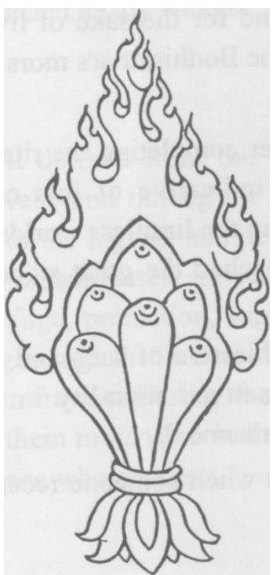

# **Sevenfold Practice of the Dharma** by Śākyaśrī**bhadra**

The short text translated here includes a group of seven spiritual practices devised on the basis of the Mahāyāna sū*tras*. In addition to training in the perfections (pā*ramit*ā) and the ten Bodhisattva stages (bhūmi), the Bodhisattva career also includes devotional and spiritual practices, which should be performed on a regular basis. The seven practices outlined here belong to the essential spiritual exercises which are performed individually, as a group, or as part of other rituals such as the Bodhisattva vow, funeral ceremonies or the *tantric* consecrations. As such, they encapsulate the fundamental teachings of Mahāyāna Buddhism, which concern the attainment of enlightenment and the liberation of all living beings.

The title of this work is *Sapt*āṅ*gasaddharmacary*āvatāra, which may be rendered as "Seven Limbs of Penetrating the Practice of the True Dharma." It was composed by the great paṇḍita of Kashmir, Śākyaśrībhadra (1127–1225 or 1145–1243), who made a significant contribution to the intellectual and spiritual activities of both Indian and Tibetan Buddhism.

* * *

I bow down before the Tathāgata Śākyasiṃha.1

Uniting harmoniously wisdom and means through the perfect adherence to the two levels of truth,2 I bow down with devotion before the highest refuges: the Buddha, the Dharma, and the noble Saṅgha. Such is the first limb of performing salutations.3

I worship the highest and precious Three Jewels with the rite of excellent worship by means of boundless clouds of worship endowed with the outer, inner, and transcendent character. Such is the second limb of offering worship.4

<sup>1 <</sup>i>Saptāṅ*gasaddharmacary*āvatāra / *Dam pa'i chos spyod la 'jug pa'i yan lag bdun pa*, Tibetan Tripiṭaka, Peking edition, vol. 103, No 5371, 177.4.3–178.1.1.

<sup>2 <</sup>i>satyadvaya / bden gnyis, namely conventional truth (saṃvṛ*tisatya / kun rdzob kyi bden pa*) and ultimate truth (*param*ā*rthasatya / don dam pa'i bden pa*).

<sup>3 <</sup>i>vandana (vandanā*, pra*ṇ*ipatya) / phyag 'tshal ba (btsal ba).*

<sup>4</sup> pūjanā */ mchod pa 'bul ba.* 

Setting my thoughts on the liberation of living beings, I constantly take refuge with devotion in the Buddha, the Dharma, and the Saṅgha until I gain the essence of enlightenment. Such is the third limb of taking the three refuges.5

I confess all the sins: the unbearable sins which I have committed with my body, speech, and mind, and the sins which I have inspired to commit or rejoiced in. Such is the fourth limb of confessing sins.6

I rejoice with delight in the merit that has been amassed by the perfect Buddhas, Bodhisattvas, and Pratyeka Buddhas, and that has been produced in the world. Such is the fifth limb of rejoicing (in the accrued merit).7

In the presence of the Buddhas, I raise the thought of perfect enlightenment with heroic diligence permeated with wisdom and compassion for the sake of living beings. Such is the sixth limb of raising the thought of enlightenment.8

> The *dharmas* of the store of merit have become the source of the three kinds of enlightenment. May I, through adhering to the path of the two kinds of selflessness, gain the final liberation.

> May all human beings become Buddhas on account of the merit, which I have produced. May I act with dedication in a magnanimous and perfect way for the sake of all living beings.

> May I behold the Buddhas during the entire series of my existences. May I also hear the holy Dharma, and be of service to the Saṅgha.

> May I live in the company of perfectly virtuous friends,9 who are knowledgeable in soteriological expedients (upāya). May I perform the activities of bestowing the Dharma and material goods. May I also accomplish for living beings the ordinary enjoyments and all the perfections (pā*ramit*ā).

> May I attain the supreme enlightenment through the merit of dispensed riches, strict adherence to morality, and thorough study of the holy Dharma.

> May I, after my death in this world, become reborn in the Tuṣita abode. May I promptly delight with my virtuous mind the Protector Maitreya, and may I receive from him the prophecy of my enlightenment.

Such is the seventh limb of reciting prayers.10

<sup>5</sup> śaraṇ*agacana / skyabs su 'gro ba.*

<sup>6</sup> pā*pade*śanā */ sdig pa bshags pa.*

<sup>7 <</sup>i>anumodana / rjes su yi rang ba.

<sup>8 <</sup>i>bodhicittotpā*da / byang sems bskyed pa.*

<sup>9 <</sup>i>kalyāṇ*amitra / bshes gnyen.*

<sup>10</sup> praṇidhā*na / smon lam.*

The information gathered here is based on two Indian texts, which explain the mental attitude, which one should maintain while pursuing different activities during the day from sunrise to sunset. These two texts are not concerned with devotional activities directed towards the Buddhas or Buddhist deities, but primarily with one's inner dispositions during daily activities such as washing, eating or working.

The first text, entitled *Bodhisattvagocarapari*ś*uddhi* ("Purification of the Bodhisattva's Sphere of Activities"), is attributed to a certain Rāhulabhadra whose precise identity remains uncertain. Depending on the sources and traditions, Rāhulabhadra is regarded either as the master of Nāgārjuna, the founder of the Madhyamaka School, or as a contemporary and follower of Nāgārjuna, or again as a successor of Āryadeva. In addition to this, Saraha, the renowned Vajrayāna master, is also known as Rāhulabhadra.1 Since the *Bodhisattvagocarapari*ś*uddhi* is based on the Mahāyāna sū*tras*, and since it is included in the Madhyamaka section of the Tibetan Tenjur (bsTan 'gyur), one would be inclined to attribute it to Rāhulabhadra associated with Nāgārjuna and Āryadeva. However, such attribution cannot be made with any certainty because this work is not ascribed to him in any other sources except for this one single entry in the Tibetan Tenjur.

The second text entitled *Tattvasa*ṃ*grahopade*śa ("Instructions on the True Perceptions") is attributed to a certain Śīlasambhava about whom the historical sources do not yield any information. The *Tattvasa*ṃ*grahopade*śa is the only work attributed to him in the Tenjur, and it is included in the *tantra* section among minor ritual texts.

The text composed by Rāhulabhadra provides instructions on the mental attitude that a Bodhisattva should assume during his daily activities. According to this text, the principal goal of all such daily exercises is to purify the Bodhisattva's mental dispositions (saṃtāna) and actions, as well as the mental

<sup>1</sup> D. Seyfort Ruegg, *The Literature of the Madhyamaka School of Philosophy in India*, Wiesbaden, 1981, 54, 105.

dispositions of all other living beings. The descriptions of the daily practices provided here represent only a selection. As the full title of this text indicates, it is based on the teachings of the Mahāyāna sū*tras*. The daily practices described in this text do not appertain to the Bodhisattva's standard or major practices, but rather constitute an isolated and less known group of practices. However, this and the next text are informative and interesting in the sense that they show how the daily life of the Mahāyāna and *tantra* followers in India has become permeated with ritual dimensions.

The second text by Śīlasambhava describes eight daily practices from the time of getting up early in the morning to the time of going to bed in the evening. The doctrinal foundation of these practices is derived from the Vajrayāna texts.

* * *

# *Purification of the Bodhisattva's Sphere of Activities*2

At the time of waking up, one should make the following aspiration:

"May I become knowledgeable in non-exertion in order to increase merit and knowledge. May I become free from heedlessness and sleep. May the night of ignorance of all living beings become dispelled, and may they all gain the vision of the rising sun of omniscience."

When getting out of bed, one should recite:

"May I leave the bed of saṃsāra, and may I gain transcendent power, energy, and all other attributes in the same way as they were gained by the Tathāgatas."

When putting on the lower garment, one should recite:

"May this garment of modesty and decency, and this sash of benevolence and compassion, be worn on the pattern of the Victorious Ones, and for the sake of the highest uplifting of all living beings."

When putting on the upper garment, one should recite:

"May this garment of great benevolence be worn on the pattern of the Sugatas, and may all the extremities and limbs of living beings acquire the nature of sameness (*samat*ā)."

When putting on shoes, one should recite:

"May my feet follow the highest Mahāyāna. May the vehicle of the gods, the vehicle of Brahmā, and all the remaining vehicles progress towards their final destinies."

<sup>2</sup> Śrī Rāhulabhadra, *Bodhisattvagocarapari*ś*uddhis*ūtrā*rthasa*ṃ*graha / Byang chub sems dpa'i spyod yul yongs su dag pa'i mdo'i don mdor bsdus pa*, Tibetan Tripiṭaka, Peking edition, vol. 103, 167.1.6– 5.7.

When opening doors, one should say:

"May all those endowed with bodies always open the great portals leading to happy rebirths, *nirv*āṇa, and the city of the omniscient ones."

When coming out of the house, one should recite:

"May the threefold world (*traidh*ā*tuka*) come out from the house of existence of the three deluded worlds. May all those aspiring for the light of omniscience reach the confines of the world."

While walking, one should recite:

"May I walk at all times with the pace of the supreme Tathāgatas."

When going to the toilet, one should recite:

"May the impurities of excrement and urine, which produce defilements, be cast away."

At the time of eating and drinking, one should recite:

"May living beings, following the example the Sugatas, become delivered from hunger and thirst, acquire the gratifying elixir of knowledge, and cease to be affected by diseases."

*Instructions on the True Perceptions*3

# 1. *Putting on clothes*

When one gets up in the morning, one performs the so-called garment *yoga*. Whether one actually executes a special blessing of one's garment or not, one should meditate for a moment on one's garment as emptiness. One disperses rays of light from one's heart and pervades the heart of the Lord Vajradhara, and then one draws out from his heart the syllable Hūṃ, which one dissolves into the garment. The syllable Hūṃ melts and becomes transformed into a crossed *vajra* (viś*vavajra*). Next, one should recite one's *mantra*, which should also become transformed into one's garment. When one abides in the pride of one's chosen deity, and wears this kind of royal garment, all obstacles become dispelled. It is for this reason that it is said that the garment must be blessed at the time of receiving the *tantric* consecrations.

# *2. Washing*

At the time of washing, one fills a suitable vessel with water while assuming the pride of one's chosen deity. Dispersing rays of light from the syllable Hūm resting in one's heart, one pervades the heart of the *guru* from whom one received the consecrations. Then again, one disperses rays of light from the hearts of one's favourite deities and the Buddhas in the ten directions, and one

<sup>3</sup> Śīlasambhava, *Tattvasa*ṃ*grahopade*śa / *De kho na nyid bsdus pa'i man ngag*, Tibetan Tripiṭaka, Peking edition, vol. 81, 246.4.3–247.5.6.

envisages oneself enunciating a prayer in which one requests to receive the sky-*vajra* (*nam mkha'i rdo rje*). Next, one requests the Buddhas, the relevant deities who remove obstructive spirits (*vighna*), and all other deities emerged from the hearts of one's favourite deities, to perform the morning ablution. One recites: "I wash with this pure water of the gods. Oṃ *sarvatath*ā*gata-kala*śābhiṣ*eka-samaya* śrī Hūṃ." While a host of goddesses positioned in the sky holds vases filled with ambrosia, one envisages oneself receiving a consecration and being blessed by the Buddhas. One assumes in one's mind that one's moral impediments are being washed away in the same way as one washes off one's bodily impurities. When one performs the actual act of washing, one envisages Akṣobhya over one's head, and one recites this *mantra*: "Oṃ *vajrasn*ā*na H*ūṃ."

## *3. Guru worship*

One envisages a maṇḍala, which one demarcates on the ground with dung and water, and then one arranges flowers, offers worship, makes the confession of sins, and executes all other relevant activities.

#### *4. Taking food*

First, one prepares and purifies the food and a suitable *bali*. Next, one envisages the wind maṇḍala by means of melting the syllable Yaṃ inside one's navel. On the top of it, one envisages the syllable Raṃ, which becomes transformed into Caṇḍālī having a blazing flame similar to that of a butter lamp. This activity constitutes the so-called purification of the navel.

Next, one engages the wind and fire elements in order to make radiant the deities inside the heart, the *skandhas*, the ā*yatanas* and the rest of the body. This is described as the preparation within the heart. When some people speak of making radiant the deities of the heart,4 they have in mind the Buddha families, but in fact, this actually refers to the *skandhas* and the rest. At the time of the consecrations, many knowledge-deities (jñā*nadevat*ā) are merged into the body and then blessed. As for the activity of merging within the heart, it is said in many *tantras* that the *skandhas*, ā*yatanas* and the rest constitute the very deities.

Next, one should gratify all the deities arising from the *bodhicitta* inside the mouth serving as a hearth. This is the so-called purification of the tongue. After that, in order to gratify the bodily maṇḍala, one remains still, and this constitutes the best food.

## *5. Taking liquids*

When one performs the so-called thirst *yoga*, on the palm of the right hand, one envisages a solar disc produced from the syllable Maṃ, and on the top of the solar disc, one envisages a drinking vessel produced from the letter A. The

<sup>4 <</sup>i>snying ga'i lha.

drinking vessel should be envisaged in the form of a skull filled with alcohol (*chang*) and having its spout marked with a moon disc. Inside the skull, one melts the syllable Ha and clarifies the colour of its content. After that, one purifies the mental state of its flavour with the syllable Hoḥ, and transforms the syllable Hrīḥ into ambrosia. Next, one proceeds to bring down the knowledge-deities. Placing the tip of the thumb on the first joint of the ring finger, one generates the ring finger into Mount Sumeru through the transformation of the syllable Suṃ, the thumb into its foundation through the transformation of the syllable Hūṃ, and in the space between them, one envisages butter generated from the syllable Maṃ. After that, one disperses rays of light from the visualised items and strikes with them the spots between the eyes of the chosen deities seated in *tantric* embraces in the Akaniṣṭha abode. In response, the deities discharge ambrosia, which gently trickles into the skull. Mount Sumeru and its foundation shake and become molten. One recites an appropriate *mantra*, and envisages inside the skull a triangle and a lunar disc surmounted by one's *guru* and chosen deity. One offers worship, recites the amṛta *mantra*, and surrenders one's body, speech, and mind to one's *guru*. One offers worship once more, and after that, one consumes the drink.

#### *6. Doing work*

One assumes a mental attitude that the empty receptacle world (bhā*janaloka*) is similar to a palace, and that all living beings are gods and goddesses. After that, whatever activities one performs, one retains an attitude of being a deity. At the time of reading the Prajñāpāramitā and other texts, one envisages on one's tongue a *vajra* serving as a drumstick, and on the palate a big drum. While striking with the *vajra* on the drum, one permeates the ten directions with a mighty sound, and one envisages all living beings hearing the drum's resonance in conformity with their individual dispositions and aspirations. Alternatively, one summons all living beings, and explains to them the Dharma in accordance with their individual capabilities to understand the Dharma. One should always act with the pride of a deity when one meditates on the attainment of enlightenment by all living beings.

## *7. Meditation*

One performs recitations and meditates during the evening sessions.

#### *8. Going to bed*

One can enter three different types of sleep: sleep in emptiness, sleep according to the generation stage (*utpattikrama*), and sleep deceiving death.

In the case of the sleep in emptiness, one absorbs the receptacle world within the living world, the living world within one's mother, one's mother within oneself, oneself within the knowledge-being (jñā*nasattva*), the knowledge-being

within a *vajra*, the *vajra* within the syllable Hūṃ, the syllable Hūṃ within the element of sound (nāda), the element of sound within emptiness, and then, one sleeps within it.

In the case of going to sleep according to the generation stage, one first invokes the knowledge-deities (jñā*nadevat*ā) and requests them to come. After that, one makes radiant the fatigue of one's sleep with the pride of the pledge-deities (*samaya-devat*ā) whom one establishes within one's recollected mind, which remains attentive and bright.

In the case of the sleep deceiving death, one envisages a white skull (kapāla) and goes to sleep.

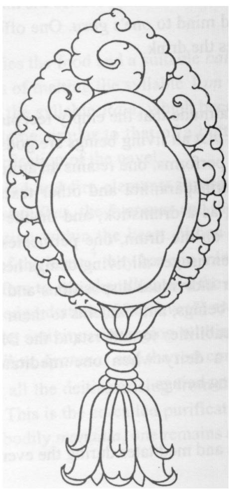

According to some Mahāyāna sources, both sū*tras* and treatises, the Buddha's life and activities in the world are said to have evolved in twelve consecutive stages, jointly referred to as the twelve acts or deeds of the Buddha. The reasons for having twelve deeds, and the actual choice of deeds, are not fully articulated in the relevant sources, but it is apparent from the lists given below that the deeds included among the twelve deeds are selected from the major events or stages of the Buddha's last life. The task of locating and collating all the lists of the twelve deeds still remains to be done. The four lists of the twelve deeds given below are intended to serve as indicative examples, and also to show similarities and differences in the choice of the twelve deeds.

The Daśabhū*mika-s*ūtra1 contains the following list of the twelve deeds: 1. descent from the Tuṣita abode (*cyavan*ā), 2. entry into and existence in the womb (caṅ*krama*ṇa*garbhasthiti*), 3. birth (*janma*), 4. dexterity in arts during boyhood (kumā*rakr*īḍā), 5. life in the palace (*anta*ḥ*purav*āsa), 6. departure from the world (*abhini*ṣ*krama*ṇa), 7. practice of austerities (duṣ*karacary*ā), 8. approach to the place of enlightenment (*bodhima*ṇḍ*opasa*ṃ*krama*ṇa), 9. victory over Māra (mā*radhar*ṣaṇa), 10. enlightenment (*abhisambodhi*), 11. request for and proclamation of the Dharma (*adhye*ṣaṇamahā*dharmacakrapravartana*), and 12. great demise (mahā*parinirv*āṇa).

The second example is taken from Bu ston's *History of Buddhism* in which the description of the first eleven deeds represents a summary of the *Lalitavistara*, and the description of the twelfth deed is based on the Vinaya Kṣudraka of the Mūlasarvāstivāda Vinaya: 1–2. residence in and descent from the Tuṣita abode, 3. entry into the womb in the form of a white elephant, 4. birth at Lumbinī, 5. dexterity in martial and other arts, 6. courtly life with women, 7. departure from the palace, 8. six years of austerities, 9. victory over Māra, 10. attainment of enlightenment, 11. proclamation of the Dharma, and 12. passing into *nirv*āṇa. 2

<sup>1</sup> Daśabhū*mikas*ūtra, ed. by J. Rahder, Leuven, 1926, 14.

<sup>2</sup> Bu ston, *History of Buddhism*, Part II, *The History of Buddhism in India and Tibet*, trans. by E. Obermiller, Heidelberg, 1932, 7–72.

In the Tibetan version of Asaṅga's Mahāyā*nasa*ṃ*graha* as edited by E. Lamotte,3 we find the following ten deeds: 1. residence in the Tuṣita abode (*dGa' ldan gyi gnas*), 2. descent (*'pho ba*), 3. birth (*bltam ba*), 4. sensual indulgence (*'dod pa la spyod pa*), 5. departure (*mngon par 'byung ba*), 6. study with heretics (*mu stegs can gyi gan du gshegs pa*), 7. austerities (*dka' ba spyod pa*), 8. enlightenment (*mngon par rdzogs par byang chub pa*), 9. proclamation of the Dharma (*chos kyi 'khor lo skor ba*), and 10. mahā*parinirv*āṇa (*yongs su mya ngan las 'das pa chen po*).4

The fourth example is the eulogy of Nāgārjuna, which is translated here below. In this text, the author praises the following twelve deeds: 1. descent from the Tuṣita abode and entry into the womb, 2. birth, 3. dexterity in martial arts, 4. life with a retinue of women, 5. departure, 6. austerities, 7. enlightenment, 8. proclamation of the Dharma, 9. defeat of the heretics, 10. miracle at Śrāvastī, 11. *nirv*āṇa, and 12. distribution of relics.

Out of the above four lists, three lists have in common the following ten events: 1. descent, 2. entry into the womb, 3. birth, 4. dexterity in arts, 5. life in the palace, 6. departure, 7. austerities, 8. enlightenment, 9. proclamation of the Dharma, 10. demise. Asaṅga's list does not include the deed of dexterity in arts, but otherwise, it agrees on eight events with the other three lists. The events, which are not in common to all four lists, but occur in one or two of them are: residence in the Tuṣita abode, study with the heretics, approach to the tree of enlightenment, victory over Māra, victory over the heretics, miracle at Śrāvastī, and distribution of relics.

According to Bu ston, the major point of disagreement between the sources concerns the first event, which in some texts is said to be the Bodhisattva's residence in the Tuṣita abode, and in some texts the descent from the Tuṣita abode. Bu ston also says that some isolated sources postulate that the Buddha's descent at Sāṃkāśya from the Trāyastriṃśa abode, and his statement about the decline of the Dharma, should be also included among the twelve deeds.5

<sup>3 <</sup>i>La Somme du Grand Véhicule d'Asaṅga (Mahāyā*nasa*ṃ*graha*), I, Louvain, 1938, 83.

<sup>4</sup> However, in his French translation of the Mahāyā*nasa*ṃ*graha*, II, 267–68, E. Lamotte provides the following list: 1–2. sojourn in the Tuṣita abode and descent (tuṣ*itabhavanav*āsam ādiṃ kṛtvā *cyavanam*), 3. entry into the womb (*garbh*ā*vakr*ānti), 4. birth (*janma*), 5. boyhood amusements (kumā*rakr*īḍā), 6. life inside the harem (*anta*ḥ*purav*āsa), 7. great departure (*abhini*ṣ*krama*ṇa) and study with heretics (tī*rthikasam*ī*pagamana*), 8. ascetic practices (duṣ*karacary*ā), 9. victory over Māra (mā*radhar*ṣaṇa), 10. enlightenment (*abhisa*ṃ*bodhi*), 11. proclamation of the Dharma (*dharmacakrapravartana*), 12. mahā*parinirv*āṇa. 5 Some of the texts dealing with the twelve deeds of the Buddha are mentioned by Bu ston in his

<sup><</sup>i>History of Buddhism, Part I, *The Jewelry of Scripture*, trans. by E. Obermiller, Heidelberg, 1931, 133– 38.

In some Mahāyāna sources and in the *tantras*, the twelve deeds are not presented or interpreted as a gradual progression towards reaching the state of buddhahood, but rather as Buddha activities performed in the world for the benefit of living beings. Another curious anomaly about the twelve deeds is that they represent a combination of the deeds performed as a Bodhisattva prior to the attainment of enlightenment, and the deeds performed as a Buddha after gaining the state of enlightenment. This amalgamation of Bodhisattva and Buddha deeds is a rather complex issue, which is rooted in the doctrinal discussions and debates concerning the Buddha's identity, and the capacity in which he acted in this world. Some of the relevant debates about the Buddha's identity are discussed in the first article included in this issue, which deals with the historical spectrum of the Bodhisattva ideal. It is not my intention to elaborate here on all such doctrinal debates, but I would like to offer three examples of how this amalgamation of the Buddha's deeds as a Bodhisattva and a Buddha is interpreted in some Mahāyāna and tantra sources. First, according to some sū*tras*, such as the *Saddharmapu*ṇḍarīka, 6 the Buddha is said to have attained enlightenment many aeons ago, and hence all his activities in the world should be regarded as Buddha activities. Second, within the context of the three Buddha-Bodies, the performance of the twelve deeds is attributed to the manifested or apparitional body (*nirm*āṇakāya). Asaṅga, for instance, explains in his Mahāyā*nasa*ṃ*graha*7 that the *nirm*āṇakāya relies on the *dharmak*āya and manifests the deeds, which commence with the residence in the Tuṣita abode and conclude with the Buddha's mahā*parinirv*āṇa. This interpretation of the *nirm*āṇakāya is somewhat modified in Asaṅga's *Abhidharmasamuccaya* where he provides a definition of an inconceivable (*acintya*) Tathāgata. He states that an inconceivable Tathāgata is a person who, in the domain of sense pleasures, manifests the career (*cary*ā) of a Bodhisattva, the career of a Buddha, and the great career (mahā*cary*ā), which extends from the time of his stay in the Tuṣita abode to the time of his mahā*parinirv*āṇa. 8 It would seem on the basis of the above interpretations that ultimately all the manifested activities in this world are performed as Buddha activities. Third, according to the *yoga tantras*, such as the *Sarvatath*ā*gatatattvasa*ṃ*graha*, Siddhārtha, named in this tantra as Bodhisattva Sarvārthasiddhi, was taken by the Buddhas from the seat of enlightenment (*bodhima*ṇḍa) to the Akaniṣṭha abode where he was instructed to execute five

<sup>6</sup> The *Saddharmapu*ṇḍarīka, trans. by H. Kern, Oxford, 1884, reprinted Delhi, 1989, 299. See also *The*  Laṅkāvatā*ra Sutra*, trans. by D.T. Suzuki, London, 1973, 122, where the Buddha asserts to have been the Buddha Krakucchanda, Kanakamuni and Kāśyapa.

<sup>7 <</sup>i>La Somme du Grand Véhicule d'Asaṅga (Mahāyā*nasa*ṃ*graha*), trans. E. Lamotte, II, Louvain, 1938, 267.

<sup>8 <</sup>i>Le Compendium de la Super-doctrine (*Philosophie*), *Abhidharmasamuccaya d'Asa*ṅga, traduit et annoté par Walpola Rahula, Paris, 1971, 158.

successive stages of meditational realisation (*abhisa*ṃ*bodhi*) through which he gained the state of buddhahood. After that, he went and proclaimed the Yoga Tantra teachings on the summit of Mount Sumeru, returned to the seat of enlightenment, and then resumed to enact the remaining deeds of his earthly existence.9 This exposition seems to make a clear distinction between the deeds performed as a Bodhisattva and the deeds performed as a Buddha.

It is thus evident from the above brief discussion that the choice of the twelve deeds and the doctrinal identity and capacity of their performer are not fully agreed upon in Mahāyāna texts.

The author of the Dvādaśakā*ra-n*ā*ma-stotra* translated here below is named Nāgārjuna. It is difficult to determine whether he is the same Nāgārjuna as the third century founder of the Madhyamaka School, or the *tantric* Nāgārjuna who lived in the seventh century. In the Tibetan Tenjur (bsTan 'gyur), the section containing a collection of hymns (*bstod tshogs*) includes nineteen hymns ascribed to Nāgārjuna.10 Among this group of nineteen hymns there are included the four hymns which have been attributed in some sources to the earlier Nāgārjuna.11 This group of hymns also includes the Dvādaśakā*rastotra* and the two eulogies of the eight great *caityas* translated in the next section of this issue. Since the Dvādaśakā*rastotra* and the two eulogies of the eight great *caityas* are not among the hymns attributed to the earlier Nāgārjuna, and since their subject matter and content are rather devotional in character, it seems reasonable but uncertain to assume that their author was the *tantric* Nāgārjuna.

* * *

I bow before the Buddha Śākyamuni.12

Having first raised the thought of enlightenment, and having perfected the double accumulation of merit and knowledge, at that time, you have become the champion of the great and magnanimous deeds. I bow before you, who have become the protector of the world.

<sup>9</sup> The *Sarvatath*ā*gatatattvasa*ṃ*graha*, ed. by I. Yamada, New Delhi, 1981, 7ff; Śākyamitra's commentary, *Kosal*ālaṃkāra, Tibetan Tripiṭaka, Peking edition, vol. 70, 197.5.7ff.

<sup>10 <</sup>i>A Catalogue of the Tibetan Buddhist Canon, Sendai, 1934, numbers 1118–1125 and 1127–37.

<sup>11</sup> See D. Seyfort-Ruegg, *The Literature of the Madhyamaka School of Philosophy in India*, Wiesbaden, 1981, pages 31–2 for the hymns attributed to the founder of the Madhyamaka School, and pages 104-5 for the *tantric* Nāgārjuna.

<sup>12</sup> Dvādaśakā*ra-n*ā*ma-stotra*, *mDzad pa bcu gnyis kyi tshul la bstod pa* by Nāgārjuna, Tibetan Tripiṭaka, Peking edition, vol. 46, 40.3.1–4.7.

Having instructed the gods, and upon foreseeing the appropriate time for conversion, he left the gods like a mighty elephant, and having ascertained the family, he has entered the womb of the queen Māyā. I bow before this Buddha deed. (1)

Upon the completion of ten months, at the time of his birth in the auspicious Lumbinī grove, the heir of the Śākyas received the highest respects from Brahmā and Indra, accomplishing thus the deed of affirming his Bodhisattva lineage. I bow before this Buddha deed. (2)

The Śākya Lion and valiant young men have demonstrated their personal dexterity in Aṅga and Magadha. Having duly defeated the men permeated with arrogance, he accomplished the deed of matchlessness. I bow before this Buddha deed. (3)

In order to behave in conformity with the worldly conventions and to discard blameworthy things (*avadya*), through his expertise in the skilful ways of living with a retinue of women, he accomplished the deed of protecting the kingdom's sovereignty. I bow before this Buddha deed. (4)

Upon perceiving that the activities of saṃsāra were without any essence, he left his stately home. Although he has passed into space, in reality he executed the deed of going forth in the vicinity of a pure *caitya*. I bow before this Buddha deed. (5)

Having fixed his mind with diligence on attaining enlightenment, for six years he practised austerities in the vicinity of the river Nairañjanā, and gained the highest dhyānas. I bow before this Buddha deed. (6)

On account of his peerless effort from the beginningless time, he sat down unperturbed with his legs crossed under the *bodhi* tree in Magadha, and having become awakened, he accomplished the deed of perfect enlightenment. I bow before this Buddha deed. (7)

Having zestfully cast his eyes with compassion on living beings, he set in motion the Dharma-wheel at Vārāṇasī and other excellent places, accomplishing thus the deed of establishing trainees (*vineya*) in the three vehicles (*triy*āna). I bow before this Buddha deed. (8)

Having debunked the wicked accusations of other people, he humiliated the six heretical teachers, Devadatta and other demons (māra) in the trouble-ridden places, accomplishing thus the deed of the victory over his adversaries. I bow before this Buddha deed. (9)

Through his excellent qualities, matchless in the threefold world, he displayed the great miracle (prātihārya) at Śrāvastī, and received worship from all the gods, men and other living beings, accomplishing thus the deed of diffusing the teachings (śā*sana*). I bow before this Buddha deed. (10)

In order to swiftly exhort those pervaded with sloth (*kaus*īdya), he passed away like an immortal *vajra* on the pure soil of Kuśinagara, accomplishing thus the deed of passing into *nirv*āṇa. I bow before this Buddha deed. (11)

On account of the indestructible character of absolute reality (*tattva*) and in order to enable the future living beings to gain merit, he truly manifested many relics (śarīra), accomplishing thus the deed of having his bodily remains divided into eight shares. I bow before this Buddha deed. (12)

May, through the virtue of this short eulogy of the successive deeds of the lord and master of the teachings, the actions of all living beings also progress in conformity with the path of the Sugatas.

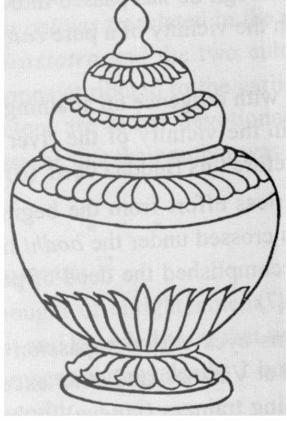

According to the well-established Buddhist tradition, after the cremation of his body, the Buddha's relics (śarīra) were divided into eight portions and distributed among eight North-Indian states.1 Each state is said to have erected a stūpa over the received share of the relics. King Ajātaśatru of Magadha built a stūpa at Rājagṛha, the Mallas of Kuśinagara at Kuśinagara, the Licchavis of Vaiśālī at Vaiśālī, the Śākyas of Kapilavastu at Kapilavastu, the Bulakas of Calakalpā at Calakalpā, the Krauḍyas of Rāmagrāma at Rāmagrāma, the brāhmaṇas of Viṣṇudvīpa at Viṣṇudvīpa, and the Mallas of Pāpā at Pāpā. The stūpas built in these eight places were called droṇ*a st*ūpas due to the fact that the division of the relics was executed by a certain brāhmaṇa called Droṇa, and also because each stūpa enshrined one droṇa of relics. The Sanskrit term droṇa means a vessel or a bucket, and also a specified measure of capacity of approximately two pints. Instead of the term droṇa, the relevant texts also use the term *kumbha*, which means a jar or an urn. In addition to these eight ancient stūpas, two more stūpas were built. Droṇa, in some texts he is called Dhūmrasagotra, the brāhmaṇa who divided the relics is said to have built a stūpa over the droṇa vessel which he used to distribute the relics, and the Mauryas of Pipphalivana built a stūpa at Pipphalivana over the embers (aṅgāra) from the cremation fire. Thus, after the cremation of the Buddha's body, altogether ten stūpas were built, eight containing proper relics, one containing the droṇa vessel and one the embers. The subsequent history and state of these early stūpas are not well documented. However, the available textual sources and archaeological evidence strongly attest that the cult of the stūpa became popular from the very early period, and that the stūpa as such was treated and venerated as the primary sacred site. During the rule of the emperor Aśoka (214–255 BC),2 the cult and significance of the stūpa were further expanded and popularised. It is said that Aśoka extracted the Buddha's relics from the ancient droṇa stūpas and enshrined them in eighty-four thousand stūpas, which he had erected in different places of

<sup>1</sup> Mahā*parinibb*ā*na-sutta*, Dīgha, II, 166–67; *Buddhava*ṃsa, chapter XXVIII.

<sup>2</sup> E. Lamotte, *History of Indian Buddhism*, Louvain-La-Neuve, 1988, 88.

his realm. 3 The stūpas erected by Aśoka were referred to as "the stūpas of the king of the Dharma" (*dharmar*ā*jika st*ūpa).

While the cult of the stūpas containing the Buddha's relics continued to flourish, at some stage there evolved a new cultic tradition of the so-called eight great *caityas* (mahā*caitya*). This group of eight *caityas* is said to have been erected in eight different places to commemorate four primary and four secondary events of the Buddha's life, which occurred in those places. The two eulogies of the eight great *caityas* translated here below, refer to this group of eight *caityas* and not to the eight ancient stūpas built soon after the Buddha's demise. These eight great *caityas* are said to have been erected at Kapilavastu, Bodhgayā, Vārāṇasī, Śrāvastī, Sāṃkāśya, Rājagṛha, Vaiśālī and Kuśinagara. The *caityas* at Kapilavastu, Bodhgayā, Vārāṇasī and Kuśinagara4 were erected to commemorate the four primary events of the Buddha's life, namely his birth, enlightenment, proclamation of the Dharma, and passing into *nirv*āṇa. All sources agree on these four places and the events associated with them, no doubt because they were considered as the central events right from the beginnings of Buddhism, and because they had deep devotional and doctrinal implications. In the case of the four secondary places and events, the sources basically agree on the places, but there is no full agreement on the events. When one takes into account the relevant sources, there is an overall agreement on all the eight places, on the four primary events, and on two secondary events associated with Śrāvastī and Sāṃkāśya, but there is no unanimity on the events associated with Vaiśālī and Rājagṛha. Śrāvastī is consistently associated with the Buddha's great miracle and the defeat of the heretical teachers, and Sāṃkāśya with his descent from the Trāyastriṃśa abode. In the case of Vaiśālī and Rājagṛha, the texts do not consistently refer to one single event for each place, but to two different events. In the case of Vaiśālī, some texts speak of the Buddha's renunciation of the remainder of his life, and some texts speak of the gift of honey offered to him by a monkey. In the case of Rājagṛha, the texts refer to either a reconciliation of the Saṅgha or the Buddha's subjugation of a fierce elephant. In the surviving Indian sculptures, which depict the eight events as one group, the events which are consistently represented in connection with Vaiśālī and Rājagṛha are the gift of honey offered by a monkey, and the subjugation of a fierce elephant. According to Foucher, this consistency in sculpture suggests that the Indian

<sup>3</sup> E. Lamotte, *op. cit.*, 240–41; J.S. Strong, *The Legend of King A*śoka, Princeton University Press, Princeton, 1983, 109–119.

<sup>4</sup> These four places were recommended by the Buddha shortly before his death as places of pilgrimage. In the relevant passage of the Mahā*parinibb*ā*na-sutta*, the Buddha tells Ānanda that the sight of these places should arouse religious feelings, and that the people who die while visiting them will become reborn in heavenly places. Dīgha, II, 140–41.

artists favored the events which had more popular appeal and were more conducive to being expressed in artistic forms.5

The four secondary events, except for the Buddha's renunciation of his life at Vaiśālī, are not mentioned or described in the early Pāli canonical texts, but only in the late additions to the canonical collections, in the commentaries and some other late works. Similarly, in the available Sanskrit sources, the accounts of these events are also narrated in late literary compositions known as *avad*ā*nas.*

The reasons for adding four secondary events to the four primary events to form an integral group of eight events are not clearly stated in the relevant sources, although the intended significance of these events seems to be fairly apparent. The descriptions of those events strongly emphasise the Buddha's superhuman and miraculous powers, and stress that these events were cosmic events witnessed by large gatherings of people and gods, who duly gained the realisation of the Dharma and various grades of sanctity. The relevant texts narrating these events deliberately attempt to demonstrate the Buddha's transcendent and unparalleled powers through which he decisively overcomes all evil and adversaries, induces a kind of universal conversion, and acts for the benefit of all living beings.

## The *Buddha's miraculous powers*

In the Dīgha-nikāya6 the Buddha tells the householder Kevaddha that he was capable of three kinds of miracle (prāṭihārya), namely the miracle of psychic powers (ṛ*ddhi*), the miracle of mind-reading or telepathy (ādeśanā), and the miracle of instruction (anuśāsanī). It is explained that someone endowed with psychic powers can perform various feats such as becoming many, appearing and disappearing, passing unhindered through walls and mountains, sinking into the ground and emerging from it as if from water, walking on the water without sinking, flying cross-legged in the sky like a bird, touching and stroking the sun and the moon with his hand, and travelling in the body as far as the world of Brahmā. The miracle of telepathy consists in the ability to read the minds and thoughts of other living beings. The miracle of instruction consists in the ability to intercept other people's dispositions and to guide them in such ways that they definitely make progress.7 These three types of miraculous powers are explicitly or implicitly in evidence in the descriptions of the secondary events. However, the relevant texts go further and amplify the Buddha's miraculous powers in

<sup>5</sup> A. Foucher, *Le Grand Miracle du Buddha à* Śrā*vasti*, (Extrait du *Journal Asiatique*, Jan-Fév, 1909), Paris, 1909, 7–8.

<sup>6</sup> Dīgha, I, 212.

<sup>7</sup>  These three forms of miracle are explained in the Paṭ*isambhidh*ā*magga*, tr. by Bhikkhu Ñāṇamoli, *The Path of Discrimination*, PTS, Oxford, 1991, 395.

order to demonstrate his qualities and attributes. This is particularly evident in the case of the miracle at Śrāvastī and the descent at Sāṃkāśya.

#### The *great miracle of* Śrā*vast*ī

Śrāvastī was one of the Buddha's favoured places where he is said to have passed twenty-five rainy seasons. It was in this place that he decisively defeated and humiliated the six heretical teachers when he demonstrated his superhuman powers through the performance of the great miracle (mahāprātihārya). The great miracle of Śrāvastī as recounted in the *Divy*āvadāna8 is not limited to one single event, but it includes a whole series of wondrous happenings of cosmic proportions. The immediate reasons for performing it were the provocation by the heretical teachers, who challenged the Buddha to compete in superhuman powers, and the Buddha's awareness that he must, like all the previous Buddhas, perform such a miracle. The initial incident takes place at Rājagṛha.9 The six heretical teachers10 feel unhappy about receiving less respect and support than the Buddha. They assert that they are endowed with magic powers (ṛ*ddhimanto*) and follow the truth (jñānavādin), and at the same time, they are fully aware that the Buddha also possesses superhuman qualities (*uttaramanu*ṣ*yadharma*), and the ability to perform feats and miracles (ṛ*ddhi-pr*āṭihārya). After deliberations, they reach a decision that if the Buddha consents to perform one or more miracles, they will perform twice as many. Māra, seeing his chance to trouble the Buddha once again, assumes the guise of Pūraṇa Kāśyapa, flies into the air and displays before Maskarin Gośāliputra a magic spectacle of flames, light, rain and lightning. Māra claims as Pūraṇa Kāśyapa to have magic powers, and encourages Maskarin Gośāliputra to challenge the Buddha. Then acting in a similar way, Māra duly alternates his guises, and performs the same artifice in front of the remaining heretical teachers. Being mutually reassured of their magic powers, the heretical teachers approach the king Biṃbisāra and ask him to request the Buddha to compete with them in superhuman powers. However, being convinced that they had no such powers and out of respect for the Buddha, Biṃbisāra refuses to approach the Buddha.

<sup>8 <</sup>i>Divyāvadāna, ed. E.B. Cowell and R.A Neil, Cambridge, 1886, chapter 12. Prātihā*ryas*ūtra, 143– 66. This particular *avad*āna has been translated into French by E. Burnouf, *Introduction à l'Histoire du Buddhisme Indien*, Paris, 1876, 144–66. A versified version of this *avad*āna is included in Kṣemendra's Bodhisattva *Avad*ā*nakalpalat*ā, edited by Sarat Chandra Das and Hari Mohan Vidyabhushaṇa. Calcutta, 1888, chapter 13: Prātihāryāvadāna, 411–29.

<sup>9 <</sup>i>Divyāvadāna, 14.

<sup>10</sup> Pūraṇa Kāśyapa, Maskarī Gośālīputra, Saṃjayī Vairaṭṭīputra, Ajita Keśakambala, Kakuda Kātyāyana, and Nirgrantha Jñātiputra.

In the meantime, the Buddha reflects on the place where the previous Buddhas had performed the great miracle (mahāprātihārya), and the deities (*devat*ā) duly inform him that it was at Śrāvastī. The Buddha, accompanied by a large group of people, proceeds to Śrāvastī and settles in the Jetavana. The heretics also arrive there with their followers and ask Prasenajit, the king of Kośala, to invite the Buddha to compete with them in the performance of miraculous feats. Prasenajit approaches the Buddha and requests him to show his superhuman powers in order to benefit living beings, to defeat the heretics, to gratify the gods and men, and to fill with joy the hearts of honest people. The Buddha declines to consent, but Prasenajit renews his invitation and states that it is a rule (*dharmat*ā) that all the Buddhas perform ten indispensable actions (daśāvaś*yakara*ṇīya):11—No Buddha passes into *nirv*āṇa until: 1. he personally prophesies someone to become a Buddha; 2. he induces a second being (*sattva*) to raise the irreversible thought of the supreme and perfect enlightenment (*anuttarasamyaksa*ṃ*bodhi*); 3. he converts all the people whom he is destined to convert (*vaineya*); 4. he lives at least three quarters of his life (*tribh*āga-āyuṣa); 5. he imparts responsibilities to others (sīmā*bandha*); 6. he appoints a couple of his śrā*vakas* as foremost disciples; 7. he displays the descent of the gods (*devat*ā*vatara*ṇa) at Sāṃkāśya; 8. he discloses the strands of his previous actions (*purvik*ā *karmaploti*) while staying with his śrā*vakas* by the lake Anavatapta;12 9. he establishes his parents in the truths (*satya*); 10. he performs the great miracle at Śrāvastī.

Reflecting that a Tathāgata must accomplish such deeds, the Buddha consents to meet the challenge in seven days time following the advice of the gods, the Buddha decides to perform the great miracle between Śrāvastī and the Jatavana, and Prasenajit duly erects on that spot a hall (maṇḍapa) with a lion throne (siṃhā*sana*). The followers of the heretical teachers also construct halls for Pūraṇa and others, and invite many heretics to gather in their support.

In the meantime, Prasenajit cuts off the hands and legs of his brother Kāla, who is unjustly accused of attempting to seduce a woman in the king's palace. The Buddha instructs Ānanda to go and restore Kāla's hands and legs while

<sup>11</sup> Divyāvadāna, 150.

<sup>12</sup> It is said that shortly before the Buddha's demise, five hundred disciples flew to the lake Anavatapta and recounted in the Buddha's presence the noble deeds done in their former existences. It was on this occasion that the Buddha recounted his bad deeds for which he suffered rebirths in hells, and which also induced painful experiences in his last life. The Pāli account of this event is given in the *Pubbakammapiloti*, *apad*āna 387 in the *Apad*āna, I, 299–301, of the Khuddaka-nikāya. This account is also incorporated in some Sanskrit sources such as the *Bhai*ṣ*ajyavastu* of the Mūlasarvāstivāda Vinaya, ed. S. Bagchi, vol. I, Darbhanga, 1967, 129–32, and the *Avad*ā*nakalpalat*ā, chapter 50. Daś*akarmaploti*. A short summary of this *avad*āna is given in J. Chattopadhyay, *Bodhisattva Avad*ā*nakalpalat*ā*. A Critical Study*, Calcutta, 1994, 170–72.

reciting certain stanzas. Kāla is instantly cured, gains the fruit of an anāgāmin, becomes an attendant in the king's park (ārāma), and his name is changed to Gaṇḍaka.

In the morning of the seventh day,13 the Buddha collects alms in Śrāvastī, has his meal, and then retires to have a rest. Prasenajit accompanied by a large crowd and the heretical teachers proceed to the agreed spot and sit down on their assigned places. Prasenajit dispatches Uttara, a young man, to go and invite the Buddha. Uttara goes and invites the Buddha, and then returns not by walking but by flying in the air. Prasenajit on seeing this feat tells the heretics that the Buddha has just performed a miracle, and that they should reciprocate and also perform a miracle. The heretics reply that since the gathered crowds are very large, Prasenajit cannot really determine whether the miracle was performed by them or by the Buddha.

The Buddha enters a particular meditation and sets on fire the hall prepared for him. The heretics urge Prasenajit to extinguish the fire, but before anything is done, the flames disappear. Once again, Prasenajit invites the heretics to perform a miracle, but they give him the same answer as before.

Next, the Buddha issues a beam of golden light (*kanakamar*īcikā*vabh*āsa) and illuminates the entire world (*sarvaloka*). After that, Gaṇḍaka instantly brings a stalk of the karṇikāra tree from the continent of the Uttarakuru, another park attendant brings a stalk of the aśoka tree from the Gandhamādana mountain, and they place these items in front of the Buddha's hall. This time too, Prasenajit challenges the heretics to perform a miracle, but receives the same reply as on the previous occasions.

Next, the Buddha intentionally (*abhisa*ṃskāra) places his feet on the ground, and instantly the great earth (mahāpṛ*thiv*ī) and the triple chiliocosm (*tris*ā*hasra-mah*āsā*hasralokadh*ātu) shake in six different ways, the sun and the moon glow and shine, and all kinds of wonderful happenings take place (āś*cary*ā*d-bhuta-pr*ā*durbh*ūta). The deities positioned on the edges of the firmament (*gaganatala*) honour the Buddha with flowers, scented powders, and sounds of music. Five hundred hermits (ṛṣi) living in a forest realise what is happening, arrive in Śrāvastī, pay homage to the Buddha, request for monastic ordinations (*upasa*ṃpadā), become instantly shaved and dressed as monks, and the Buddha ordains them.

Next, the Buddha proceeds to perform the great miracle (mahāprātihārya).14 After receiving homage from the gods and men, he enters the miracle hall (prātihā*ryama*ṇḍapa) and sits down on the seat prepared for him. Rays of light issue from his body and Illuminate the entire hall with golden light. The

<sup>13 <</sup>i>Divyāvadāna, 155.

<sup>14 <</sup>i>Divyāvadāna, 159.

householder Lūhasudatta offers to perform miraculous feats and to defeat the heretics on the Buddha's behalf, but the Buddha declines the offer on the grounds that since the heretics challenged him, he must personally demonstrate his superhuman powers. Similarly, several other people, including Maudgalyāyana, offer to act on the Buddha's behalf, but he declines to act through proxies. The Buddha tells Prasenajit to invite the Tathāgata in a formal way to demonstrate his superhuman powers. Prasenajit obliges and formulates his invitation in the same way as he did it on the first occasion.

The Buddha enters a particular kind of meditation, disappears from his seat and reappears in the sky towards the eastern direction. He displays four different bodily attitudes (īryā*patha*), namely he concurrently walks, stands, sits and lies down. Next, he penetrates into the fire element (*tejodh*ātu), and emits from his body rays of light (*arcis*) of blue, yellow, red, white, and crystal colours. He also displays many other miracles. Next, he discharges names of fire from the lower part of his body, and a stream of water from the upper part of the body. He repeats this performance towards the south, and then towards the four cardinal directions. After that, he returns to his seat.15

Then once more, Prasenajit invites the Buddha to demonstrate his superhuman powers.16 The Buddha generates a mundane thought (*laukikacitta*). The text explains that when the Buddhas generate a mundane thought, all living beings, including the smallest insects, are able to perceive it, and that when he generates a transcendent thought (*lokottaracitta*), it is inaccessible even to the Pratyeka Buddhas and śrā*vakas*. Śakra, Brahmā and other gods realise that the Buddha generated a mundane thought in order to indicate his intention of performing the great miracle for the benefit of living beings. All the gods leave their abodes and gather around the Buddha at Śrāvastī. Nanda and Upananda, the two nāga kings, create a large golden lotus with one thousand petals for the Buddha to sit on. The Buddha sits down on that lotus, and above it, he creates another lotus and appears on it in a seated posture. Similarly, he projects identical Buddhas on all sides and as high as the Akaniṣṭha abode. Some Buddhas appear walking, some standing, some sitting, and some lying down. Some Buddhas pervade into the fire element and produce displays of flames (*jvalana*), fire (*tapana*), rain (varṣaṇa) and lightning (*vidtyotana*). Some Buddhas ask questions and other Buddhas reply and recite stanzas. It is in this way, the text explains, that the

<sup>15</sup> It is said in the *Divy*āvadāna, 161, that this magical power (ṛ*ddhi*) is common to all the Buddha's disciples (śrā*vakasadh*āraṇa). However, some sources such as the commentary on the Jā*taka* 483, IV, 265, say that the *yamaka-pr*ātihārya is not common (asādhāraṇa) to the śrā*vakas*. See A. Foucher, Le *Grand Miracle du Buddha* à Śrā*vast*ī, 14.

<sup>16 <</sup>i>Divyāvadāna, 161.

Buddha displays before the entire world the Buddha-glory (*buddh*ā*vata*ṃ*saka*) 17 through his Buddha-power (*buddh*ā*nubh*āva), and through the power of the gods (*devat*ā*nuhh*āva). Finally, all the Buddhas instantly disappear, and the Buddha, seated alone on his seat, recites the following stanza:

> The insects shine so long as the sun does not rise. Once the sun rises, the insects become confused and cease to shine.

> Similarly, these dialecticians (tā*rkika*) shone while the Tathāgata remained silent. However, once the perfect Buddha has shone in the world, the dialecticians and their śrā*vakas* keep silent.

Prasenajit informs the heretics that the Buddha had just demonstrated his superhuman powers, and invites them, for the last time, to demonstrate their powers, but they remain silent.18 Then Pāñcika, the great leader of the yakṣa army (yakṣ*asen*ā*pati*), causes a storm and destroys the hall of the heretics, who disperse and run away in disarray. Pūraṇa Kāśyapa is said to have committed suicide by drowning himself.

Next, the Buddha produces a Buddha appearance (*nirm*āṇa) endowed with the thirtytwo marks of a great man (mahā*puru*ṣa) and dressed in monastic robes.19 He explains that it is a rule (*dharmat*ā) that the Buddhas converse with the Buddha appearances which they produce. However, when a śrā*vaka* produces a phantom (*nirmita*), that phantom talks when the śrā*vaka* talks, and remains silent when the śrā*vaka* is silent. By contrast, the Buddha asks questions and the created appearance gives answers.

Finally, knowing the inner dispositions of the gathered people, the Buddha teaches the Dharma, and a large number of people gain different grades of sanctity such as becoming stream-winners (śrotā*patti*) or *arhats.*

In the Pāli tradition, the miracle of Śrāvastī is known as the miracle at the foot of the gaṇḍ*amba* tree or as the twin miracle (*yamakap*āṭihā*riya*). According to the commentary on the *Dhammapada*, 20 after agreeing to perform the miracle, the Buddha tells Prasenajit that he intends to perform it under a mango-tree. Upon hearing this, the heretics uproot all the mango-trees to prevent the event.

<sup>17</sup> Also called Buddha-play, buddhavikrīḍita. *Divy*āvadāna, 401. 18 *Divy*āvadāna, 163.

<sup>19 <</sup>i>Divyāvadāna, 166.

<sup>20 <</sup>i>Dhammapadaṭṭ*haka*ṭhā, III, 199–216; E.W. Burlingame, *Buddhist Legends, Dhammapada Commentary*, Part 3, Cambridge, Mass., 1921, 40ff. The descriptions of this miracle are also given in the commentaries on the Dīgha-nikāya, I, 57, and on the Jā*taka* 483, IV, 263–67. This miracle is also mentioned in a number of other Pāli texts such as the Jā*taka*-nidā*naka*ṭhā, *Visuddhimagga*, *Milindapañha* and Mahāvaṃsa. For further references see G.P. Malalasekera, Dictionary of Pāli Proper Names, under *yamaka-p*āṭihā*riya*; A Foucher, *Le Grand Miracle du Buddha à* Śrā*vast*ī, 13.

On the agreed day, the Buddha receives a mango fruit offered to him by Gaṇḍa, the king's park attendant, eats the fruit and instructs Gaṇḍa to plant its seed. The Buddha washes his hands over the spot where the seed is planted, and instantly a large mango-tree springs up. Since the heretics uprooted all the mango-trees out of wickedness, Śakra instructs the windcloud and sun deities to afflict the heretics with rain and heat. Being tormented by heat and rain, the heretics flee in disarray and Pūraṇa Kāśyapa commits suicide.

Next, the Buddha creates a jewelled promenade (caṅ*krama*) in the sky and standing on it, he performs the twin miracle. He ejects flames of fire from the upper part of his body, and a stream of water from the lower part of his body. After that, he alternates and ejects flames of fire from the lower part of his body, and a stream of water from the upper part of his body. He does the same through his eyes, nostrils, ears, shoulders, hands, feet and every pore of his body. He also issues rays of six colours: blue, yellow, red, white, pink and crystal. The flames of fire, the stream of water, and the rays of light reach as high as the world of Brahmā, and as far as the limits of the universe (Cakravāla). Next, the Buddha alternates bodily postures with his double. While he walks, his double stands, sits or lies down. When his double lies down, the Buddha walks, stands or sits. While walking up and down the Jewelled promenade and performing the twin miracle, the Buddha intermittently gives teachings and many living beings gain the full comprehension of the Dharma. At the end of this miracle the Buddha ascends in three strides to the Trāyastriṃśa abode to preach the Abhidharma to his mother.21

## *The descent at S*āṃkāśya

The Buddha's descent at Sāṃkāśya is generally referred to as the descent of the gods. 22 After the great miracle at Sravasti, the Buddha ascended to the Trāyastriṃśa abode where he taught the Abhidharma for three months during the rainy retreat to his mother and the assembled gods.23 At the end of the rainy retreat, Maudgalyāyana visited the Buddha and requested him to descend to Jambudvīpa, and the Buddha agreed to come down in seven days time.24

On the day of the descent, Ś akra created three ladders, one made of gold, one of jewels, and one of silver. The bottoms of the ladders rested by the gates of the city of Sāṃkāśya25 and their tops leaned against the summit of Mount Sumeru.

<sup>21</sup> E. W. Burlingame, *op. cit.*, 47.

<sup>22</sup> Sanskrit devāvatāra, Pāli *devoroha*ṇa.

<sup>23</sup> E. W. Burlingame, *op. cit.*, 47–52.

<sup>24</sup> E. W. Burlingame, *op. cit.*, 52–56.

<sup>25</sup> It is said in the *Avad*ānaś*ataka* that the Buddha came down at the foot of an *udumbara* tree in the Āpajjura grove. *Avad*ānaś*ataka*, edited by J.S. Speyer, St. Petersburg, 1906, vol. II, 94 L. Feer, tr., *Avad*ānaś*ataka*, Paris, 1891, 330–31.

At the start of the descent, the Buddha performed the twin miracle, looked up as far as the nine worlds of Brahmā, down as low as the Avīci hell, and then towards the cardinal and intermediate directions, gaining a clear view of countless worlds. Next, while the Great Brahmā and his retinue descended along the golden ladder, and the other deities along the silver ladder, the Buddha descended along the central ladder made of jewels. The Great Brahmā was holding an umbrella, Suyāma carried a yak tail (*camara*), Pañcaśikha, the celestial musician, played his lute, and Mātali, Śakra's charioteer, honoured the Buddha with celestial perfumes and flowers. Once the Buddha reached the ground, he was welcome by Śāriputra amidst a large gathering of people.26 It is said that a shrine was built on the spot where the Buddha touched the ground.

#### *The events at R*ājagṛha

As already mentioned, depending on the sources, there are two separate events that are connected with the *caitya* at Rājagṛha, namely the reconciliation of the Saṅgha, and the taming of a fierce elephant.

It was in the Veṇuvana grove, donated to the Buddha by Bimbisāra, that the Buddha preached a number of sermons and established many Vinaya rules. The particular event that is commemorated by the Rājagṛha *caitya* is the Buddha's sermon on the reconciliation and unity of the Saṅgha. Such a sermon is said to have been delivered after Śāriputra and Maudgalyāyana have regained and brought back the five hundred monks with whom Devadatta broke away from the main body of the Saṅgha. 27

Rājagṛha was also the place where Devadatta attempted to kill the Buddha on three different occasions, and it is his third attempt that is linked with the great *caitya*. It is recorded in the Pāli Vinaya28 that Devadatta instructed mahouts to

<sup>26</sup> According to the Mahā*prajñ*āpā*ramit*ā-śā*stra*, Subhūti, who sat in a cave on the Gṛdhrakūṭa, was the first to salute the Buddha by paying homage to the Buddha's *dharmak*āya. The nun Utpalavarṇā is said to have transformed herself into a *cakravartin* and speedily arrived before the Buddha, hoping to be the first to greet him, but the Buddha told her that Subhūti saluted him first by meditating on the emptiness of all *dharmas*, and by perceiving the Buddha's *dharmak*āya. E. Lamotte, tr., *La Traité de la Grand Vertu de Sagesse*, Mahā*prajñ*āpā*ramit*āśā*stra*, Louvain, 1949, II, 634–36. According to the commentary on the *Suttanip*āta, II, 570, the nun Utpalavarṇā greeted the Buddha after Śāriputra. The *Avad*ānaś*ataka*, II , 94–95, says that when the Buddha descended amidst a large gathering, an apparitional (*upap*ā*duka*) *bhik*ṣu appeared and invited the Buddha along with monks and gods to a magically produced meal.

<sup>27</sup> G.P. Malalasekera, *Dictionary of P*ā*li Proper Names*, vol. II, London, 1960, under Veḷuvana.

<sup>28 <</sup>i>Cullavagga VII, 1–4. I.B. Horner, The Book of the Discipline (*Vinayapi*ṭaka), vol. 5, London, 1979, 272–73. An embellished account of this incident is recounted in the *Dhanap*ālāvadāna of Kṣemendra's *Avad*ā*nakalpalat*ā. A summary of this *avad*āna is given in J. Chattopadhyay, *Bodhisattva Avad*ā*nakalpalat*ā, *A Critical Study*, 139–140. The commentary on the *Dhammapada* includes this incident among Devadatta's wicked deeds; E. W Burlingame, *Buddhist Stories*, Part I, 236.

release the fierce elephant Nālāgiri on the Buddha as he was approaching the city. As the elephant rushed towards the Buddha, the monks advised him to turn back. However, the Buddha refused to avoid the elephant and told the monks that nobody could deprive the Buddha of his life by aggression. The local people sat on the rooftops and watched to see the outcome of this attack. The Buddha tamed the elephant by suffusing him with benevolence (*maitr*ī). When the elephant approached him, the Buddha touched the elephant's forehead and instructed it not to attack the elephant among men. The elephant took the dust from the Buddha's feel and sprinkled it over his own head. In sculpture and painting, the elephant is shown kneeling before the Buddha.

While the first eulogy, verse six, refers to the Buddha's discourse on the unity of the Saṅgha, the second eulogy, verse three, refers to the subjugation of fierce elephants. It is evident that the second eulogy confuses Vārāṇasī with Rājagṛha and Bimbisāra with Ajātaśatru as the fierce elephant Nālāgiri was subjugated during the reign of Ajātaśatru, the son of Bimbisāra and supporter of Devadatta.

#### *The events at Vai*śālī

The two events linked with the Vaiśālī *caitya* are the Buddha's renunciation of the remainder of his life, and the gift of honey offered to him by a monkey.

The Buddha gave up the remainder of his life at the Cāpāla Caitya, one of several *caityas* at Vaiśālī. In the well-known passage of the Mahā*parinibb*ā*na-sutta*, 29 the Buddha tells Ānanda, three times in a row, that the person fully endowed with the four grounds of psychic powers (ṛ*ddhip*āda) can live for a *kalpa* or the remainder of a *kalpa* (*kalp*āvaśeṣa), and that since he himself possesses such powers, he also could live for a kalpa or the remainder of a *kalpa*. As Ānanda does not grasp the Buddha's intention and remains silent, the Buddha asks him to leave the place. Then Māra approaches the Buddha and urges him that the time has come for him to pass into *nirv*āṇa. The Buddha replies that he will not pass into *nirv*āṇa until his monks and nuns are fully trained and established in the Dharma, and have competence to teach and defend it. He also tells Māra that he will not pass into *nirv*āṇa until the holy life becomes established and widely propagated among mankind. Māra replies that all such things have been accomplished and hence the Buddha should pass into *nirv*āṇa. 30

<sup>29</sup> Dīgha, II, 104–06. This event is also recounted in the *Divy*āvadāna, chapter 17: Mā*ndhat*āvadāna, 200–3.

<sup>30</sup> In the *Divy*āvadāna, 202, in response to Māra's request to pass into *nirv*āṇa, the Buddha asks Māra why he is making such a request. Māra replies that he made this request soon after the Buddha's enlightenment and that at that time the Buddha declined to comply with his request on the same grounds. However, this time, the Buddha should comply and pass into *nirv*āṇa because his disciples are fully trained and established in the Dharma.

The Buddha concedes and tells Māra that in three months he will pass into *nirv*āṇa. After that, the Buddha, mindful and fully aware, renounces the life-principle (āyuḥsaṃskāra),31 and at that very moment there occurs an earthquake.

There is no unanimous agreement among the available sources on the location and the actual episode about the monkey offering honey to the Buddha. Some Sanskrit sources say that the Kūṭāgāraśālā, the residence where the Buddha stayed on several occasions, was located on the edge of the Markaṭahrada in the great forest near Vaiśālī. 32 The name *marka*ṭa*hrada* means 'monkey-pond' and it suggests that perhaps there might have been some event at Vaiśālī which involved monkeys, but there is no story associated with this name in Sanskrit sources. However, the fact that the monkey episode is depicted on the northern gate of the great stūpa at Sāñcī and other places confirms that the story was known in India. Furthermore, the arrangement of the eight scenes of the Buddha's life as depicted on the surviving sculptures also confirms that the monkey incident was associated with Vaiśālī. 33

Hsüan-tsang, who visited India in the seventh century AD, records in his travelogue two different stories about monkeys and in connection with two different places, namely Mathurā and Vaiśālī. According to a Tibetan account, originally translated from the Chinese, and its Mongolian version, the event took place at Śrāvastī, and in the commentary on the *Dhammapada*, which has a comparable story, the event is located in a forest in the region of Kauśaṃbi.

Hsüan-tsang's first account is located at Mathurā. 34 He says that on the edge of a dry marsh there was a stūpa marking the place where a monkey gave the Buddha some honey, which the Buddha accepted and ordered to mix it with water and share among his monks. The monkey rejoiced over the acceptance of the honey, fell into a pit and was killed, and then through the power of the accrued merit, it was reborn as a man.

In the second account, which is located at Vaiśālī, 35 Hsüan-tsang says that to the south of Aśoka's stūpa and stone pillar, there was a pond which was excavated for the Buddha by a group of monkeys, and hence it was called the monkey pool (Markaṭahrada). It was not far from this place that the monkeys

<sup>31</sup> It is said in the *Divy*āvadāna that the Buddha entered a particular samādhi, blessed the vitalityprinciple (jī*vitasa*ṃskāra) and gave up the life-principle (āyuḥsaṃskāra).

<sup>32 <</sup>i>Divyāvadāna, 136, 200; *Avad*ānaś*ataka*, 8; Mahā*vastu*, I, 300.

<sup>33</sup> A. Foucher, *Le Grand Miracle du Buddha à* Śrā*vast*ī, 7–8; A. Foucher, *La Vie du Bouddha d'après les Textes et les Monuments de l'Inde*, Paris, 1949, 291–93.

<sup>34 <</sup>i>Siyuki, *Buddhist Records of the Western World*, trans. by S. Beal, London, 1884, repr. Delhi, 1969, vol. I, 182.

<sup>35 <</sup>i>ibid., vol. II, 68.

took the Buddha's alms bowl, climbed up a tree, collected some honey, and offered it to the Buddha. Hsüan-tsang also mentions a monkey image positioned on the edge of the pond, but he does not say anything about the monkey's death.

According to the Tibetan and Mongolian accounts, the Buddha was staying in the Jetavana at Śrāvastī. 36 At that time there was a brāhmaṇa who had no children. After consulting six different teachers whether he would have a son, he was consistently told that he would not have any children. In the meantime, his wife met a Buddhist nun who advised her to consult the Buddha. The childless brāhmaṇa duly consulted the Buddha and was told that indeed he will have a son, who in his adolescence will aspire to become a monk. As a sign of his gratitude, on the next day, the brāhmaṇa served a meal to the Buddha and the Saṅgha. On their way back after the meal, the Buddha and the accompanying monks sat down on a meadow near a pond with pure water. A monkey suddenly appeared and asked Ānanda for his begging bowl. The monkey took the bowl, climbed up a tree, returned with the bowl filled with honey, and offered it to the Buddha. The Buddha had the honey mixed with water and shared among his monks. The monkey jumped up and down with delight, ran towards a ravine, fell down and was instantly killed. Its consciousness immediately entered the womb of the childless brāhmaṇ*a's* wife and in due course became reborn as a boy.

According to the commentary on the *Dhammapada*, 37 after unsuccessful attempts to appease and reconcile the quarrelsome monks of Kauśaṃbi, the Buddha left the place and went to the Pārileyya forest in which there lived a fine and well-behaved elephant. This elephant attended on the Buddha with diligence, providing him with water, food and all other necessities. Upon seeing the elephant's diligent attendance on the Buddha, a certain monkey reflected and decided to do something good for the Buddha. One day, the monkey found a honeycomb,38 placed it on a plantain leaf, offered it to the Buddha, and he accepted it. The monkey was so overwhelmed with joy over the Buddha's acceptance of the honey that it danced and leapt on tree branches. The branches broke off, the monkey fell down and became impaled on a tree stump. It died and instantly became reborn in the Trāyastriṃśa abode.

<sup>36 <</sup>i>Damanū*ka-n*ā*ma-s*ūtra, *mDzangs blun zhes bya ba'i mdo*, Tibetan Tripiṭaka, Peking edition, vol. 40, 113.4.6–114.3.8; chapter 40; J.J. Schmidt, *Der Weise und der Thor aus dem Tibetischen übersetzt und mit dem Original-texte herausgegeben*, St. Petersburg, 1843; S. Frye, tr., *The S*ū*tra of the Wise and the Foolish or the Ocean of Narratives (üliger-ün dalai)*, Dharamsa1a, 1981, 209–12.

<sup>37</sup> E.W. Burlingame, *Buddhist Legends*, Part I, 179–80. 38 According to Foucher, the term *madhu*, normally translated as honey, does not necessarily mean honey but rather the sweet sap bled from palm trees (tāla). He supports his opinion by referring to statues which show a monkey under a tree. A. Foucher, *L'Art Gréco-bouddhique*, Paris, 1905, vol. I, 512–15.

The story about the monkey is rather puzzling as it suddenly ends with death, and it is difficult to sec why such an episode should he included among the Buddha's special events. However, perhaps it is pertinent to note that Vaiśālī had something to do with death. It was the place where the Buddha decided to die, and where many monks are said to have committed suicide after the Buddha's sermon on the impurity of the human body (aś*ubha*).39 It is also said that it was from Vaiśālī that the Buddha went to visit his dying father in order to teach and enable him to gain *arhatship* before his death.40

While the first eulogy speaks about the stūpa at Vaiśālī and the Buddha's renunciation of the remainder of his life, the second eulogy speaks about the gift of honey presented to the Buddha by a monkey but does not mention the place.

#### *Comparison of the two eulogies*

Although both eulogies were composed by the same person41 and in praise of the same *caityas*, they differ on a number of details. In the first eulogy, the eight places and the events associated with them are arranged in a correct sequence with the four secondary events intervening between the first sermon and the passing into *parinirv*āṇa. Out of the secondary events, this eulogy refers to the great miracle at Śrāvastī, the descent at Sāṃkāśya, the reconciliation of the Saṅgha at Rājagṛha, and the Buddha's renunciation of the remainder of his life at Vaiśālī.

The second eulogy does not name all the places and does not refer to the same events as the first eulogy. In verse 1, it combines the subjugation of Māra and the attainment of enlightenment. In verse 3, it refers to the subjugation of elephants, which it wrongly associates with Bimbisāra, and in verse 4, it refers to the gift of honey offered by a monkey. Verse 5 clusters together the first sermon, the defeat of the heretics, and the performance of many miracles. The precise nature and significance of the events referred to in verse 6 remains unclear. Verse 7 speaks of the three pathways to deliverance and the categories of morality associated with them In addition to the above differences, the two eulogies also disagree on the symbolic significance and indicative names of the eight *caityas*.

The differences and discrepancies between the two eulogies suggest that there was no uniform and unanimous tradition in India about the eight *caityas*. The fact that the same author composed two different eulogies also insinuates that

<sup>39</sup> Saṃ*yutta*, V, 320

<sup>40</sup> G.P. Malalasekera, *Dictionary of P*ā*li Proper Names*, II, 941–42.

<sup>41</sup> They are attributed to Nāgārjuna, who is most probably the *tantric* master who lived in the seventh century and not the founder of the Madhyamaka School. For the authorship of the eulogy of the twelve deeds of the Buddha and these two eulogies, see note 11 and the relevant paragraph in the previous contribution to this issue.

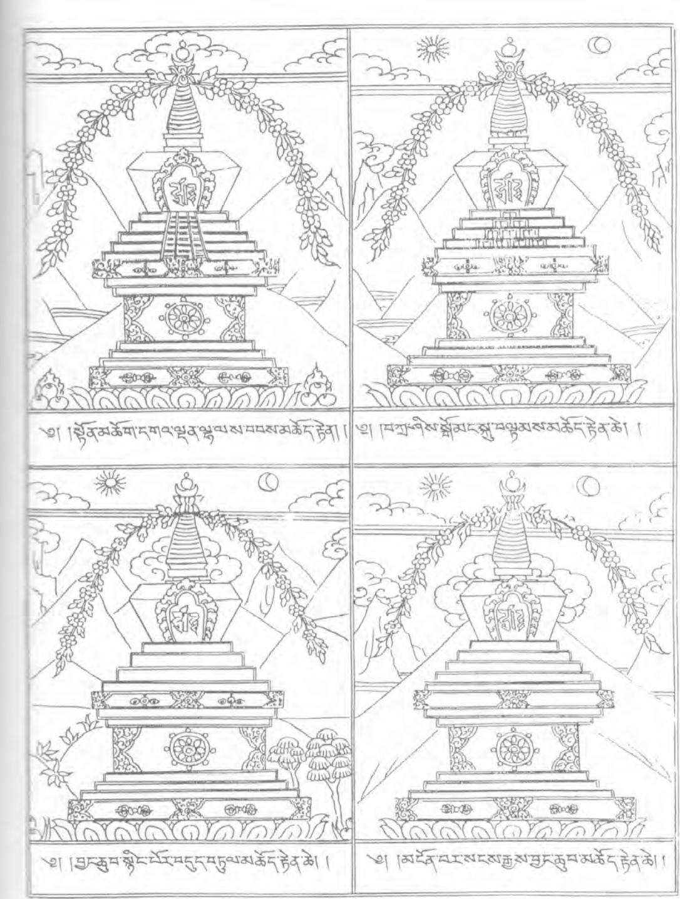

1. Drawings of four out of the eight great *caityas*.

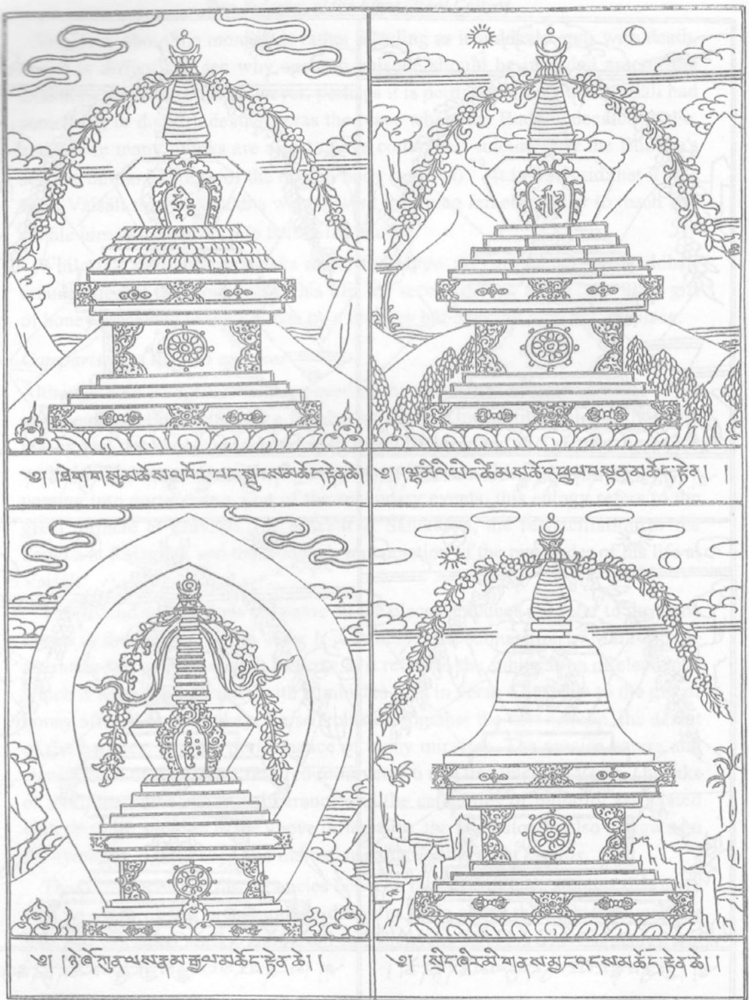

2. Drawings of four out of the eight great *caityas*.

perhaps he wanted to record two different traditions, which were known during his lifetime.

*The iconography of the eight caityas*

Some of the Tibetan sources on the Buddhist iconography contain a set of carved and blockprinted drawings of the eight great *caityas*. Each *caitya* has its own specific architectural design and a name indicative of its symbolic significance. In one such source, the eight *caityas* arc named as follows:42

- 1. The *caitya* of many auspicious gateways (epitomising) the Buddha's birth (*bkra shis sgo mang sku bltams mchod rten*).
- 2. The *caitya* of the victory over Māra on the seat of enlightenment (*byang chub snying por bdud btul mchod rten*).
- 3. The *caitya* of the perfect enlightenment (*mngon par sangs rgyas byang chub mchod rten*).
- 4. The *caitya* of the lotus-heap (epitomising) the proclamation of the three vehicles (*theg gsum chos 'khor pad spungs mchod rten*).
- 5. The *caitya* demonstrative of the miracles which gratify the gods and men (*lha mi'i yid tshim cho 'phrul bstan mchod rten*).
- 6. The *caitya* of the supreme teacher's descent from the Tuṣita gods (*ston mchog dga' ldan lha babs mchod rten*).
- 7. The *caitya* of the victory over all misadventures (*nye zho kun las rnam rgyal mchod rten*).
- 8. The *caitya* of the appeasement of existence and the *aprati*ṣṭ*hita-nirv*āṇa (*srid zhir mi gnas myang 'das mchod rten*).

The names of the eight *caityas* as given an the above list are clearly devised on the basis of the events which they commemorate. When one compares this list with the two eulogies, It is quite similar, but it does not precisely tally or correspond with the names or events given in the two eulogies. The sixth *caitya*, for instance, of this list is associated with the descent from the Tuṣita abode and not from the Trāyastriṃśa abode. Thus, it is possible that the above list might have been derived from different sources than those known or used by the author of the two eulogies.

* * *

<sup>42</sup> Lokesh Chandra, *Buddhist Iconography of Tibet*, Kyoto, Rinsen Book Co., 1986, vol. 2, pages 397– 98, numbers 1074–1081. Some of the sources dealing with these eight *caityas* are discussed in G. Tucci's Indo-Tibetica, vol. I, *mChod rten e tsha tsha*, Roma, 1932, 13–24.

*First Eulogy of the eight great caityas43*

Homage to Mañjuśrī Kumārabhūta

The foremost teacher of living beings was born at Lumbinī and lived in the city of Kapilavastu. Homage to the *caityas* of the Tathāgata adorned with ten million excellent qualities and jewels. (1)

He sat under the *bodhi* tree in the vicinity of the river Nairañjanā in Magadha. Homage to the great *caitya* of vast and excellent qualities, which became the support of enlightenment. (2)

At Vārāṇasī in Kāśī, he set in motion the Dharma-wheel and destroyed the obstructions of defilements (kleśa). Homage to the *caitya* epitomising the foundation of knowledge. (3)

At Śrāvastī, he destroyed the power of his adversaries, performed the great miracle in the Jetavana, and suffused the three worlds with perfect thoughts. Homage to the *caitya* at the place where he defeated the heretics. (4)

He descended from the abode of the gods in the excellent city of Sāṃkāśya where Brahmā and Indra worshipped his feet with their diadems. Homage to the *caitya* of worship by the thirty (-three) gods. (5)

In the Veṇuvana grove at Rājagṛha, the Teacher's śrā*vakas* were reconciled after a previously caused division within the Saṅgha. Homage to the *caitya* of benevolence. (6)

Through discarding the remainder of his bodily life, he blessed and delivered his bodily life. Homage to the *caitya* of blessing at Vaiśālī. (7)

At Kuśinagara, he inspired living beings to follow virtues. Homage to the *caitya* of *nirv*āṇa in the twin śāla grove of the Mallas. (8)

I bow down and pay homage to the eight *caityas* of Śākyamuni, and to all the *dharmak*āyas in the ten directions and all other places. May my mental flow become pervaded with merit white like mountain peaks. May I gain such merit on account of this homage to the Buddha's *dharmak*āya, which is naturally pure, free of characteristics and verbal expressions (*aprapañca*), and which pervades all living beings. May all living beings gain happiness, knowledge, and enlightenment.

<sup>43</sup> Nāgārjuna, Aṣṭ*amah*āsthā*nacaityastotra* / *gNas chen po brgyad kyi mchod rten la bstod pa*, Tibetan Tripiṭaka, Peking edition, vol. 46, 39.5.5–40.1.7. Considerably different translations of this and the next eulogy are included in P.C. Bagchi's article. "The Eight Great *Caityas* and their Cult", Indian Historical Quarterly, 15.2, 1941, 223–35.

# *Second Eulogy of the eight great caityas44*

First he raised the thought of enlightenment and accumulated the stock of merit for three countless aeons (asaṃ*khyeya*). Then he subjugated Māra and became a Buddha on the seal of enlightenment (*bodhima*ṇḍa). Homage to the *caitya* of the supreme enlightenment. (1)

He was born in the Śākya clan, from Ś uddhodana and his consort Māyā, in the city of Kapilavastu, the stronghold of the Dharma. When the body was born from the right side, it was received by Brahmā. Homage to the *caitya* of auspiciousness. (2)

He went on alms rounds in Vārāṇasī and other places, and subjugated the enraged elephants of Bimbisāra with the force of his fingernails. Homage to the *caitya* of subduing the city. (3)

When he was musing on a plot of green grass, Hanuman45 offered him honey. When Hanuman died at a well, he was born among the Thirty-three Gods. Homage to the *caitya* of arising compassion. ( 4)

He set in motion the wheel offered by Brahmā, overwhelmed with his power the six heretical teachers, and delighted the gods and men with many wondrous feats. Homage to the *caitya* of displaying wondrous feats. (5)

He was offered veneration by Nanda and other nāgas, given milk by a maiden, and the entire world was brought to an end. Homage to the *caitya* of victorious appeasement. (6)

He was surrounded by hosts of Bodhisattvas, Pratyeka Buddhas. śrā*vakas* and *arhats*. This circumstance epitomises an arrangement in terms of morality and vows. Homage to the *caitya* of purification. (7)

At the end of all his deeds, (starting) from the thought of converting all impermanent living beings, and (including) the descent from the gods, he received Cunda's food, and when the three months lapsed, he reached the end. Homage to the *caitya* of *nirv*āṇa. (8)

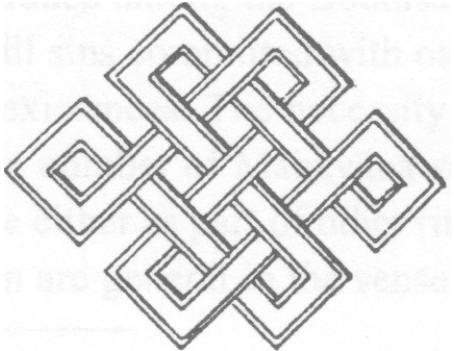

<sup>44</sup> Nāgārjuna, Aṣṭ*amah*āsthā*nacaityastotra* / *gNas chen po brgyad kyi mchod rten la bstod pa*, Tibetan Tripiṭaka, Peking edition, vol. 46, 40.1.7–3.1.

<sup>45</sup> Ha lu mañju.

The bimonthly recitation of the Prātimokṣa on the observance days (*uposatha*) is a long established practice, which was introduced during the lifetime of the Buddha. Whenever the rules of the Prātimokṣa are infringed, the offences should be confessed and amended in accordance with the directives specified in the Vinaya. The recitation of the Prātimokṣa essentially serves to maintain the purity (*pari*ś*uddhi*) of the Sangha, and also to guard and preserve an uninterrupted transmission of the monastic ordinations (*upasa*ṃpadā), which can only be conferred by the monks who are validly ordained, pure and free from all the disqualifying offences.

The offences against the Prātimokṣa rules count as offences when the rules are contravened through bodily or verbal actions. The intentional mental activities, which direct bodily and verbal actions, are certainly crucial in the process of committing offences, but as such, wicked deliberations or intentions alone do not become or count as offences within the context of the Prātimokṣa rules. This somewhat legalistic observance of the Vinaya rules in early Buddhism was not intended to undermine in any way the practice of morality, and the purification of the mind as part of the entire process of spiritual training leading to the state of *arhatship*. However, the mere external observance of the Vinaya rules has provided a ground for criticism by the Mahāyāna adepts, who placed a marked emphasis on the purity of the mind, and on the pure and well-motivated intentions. In Mahāyāna Buddhism, the confession of sins (pā*pade*śanā) is one of the standard exercises included among the Bodhisattva practices, and as such, it involves an admission of all sins committed with one's body, speech and mmd over the period of all one's existences. The necessity to confess and the way of confessing are explained in a number of Mahāyāna sū*tras*. 1 As a ritual activity, the confession of sins is done either as part of other rituals or as a separate ritual. Some formulas of confession are general in the sense that one confesses all sins

<sup>1</sup> e.g. *Suvar*ṇabhā*sottama*, chapter 3, trans. R.E. Emmerick, *The S*ū*tra of Golden Light*, London, 1970, 8–17. In his Śikṣā*samuccaya*, Śāntideva refers to several Mahāyāna sū*tras* in the section dealing with the Bodhisattva's purification from sins. Śikṣā*samuccaya*, trans. by C. Bendall & W.H.D Rouse, Delhi, 1971, 157–63. Chapter Two of Śāntideva's *Bodhicary*āvatāra deals with the confession of sins.

but without specifically naming them all one by one, and some formulas are more detailed and include lists of sins and transgressions. The actual act of confession is usually made before all the Buddhas and Bodhisattvas in general or before the Buddhas and Bodhisattvas residing in the ten directions. There also exists one ancient rite of confession, which is performed before thirty-five Buddhas. The basic formula of this rite and the names of the thirty-five Buddhas are given in the *Vinayavini*ś*caya* Upā*liparip*ṛcchā, 2 which is one of the important early Mahāyāna texts dealing With the Bodhisattva's morality. This sūtra teaches that all serious sins should be confessed individually day and night before a group of thirtyfive Buddhas, and it gives the following formula of confession:3

> "I, of such and such a name, take refuge in the Buddha, the Dharma, and the Sangha. Homage to Śākyamuni, Tathāgata, *arhat* and perfect Buddha. Homage to… (There follow the names of the remaining Buddhas). May I be remembered by these and all other Tathāgatas and perfect Buddhas, who abide in and sustain all the universes (*sarvaloka-dh*ātu). I confess all the sinful actions (pā*pakarma*) committed in this existence and in all previous existences evolved in saṃsāra from its timeless beginning; the sinful actions which I have committed, encouraged to commit or approved to commit; the acts of stealing, encouragement or approval to steal the property belonging to stūpas, local communities or the universal Sangha, the acts of the five heinous sins (ā*nantar*īya), which I have committed, encouraged to commit or approved to commit; the pursuit, encouragement or approval to pursue the path of the ten inauspicious deeds (daśākuś*alakarmapatha*); all the actions which induce rebirths in the hells, among animals, among tormented spirits (*preta*), among long-living gods, among barbarian peoples, with defective organs, with heretical views, and during the period without a Buddha.4 I condemn all such wicked actions in the presence of the Buddhas. I confess and reveal all my sins, and I promise not to commit them again."

The hymn addressed to the thirty-five Buddhas of Confession, which is translated below, is taken from a larger ritual text devised for making confession in their presence. Apart from the opening homage to Śākyamuni Buddha and the final praises, one stanza is dedicated to each of the thirty-five Buddhas; some texts add Amitābha to this group of thirty-five. The compositional structure of all

<sup>2</sup> P. Python, ed. & tr., *Vinayavini*ś*caya*-Upā*liparip*ṛcchā, *Enquête d'Up*ā*li pour une Exégèse de la Discipline*, Paris, Adrien-Maisonneuve, 1973.

<sup>3</sup> P. Python, *op. cit.,* 98. This formula is quoted in Śāntideva's Śikṣā*samuccaya*, *op. cit.*, 165.

<sup>4</sup> This is a list of the eight unfavourable conditions (akṣaṇa); Mahā*vyutpatti*, 2299–2306.

stanzas is the same. First, they paraphrase the names of the Buddhas and sketch their iconic forms, and then they indicate the range or sphere of their purificatory powers and the cosmic regions of their activities. Śākyamuni is the principal Buddha of this group of thirty-five Buddhas. The remaining Buddhas are allocated to one of the ten directions of the universe. Thus as a group, the thirty-five Buddhas of Confession epitomise the Buddhas of the ten directions. The Sanskrit names of the Buddhas are placed above the stanzas to which they refer. These names are taken from a Tibetan block-print5 in which they closely correspond to the names given in the translated hymn. In some sources, the names of several Buddhas are different from those given below.6

#### * * *

(12b)7 Touching with my head the pure dust on his feet, I bow with devotion before the Śākya-king, the lord, the Tathāgata, the *arhat*, the perfect Buddha, accompanied by his Vidyā and retinue, the blessed one, the knower of the world, the subduer of mankind, the supreme leader, and the unparalleled teacher of men and gods.

Śākyamuni

Salutation to the Best Guide Śākya-pinnacle, Golden in colour and touching the earth. Purifying the sins of myriads of aeons, He hallows the world and the universe.

Vajragarbha Salutation to the Subduer with the Vajra-essence, Blue in colour and grasping a *vajra* in his hands. Purifying the sins of ten thousand aeons, (13a) He hallows the primary sphere high in the sky.

Ralārcis

Salutation to the Jewel-radiance Dispelling Darkness, White in colour and holding a *vajra* and a sun. Purifying the sins of twenty-five thousand aeons, He hallows the jewel-realm in the east.

<sup>5</sup> Included in B.C. Olschak & T. Wangyal, *Mystic Art of Tibet*, London, 1973, 137–43.

<sup>6</sup> For instance: Santideva's Śikṣā*samuccaya*. *op. cit.*, 165–66; Lokesh Chandra, *Buddhist Iconography of Tibet*, vol. I, Kyoto, 1986, 86–95.

<sup>7</sup> The translation of this hymn is based on the liturgical text entitled *Byang chub ltung bshags kyi cho ga shin tu bsdus pa las sgrib rnam sbyong*, included in *Ritual and Liturgical Texts of the 'Bri gung bka' brgyud pa Tradition*. Reproduced from tracings of 'Bri gung blocks from sGang sngon Monastery by D. Tsondu Senghe, vol. II, Delhi, 1979.

Nāgeśvarāja

Salutation to the Perfect-sphere, the Serpent-king, Blue in colour and holding a nāga-tree and a serpent Purifying the sins of eight aeons,

He hallows the realm of the serpents in the south-east.

Vīrasena

Salutation to the Heroic-force Destroying All Discords, Golden in colour and holding a book and a sword. Purifying completely the sins of the speech, He hallows the intrepid realm in the south.

Vīranandin

Salutation to the Lustrous Champion of Dharma, Golden in colour and holding a sun and a lotus. Purifying completely the sins of the mind, He hallows the joyous realm in the south-west. (13b)

Ratnāgni

Salutation to the Jewel-fire, the Homa-performer, Red in colour and holding a blazing jewel at the chest. Purifying the sins of monastic discords, He hallows the radiant realm in the west.

Ratnacandraprabha

Salutation to the Jewel and Moon Brilliance Dispelling Darkness, White in colour and holding a jewel and a moon. Purifying the sins of one aeon, He hallows the luminous realm in the north-west.

Amoghadarśin

Salutation to the Invincible Leader and Master of Dharma, Green in colour and grasping two eyes in his hands. Purifying the sins of blasphemy against the noble ones, He hallows the realm of resounding drums in the north.

Ratnacandra

Salutation to the Jewel-moon, the Dispenser of Coolness, White in colour and holding a jewel and a moon. Purifying the inexpiable sin of matricide, He hallows the radiant realm in the east.

Vimala

Salutation to the Pure One, the Seer of Contemplation, (14a) Smoky in colour and grasping a mirror in his hands. Purifying the inexpiable sin of patricide,

He hallows the dust-realm below in the nadir.

Śūradatta

Salutation to the Illustrious Dispenser of Perfect Knowledge, White in colour and grasping a wealth-fruit in his hands. Purifying the sin of killing an *arhat*, He hallows the realm of abundance in the zenith.

Brahman

Salutation to the Unhindered and Pure Brahman, Golden in colour and holding a sun and a lotus. Purifying the sin of wounding the Blessed One, He hallows the eastern realm of obstructions.

Brahmadatta

Salutation to the Brahma-Gift and Many Heroes, Golden in colour and holding a sun and a moon. Purifying the sins of ten thousand aeons, He hallows the south-eastern realm free of afflictions.

Varuṇa

Hail to the Ocean-Master who removes misery and filth, Blue in colour and teaching the Dharma in the sphere of water. Purifying the sins of insulting *arhats*, He hallows the purity-realm in the south. (14b)

Varuṇadeva

Salutation to the Ocean-God who cleanses from impurities, White in colour and holding a mirror amidst waters. Purifying the sin of killing an enlightened being, He hallows the light-realm in the south-west.

Bhadraśrī

Salutation to the Splendid and Lustrous One of Perfect Discernment, Red in colour and holding a paradise-tree and a lotus. Purifying the sins of killing an illustrious teacher, He hallows the realm of the Tuṣita abode in the west.

Candanaśrī

Salutation to the Sandalwood-Splendour who dispels passions, Golden-red in colour and holding a fine sandalwood seed. Purifying the sins which bar people from becoming monks, He hallows the scent-realm in the north-west.

Anantaujas

Salutation to the Boundless Brilliance pervading all regions, Red in colour and holding a sun in each hand.

Purifying the sin of destroying stūpas, He hallows the brilliance-realm in the north.

Prabhāsaśrī

Salutation to the Naturally Glorious and Pure Light, White in colour and holding a light-beam in his hands. (15a) Purifying the sins arising from hatred, He hallows the invincible realm in the north-east.

Aśokaśrī

Salutation to the Effective Pacification of All Sins, Pale-blue in colour and holding an aśoka tree. Purifying the sins arising from desire, He hallows the unhindered realm in the nadir.

Nārāyaṇa

Salutation to Nārāyaṇa, the Matchless Warrior, Blue an colour and making the gesture of lotus and Meru. Purifying the sins of ten thousand aeons, He hallows the desire-free realm in the zenith.

Kusumaśrī

Salutation to the Blossom-Lustre, Golden in colour and holding a flower with a glory-fruit. Purifying the sins of one hundred thousand aeons, He hallows the eastern realm of blossoming flowers.

Brahmajyotis

Salutation to the Effulgent Brahma-Radiance, White in colour and holding a lotus blazing with light. (15b) Purifying the sins of one thousand aeons, He hallows the realm of Brahma in the south-east.

Padmajyotis Salutation to the Magic Lotus-Lustre, Red in colour and holding a sun and a lotus. Purifying the sins of seven aeons, He hallows the lotus-realm in the south.

Ghanaśrī

Salutation to the Mighty Splendour of Faith, Pale-red in colour and holding a gem in his hands. Purifying the sins arising from passions, He hallows the south-western realm of precious stones.

Smṛtiśrī Salutation to the Perfect Memory of Dharma, the guide of perception, Golden in colour and holding a lotus and a sword. Purifying entirely the sins of the body, He hallows the bright realm in the west.

Pankīrtitanāmaśrī

Salutation to the Majestic and Renowned Celebrity, Green in colour and holding his hands over his head. Purifying the sins of failing to delight the Buddhas, He hallows the nameless realm in the north-west.

Indraketudhvaja

Salutation to the Victory Banner of Indra, Golden in colour and holding a gem and a victory banner. Purifying the sans arising from jealousy, He hallows the realm of the clear senses in the north. (16a)

Suvikrānta

Salutation to the Chivalrous Hero, White in colour and making the earth-touching gesture. Purifying the sins of subverting the will of other people, He hallows the north-eastern realm of the creative forces.

Yuddhajaya

Salutation to the Conqueror of the Hostile Forces, Black in colour and holding a shield and a sword. Purifying the sins arising from arrogance, He hallows the unhindered realm in the nadir.

Vikrānta

Salutation to the Victorious Lord of Conquest, White in colour and making the gestures of protection and touching the earth. Purifying the sins caused by slanderous words, He hallows the realm of glory in the east.

Samantāvabhāsa

Salutation to the All-Pervading Brilliance, Golden in colour and holding a sun and a jewel. Purifying the sins of excessive jubilations, He hallows the southern realm of controlled thoughts. (16b)

Ratnapadma

Salutation to the Jewel and Lotus Victory, Red in colour and holding a jewel and a lotus. Purifying the sin of apostasy, He hallows the splendour-realm in the west.

Śailendrarāja Salutation to the True King the Himalayas, Pale-blue in colour and holding Meru in his hands. Purifying the sin of breaking the vows, He hallows the jewel-realm in the north.

The Champions of men, the Blessed Ones of the three times, Whatever your number in the ten directions of the universe, I praise you all with devotion With my body, speech and mind.

Bowing my body countless times again and again, I worship all the victorious Buddhas With the eloquent force of my versified prayers, And with the hearty dispositions of the victorious ones.

Just as the countless Buddhas Abide in the midst of the Buddha Sons, May, in the same way, the perfect spheres, I pray, become filled by all the Victorious Ones.

I utter the best attributes of the Victorious Ones, And extol all the Blessed Ones With the fathomless ocean of laudations Dispersing in harmony of manifold melodies.

Voicing all possible kinds of adorations, Countless as the dust particles of the earth, I prostrate my body in every direction, And offer praises with the deepest faith.

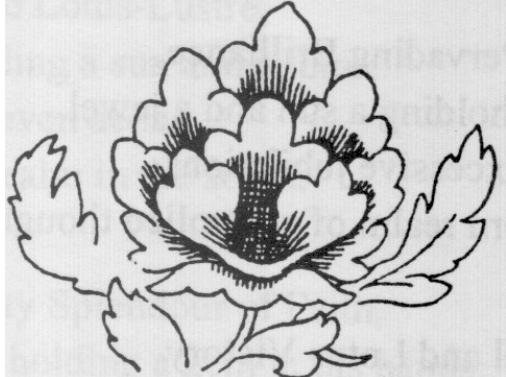

The ritual text translated here is for gratifying Vajravārāhī and different categories of ḍākinīs with offerings made of flour and called *bali* in Sanskrit and *gtor ma* in Tibetan. The work is entitled Ḍā *ki rnams gtor 'bul* and it was composed by a Tibetan master whose name is not recorded in the block-print used here as the basis for translation.

The is divided into seven integral parts, each part being dedicated to one specific category of ḍākinīs, some indigenous to Tibet, and some derived from in the Buddhist *tantras*. The compositional pattern and style of each part are practically the same in all instances. At the beginning, there is a short invocation in prose in which each group of ḍākinīs is summoned and invited to partake of the presented offerings, and then requested to perform certain beneficial activities. Next, there follows the main section which consists of versified praises. Like in many other *tantric* texts of this category, the verses mainly locus on the iconic representations, attributes and activities of each group of ḍākinīs. It is from these sections that one gains a fair amount of information about the nature and specific functions performed by the different categories of ḍākinīs. In the third and concluding section, the ḍākinīs are invited once again to partake of the offerings, and to perform their appropriate activities.

The goddess Vajravārāhī belongs to the category of the supreme female deities included in the pantheon of the Highest Tantra (*anuttarayogatantra*). She appears as a principal consort in a number of maṇḍ*alas* presided over by Cakrasaṃvara and other deities. She also presides over four maṇḍ*alas* of her own and has some seven iconic representations as an individual deity.1 In terms

<sup>1</sup> Sā*dhanam*ālā, ed. B.T. Bhattacharyya, 2 vols., Baroda, 1925 & 1928, numbers 217, 218, 219, 220, 224, 225, 226, 250, 251, 255. Niṣ*pannayog*āvalī, ed. B. Bhattacharyya, Baroda, 1972, English text 44, Sanskrit text 26. *Tibetan Ma*ṇḍ*alas, The Ngor Collection*, ed. M. Tachikawa & M PL. Green, Tokyo, Kodansha, 1983, (her own maṇḍ*alas*) 67, 81, 82, 83, (as a principal consort in other maṇḍ*alas*) 70, 71, 72, 73, 74, 76, 77, 78, 79, 80, 89, 112, 118, 122, 123, 126. See also M.T. de Mallmann, *Introduction d 1'iconographie du Tantrisme Bouddhique*, Paris, 1975, 425–29; "Notes d'iconographic tantrique IV: A propos de Vajravārāhī", *Arts Asiatiques*, tome 20, 1969, 21–40.

of the Buddhist doctrinal perceptions and interpretations, Vajravārāhī and the different categories of ḍākinīs, whether considered alone or in groups, represent either the principle of wisdom (*prajñ*ā) or the agents of specific types of activities. When they are engaged as consorts of the different male deities, they represent the principle of wisdom. When they act in accordance with their generic and natural dispositions, they serve as agents and messengers, who perform their assigned activities for the benefit of their devotees, and for the conversion of living beings. Disguised in various forms, and acting in different capacities, they execute their activities in accordance with the circumstances and the dispositions of the people with whom they interact. In addition to their assigned functions in the Buddhist *tantras*, the ḍākinīs also have a long but not unambiguous mythological history, which portrays them as a kind of mysterious and often blood-thirsty females living in haunted places or acting as companions of some fierce deities. Although a full study of the ḍākinīs, in terms of their mythological identity and their doctrinal dimensions, is still to be done, the present text does make a meaningful contribution towards a better understanding of their nature and function within the context of the Buddhist *tantras*.

The versified section of Part One projects a vision of the awesome and terrifying place inhabited by Vajravārāhī, who is identified as the tantric epitome of wisdom, and the mother who begot the Buddhas of the three times. As she stands at the centre of cosmic space, a whole series of ḍākinīs emanates spontaneously from her bodily parts, ornaments and implements. Each group of ḍākinīs epitomises a specific category of Buddha-activities performed in the realm of living beings. All ḍākinīs emerge with force and zest to execute the particular tasks assigned to them, and they pursue their activities without hesitation and in typically *tantric* ways. Although they appear terrifying, just as does their progenitive source, their essential identities and dispositions are rooted in emptiness and compassion, the ultimate sources of the true and effective ways of performing soteriological works.

As one reads down the verses, it becomes apparent that what we have here is basically a description of the iconic representation of Vajravārāhī. She has three faces, two hands and two legs. In her hands she holds her particular implements, and her naked body is covered with the ornaments characteristic of ḍākinīs. The ḍākinī emanations, which emerge from her body and ornaments, express particular aspects of her transcendent nature, and the scope of her activities in the world. The entire description of the various ḍākinī manifestations can be understood here in two different ways. One can see them either as expressions of Vajravārāhī's own identity and the sphere of her activity, or as emanations and messengers of Buddha activities in female forms. Taken together, they epitomise the transcendent unity and phenomenal diversity of tantric manifestations and activities.

Part two addresses the ḍākinīs of the heavenly region, who are depicted as manifestations evolved from the absolute sphere. This group of ḍākinīs is associated with the different Buddha families. Their bodily colours correspond to the colours of their appropriate Buddha families, and they perform their activities in conformity with the basic character and function of the Buddha families which they appertain.

Part Three focuses on the ḍākinīs associated with the twenty-four excellent places (pīṭha) The verses do not provide the names or descriptions of those places, but focus on the activities of the ḍākinīs affiliated with them. Here we have three major groups of ḍākinīs. The first group of ḍākinīs appears as toothless old women clad in the so-called graveyard attires.2 Their complexion is dark and their bodies are smeared with blood and ashes. Although their appearances are most unattractive, they are said to be the messengers of the true Dharma. The second group has the appearance of young women, who are portrayed as consorts of the different Buddha families. Their fundamental character and activities are very much similar to those of the ḍākinīs described in Part Two, although they seem to function on a different level. The third group includes the ḍākinīs who perform a whole range of beneficial activities in the guise of ordinary women. The unconventional ways in which they pursue their activities are rather scandalous to those who adhere to conventional morality. However, within the context of the *tantric* perceptions and teachings, they execute their appropriate tasks with utter determination and efficiency.

Part Four is addressed to the ḍākinīs of this world, who live in graveyards and frequent crowded places. Their function appears to be somewhat negative and malevolent as they inspire terror and disturb people's meditation. However, once they are properly gratified, they too can perform beneficial works.

The ḍākinīs in Part Five are associated with the eight dreadful graveyards. As in the previous part, one does not gain much concrete information about their specific character. They seem to form a group of their own simply because their activities are pursued in the grounds of the eight dreadful graveyards.

The twenty-eight ḍākinīs in Part Six are divided into four groups of seven. They come from the four cardinal directions in accordance with their positions in the maṇḍala of the Wrathful Deities. Their activities are described here in terms of the four ritual activities known as the Four Rites (*las bzhi*), namely the rites of appeasement, prosperity, subjugation, and destruction.3

<sup>2</sup> There are eight graveyard attires (śmaśānacī*vara* / *dur khrod kyi chas*): 1. head-dress of human skull,

<sup>2.</sup> necklace made of human skulls, 3. upper garment made of elephant skin, 4. lower garment made of tiger skin, 5. mat made of flayed human skin, 6. markings of grease on the face, 7. spot of blood between the eyes, 8. spots of ashes on the body.

<sup>3</sup> For the Four Rites see the *Jyotirmañjar*ī of Abhayākaragupta included in this issue.

The final part is concerned with the twelve brTan mas, who are indigenous to Tibet. Originally, they were malignant spirits who were converted and assigned a new function to serve as guardian goddesses of Buddhist teachings.

* * *

# *I. Vajrav*ārāhī *and her retinue4*

(1b) Oṃ Āḥ Hūṃ. Having come to the place of offerings with the *tormas* (*gtor* ma) adorned with sacred articles, blessed and sealed with the live kinds of flesh5 and the live ambrosias6 , and having partaken of this oblation, O divine hosts of the chosen deity rDo rje phag mo (Vajravārāhī) together with your retinue, I beseech you to eliminate all the hindrances of inner and outer factors and to bestow completely the highest and the ordinary accomplishments.

> Hūṃ *Bhyo* Far far away, far over there, In the direction of the setting sun, To the north-west of Bodhgaya, (2a) In the dreadful graveyards of the Orgyan country, All mountains are mountains of bones, All trees are arrows and bows, All waters are blood and pus, All sounds are sounds of weeping. The fearful abode of Vajrapāṇi, Which the ten wrathful ones7 do not dare to cross The residence of the Buddhas of the live families. 8 Whoever lives there and who does not, The mother who begot the Buddhas of the three times,

<sup>4</sup> The translation of the Ḍā *ki rnams gtor 'bul* is based on a blockprint acquired in Nepal. Originally this translation was published under the title of "In Praise of the Ḍākinīs" in S. Karmay & Ph. Sagant, *Les Habitants du Toit du Monde*, Nanterre, Société d'Ethnologie, 1997, 309–24.

<sup>5 <</sup>i>pañcamāṃsa / *sha lnga*: human, elephant, horse, dog and cow.

<sup>6 <</sup>i>pañcāmṛta / *bdud rtsi lnga*; semen, blood, urine, flesh, excrement. In some sources the five amṛtas are referred to as the five products of the cow (milk, butter, curds, urine, dung), and in some sources they are given as milk, curds, butter, sugar and honey.

<sup>7</sup> The names of the ten wrathful deities (daś*akrodha*) are not identical in different sources. In the *Dharmasa*ṃ*graha* they are given as Yamāntaka, Prajñāntaka, Padmāntaka, Vighnāntaka, Acaraṭarkirāja, Nīladaṇḍa, Mahābala, Uṣṇīṣacakravartin, Saṃbharāja. *The Dharmasa*ṃ*graha, An Ancient Collection of Buddhist Technical Terms*, prepared by Kenjiu Kasawara and edited by F. Max Müller & H. Wenzel, Oxford, The Clarendon Press, 1886. For other lists, see such sources as Sā*dhamam*āla or Abhayākaragupta's Niṣ*pannayog*āvalī. 8 Tathāgata-, Vajra-, Padma-, Ratna-, and Karma-family (*kula*).

rDo rje phag mo, she resides in that place, And her attendant goddesses reside with her (2b)

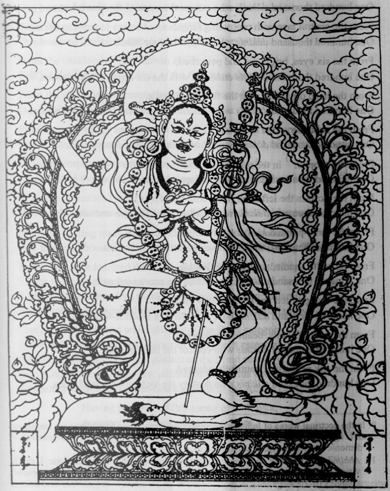

3. Drawing of Vajravārāhī

From her right sow-face, black and wrathful, One hundred thousand ḍākinīs of the changeless and perfect sphere.

From the left wrathful face, red and lustrous, One hundred thousand ḍākinīs who pursue the work of the blessed ones.

From the central face with protruding fangs, One hundred thousand ḍākinīs who defeat the four Māras.9

From the six eyes, bright red and perturbed, One hundred thousand ḍākinīs endowed with the six supernormal powers.10

From the head ornament with the five dried skulls, One hundred thousand ḍākinīs who benefit beings through the five families.

From the shimmer of the hair on her back, One hundred thousand ḍākinīs who shower the rains of compassion.

From the chopper11 in the right hand raised towards the sky, One hundred thousand ḍākinīs who kill and slaughter.

From the skull in the left hand filled with blood, (3a) One hundred thousand ḍākinīs who scatter blood, disease and colic.

From the three-pointed khaṭvāṅga beautifully adorned, One hundred thousand ḍākinīs who control the three worlds.

From its white handle, straight and flexible, One hundred thousand ḍākinīs who defeat the *asuras* in battle.

From the five-pointed *vajra* beautifully adorned, One hundred thousand ḍākinīs pure with the five Buddha-wisdoms.12

From the tiara of skulls, beautifully adorned, One hundred thousand ḍākinīs who control the three worlds.

From the silk pennants, beautifully adorned, One hundred thousand ḍākinīs who destroy the victory-banner of Māra.

<sup>9</sup> In the doctrinal worlds of Indian masters such as Asaṅga, the four Māras are interpreted as 1. aggregates (*skandham*āra), 2. defilements (kleśamāra), 3. death (mṛ*tyum*āra), 4. 'demonic' manifestation (*devaputram*āra).

<sup>10 <</sup>i>Abijñā. The first five *abhijñ*ās are mundane and the sixth is supramundane: 1. Divine vision (*divyacak*ṣu); 2. divine hearing (*divya*ś*rotra*); 3. knowledge of other people's thoughts (*paracittajñ*āna); 4. remembrance of previous lives (pū*rvaniv*āsā*nusm*ṛti-jñāna); 5. knowledge of magic powers (ṛ*ddhividhijñ*āna), 6. knowledge of the destruction of the ā*sravas* (ā*sravak*ṣ*ayajñ*āna).

<sup>11</sup> Sanskrit *kart*ṛkā. Tibetan *gri gug*. 12 1. wisdom of the pure absolute (*suvi*ś*uddhadharmadh*ā*tujñ*āna); 2. mirror-like wisdom (ādarś*anajñ*āna); 3. discriminating wisdom (*pratyavek*ṣaṇajñāna); 4. wisdom of sameness (*samat*ājñāna); 5. active wisdom (kṛtyānuṣṭhā*najñ*āna).

From the drum adorned with little golden bells. One hundred thousand ḍākinīs who uphold the precepts of oral tradition.

From the ambrosia-vase, beautifully adorned, One hundred thousand ḍākinīs of boundless excellent qualities.

From the patterns of crossed *vajras*, (3b) One hundred thousand ḍākinīs of unimpeded activities.

From the necklace of fifty human skulls, One hundred thousand ḍākinīs of the fifty pure elements.

From the six bone-ornaments, beautifully adorned, One hundred thousand ḍākinīs perfect in the six perfections.13

From the play of her naked dance, one limb flung out and one drawn in, One hundred thousand ḍākinīs endowed with the grace of Tuṣita Heaven

From the corpse of non-cognition on which she treads, One hundred thousand ḍākinīs who save from the six places of rebirth.14

From the pedestal of lotus and sun, One hundred thousand ḍākinīs who adhere to wisdom and means.

From the blazing mass of fire of the universal conflagration,15 One hundred thousand ḍākinīs who destroy various doubts by fire.

To the east, one hundred thousand ḍākinīs of the Vajra family. To the north, one hundred thousand ḍākinīs of the Karma family. (4a) To the west, one hundred thousand ḍākinīs of the Padma family. To the south. one hundred thousand ḍākinīs of the Ratna family.

One hundred thousand white ḍākinīs of the Body category. One hundred thousand red ḍākinīs of the Speech category One hundred thousand black ḍākinīs of the Mind category One hundred thousand yellow ḍākinīs of the Virtue category One hundred thousand green-black ḍākinīs of the Action category.

> Having partaken of this *torma* of ambrosia, Accomplish various efficacious deeds, Increase knowledge of those who are worthy, Inspire devotion in those who are unworthy,

<sup>13</sup> There are six principal and four subsidiary perfections (parāmitā): 1. Generosity (dāna); 2. morality (śīla); 3. forbearance (kṣānti); 4. heroism (vīrya); 5. meditation (dhyāna); 6. wisdom (*prajñ*ā), 7. skilful means (upāya or upā*yakau*ś*alya*); 8. resolution (praṇidhāna); 9. power (*bala*): 10. knowledge (jñāna).

<sup>14 1.</sup> gods (*deva*), 2. demigods (*asura*), 3. humans (*manu*ṣya). 4. animals (*tiryagyoni*), 5. tormented spirits (*preta*), 6. hell-beings (*naraka*).

<sup>15</sup> This refers to the dissolution and destruction of the world by fire at the end of time.

Eliminate harmful enemies and hindrances.

*II. Exhortation to the* ḍākinī*s of the heavenly region*

Oṃ Āḥ Hūṃ. Having come to the place of offerings with the *torma* adorned with sacred articles, blessed and sealed with the five kinds of flesh and the five ambrosias, and having partaken of this oblation, O ḍākinīs of the heavenly region, one hundred million strong, I beseech you to pacify all the hindrances of inner and outer (4b) factors, and to bestow completely the highest and the ordinary accomplishments.

#### Hūṃ *Bhyo*

From the heavenly region, the realm of great joy, One hundred million ḍākinīs of knowledge: Ḍākinīs of the Vajra, the subduers of Māra, Ḍākinīs of the Ratna, the champions of the perfections, Ḍākinīs of the Padma, the epitomes of great bliss, Ḍākinīs of the Karma, the masters of performance.

All of them are awesome like this: The colours of their bodies are different, They are white, golden, red or green. Some are like a deep blue sky, Some are like a pale blue sky.

The objects held in their hands are different: Some hold choppers and skulls of blood, Some hold khaṭvāṅgas and little bells, Some hold warlike weapons, Some hold vases of ambrosia, (Sa) Some hold beautiful flowers.

Their bodies are graced with the five requisites of graveyards. Their girdles adorned with sets of bells, The gentle sound of which is that of *si li li.* Their head-dresses consist of silk diadems, Moved by the wind, they resound *pu ru ru*. Their feet endowed with the *vajra*-steps, Unimpeded in the sky, they swerve and wave. Their delicate hands adorned with bracelets, Enacting various dances, they hasten and jump.

Having partaken of this *torma* of ambrosia, Accomplish various efficacious deeds, Advance the knowledge of those who are worthy, Inspire devotion in those who are unworthy,

Eliminate harmful enemies and hindrances.

*III. Exhortation to the* ḍākinī*s of the twenty-four excellent places*16

Oṃ Āḥ Hūṃ. Having come to the place of offerings with the *torma* adorned with sacred articles, blessed and sealed with the five kinds of flesh and the five ambrosias, and having partaken of this oblation, (5b) O ḍākinīs and the heroines of the twenty-four places, I beseech you to eliminate all the hindrances of inner and outer factors, and to bestow completely the highest and the ordinary accomplishments.

## Hūṃ *Bhyo*

From the twenty-four excellent places, The twenty-four foremost ḍākinī ladies. Attended by a host of ten million ḍākinīs, The heroines reside in the invisible space Their entourage consists of one hundred million ḍākinīs.

## *Bhyo*

Some are women black in colour, Wearing the requisites of decomposed corpses, Stained with spots of grease and blood, Smeared with human ashes, they are pale blue, With their grey hair bound up at the back, Their head-dresses are made of dead flowers, Their toothless mouths laugh with ha ha, Their feet move with staggering paces. Though displaying such appearances, They manifest the true Dharma to the worthy ones. One becomes initiated by merely encountering them. (6a)

Having partaken of this *torma* of ambrosia, Accomplish various efficacious deeds, Grant a way of life free of anxieties, Bestow trouble-free enjoyments.

*Bhyo*

Some are women full of youth, Adorned with various ornaments,

<sup>16</sup> These are the twenty-four sacred places mentioned in different *tantras*. They are generally referred to as pīṭhas, but often they are further divided into subgroups. The names and the number of these places are not consistent in different texts. Frequently, the various lists provide the names of more than twenty-four places. For a discussion and a list of the twenty-four places see, G. Tucci's *lndo-Tibetca*, III.2, 38–45. See also *The Sa*ṃ*varodaya-tantra*, Selected Chapters, ed. & trans. by S. Tsuda, Tokyo, The Hokuseido Press, 1974, Chapter 7.

Marked with the colours of each family, They duly perform the works of their families.

Some are beautiful with shades of white, They are the partners of the Vakra family, They inspire towards enlightenment

Some are yellow-white full of splendour, They are the partners of the Ratna family, They inspire towards the highest achievements.

Some are red and of beautiful physique, They are the partners of the Padma family, They inspire towards happiness free of afflictions.

Some are pale blue with angry faces, They are the partners of the Karma family, They inspire to benefit every living being.

Some are like the blue sky with whitish fringes, (6b) They are the partners of the Tathāgata family, They inspire towards the highest truths.

All of them are awesome like this. Their beautiful faces radiate with majesty, Their bodies are full of vigour, Their heads adorned with Jewel crowns, They clasp their hero partners, Their waists are adorned with little golden bells, Which, when pressed to their bodies, sound *sil sil*.

Their countenances are possessed of lotus teeth, Their gentle utterances resound in harmony, Their soothing voices sound with the melody of Brahmā, As they sing the *vajra*-song of highest delight

Having partaken of this *torma* of ambrosia, Accomplish different efficacious deeds, Bring happiness to polluted bodies, Increase experience in unpolluted minds.

#### *Bhyo*

Some have the form of quite ordinary women. Of the different worldly occupations, There is not one they do not perform. (7a)

Some are interpreters who know the Dharma, They transform the hue of ordinary knowledge. Some act crazily selling intoxicating drinks They make nonsense of false knowledge.

Some copulate, for they are prostitutes, They bring together wisdom and means.

Some are cleaners and washerwomen, They purify the residues of impurities.

Some are killers and murderesses, They do their killing in the minds of false views.

Some are hurtful thieves, They bring others' minds under their control.

Some perform austerities, they are the brāhmaṇis, They cut off the flow of worldly existence.

These and many others, the endless hosts, To the south of Meru in Jambudvīpa, From the twenty-four excellent places, You come for the benefit of living beings. Using numerous and various devices, You convert by means of different actions.

Partake of this *torma* of ambrosia, (7b) And since you are not fixed to one kind of action, Let there be spontaneous success for us *yogins*, For those who are making invocations, For those who are immersed in the eight worldly affairs,17 And for all living beings everywhere.

## *IV. Exhortation to the* ḍākinīs *of this world*

Oṃ Āḥ Hūṃ. Having come to the place of offerings with the *torma* adorned with sacred articles, blessed and sealed with the five kinds of flesh and the five ambrosias, and having partaken of this oblation, O flesh eating ḍākinīs of this world, I beseech you to eliminate all the hindrances of inner and outer factors, and to perform the efficacious deeds.

> Hūṃ *Bhyo* From terrifying and dreadful graveyards, The ḍākinīs of this world, powerful and mighty, Awesome and ghastly appearances, Female bodies with dreadful faces.

<sup>17</sup> aṣṭ*alokadharmas* / *'jig rten chos brgyad*: gatn, loss, pleasure, pain, fame, defamation, praise, blame.

They hold skulls and drink plenty of blood, Devour human corpses and whistle songs, (8a) Disturb meditation and roam about crowded places. All of them without exception, Having partaken of this *torma* of the order, Let them in accord with their sacred bonds, Protect the pledge and perform the efficacious deeds.

#### *V. Exhortation to the* ḍākinī*s of the eight dreadful graveyards*

Oṃ Āḥ Hūṃ. Having come to the place of offerings with the *torma* adorned with sacred articles, blessed and sealed with the five kinds of flesh and the five ambrosias, and having partaken of this oblation, O ḍākinīs and mistresses of the eight projected dreadful graveyards, I beseech you to pacify all the hindrances of inner and outer factors, and to perform the efficacious deeds.

#### *Bhyo*

O delightful ones in the abode of lasting freedom. Within encompassed by the *vajra*-enclosure, Without stand the incomparable palaces. You reside in the eight great graveyards: gTum drag can and Tshang tshtng 'khrigs, 'Uru 'uru 'bar and 'Jigs su rung, (8b) Ha ha rgod and Kila sgrogs, Mun pa mi bzad and Nags tshal che.18

O eight mothers, you are the mistresses of the dreadful graveyards, With wrath you hold choppers and skulls of blood, Your bodies contracted on the left and flung out on the right. O mothers with your entourage of hundreds of thousands, Having partaken of this *torma* of the bond, Perform the efficacious deeds entrusted to you.

#### VI. *Exhortation to the twenty-eight* īśvarīs 19

Oṃ Āḥ Hūṃ. Having come to the place of offerings with the *torma* adorned with sacred articles, blessed and sealed with the five kinds of flesh and the five ambrosias, and having partaken of this oblation, O twenty-eight īśvarīs, I

<sup>18</sup> In the 17th chapter of the Saṃ*varodaya-tantra* the eight dreadful cemeteries (aṣṭaśmaśāna) are described as part of the maṇḍala. Their Sanskrit names are given as follows: Caṇḍogra, Gahvara, Vajravālā, Karaṅkin, Aṭṭahāsa, Lakṣmīvana, Ghorāndhakāra, Kilikilārava. *The Sa*ṃ*varodaya-tantra*, *op. cit.*, 123.

<sup>19</sup> The twenty-eight īśvarīs (Tib. *dbang phyug ma*) are included in the group of the Wrathful Deities described in the so-called *Tibetan Book of the Dead*. One such list can be found in Detlef Ingo Lauf, *Secret Doctrines of the Tibetan Books of the Dead*, Boulder & London, Shambhala, 1977, 150–52.

beseech you to pacify all the hindrances of the inner and outer factors, and to perform the efficacious deeds.

## *Bhyo*

Seven ḍākinīs come from the east, Six abide in the knowledge-sphere, One acts as the consort of Means, She is the ḍākinīs of the Vajra family in the east. (9a) Come here, partake of the adorned *torma*, And perform the pacifying rite.

#### *Bhyo*

Seven ḍākinīs come from the south, Six abide in the knowledge-sphere, One acts as the consort of Means, She is the ḍākinī of the Ratna family in the south. Come here, partake of the adorned *torma*, And perform the rite of prosperity.

## *Bhyo*

Seven ḍākinīs come from the west, Six abide in the knowledge-sphere, One acts as the consort of Means, She is the ḍākinī of the Padma family. Come here, partake of the adorned *torma*, And perform the rite of subduing.

# *Bhyo*

Seven ḍākinīs come from the north, Six abide in the knowledge-sphere, One acts as the consort of Means, She is the ḍākinī of the Karma family. (9b) Come here, partake of the adorned *torma*, And perform the wrathful rite. Obedient to the orders of Vajradhara, O īśvarīs, the twenty-eight mothers, Having partaken of this *torma* of the orders, Perform the four rites one by one.

# *VII. Exhortation to the twelve brTan mas*

Oṃ Āḥ Hūṃ. Having come to the place of offerings with the *torma* adorned with the sacred articles, blessed and sealed with the five kinds of flesh and the five ambrosias, O twelve Vajra brTan mas who protect the realm of Tibet, you twelve protectresses or twelve Ya mas, together with your servants and

attendants, partake of this oblation, avert all lust, anxiety, contagious diseases, plagues, epidemics, inauspicious times, famine, wars and quarrels, and perform the efficacious deeds.20

> *Bhyo* Drink blood together with these oblations, (10a) And so come here in your ethereal bodies. Come here protectresses, come here, Fulfil the pledge and perform the deeds.

bDag nyid chen mo, rDo rje Kun grags ma, dPal ldan lha ri, rDo rje g.Ya' ma skyong, Gangs kyi yum chen, rDo rje Kun bzang, 'Brog chen 'khor 'dul, rDo rje bGegs kyi gtso— O great demonesses, the four of you, Clad in many pendulous ornaments, Surrounded by your entourage of slaves and servants, Come here, fulfil the pledge and perform the deeds

Gangs dkar sha med, rDo rje dPal dang ldan, Kha rag khyung btsun, rDo rje dPal gyi yum, rMa n rab 'byams, rDo rje Drag mo rgyal, gSer chen mkha' lding, rDo rje Klu mo rgyal— O great yakṣasīs, the four of you, Clad in many pendulous ornaments, (10b) Surrounded by your entourage of slaves and servants, Come here, fulfil the pledge and perform the deeds

Kong btsun de mo, rDo rje Bod khams skyong, bTsan la lo ro, rDo rje sMan gcig ma, sMan btsun 'ug chos, rDo rje g.Yar mo bsil, g.Yu'i dril bu, rDo rje Zu le ma— O great medicinal ladies, the four of you, Clad in many pendulous ornaments, Surrounded by your entourage of slaves and servants, Come here, fulfil the pledge and perform the deeds.

Previously during the first world age, At the time of calling from the Indian land, The great teacher Padmasambhava, And his friend Glang chen dpal seng ge,

<sup>20</sup> The Twelve brTan mas are described in René de Nebesky-Wojkowitz, *Oracles and Demons of Tibet, The Cult and Iconography of the Tibetan Protective Deities*, s'Gravenhage, Mouton & Co., 1956, 181–98.

Gave you the control over vast territories, Endowed you with secret *vajras*, And bestowed upon you names of liberation. For the sake of averting all illnesses, Contagious diseases and epidemics, Partake of this oblation of the order, (11a) And accomplish the deeds entrusted to you.

#### *Clasping the hands*

*Bhyo Bhyo*, avert, avert, avert plagues, avert diseases, avert epidemics, smut, frost, hail, these three, inauspicious times, famine, bad omens in the day-time and evil dreams in the night, all these, fierce enemies, yakṣas and wicked demons. To all of them, death! Let them die! *Bhyo Bhyo*, avert, avert. I beg you to perform the works of averting (evil) and converting (people).

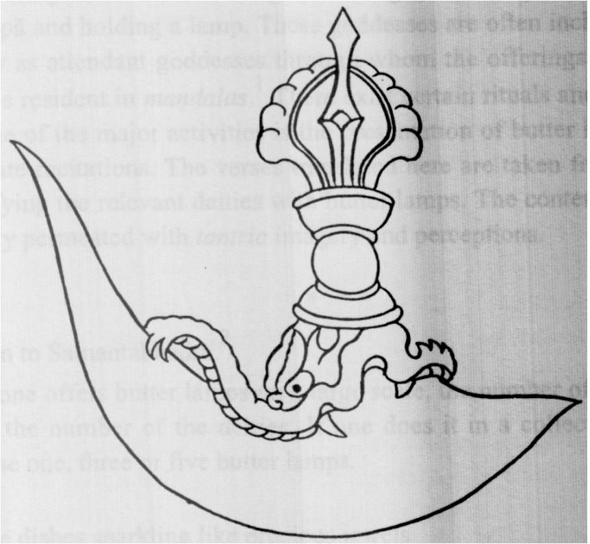

Butter or oil lamps are used in all Buddhist traditions as items of worship and veneration, which are placed around stūpas or on altars in front of Buddhist images. In *tantric* rituals, the butter lamps constitute one of the seven standard offerings, which are presented to the deities with appropriate recitations. This group of seven offerings includes: two kinds of water, one for the face (*argha*) and one for the feet (pādya), flowers (puṣpa), scent (*gandha*), incense (dhūpa), lamps (dīpa or ā*loka*), and food (*naivedya*). Sound (ś*abda*) is often added to make up a group of eight offerings. There also exists a group of eight goddesses who personify and hold these eight offerings, including the goddess of light called Dīpā and holding a lamp. These goddesses are often included in different maṇḍ*alas* as attendant goddesses through whom the offerings are presented to the deities resident in maṇḍ*alas.*1 There exist certain rituals and festivals during which one of the major activities is the presentation of butter lamps along with appropriate recitations. The verses translated here are taken from a short ritual for gratifying the relevant deities with butter lamps. The content of these verses is strongly permeated with tantric imagery and perceptions.

* * *

Salutation to Samantabhadra.2

When one offers butter lamps on a large scale, the number of lamps should be equal to the number of the deities. If one does it in a collective manner, one should use one, three or five butter lamps.

> Hūṃ These dishes sparkling like precious jewels Overflow with the best ambrosia of human fat and grease. These lamps, radiant and refulgent,

<sup>1</sup> More information about the offerings and the goddesses of offerings can be found in the relevant

sections of the next contribution to this issue, which deals with the three types of sā*dhana*. 2 Mar *me'i skong bshags kyi bkol byang*, included in *Rin chen gter mdzod*, volume Cha, 85, published in Paro, Bhutan, 1976.

Destroy with their lustre the mass of darkness. I fill and gratify with them the hearts Of the divine host of the three root deities.

These dishes of my bodily form and colour Overflow with the liquid of my blood and bones. These lamps of radiance and emptiness Kindle the bright lamps of the five senses. I fill and gratify with them the hearts Of the ḍākinīs of the Vidyādhara assembly.

These dishes of my speech's subtle channels Overflow with the liquid of my inner winds. These bright lamps emulating the lustre of emptiness Kindle the bright lamps of speech and sound. I fill and gratify with them the heart Of the chosen deity of my tradition.

These dishes of my steady mind as the firm semen Overflow with the liquid of selfishness and discursive thoughts. These bright lamps of knowledge and emptiness in one Kindle the lamps of the perfect self-knowledge. I fill and gratify with them the heart Of the *guru* of the Vidyādhara assembly.

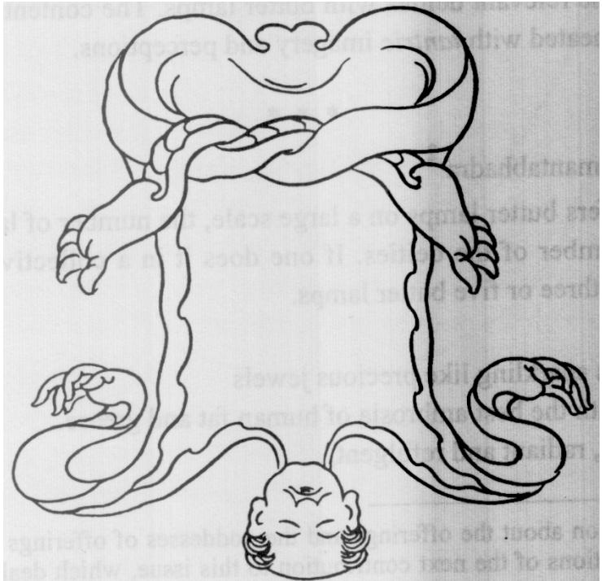

Sā*dhana*, often translated as evocation, coercion or visualisation, constitutes one of the principal meditational and ritual devices invented and employed in the Buddhist *tantras* Broadly speaking, the basic concept and structure of sā*dhanas* consist in visualising one deity or a group of deities. In the first instance, one creates a mental image of the particular deity in conformity with its iconic representation as explained in its sādhana text. This image is called the pledge-being (*samaya-sattva*) or the pledge-deity (*samayadevat*ā), and it represents a visionary mental representation of the deity, which is comparable to the eidetic images produced during the *kasi*ṇa meditation. Next, one recites the deity's seed syllable (bīja or hṛ*daya*) and summons the corresponding representation called the knowledge-being (jñāna-sattva) or the knowledge-deity (jñā*nadevat*ā) from the sphere of emptiness perceived as luminosity. The iconic appearance of the knowledge-being is identical to the mentally projected image of the pledge-being. However, it is not a mere vision, but essentially, so far as the meditator is concerned, a true and potent aspect of the deity. One welcomes the knowledge-being and then merges it with the pledge-being. Once the two beings are fused together into one indistinguishable union, which is often compared to water mixed with water, one is confronted with a fully perfected deity with whom one can interact in a variety of ways as specified in ritual and meditational texts. In the *tantras*, the visualised deities or maṇḍ*alas* constitute and function as expedients, in a comparable way to the Mahāyāna expedients (upāya), through which one perfects oneself and performs the activities for the benefit of all living beings. The effectiveness and efficacy of the meditational activities performed during sā*dhana*s for one's own and other people's benefit, and of the tantric rituals performed externally, essentially depend on the engagement and operation through the visualised deities.

In some works on tantric meditation, the visualisation of deities is equated with the ś*amatha* meditation, and the meditation on the perfected awareness of reality as understood in the *tantras* with the *vipa*śyanā meditation. 1

!!!!!!!!!!!!!!!!!!!!!!!!!!!!!!!!!!!!!!!!!!!!!!!!!!!!!!!

<sup>1</sup> Bhāvanāyogāvatāra / *rNal 'byor sgom pa la 'jug pa* by Kamalaśīla, Tibetan Tripiṭaka, Peking edition, vol. 102, 42.1.5–5.4.

When sā*dhanas* are performed as meditational devices, one aims to perfect one's own spiritual progress, and when sā*dhanas* are executed as the central component of *tantric* rituals, the ritual performer aims to achieve all kinds of mundane and transcendent benefits and attainments.

When one performs sā*dhana*s as meditational exercises in order to perfect one's mental dispositions, and to advance one's progress towards the state of liberation, one interacts with one deity or many deities through a whole range of meditational devices in an attempt to acquire their attributes, powers and identity. The ultimate goal is to achieve a union with the visualised deities, and thus to assume a status equal to them. The Mahāyāna teaches that all living beings possess the seed of buddhahood, which should be cultivated and purified in the form of *bodhicitta*. In the *tantras*, this seed of buddhahood is transformed into visionary images of enlightened deities and Buddhas with whom one identifies oneself. Ultimately one identifies oneself with one's own buddhahood inherent within oneself. However, while the Buddhas represent perfected manifestations of buddhahood, the meditator and all unenlightened living beings need to purify their inherent buddhahood. Thus, just as in the Mahāyāna, the *bodhicitta* is progressively purified and perfected through various exercises such as the practice of the six perfections, in the same way in the *tantras*, one perfects one's inherent buddhahood through visualised deities through whom one progressively frees oneself from saṃsāric imperfections and bonds, and eventually transforms oneself into a perfected Buddha. Although in sā*dhanas* one worships and identifies oneself with the visualised deities, ultimately one worships oneself and asserts one's inherent buddhahood.

When one employs sā*dhanas* in ritual performances, one summons the deities, and then engages their powers, mostly through worship and praises, to accomplish their assigned functions and to bestow the desired benefits and attainments.

At the end of meditational exercises, or at the completion of externally performed rituals, one dissolves the mental images of the visualised deities. The knowledge-beings are requested to depart and proceed to the primordial sphere of emptiness, and the pledge-beings are dissolved into light or within one's body.

There are three major types of sā*dhanas*, namely self-generation or visionary selfperception as a deity, visualisation of deities in a vase, and visualisation of different groups of deities arranged in maṇḍ*alas* positioned in front of oneself. Although each of these three types of sā*dhana* has its own specific characteristics and applications, their conceptual and meditational elements are essentially the same. In addition to the sā*dhanas* which use images, there are also sā*dhana* type meditational practices, which instead of images, focus on non-personified expedients such as light or the movement of the vital winds within the body.

The present exposition of the three types of sā*dhana* details the method described in the texts appertaining to the Yoga Tantra. All three types of Sā*dhana* are explained in connection with the maṇḍala of Sarvavid Vairocana. More specifically, the entire exposition represents an abridged version of a Tibetan text, which is a kind of manual on the principal rituals performed in connection with the Buddha Sarvavid Vairocana2 and his maṇḍala as described in the *Sarvadurgatipari*ś*odhana*-*tantra*. 3 It is a composite text in the sense that it is a product of a very long ritual tradition, which is said to have originated in India with Ānandagarbha, and which was transmitted to Tibet where it was widely propagated by the famous Tibetan translator Rin chen bzang po (958–1055), and eventually adopted and further systematised by the various masters of the Sakyapa (Sa skya pa) order.

The exposition of the rituals in the *Kun rig cho ga'i rnam bshad* is divided into two major parts, namely the ritual activities performed by a *vajra*-master for his own benefit, and the rituals performed for the benefit of his disciples and other people. The information provided here is culled from part one, which essentially explains the three principal types of sā*dhana* and a whole range of relevant activities. The primary reason for selecting this text is that it explains not only the basic execution of the three types of sā*dhana*, but it also provides many explanatory details, and interprets the significance of doctrinal concepts, *mantras*, *mudr*ās, and other ritual and meditational elements.

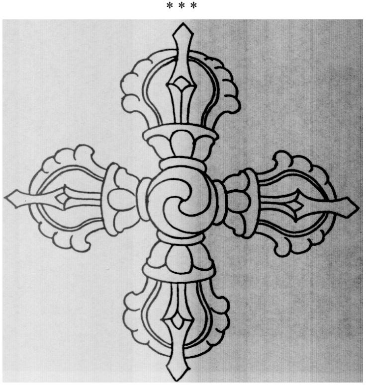

<sup>!!!!!!!!!!!!!!!!!!!!!!!!!!!!!!!!!!!!!!!!!!!!!!!!!!!!!!! 2</sup> The abridged title of this work is *Kun rig cho ga'i rnam bshad*, and its full title is *dPal ngan song thams cad yongs su sbyong ba'i sdig sbyong sgo dgu'i rnam bshad gzhan phan mdzes rgyan*. Block print acquired in India.

<sup>3 <</sup>i>Sarvadurgatipariś*odhana*-*tantra*, Delhi, 1983, 311.

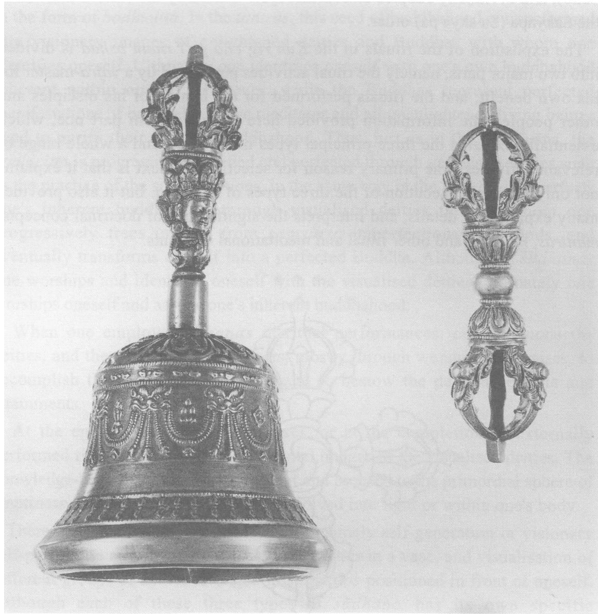

4. *Vajra*-bell (*vajragha*ṇṭā) and *vajra*

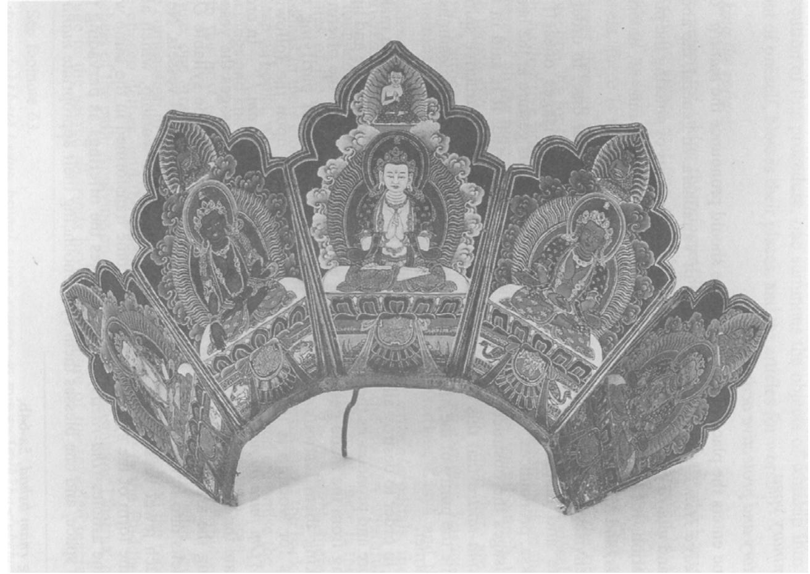

5. The five Buddha crown. From left to right: Ratnasambhava, Vairocana, Amitābha, Amoghasiddhi.

# I. *SELF-GENERATION AS A DEITY*4

The meditational process of self-*yoga* 5 (9a) is explained in three consecutive stages: 1. preliminary *yoga*, 6 2. meditation on the protective circle, 7 and 3. self-generation. 8

## 1. *Preliminary yoga*

## *Purificatory and protective activities*

When one enters the place of evocation, one should pronounce the *mantra* "Oṃ *vajrapledge H*ūṃ" 9 and make the gesture of Vajradhara. In general, the above *mantra* and *mudr*ā of Vajradhara are used on the occasions of entering the place of evocation, meditating on the absolute thought of enlightenment, entering maṇḍ*alas*, and identifying oneself with deities.

One envisages one's seat as resting on a lotus and a lunar disc. In order to eliminate and dispel the obstructive spirits, 10 one envisages oneself as Vajrayakṣa, pronounces "Oṃ *Vajrayak*ṣa Hūṃ," makes his gesture at the heart, and envisages the obstructive spirits as becoming dispersed. It is said in the *Vidyottama*-*tantra* that this is done in order to remove the obstructive spirits, who defile the purity of the offerings, and induce adverse mental dispositions in the performer.

Next, in order to destroy all impurities in the articles for worship, one makes the gesture and pronounces the *mantra* of Vajrānala. One envisages fire and light dispersing from the made gesture, purging all the defilements of the offerings, and making them lustrous and excellent. Another method of purifying the offerings for worship is to pronounce and contemplate upon the following *mantra*: "Oṃ *pure by nature are all dharmas*, *pure by nature am I*." 11 In order to generate the vessels and articles for worship, first one envisages the vessels containing the articles for worship as assuming the form of the syllable Oṃ, which melts into light, and then becomes transformed into jewel vessels. Next, inside such jewel vessels, one envisages the articles for worship, which also assume the form of the syllable Oṃ and become transformed in the same way into divine articles (*lha-rdzas*). One envisages the offerings as pervading the whole of space, and one blesses them by pronouncing their appropriate *mantras*

<sup>!!!!!!!!!!!!!!!!!!!!!!!!!!!!!!!!!!!!!!!!!!!!!!!!!!!!!!! 4 <</sup>i>Kun rig rnam bshad, 5a–64b.

<sup>5</sup> ā*tmayoga* / *bdag gi rnal 'byor*; also called *devat*ā*yoga* / *lha'i rnal 'byor*. 6 *sngon 'gro'i rnal 'byor*. 7 rakṣā*cakrabh*āvanā / *srung 'khor bsgom pa*. 8 *bdag bskyed*. 9

oṃ *vajrasamaya h*ūṃ. 10 *vighna* / *bgegs*. 11

oṃ *svabh*āvaś*uddh*āḥ *sarvadharm*āḥ *svabh*āvaś*uddho 'ham*.

and making their *mudr*ās. The *mantras* for the individual articles should commence and end with Oṃ Āḥ Hūṃ, the three seed-syllables of Body, Speech and Mind. The articles blessed in this way assume the form of the *vajra*-knowledge. After that, one produces the sounds of music (rol mo) by reciting the *mantra*, which starts with the words *vajradharmara*ṇita. 12 Through the execution of this procedure, one summons the objects of worship into space in front of oneself, blesses their places, and the articles for worship.

# *Taking the refuges*

The reason for taking the refuges (8b) is rooted in the fear, which arises upon becoming aware that one and other living beings are oppressed by the three kinds of misery. 13 One makes an earnest aspiration that apart from the Three Jewels, there is no one else who is able to provide protection. One takes the refuges through the recollection of the excellent qualities of the objects of protection. As for the object of one's refuge, one envisages before oneself a jewel tree, having five branches with leaves and fruits, and resting within the radiant sphere of all the pure directions. On the flowers of the central branch, there is a lion throne surmounted by lotuses and lunar discs on which there are the root *guru*, Vairocana, the Buddhas of the remaining four families, Locanā and the remaining Buddha goddesses, the sixteen Vajrasattvas, Lāsyā and the other goddesses of offerings, the four guardians of the maṇḍala portals, the sixteen śrā*vakas*, the twelve Pratyeka Buddhas, and the sixteen wrathful deities surrounded by attendant deities. On the branch at the front, there is the host of deities of the maṇḍala of the tutelary deities. 14 To the right, there are the Buddhas in their glorified manifestations (saṃ*bhogak*āya). At the back, there is a heap of books, which are arranged like a rocky hill and epitomise the revealed teachings and knowledge. To the left, there are the Dharma-protectors15 together with the host of the wealth god Vasudeva. 16 At the front of this sphere of refuge, one arranges all living beings, and one adheres firmly with devotion to the compassion of the highest Jewel. Applying one's thought to the root deities, the chosen deities, and the Buddhas, one takes refuge in the Buddhas as the teachers of the path. Applying one's thought to the sustaining Dharma, one takes refuge in the sacred *dharmas* having the nature of the revealed teachings and

<sup>!!!!!!!!!!!!!!!!!!!!!!!!!!!!!!!!!!!!!!!!!!!!!!!!!!!!!!! 12</sup> See footnote 63.

<sup>13 <</sup>i>trayaduḥ*khat*ā / *sdug bsngal gsum*: misery as misery (duḥkha-duḥ*khat*ā / *sdug bsngal gyi sdug bsngal*); misery due to the conditioned elements (saṃskā*ra-du*ḥ*khat*ā / *'du hyed kyi sdug bsngal*); and misery due to change (*vipa*ṇā*ma-du*ḥ*khat*ā /*'gyur ba'i sdug bsngal*). For the eight kinds of misery see Mahā*vyutpatti* 2233–40.

<sup>14 <</sup>i>yi dam. 15 *dharmap*āla / *chos skyong*. 16 Nor lha.

spiritual realisation (*lung rtogs*). Applying one's thought to the Bodhisattvas and others, one takes refuge in the Sangha of the best and noble ones. One envisages a variety of bright rays, which disperse from the objects of refuge, touch all living beings, remove the obstructions of their sins, and place them in the auspicious circumstances of gaining the abode of the Three Jewels. One also envisages the objects of refuge as melting into light and dissolving into oneself. Through executing this procedure, the blessing of the Three Jewels penetrates and abides in all one's mental dispositions.

## *Raising the thought of enlightenment*

There are two ways of raising the thought of enlightenment (*bodhicittotp*āda), namely absolute and relative. (10b) In the first case, one abides in the natural state of things, and perceives that all the conditioned and unconditioned *dharmas* are non-existent apart from the mind, that from the primordial beginning the mind's nature is emptiness, and that one is without a self on account of being free from the subject and object perceptions. In the case of the relative thought of enlightenment, one generates boundless compassion towards all living beings that are fettered by the firm bonds of clinging to the self without understanding the natural state of things. One purifies the obstructions of their sins, and duly places them in the Buddha stage (bhūmi). One should generate the thought of enlightenment, which constitutes the union17 of the relative and absolute truths. 18

## 2. *Meditation on the protective circle*

Next, one proceeds to envisage the protective circle (rakṣā*cakra*). (10b) The main exposition of the protective circle given here follows the *Vajradh*ā*tu-mah*āmaṇḍala 19 and several related sources, and the concluding activities are explained on the basis of a different group of sources.

# *Blessing of one's body*, *speech and mind*

One begins by blessing one's body, speech and mood. One pronounces the *mantra* "Oṃ *pure by nature are all dharmas*" and so forth, and one meditates on the *dharmas* as being empty, devoid of a self, and essentially pure by nature. By doing so, one performs the inner purification, which removes the three defects of the mind, 20 making it pure and radiant. One becomes able to meditate. Such is the blessing of one's mind.

<sup>!!!!!!!!!!!!!!!!!!!!!!!!!!!!!!!!!!!!!!!!!!!!!!!!!!!!!!! 17 <</sup>i>yuganaddha / zung 'jug. 18 *satyadvaya* / *bden gnyis*. 19 rDo rje 'byung ba.

<sup>20</sup> covetousness (*abhidhy*ā), spitefulness (vyāpāda), and wrong views (*mithy*ā-dṛṣṭi).

Next, one envisages oneself as Vajrasattva arising from the nature of one's meditation on emptiness. One does this because it is said in the *tantras* that one should abide in the place of Vajrasattva, and that it is necessary to assume the self-conceit (ahaṃkāra) of Vajrasattva in all one's comportments. 21 At the throat of Vajrasattva, one envisages a red syllable Hrīḥ from which there arises a red eight-petalled lotus having the nature of Speech of all the Buddhas. The front petal becomes transformed into a tongue with the letter A placed on the top of it. From the letter A there emerges a lunar disc with the syllable Hūṃ resting at its centre, and then from the syllable Hūṃ a white fivepronged *vajra*. One pronounces "Oṃ *vajra-tongue*" and concurrently envisages the *vajra*  and the lunar disc dissolving into one's tongue and transforming it into a *vajra*. Through executing this procedure, one eliminates the four defects of speech. 22 When one's speech becomes purified, one becomes endowed with the ability and power to pronounce *mantras*. Such is the blessing of one's speech.

Lifting one's hands in front of the face, one envisages two letters A on the palms of one's hands and from each letter A lunar disc surmounted by the syllable Hūṃ. Next, one envisages the syllables Hūṃ becoming transformed into five-pronged *vajras*, which dissolve into one's hands and assume the form of one's hands and fingers. One perceives one's hands as having the nature of *vajras* and the fingers as having the nature of onepronged *vajras*. Through executing this procedure, the three defects of one's body23 become purified, and one gains the power to make *mudr*ās Such is the blessing of one's body.

#### *Self-generation as a wrathful deity*

Next, one generates oneself as the wrathful deity of the Buddha families. Assuming the mental state of Vajrasattva, one pronounces the syllable Hūṃ and envisages oneself as being transformed into a body blazing with fire, and then into the wrathful deity Krodhānala. 24 The body of this deity is all in flames and it is blue in colour. He has one face and two hands holding a *vajra* and a bell. He sits with his legs crossed and is completely surrounded by a mass of blazing names Which form a halo. One pronounces three times "Oṃ *grasp vajra-pledge H*ūṃ Vaṃ" 25 and at the same time one makes with one's hands the inner *vajra-*bond. Next one places the gesture known as the wrathful *terintir*ī on the forehead, throat and heart, and one envisages one's body, speech and mmd as becoming merged with the wrathful deity's Body, Speech and Mind, and one

!!!!!!!!!!!!!!!!!!!!!!!!!!!!!!!!!!!!!!!!!!!!!!!!!!!!!!!

<sup>21</sup> īryā*patha* / *spyod lam*. 22 false hood (mṛṣāvāda), slander (paiś*unyav*āda), abuse or harsh words (pāruṣyavāda), and idle or useless talk (saṃ*bhinnapral*āpa).

<sup>23</sup> murder (prāṇātipāta), theft (*adatt*ādāna), unchastity (kā*mamithy*ācāra).

<sup>24</sup> Khro bo me.

<sup>25</sup> oṃ *grih*ṇ*a vajrasamaya h*ūṃ vaṃ.

assumes the deity's mental self-conceit. Placing once more the *terintir*ī gesture on the head, forehead, right ear, nape, and left ear, one repeats five times "Oṃ *Vajrav*ālānalā*rka consecrate me*." 26 As one recites this *mantra*, one envisages on the above five bodily places blue five-pronged *vajras* standing upwards, and above them, the bodily colours and the *mudr*ā symbols of the five Buddha families. Next, one creates a beautiful armour by pronouncing "Oṃ Ṭuṃ" and making two *vajra*-bond gestures, which are placed to the left of the heart, on the throat, on the nape, to the right of the heart, between the breasts, at the centre of the heart, on the throat, at the back, and finally on the forehead. It is stated in the *Vajra*ś*ekhara-tantra* that the syllables Oṃ Ṭuṃ constitute special armour which accomplishes all goals. Next, one envisages a piece of while silk, one cubit wide and twenty-one cubits long, and one perceives it as becoming knotted on the nine places of one's body. One places the palms on the forehead moves them down, and while pronouncing "Oṃ *Vajra rejoice Ho*ḥ," 27 one envisages the silk cloth unfolding from the level of one's ears and gradually covering one's entire body.

The above exposition, starting from the time of taking the refuges and up to this point, explains the procedure of generating oneself as a wrathful deity of the Buddha families.

#### *Destruction of obstructive spirits*

Prior to visualising the protective circle, (15a) one should drive away the obstructive spirits. One pronounces "Oṃ *Vajrajv*ālānalā*rka H*ūṃ" and placing the left *vajra*-fist at the heart, one brandishes the *vajra* with the right *vajra*-fist. One applies one's wrathful mind and envisages countless *vajras* dispersing from the *vajra* in one's hand, and destroying the very fierce obstructive spirits. In order to destroy the medium fierce obstructive spirits, one makes the gesture of the *vajra*-flame, pronounces three times "Oṃ *Vajrajv*ālānalā*rka H*ūṃ *kill*, *burn*, *consume*, *break*, *battle*, Hūṃ Pha," 28 and envisages a mass of flames dispersing in all directions and destroying the obstructive spirits. The minute and feeble obstructive spirits are destroyed by merely making the gesture of Vajranetrī and pronouncing three times "Oṃ *Vajranetr*ī *bind all the obstructive spirits*." 29 As one pronounces the above *mantra*, one envisages rays of light endowed with the five wisdoms and dispersing from the hand gesture of Vajranetrī. These rays bind the obstructive spirits with five *vajra*-threads, making thus their bodies immobile, their speech faculties breathless, and their minds completely obtuse. This particular procedure is explained in the *Vajradh*ā*tu-mah*āmaṇḍala.

<sup>!!!!!!!!!!!!!!!!!!!!!!!!!!!!!!!!!!!!!!!!!!!!!!!!!!!!!!! 26</sup> oṃ *vajrajv*ālānalā*rka abhi*ṣ*iñca m*ām. 27

oṃ *vajra tu*ṣ*ya ho*ḥ. 28

oṃ *vajranala hana daha paca matha bhañja ra*ṇa hūṃ phaṭ. 29

oṃ *vajranetri bandha sarvavighn*ān.

However, some meditational masters say that in the first instant one pins down the obstructive spirits, and then binds and burns them.

## *Visualisation of protective enclosures*

One envisages a set of protective enclosures in order to prevent the obstructive spirits from penetrating inside the meditational space. Placing the outstretched *vajra*-bond gesture on the ground, one pronounces "Oṃ *vajra be firm for me*, *bind and protect all*  Svāhā," 30 and one envisages the sphere beneath oneself as being transformed into a vast expanse resembling a plateau made from *vajra*-earth. One binds the *vajra*-fists, moves them in a circular manner like a fire-brand, and then making the forefingers into hooks, one places them above the head. While making this gesture of Vajrabhairavanetra, one pronounces "Oṃ *hulu hulu H*ūṃ Phaṭ" and envisages the production of a square *vajra*summit in the sphere above oneself. Next, making the gesture of Vajrayakṣa and saying "Oṃ *Vajrayak*ṣa Hūṃ," one envisages a second summit, which is lower and beneath the square *vajra-*summit. This summit is also square but it is a little smaller. Next, one makes the gesture of Vajroṣṇīṣa, and pronouncing "Oṃ druṃ *bind Ha*ṃ" 31 one envisages a *vajra*-enclosure at the eastern direction. This enclosure does not have any summits similar to those just described, but it simply stretches like a vast curtain. Inside this enclosure, one creates a second enclosure with upper and lower summits by making the gesture of Vajrapāśa and saying "Oṃ Hūṃ *Vajrap*āśa Hrīḥ." A similar vajra-enclosure is produced at the western direction by making the gesture of Vajrapatākā and pronouncing "Oṃ *flying Vajrapat*ākā *flutter*." 32 Then placing the gesture of Vajrayakṣa on the face, which is in fact the gesture of either Vajrakāla or Vajrakālī, and reciting "Oṃ Hrīḥ *Vajrak*ālī *be fierce Pha*ṭ" one envisages a massive shower of *vajras* falling down in the remaining cardinal and intermediate directions. This shower of *vajras* destroys all the obstructive spirits, and produces a *vajra*-enclosure with upper and lower summits at the northern direction. A similar *vajra*-enclosure is produced at the southern direction by making the gesture of Vajraśikharā and saying "Oṃ *Vajra*ś*ikhar*ā Ruṭ Maṭ." The double binding above and at the eastern direction is made because it is said in some texts that Brahma and Indra are very powerful. 33 (17b)

Next, on the outside and at a long distance from the above described square enclosure, one produces another square enclosure made of one hundred thousand piled-up crossed *vajras*. This enclosure is erected by making the gesture of

<sup>!!!!!!!!!!!!!!!!!!!!!!!!!!!!!!!!!!!!!!!!!!!!!!!!!!!!!!! 30</sup> oṃ *vajra d*ṛḍ*ho me bhava bandha* rakṣ*a sarv*ā*n sv*āhā. 31

oṃ ruṃ *bandha ha*ṃ. 32

oṃ *vajrapat*ā*ke pata*ṃ*gini ra*ṭa. 33 The title of the work which makes such a statement is given as *mGon po kun snang gi rgyud*.

Vajrakarma and saying "Hūṃ *Vajrakarma*." Next, one makes the gesture of Vajrahūṃkāra, pronounces the syllable Hūṃ, and envisages the construction of a round *vajra*-enclosure positioned inside the square enclosure made up of the crossed *vajras*. After that, one makes the *vajra*-bond gestures, pronounces "Oṃ *vajra-binding Va*ṃ" and envisages a round *vajra*-tent surmounted by one half of a five-pronged *vajra*, and pitched inside the round enclosure of Vajrahūṃkāra. Inside this tent, there is a square enclosure. which joins together the upper summits of the above four cardinal directions.

The above described visualisation epitomises the illusory relative truth (saṃvṛti). Since the form of one's own hatred becomes projected in the form of obstructive spirits, which cause difficulties, all the activities, which cause obstructions, and which induce obstructions, ultimately represent the play of one's own mind. It is on the basis of this assumption that one visualises the protective circle which has the form of wisdom. It is a superior method of dispelling all the hindrances on one's path. In the *Vajra*ś*ekharatantra*, the nature of the mind is described in the following way: "One's mind is called Māra and the obstructive spirits are also one's mind. The obstructive spirits arise from mental constructions. One should dispel all one's mental constructions and subdue the mind which is difficult to subdue."

# *Worship of the wrathful deity*

Now comes the second part (19a) which deals with the concluding activities.

First one summons the wrathful deity and offers worship and praises. Next, one envisages oneself as the wrathful deity Krodhānala. After that, one disperses rays of light from one's heart and admonishes with them the Buddhas, who abide in the *dharmak*āya in union with their *prajñ*ās. In order to destroy demons and obstructive spirits, one envisages them appearing in bodily forms, and being surrounded by a host of corresponding wrathful beings of knowledge, who blaze with fierce flames. One summons them by snapping one's fingers and pronouncing "Oṃ *vajra*-*gathering*." 34 Holding the *vajra* and the bell, one recites the following verses:

> "Vajra-wrath, your mind endowed with the non-dual wisdom blazes with the radiance resembling the fierce conflagration at the end of times. It is through this kind of activity that you destroy the category of ignorance, which clings to the self (ā*tman*) and obstructs the path of *tantric* liberation of those who are to be converted. You also dispel all the obscurities which pervade the offerings. You destroy all fears of Yama whose hatred removes the force of happiness and virtue, and in particular you arise in the bodily form of the great wrathful hero who overcomes

<sup>!!!!!!!!!!!!!!!!!!!!!!!!!!!!!!!!!!!!!!!!!!!!!!!!!!!!!!! 34</sup> oṃ *vajrasam*āja.

demons. Your manifestation as a hero has all the required characteristics and emblems, such as wearing a tiger's skin and other attires, which duly induce fear. Inflict injury and destruction through your fierce activities upon all the spheres of the adverse mental engagements of the obstructive spirits, demons and all other spirits who cause hindrances to the progress on the path of liberation. Since you bestow knowledge and wisdom, you abide as a king of knowledge and a wrathful deity of wisdom. Upon being summoned to remove the obstructions to all spiritual aspirations, please come here to protect living beings by means of compassion against the fear of the hostile demons and obstructive spirits. I offer you worship and praises. Please remember me with compassion and come to this place."

One summons the wrathful king along with his retinue by reciting the following words: "Oṃ. O *King of vajra-wrath together with your retinue*, Oṃ *come*." 35 One offers them seats by saying "Oṃ *vajra-lotus*," 36 and one envisages them taking their appropriate places in the cardinal and intermediate directions on the outer sections of the protective circle, and at the same time destroying the obstructive spirits. Next, one disperses from their hearts the goddesses of offerings through whom one offers the items of worship. One executes this activity by reciting the *mantras* and making the *mudr*ās of the goddesses of offerings. After that, one makes the five gestures of the mahā*mudr*ā and rings the bell three times. Alternatively, one holds the *vajra* and the bell on the right and left breasts and recites the following verses:

> "Without separating from emptiness whose nature permeates the sphere of the *dharma-reality* (*dharmat*ā), without separating from the *dharma-*body revealed as the non-dual knowledge epitomised by the wisdom having the unique flavour of self-knowledge, and without abandoning the activities performed through the manifested body (*nirm*āṇakāya) in the world of conventional truth, you become manifested in the bodily forms appropriate to convert living beings in accordance with their circumstances. On this particular occasion, in order to subdue the evil ones who cannot be subdued by peaceful means, you knowingly follow the correct expedients, and appear in wrathful bodies that terrify all the evil ones. I bow down and praise the great wrathful host whose radiant fire discharges terror."

!!!!!!!!!!!!!!!!!!!!!!!!!!!!!!!!!!!!!!!!!!!!!!!!!!!!!!!

<sup>35</sup> oṃ *vajrakrodhar*ā*ja saparivara o*ṃ ehi. 36

oṃ *vajrakamalas tva*ṃ.

## *Giving* an *order to the obstructive spirits*

Next, one gives an order (ājñā) to the obstructive spirits. (21b) One does it by making a threatening gesture with the right hand and moving it away from one's face, while reciting the following verses:

> "Listen the host of gods, serpents and other obstructive spirits, who live and reside in this place of perfecting and worshipping the great maṇḍ*ala* of Vairocana. O obstructive spirits, who disturb me the performer, and who disrupt the work of drawing the great maṇḍ*ala* in this place, I ask you to go away to some other place. Should you disobey this order, I, as a wrathful *vajra*, will cleave your heads into hundreds of pieces with this blazing *vajra*, which has the nature of the non-dual mind and wisdom of all the Buddhas."

# *Self-protection*

One protects oneself with the so-called *mantras* of the four syllables Hūṃ. 37 (22a) Placing the gesture of Vajrahūṃkara at the heart and reciting "Oṃ *Sumbha Sumbha H*ūṃ Pha," one envisages a blue five-pronged *vajra* emerging at the heart. Touching the forehead and reciting "Oṃ *hold hold H*ūṃ," one envisages a *vajra*-jewel emerging on the forehead. Touching the throat and reciting "Oṃ *hold and bestow*, *hold and bestow H*ūṃ," one envisages an eight-petalled lotus emerging at the throat. Touching the head and reciting "Oṃ *lead in Ho*ḥ, *Lord Vajra-king H*ūṃ Phaṭ," one envisages a crossed *vajra* on the head.

Next, one protects the place and the *yogic* activities by destroying the obstructive spirits. This is done by executing once more the same *mantras* and accompanying gestures, while turning in a clockwise way towards the cardinal and intermediate points of the compass, starting with the eastern direction for the cardinal directions, and with the south-eastern quarter for the intermediate directions. As one turns in a clockwise direction, one envisages protective circles that blaze with radiant light.

The self-protection with the gestures and *mantras* of the four Vajrasattvas of the Karma family is done by making their appropriate gestures and reciting their *mantras*, which are as follows: "Oṃ *Vajrakarma Ka*ṃ, Oṃ *Vajrarak*ṣa Hoḥ, Oṃ *Vajrayak*ṣa Hūṃ, Oṃ *Vajrasandhi Va*ṃ." The above *mantras* are not the same as in the *Sarvadurgatipari*ś*odhana-tantra*, but they are taken from the *Sarvatath*ā*gatattvasa*ṃ*graha* and the *Vajra*ś*ekhara tantras*.

<sup>!!!!!!!!!!!!!!!!!!!!!!!!!!!!!!!!!!!!!!!!!!!!!!!!!!!!!!! 37</sup> oṃ *sumbha sumbha h*ūṃ.

oṃ grhṇ*a grh*ṇa hūṃ.

oṃ grhṇā*paya grh*ṇā*paya h*ūṃ.

oṃ ā*naya ho*ḥ *bhagavan vajrar*ā*ja h*ūṃ phaṭ.

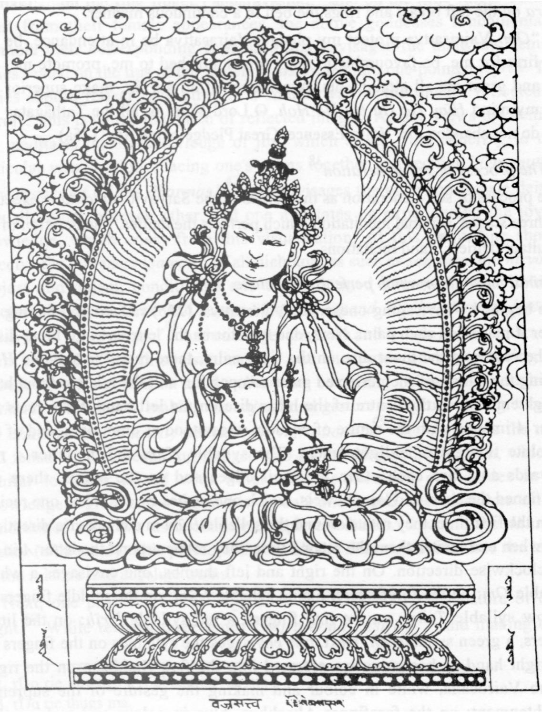

6. Drawing of Vajrasattva

# *The hundred syllables of Vajrasattva*

One makes oneself firm (23a) by reciting three times the hundred syllables of Vajrasattva. During the first two recitations, one rotates the *vajra* at the face and rings the bell in a staccato manner. During the third recitation, one holds the *vajra* on the left breast and rings the bell in a continuous manner.

> "Oṃ. Vajrasattva protect my pledge. Vajrasattva be in attendance, be firm for me, be favourable to me, remain attached to me, promote me, and grant me all attainments. Ascertainer of all *karma*, make superior my mind Hūṃ *Ha Ha Ha Ha*  Hoḥ. O Lord Vajra of all the Tathāgatas do not abandon me. Vajra-Essence, Great Pledge-being Āḥ." (25a)

# 3. *The process of self-generation*38

The process of self-generation as the deities of the Sarvavit maṇḍala is executed in three stages: seminal meditation which perfects the deities, 39 generation of the resultant deittes, 40 and recitations. 41

# *Seminal meditation which perfects the deities*

One begins by envisaging oneself as Vajrasattva, (25b) radiant and having the letter A placed on each palm. Next, one transforms the letters A into lunar discs. In the centre of the lunar disc on the right palm, there rests the syllable Hūṃ having the nature of the perfected great compassion and the relative thought of enlightenment. In the centre of the lunar disc on the left hand, there rests the letter A imbued with the nature of wisdom understood as emptiness, and of the absolute thought of enlightenment. The syllable Hūṃ and the letter A rise upwards and face each other. On their edges and on the palms, there are positioned the short and long vowels, which one recites twice. When one recites them the first time, they rotate around the syllable Hūṃ in a clockwise direction, and when one recites them the second time, they rotate around the letter A in an anticlockwise direction. On the right and left thumbs, one envisages a white syllable Oṃ; on the forefingers, a blue syllable Hūṃ; on the middle fingers, a yellow syllable Trāṃ; on the ring fingers, a red syllable Hrīḥ; on the little fingers, a green syllable Aḥ. Next, one envisages the syllables on the fingers of the right hand as becoming transformed into the five Buddhas: on the right thumb Vairocana, white in colour and making the gesture of the supreme enlightenment; on the forefinger Akṣobhya, blue in colour and making the gesture of touching the earth; on the middle finger Ratnasambhava, yellow in colour and making the gesture of giving; on the ring finger Amitābha, red in

<sup>!!!!!!!!!!!!!!!!!!!!!!!!!!!!!!!!!!!!!!!!!!!!!!!!!!!!!!! 38 <</sup>i>bdag bskeyd. 39 *lha 'grub pa'i rgyu bsgom pa*. 40 *'bras-bu lha bskyed pa*. 41 *gtad pa'i bzlas pa*.

colour and making the gesture of meditation; and on the little finger Amoghasiddhi, green in colour and making the gesture of protection. On the fingers of the left hand one envisages the five Buddha goddesses: on the left thumb Vajradhātvīśvarī; 42 on the forefinger Locanā; 43 on the middle finger Māmakī; 44 on the ring finger Pāṇḍaravāsinī; 45 and on the little finger Tārā. 46 Apart from their female appearances, the above goddesses fundamentally resemble their corresponding Buddhas. One envisages the male and female deities seated on the tips of the fingers transformed into one-pointed *vajras*. The deities should reflect each other in a similar way to the images reflected in mirrors. This is called the union of reflected images. As one views the deities, one meditates on the knowledge of joy, which arises from adhering to this particular visualisation. Placing one's palms together and reciting "Oṃ *mutual convergence of all the dharmas*," 47 one envisages the male and female deities mutually touching each other, and one meditates on experiencing the joy of knowledge, which arises from this visualisation. At this point, one should perceive the sameness (*samat*ā) of all dichotomies such as saṃsāra and *nirv*āṇa, subject and object, conditioned and unconditioned *dharmas*. Next, folding together the *vajra*-palms and saying "*Expand expand*, *all the dharmas become penetrated*, *vajrapalms*," 48 one envisages the male and female deities embracing each other. During this visualisation, one meditates on experiencing the knowledge of joy, and on all the *dharmas* becoming pervaded by suchness (*tathat*ā). Once again, making the *vajra*-bond gesture and pronouncing "Oṃ *all the dharmas are mutually penetrated*, *vajra-bond*," 49 one envisages the male and female deities becoming merged into an indistinguishable union, which is similar to water mixed with water. At this moment, one abides in the knowledge which arises from this visualisation, and one perceives all the conditioned *dharmas* as becoming completely dissolved within the *dharma-*reality (*dharmat*ā). This perfect union of all the *dharmas* epitomises the union of the relative and absolute truths.

Next, one proceeds to envisage one's mind as having the nature of clear light. 50 While reciting three times "*Vajra-bond destroy*" 51 and making three

!!!!!!!!!!!!!!!!!!!!!!!!!!!!!!!!!!!!!!!!!!!!!!!!!!!!!!!

<sup>42</sup> rDo rje dbyings kyi dbang phyug ma.

<sup>43</sup> rDo rje thugs ma.

<sup>44</sup> rDo rje dbang bskur ma.

<sup>45</sup> rDo rje rntshon cha ma.

<sup>46</sup> rDo rje kun ma.

<sup>47</sup>

<sup><</sup>i>anyonyā*nugat*āḥ *sarvadharm*āḥ. 48 *sphara sphara anupraviṣṭāḥ sarvadharm*āḥ *vajr*ā*ñjali*. 49

<sup><</sup>i>anyonya anuprav*ṣṭāḥ sarvadharm*āḥ *vajrabandha*. 50 *prabh*ā*svara / 'od gsal ba*. 51 *vajrabandha tra*ṭa.

times the *vajra*-bond gesture, on envisages one's body, speech and mind becoming purified from all the obstructions of sins. Since the mind by its very nature is clear light, all its adventitious (ā*gantuka*) impurities become destroyed by the unbreakable *vajra*. Placing the thumbs inside the *vajra*-bond gesture, and reciting ten or up to one hundred times "Oṃ *vajra-penetration A*," 52 one envisages inside one's heart the primordial fivepronged *vajra*53 standing on a lunar disc. At the same time, one envisages the primordial *vajra* descending from the hearts of the Tathāgatas, dissolving into the *vajra* in one's heart, and pervading one's body and mind with the kind of bliss which is completely free from all depravities. 54

It is said in some sources that the visualisation of the primordial *vajra* strengthens the meditation, which induces the descent of knowledge at the time of receiving the consecrations (*abhi*ṣeka). Some sources say that the origin of the primordial *vajra* stems from the occasions when the Buddhas, at the moment of their enlightenment, are conferred by the previous Buddhas by saying "Good (sādhu)." According to some commentaries, the primordial *vajra* is bestowed after the diadem consecration (*muku*ṭābhiṣeka) when one receives a red five-pronged *vajra*. However, in reality, the primordial *vajra* constitutes the very essence of Vajrasattva, who epitomises the timeless thought of enlightenment as clear light. The timeless being (*sattva*) is represented by such deities as Vajrasattva, Samantabhadra and Śrīparamādya. It is further explained in some sources that the primordial buddhahood does not have any cause. Taking into consideration all the above statements, it is asserted that when the essential nature of the thought of enlightenment becomes fully realised, and completely cleansed from all impurities, it constitutes the Buddha's *dharmak*āya. This body is called Mahāvairocana, and it is said to abide in the form of a *vajra*, which rests on a lunar disc inside the hearts of the five Buddha families abiding in the saṃ*bhogak*āya. It is said in the *Sarvatath*ā*gatatattvasa*ṃ*graha* that "the lord Mahābodhicitta as the Bodhisattva Samantabhadra abides in the hearts of all the Tathāgatas." It is also said in the *tantras*  that the Tathāgatas abide in one's body in the form of the being-*vajra* (*sattvavajra*) of the *vajra*-sphere (*vajradh*ātu) of all the Tathāgatas. Thus, according to the *tantras* and their commentaries, the being-*vajra* and the primordial *vajra* have the same meaning. The primary notion of the primordial *vajra* is the radiant mind as the non-dual union (*yuganaddha*) of awareness and emptiness (*rig stong*) envisaged in the form of a lunar disc and a *vajra*. It is Mahāvairocana, as the mind of all the Buddhas, who descends as the primordial *vajra* having the form of a lunar disc and a *vajra*. It

!!!!!!!!!!!!!!!!!!!!!!!!!!!!!!!!!!!!!!!!!!!!!!!!!!!!!!!

<sup>52</sup>

oṃ *vajr*āveśa a. 53 *dang po'i rdo rje rtse lnga pa*. 54

anā*sravasukha / zag med kyi bde ba*.

is said in some texts that the so-called descent of knowledge (*ye shes phab pa*) implies the descent of the knowledge-*vajras* of all the Tathāgatas of the ten directions into Vajrasattva as the knowledge-being (jñā*nasattva*) abiding in one's heart. Concerning the colour of the *vajra*, the commentary on the Śrī*param*ā*dya* and some other texts state that the primordial *vajra* is red and blazes with red light.

In order to make one's knowledge firm, one makes the *vajra*-bond gesture and recites "*Abide*, *be firm for me*, *be eternal for me*, *empower my heart*, *grant me all attainments H*ūṃ *Ha Ha Ha Ha Ho*ḥ" 55 In this *mantra*, the syllable Hūṃ represents the wisdom of the pure absolute, the four syllables Ha represent the other four wisdoms, and the syllable Hoḥ represents their unity. (30b)

## *Generation of the resultant deities*

It is said in certain sources that one should generate the so-called all-pervasive Vajrasattva arising form the rays of light which benefit other living beings. (32b) What is the significance of Vajrasattva in this context? In general, it is Vairocana who is the overall master of all the families maṇḍ*alas*. He is differentiated into Vairocana and Mahāvairocana. The essence of the Bodies of the five Tathāgatas, who gained the perfect buddhahood in the Akaniṣṭha abode through the projection from the absolute sphere, is represented by Vairocana. The generative cause of the mind undifferentiated from the Mind of Vairocana, and of Vairocana, Vajrasattva and other deities arising from one's own mind, is represented by Mahāvairocana endowed with the character of the beginningless and endless *dharmadh*ātu. Thus, Vairocana represents the *sambhogak*āya and Mahāvairocana the *dharmak*āya. Mahāvairocana arising in a bodily form (rūpakāya) becomes manifested as Vajrasattva. It is for this reason that Vajrasattva is referred to in different texts as the master or father of all the Tathāgatas.

One begins the process of visualisation by pronouncing "Oṃ *pure by nature are all dharmas*" and so forth, and by envisaging all the *dharmas* as dissolving into emptiness having the form of clear light. (33b) From the nature of emptiness there emerges the syllable Paṃ, and from it the letter A resting on a lotus. From the letter A there emerges the syllable Hūṃ which rests on a lunar disc and has the nature of one's pure mind56 free from discursive thoughts. 57 The syllable Hūṃ becomes transformed at the navel into a white five-pronged *vajra* marked with the syllable Hūṃ. Then from the syllable Hūṃ there disperse rays of light through which one offers worship to the noble ones (ārya), and performs the works for the benefit of living beings. After that, one brings back

<sup>!!!!!!!!!!!!!!!!!!!!!!!!!!!!!!!!!!!!!!!!!!!!!!!!!!!!!!! 55</sup> tiṣṭha *vajra d*ṛḍ*ho me bhava* śāś*vatho me bhava h*ṛ*daya*ṃ *me adhi*ṭsṭha *sarvasiddhi*ṃ *prayaccha h*ūṃ *ha ha ha ha ho*ḥ. 56 *cittatva / sems nyid*. 57 *avikalpa / rnam par mi rtog pa*.

the rays of light and absorbs them within oneself. It is through the transformation of these rays of light that one envisages oneself becoming metamorphosed into Vajrasattva. On this occasion, Vajrasattva is white in colour and sits with his legs crossed. He wears silk garments and is adorned with ornaments. He holds a five-pronged *vajra* in his right hand placed at the heart, and a bell in his left hand positioned to the side of his face. This visualisation constitutes the generation of oneself as a deity.

Next, one blesses oneself with the *mudr*ās of the body, speech and mind in order to remain inseparably united with the blessing of the deities. One performs this activity because it is said in the *Sarvatath*ā*gatatattvasa*ṃ*graha* that "since one has fears of damaging the pledges of Vajrasattva and other deities, one should receive their blessing by binding their *mudr*ās." In order to bless one's body and to retain the pledge of Body, one places the palms on the forehead, and pronouncing "Oṃ *rend rend all the obstructions H*ūṃ Pha," 58 one envisages one's body becoming merged with the Body of the Tathāgatas. Placing the palms on the throat, and pronouncing "Oṃ *break break all the obstructions H*ūṃ Pha," 59 one envisages one's speech becoming merged with the Speech of the Tathāgatas. Then, in order to bless one's mind and to retain the Speech pledge, one places the *vajra*-palms, or the *vajra*-bond gesture, at the heart, and pronouncing "Oṃ *cut cut all the obstructions H*ūṃ Phaṭ," 60 one envisages one's mind becoming merged with the Mind of the Tathāgatas.

Next, one receives the consecration of the five Buddhas. Making the gesture of Vajrapāṇi above the head, and reciting "Oṃ *Vajra consecrate H*ūṃ," one envisages Akṣobhya resting on one's head. Making the gesture of Durgatipariśodhanarāja above the forehead, and reciting "Oṃ *Buddha consecrate* Oṃ," one envisages Vairocana on the forehead. Making the gesture of consecration over the right ear, and reciting "Oṃ *Ratna consecrate Tr*āṃ," one envisages Ratnasambhava over the right ear. Making the gesture of destroying sins over the left ear, and reciting "Oṃ *Karma consecrate A*ḥ," one envisages Amoghasiddhi over the left ear.

It is said in the *Sarvadurgatipari*ś*odhana*: "Having conceived in one's mind all the *dharmas* as having no essence, one should visualise a lunar disc arising from the letter A. Then, conceiving inside it the (deity's) seed-syllable, one envisages the pledgegesture. Proceeding in this way, the performer should accomplish the process of transformation. He should do it in the manner of (the deity's) self-*yoga*. Next, he should bless the *mudr*ā with the (deity's) seed- syllable and the appropriate gesture. Following the above and subsequent orders,

!!!!!!!!!!!!!!!!!!!!!!!!!!!!!!!!!!!!!!!!!!!!!!!!!!!!!!!

<sup>58</sup> oṃ bhṛ*ta bh*ṛ*ta sarv*ā*vara*ṇā*ni h*ūṃ *phat*. 59

oṃ traṭ*a tra*ṭ*a sarv*ā*vara*ṇāni hūṃ phaṭ

<sup>60</sup> oṃ *chinda chinda sarv*ā*vara*ṇā*ni h*ūṃ phaṭ.

he should consecrate himself with the Buddhas." 61 Thus by means of this threefold *vajra*rite, one generates oneself as a deity resting on a seat produced from emptiness, and then one blesses oneself and performs the consecration.

Next, one performs the relevant activities for the benefit of other living beings. (36b) First, one visualises oneself as Vajrasattva. Next, one envisages rays of light, which disperse from the spot between the eyebrows, pervade into space, and then converge from emptiness. This particular light penetrates the thoughts of all living beings in general, and in particular the thoughts of those abiding in the three evil destinies and the dead. This light pacifies for them all evil causes and all painful fruitions, and it enables them to gain divine and human bodies.

## *Recitations*

One envisages the root *vidy*ā62 with its syllables arranged like a rosary around a white syllable Hūṃ resting on a lunar disc inside one's heart. (38b) One disperses from this *mantra*-garland a mass of countless rays of light, which pacify the sufferings of all living beings, and in particular the sufferings of the three evil destinies. These rays of light perform the beneficial activities for the sake of living beings by executing the twelve acts of the Buddha. They place living beings in the sphere of Vajrasattva, and then, they converge and dissolve into one's heart. One envisages this activity of dispersing and converging rays of light while one recites the root *vidy*ā.

The root *vidy*ā represents the sound of non-dual knowledge, which constitutes the foundation of all the deities and attainments (*siddhi*). It is also a stabilising force (*adhi*ṣṭhāna) enunciated in the form of syllables. When one executes the recitations, one can concurrently perform the activities of dispersing and converging rays of light. While doing this, one envisages oneself in the form of a deity whose body is radiant like a rainbow. Alternatively, one sets one's mind on emptiness through the *mantra* sounds, or one generates the correct knowledge about the natural state of things. Essentially, one focuses on the elimination of suffering among living beings, and one meditates on the recited *mantras*. It is said in some *tantras* that if one's mind strays and thinks about other things, one achieves no results, even if one performs recitations for one aeon. It is thus important that one must remain attentive, otherwise the *mantra* efficacy becomes impaired, and one commits a serious offence (upā*nantar*īya). The root *vidy*ā should be recited either three or six hundred thousand times. At the end of the recitation, one envisages oneself as the protector Mahākāruṇika, purifies the sins

!!!!!!!!!!!!!!!!!!!!!!!!!!!!!!!!!!!!!!!!!!!!!!!!!!!!!!!

<sup>61 <</sup>i>Sarvadurgatipariś*odhana*, Delhi, 1983, 67.

<sup>62</sup> oṃ *namas sarvadurgatipari*ś*odhanar*ājā*ya tath*āgatāyā*rhate samyaksa*ṃ*buddh*āya, *tadyath*ā, oṃ ś*odhane* ś*odhane sarvap*ā*pavi*ś*odhane* ś*uddhe vi*ś*uddhe sarvakarm*ā*vara*ṇaviś*uddhe sv*āhā.

of living beings, and requests to receive a blessing. One recites three times the hundred syllables of Vajrasattva in order to make firm one's meditation and recitation. Next, one offers worship and recites verses of praise. When one completes the presentation of offerings and recitations, one rings the bell and recites: "Oṃ *the melody of the Vajradharma*, *vibrating in all the buddhak*ṣ*etras*, *resounds with the teaching of the perfection of wisdom*, *and delights the mind of Vajrasattva*. Hūṃ Hūṃ Hūṃ *Ho Ho*  Ho." 63 Finally, one recites the verses of praise. 64

The exposition of the meditational exercises from the time of taking the three refuges and up to this point focused on explaining the visualisation (sā*dhana*) of oneself as a single hero. (53b)

# *The highest royal ma*ṇḍala

One generates oneself as the master of the whole maṇḍala. As a preliminary activity, one repeats all the meditational exercises described in the previous sections, starting with the union of the reflected images and concluding with the recitations in the previous section. (55a) After that, one places oneself in space, and pronouncing "Oṃ Ṣa" and so forth, one purifies the receptacle world in emptiness, and then one generates a palace replete with seats. Next, one descends from the Akaniṣṭha abode, and sits down on the seat at the centre of the palace. Dispersing and converging rays of light from the *mantra* in one's heart, one generates oneself as Vairocana and projects his retinue. Alternatively, one generates one's mind over the seat, and then dispersing and converging rays of light produced through the transformation of the deity's *mantra* and the basic *vidy*ā, one generates the chief deity, following the generation process, which is explained later on. When one recites "Oṃ Ṣa" or "*Emptiness*" and so forth, 65 one envisages emptiness in the form of clear light. Next, reciting "Oṃ Bha," one envisages a beautiful palace, which rests on the piled up primary elements, and which is replete with enclosures and seats. The generation of such a palace resting on the top of Mount Sumeru is detailed later on. On the central throne, consisting of a lion surmounted with a lotus and a moon, one visualises the essence of one's mind in the form of the basic *vidy*ā arranged in a circle with Vairocana's *mantra* positioned in its centre. One disperses from these two *mantras*  countless rays of light which illuminate all the universes (*lokadh*ātu). These rays of light pacify the sufferings of all living beings and perform for their benefit the twelve acts of the Buddha. After that, they converge and dissolve

<sup>!!!!!!!!!!!!!!!!!!!!!!!!!!!!!!!!!!!!!!!!!!!!!!!!!!!!!!! 63</sup> oṃ *vajradharmar*ṇ*ita prara*ṇ*ita sa*ṃ*prara*ṇ*ita sarvabuddhak*ṣ*etrapracalina prajn*āpā*ramit*ā*nadasvabh*ā*va vajrasattvah*ṛ*dayasa*ṃtoṣ*ani h*ūṃ hūṃ hūṃ *ho ho ho*. 64 Translated in *Sarvadurgatipari*ś*odhana*, Delhi, 1983, 107–8.

<sup>65</sup> See footnote 71.

into the Dharma-syllables. One envisages oneself as the Lord Vairocana by merging together the rays of light and the *mantra*. Next, one discharges the deities of the maṇḍ*ala*  from Vairocana's heart and arranges them on their appropriate seats. In principle, one generates the deities with their appropriate *mantras*, which rest inside Vairocana's heart on a lunar disc encircled by the root *vidy*ā. In the case of each deity, one executes the activity of dispersing and converging rays of light, and performs the works for the benefit of living beings. As the individual deities emerge from Vairocana's heart, one arranges them one by one on their appropriate seats.

#### *The highest royal works*

Next, one dissolve the knowledge-deities (jñā*nadevat*ā) into the pledge-deities (*samayadevat*ā) generated in the previous section. (56b) One snaps the fingers, disperses rays of light from the hearts of the deities, and pervades with them the stainless sphere of the Buddhas. One admonishes the Buddhas with these rays of light, and then one envisages the emergence of the maṇḍala replete with its resident deities. According to the *Sarvatath*ā*gatatattvasa*ṃ*graha*, one summons the deities by snapping the fingers while reciting the *mantra* of the *vajra-*gathering (*vajrasam*āja), "Oṃ Jaḥ Hūṃ Vaṃ Hoḥ, *come Lord*" and so forth, and by envisaging the deities being arranged in the sky. While making the *mudr*ā and reciting the *mantra* for offering the water for the face, one disperses from one's heart many white goddesses through whom one offers to the deities this particular kind of water. One executes similar visualisations when presenting all the remaining articles of worship.

Next, one envisages the execution of the *mudr*ās by placing one's folded hands on the forehead and reciting "Oṃ *all the Tath*ā*gatas*" and so forth. First, one makes the pledge-gestures of the four guardians of the maṇḍala portals, starting with Vajrāṅkuśa. Reciting "Oṃ *Vajr*āṅkuśa Jaḥ," one summons the deities positioned in the sky to approach the corresponding pledge-deities placed inside the visualised maṇḍala. Pronouncing "Oṃ *Vajrap*āśa Hūṃ," one joins together the corresponding deities. Saying "Oṃ *Vajraspho*ṭ*a Va*ṃ," one binds them together, and finally saying "Oṃ *Vajr*āveśa Aḥ," one merges them together into indistinguishable unions.

Next, one blesses the deities on the three spots of their bodies, following the same procedure as it was done above in the case of the reflected images. After that, one performs the blessing with the four *mudr*ās. This can be done in three different ways: extended, medium and short. The extended way, derived from the *Sarvatath*ā*gatatattva*saṃ*graha*, is executed in the following way.

The *samaya-mudr*ā of Vairocana is made by placing one's hands together and pronouncing three times "Oṃ *Sarvavid H*ūṃ." One generates a five-pronged being-*vajra*  (*sattvavajra*) from the syllable Hūṃ resting in Vairocana's heart.

One envisages his body as a mirage epitomising emptiness, and as being the same as the sky. The *samaya-mudras* of the remaining deities are made in a similar manner. One makes their pledge-gestures, pronounces three times their *mantras*, and envisages fivepronged being-*vajras*.

The *dharma-mudr*ās are made by visualising a red Hrīḥ on the throats of the deities. The syllable Hrīḥ becomes melted and gives rise to a red eight-petalled lotus. The front petal of the lotus becomes transformed into a tongue with the letter A resting on its top. From the letter A there arises a lunar disc surmounted by a white syllable Hūṃ. From the syllable Hūṃ there arises a white five-pronged *vajra*. Finally, from the *vajra* there arise in sequence the seed-syllables of all the deities. The colours of the seed-syllables are the same as the bodily colours of their corresponding deities.

The *karma-mudr*ās are executed by assuming the self-confidence of the chief deity, and by penetrating the thought-sphere of all the deities. Placing the *vajra-*fists at the face, and then on the left hip, one pronounces the first half of the basic dhāraṇī. Then, reciting the second half, one places the fists on the right and left breasts, and then one turns them three times in a circular way. Next, while making the mahā*mudr*ās of the principal deities, and the *samayamudr*ās of the deities of this world, one recites once the *mantra* of each deity. One issues crossed-*vajras* from the hearts of the deities, and envisages all the *dharmas* becoming dissolved into the state of clear light.

The mahā*mudr*ā of Vairocana is executed by binding his mahā*mudr*ā, visualising his body, and reciting his *mantra*. One generates in his heart a five-pronged being-*vajra*  and meditates on the great thought of enlightenment. One acts in a similar manner with regard to the remaining deities. On this occasion, one does not penetrate the thoughtsphere of the deities, but one merely assumes their self-confidence. (59b)

It is said in some texts that the basic character of the four *mudr*ās consists in the acquisition of the essential nature of the deities. The primary aim of the four *mudras* is to acquire the *vajra*-nature of the Buddha's Body, Speech, Mind, wisdom and all other attributes. It is said in the *Sarvatath*ā*gatatattvasa*ṃ*graha* that "of whichever deity one makes the *mudr*ā, one gains its nature." However, one should be aware that the interpretation of the four *mudr*ās depends on the actual context and the stage of the practice. Thus, when they are interpreted from the perspective of the ground, path and result, in the case of the ground or the purified ground, the store consciousness (ā*layavijñ*āna) and the earth element constitute the mahā*mudr*ā, the stained mind (kliṣṭ*amanas*) and the water element constitute the *samaya-mudr*ā, the true knowledge (jñāna) and the fire element constitute the *dharma-mudr*ā, and the five wisdoms received through the consecrations and the wind element constitute the *karma-mudr*ā.

On the path of purification, emptiness as the gateway of liberation, 66 the thought of enlightenment and other related factors constitute the mahā*mudr*ā; the signless (*animitta*), the perfection of giving and other related factors constitute the *samayamudr*ā; the wishless (*apra*ṇ*ihita*), wisdom and other related factors constitute the *dharmamudr*ā; the non-accumulation of *karma* (*anabhisa*ṃskāra), energy (vīrya) and other factors constitute the *karma-mudr*ā. So far as the result is concerned, the mahā*mudr*ā designates the mirror-like wisdom and the *dharmak*ā*ya;* the *samaya-mudr*ā represents the wisdom of sameness and the saṃ*bhogak*ā*ya;* the *dharma-mudr*ā denotes the discriminating wisdom and the jñā*na-dharmak*ā*ya;* and the *karma-mudr*ā epitomises the active wisdom and the *nirm*āṇakāya.

In the Yoga Tantra, the principal designations of the four *mudr*ās are as follows. The deity's body represents the mahā*mudr*ā, its speech the *dharma-mudr*ā, its mind the *samaya-mudr*ā, and its activities the *karma-mudr*ā. The Buddha goddesses and the four Vajrasattvas are also affiliated with the four *mudr*ās: Locanā and Vajasattva with the deity's body (mahā*mudr*ā); Māmakī and Vajraratna with the *samaya-mudr*ā; Pāṇḍaravāsinī and Vajradharma with the *dharma-mudr*ā; and Tārā and Vajrakarma with the *karma-mudr*ā.

The fundamental character of the four *mudr*ās is also explained with reference to the five *abhisa*ṃ*bodhis* and the four consecrations. As for the object of casting the *mudr*ās, it is said that one dissolves the knowledge-beings into the pledge-beings, makes their *mudr*ās, and transforms the pledge-beings into the knowledge-beings. While making the *mudr*ās of individual deities, one assumes their nature. (62a) It is said in Buddhaguhya's *Kosal*ālaṃkāra that the mahā*mudr*ā is drawn, the *karma-mudr*ā and *samaya-mudr*ā are displayed, and the *dharma-mudr*ā is recited.

Next, one offers worship and recites praises in front of the maṇḍala, which epitomises the self-generation as deities. (62b) One makes it radiant and retains it in one's mind for a very long time. One recites the *mantras* of the deities, and envisages that actually the deities themselves recite their appropriate *mantras*. (63b) Finally, one invites the knowledge-beings to depart, absorbs the pledge-beings within oneself, and retains one's mind for a long period in the nature of suchness (*tathat*ā).

## *Significance of the self-generation practices*

The above explained *tantric* practices can be related to the accumulation and other paths known in early and Mahāyāna forms of Buddhism. When one takes the refuges, generates the thought of enlightenment, and meditates on the protective circle, one initially generates the highest thought of enlightenment,

<sup>!!!!!!!!!!!!!!!!!!!!!!!!!!!!!!!!!!!!!!!!!!!!!!!!!!!!!!! 66 <</sup>i>vimokṣ*amukha / rnam par thar pa'i sgo*.

familiarises oneself with the works of Māra, and perfects the accumulation of virtues. This set of practices corresponds to the path of accumulation (saṃbhā*ra-m*ārga). The union of the reflected images denotes the path of engagement (*prayoga-m*ārga). The destruction of evil and the descent of the knowledge-deities denote the category of knowledge which arises on the path of vision (darś*ana-m*ārga), and the activities which make that knowledge firm correspond to the path of inner cultivation (bhāvanā-mārga). The visualisation of oneself as Vajrasattva, the blessing of one's body, speech and mind, and the consecrations emulate the circumstances of becoming a Buddha in the Akaniṣṭha abode by means of the five *abhisa*ṃ*bodhis* and the relevant consecrations bestowed by the Buddhas. The activity of dispersing and converging rays of light corresponds to the Buddha's activities performed for the benefit of living beings. The visualisation of the great maṇḍala and the execution of the four *mudr*ās epitomise the Buddha, who attained buddhahood in the unequivocal sense (nītā*rtha*), and then taught the way of gaining buddhahood by executing the twelve Buddha acts in the realms responsive to the manifested bodies (*nirm*āṇakāya), and also by assuming different bodies in conformity with the dispositions of the potential converts. The activities of offering worship and the recitations of praises correspond to the supplication made by Brahma and other gods before the Buddha when they requested him to teach for the benefit of living beings. The dismantlement and dissolution of the maṇḍ*ala* demonstrate the way in which the *nirm*āṇakā*yas* pass into *nirv*āṇa. Then again, the engagement in the practice of the Dharma with the pride of the pledge-deities emulates the uninterrupted continuation of acting for the benefit of living beings through various manifestations for as long as saṃsāra is not emptied. All such practices serve as methods of perfecting (sā*dhana*) the path of liberation. (64b)

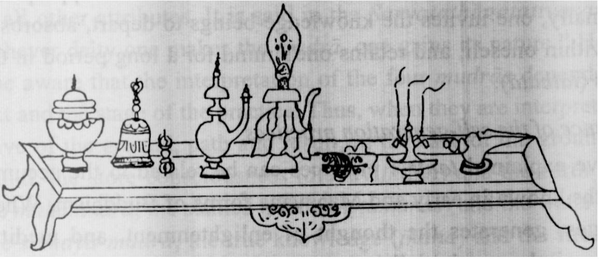

# II. *VISUALISATION OF THE VICTORIOUS VASE*67

This section explains the visualisation of one single vase replete with a set of deities and the performance of appropriate recitations. The visualisation method, which is detailed here, represents an abridged version of this particular type of visualisation. In more elaborate rituals, one uses a set of five or more vases. When one uses a set of five vases, in each vase one visualises one of the five Buddhas either alone or accompanied by a group of deities appertaining to his retinue as specified in the particular maṇḍala which is engaged during the ritual. When one uses more than five vases, one arranges one vase for each deity or one vase for each group of deities included in the particular maṇḍala.

## *Characteristics of the victorious vase*

The vase, which contains deities, is called the victorious vase. 68 According to the *Vajra*ḍā*ka-tantra*, it should be made from gold, silver, copper or clay, and its capacity should be one droṇa, which is approximately two pints. According to the *Vajram*ālā*bhidh*ā*na-tantra*, the circumference of the vase's belly should be sixteen fingers, the total height twenty fingers from the base up to the lip, and the lotus-spout and the lip should measure two fingers each. The vase must not be defective in any way or blackened at the base. According to the prevailing tradition, it should be filled with pure water and twenty-five or fifteen articles. 69 The neck of the vase should be fastened with pieces of silk of five colours, and the spout should be adorned with leaves and fastened with a garland of flowers. The vase should be marked with the symbols of the five Buddha families, and with a *vajra* symbolising the mind-*vajra* of all the Buddhas.

The vase as such is said to epitomise the non-duality of the five Buddha wisdoms. The lack of blackness at its base symbolises the purity of the five Buddha wisdoms, the large belly symbolises their vastness, and the long neck

<sup>!!!!!!!!!!!!!!!!!!!!!!!!!!!!!!!!!!!!!!!!!!!!!!!!!!!!!!!</sup> 67 *Kun rig rnam bshad*, 64b–70a.

<sup>68 <</sup>i>vijayakalaś*a / rnam rgyal bum*. 69 According to the Kriya Tantra the vase should contain fifteen articles: five kinds of grain, five kinds of incense, and five kinds of jewels. Some other sources specify twenty five articles: five kinds of medicine, five kinds of grain, five kinds of jewels, five kinds of incense, and five kinds of essence. The *bsNyen sgrub dbang bskur dkyil 'khor gyi bya ba spyi la nye bar mkho ba'i sgrub mchod skong rdzas rnam kyi gsal byed padma'i chung po* (included in *Rin chen gter mdzod*, Paro, 1976, vol. Thi, 579), gives the following list of the twenty five articles. The five kinds of grain: rice, barley, wheat, white sesame, Indian beans or peas. The five kinds of incense: camphor, cloves (*li-shi*), saffron, nutmeg, red or white sandalwood. The five jewels: (the text says that the best jewels are difficult to obtain, and that those of good quality include): gold, silver, copper, iron and tin. The five essences: tiger's claw (*vyagranakha*), rush (*himavati*), *kandakari*, *indrahasta*, and *samudraphena*.

symbolises their profundity. The five jewels symbolise the fulfilment of all wishes of living beings by means of the five Buddha wisdoms. The five medicines epitomise the power of the five Buddha wisdoms to heal the disease of the moral defilements of living beings. The five kinds of grain denote the rich harvest of virtues amassed during the lifeseries of living beings. It is said in some sources that the content of the vase represents all kinds of blessing, the substance from which it is made stands for the purity of virtues, the adorned spout indicates the potential acquisition of emancipation, and the fastened neck represents the determination to benefit living beings. The scent, incense, water, and flowers inside the vase are said to epitomise the *dharmadh*ātu. According to some texts, two-thirds of the vase should be filled with water, and the remaining one-third should be empty. The two-thirds filled with water are said to epitomise the two kinds of the rūpakāya, and the empty one-third is said to epitomise the *dharmak*āya.

# *Visualisation of the victorious vase*

In order to dispel the obstructive spirits one makes the *mudr*ā and recites the *mantra* of Vajrayakṣa. Next, one executes the meditational process of visualising the vase as being produced from emptiness, and as being made from perfect jewels. First, one purifies the actual vase in emptiness by reciting "Oṃ *pure by nature are all dharmas*" and so forth. Next, one envisages that from the nature of emptiness there arises the syllable Paṃ, and from it, the letter A resting on a lotus. From the letter A there emerges the syllable Hūṃ resting on a lunar disc. The syllable Hūṃ becomes transformed and gives rise to a perfect vase made of jewels, vast and large, having its neck fastened with a divine garment, its mouth adorned with a wish-granting tree, and its interior filled with pure water and all the required articles.

# *Visualisation of deities inside the vase*

First, one envisages the thrones of the five Buddhas placed inside the above produced victorious vase. One throne is positioned at the centre and four thrones are positioned towards the four cardinal directions. The throne at the centre is supported by eight lions, the one to the east by eight elephants, the one to the south by eight stallions, the one to the west by eight peacocks, and the one to the north by eight *garu*ḍas. On the top of the thrones, one envisages lotuses and lunar discs. In the case of the seats for the remaining deities of the maṇḍala, one envisages lotuses with lunar discs, which float on the surface of the water, and which are duly distributed in a similar way to the seats arranged in the maṇḍ*ala* visualised at the front.

Next, one should envisaged all the thirty-seven deities of the Sarvavid maṇḍ*ala* as being seated inside the vase on their appropriate thrones, beginning with Sarvavid Vairocana and ending with Vajraghanṭā. After that, one summons

the knowledge-deities, using the method of dispersing and converging rays of light. One envisages them gathered in a palace at the front, and one gratifies them with mentally produced offerings. Next, one merges the knowledge-deities with the pledge-deities seated inside the vase. One seals the deities on the three places of the their bodies with the *mantra* and *mudr*ā of the Buddha's Body, Speech and Mind. After that, one executes in one's mind the consecrations with the appropriate *mantras* and *mudr*ās, and one presents the items of worship, starting with the water for the face and concluding with the sounds of music. Finally, one executes the five mahā*mudr*ās, rings the bell three times, and recites verses of praise.

The five mahā*mudr*ās are executed in the following ways. In the case of Vairocana, one rings the bell with the left hand held at the heart, and one holds the *vajra*  in the right hand positioned above the bell. In the case of Amitābha, one places the right hand together with the *vajra* on the lap. In the case of Amoghsiddhi, one makes the gesture of protection with the right hand. In the case of Akṣobhya, one makes the gesture of touching the earth by touching the right knee. In the case of Ratnasaṃbhava, one makes the gesture of giving by moving the hands from the left knee towards the right side. Finally, one shakes the *vajra* and rings the bell.

# *Recitations*

It is said in the Caryā Tantra that the recitations over the vase should be performed one hundred and eight times. (68a). Following the general practice, first one recites the root *vidy*ā one hundred and eight times for all the deities. After that, one recites the *mantras* of individual deities, if possible also one hundred and eight times. If one is unable to recite them one hundred and eight times, one should recite them at least three times or as many times as possible.

At the end of reciting the *mantras*, one offers the items of worship and recites the verses of praise. After that, one dismantles the maṇḍ*ala* inside the vase by inviting the knowledge-deities to depart to their sphere, and by dissolving the pledge-deities into light. Finally, one blesses oneself by reciting three times the hundred syllables of Vajrasattva.

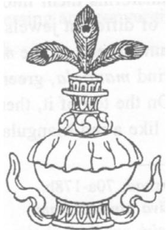

# III. *VISUALISATION OF THE MA*ṆḌ*ALA AT THE FRONT*70

The sā*dhana* of deities (70a) arranged inside a maṇḍala positioned at the front of oneself is executed in four consecutive stages: 1. visualisation of the maṇḍala, 2. worship of the deities, 3. entry into the maṇḍala and self-consecrations, and 4. activities of selfperfecting and recitations.

# 1. *Visualisation of the* maṇḍala

The evocation of the maṇḍala can be executed by following either short or long methods. When one follows the short method, one summons the deities by dispersing and converging rays of light, and one requests them to rest above the drawn maṇḍala. Next, one displays their gestures, offers them the items of worship, and makes them enter inside the drawn maṇḍala. When one follows the long method, first one visualises the maṇḍala palace and the pledge-deities. After that, one summons the knowledge-deities and executes all the remaining activities, just as they are detailed here below.

# *Visualisation of the* maṇḍala *foundation*

Prior to the production of a palace as the foundation for the deities, one should expel from the evocation place all obstructive spirits with the *mantra* and *mudr*ā of Vajrayakṣa. Next, one pronounces "Oṃ Ṣa" and "Oṃ *I am by my nature the knowledge-vajra of voidness*,"71 and without taking the maṇḍala as one's mental object, one envisages emptiness in the form of clear light. It is said in the *Sarvadurgatipari*ś*odhana* that the syllables Oṃ Ṣa denote the primary name of emptiness. In both *mantras*, the syllable Oṃ expresses a promise72 to meditate on emptiness. The second *mantra* represents the emptiness of all the *dharmas* included within saṃsāra and *nirv*āṇa. It is a double emptiness, which denotes an absence of the ā*tman* within the *dharmas*, and within the person (*pudgala*). When these two types of ā*tman* are completely eliminated, the essence of the mind (*citta*) arises and shines forth with the primordial knowledge. Although the mind arises, it essentially abides in the *vajra*-nature, which cannot be split open by discursive thoughts. It is from this kind of emptiness that one generates the syllables Oṃ Bha, and transforms them into a replica of Mount Sumeru surmounted by a palace made of different jewels. The syllable *Bha* stands for "existence" (*bhava*). Mount Sumeru rests on the maṇḍ*alas* made of the primary elements. The lowest is the wind maṇḍala, green in colour and shaped like a small bowl filled with grain. On the top of it, there is the fire maṇḍala, red in colour and triangular in shape like a red triangular *bali*. The third is the water

!!!!!!!!!!!!!!!!!!!!!!!!!!!!!!!!!!!!!!!!!!!!!!!!!!!!!!!

<sup>70 <</sup>i>mdun bskyed. *Kun rig rnam bshad*, 70a–178b.

<sup>71</sup> Oṃ ś*unyat*ājñā*navajra svabh*ā*va atmako 'ham*. 72 *pratijñ*ā */ dam bca' ba*.

maṇḍala, white in colour and round in shape like a drum. Above that, there is the earth maṇḍala, yellow in colour and square like a barley vessel. The earth maṇḍala is surmounted by Mount Sumeru, square in shape, and made from crystal73 on the eastern side, lapis lazuli74 on the southern side, rubies75 on the western side, and gold76 on the northern side. The summit of Mount Sumeru is overlaid with the *vajra*-ground, white in colour, square in shape, and having a crossed *vajra* at the centre. The ground is divided into twelve enclosures which epitomise the twelve links of dependent origination. On the top of the *vajra-*ground, one generates the maṇḍala palace. At the centre of the palace one envisages a lion throne, to the east an elephant throne, to the west a peacock throne, to the south a horse throne, and to the north a *garu*ḍa throne. On the top of each throne, one envisages a lotus and a lunar disc. On the surrounding areas, one envisages the seats for the remaining deities of the maṇḍala.

## *Evocation of the pledge-deities*

The evocation of the resident deities77 can be done either by reciting the heart-*mantras*78 alone or by executing the visualisation of dispersing and converging rays of light.

In the first case, one pronounces "Oṃ *Sarvavid purify and destroy all the obstructions H*ūṃ Phaṭ" 79 and envisages the lord Sarvavid Vairocana seated on the lion throne at the centre. After that, one applies one's mind to the places of the remaining deities, and pronouncing verbally their heart-*mantras*, one generates them one by one.

When one generates the deities by dispersing and converging rays of light, one produces with one's mind the heart-*mantra* of Vairocana, and one envisages it resting on his throne and being surrounded by the basic *vidy*ā. One disperses from it rays of light through which one performs the activities for the benefit of all living beings by executing the twelve acts of the Buddha. Upon completing the twelve acts of the Buddha, one converges the rays of light, gathers them within the *mantra*-syllables, and generates the bodily form of Vairocana. One follows this pattern for each deity of the maṇḍala. At the centre of each deity's seat, one envisages its *heart*-mantra surrounded by the basic *vidy*ā, and then executing the activity of dispersing and converging rays of light, one generates the bodily forms of the deities.

<sup>!!!!!!!!!!!!!!!!!!!!!!!!!!!!!!!!!!!!!!!!!!!!!!!!!!!!!!!</sup>

<sup>73 <</sup>i>sphaṭ*ika / shel*. 74 vaiḍūrya. 75 *padmar*āga. 76 *kanaka / gser*. 77 *rten-pa lha*. 78 hṛ*daya / snying po*. 79

oṃ *sarvavit sarv*ā*vara*ṇā*ni vi*ś*odhaya hana h*ūṃ phaṭ.

The bodily appearances of the deities and their arrangement in the maṇḍala are as follows. (78a)

#### *Five Buddhas*

Centre: Sarvavid Vairocana who is identified with one's *guru*. He is white because he abides in the nature endowed with two kinds of purity. Since he has accomplished the four Buddha-bodies, and since he constantly teaches the Dharma to the adepts of the four Buddha families, he has four white faces. Since he mainly performs the pacifying activities, his root face is turned towards the east. In order to indicate that although he exhibits various displays of his body and knowledge, but essentially never departs from the *dharmak*āya, his two hands are placed in the meditation posture. Since he resides in the body of non-dual union (*yuganaddha*), which does not rest within the confines of the appeased existence, his legs are placed in the crossed *vajra*-posture (*vajra-parya*ṅka).

East: Srvadurgatipariśodhanarāja generated from the *mantra* "Oṃ *Sarvavid* Hūṃ." His body is white with a touch of red, and he holds his hands in the posture of meditation. He is the king of the highest consecrations.

South: Ratnaketu generated from the *mantra* "Oṃ *Sarvavid Pha*ṭ." His name epitomises the empowerment of transcendent qualities and the bestowal of all wishes. He is blue in colour and sits in the meditation, which bestows the highest attainments. He makes the gesture of giving with his right hand, and the gesture of meditation with his left hand.

West: Śākyamuni generated from "Oṃ *Sarvavid* Āḥ." He is yellow in colour and makes the gesture of preaching as a sign that he constantly proclaims the Dharma, which subdues living beings.

North: Vikasitakusuma generated from "Oṃ *Sarvavid Tratha*." He is green in colour. He sits in the type of meditation through which he protects living beings against the fears of saṃsāra. He makes the gesture of protection with his right hand, and the gesture of meditation with his left hand.

All five Buddhas sit with their legs crossed and wear the attires and garments similar to those of Vajrasattva. As the presiding Buddhas of the five Buddha families, they represent the Mind of Mahāvairocana in the form of the five wisdoms manifested as the rūpakāya.

## *Buddha goddesses*

South-east: white Locanā generated from "Oṃ *Buddha-Locani H*ūṃ." She is called "Eye" because she epitomises the eye of wisdom, and as a sign of sealing with the eye of wisdom through the proclamation of the Dharma out of compassion for living beings, in her right hand she holds a wheel marked with an eye.

South-west: blue Māmakī generated from "Oṃ *Vajram*ā*maki* Trāṃ." Since she bestows the *vajra*-diadem consecration on all the Buddha families, she is called "Affection." Since she seals all of them with the five wisdoms as the Buddha Mind, she holds a five-pronged *vajra* in her right hand positioned at the heart.

North-west: red Pāṇḍaravāsinī generated from "Oṃ *Vajrap*āṇḍ*are dehi dehi saddhi bodhi lokitara*ṃ*ba Sv*āhā." As a symbol of the power of wisdom free from the subject and object dichotomy, her upper body is clad in a white garment, and this is also the reason why she is called "Lady in White Garment." As a sign of sealing all the Buddha families with the pure wisdom of the Buddha Speech, she holds a stalk of the red lotus in her right hand placed at the heart.

North-east: green Tārā generated from "Oṃ *Vajrat*ā*re tutt*ā*re ture H*ūṃ Hūṃ Hūṃ *Sva Sva Sva Sv*āhā." Since she liberates all living beings from saṃsāra, she is called "Saviouress." As a sign of sealing everything with the perfect activities of all the Tathāgatas, she holds a green stalk of the *utpala* flower in the right hand placed on the right breast.

The Buddha goddesses hold lunar discs in their left hands resting on the seats to indicate that they remain inseparable from the non-dual path of wisdom and means. They sit with their legs crossed, have beautiful bodily appearances and loving dispositions. These four goddesses represent the four portals of liberation (*vimok*ṣ*amukha*) and the excellent qualities of Mahāvairocana's *dharmak*āya manifested in the form of the rūpakāya.

#### *Sixteen Vajrasattvas*

On the adjacent circumference, one generates the sixteen Vajrasattvas resting on lotuses and lunar discs.

To the east, one generates the four Vajrasattvas of the Vajra family from the syllables "Hūṃ Jaḥ Hoḥ Hūṃ."

Vajrasattva is called "Diamond" (*vajra*) because he represents the *dharma-*nature (*dharmat*ā) as emptiness of the mind. Since wisdom by its very nature is luminosity, he is "Being" (*sattva*). Through wisdom, his mind abides in the absolute sphere (*dharmadh*ātu), and through compassion, he applies his mind for the benefit of living beings. Since he incorporates the being-body (*sattvak*āya), which comprises the unity of wisdom and compassion, he is Vajrasattva whose body is white. As a sign of being endowed with the nature of the timeless thought of enlightenment imbued with the five wisdoms, and since he becomes self-manifested in order to teach other living beings, he holds a five-pronged *vajra* and a bell.

Vajrarāja is yellow and holds a noose. He is the "Vajra-king" of the whole Vajra family on account of summoning all the Buddhas. He holds a noose as a

sign of gathering all living beings by means of the four means of conversion (saṃ*grahavastu*), and also because he summons all the Tathāgatas.

Vajrarāga is red and holds a bow with a strung arrow. Since he delights the Buddhas by contemplating the thought of enlightenment, and since he exerts his affection for the benefit of living beings, he is called "Vajra-passion." He holds the arrow of wisdom strung on the bow of means, which jointly epitomise the destruction of discursive thoughts and duality.

Vajrasādhu is green and holds a five-pronged *vajra*. Since he delights the Buddhas by accomplishing the works of the perfect enlightenment free from misconceptions (*vipary*āsa), and since he brings joy to living beings, he is called "Vajragood." As a sign of delighting the Buddhas by saying "Good," he holds a five-pronged *vajra* in his hands placed at the heart, and makes the sound "Good" by snapping his fingers.

The above four Sattvas, as the manifestations of Mahāvairocana's Mind, represent the great thought of enlightenment. Taken individually they represent the thought of enlightenment, the agency for summoning the Buddhas, the wisdom that brings delight, and the great joy. It is so because of the following statement in the *Vajra*ś*ekhara-tantra*: "Vajrasattva arises through the generation of the thought of enlightenment. That thought as the *vajra*-essence becomes manifested in a fourfold manner."

On the four spokes to the south, one generates the four Vajrasattvas of the Ratna family from the syllables "Trāṃ *Rya Bhri Ha*."

Vajraratna is yellow and holds a wish-granting jewel and a bell. He is called "Vajra-jewel" because he personifies the cause, which perfects the minds of living beings through the knowledge having the nature of pure generosity. As a sign of perfecting the meditation of all the Buddhas, and of fulfilling all wishes in this and transcendent worlds, he holds a wish-granting jewel surmounted with a five-pronged *vajra* in his right hand placed at the forehead, and a bell in the form of a stalk in his left hand resting on the hip.

Vajratejas is red-golden and holds a solar disc. As he is endowed with the great radiance of wisdom, which brings liberation and destroys the darkness of ignorance, he is called "Vajra-radiance." As a symbol of manifesting all the Tathāgatas and bringing living beings to buddhahood, he holds a solar disc in his right hand placed at the heart, and rests his left hand on the seat.

Vajraketu is blue like the sky and holds a jewel-banner. Since he upholds the victory banner of the wish-granting jewel epitomising the ten powers (*bala*), the four grounds of self-confidence (vaiśā*radya*), and other Buddha qualities, he is called "Vajravictory-banner." As a sign of perfecting all the beneficial and happy aspirations of living beings through the power bestowing benevolence, he holds

the banner of the wish-granting jewel in his right hand, and his left hand rests on the seat.

Vajrahāsa is white and holds a rosary made of ivory. Since he makes the Buddhas laugh, and since he invigorates the Bodhisattvas with the wonderful smile of delight permeated with the sorrow-free joy, which cannot be ascertained by mental reflections, he is called "Vajra-laugh." As a sign of delighting all living beings with the highest joy of the senses through bestowing the Dharma, in his right hand he holds an ivory rosary between two *vajras* raised on the right side of his face, and his left hand rests on the seat.

The above four Sattvas, as the manifestations of Mahāvairocana's Mind, represent four aspects of the perfection of generosity (dānapā*ramit*ā) having the nature of the consecrations. It is on account of the double accumulation of merit and wisdom that they are renowned as Vajraratnas. The essence of merit is like a jewel having four different qualities. The perfection of generosity is said to have here the nature of the consecrations because the four aspects of generosity, like the consecrations, wash away and remove the impurities inducing the adherence to the subject and object dichotomy, the causes of fear, hatred, and the forfeitllre of the Dharma.

To the west, one generates the four Vajrasattvas of the Padma family from "Hrīḥ Dhīḥ Kruṃ Bha."

Vajradharma is white with a touch of red, and holds a lotus. Since he dispenses the radiant light of the holy teachings by means of the pure knowledge of the Buddha's Dharma, he is called "Vajra-doctrine." As a sign of inducing the perception of the nondual knowledge through teaching living beings the doctrine that all the *dharmas* are pure, in his left hand he holds a lotus which he unfolds at the heart with his right hand.

Vajratikṣṇa is blue and holds a sword and a book. He is called "Vajravehemence" because he swiftly destroys the two kinds of obstructions (ā*vara*ṇa) with the non-dual wisdom. As a token of destroying suffering (duḥkha) and the causes of suffering of living beings by means of the great wisdom, he holds a sword in his right hand, and a Prajñāpāramita book in his left hand.

Vajrahetu is yellow and holds an eight-spoked wheel. As he is the agent who teaches the great maṇḍala of all the Tathāgatas, he is called "Vajra-cause." As a token of preventing living beings from swerving from the thought of enlightenment through turning the Dharma-wheel, which manifests the great maṇḍala of the Buddhas, he turns an eight-spoked wheel with his right hand positioned at his heart, and his left hand rests on the seat.

Vajrabhāṣa is red and holds a tongue in the form of a *vajra*. He is called "Vajratalk" because without swerving from the Buddha's non-discursive Mind (*aprapañcacitta*) and suchness (*tathat*ā), he adheres to the non-discursive truth

through enunciating discursive words. Since he explains the things through the words having implicit meanings (neyā*rtha*) in the sphere of the relative truth (saṃvṛti), but does not verbalise the absolute truth (*param*ā*rtha*), and since he induces the attainment of the four special knowledges (*pratisa*ṃvid), in his right hand he holds a tongue marked with a *vajra*, and his left hand rests on the seat.

The above four Sattvas, as manifestations of Mahāvairocana's Mind, represent four aspects of the perfection of wisdom (*prajñ*āpā*ramit*ā), namely the non-dual meditation, the pristine knowledge, the knowledge to teach the Dharma, and the knowledge of the Buddha's unuttered Speech.

To the north, one generates the four Vajrasattvas of the Karma family from the syllables "Kaṃ Raṃ Kṣaṃ Saṃ."

Vajrakarma is variegated in colour, and holds a twelve-pronged viś*vavajra* and a stalk epitomising a bell. His face and legs below the calves are white. From the face down to his waist, he is red-grey. His hands and waist are blue-grey, his thighs yellowgrey, and the rest of the body blue. Since he spontaneously performs the activities of all the Buddhas, he is called "Vajra-action." Since he worships the Buddhas with the energy (vīrya) of the three pure vehicles (*triy*āna), and since he pursues the activities which benefit living beings, he holds a twelve-pronged viś*vavajra* in his right hand positioned at the heart, and in his left hand he holds a bell in the form of a stalk.

Vajrarakṣa is yellow and holds a *vajra*-cuirass. Since he generates the energy which strives for the supreme enlightenment and thus protects living beings from falling into the stages of the śrā*vakas* and Pratyeka Buddhas, he is called "Vajra-protection." As a sign of protecting living beings from the Hīnayāna and the existence in the manifested world by means of the cuirass of energy, which combines wisdom and means, he holds a cuirass (*kavaca*).

Vajrayakṣa is black and has a large belly and protruding fangs. Since he consumes all the sufferings of phenomenal existence, he is called "Vajra-monster." It is through the boundless compassion that he has assumed such a demonic appearance. As a sign of destroying all the demons and adverse spirits (nā*yaka*), and making living beings fearless, he grasps with his hands the fangs, which protrude from his mouth and are marked with *vajras*.

Vajramuṣṭi is yellow and holds a five-pronged *vajra*. He is called "Vajra-fist" because he merges in suchness (*tathat*ā) the *vajras* of the Body, Speech and Mind of all the Tathāgatas through the application of the unchanging method. As a sign of perfecting in the absolute truth the totality of Bodies, Speeches and Minds arising from all the Buddha families, and of leading into the dynamic *nirv*āṇa (*aprati*ṣṭ*hitanirv*āṇa), he holds five-pronged *vajras* in his pledge-fists placed on the left hip.

The above four Sattvas, as manifestations of Mahāvairocana's Mind, represent the perfection of energy (vī*ryap*ā*ramit*ā) in the form of four knowledges with reference to the performance of worship, the dispensation of protection, the great expedient, and the execution of all the *mudr*ās.

#### *Goddesses of offerings*

On the four cardinal comers of the maṇḍala, beginning with the south, one should generate the first four goddesses of offerings from the syllables "Hūṃ Trāṃ Hrīḥ Aḥ."

Lāsyā is white in colour and holds five-pronged *vajras*. Since she enacts in a dramatic manner and openly rejoices in the timeless thought of enlightenment, she is called "Actress." As a sign of delighting the Buddhas through perfecting the meditation on the thought of enlightenment as a union of wisdom and means, she holds five-pronged *vajras* in her *vajra*-fists positioned on the left side of her face.

Vajramālā is yellow and holds a jewel-garland. Since she is adorned with a jewelgarland symbolising the consecration endowed with the perfect vision, she is called "Vajra-garland." As a sign of delighting the Buddhas with the worship consisting of the merit accumulated through morality and other virtues, she holds a jewel-garland with both hands.

Gītā is white-red and holds a lute (vīṇā). She is called "Song" because she sings the Dharma-song of the Buddhas, who steadfastly muse on the *dharmas* which are pure by nature. As a sign of delighting the Victorious Ones with the sound of the vast and profound Dharma, and of bringing living beings to maturation, she plays a lute with both hands.

Nṛtyā is green and holds a three-pronged *vajra*. Since she displays in a dancing manner the energy (vīrya) which diffuses the secret and great thought of enlightenment of all the Buddhas, she is called "Dance." As a sign of delighting the Buddhas with the perfect worship, which accomplishes the benefits of all living beings through the Buddha and other manifestations, she dances while holding in her hands a three-pronged *vajra*.

On the four intermediate comers, beginning from the south-east, one generates the remaining four goddesses of offerings from the syllables "Hūṃ Trāṃ Hrīḥ Aḥ."

Dhūpā is white and holds an incense vessel. Since she diffuses the pleasant speech of the perfection of wisdom, which delights the Victorious Ones, she is called "Incense." As a sign of showering the Buddha wisdom into the mental flows of living beings by means of incense which pervades the *dharma*-sphere (*dharmadh*ātu) and generates a sorrow-free joy, she holds a vessel filled with incense.

Puṣpā is yellow and holds a basket of flowers. Since she is adorned with the flowers of meditation imbued with the seven limbs of enlightenment, she is called "Flower." As a sign of adorning herself and other living beings with the flowers of mindfulness and the other limbs of enlightenment, she holds a basket of flowers, which she scatters with her right hand.

Lokā (or Dīpā) is red-grey and holds a blazing lamp. Since she discharges the radiant light of the Dharma-eye, which discloses the unimpeded and pure Dharma, she is called "Lamp." As a sign of diffusing the Dharma-radiance into the ten directions through the power of aspiration (praṇidhāna), she holds a lamp with a bright flame.

Gandhā is green and holds a conch filled with scent. Since she is permeated with the scented ointment of the five pure aggregates possessed by those skilled in expedients, she is called "Scent." As a sign of delighting the Buddhas with the perfect worship, which generates the scented ointment of liberation within the mental flows of all living beings, she holds a conch filled with scent which she offers to the Buddhas.

The above goddesses of offerings epitomise the excellent qualities of Mahāvairocana's Mind.

## *Four guardians of the ma*ṇḍala *gates*

Inside the portals of the maṇḍala, beginning from the east, one generates the four guardians of the maṇḍala portals from the syllables "Jaḥ Hūṃ Vaṃ Hoḥ." (87a)

Vajrāṅkuśa is white and holds a hook. Since he summons the noble ones and living beings from their appropriate places with the hook of the thought of enlightenment, he is called "Vajra-hook." As a sign of summoning the Buddhas with the great hook, and showing them the maṇḍala of submission, he holds a hook marked with a *vajra*.

Vajrapāśa is yellow and holds a noose. Since he leads towards the desired goals with the noose of the ten perfections, which induce enlightenment, he is called "Vajranoose." As a sign of leading the *dharmak*āya, understood as the knowledge of the Buddhas, into the maṇḍala of the pledge-deities in order to benefit the potential converts, he holds a noose marked with a *vajra*.

Vajrasphoṭa is red and holds an iron chain. He is called "Vajra-chain" because he fetters people to the Mahāyāna with the chain of the perfection of wisdom. Although the Buddhas are free from all fetters, as a sign of binding together the pledge-deities and the knowledge-deities into one indistinguishable union in order to benefit the potential converts, he holds an iron chain marked with a *vajra*.

Vajraghaṇṭā (or Vajrāveśa) is green and holds a *vajra*-bell. Since he casts down and subdues all the Buddhas with the knowledge, which perceives all the *dharmas* as being pure light by their nature, he is called "Vajra-bell." As a sign of subduing the pledge-deities and the knowledge-deities fused together through the knowledge-realm of clear light, he rings a *vajra*-bell with his right hand positioned over his head, and his left hand rests on the seat.

The above four guardians of the maṇḍala portals also represent the manifestations of the excellent qualities of Mahāvairocana's Mind.

Vajrasattva and all other deities are adorned with different kinds of ornaments and wear upper garments made of silk. Except for Vajrayakṣa, all the deities have peaceful and benign appearances. As a symbol of their energy (vīrya) being engaged to accomplish the double goal through the path of wisdom and means united together, they sit with their legs evenly crossed (*sattvaparya*ṅka) on lotuses and lunar discs. The above interpretation of the deities accords with the meditational devices derived from the *Sarvatath*ā*gatatattvasa*ṃ*graha* and *Vajra*ś*ekhara tantras*.

## *Remaining deities of the ma*ṇḍala

!!!!!!!!!!!!!!!!!!!!!!!!!!!!!!!!!!!!!!!!!!!!!!!!!!!!!!!

On the next circumference of the maṇḍala, one generates the sixteen Bodhisattvas of the Good Age. They are generated in order to bring blessings and to lead all living beings to the highest enlightenment. All these Bodhisattvas have one face, two hands and sit with their legs crossed. As a symbol of being endowed with the five wisdoms, they hold *vajras*  with their right hands at the breasts. As a symbol of teaching other people, they hold bells in their left hands placed on the hips. They direct their minds towards those who are to be converted through the thought of enlightenment. They are of benign dispositions and wear jewel diadems and other ornaments. The four Bodhisattva positioned on the eastern side are blue, the four on the southern side are golden, the four on the western side are red, and the four on the northern· side are green. 80

Further outside (90a), one generates the sixteen great śrā*vakas* and the twelve Pratyeka Buddhas. The śrā*vakas* hold alms-bowls in their left hands and mendicant staffs in the right hands. They wear yellow monastic robes and sit with their legs crossed. They direct their thoughts towards those who are to be subdued through the Vinaya. They are essentially the best śrā*vaka* manifestations of Mahāvairocana's non-dual wisdom. As there are sixteen different aspects of the Four Noble Truths, they are sixteen in number. The Pratyeka Buddhas have ūṣnīṣas on their heads and wear monastic robes. They

<sup>80</sup> For their names but different iconic descriptions, see *Sarvadurgatipari*ś*odhana*, Delhi, 1983, 29–31.

hold mendicant staffs with their right hands and books with their left hands. They are twelve in number in correspondence to the twelve links of dependent origination (*prat*ī*tyasamutp*āda).

The remaining deities of the maṇḍala include the sixteen wrathful deities, their messengers and slaves, the protectors of the directions, the eight great gods, and other minor deities. (92a)

## *The descent of the knowledge-deities*

Next, one applies one's mind to the descent of the knowledge-deities whom one summons from the absolute sphere and leads into the maṇḍala of the pledge-deities. (101b) Inside the heart, one envisages the seed-syllable Hūṃ from which there disperse rays of light and pervade the ten directions. It is with this light that one admonishes the Buddhas and Bodhisattvas of the ten directions, who abide in the sameness of the *dharmak*āya of the undivided *dharmadh*ātu and knowledge. While doing this, one envisages the rūpakāya of Sarvavid's divine host emerging in the form of the maṇḍala foundation, the palace, the protective circle, and the thirty-seven pledge-deities. Making the gesture of the *vajra-*gathering and snapping the fingers one says: "Oṃ *vajragathering*." 81 Holding the *vajra* and the bell together with some incense, one recites the following verses:

> "O gods, you act as temporal and ultimate protectors of all living beings, and destroy demons and their cruel troops by means of various devices and expedients. You duly know all things according to their particular states of appearance and capacity. O Lord endowed with the nature of knowledge and compassion, please come to this place together with your retinue. O Lord Vairocana, at the time of treading the ancient path through many existences during three countless aeons, out of concern for living beings and for their benefit, and out of compassion, you have purified the non-dual path of wisdom and means. I ask you to exert yourself spontaneously for the benefit of living beings by means of the rūpakāya, but without swerving from the *dharmak*āya." (102a)

One summons the deities by reciting the heart *mantras* of the four guardians of the maṇḍala gates: "Jaḥ Hūṃ Vaṃ Hoḥ" and "O *Lord*, *come here*, *come here*. *Great Compassionate One behold Ho*ḥ. *You are the pledge*." 82 Having duly summoned the deities, one envisages them resting in the sky at the front. One disperses from their hearts a host of white goddesses with whom one presents the water for the face and other offerings. While presenting the offerings, one recites the following verses and *mantra*:

!!!!!!!!!!!!!!!!!!!!!!!!!!!!!!!!!!!!!!!!!!!!!!!!!!!!!!!

<sup>81</sup>

oṃ *vajrasam*ājaḥ. 82 *bhagav*ā*n ehy ehi*, mahā*karu*ṇ*ika d*ṛś*ya ho*ḥ, *samayas tvam*.

"O Lord, it is good that you have come here. Since you have consented to come, a great benefit has accrued to living beings, as it is a great and auspicious occasion for us to amass merit through worshipping the Buddhas. Having received from me this water for the face, please apply your thoughts, accomplish all the desired goals, and bestow them while you are here.

O Lord, having come here, I ask you to reside in an undivided manner inside this maṇḍala of the pledge-deities. Having received from me this water for the face, please reside, I beg you, in this great maṇḍala. Oṃ *the space-pledge of all the Tath*ā*gatas H*ūṃ Svāhā." 83

Acting in a similar manner, one disperses a host of goddesses with whom one presents the water for washing the bodies of the deities placed in the sky. Next, one offers them seats, scent, flowers, incense and other offerings.

Next, one places the *vajra*-palms (*vajr*ā*ñjali*) on the forehead, and reciting the relevant *mantra*, one envisages oneself making the gestures of Body, Speech and Mind: "Oṃ *I make the vajra-bond by bowing before the Body*, *Speech and Mind of all the Tath*ā*gatas*." 84

Next, reciting "Oṃ *Vajr*ākuś*a Ja*ḥ" and making the gesture of Vajrāṅkuśa, one summons the protective retinue of the knowledge-deities, and the entire palace, to approach the corresponding pledge-deities. Reciting "Oṃ *Vajrap*āśa Hūṃ" and making the gesture of Vajrapāśa, one places the knowledge-deities on the spots between the eyebrows of the corresponding pledge-deities. Saying "Oṃ *Vajraspho*ṭa Vaṃ" one unites together the two groups of deities. Finally, reciting "Oṃ *Vajr*āveśa Hoḥ" and making the gesture of Vajrāveśa, one envisages the two groups of deities as being merged into one indistinguishable union.

Next, one makes the four *mudr*ās in order to merge together the pledge and knowledge deities, to bless one's mental dispositions, to execute the appropriate activities, and to stimulate one's body, speech and mind. The immediate aim of the four *mudr*ās is to enact the transformation into the Buddha's Body, Speech, Mind, and activities. Finally, one recites the *mantras* and makes the *mudr*ās of all the deities of the maṇḍala.

## 2. *Worship of the deities*

!!!!!!!!!!!!!!!!!!!!!!!!!!!!!!!!!!!!!!!!!!!!!!!!!!!!!!!

The transcendent deities (*lokottara*) are worshipped with offerings and verses of praise, and the mundane deities (*laukika*) are gratified with *balis*. (115b)

The offerings presented to the higher deities are divided into two basic categories: outer and secret offerings. The outer offerings are presented bymaking the appropriate *mudr*ās and reciting the *mantras* while meditating. So far as the meditation is concerned,

<sup>83</sup> oṃ *sarvatath*ā*gatagaganasamaya h*ūṃ svāhā. 84

oṃ *sarvatath*ā*gatak*āyavā*kcittapra*ṇā*mena vajrabandha*ṃ *karomi.*

one disperses from one's heart countless goddesses of worship85 with whom one presents the appropriate offerings to the deities of the maṇḍala. One should envisage that one is presenting all the offerings that are procurable in the entire sphere of the ten directions. It is said that when the offerings are presented in this manner, they epitomise the true and undifferentiated offerings. The first set of offerings comprises the two kinds of water, the five articles of worship and music. Taken together, they form a set of eight offerings: 1. water for the face (*argha*), 2. water for the feet (pādya), 3. flowers (puṣpa), 4. incense (dhūpa), 5. lamps (ā*loka*), 6. scent (*gandha*), 7. food (*naivedya*), and 8. sound (ś*abda*).

When offering the water for the face one makes an appropriate gesture and recites:

> "Whatever amount of the eight offerings of worship is procurable in the sphere of the ten directions, vast and boundless like an ocean, I arrange them with devotion, and bless them with their *mantras* and *mudr*ās, and with the three samā*dhis*. I take all these offerings of worship and duly present them to the host of the countless Buddhas and Bodhisattvas, who conquered Māra, the lord of death. I request you to assume congenial dispositions through the power of compassion, and to accept these offerings of worship with pleasure and satisfaction. Please grant all the wishes in accordance with the circumstances of living beings.

> Oṃ *all the Tath*ā*gatas receive this water for the face*. *The concurrence of dispersing the cloud-mass of worship H*ūṃ."

In a similar manner, one offers flowers and all the remaining articles of worship as listed above.

Next, one offers worship with the following twenty-five articles, which serve as articles of clothing, ornaments and dwellings for the deities: (108a) diadem (*muku*ṭa), earrings (kuṇḍala), necklace (harṣa), shoulder ornaments (*avah*āra), armlets (keyūra), wristlets (*parih*āṭaka), finger ring (vā*laka*), anklets (pā*dabhara*ṇa), umbrella (*chatra*), banner (*dvaja*), silk-lappets (paṭaka), veil (paṭadāma), yak tail (*camara*), canopy (vitāna), lion-seat (siṃhā*sana*), bedding (ś*ayan*ā*sana*), round dwelling (*parima*ṇḍ*aladhanya*), square dwelling (*ameyacaturtha*), two-storeyed house (*dvik*ūṭā*gara*), moon seat (*candr*ā*sana*), flowers (puṣpa), musical instrument (vīnā), scent (*gandha*), food (*naivedya*), and garment (*vastra*). All these articles are offered in due order with their appropriate *mantras* and *mudr*ās. Thus, the first article, the diadem, is offered with the following *mantra*: "Oṃ *the concurrence of dispersing the cloud-mass of worshipping all the Tath*ā*gatas with diadems H*ūṃ." All the remaining articles

<sup>!!!!!!!!!!!!!!!!!!!!!!!!!!!!!!!!!!!!!!!!!!!!!!!!!!!!!!! 85 <</sup>i>mchod pa'i lha mo.

are offered with the same *mantra*, which one modifies by replacing the word 'diadem' with the names of the offered articles.

Next, one presents the secret offerings. First, one meditates on the excellent qualities of the deities. Next, one disperses from one's heart a host of the eight goddesses, Lāsyā and the others, and one makes their *mudr*ās and recites their *mantras*. 86

Next, one offers the seven insignia of a universal monarch (*saptaratna*). This presentation is called the worship with the best celestial items. One envisages the seven precious jewels filling the sky, and then making their *mudr*ās and reciting their *mantras*, one offers them to the deities of the maṇḍala. The seven insignia are: wheel (*cakra*), elephant (*hasti*), horse (aśva), gem (maṇi), queen (strī), minister (mahāmātya), and general (khaḍga).

Next, one offers the items which gratify the five senses. 87 These items are envisaged as five goddesses who hold the articles indicative of the five senses. They are also offered in the same manner as the previous offerings.

| Sense organ | Goddess | Symbol |
| --- | --- | --- |
| sight | Vajrarūpā | mirror |
| sound | Vajraśabdā | lute |
| smell | Vajragandhā | conch with scent |
| taste | Vajrarasyā | food |
| touch | Vajrasparśā | piece of silk |

Finally, holding the *vajra* and the bell, one recites verses of praise. The praises are directed mainly towards the thirty-seven principal deities of the maṇḍala, beginning with Sarvavit Vairocana and ending with Vajraghaṇṭā. The praises of the Buddhas consist in extolling the five wisdoms, and those of the other deities concentrate on describing their symbols, the significance of their names, and the works which they perform.

Next, one offers *balis* to the mundane deities. (14la) The protectors of the cardinal directions (*dikp*āla) are the first to receive their *bali*, which is round and shaped like a lotus, white in colour and sprinkled with pure water. One protects it against obstructive spirits by making the *mudr*ā and reciting the *mantra* of Vajrayakṣa, and one makes it radiant with the *mudr*ā and *mantra* of Vajrānala. One envisages it as being placed on a large jewel vessel and imbued with ambrosia. Making the *vajra-bond* gesture and reciting three times "Oṃ *the letter A is the source of all the dharmas because of their primordial non-origination O*ṃ Aḥ Hūṃ," one envisages the *bali* as being endowed with all the qualities

<sup>!!!!!!!!!!!!!!!!!!!!!!!!!!!!!!!!!!!!!!!!!!!!!!!!!!!!!!! 86</sup> The *mantras* of the eight goddesses are: oṃ *vajral*ā*sye h*ūṃ; oṃ *vajram*ā*le tr*āṃ; oṃ *vajrag*īte hrīḥ; oṃ *vajran*ṛ*tye a*ḥ; oṃ *vajradh*ū*pe h*ūṃ; oṃ *vajrapu*ṣpe trāṃ; oṃ *vajr*ā*loke hr*īḥ; oṃ *vajragandhe a*ḥ. 87 *'dod yon lnga*.

required to gratify the deities. Holding the *vajra* and the bell, one summons the protectors of the cardinal directions by reciting their *mantra*, and one envisages them as taking their seats on lotuses. Next, one recites verses of praise, and finally, one offers them the *bali*. 88 The remaining lesser deities receive their *balis* and offerings in a similar manner.

# 3. *Entry into the ma*ṇḍala *and self-consecrations Preliminary activities*

One envisages one's root teacher and the chief deity of the maṇḍala as being inseparably united with Mahāvairocana. (155a) Perceiving oneself at the eastern gate of the maṇḍala, one generates in one's mind the wealth of the entire world consisting of Mount Sumeru, the four continents, the sun and moon, and all the divine and human riches, and one offers them as a preliminary fee. Holding a flower, one recites three times the following request:

> "O chief deity of the maṇḍala, you and my teacher are not differentiated. You are endowed with the great bliss free from misery. You are my teacher, who shows me the path of the perfect Buddhas. O teacher, I beg you to remember me with kindness just for one moment. O great protector, I aspire to reach the sphere of the Buddhas. Therefore, please bestow upon me the essence of the *mantra* vow, which is the secret pledge of the Vajrayāna as the foundation of the path. As the support of the *mantra* vow, grant me the Bodhisattva vow, which is bestowed through the appropriate ritual activities. As a further support, please grant me the prā*timok*ṣa vows as well as the three Vajrayāna refuges: Buddha, Dharma and Sangha. O protector, I ask you to lead me into the supreme Buddha-city, which is greater than the three liberations (*vimok*ṣ*atraya*)."

While meditating, one makes the confession of sins and rejoices in the roots of merit. Next, one takes the refuges, the prā*timok*ṣa vows, and the vow of raising the highest thought of enlightenment. (159b) After that, one envisages the chief deity while saying "*Pledge A*ḥ." 89 One visualises inside one's heart a lunar disc having the nature of the conventional thought of enlightenment set on benefiting living beings, and symbolising the perfect accumulation of merit and knowledge. Above the moon, one envisages a white five-pronged *vajra* epitomising the absolute thought of enlightenment understood as emptiness in the form of an empty space free from all manifestations of the *dharmas*. One also envisages the *vajra's* prongs blazing with rays of light endowed with the

<sup>!!!!!!!!!!!!!!!!!!!!!!!!!!!!!!!!!!!!!!!!!!!!!!!!!!!!!!! 88</sup> The *mantras* and the verses of praise of the protectors of the ten directions are translated in *Sarvadurgatipari*ś*odhana*, Delhi, 1983, 95–100.

<sup>89</sup> *samaya a*ḥ. The syllable Aḥ represents here the seed-syllable of the moon which epitomises the mind.

nature of the five wisdoms. One focuses one's mind so that it abides in the union of the conventional and absolute truths. In order to make one's mind firm, one envisages the chief deity placing its *vajra* on one's head and saying: "*Rejoice*, *you are the pledge Ho*ḥ. *Bliss in conformity with the vajra of attainments*." 90 After this, one receives the Bodhisattva vow and the vows of the five Buddha families. (161a) This is followed by the blessing with *mantras* and *mudr*ās. (162b) One envisages the chief deity pronouncing the *mantras* of the three Buddha families, placing their *mudr*ās on the three places of one's body, and transforming one's body, speech and mind into the Body, Speech and Mind of the Tathāgatas. One also envisages the chief deity placing his *vajra*-fists on the twenty-two places of one's body91 and pronouncing "Oṃ *Vajra consecrate in the knowledge-pledge H*ūṃ."92 While executing this visualisation, one perceives one's body as becoming endowed with the nature of the *vajra*, and oneself as being transformed into the body of Vajrasattva. One pronounces "Oṃ *I am Vajrasattva*" 93 and assumes the selfconceit of Vajrasattva. One recites a prayer for gaining buddhahood through following the Mahāyāna path.

In order to protect oneself, one envisages the chief deity placing the gesture of Trailokyavijaya on the three places of one's body while reciting the following *mantra*: "Oṃ. O *Wrathful Vajrasattva*, *Blazing Sun*, *Great Wrathful Vajra*, *bind bind*, *firmly bind*, *firmly bind*, *destroy destroy*, *annihilate annihilate all evil rebirths of living beings H*ūṃ Pha." 94 Through executing this procedure, one becomes blessed and protected against the obstructive spirits up to the time of receiving the consecrations. Such are the preliminary activities before entering the maṇḍala.

## *Entry into the ma*ṇḍala

As a fee for entering into the maṇḍala, one presents a maṇḍala offering. (165b) One envisages the chief deity saying "*Unfathomable H*ūṃ."95 As a sign of entering the maṇḍala, one repeats the above *mantra* and envisages one's eyes becoming covered with a red cloth, and oneself as receiving a garland of flowers in order to offer it at the time of encountering the deities of the maṇḍala. Pronouncing "Oṃ *Vajra bless H*ūṃ," 96 one envisages oneself as Vajrasattva.

!!!!!!!!!!!!!!!!!!!!!!!!!!!!!!!!!!!!!!!!!!!!!!!!!!!!!!!

<sup>90 <</sup>i>surati samayas tvaṃ hoḥ *siddhivajra yath*ā*sukha*. 91 heart, throat, mouth, forehead, ūrṇā, ears, crown of the head, shoulders, nose, waist, knees, feet, ankles, tip of the nose, eyes, and private part.

<sup>92</sup> oṃ *vajr*ā*dhiti*ṣṭ*ha jñ*ā*nasamaye h*ūṃ. 93

oṃ *vajrasattv*āham. 94

oṃ *vajrasattva krodha anal*ā*rka mah*ā*vajrakrodha drava drava vidrava vidrava sarv*āpāya nāś*aya n*āś*aya hara hara pr*ārṇā*ya h*ūṃ phaṭ. 95

agaṃbī*ra h*ūṃ. 96

oṃ *vajr*ā*dhiti*ṣṭ*ha h*ūṃ.

Holding a flower, and bowing towards the maṇḍala, one says "Oṃ *Vajra-pledge H*ūṃ," and while still holding the flower, one envisages oneself entering inside the eastern gate of the maṇḍala. In order to receive the wisdom consecration, one envisages the syllable Hūṃ emerging from the hearts of the maṇḍ*ala's* deities, and having the nature of the five wisdoms of all the Tathāgatas. The syllable Hūṃ descends and permeates one's body, and then emerges on a lunar disc inside one's heart. It rests inside one's heart without becoming separated from the wisdom syllable Hūṃ inside the hearts of the Tathāgatas. The chief deity places the *vajra*-bond gesture on one's heart and pronounces "Oṃ *Vajrapenetration H*ūṃ." 97 The actual descent of wisdom takes place after repeating this *mantra*  from ten up to one hundred times. In some commentaries, the descent of wisdom is achieved by visualising a *vajra* and a red letter A or the syllable Hūṃ and the letter A.

In order to make one's knowledge firm and to abide in the pledge, one envisages the chief deity placing his *vajra* on one's head and reciting "Oṃ *unequalled thrice-equal great pledge H*ūṃ." 98 The significance of this *mantra* is that while one is not equal in status to the deities and their good fortune (bhāga), by entering the maṇḍala one gains the great pledge of equality with the Body, Speech and Mind of all the deities. Next, envisaging the flower as a garland of flowers made from jewels, one recites:

> "Please look upon me with compassion so that I may gain the attainment of the Buddhas. It is for the benefit of all living beings that I ask to be remembered by Sarvavid, the chief deity of the maṇḍala. May he deign to receive this flower."

Reciting "Oṃ *vajra grasp H*ūṃ," 99 one offers the flower and envisages it touching the head of the chief deity. The deity takes it and fastens it on one's head while saying "Oṃ *receive*, *you are the vajra-pledge*." 100 Through this procedure, one becomes established in the *vajra*-pledge.

Next, the lord removes the cloth from one's eyes saying "Oṃ *vajra-smile uncover*  Hūṃ,"101 and again "Oṃ *Vajra look Ho*ḥ,"102 and then he invites one to look into the maṇḍala. Through executing this visualisation, one becomes enabled to see the entire maṇḍala comprising the foundation and the pledge-deities. In order to express one's joy and to generate the pledge, one pronounces

<sup>!!!!!!!!!!!!!!!!!!!!!!!!!!!!!!!!!!!!!!!!!!!!!!!!!!!!!!!</sup> 97 oṃ *vajrapraves*ā*ya h*ūṃ. 98

oṃ *asame trisame mah*ā*samaye h*ūṃ. 99

oṃ *vajra pratig*ṛhṇa hūṃ. 100

oṃ *prat*ī*ccha vajrasamayas tvam*. 101

oṃ *vajrahase udgha*ṭā*ya h*ūṃ. 102

oṃ *vajra pa*ś*ya ho*ḥ.

"Oṃ *vajra-pledge H*ūṃ Phaṭ" 103 and envisages oneself as being established in the pledge of the five wisdoms of all the deities.

Next, one envisages Sarvavid placing the *vajra*-gesture on one's heart and then penetrating inside it. One recites: "Oṃ *vajra-pledge enter my heart*, *stay firmly H*ūṃ Phaṭ." 104 The purpose of this *mantra* is to make firm the *vajra*-pledge in one's heart. Next, one receives the oath water to make the pledge renowned:

> "O disciple, this oath water is dangerous as it can become for you the water of hell. If you violate the pledge, it will consume you with the fire of hell. If you duly guard the pledge, it will bestow all attainments. This ambrosia water, blessed with the *vajra* of non-dual wisdom, will bring you success. However, if you violate the pledge, the knowledge- deities, who entered your heart, will split it and depart to another place."

This concludes the rite of entering the maṇḍala.

# *Consecration of the vajra-disciple*

Next, one receives the vows and consecrations. After that, one performs the so-called strengthening activities. (169b)

The vows, which are bestowed on this occasion, comprise the five basic precepts of morality (*pañca*śīla), and they are followed by the commitment to adhere to the three Mahāyāna refuges, the thought of enlightenment, *mantras*, *mudr*ās, deities, and *guru*.

The consecrations comprise three main parts: the consecration of the *vajra*disciple, the consecration of the *vajra*-master, and the consecration with the seven emblems of a universal monarch. These consecrations are bestowed by the Buddhas themselves and without an intermediary *vajra*-master.

## *Blessing with mantras*

One envisages oneself as Vajrasattva placing a *vajra* on one's head and reciting the thirteen principal *mantras*. Through doing this, he permeates one with blessings and steadfastness. During this visualisation, one thinks that the timelessly amassed obstructions of sins become completely purified, and that one's speech becomes imbued with the pā*ramit*ās.

# *Vase consecration*

One envisages five vases (*kala*śa) endowed with the nature of the five Buddha families. They are adorned with jewels and contain ambrosia epitomising the essence of the five Buddha families. One visualises oneself as Vajrasattva and perceives the Buddhas placing the vases on the five spots of one's body with the following *mantras*:

<sup>!!!!!!!!!!!!!!!!!!!!!!!!!!!!!!!!!!!!!!!!!!!!!!!!!!!!!!!</sup> 103 oṃ *vajrasamaya h*ūṃ phaṭ. 104

oṃ *vajrasamaya h*ṛ*daye me prave*śa dṛḍ*ha ti*ṣṭ*ha h*ūṃ phaṭ.

Oṃ *Buddha-vase consecrate*  Oṃ *Vajra-vase consecrate H*ūṃ. Oṃ *Ratna-vase consecrate Tr*āṃ. Oṃ *Padma-vase consecrate Hr*īḥ. Oṃ *Karma-vase consecrate A*ḥ.

One envisages one's body as being washed both outside and inside with the water from the vases, and one perceives oneself as being cleansed from all the obstructions of *karma*  and defilements, and as becoming empowered with the thought of enlightenment imbued with the five wisdoms.

## *Diadem consecration*

One envisages the maṇḍ*ala's* chief deity fastening on one's head a jewel diadem (*muku*ṭa) surmounted by the five Tathāgatas, and one recites the following *mantras*:

> Oṃ *Buddha consecrate O*ṃ Oṃ *Vajra consecrate H*ūṃ. Oṃ *Ratna consecrate Tr*āṃ. Oṃ *Padma consecrate Hr*īḥ. Oṃ *Karma consecrate A*ḥ.

"Although the mind, when it knows the two kinds of anā*tman*, is inclined towards *nirv*āṇa, due to the power of compassion, it adheres to skilful expedients and abides in the threefold world. May I duly acquire the five supernormal powers (*abhijñ*ā) and all other excellent qualities."

Upon receiving this consecration, one perceives oneself as being endowed and pervaded with the power, which enables one to gain the attainments of the five Buddha families. (172a)

Next, one envisages a jewel-garland (*ratnam*ālā) being attached at the base of the diadem with the following words: "Oṃ *jewel-garland consecrate Tr*āṃ Trāṃ Trāṃ Trāṃ Trāṃ." This procedure endows one with the ability to act for the benefit and welfare of living beings without adhering to the two extremes of eternalism and nihilism. After that, one receives a silk pennant (paṭālaṃba) of five colours with these words: "Oṃ *vajra pennant consecrate Tr*āṃ." During this procedure, one envisages oneself as becoming unobstructed with regard to the knowable things (*jñeya*), and as acquiring the power to act for the benefit of living beings. The diadem, the garland, and the silk pennant taken together constitute the diadem consecration.

## *Consecration with the mudr*ā *symbols*

During this consecration, one receives the *mudr*ā symbols of the five Buddha families. One holds each symbol together with a bell and recites as follows:

Wheel Oṃ *Buddha-mudr*ā *consecrate O*ṃ.

| Vajra | Oṃ | Vajra-mudrā consecrate Hūṃ. |
| --- | --- | --- |
| Jewel | Oṃ | Ratna-mudrā consecrate Trāṃ. |
| Lotus | Oṃ | Padma-mudrā consecrate Hrīḥ. |
| Crossed vajra | Oṃ | Karma-mudrā consecrate Aḥ. |

As one receives the above *mudr*ā symbols, one should envisage oneself as acquiring the power of the five Buddha families and the five Buddha wisdoms. This procedure essentially constitutes the *vajra* and bell consecrations.

#### *Name consecration*

One envisages the Buddhas seated in space and giving one the names of the five Buddha families. This is done to mark one's future buddhahood in order to act in this world for the benefit of living beings. During this consecration, the *vajra* and the bell are placed on the five places of one's body with the following words:

> Oṃ *Buddha-name consecrate O*ṃ. Oṃ *Vajra-name consecrate H*ūṃ. Oṃ *Ratna-name consecrate Tr*āṃ. Oṃ *Padma-name consecrate Hr*īḥ. Oṃ *Karma-name consecrate A*ḥ.

The above consecrations, from the vase to the name consecrations, constitute the five consecrations of the five Vidyās having the nature of the five Buddha wisdoms. Next, in order to make firm the above consecrations, one receives the crossed *vajra* consecration.

## *Crossed vajra consecration*

One receives a crossed *vajra* (viś*vavajra*) with the following words: "Oṃ *Vajra-karma consecrate H*ūṃ Aḥ." Upon receiving this consecration, one envisages oneself as becoming endowed with the power to perform the Four Rites for one's own and other people's benefit. One also gains the attainment of the Karma family, which enables one to worship the Buddhas, and to guide living beings to deliverance.

## *Consecration of the vajra-master* (*vajr*ācārya)

The consecrations that now follow are those of the *vajra*-master.

## *Wheel consecration*

One receives a wheel (*cakra*) with the following words: "Oṃ *vajra-wheel consecrate*  Hūṃ Bhāṃ." (174b) While receiving this consecration, one envisages oneself as a white Vajrasattva, holding a *vajra* and a bell, and having the nature of Mahāvairocana. Upon receiving this consecration, one gains the ability to visualise all the maṇḍ*alas*, and to explain the Dharma to all living beings.

In the course of the *vajra*-master consecration, one receives the three pledges of the Body, Speech and Mind of all the Tathāgatas. The first one, the Body-pledge, is included within this consecration, and the remaining two pledges in the next two consecrations.

The power and the Body-pledge of Vajrasattva, as the master of the five Buddha families, are bestowed by placing the *vajra* and the bell on the five spots of one's body with the following *mantras*:

> Oṃ *I consecrate you as the master of the Buddha-wheel* Oṃ Oṃ Oṃ. Oṃ *I consecrate you as the master of the Vajra-wheel H*ūṃ Hūṃ Hūṃ. Oṃ *I consecrate you as the master of the Ratna-wheel Tr*āṃ Trāṃ Trāṃ. Oṃ *I consecrate you as the master of the Padma-wheel* Hrīḥ Hrīḥ Hrīḥ. Oṃ *I consecrate you as the master of the Karma-wheel A*ḥ Aḥ Aḥ.

While the Buddhas recite the above *mantras*, one envisages oneself as gaining the power to act as the master of all the Buddha families and all the maṇḍ*alas*. Next, while the chief deity recites the same *mantras* and makes the five mahā*mudr*ās, one should also bind the five mahā*mudr*ās and envisage oneself as Mahāvairocana epitomising the source of the five Buddha families, and as Vajrasattva epitomising the master of the five Buddha families and all the maṇḍ*alas*.

## Dhāraṇī *consecration*

During the bestowal of the dhāraṇīs as the Speech-pledge, one envisages oneself as receiving the *mudr*ā symbols of the five Buddha goddesses (yum), namely a *vajra*, a triangle (*dharmodaya*), a *padma*, a white wheel marked with an eye, and an *utpala*. The *mudr*ā symbols are placed on one's head, and then at the completion of their corresponding recitations into one's left hand.

> Oṃ *Buddha-dh*āraṇī *consecrate O*ṃ. Oṃ *Vajra-dh*āraṇī *consecrate H*ūṃ. Oṃ *Ratna-dh*āraṇī *consecrate Tr*āṃ. Oṃ *Padma-dh*āraṇī *consecrate Hr*īḥ. Oṃ *Karma-dh*āraṇī *consecrate A*ḥ. *Become endowed with memory and wisdom*.

While receiving this consecration, one envisages oneself as becoming endowed with the knowledge and comprehension of the scope and purpose of the secret *tantras*, and as being granted the authority to teach other people. The salient significance of this consecration is that one retains and does not forget the consecrations, the pledges, and all other relevant things relating to the five Buddha families.

## *Secret consecration* (*guhya*-*abhi*ṣeka)

During the bestowal of the secret consecration as the Mind-pledge, the *mudr*ā symbols of the five Buddha families are placed on the five places of one's body, and then at the completion of their corresponding recitations into one's right hand.

> Oṃ *Buddha-secrecy consecrate* Oṃ. Oṃ *Vajra-secrecy consecrate H*ūṃ. Oṃ *Ratna-secrecy consecrate Tr*āṃ. Oṃ *Padma-secrecy consecrate Hr*īḥ. Oṃ *Karma-secrecy consecrate A*ḥ.

This consecration perfects the excellent qualities of the five Buddha wisdoms. One envisages oneself as acquiring the power to understand the secret thought of enlightenment (*bodhicitta*) as the Mind of the five Buddha families. Since this consecration bestows the secret *bodhicitta*, one is bound to secrecy, and one should not disclose the consecrations and other matters to unworthy people. This consecration fundamentally constitutes the pledge of the *vajra*-mind.

# *Wisdom and means consecration*

During this consecration, one envisages the chief deity placing a *vajra* and a bell into one's hands with the following words:

> "Oṃ *the union of wisdom and means consecrate H*ūṃ Aḥ. 105 Having become a *vajra*-master, you should act for the benefit of living beings without separating yourself from wisdom and means, emptiness and compassion."

One envisages oneself as being granted the authority to act for one's own and other people's benefit through one's adherence to wisdom and means. This consecration fundamentally bestows the authority to act in the same way as one's *guru* perceived as Vajrasattva.

# *Strengthening activities*

!!!!!!!!!!!!!!!!!!!!!!!!!!!!!!!!!!!!!!!!!!!!!!!!!!!!!!!

One receives here the consecration with the seven insignia of a universal monarch (*cakravartin*).106 This consecration is bestowed in order to gain the state of a *cakravartin*, and to reach the precious sphere of Mahāvairocana as the king of the Dharma. (177a) One envisages oneself receiving the seven insignia from the chief deity while reciting their appropriate *mantras*:

> Wheel (*cakra*) Oṃ *I consecrate you with the wheel jewel*. Gem (maṇi) Oṃ *I consecrate you with the gem jewel*.

<sup>105</sup> oṃ *prajñ*ā-upā*yasamayoga o*ṃ *abhi*ṣ*iñca h*ūṃ aḥ. The last two syllables are said to represent the seed syllables of the *vajra* and the bell.

<sup>106</sup> *saptaratna / rin chen sna bdun* or *rgyal srid sna bdun*.

| Queen (strī) | Oṃ I consecrate you with the queen jewel. |
| --- | --- |
| Minister (mahāmātya) | Oṃ I consecrate you with the minister jewel. |
| Elephant (hasti) | Oṃ I consecrate you with the elephant jewel. |
| Horse (aśva) | Oṃ I consecrate you with the horse jewel. |
| General (khaḍga) | Oṃ I consecrate you with the general jewel. |

While receiving the insignia, one reflects that in terms of temporal existence, they denote the sovereignty of a *cakravartin*, and in terms of the ultimate goal, they signify the attainment of the sphere of Vairocana, the king of the Dharma.

The wheel, made of gold and having one thousand spokes, has an ability to travel in space, and to overcome and subdue enemy forces without causing any harm. The gem, made of vaiḍūrya, constantly shines with brightness, and has an ability to provide all necessities. The beautiful, well scented, and charming queen provides the gratification of the senses. In general, the third jewel denotes a wise and virtuous minister, who executes all activities in conformity with the Dharma. However, it is also said that this jewel denotes a rich householder (gṛ*hapati*), who is endowed with patience and epitomises a king making donations to the Buddha. The elephant of excellent breed, firm on the ground, ash in colour, having six tusks, and resembling a glacial mountain, transports the *cakravartin* by way of flying in the sky. The horse jewel has a mane resembling peacock feathers and is endowed with an exceptional speed, which enables him to circumambulate all the directions of the universe within one day, starting in the morning and returning in the evening. The last jewel denotes a general, who knows the right time when to proceed and destroy enemy armies without harming anyone. He also destroys the troops of the demons.

Next, one envisages the chief deity giving instructions to the pledge-deities to provide protection, and oneself as making a promise to abide by the vows and the pledges. (178b)

# 4. *Activities of self-perfecting and recitations*107

Next one performs the activity of self-perfecting and recitations. (180a) One applies one's mind to the thirty-seven principal deities of the Sarvavid maṇḍ*ala* and recites once their *mantras*. In the case of the Bodhisattvas, śrā*vakas*, Pratyeka Buddhas, the wrathful ones, and the lesser deities, one recites five times the root *vidy*ā. After that, one makes the appropriate gestures, recites the pledge *mantras* of the five Buddhas, and identifies oneself with each Buddha. First, one pronounces "Oṃ *Vajradhara*" and identifies oneself with Sarvadurgatipariśodhanarāja. Next, one says "Oṃ *Ratnadhara*" and identifies oneself with Ratnaketu, "Oṃ *Padma-dhara*" and identifies oneself with Śākyamuni, "Oṃ Viś*vadhara*" and identifies oneself with Vikasitakusuma, "Oṃ

<sup>!!!!!!!!!!!!!!!!!!!!!!!!!!!!!!!!!!!!!!!!!!!!!!!!!!!!!!! 107 <</sup>i>bdag sgrub, *bzlas pa*.

*advancement of the Tath*ā*gata pledge*, *I hold the Tath*ā*gata pledge*" And identifies oneself with Vairocana. Finally, envisaging oneself as Vajrasattva emerging from the hearts of the Buddhas, one sits down on his throne. In order to make firm the maṇḍala, one recites the *mantra* of each deity one hundred and eight times, and the root *vidy*ā as many times as possible. If one is unable to do so, one applies one's mind to all the deities together, and one recites just the root *vidy*ā one hundred and eight times. Finally, one requests the deities of the maṇḍala to purify the defilements and obstructions of all living beings. (181a)

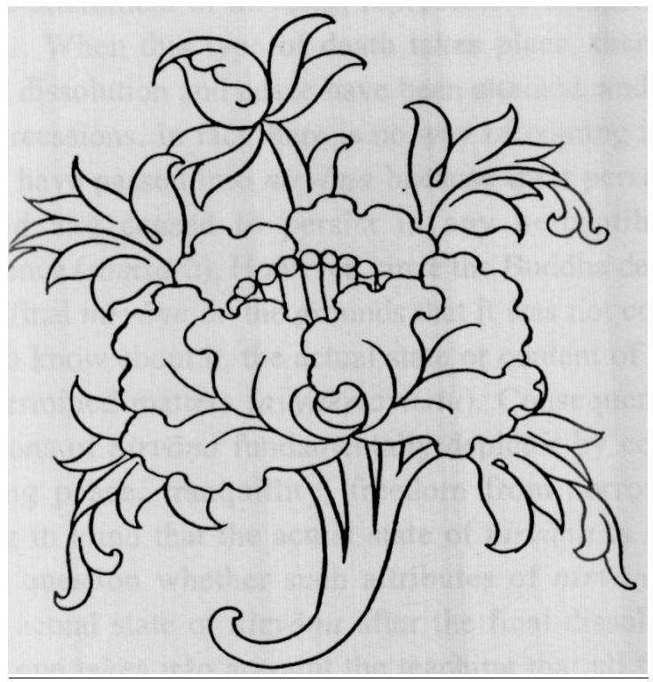

Funeral rites constitute one of the most important and regularly performed rituals in Buddhism. In all Buddhist lands, the funeral rites are performed for both monastic and lay followers. The principal purpose of all such rites is not merely to dispose of the dead bodies in a dignified way, but primarily to secure happy rebirths or a state of complete liberation from the cycles of saṃsāra.

Buddhism fundamentally recognises two types of death. The first type, which coincides with the attainment of *nirv*āṇa, represents a complete dissolution of the five *skandhas*. When this type of death takes place, there are no further rebirths. The final dissolution and peace have been attained, and there is no need for any ritual intercessions. In fact there is no way of coming into contact with the departed who have passed into *nirv*āṇa because their personal identity has become dissolved and ceased to persist in any perceptible form within phenomenal existence (saṃsāra). However, since the Buddha declined to explain the state after his final *nirv*āṇa on the grounds that it was not conducive to one's spiritual growth to know about it, the actual state or content of *nirv*āṇa remains one of the undetermined matters (avyākṛ*tavastu*). Consequently, most of the existing descriptions of *nirv*āṇa fundamentally depict it by contrasting it with saṃsāra as being peace, tranquillity, freedom from sorrow and so forth. However, bearing in mind that the actual state of *nirv*āṇa is undetermined, it remains an open question whether such attributes of *nirv*āṇa can be real or functional in the actual state of *nirv*āṇa after the final dissolution of the five *skandhas*. When one takes into account the teaching that all the saṃskṛta and asaṃ*skrta dharmas* are anātma, the answer must be definitely negative. It is however certain from the position of Buddhist doctrines, that the death, which coincides with the attainment of *nirv*āṇa, transcends and dissolves the force of *karma* and eliminates the recurrence of further rebirths in saṃsāra.

The doctrinal interpretation of *nirv*āṇa as a complete dissolution of the five *skandhas* (*nirupadi*śeṣ*a-nirv*āṇa) is somewhat weakened by certain incongruous accounts and statements found in Buddhist texts. In the case of the Buddha, we have for example an account that shortly before his body was cremated, he protruded his feet from the silk shroud so that Mahākāśyapa could render him

the final act of veneration. However, the most remarkable and unusual thing about the Buddha's complete dissolution and severance of all contacts with the world is the worship of his relics as being alive and endowed with his presence. In his commentary on the Aṅguttara, Buddhaghoṣa asserts the identity of the Buddha while alive with his relics after death. And again in his commentary on the Dīgha, he says that the monk who fails to worship at a *caitya* is guilty of negligence comparable to a failure to attend on the Buddha. 1 The inscription on the lid of the relic casket from Shinkot, as translated by Gregory Schopen, refers to the Buddha's relic as: "(this is) a relic of the Blessed One Śākyamuni which is endowed with life."2 In his comments on the above inscription, Schopen makes an observation that "regardless of what some canonical texts might occasionally suggest and some scholastic texts definitely state—the Buddha was and continued to be an actual living presence in the midst of the Buddhist community." Thus in Buddhism, at least in the case of the Buddha, there exist two contrasting positions about the state after passing into *nirv*āṇa, namely a complete dissolution and a state of tangible existence of some kind. In terms of the rites relating to the dead, the worship of the Buddha's relics have provided an inspiration for the preservation and veneration of the relics of Buddhist monks and teachers who are believed to have attained the state of Buddhist sanctity. The relics of Buddhist saints are also used as amulets.

The second type of death is controlled by the law of *karma*, and it recurs repeatedly and uninterruptedly in cyclic waves in saṃsāra until one reaches the state of *nirv*āṇa. In this case the moment of death represents a time factor, which marks the end of one life and the transition to a new life, and it consists in the dissolution of the five *skandhas* acquired at birth as a retribution for the past actions, and an acquisition of a new configuration of the five *skandhas* in conformity with the retributive force of *karma*. The law of *karma* as a moral law or the law of dependent origination inherent in all things do not basically permit any external interference, although the force of *karma* can be brought to a halt through the practice of the Buddhist path. The fundamental and unadulterated doctrines of Buddhism teach the path of reaching deliverance through one's own effort, but they do not teach that the process of *karma* and the passage from one life to another, as punctuated by death and rebirth, can be controlled or modified by rituals. The operation of *karma* has been declared by the Buddha as one of the four inconceivable things. In other words, the pathways of *karma* are difficult to discern and should not be speculated about. However, although Buddhism places an emphasis on the inevitable course of *karma* and the law of

!!!!!!!!!!!!!!!!!!!!!!!!!!!!!!!!!!!!!!!!!!!!!!!!!!!!!!!

<sup>1</sup> K. Trainor, *Relics, Ritual, and Representation in Buddhism,* Cambridge, Cambridge University Press, 1997, 93.

<sup>2</sup> G. Schopen: "Burial at Santos", *Religion,* 1987, 204.

dependent origination, right from the early period, there were progressively introduced certain elements, which eventually served as doctrinal justifications and provided theoretical foundations for the performance and efficacy of funeral rites. We are not concerned here with the funeral rites and ceremonies which merely serve as ways of disposing the dead bodies, but primarily with the rites, which are devised to channel tangible and concrete powers, and which can alter or even eliminate the *karmic* flux of the departed people. All Buddhist traditions have their own particular customs and methods of executing the funeral rites. However, when one puts aside such elements as indigenous customs and externally perceptible ritual activities, and when one considers the essential elements of ritual texts, broadly speaking, there are three main types of funeral rites, namely rituals related to the ancient Indian and Buddhist mythologies of Yama, rituals based on the transfer of merit gained through donations or recitations of sacred texts, and rituals based on the *tantras* and certain teachings about the intermediate existence. None of these three types of ritual is entirely independent, but they include elements from other rituals and borrowings from one another.

## *Rituals related to the mythology of Yama*

The mythology of Yama is complex and we consider here only the issues relevant to the formation of funeral rituals. In the early brahmanical texts, Yama has two major identities. 3 First, in the earlier texts Yama is one of the gods living in his own abode or world, which is described as a happy place. His dwelling is referred to as the remotest part of heaven where there are deposited the imperishable light and inexhaustible waters. It is in that place that men hope to become immortal. Yama welcomes the ancient ancestors (pitṛ) to his abode where he drinks with the gods, and where the pitṛs participate in the life of the gods. Thus, Yama is the one who accommodates the dead in the place described as full of waters and light. Second, in the later brahmanical texts, Yama comes himself to collect the dead and plays the role of the ruler of the underworld. In addition to that, Yama has two dogs as his messengers, who search for men and bring death to them. In the Purāṇas Yama becomes the judge and ruler over the hells where the wicked endure sufferings. As judge, he sends the good people to heaven (*svarga*), the wicked people to hells or back to earth.

In Buddhist texts the identity of Yama is also complex, and like in the brahmanical texts, he also has two major identities, namely Yama as the lord of death who acts as the judge of the departed, and Māra, the lord of either the Paranirmitavaśavartin abode or the entire Kāmadhātu. In some Buddhist texts, Yama and Māra become merged together into a set of four Māras: Māra as the

<sup>!!!!!!!!!!!!!!!!!!!!!!!!!!!!!!!!!!!!!!!!!!!!!!!!!!!!!!! 3</sup> A. Bergaigne, trans. by V.G. Paranjpe, *Vedic Religion*, Delhi, 1978, vol. I, 85ff.

five *skandhas*, Māra as defilements (kleśa), Māra as Mṛtyu, and Māra as a divine but illdisposed manifestation (*devaputra*). All four Māras taken together represent the implements of death in the sense that their primary role is to prevent people from becoming liberated from the bonds of saṃsāra, and to assure that they revolve in the cycles of birth and death. Yama is also presented in Buddhist texts as a judge administering his judgement in accordance with the Dharma. In the *Devad*ū*ta-sutta* of the Majjhima, the Buddha describes how the guardians of the hells seize people by their arms and lead them before the king Yama, and request him to pass judgement. Prior to passing a sentence, Yama examines the dead, and then he passes judgement by remaining silent. After that, the guardians of the Niraya hell proceed to execute the punishment by torturing the dead people.

The mythology of Yama and Māra inspired a particular type of funeral rites, which are based on the concept of formal judgement. This type of ritual is represented by the rites performed in China during which the ten kings, including Yama, preside over a formal judgement, while the Bodhisattva Kṣitigarbha tries to secure the release of the departed people undergoing the judgement. Some funeral rites incorporate certain elements, which reflect the story about crossing the dangerous river Vaitaraṇī. In this case, certain items such as money are deposited with the dead to help them to cross that river safely.

## *Rituals based on the transfer of merit*

In early Buddhist texts, the validity of the transfer of merit to other people remain an unresolved issue. Some Buddhist masters argued that it was valid and some postulated that it was contradictory to the basic Buddhist doctrine on *karma*. So far as the Mahāyāna and *tantra* teachings are concerned, the transfer of merit is fully endorsed and constitutes one of the essential elements of Mahāyāna and *tantra* practices.

Putting aside the doctrinal controversies about the transfer of merit, in real life practically all Buddhist traditions, including the Theravāda countries, profess and practise the transfer of merit to other living beings whether alive or dead. Some inspiration for sharing merit with the dead is seen in the brahmanical tradition relating to ancestor worship. The acquisition and transfer of merit to the dead in the form of material things donated to the Saṅgha is seen as a replacement of the brahmanical food offerings deposited for the dead. The scriptural justification for making donations to the monks and Saṅgha on behalf of the dead is provided in the stories narrated in the Pāli *Petavatthu* and some Sanskrit *avad*ānas. Most of such stories are located during the Buddha's time.

In the Aṅguttara, 4 after being asked whether there accrues any benefit to the dead from the gifts (dāna) and the srāddhā ceremonies, the Buddha explains that there is no ground for any benefit in the case of those reborn in hells, as animals, humans, or *devas*. However, it is possible to benefit the *pretas* who feed on whatever food is proper to such beings. The *pretas* subsist on whatever offerings are conveyed to them by kinsmen and *blood* relations. If the immediate dead relative is not reborn among the *pretas*, then the benefit goes to other relatives in that state.

The funeral rites based on the transfer of merit are performed in all Theravāda countries. The merit that is transferred to the dead on such occasions is largely derived from donations to Buddhist monks, and from the recitation of the *parittas*. In the Mahāyāna countries such as China, Korea and Japan, most funeral rites are also based on the transfer of merit derived from reading Mahāyāna sū*tras* such as the *Sukh*āvatīvyūha or certain *Prajñ*āpā*ramit*ā sū*tras*. The transfer of merit is also incorporated into some *tantric* funeral rituals.

## *Rituals based on the tantras*

The funeral rites based on the *tantras* are complex and include a number of elements, some of which are shared with the above two types of funeral rites, and some of which are specifically *tantric* in nature. From the perspective of their structure and function, the *tantric* funeral rites are largely devised on the pattern of the *tantric* consecrations, *homa*  rites, and sā*dhana* practices. They also incorporate some Mahāyāna practices such as raising the thought of enlightenment and the Bodhisattva bhūmis. Among the *tantras*, the teachings concerning the disposal of the dead people given in the *Sarvadurgatipari*ś*odhana* are perhaps the most comprehensive. In Tibet, this *tantra* has provided a basis for a number of funeral rites.

Depending on the circumstances and financial resources, the funeral rites can be very short and simple or fairly elaborate and prolonged. Some rituals are considered as essential and some as auxiliary or additional to the main rituals. Among the main and most frequently performed rituals, there are included the treatment of the dead body, the instructions given to the dead in the intermediate state, the guidance of the departed consciousness through the stages the Buddhist path and the bestowal of the *tantric*  consecrations, and the cremation. So far as their aim and efficacy are concerned, the *tantric* rituals aim to achieve two principal goals. They strive to guide and help the departed people to gain the state of liberation from further rebirths, and if this is not successful, then to achieve good and happy rebirths. Although the efficacy of all such rituals is assumed, ultimately it is impossible to know whether someone has become

<sup>!!!!!!!!!!!!!!!!!!!!!!!!!!!!!!!!!!!!!!!!!!!!!!!!!!!!!!! 4</sup> Aṅguttara, V, 269ff.

liberated or reborn, and hence the rituals take into account different possibilities, and aim to secure the best possible result for the departed people.

The treatment of the body mainly consists in the purification and blessing of the dead body with protective recitations and *mantras*, and the deposition of the corpse in a suitable container and place.

The instructions in the intermediate state5 focus on explaining to the dead people their actual situation, and directing them how to strive for the state of final liberation. If this fails, they are advised and guided to gain the best possible rebirth. This particular type of instructions is widely established in Tibet, but its origins go back to India. It is believed that at the moment of death, there appears a beam of clear light, which epitomises the state of liberation. If the departed consciousness aims for it without any hesitations and succeeds to merge with it, then one becomes freed from the bonds of *karma*. If there is any hesitation, a second beam of darkness appears and the process of returning to rebirth begins. It is taught that the intermediate state can last for up to seven weeks or forty nine days.

The guidance of the dead through the stages of the Buddhist path and the bestowal of the *tantric* consecrations are incorporated in the ritual known in Tibet as the rite with an effigy-card (*byang chog*). The prototype of this type of ritual is explained in the *Sarvadurgatipari*ś*odhana*. The name of the departed is inscribed on a piece of paper and the departed consciousness is summoned to rest in it. After that, the ritual performer gives instructions and guides the consciousness through the entire Buddhist path, which includes the three refuges, the generation of the thought of enlightenment, and the *tantric*  consecrations. The principal goal of this ritual is to secure the final liberation.

The cremation ceremony incorporates the basic elements of *homa* rites and appropriate sā*dhanas*. The funeral pyre is constructed on the pattern of the appropriate *homa* hearth, which often also incorporates a drawn design of a particular maṇḍala, which is inserted at the bottom. The corpse is deposited on the top of the piled up heap of wood. Next, the ritual performer proceeds to execute an appropriate sā*dhana*, presents offerings to the deities of the relevant maṇḍala in the same way as it is done in *homa*  rites, and invokes them to take the departed with them to the sphere of purity. The cremation ceremony and other rites discussed here very briefly are translated below as part of the rites for rebirth in the Sukhāvatī abode.

# *The funerary rites for rebirth in the Sukh*āvatī *abode*

The funeral and related rites, which are translated below, were composed by Karma chags med, also known as dGe slong Rāgāsya (Rā ga a sya) and dGe

<sup>!!!!!!!!!!!!!!!!!!!!!!!!!!!!!!!!!!!!!!!!!!!!!!!!!!!!!!! 5 <</sup>i>bar do (*bar ma do*'*i srid pa*) */ antar*ā*bhava*.

slong brTson 'grus. He was a Karma Kagyupa (bKa' brgyud pa) master who lived in the seventeenth century. His collected writings include a set of funeral rituals for rebirth in the Sukhāvatī abode. The characteristic and somewhat unusual features of these rites are that they combine the Pure Land teachings about the rebirth in the Sukhāvatī abode with the *tantric* funeral rites performed in Tibet on the basis of Indian sources.

The larger *Sukh*āvatīvyūha and the *Amit*ā*yurdhy*āna provide the fundamental teachings on the ways of becoming reborn in the Sukhāvatī abode, the pure land of lasting happiness. It is said in those texts that the people, who profess faith in and invoke the name of Amitābha, will become reborn in the Sukhāvatī abode. Amitābha is said to have promised that at the time of their death, he will personally collect his faithful believers and lead them to his abode. It is also said in the *Sukh*āvatīvyūha that Amitābha assists his devotees, who behold him in ecstatic visions and leave this world to become reborn in his land.

In Japan, the Jōdo priests recite the *Sukh*āvatīvyūha as part of the funeral ceremonies. Unlike in other sects, the Jōdo Shinshū does not give posthumous names because the person is believed to have passed into Amitābha's Sukhāvatī. The dead body is usually dressed in white garments similar to those worn by the people making pilgrimages, and the head is fastened with a white ribbon. The dead people are also provided with sandals made of rice straw (zōri), and a wallet with money to pay for the boat passage across to the other side.

Immediately after the death, at the bedside, the Jōdo priest invokes the names of Amitābha, Avalokiteśvara and Mahāsthāmaprāpta, and the names of the Buddhas of the ten directions. Next, he offers flowers, recites the confession of sins, performs a ceremonial tonsure and administers the three refuges and the vow of morality (śīla). After that, he chants the *Sukh*āvatī and *Amit*ā*yus s*ū*tras*. The chanting focuses on the relevant passages, which speak of gaining merit through hearing the name of Amitābha. He further recites an invocation for rebirth in the Sukhāvatī abode and the *nembutsu*. 6 Finally, he transfers the acquired merit to the departed person. When the body is placed in a coffin and on the day of cremation, the priest performs a similar but differently arranged set of recitations, and executes certain ritualised activities devised for those occasions, such as beating the drum, burning incense, offering tea to the departed spirits, and addressing a request to the departed to leave. When the ashes are collected into an urn, the priest recites certain *sutra* passages and the so-called Śarī*ra-sutra*. After the funeral rites, a special ceremony is performed to

!!!!!!!!!!!!!!!!!!!!!!!!!!!!!!!!!!!!!!!!!!!!!!!!!!!!!!!

<sup>6</sup> The terms *nien-fo* in Chinese and *nembutsu* in Japanese correspond to the Sanskrit terms *buddha-anusm*ṛti or *buddha-manasik*āra, which mean recollection or mindfulness of the Buddha. The practice of *nembutsu* involves both meditation on and recitation of Amitābha's name.

purify the house. On this occasion, the priest sprinkles water towards the four directions, invokes the names of the Buddhas, recites the *Prajñ*āpā*ramit*ā-hṛ*daya*, and chants the *nembutsu*.

The funeral rites composed by Rāgāsya are fundamentally modelled on the *tantric*  funeral rites used in Tibet, but at the same time, they also incorporate the concept and relevant instructions for rebirth in the Sukhāvatī abode. In all his funeral rituals, Amitābha, the Buddha of the Sukhāvatī *lokadh*ātu located in the western region of the universe, is the chief deity attended by his two principal Bodhisattvas, Avalokiteśvara and Mahāsthāmaprāpta. Like in the Pure Land tradition, Amitābha is visualised and invoked to lead the departed consciousness to the Sukhāvatī abode.

Out of the four rituals translated here, the first one details the practice of the transference of consciousness and consists of three integral parts, which explain how to learn during one's lifetime the method of transferring consciousness, how to execute it personally at the moment of dying, and how to perform it on behalf of other people at the time of their death.

The second ritual consists in a set of instructions that are read to the departed consciousness during the period of the intermediate existence. As such, it is a short text, but it does cover the main stages in the intermediate state, which are explained in more detail in the full version of the *Bar do thos grol*. There is a tradition in Tibet that originally the text on the intermediate state was composed by Padmasambhava and recorded by his Tibetan wife Yeshe Tshogyal (Ye shes mtsho rgyal). Initially, this text was hidden by Padmasambhava and eventually rediscovered in the fourteenth century by the rNying ma pa master Karma gling pa. 7 This particular type of instructions given during the intermediate existence is widely practised in Tibetan Buddhism. However, some other traditions, such as the Jōdo Shinshū, also recognise the intermediate period of forty-nine days during which they perform certain rituals for the benefit of the departed people.

The third ritual, the cremation rites, includes a group of rituals such as the consecration of the dead body, the purification of the cremation site, the actual cremation of the dead body, and the disposal of the ashes.

The fourth ritual, like the previous one, also includes several integral rituals. First, the departed consciousness is summoned into an effigy-card, and then performs a series of ritual activities, which include the purification of the departed person from all sins, the blockage of the entries into the six spheres of rebirth, the bestowal of the *tantric*  consecrations, and finally the guidance of the departed consciousness to the Sukhāvatī abode.

!!!!!!!!!!!!!!!!!!!!!!!!!!!!!!!!!!!!!!!!!!!!!!!!!!!!!!!

<sup>7</sup> F. Fremantle & Chogyam Trungpa, *The Tibetan Book of the Dead*, *The Great Liberation Through Hearing in the Bardo*, by Guru Rinpoche according to Karma Lingpa, Berkeley and London, Shambhala, 1975, xi.

## *TRANSFERENCE OF CONSCIOUSNESS*

Prior to his exposition of the transference of consciousness, 8 Rāgāsya provides an introduction of eight folios in which he briefly outlines the general history of *'pho ba* and discusses some relevant issues. In the paragraphs that now follow, I give a *résumé* of the main content of his introduction.

Rāgāsya says that his exposition of *'pho ba* is based on the oral tradition and certain texts which are linked with the teachings of Padmasambhava. At the time of death, the *'pho ba* can be performed by oneself or it can be performed for the dead by the *lamas* (*bla ma*) who know how to perform it. It is recommended that people should learn to perform it because it can be helpful in gaining the state of purification from sins or even the state of complete liberation from saṃsāra. It is also said in some sources that the *'pho ba* performed at the time of death can secure the state of complete liberation or happy rebirths in heaven (*mtho ris*), even if one is guilty of the five heinous sins (ā*nantar*īya).

Rāgasya says that there are many different types of *'pho ba*, but he provides the names and briefly explains only the following types: *dharmak*ā*ya 'pho ba*, saṃ*bhogak*ā*ya 'pho ba*, *nirm*āṇakāya *'pho ba*, forced *'pho ba* (*btsan thabs kyi 'pho ba*), routine *'pho ba* (*tha mal pa'i 'pho ba*), and the *'pho ba* of entering into another body (*grong du 'jug pa'i 'pho ba*).

What is the *dharmak*ā*ya 'pho ba?* If during one's lifetime one has studied and practised the Mahāmudrā and the rDzogs chen practice known as "cutting through substantial reality" (*khregs chod*), at the time of death, the mother and son meet in the realm of clear light (*'od gsal*). One remains there for seven or more days. In this state, the object and the performer of the *'pho ba* are separated because it is the ultimate *'pho ba*. 9 It is also said that in this state there are no auspicious or evil pathways. When one gains the *dharmak*ā*ya 'pho ba*, the external sign, which indicates its attainment, appears in the form of a clear sky. There are also signs which appear on the dead body. The body does not lose its lustre and brightness for a long time, and on the secret part, there emerges a white letter A, a blue syllable Hūṃ or some other similar sign.

In the case of the saṃ*bhogak*ā*ya 'pho ba*, the sky becomes filled with light and rainbows. Blood or red water oozes from the Brahma's aperture10 on the top of the head. A kind of dew or vapour emerges on the body, and on the secret part, there emerges the symbol of an appropriate deity or the relevant Buddha family.

!!!!!!!!!!!!!!!!!!!!!!!!!!!!!!!!!!!!!!!!!!!!!!!!!!!!!!!

<sup>8 <</sup>i>'pho ba / saṃkrānti, *cyavana*, saṃcāra, saṃ*krama*. 9 *don dam pa'i 'pho ba / param*ā*rthasa*ṃcāra. 10 *tshangs pa bu ga / brahmarandhra*.

In the case of the *nirm*āṇakā*ya 'pho ba*, the body falls down towards the right side, and the vital wind flows out from the left nostril. One envisages or places the Buddha's image at the front, and then one transfers one's consciousness into it through the left nostril. One should pray and generate the thought of inducing a *nirm*āṇakāya for the benefit of living beings. On this occasion, there appear such signs as clouds, a rainbow, a wishgranting tree, or a shower of flowers falls down from the sky. As for the signs on the body, it is said that blood, red water, or the *bodhicitta* emerges from the left nostril, or a kind of dew appears on the body. On the secret part, there emerges the shape of a vase or the symbol of an appropriate deity and small relics (*ring bsrel*).

The deliberate or forced *'pho ba* should not be performed. Even when the signs of death are present, one should attempt three times to avert one's death. If one does not do it and executes the *'pho ba*, then there results the so-called harm of killed deities (*lha bsad pa'i nyes pa*). Even if one has been sentenced or is afflicted by disease and pain, the *'pho ba* should not be performed. Similarly, even when someone is dead but the subtle veins are not fully cut off, it is inappropriate to perform the *'pho ba*. If one performs it when the period of life is not completed and there is still some movement, then one harms the bodily deities. In this particular context, the term deities refers to the group of the holy deities of one hundred families (*rigs brgya'i lha*) who abide in the body. All these deities become inert as if being killed. When the *'pho ba* is performed before the period of someone's life expires, it brings no benefit and the person becomes reborn in evil destinies. It is said in a text entitled *rDo rje gdan bzhi* that the *'pho ba* should be only performed at the right moment, and that when the time is not ripe, the deities become inert. If one takes one's own life, one commits a greater sin than the five heinous sins. Thus, before one performs the *'pho ba*, one must always attempt to avert one's death.

The *'pho ba* of entering another body is known in Tibet in the oral teachings (*bKa'* ma), but there is no living transmission of its practical performance.

It is said that on certain occasions, when the cause of death is sudden, the routine *'pho ba* is referred to as instant *'pho ba* (*skad cig ma'i 'pho ba*). When a constant radiance (*skrag sdangs*) appears, one should direct one's awareness towards Amitābha or Padmasambhava positioned over the top of one's head. If the cause of death is fierce and sudden, one leads one's consciousness towards the top of the head, and then directs it towards one's teacher. Otherwise, the indicative signs of the routine *'pho ba* are such as the head faces towards the north and the body falls down towards the right side. It is said that if one recites prayers and invokes the names of certain Buddhas over the head of the dead person, that person does not become reborn in any of the three evil destinies.

According to some sources, eight bodily apertures (*sgo brgyad*) serve as passages of saṃsāra, and one aperture constitutes the path of the Mahāmudrā.

Furthermore, it is said in the sources derived from the highest *tantras* that when the *vijñ*ānā*laya* (*rnam shes kun gzhi*) emerges from the Brahma's aperture, it does not have any form. When it emerges from the seminal point (*thig le*), it assumes the form of a great deity. When it emerges through the navel, it assumes the form of a god in the Kāmadhātu. When it emerges through the eyes, it assumes the form of a powerful human (mi *dbang po*). When it emerges through the nostrils, the rebirth takes place among the yakṣas. When it emerges from the ears, it assumes the form of one's meditational deity (*grub pa'i* lha). When it emerges through the so-called passage of existence (*srid pa'i* sgo), it becomes reborn as a *preta*. When it emerges from the urinary passage, it becomes reborn as an animal, and when from the anus, it falls to one of the eight hells.

One tradition maintains that when someone does not learn the *'pho ba yoga* 11 and the departing consciousness is transferred through the Brahma's aperture by means of ritual power (*las dbang*), then that person becomes reborn in the Ārūpyadhātu. And again, when the consciousness is transferred through the Brahma's aperture in accordance with the *'pho ba yoga*, one becomes reborn in the pure sphere of the sky (*mkha' spyod*).

According to the instructions of Padmasambhava, there are nine different paths through which the departing consciousness can pass: three excellent paths, three average paths, and three inferior paths. The Brahma's aperture on the head constitutes the path, which leads to the pure sphere of the sky (*mkha' spyod*), and hence when the awareness (rig pa) is passed through it, one gains the state of liberation (*thar pa*). It is the best path, which one should cultivate and purify. When the departing consciousness emerges through the eyes, one becomes reborn as a *cakravartin*, and when through the left nostril, one gains a pure human body. These are the three excellent paths. When the consciousness emerges through the right nostril, one becomes reborn among the yakṣas, when through both ears, one becomes reborn among the gods of the Kāmadhātu, and when through the navel, one becomes reborn as a kā*madeva*. These are the three average paths. When the consciousness emerges through the urinary passage, one becomes reborn as an animal. When it passes through the region of the so-called passage of existence (*srid pa'i* sgo) or through the white or red seminal points (*thig le*), one becomes reborn as a *preta*. Finally, when it passes through the anus, one becomes reborn in one of the hells. These are the three inferior paths.

Next there follows Rāgāsya's exposition of the *'pho ba* practice, which is translated below.

* * *

<sup>!!!!!!!!!!!!!!!!!!!!!!!!!!!!!!!!!!!!!!!!!!!!!!!!!!!!!!! 11 <</sup>i>'pho ba'i gdams pa / saṃkrā*ntiyoga*.

(9a) The exposition of the transference of consciousness (*'pho ba*) is divided into two major parts: the preparatory practice and the actual application. 12

# *Preparatory practice of 'pho ba*

First, in order to ask for a suitable meditational disposition of practising the transference of consciousness, you should present a maṇḍala offering and then recite this:

> "Having transformed this maṇḍala of bronze into jewels and all the barley grains into gold and turquoise, I offer them with faith to the manifested body of my compassionate and merciful *guru*. May he look upon me with compassion."

Next, you should take the tree refuges and raise the thought of enlightenment:

"Homage to the Three Jewels and to the three root deities. I take refuge at their places of protection. In order to bring all living beings to the state of buddhahood, I raise the perfect thought of enlightenment."

You should recite this three times. After that, in an instance, you should duly envisage yourself as the lord Mahākāruṇika, white in colour, peaceful and smiling, and having one face. Out of his four hands, the two principal ones are folded at the heart, and the two lower ones hold a rosary of white glass and a white lotus. He is seated with his legs crossed on a lotus and moon throne. The hair on his head is matted into a head-dress and surmounted with five small crests made of jewels. His body is covered with silk and jewel ornaments, and it is radiant with the lustre of the thirty-two major marks (lakṣaṇa) and the eighty minor marks (*anuvyañjana*).13 The outer surface of Mahākāruṇika's body is like a propped up tent of white silk, and its inside is empty like an inflated bladder. Inside this totally empty space, there is the central vein (*avadh*ūtī), which is endowed with four qualities. On the outside, it is white to symbolise happiness. Inside, it is red to symbolise purity. It stands in an upright position to symbolise the path to enlightenment, and in order to close the entries into evil rebirths, (10a) its lower opening beneath the navel is sealed. In order to advance along the path leading to heaven (*mtho ris*), its upper extremity at the top of the head, the Brahma's aperture, constantly vibrates.

Above the crown of your head, you should envisage the protector Amitābha. He is red in colour, wears monastic robes, and sits on his lion throne consisting of a lotus and a moon. He has one face and two hands placed in the meditation

<sup>!!!!!!!!!!!!!!!!!!!!!!!!!!!!!!!!!!!!!!!!!!!!!!!!!!!!!!! 12 <</sup>i>gNam chos thugs kyi gter kha las bDe chen zhing du 'pho ba'i gdams pa rgyas par bsgrigs pa. The translation of this and the remaining funeral rites included here is based on a block print acquired in Nepal.

<sup>13</sup> For a list of the major and minor marks of a mahā*puru*ṣa, see *The Buddhist Forum*, Volume III, 391–93.

posture and holding an alms-bowl. He is seated like Maitreya with his two big toes positioned immediately above the upper extremity of the central vein.

Lokeśvara stands to the right of Amitābha. He is white in colour and has one face and four hands. Two of his hands are folded together, and two hold a rosary and a lotus in the right and left hands respectively. He is standing on a lotus and a moon.

Vajrapāṇi Mahāsthāmaprāpta stands to the left of Amitābha. He is blue in colour, has one face and two hands holding a *vajra* and a bell. He also stands on a lotus and a moon.

The (above three deities) are surrounded by countless Buddhas, Bodhisattvas, śrā*vakas* and *arhats*.

Dispersing rays of light from the three seed syllables (Oṃ Āḥ Hūṃ) placed on the three bodily spots of the above three lords, you should summon them from the Sukhāvatī abode and dissolve them into their envisaged bodies.

Next, you should recite the following supplication14 for the transference of consciousness:

> "*E ma ho*. O supreme protector Amitābha, Mahākāruṇika and Vajrapāṇi Mahāsthāmaprāpta. I beseech you with my one-pointedly focused mind to grant me your blessing for perfecting the profound path of transferring consciousness. When I and other people approach the moment of death, I beseech you to grant us the blessing of transferring our consciousness to the Sukhāvatī abode."

You should recite this supplication as many times as you can. After that, you should envisage your heart inside the central vein (*avadh*ūtī) in the form of a red eight-petalled lotus resembling a sealed knot of a bamboo tube. On the top of it, there is a lunar disc, which is similar in size and shape to a halved pea. On the top of it, there rests the white seminal drop15 together with a red syllable Hrīḥ similar to a punctuation mark (|).16 They have the nature of the combined vital wind of awareness and consciousness. They are lustrous with light, restless and vibrating upwards.

Next, you should envisage the following process. From the above syllable Hrīḥ, there disperses light, which assumes the form of a similar syllable Hrīḥ, and then closes the aperture below, the entry into the hells. Another syllable Hrīḥ disperses and blocks the urinary passage, the entry into the realm of animals. Next, two syllables Hrīḥ disperse and block the mouth and the secret part, the entry to rebirth in the realm of the *pretas*. After that, one syllable Hrīḥ

!!!!!!!!!!!!!!!!!!!!!!!!!!!!!!!!!!!!!!!!!!!!!!!!!!!!!!!

<sup>14 <</sup>i>gsol 'debs / adhyeṣaṇa. 15 *thig le / bindu*. 16 *tsheg drag*.

disperses and seals the navel, the entry into the realm of the kā*madevas*. Then again, two syllables Hrīḥ disperse and block the ears, the entry to rebirth in the realm of the *asuras*, the world of form, and that of the *kumbh*āṇḍas. The next two syllables Hrīḥ disperse and block the nostrils, the entry to rebirth in the world of the yakṣas and men, who are born, become old, suffer from diseases and die. After that, three syllables Hrīḥ disperse and block the aperture between the eyebrows, 17 the entry to rebirth in the world of form, then the right eye, the entry to rebirth as a human king, and finally, the left eye. Once more, one syllable Hrīḥ disperses and blocks the entries to rebirth in the formless world, the Brahmaloka.

When one performs the above visualisation, it is also appropriate to pronounce the syllable Hrīḥ verbally and to count it.

Next, pronounce *Hik* and envisage your mind (*sems*) in the form of a white *bindu*  marked with the syllable Hrīḥ, which rises upwards along the path of the central vein to the top of the head, and touches the toes of Amitābha's feet. Pronounce Ka and envisage it falling down, and resting on the lunar seat inside the heart. While doing it, breathe in three times the remains of the vital winds. Hold and retain them, and then fix them firmly for a long time. Next, pronounce *Hik* in your mind, and envisage the winds of the right and left veins18 as having the form of blue dust and rising upwards along the central vein, and at the same time the white *bindu* touching Amitābha's toes. Next, pronounce Ka in your mind and envisage it descending and resting on the seat in the heart. (12a) When you are raising it upwards, place the *vajra*-fists on the sides of the head, and heap up at the top all the projections of the vital winds.

The people who are not acquainted with the method of holding the breath should pronounce Hik, and envisage the *bindu* rising upwards along the central vein and touching the Buddha's toes. Next, they should pronounce Ka and envisage it descending into the heart. Such a clear meditational visualisation of ascending and descending should be performed about twenty-one times.

> As for the prayer, 19 you should recite the following words:

"*E ma ho*. O excellent Buddha Amitābha, the lord Mahākāruṇika to the right, the Sattva Mahāsthāmaprāpta to the left, with countless Buddhas and Bodhisattvas in attendance. The *buddha*ṣ*etra* called Sukhāvatī is the abode of happiness and limitless wonders. May I, upon my death, become reborn there at once without being obstructed by another rebirth. May I behold there the countenance of Amitābha. I recite my prayer in

!!!!!!!!!!!!!!!!!!!!!!!!!!!!!!!!!!!!!!!!!!!!!!!!!!!!!!!

<sup>17 <</sup>i>smin mtshams / ūrṇā. 18 right vein: *ro ma / rasan*ā, left vein: *rkyang ma / lalan*ā. 19 *smon lam* / praṇidhāna.

these words and ask all the Buddhas and Bodhisattvas, who reside in the ten directions, to bestow their blessing and unimpeded success. O *enlightenment* of the *five faculties Sv*āhā."20

While reciting this prayer, you should envisage your body as becoming pervaded with the ambrosia of immortality, which trickles from the alms bowl held in the hands of Amitābha.

As for the invocation for (long) life, you should recite as follows:

"*E ma ho*. O perfect Buddha Amitābha, Mahākāruṇika, Mahāsthāmaprāpta, and countless Buddhas and Bodhisattvas. I bow and praise you with devout mind. I ask you to bestow upon me the attainment of life. Oṃ *Amit*ābha, *the attainment of life H*ūṃ."21

You should recite this prayer one complete round on a rosary (13a) or as many times as you can. You should envisage the threefold group of the lord Amitābha as melting into light, and then dissolving into you, and the syllable Haṃ and a crossed *vajra* blocking the Brahma's aperture.

After practising in this manner at regular intervals, six or four times, or as many times as necessary, the signs of perfecting the method of transferring consciousness should appear on the Brahma's aperture. They appear as heat, lymphatic discharge, itching and pricking sensation, numbness or swelling. The vertex becomes numbed, and blood or yellow liquid emerges from the Brahma's aperture. When such signs occur, one should examine carefully the spot, which is eight fingers from the edge of the hairline. It overflows and aches when one inserts a blade of kuśa grass. When this happens, one should not train any further. Since there is a danger to one's life, one should stop the meditational exercises. One does not move the *bindu* inside the central vein, and one should stop counting the syllables *Hik* and Ka.

When one does not have the Brahma's aperture or when one cannot activate it because of headaches and giddiness, one should generate Amitābha one cubit above the head, and one should visualise the ascent of the *bindu* together with the syllable Hrīḥ; towards, but not touching, the lotus throne of Amitābha positioned in the sky, and then their descent into the heart inside the central vein. When one executes this visualisation during several sessions, the Brahma's aperture should open. Blood and yellow water should ooze out from it. This concludes the exposition of the method of executing the transference of consciousness.

!!!!!!!!!!!!!!!!!!!!!!!!!!!!!!!!!!!!!!!!!!!!!!!!!!!!!!!

<sup>20 <</sup>i>tadyathā *pañcendriya-avabodhan*ā*ya sv*āhā. 21

oṃ *amidheva* āyuḥ*siddhi* hūṃ. The Sanskrit name of Amitābha is consistently given in his *mantras* as Amidheva.

## *Transference of consciousness at the time of death*

The execution of the transference of consciousness by oneself is done in the following way. When all the signs of death appear, one should attempt three times to avert one's death. However, if one does not succeed to avert it, one should recite as follows:

> "*Kye ma*. At this very moment of approaching my death and the intermediate state, I abandon the thoughts of attachment and adherence to all things. I will penetrate with determination into the nature of the clear instructions, and I will transfer my consciousness to the sphere of space, self-knowledge and non-rebirth. I will relinquish my conditioned flesh, blood and body, and I will understand that impermanence is an illusion."

Praying in such words, one should present one's body, possessions and relatives in a maṇḍala offering to the Buddha Amitābha. Once this offering is completed, one should abandon all thoughts motivated by desire. Acting in the same way as one did at the time of practising the meditation of transferring consciousness, one blocks the nine apertures with the syllable Hrīḥ. One envisages the lord Amitābha and his entourage positioned in the sky above at a distance of one cubit. One discharges one's consciousness in the form of the white *bindu* marked with the syllable Hrīḥ. and one envisages it dissolving into the heart of Amitābha. One does it repeatedly for as long as the breath is not cut off. If one is able to recite the invocation and prayer for the transference of consciousness, one should recite them personally. Otherwise, one should entrust their recitation to a relative, a friend or someone else. (14a) In the end, having emerged on the crown of the head, the consciousness should certainly become reborn later on in the Sukhāvatī abode.

## *Administering the transference of consciousness to other people*

When a sick man is definitely dead and his outer breath is cut off, one should arrange the top of the corpse's head like a small tent. First one takes the three refuges, generates the thought of enlightenment, and calls many times the names of the Buddhas one knows. After that, one attunes the veins of one's throat for recitation, and lifting one's mind to the meditational state appropriate for the transference of consciousness, one recites in a soft and melodious voice the following text:

> "*Kye ma*. O noble son who has departed from this life. Envisage your body as your chosen deity, the White Being. Inside your body, there is the central vein resembling a bamboo arrow, and inside (the deity's) heart there is the red syllable Hrīḥ similar to a punctuation mark (|). Next, envisage six syllables Hrīḥ as dispersing and blocking the entries to the six places of rebirth, and the Brahma's aperture on your head as being open. Above your head, there is a lotus and moon throne surmounted by

the lord Amitābha, red in colour, wearing monastic robes, seated with his legs crossed, having one face and two hands placed in the meditation posture and holding an alms bowl. The white Lokeśvara is positioned to Amitābha's right. He has one face and four hands. Two of his hands are folded together and two hold a rosary and a lotus. He stands over a lotus and a moon. Vajrapāṇi Mahāsthāmaprāpta is positioned to Amitābha's left. He is blue in colour and has one face and two hands, holding a *vajra* in the right hand and a bell in the left hand. He also stands on a lotus and a moon. The three of them are surrounded by countless Buddhas, Bodhisattvas, śrā*vakas* and *arhats*. Next, from the seed syllables positioned on the three bodily spots of these three lords, there disperse rays of light, which summon their corresponding appearances from the Sukhāvatī abode, and dissolve them into the envisaged images. After that, envisage your consciousness in the form of the white *bindu* marked with the syllable Hrīḥ. and perceive it as being transferred into the heart of Amitābha.

*E ma ho*. O wonderful lord Amitābha, Mahākāruṇika and Vajrapāṇi Mahāsthāmaprāpta. I supplicate you with the one-pointedly focused mind of the departed person to bless and transfer his consciousness to the Sukhāvatī abode." (15a)

One meditates and recites this prayer seven times or twenty-one times. One pronounces many times the syllables Ka and Hik. Next, pronouncing a fierce Phaṭ, one pulls out uprightly one single hair from the spot on the crown of the head, which is located some eight fingers from the edge of the hairline. The hair disperses like a rotten matter. A sudden noise and vapour emerge. A swelling appears and a kind of dew or yellow liquid comes out, or warmth and heated grease coemerge. In the case of people who are bald, the flow of lymph and swelling are induced by pressing with the forefinger. One does it repeatedly until the appropriate signs appear.

Next, dispersing rays of light from Amitābha's heart, one envisages the whole retinue together with the aggregates (*skandha*) of the dead person as becoming completely melted into light, and then dissolved into the heart of Amitābha. Next, one recites the prayer for rebirth in the Sukhāvatī abode, 22 repeating it three, five, seven or more times. After that, one indicates the path. One chants the following verses:

> "*E ma ho*. O wonderful protector Amitābha, Mahākāruṇika and Vajrapāṇi Mahāsthāmaprāpta. I supplicate you with the one-pointedly focused mind

!!!!!!!!!!!!!!!!!!!!!!!!!!!!!!!!!!!!!!!!!!!!!!!!!!!!!!!

<sup>22</sup> As given above in the first section, which explains the method of *'pho ba*. Rāgāsya's long prayer for rebirth in the Sukhāvatī abode is translated in *The Buddhist Forum*, volume 3, 391– 409.

of the departed person to bless and transfer his consciousness to the Sukhāvatī abode.

*Kye ma*. O noble son who has departed from this life. Have no desire for this sorrowful saṃsāra, and do not hesitate but proceed to the sphere of the Sukhāvatī abode. Phaṭ Phaṭ Phaṭ." (15b)

While pronouncing the above verses, one should envisage Amitābha departing to the realm of the Sukhāvatī abode like a discharged arrow. Finally, one recites some prayers, concluding with the prayer for the transference of consciousness.

> "*E ma ho*. O wonderful protector Amitābha, Mahākāruṇika and Vajrapāṇi Mahāsthāmaprāpta. I pray to you with one-pointed mind and ask you to bless and transfer this consciousness to the Sukhāvatī abode." (17a)

# *LIBERATION THROUGH HEARING IN THE INTERMEDIATE STATE*  (*BAR DO THOS GROL*)

*Kye ma kye hud*. On noble son of such and such a name, being impermanent, you have departed from this life. You do not trust whether you are dead or alive. You have no physical body of flesh and blood, but only a mind-body, somewhat eight years old and imbued with the colours of the six spheres of rebirth. There is no sun or moon, but your body is bright with light. When you recollect your thoughts, you are able to produce deceptive appearances. As you have no fixed abode, you roam on mountain peaks and ocean shores. As you have no true friends, you befriend anyone dead or alive. As you have no proper food, you are satiated with smells and singed odours. If you are not given, there is no way of getting food in the intermediate state. At times being frustrated by sorrow, you perceive with clarity and recollect the lives of the past, the intermediate state, and the future. However, forgetting them instantly, you are deceived and wander on. In one single moment, you go round the three thousand worlds without your reflection in the water or mirror, without casting your shadow, without leaving footprints on the soft sand or soil. These are the signs that you are wandering about in the intermediate state.

Knowing yourself that you are dead, your mind endures great afflictions. No matter how willing, how strong is your heart, it cleaves. Now you have great regrets for not accomplishing the holy Dharma. Since you recall the sins and offences you have committed, your mind is unhappy. You are frightened and fear the arrival of Yama's messengers. You blame your relatives and feel animosity towards all of them. You suffer when you hear their voices coming towards you, and when you talk back without being heard. You call 'Do not weep! I am here!' Approaching them, you embrace them, touch their faces, but they do not see you and continue to weep. Since you experience all such things, you should know that now you are definitely dead.

You approach the *gurus* in whom you had placed your trust and hope of being protected. Since you perceive all the miseries of sins originated from imperfect rituals, impure vows, and meditation without clear vision, you think that they had deceived you, and you become overwhelmed by hatred. Consequently, you want to obtain quickly a body at any cost, and you endeavour to search for it everywhere. The projections of this kind arising before you are not produced by anyone. They are your own deceitful projections.

After four days, you have the visions in which the cardinal directions, the intermediate quarters, the nadir and the zenith become filled with rainbows, light and sparkles. The sky becomes crowded with the host of the Peaceful Deities, a clear radiance shines forth, and a beautiful mass of light blazes with splendour. From the hearts of the deities, there emerges the path of the five wisdoms in the form of beautiful and lustrous rays of light which penetrate your heart. Concurrently, there emerges the path of the six spheres of rebirth in the form of six ugly and obscure emanations, which also shine because they are parallel with the path of the five wisdoms. Out of those two paths, follow the bright path of the five wisdoms without stepping onto the path of the six spheres of rebirth. Pray wholeheartedly with devotion to the deities of the five Buddha families.

Next, there appear the chosen deities, the ḍākinīs and the protectors of the Dharma (*dharmap*āla). They wear the requisites of the eight dreadful graveyards and resound with a thunder of one thousand cymbals and Hūṃ Phaṭ. The whole world quakes, rocks, trembles and shakes. They come to lead you out from the path of the intermediate state. Do not be afraid! If you recognise your chosen deities, they will lead you to the realm of the Sukhāvatī abode.

Later on, there arrive the hosts of the bloodthirsty Wrathful Deities to lead you out from the path of the intermediate state. They are terrifying and unbearable to look at, and they roar in unison with one thousand thunders of Hūṃ Phaṭ. All the projections in the sky, on the earth, and in the intermediate state become filled with wrath. Showers of 'kill! kill!' and luminous weapons fall down. In a way, you are similar to a great sinner locked up in a prison. You cannot free yourself by trying to escape. Whichever way you tum, they all are there. They did not come from another place. The hosts of the Peaceful and Wrathful Deities are the deities of your own body. In a way, it is like being confused amidst the friendly and enemy armies standing on the site of a mighty and terrifying battle. Do not be afraid! Do not fear! But strive to act with devotion!

After a period of two weeks, the fears dwindle away. During each week of the intermediate state, there is one fear. Snow, rain, thick darkness and armies come in succession, followed by Yama with the hosts of beasts. At the front, you are cut off by a white, red and black abyss. One thousand mountain peaks crumble down; one thousand oceans billow and roar; crackling flames gain ground over a

great forest; and strong winds rage. Such are the manifestations of the four sounds of fear and the eight precipitous tracks of anguish. They are the deceitful projections of your own mind. Since you do not possess a body of flesh and blood, there is no material substance to be destroyed by weapons, abyss, earth, fire or water. Therefore, adhere to your mind and abandon these fears. The Sage (*thub pa*) said that these are the Buddha manifestations, which know how to benefit all living beings by various means of conversion. Your thoughts about the unholy and impure *gurus* are your own impure and deceitful projections. For your own benefit generate faith and devotion, and do not be deceived.

Desiring to obtain a human body, you search for a body while wandering about in saṃsāra. This is the sign that you have made an error of judgement. Abandon the thoughts of desiring to acquire the sorrow of innumerable cycles of birth, old age, disease and death in the body of a man or a god.

Since we are the guides and the vehicles of the Buddha activities for your benefit, generate faith and devotion, and without being distracted, listen to these words: Your obstructions are purified by the consecration of non-returning and by the profound secret *mantras*. Thus, without attachment or desire proceed to the Sukhāvatī abode in the west, the sphere of lasting happiness, the abode from which there is no turning back.

# *THE CREMATION CEREMONY*23 (RO *SREG*)

# *Treatment of the body*

!!!!!!!!!!!!!!!!!!!!!!!!!!!!!!!!!!!!!!!!!!!!!!!!!!!!!!!

(1a) Salutation to Amitābha. In order to block the entries leading to rebirths in the six spheres of existence in the case of the helpless beings faring in the intermediate state, one should recall those beings in the same way as it is done in the ritual with an effigy-card. One writes down three times the long *mantra*24 of Amitābha in such a way that it looks like a garland. On the lower ends, one adds three fringes. One recites and writes down the *mantra* "Oṃ *Amit*ā*bha Hr*īḥ" and one attaches it on the crown of the corpse's head. Next, one writes down the six syllables "Oṃ maṇ*i padme H*ūṃ" and attaches them on the right shoulder. Finally, one writes the *mantra* "Oṃ *Vajrap*āṇi Hūṃ" and attaches it on the left shoulder. This is an abridged way of sealing the bodily places. 25

<sup>23 <</sup>i>bDe chen zhing gi ro sreg cho ga ngan song gnas 'dren sdug bsngal mtsho skem gtan bde rab *'bar zhes bya ba*. 24 Amitābha has three root *mantras*, long, medium and short. The long one: oṃ āḥ hūṃ *amidheva* 

āyuḥ *siddhi h*ūṃ, oṃ bhrūṃ svāhā, bhrūṃ bhrūṃ. The medium one: oṃ *amidheva hr*īḥ. The short or condensed one: hrīḥ. 25 In extended procedures, one places *mantras* on more parts of the body just as it is explained in

<sup><</sup>i>Sarvadurgatipariś*odhana*, Delhi, 1983, 83–4.

## *Preparation of the cremation site*

If one is not able to perform the activities of purifying the soil and removing all evil in accordance with the general and secret *tantras*, then one simply touches the ground with one's hand and recites an appropriate *mantra*, and the place becomes purified and excellent. (2a) Once the ground is recited over with *mantras*, it should not be dug. One should place over it such things as a stone slab, leaves or green grass, and one scatters over it some earth taken from another place. One touches the spot with one's hand and pronounces about one hundred times "Oṃ amṛ*te H*ūṃ Phaṭ." On the top one deposits one *bali* consecrated by reciting the "Akāro" *mantra*. 26

> "I, with my memory instantly clear, touch the earth with the right hand of Amitābha's pure body, and the earth quakes in six different ways. From beneath the earth, there emerges a goddess surrounded by a group of soil-masters (sa *bdag*). She is golden in colour and adorned with silk and jewels. She is benign, well disposed, and holds a treasure vase in her hands.

> O earth-goddess, you are the queen of the world, the earth's sovereign, who frequents the paths of all the Buddhas of the three times. O earth-master (*sa bdag*) of this visible world, and the earth-masters who reside in this place, please come here and receive this ransom *bali* (*glud gtor ma*). Surrender this place to me. Abandon it and go somewhere else.

> Oṃ. *Goddess P*ṛ*thiv*ī, *together with the retinue of the* ea*rth masters*, *please consume this bali*... *receive this water for the face*..." 27

The earth-goddess, happy and smiling replies:

"As I grant this place, I act for the benefit of living beings."

As the earth-goddess sinks into the ground, the earth becomes transformed into a mass of gold. After that, one should recite:

"All the remaining soil-masters, please disperse to your places.

*Every soil-master please depart*."28

Next, one proceeds to draw the cremation hearth. On the inside of the hearth, one draws a white *vajra* positioned at the centre of an eight-petalled lotus. The eight petals have the beautiful colours of the corresponding cardinal and intermediate directions. On the outer edge of the inner hearth, one draws a white *vajra*. Then, progressing further outside, one draws a green crossed *vajra* on a

!!!!!!!!!!!!!!!!!!!!!!!!!!!!!!!!!!!!!!!!!!!!!!!!!!!!!!!

<sup>26</sup> oṃ akā*ro mukha*ṃ *sarvadharm*āṇām ā*dyanutpannatv*āt oṃ āḥ hūṃ phaṭ svāhā. 27

oṃ pṛthī*videvi bh*ū*mipatisaparivara ida*ṃ *bali*ṃ *kha kha kh*ā*hi kh*ā*hi argha*ṃ *prat*ī*ccha* etc.

<sup>28 <</sup>i>sarvabhū*mipati gaccha*.

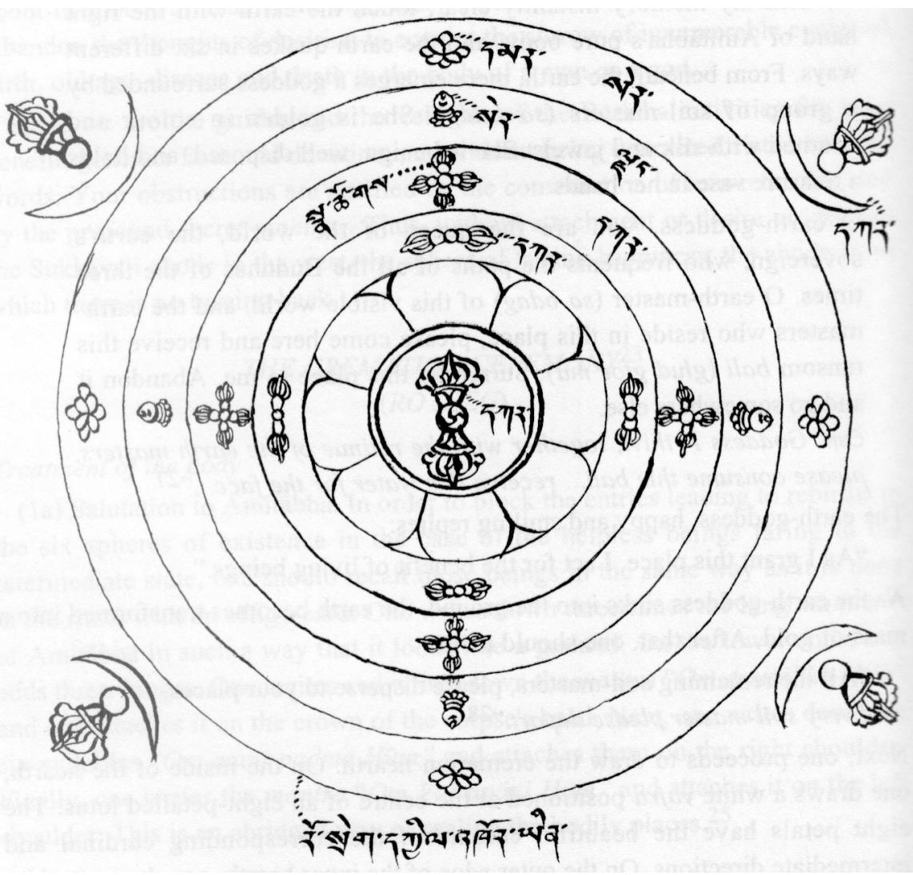

7. Design of the cremation hearth.

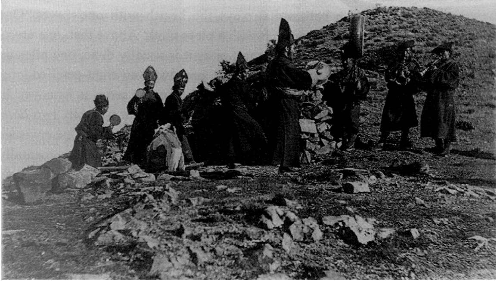

8. Funeral procession arriving at the site of disposing dead bodies.

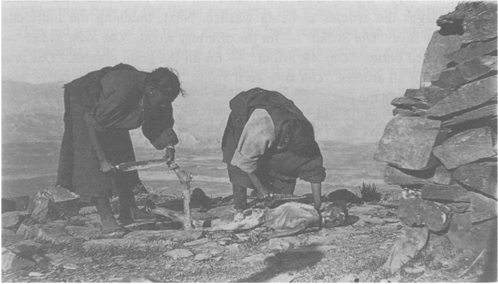

9. Cutting up and feeding the dead body to vultures.

white background, a yellow jewel on a green background, and a red lotus on a yellow background. On the four corners, one draws half-moons and half-*vajras*. 29 One rings the bell and surveys the hearth with one's eyes. One circumambulates it, and then covers it with a piece cloth. Above that, one erects a container for the corpse (*gdung khang*), or as it is usually done, one piles up wood into a square heap. On a piece of paper, one draws an eight-petalled lotus to serve as the corpse's seat, and an eight-spoked wheel to serve as its cover. In the vicinity, one arranges all the articles for burning and for worship, two *balis* for the fire-god, and one triangular *bali* for the Dharma-protectors. One envisages Hayagrīva, recites his *mantra*, and then deposits him inside the mentally perfected operative vase (*las bum*). One prepares the offertory wood, the kuśa grass and all the remaining articles, which are required for the cremation *homa*.

## *The cremation homa*

Following the Sukhāvatī rite of evocation, one envisages oneself as Amitābha. One sprinkles the items for worship and the casket containing the corpse (*spur khang*).

> "Oṃ amṛ*te H*ūṃ Phaṭ Oṃ *pure by nature are all dharmas*, *pure by nature am*  I."30 The clouds of worship, magically produced from the sky forever pure, pervade the sky and the earth. May the medicinal articles, *balis* (*gtor ma*) and different items for burning become countless in number. *Worship* (pūjā) Hoḥ."

One holds together the spoon and the ladle, and as one touches with them all the articles, one says: "Oṃ Āḥ Hūṃ. Oṃ Thaḥ Thaḥ Thaḥ Thaḥ Thaḥ Thaḥ Thaḥ." One envisages the articles as being washed. Next, touching the individual articles, one says: "Oṃ Svāhā" for the offertory wood; "Oṃ *Śṛīṃ* Svāhā"—for the melted butter; "Oṃ Āḥ Svāhā"—for all the grain articles; "Oṃ Jriṃ Svāhā"—for all articles; "Oṃ *kuru kuru Sv*āhā"—for the all-operative vase, the kuśa grass, and the fire.

Holding a fan together with a piece of silk (*me dar*) and a fine piece of cloth, one circumambulates the cremation site. (4a) One purifies it with the kuśa smoke and recites:

> "O blue-green kuśa born from the syllable Oṃ, become endowed with protection and excellence. Oṃ *Vajrasattva* Āḥ."

One takes two kuśa straws with the lotus gesture and says:

"Oṃ. This kuśa grass, pure and virtuous, performs the works for the pure gods and delights the Three Jewels. In essence, it represents leaves grown

!!!!!!!!!!!!!!!!!!!!!!!!!!!!!!!!!!!!!!!!!!!!!!!!!!!!!!!

<sup>29 <</sup>i>zla phyed rdo rje. 30

oṃ *svabh*ā*vasuddh*āḥ *sarvadharm*āḥ *svabh*āvaś*uddho 'ham*.

from the soil. May it pacify for me all the obstructions and make the things prosperous. Oṃ *Vajrasattva* Āḥ."

One arranges the kuśa grass on the outer border of the hearth in a clockwise order. One binds two bunches of it into a crossed *vajra* and places it at the centre with its top ends turned inwards. One purifies it by sprinkling it with the water from the all-operative vase. One rings the bell and recites in a melodious voice as follows:

> "From emptiness there arises the syllable Hūṃ, and from it this peaceful hearth endowed with its appropriated characteristics. Inside, it is filled with firewood. Above a lotus and a moon, there is the syllable Raṃ from which there arises Agni, the fire-god. He is white and has the appearance of a mendicant. He has four hands and one face with three eyes. His long hair is matted into a bundle on the top of his head. In one right hand, he holds a wand, and with the second right hand, he makes the gesture of fearlessness. In his left hands, he holds a water pot and a rosary. He sits on a goat with one leg drawn in and one pending down. He is surrounded by one thousand tongues of blazing flames. The syllables Oṃ Āḥ Hūṃ are on the three spots of his body, and his heart is sealed with the syllable Raṃ. All these articles for burning emerge from emptiness. They will become transformed into a heap of blazing fire permeated with the five colours of wisdom, which epitomise the five Buddha families emerged from the syllables Oṃ Hūṃ Trāṃ Hrīḥ Āḥ."

Next comes the visualisation of the blazing fire:

"The blue base of the flame represents the wisdom-fire of Vajrasattva. The red section of the flame above the base represents the wisdom-fire of Amitābha. The yellow waist of the flame represents the wisdom-fire of Ratnasambhava. The white flame above that represents the wisdom-fire of Vairocana. The black summit of the flame represents the wisdom-fire of Amoghasiddhi. Such are the flames of the five victorious families.

(O departed one), may you become completely purified from the five poisons, and acquire the five bodies of wisdom. May your five bodily aggregates become purified with the massive flames of the five wisdoms. Oṃ Hūṃ Trāṃ Hrīḥ Āḥ."

After that, one lights the fire while one sings the following *mantra* for kindling the fire:

"Oṃ *vajra blaze blaze H*ūṃ."31

Next, one waves a fan and recites:

"Hūṃ. O fire-mass of knowledge, do not disperse, divide or twist (5a) towards the cardinal or intermediate quarters, below or above. In order to

<sup>!!!!!!!!!!!!!!!!!!!!!!!!!!!!!!!!!!!!!!!!!!!!!!!!!!!!!!! 31</sup> oṃ *vajra jvala jvala H*ūṃ.

prevent any harm and trouble to gods and demons, I keep down your blazing head with this piece of silk. Oṃ. *O noble flame pacify Sv*āhā."

Next, one summons Agni, the fire-god:

"May Agni together with his host of hermits become summoned from the southwestern direction by means of the rays of light dispersed from the heart of the fire-god inside the hearth."

While ringing the bell with the left hand, one holds the right hand in the gesture of fearlessness, bends the thumb towards the base of the ring-finger, and moves the hand from the left nostril towards the right side.

> "Oṃ. Come here, come here great spirit, divine hermit, twice born and supreme. Duly approach this place in order to consume this burnt libation and food. Oṃ ṭ*akki H*ūṃ Jaḥ Hūṃ. O fire-god radiant with the flames of splendour, I invite you to take residence inside these flames in order to swiftly accomplish all aspirations by acting with compassion for the benefit of living beings. Oṃ. *O fire-god abide*  in *your pledge*. 32 O knowledge-fire and your retinue, I ask you to rest on this kuśa seat to the south-east of the hearth.

> O *Agni and your retinue*, *receive this water for the face Sv*āhā. *Receive this water for the feet Sv*āhā. 33

After offering the two kinds of water, one holds the *vajra* in the right hand and pressing the little finger with the thumb, one makes the pledge-gesture:

> "Hūṃ. This *vajra* is a mighty *vajra*. If you duly abide in this pledge sanctioned by all the Buddhas, approach the Buddha families without any delay. Oṃ *hana samaya H*ūṃ Phaṭ. O knowledge-fire become merged with the pledge-fire into one perfect union. Jaḥ Hūṃ Vaṃ Hoḥ.

> Dispersing once again the rays of light from their hearts, I summon the five Buddha families and execute the consecration. The water, which fills their bodies and overflows on the top, becomes transformed into the head ornament of Vairocana."

One recites the relevant *mantras* and presents the offerings, beginning with flowers and concluding with the presentation of sound. After that one recites:

> "Oṃ. O fire-god all in lustrous splendour. You are adorned (6a) with blazing bodily ornaments, full of splendour and zeal to work. As I present this burnt libation, you should perform all the appropriate works. O son of Brahma, the world's protector, the noble god of pacifying and other rites, I bow down and praise you, the sovereign of splendour. You duly accomplish all the desired tasks. The burnt articles are served as

<sup>!!!!!!!!!!!!!!!!!!!!!!!!!!!!!!!!!!!!!!!!!!!!!!!!!!!!!!!</sup> 32 oṃ *agnideva samaye ti*ṣṭha. 33

oṃ agnā*ye saparivara argha*ṃ *prat*ī*ccha sv*āhā. pādyaṃ *prat*ī*ccha sv*āhā.

ambrosia with the ladle and the spoon marked with the syllable Hūṃ, and they are consumed by the fire-god whose tongue is sealed with the syllable Raṃ and protrudes from his slightly gaping mouth."

One holds the spoon and the ladle, and one pours seven spoonfuls of the liquid butter into the ladle while reciting once the *mantra* "Oṃ *agnaye Sv*āhā." Next, without stretching the elbows beyond the knees, one holds together the ladle and the spoon, and one makes a clockwise circular gesture over the hearth. One envisages doing it three times. After that, one recites "Oṃ *agnaye havyakavyav*āhanā*ya Sv*āhā" and one pours the liquid butter into a container. One acts in this manner three or seven times. The auspicious signs in the fire are such as a cluster of blue smoke, a white tongue of fire, absence of unpleasant smell and the like. When bad omens appear, such as black flames or masses of smoke, one recites many times the *mantra* of Hayagrīva and sprinkles water from the all-operative vase.

> "Having summoned the departed one with the rays of light issued from the firegod's heart, I extract the obstructions of his sins (pāpā*vara*ṇa) with these rays of light. May his sins become dissolved into the burnt offerings and be consumed by the fire-god."

If the departed was a good person, one dissolves the obstructions of sins of all living beings.

The articles for burning should be offered with the thumb and the middle finger. At the beginning of all the *mantras* for the burnt articles, one prefixes "Oṃ *agnaye deva*."

Grasping one piece of the offertory wood, 34 one envisages it as a *bodhi* tree, and pointing its top upwards, one offers it reciting: "Oṃ *tree of enlightenment Sv*āhā. 35 Pacify for the departed one all the evil obstructions which hinder his splendour and perfect state Svāhā."

For the other articles, one recites the following *mantras*:

For the liquid butter: "Oṃ *agnaye Sv*āhā. Pacify for the departed one, (or for myself and other living beings), all the obstructions of sins Svāhā."

For all the articles, one recites: "Pacify all the impediments, which hinder the life of prosperity and excellence in different paternal rebirths."

For the black sesame: "Oṃ *vajra consuming all sins Sv*āhā. 36 Pacify for the departed one all the obstructions of sins Svāhā."

!!!!!!!!!!!!!!!!!!!!!!!!!!!!!!!!!!!!!!!!!!!!!!!!!!!!!!!

<sup>34 <</sup>i>yam shing / samidh. 35

oṃ *bodhivṛḳṣāya sv*āhā. 36

oṃ *sarvap*āpaṃ *dahanavajr*ā*ya sv*āhā.

For the white mustard: (7a) "Oṃ *fulfilment of all goals Sv*āhā. 37 Pacify for the departed one all the fears and terrors of the intermediate state Svāhā."

For the excellent food consisting of butter and different white articles mixed together: "Oṃ *every accomplishment Sv*āhā. 38 Pacify for the departed one all the obstructions of sins, which hinder his perfect happiness Svāhā."

For the *durv*ā grass or its substitute: "Oṃ *vajra-longevity Sv*āhā. 39 Pacify for the departed one all the obstructions of sins, which hinder a state of perfect life in another rebirth Svāhā."

For the barley: "Oṃ *great vehemence Sv*āhā. 40 Pacify for the departed one all the obstructions of sins, which hinder his strength to reach the sphere of the Buddhas Svāhā."

For the wheat: "Oṃ *vajra-eagerness Sv*āhā. 41 Pacify for the departed one all the obstructions of sins, which hinder his happiness and healthy life in another rebirth Svāhā."

For the unhusked barley: "Oṃ *vajra-seed Sv*āhā. 42 Pacify for the departed one all the obstructions of sins, which prevent an abundance of cattle and grain in another rebirth Svāhā."

For the peas: "Oṃ *great vajra-strength Sv*āhā. 43 Pacify for the departed one all the obstructions of sins, which diminish strength in another rebirth Svāhā."

For the rice: "Oṃ *vajra-prosperity Sv*āhā. 44 Pacify for the departed one all the obstructions of sins, which hinder an acquisition of perfect merit."

For the kuśa: "Oṃ *indestructible vajra Sv*āhā. 45 Pacify all the obstructions of sins, which hinder a state of perfect protection of the departed one Svāhā."

For the *bilva* nuts, or if not available for the rose-bush or juniper seeds: "Oṃ *vajra-benevolence Sv*āhā. 46 Pacify for the departed one all the obstructions of sins, which hinder a perfect family lineage Svāhā."

For the three sweet things or the three white things: "Oṃ *vajra-garland prosperity*  Svāhā. 47 Pacify for the departed one all the obstructions of sins, which hinder perfect wisdom Svāhā."

<sup>!!!!!!!!!!!!!!!!!!!!!!!!!!!!!!!!!!!!!!!!!!!!!!!!!!!!!!! 37</sup> oṃ *sarv*ā*rthasiddhaye sv*āhā. 38

oṃ *sarvasampade sv*āhā. 39

oṃ *vajr*āyuṣe svāhā. 40

oṃ mahāvegā*ya sv*āhā. 41

oṃ *vajraghasmare sv*āhā. 42

oṃ *vajrab*ījā*ya sv*āhā. 43

oṃ *vajramah*ābalā*ya sv*āhā. 44

oṃ *vajrapu*ṣṭāye svāhā. 45 oṃ *apratihatavajr*ā*ya sv*āhā. 46

oṃ *vajra*śivā*ya Sv*āhā. 47

oṃ *vajram*ā*le pu*ṣṭaye svāhā.

When white flowers are not available, (one substitutes them with) barley: "Oṃ *vajra-flower* Svāhā. 48 Pacify for the departed one all the obstructions of sins, which hinder perfect colours and splendour in another rebirth Svāhā."

For the scent, betel, tea and other articles (8a) included within the category of drinks: "Oṃ *vajra-betel* Svāhā. 49 Pacify all the obstructions of sins, which hinder a perfect welfare of the departed one Svāhā."

For the different kinds of medicine: "Oṃ *medicine Sv*āhā. 50 Pacify for the departed one all the obstructions of sins, which hinder a state of perfect health in another rebirth Svāhā."

For the silk and different pieces of cloth: "Oṃ *vajra-garment Sv*āhā. 51 Pacify for the departed one all the obstructions of sins, which deprive of excellent ornaments and garments in another rebirth Svāhā."

If at this point, one wishes to offer the unfinished grain articles, food, drink and so forth, one recites "Oṃ *agnaye deva*," adds the deity's *mantra*, affixes Oṃ Āḥ Hūṃ, and then continues: "Pacify all the obstructions of sins of the departed one Svāhā." When one offers the sesame, one recites the *mantra* twenty-one times, and for the remaining articles three or seven times.

Next, one offers the articles of worship, which are placed before oneself. One offers them individually one by one.

> "Whatever water for the face is procurable in the boundless sphere of the entire world, and the water arranged here by me with devotion, I offer it to the hosts of the hermit fire-god. Receive it and perform the work of pacifying.

> Oṃ. *Fire-god together with your retinue*, *receive this water for the face*. *The concurrence of dispersing an ocean of clouds of worship* Āḥ Hūṃ."

One recites similar verses for the remaining articles of worship: water for the feet (pādya), flowers (puṣpa), incense (dhūpa), light (ā*loka*), scent (*gandha*), food (*naivedya*), and sound (ś*abda*). One duly presents the articles of worship, butter lamps, food and all the remaining articles. At the time of presenting the offering of sound, one should scatter flowers and ring the bell. If it is an elaborated performance, one strikes loudly the big cymbals (rol *chen*).

> "Oṃ. O son of Brahmā, the world's protector, the king of the fire-god and the supreme hermit. O supreme hermit perfected by means of the relevant *vidy*ā and *mantra*, which have assumed a bodily form through the power of great compassion for the sake of protecting all the spirits. O great

<sup>!!!!!!!!!!!!!!!!!!!!!!!!!!!!!!!!!!!!!!!!!!!!!!!!!!!!!!! 48</sup> oṃ *vajrapu*ṣ*pe sv*āhā. 49

oṃ *vajrat*āmbūlā*ya sv*āhā. 50

oṃ oṣ*adhi sv*āhā. 51

oṃ *vajravastr*ā*ya sv*āhā.

powerful master of the efficient works, you blaze with lustre similar to the final conflagration. You are surrounded by a retinue of wisdom and magical feats. You ride a goat, a perfect vehicle of expediency. You hold a rosary and recite *vidy*ās and *mantras*. Holding a vessel filled with the essence of ambrosia, you refresh us all with the ambrosia of the Dharma. You purify and remove the impediments of sins. Although present in the world, you are transcendent, and in spite of being determined to pacify the things, you have great compassion. I bow down before you and recite praises. Accomplish the work of pacifying and remove the obstacles on the path. Originally, the great hermit fire-god made a promise and took this oath: 'The fire is the face of the gods and resides in the fire of these burnt libations.' O fire-god, you and the mass of flames abide together and act in a non-dual manner. Perform the task of placing this burnt libation and all the articles of worship into the mouths (10a) of the divine host of the Sukhāvatī abode. The hermit fire-god emanated from the fire-god's heart is born from the mind. Since he resembles himself, he has assumed the function of the fire-place in order to worship the divine host."

Next, one follows the text of the Sukhāvatī evocation, starting with the words: "The large and vast belly of the fire-god becomes a palace generated from the rays of light. At the centre of the palace there is the lord Amitābha seated on a lotus and moon throne, red in colour..." and so forth and up to: "*partake of this bali*.

If the departed was an ordinary person, one envisages his bodily remains and the offered articles as being the same, namely they are envisaged as offerings for the divine host of Amitābha. If the departed was a holy person, one envisages his bodily remains and the divine host as being the same.

The articles for burning and those for worship should be offered in a correct sequence. One recites "Oṃ *Amit*ā*bha Hr*īḥ" and affixes the above given *mantras* of all the articles offered for burning. When one counts the number of offerings, the deity's *mantra*, the *mantra* of each article and a desired prayer, these three taken together, count as one. The presentations to the chief deity should be offered one hundred times. Next one recites "Oṃ maṇi *padme H*ūṃ" affixed with the *mantras* of the individual articles, and one offers the articles twenty-one times to Mahākāruṇika. Similarly one recites "Oṃ *Vajrap*āṇi Hūṃ" and offers the articles to Mahāsthāmaprāpta, also twenty-one times. After that, one recites "Oṃ *all the Buddhas and Bodhisattvas* together *with your retinue*" and one presents the articles to all the Buddhas and Bodhisattvas of the Sukhāvatī abode. One does it either seven or twenty-one times.

> "Whatever water for the face is procurable in the limitless expanse of this world… Oṃ *Amit*ā*bha together with your retinue receive this water for*

*the face*, (water for the feet, flowers, incense, scent, (11a) food, and sound)."52

Up to this moment, one has performed an extended worship. Next, one lifts the large *bali*  for the fire-god, smears it with melted butter, and blesses it by reciting the "Akāro" *mantra*. After that, one recites seven times, "Oṃ *Amit*ā*bha Hr*īḥ *together with your retinue partake of this bali*."53 One offers the *bali* and then recites:

> "O Lord together with your retinue. Having partaken of this offered *bali*, please bestow the attainments of the pacifying, enriching and other rites. Provide me with protection through your pledges. Remain my constant companions in all my endeavours. Prevent untimely death and diseases, and destroy demons and obstructive spirits. Dispel bad dreams, inauspicious omens, and evildoers. Bring mundane happiness, rich harvests, plenty of grain and large herds of cattle. Bestow all possible attainments of happiness and prosperity."

At the end of the above verses, all those who are present should repeat them while focusing their body, speech and mind. After that, the *bali* should be disposed into the cremation kiln (*gdun khang*). One should recites the passage starting with "Oṃ *vajrabody*" and concluding with the words "*Vajrasattva H*ūṃ," just as it is given in the ritual text.

> Next, one sprinkles the *bali* for the protector of the Dharma. 54

"I disperse rays of light from their hearts and summon the sphere-protector55 and his consort clasped round his body. I envisage them seated in the vicinity of Vajrapāṇi on the fire-god's belly epitomising the Sukhāvatī abode."

Next, one offers the articles of worship. One recites the passage starting from "Oṃ. The protector of Amitābha's orders" and up to "I top up (*bkang*) with the articles which are appropriate to you. Partake of this burnt libation and the articles of worship. Oṃ *receive this water for the face*" and so forth. 56 Upon concluding this passage, one should recite the protector's *mantra*57 affixed with

!!!!!!!!!!!!!!!!!!!!!!!!!!!!!!!!!!!!!!!!!!!!!!!!!!!!!!!

<sup>52</sup> One recites here the verses of the individual articles of worship in the same way as it was done when presenting them to Agni, except for substituting Agni's *mantra* with that of Amitābha.

<sup>53</sup>

oṃ *amidheva hr*īḥ *saparivara ida*ṃ *bali*ṃ *kha kha kh*ā*hi kh*āhi. 54 *chos-skyong / dharmap*āla. 55 *zhing skyong / k*ṣ*etrap*āla. 56 This particular passage is to be recited from another text entitled "*Zhing skyong*" which contains an evocation of Nag po Seng ge'i gdong and the relevant recitations for presenting offerings.

<sup>57</sup> oṃ siṃ*hamukha h*ūṃ phaṭ. oṃ *sinarama h*ūṃ phaṭ. *tri hrid dra*ḥ phaṭ. *tri hrid* jaḥ.

the *mantras* of the articles, and one should offer seven times all the articles for burning.

"Hūṃ. In ancient times, and in front of the Victorious Ones, you made a promise to protect the Buddha's Word. I praise the sphere-protector and his retinue, whose power and might expand to the limits of the sky. (12a) Accept these pure articles of burnt libations and worship, accomplish the works of the Four Rites, and fulfil all that has been entrusted to you."

Next, one sprinkles the *bali* with melted butter and recites the relevant verses, 58 and then one recites the following verses:

> "Hūṃ. O noble sphere-protector, accept this *bali*. Support the departed one right from the start and follow him behind towards the sphere of great happiness. Avert the obstructions from this place and the path. For those who are alive and well, please remove all diseases and obstructive demons. Bring blessings and happiness."

The *bali* is disposed into the hearth.

When one performs an extended version of this rite, one generates the Sukhāvatī abode inside the heart of the fire-god, and on the edge of it, one envisages the departed person. Next, one performs the rite for non-returning according to the ritual with an effigy-card. If one performs a shorter version, one generates the deities and continues the evocation up to the vase consecration, following the ritual with an effigy-card. After that, one executes the blessing of food, following the same ritual. The articles of food are offered into the hearth. The rite of showing the path and the benediction follow the ritual with an effigy-card. With this concludes the essential part of the cremation ceremony.

# *Concluding rites*

Next, one offers seven times the articles for burning while reciting Amitābha's *mantra*  affixed with the *mantras* of the individual articles. After that, one offers the articles of worship while reciting the same *mantra* affixed with "Oṃ receive the water for the face" and so forth.

> "Hūṃ. I bow down and praise Amitābha seated in meditation. He turns the Dharma-wheel in the Sukhāvatī abode, always beholds living beings with compassion, upholds his promises, and protects living beings."

Such are the words of praise. Next, one asks for forgiveness.

<sup>!!!!!!!!!!!!!!!!!!!!!!!!!!!!!!!!!!!!!!!!!!!!!!!!!!!!!!! 58</sup> The text refers the performer to the text mentioned two notes above. At this point, one summons into the *bali* the fierce demons who cause obstructions and difficulties to the departed one on his journey towards the Sukhāvatī abode. The sphere-protector is invoked to consume the *bali*, and thus to destroy the obstructive demons.

"Oṃ. Whatever imperfections and faults I have committed with my obscured mind, and whatever deficiencies I have inflicted upon this excellent performance, I beseech to be forgiven for all of them."

At the conclusion of reciting the above lines one time, one recites the one-hundred syllables of Vajrasattva. After that, one recites:

> "Oṃ. Accomplish all the beneficial goals of living beings and grant them appropriate attainments. At this moment, I request you to depart to the Buddha sphere. However, although you depart to the Buddha sphere, I beseech you to return once again (in the future). Oṃ *vajra Mu*ḥ. O knowledge-deities depart to your places. O pledge-deities dissolve within me."

After that, without counting them, one offers the remaining articles for burning to the mundane fire-god in the same way as it was done above. (13a) Next, one sprinkles the melted butter over the *bali* for the fire-god. The benefactor, · standing to the left, takes the *bali* and holds it up. One consecrates it with the "Akāro" *mantra* and blesses it three or seven times with the *mantra* "Oṃ *Agni together with your retinue*" and so forth.

> "O fire as the god consuming the burnt offerings, the king of hermits and the master of demons, I bow down, praise and worship you together with the host of the fire-god from the south-east direction. Accept this *bali* and perform the pacifying, enriching and other rites. Bestow all desired attainments."

The prayer for the fulfilment of desired intentions is repeated by the benefactor. One offers the remaining articles for worship with Agni's *mantra* affixed with the *mantras* of the articles of worship.

> "O son of Brahmā, the master of the world and mighty protector, you are empowered by Ṭakki, the sovereign of the fire-god. Consume all defilements with the fire of the supreme wisdom. I bow before the very fire-god of steadfastness."

Next, one repeats the above request for forgiveness starting with the words "Oṃ. Whatever imperfections and faults" and concluding with the words "I beseech to be forgiven for all of them." After that, one recites the hundred syllables of Vajrasattva, and then the following verses:

> "O Agni, 59 leave this place for my own and other people's benefit. Come back once again on a similar occasion. Bestow upon us all attainments. Oṃ *agnaye saparivara vajra Mu*ḥ. O Agni of knowledge, depart towards the south-east direction. O pledge-being assume the form of the flames."

<sup>!!!!!!!!!!!!!!!!!!!!!!!!!!!!!!!!!!!!!!!!!!!!!!!!!!!!!!! 59</sup> byin za.

One motions outwards the thumb of the summoning gesture. One recites a prayer for blessing, shows the way, recites three times the hundred syllables, and then pronounces in a clear voice the *mantra* of dependent origination. One stops reciting and puts down the *vajra* and the bell.

# *Disposal of the ashes*

While reciting "Oṃ *vajrasamaya Ja*ḥ Jaḥ Hūṃ Vaṃ Hoḥ," one collects the bones, ashes and charcoals. If the ashes and charcoals are of a pure person, one throws them into some large waters. When living beings drink this water, their obscurities become purified. If the ashes and charcoals are of an ordinary person, they should be disposed at a place, which is free of serpents, and which is prosperous and auspicious. The bones should be placed inside a clean vessel. One should wash and induce them to come back (*phyir ldog*). This is called "the rite of the bones."60 One arranges before oneself a white *bali*, and following the meditational procedure explained in connection with the rite of taking possession of the ground, one blesses the *bali* and offers it to the soil-deity (*sa lha*). One takes the acquired soil, places it down and makes a heap at the front.

> "I instantly recollect the nature of the letter A. Rays of light disperse from the heart of Amitābha's radiant body into the ten directions, (14a), and arouse the hearts of all the Victorious Ones. Next, the rays of light emanated from their bodies pervade and dissolve into the soil, and the soil assumes the nature of the five wisdoms. Oṃ Bhrūṃ Svāhā."

One recites this twenty-one times.

"From the letter A placed on the palms of my hands there arises the syllable Hūṃ positioned on a lunar disc. Next, from the syllable Hūṃ there emerges a white five-pronged *vajra*, which melts and dissolves into the palms. The hands acquire the *vajra*-nature and the fingers become one-pointed *vajras*. Oṃ *Vajrasattva*  Hūṃ."

The bones should be ground by a disciple of the deceased or by a person, who is not a relative, and who is free from great sins. One washes the bones with water and mixes them with soil into a clay mass. In order to remove all impurities, one sprinkles them with the water from the all-operative vase and recites the *mantra* of Hayagrīva. One purifies them in emptiness by reciting "Oṃ *pure by nature are all dharmas*, *pure by nature am*  1."61 After that, one recites: "May these bones become a jewel aggregate (*skandha*) through the syllable Bhrūṃ." One presses the thumbs on the little fingers, joins together one's hands, and touching the clay mass twenty-one times, one recites twenty-one times the long

!!!!!!!!!!!!!!!!!!!!!!!!!!!!!!!!!!!!!!!!!!!!!!!!!!!!!!!

<sup>60 <</sup>i>rus chog. 61

oṃ *svabh*āvaś*uddh*āḥ *sarvadharm*āḥ *svabh*āvaś*uddho 'ham*.

*mantra* of Amitābha. Then one places the hands on the clay-mass once more and recites: "May different bodily forms arise from the nature of the *dharmak*āya and emptiness. Oṃ *dharmadh*ā*tugarbhe Sv*āhā."

This concludes the rite of the bones.

## *Casting tsha tshas*

After that, many people recite "Oṃ Bhrūṃ Svāhā" and the six or two syllables, whichever they prefer. This is called the rite of casting (*tsha tshas*). When the *tsha tshas*  have become dry, it is good to execute the so-called perfecting prayer over the white wash62 (for the *tsha tshas*), but if it is not available, there is no impediment. One arranges all the *tsha tshas* in an orderly way and prepares butter lamps for worship. Next, one recites the following *mantra* and verses:

> "Oṃ *pure by nature are all dharmas*, *pure by nature am I*. From the nature of emptiness there emerges a stūpa. The red lord Amitābha sits on a lotus and moon throne in the magnificent palace of jewels inside this vase which has become large and many."

One follows here the Amitābha evocation except for the rite of summoning life. After that one continues:

> "O lord who are present before me, please dissolve into light and assume the form of a stūpa."

One consecrates the *tsha tshas* by reciting twenty-one times the heart *mantra* of dependent origination and by scattering barley. If the bone *tsha tshas63* are made from the bones of an ordinary person, they are placed in a cave, which is dry and free from the earth demons, and which cannot be circumambulated. Finally, one offers a white *bali* to the deity of that place.

## *Relevant instructions*

The cremation fire of the departed person should not be kindled by his religious confreres or by his relatives. The kindling of the fire should be entrusted to a young monk (*grva*  pa). Some people say that setting the fire to the dead body of an ordinary person has evil effects. So one should give money and request a person who knows how to kindle this kind of fire. (15a) The saying that "upon calling the dead person's name, the fire and ashes become scattered" is interpreted in the sense that since the soul (bla) is present in the corpse, some frightening visions appear. However, although there exist such erroneous ideas, one should not imitate them. The fire should be kindled by the master himself.

When the bodily remains are of a good person, one generates his chosen deity, whichever it may be, presents offerings, recites verses of praise, and then invites

!!!!!!!!!!!!!!!!!!!!!!!!!!!!!!!!!!!!!!!!!!!!!!!!!!!!!!!

<sup>62 <</sup>i>dkar rtsi gsol grub. 63 *rus tsha*.

it to depart. One generates the remains as a pledge-deity. One offers it worship, recites praises, and then dissolves it. It is said that if one does not do this, the *guru*'s remains are similar to a broken golden image. However, if one does it, the remains will persist. There is also a burnt libation for the bodily remains and the chosen deity united together so that no evil incidents can affect it.

Above the cremation place (*gdung khang*) or over the head of the remains of a good person, one places a consecrated image. If one does not do it, the relics64 and other supports will attract the ḍā*kinis*. These oral instructions are of great importance. (…)

When one wishes or when the living benefactor requests to pour out some burnt libations in order to remove all obstructions and to purify the teeth, nails, hair or old garments, all the ritual activities are performed in the same way as above. One should induce the so-called dead person to become endowed with life. One should make him return and gratify his faculties. One should execute the rite of summoning life using his substitute. One should summon the sphere- protector and offer a *bali*. The rest of this rite is performed in the same way as in the ritual with an effigy-card. It is good if one makes *tsha tshas* and the rest.

#### *RITUAL WITH AN EFFIGY-CARD* (*BYANG CHOG*) 65

(1a) *Hatara*. Salutation to the divine host of the lord Amitābha.

# *Arrangement*

As for the effigy, one arranges before oneself the departed person's corpse or a piece of bone, a tuft of hair, his image inscribed with his name, or one just writes the syllable Nri66 on a piece of paper. On a dish67 one arranges one or three *lcog rdog* (cones made of dough), one or three *changs bu* (pellets made of flour), and a *ting lo* (lamp made of dough), black sesame or mustard seeds, sand, and the five articles for gratifying the senses.

# *Summoning the consciousness*

!!!!!!!!!!!!!!!!!!!!!!!!!!!!!!!!!!!!!!!!!!!!!!!!!!!!!!!

One focuses one's mind on the bright host of the deities in the vase already perfected through the Sukhāvatī evocation. One venerates many times the meditational repository, 68 and then while sprinkling the meditational support, 69 one recites as follows:

<sup>64 <</sup>i>ring bsrel / śarīra. 65 *gNam chos thugs kyi gter kha snyan brgyud zab mo'i skor las bDe chen zhing sgrub gi byang chog thar lam dkar po*. 66 Sanskrit nṛ, man.

<sup>67 <</sup>i>theb rtse. 68 *dmigs pa gtad Ia mang du bsnyen*. 69 *dmigs rten* = effigy card.

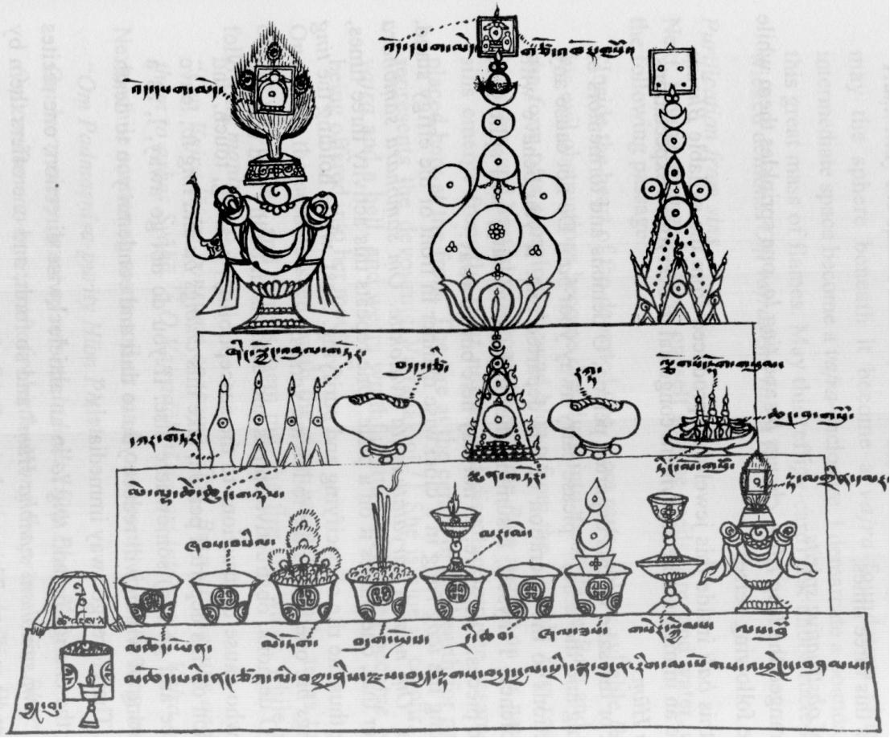

10. Arrangement of the items for the ritual with an effigy-card. Top: Amitābha's vase, *bali* for Amitābha's host, *bali* for the protective deity. Second row: four *balis* for Agni and protective deities, skull with ambrosia, medicinal *bali*, skull with blood, dish with *lcog rdog*, *changs bu* and *ting lo*. Third row: eight offerings with the all-operative vase at the end. Lowest row: effigy-card (*byang bu*).

"Oṃ *katiman*ā*ya H*ūṃ Phaṭ. Oṃ *pure by nature are all dharmas*, *pure by nature am I*. (2a) O departed one before me, assume the form similar to your living body. Homage to the Three Jewels and the three root deities. On account of the truth of the chosen deity, O consciousness of this person of such and such a name, wherever you are, above, below or in the intermediate space, I summon you from that place to this body, name, and bones. *Vajr*ānkuś*a Ja*ḥ."

One recites this three times.

# *Removal of obstructive spirits*

Having arranged the *lcog rdog*, *changs bu* and *ting lo*, one sprinkles them while reciting the following verses:

> "May this *bali* inside this jewel-dish produced from the syllable Bhrūṃ become an immeasurable enjoyment congenial to everyone's expectations. Oṃ Āḥ Hūṃ.

> Hūṃ. For the sake of this departed person, O demons and tormentors of the living and the dead, 70 please carry away your *bali*. Do not cause any obstructions to the liberation of this departed one. If you behave with disobedience, I myself, assuming the pride of a deity, will split your heads to pieces. Therefore, do not stay here but go away."

While turning the *lcog rdog* in a clockwise manner in front of the effigy stand, one recites "Oṃ *nama*ḥ *sarvatath*ā*gata avalokite*. Oṃ saṃ*bhara sa*ṃ*bhara H*ūṃ." After that, one places it on a plate. One repeats this activity three times, performing thus the rite of pacifying and purifying. Next, while holding the *ting lo* and *changs bu*, one recites the following verses:

> "Hūṃ. O demons, obstructive spirits and demons in bodily and ethereal forms, who cause obstructions to the susceptibility, hearing, touch, and perception of this departed person, take this *changs bu* and *ting lo*, leave this place and go (3a) somewhere else. If you do not go away, I, as a mighty king of wrath, will reduce you to dust and condemn you to death in hells. Therefore, go away immediately."

Circulating the *changs bu* and *ting lo* in an anticlockwise direction, one recites three times "Oṃ *sumbhani sumbha H*ūṃ" and so forth, and one offers them by placing them on a plate. This concludes the rite of purification, which is half- peaceful and half-wrathful. After that, one performs the fierce rite of purification:

> "Hūṃ. I, through the meditation on the deities, pervade the ten directions with rays of light, and I bring back a mass of rays of light from the ten directions and from the Sukhāvatī abode. It is with these rays of light that I expel you, who cut off and steal the life-force (*srog*) and vitality

<sup>!!!!!!!!!!!!!!!!!!!!!!!!!!!!!!!!!!!!!!!!!!!!!!!!!!!!!!! 70 <</sup>i>gson po'i bdud dang shi ba' gshed.

(*mdangs*), and who cause obstructions to this departed person. Leave this place and go away to another place. Hūṃ Hūṃ *sumbhani su*ṃ*bha H*ūṃ."

After reciting the above verses three times, one scatters pieces of metal.

*Demarcating a protective boundary*

Next, one demarcates a protective boundary and produces a protective circle:

"Hūṃ. May the sphere above (the effigy-card) become a *vajra*-abode, and may the sphere beneath it become a *vajra*-foundation. May the intermediate space become a *vajra*-enclosure. I demarcate a boundary with this great mass of flames. May this (effigy-card) rest unobstructed by the wicked demons. Oṃ *vajranemi*  rakṣa Hūṃ."

*Purification from sins*

Next, having arranged before oneself sesame seeds, fire, and water, one recites the following passage:

> "Inside the heart of the departed one, there rests a black syllable Paṃ. All his evil obstructions become dissolved into the syllable Paṃ and assume the form of a scorpion. A wind blows from the syllable Yaṃ resting on his soles, and heat glows from the syllable Raṃ resting on his navel. The sins emerge from the right nostril and dissolve into the sesame seeds placed here at the front. The fire at the centre of the hearth for pacifying represents the devouring Vajraḍākinī. 71 She is blue in colour, holds a *vajra* and a bell, and wears wrathful attires. The sins become burnt by being offered into her mouth."

One takes the sesame seeds with the right and left hands, turns the hands in circles nine times, and throws them into the fire and water, while reciting the following *mantra*:

> "Oṃ *Vajra*ḍākinī *consume consume H*ūṃ. *Burn all the sins and reduce them to ashes Sv*āhā. 72 *O Vajra*ḍākinī *depart into space*. *Vajra Mu*ḥ."

Next, while scattering some soil or sand, one recites the following *mantras*:

"Oṃ *Padmoṣṇīṣa-purity H*ūṃ Phaṭ. Oṃ *burn every cause of rebirth* in *hells H*ūṃ Phaṭ. (4a). Oṃ *consume every cause of rebirth among the pretas H*ūṃ Phaṭ. Oṃ *destroy every cause of rebirth among the animals H*ūṃ Phaṭ. 73

<sup>!!!!!!!!!!!!!!!!!!!!!!!!!!!!!!!!!!!!!!!!!!!!!!!!!!!!!!! 71</sup> rDo rje mkha' 'gro.

<sup>72</sup> oṃ *vajrar*ḍā*ki khakha kh*ā*hi kh*ā*hi h*ūṃ. *sarvap*āpaṃ *dahana bhasmi*ṃ *kuru*

svāhā. 73

oṃ *padmoṣṇīṣavimale h*ūṃ phaṭ. pṃ *daha daha sarvanarakagatihetu*ṃ hūṃ phaṭ. oṃ *paca paca sarvapretagatihetu*ṃ hūṃ phaṭ. oṃ *matha matha sarva tiryaggatihetu*ṃ hūṃ phaṭ.

Oṃ Āḥ Hrīḥ Svāhā. Pacify all the obstructions of sins of the departed person Svāhā."

## *Lustration*

After that, one recites the supplication for the divine ablution. 74 One holds a vase in one hand and reflecting a mirror towards the table with the offerings, one recites as follows:

> "Hūṃ. I beseech to wash with this scented water the body of Amitābha. Although the impurities have no power over the gods, I perform this function of purifying all evil obstructions. This is the highest ablution endowed with lustre. This is the most excellent water of compassion. It is the water of blessing and knowledge. Please bestow the appropriate attainments."

One acts in a manner of wiping with a cloth and putting on a garment:

"Hūṃ. I wipe this white cloth, soft and scented, on the surface of Amitābha's body. Although the impurities have no sway over his body, I perform this function of removing suffering. Hūṃ, I put this beautiful and yellow garment on the body of the Victorious One. Although the cold has no sway over his body, I perform this function of intensifying his lustrous appearance. Oṃ *vajravastra* Āḥ Hūṃ."

The water used for the ablution should be poured into another vase. If the second vase is not available, one uses just one vase. One reflects the mirror against the departed one and recites:

> "Hūṃ. This vase is a residence of the divine hosts of Amitābha. (O departed one) become purified from the obstructions of your sins, and gain liberation from the grip of the three poisons.

> This is the water of the six perfections (pā*ramit*ā). It removes the six kinds of impurities and gives rise to the six perfections. This water truly purifies as I perform this act of washing.

> As I execute this ablution of the six rivers, the six kinds of passions become washed away. I bow before the actual performer of this ablution, who is free from the power of sins.

> Through this ablution of the six rivers, the performer removes the six kinds of impurities. Being endowed with the six excellent qualities, the performer of this excellent ablution remains free from the power of sins.

> I execute this ablution with faith in order to worship (5a) all the Buddhas, who are endowed with all the excellent qualities, which are free from the six kinds of impurities.

<sup>!!!!!!!!!!!!!!!!!!!!!!!!!!!!!!!!!!!!!!!!!!!!!!!!!!!!!!! 74 <</sup>i>lha khrus gsol ba.

Oṃ *Amit*ā*bha Hr*īḥ. Purify and cleanse all the sins of the departed one Svāhā."

The above *mantra* should be inserted between all the above stanzas while one washes the Buddha's image reflected in a mirror.

Next, one purifies and destroys the poisons. Taking some sand, one recites:

"Hūṃ, O departed one, I beseech the host of Amitābha to purify and remove for you the obstructions of the three, five and eight poisons. Desire, hatred and delusion are the three poisons in this world. They have no power over the Three Jewels. May they become destroyed by the truth of the Three Jewels. Oṃ *Amit*ā*bha Hr*īḥ. Pacify for the departed one all the obstructions of the three poisons Svāhā."

As one recites the above verses, one should throw some sand (at the effigy-card). Next, one takes the kuśa grass from the vase, and holding it together with the dish containing sand, water and fire, one recites as follows:

> "The four primary elements are the father of the poisons. The four primary elements are also the mother of the poisons. May the poisons of the departed one become neutralised Through my enunciation of these words of truth."

One waves a fan in a circular way over the effigy-card.

"Oṃ *Amit*ā*bha Hr*īḥ. Purify for the departed one the primary elements, and remove all the poisons that derive from them Svāhā."

As one recites the above *mantra*, one pours water into a plate.

"May through the Buddha's merit and power, and through the applied minds of all the gods, all your desired goals, whatever they are, become fulfilled this very day. O two-footed one, become happy. O four-legged one, become happy. May your pathways become happy. Be also happy when you return here. Be happy during the day and during the night. Be also happy in the middle of the day. Remain constantly happy, day and night. May no evil come your way."

While scattering flowers and barley, one recites:

"May the departed one be victorious over all the discordant directions."

*Instructions and consecrations*

Next, one explains the Dharma and gives the following instructions: 75 (6a)

> "O departed one of such and such a name. As you wander about in the places of the six families, pray to the six powerful sages and protectors of the six families, and become liberated. Oṃ maṇ*i padme H*ūṃ."

<sup>!!!!!!!!!!!!!!!!!!!!!!!!!!!!!!!!!!!!!!!!!!!!!!!!!!!!!!! 75 <</sup>i>chos bshad gdams ngag ston pa.

If a relative is present, he should make prostrations, and one envisages that they are actually made by the departed one himself:

> "*E ma ho*. I bow with the devout mind of the departed person before the perfect Buddha Amitābha, Mahākāruṇika and Mahāsthāmaprāpta, and before the host of countless Buddhas and Bodhisattvas. I bow before the six victorious sages, the guides on the path to the Sukhāvatī abode, the Sugatas who had abandoned all adherence to the six miseries, the teachers of the six perfections, the purifiers of the six miseries, and the manifested bodies as the sages of the six families. I ask you to destroy the entrances to the six spheres of rebirth."

While repeating the above verses, the relative should make as many prostrations as possible. After that, imagining that this is pronounced by the departed person, one recites:

> "*Kye ma*. O protector Amitābha, please listen. This sinful dead person is similar to me. Being oppressed by the sorrow of saṃsāra, I take refuge in you. Although I am sheltered by your compassion, I request you to grant me the consecrations."

One repeats this three times. After that, one gives instructions to take the three refuges and raise the thought of enlightenment, envisaging that these things are actually done by the departed person:

> "Homage to the Three Jewels and the three root deities. I take refuge at the places of their protection. I raise the thought of the supreme enlightenment in order to bring all living beings to buddhahood."

One recites this three times and envisages the departed person repeating it.

"Above there is a flower, the water-born lotus. Inside it, there is the departed one in the form of the White Being (Avalokiteśvara) marked with Oṃ Āḥ Hūṃ on the three bodily spots. Rays of light disperse from these three seed syllables and bring down from the Sukhāvatī the body of Amitābha, his *mantra* garland and attributes, and the attendant hosts, all of whom arrive like a whirling snow storm. They gently pervade and dissolve into the body of the departed one. (7a) Hūṃ. O entire host from the Sukhāvatī abode, I summon you to come to this place, and I beseech you to bestow great blessings. Bestow the highest consecrations upon this devout person. O guides, please dispel all the obstacles to his liberation."

One rings the bell and recites the following *mantra* three or seven times: "Oṃ *Amit*ā*bha*  Hrīḥ *vajr*āvśā*ya A*ḥ." Next, acting in the manner of placing the *vajra* on the head (of the departed one), one says: "Tiṣṭ*ha vajra*." Holding the vase in one's hand one recites:

"Hūṃ. O disciple who has departed from this life, listen to me. This vase having such a simple external appearance is nothing else but a vase made of jewels. Inside it there is a palace made of jewels. Within that palace, there resides Amitābha and the host from the Sukhāvatī abode. They dispense blessings like showers of rain. As they become dissolved into your body, receive the four perfect consecrations.

Oṃ *Amit*ā*bha Hr*īḥ. *Consecrate his body*, *speech and mind Hr*īḥ."76

*Presentation of food and auspicious emblems* 

At this point, one proceeds to bless the food. One blesses it by reciting "Oṃ nātha" and "*Namo devapañc*āya." The food is administered in the following way. One holds a *tsakali* (a card on which there are drawn the items of food), and one reads the following words inscribed on its back:

> "These pleasing and attractive dishes contain flesh, drink, butter, *chang* and tea. These articles have the nature of wisdom ambrosia, which generates and nourishes happiness free from misery. Oṃ *vajrasphara*ṇ*a Kha*ṃ."

The beings in the intermediate state are satiated with mere smells. One invites them to a feast by scattering different kinds of food and reciting these words:

> "*Kye ma*. O noble son who has departed from this life. You survive by craving for food and drink. If you are set for rebirth as a *preta* to repay the debt of your previous existences, here are the very things which I have just blessed. May you gain hold of these things blessed by the truth of the three root deities. *Sarvatath*ā*gata H*ūṃ."

Holding a *tsakali* with the eight auspicious symbols, 77 one reads the text inscribed on its back:

> "Oṃ. O departed one, please listen. Here are the eight auspicious items. Please receive them from me as a gift. May you gain happiness and prosperity. Aṣṭamaṅ*gala*ṃ Hūṃ."

One holds up the next *tsakali* with the seven insignia of a universal monarch78 and (8a) reads:

> "*E ma*. O noble son, please listen. Here are the seven insignia of royalty. Receive them from me as a token of blessing. May you fare like a universal monarch. *Ratnadravyama*ṇ*gala*ṃ Hūṃ."

Holding a *tsakali* with the image of the four classes of ḍākinīs, one reads:

<sup>!!!!!!!!!!!!!!!!!!!!!!!!!!!!!!!!!!!!!!!!!!!!!!!!!!!!!!!</sup>

<sup>76</sup> kāyavā*kcitta*ṃ *sarva*ṃ *abhi*ṣ*iñca*. 77 *bkra shis rtags brgyad / a*ṣṭamaṅ*gala*. 78 *rgyal srid rin chen sna bdun / saptaratna*.

"Oṃ. Adhere to the essence of the four joys like a mighty hero in a *tantric*  embrace. May you abide in the stage of Vajradhara. Oṃ *buddha vajra ratna padma karma hari*ṇ*i sama*ṅ*gala*ṃ Hūṃ.

*Kye ma*. O noble son who has departed from this life. Enjoy this abundant collection of riches. Since this is your last share of food, consume with delight this prepared meal. This tasty food that sustains life has been acquired in the treasury of the vast sky and perfected with the perfection of generosity. Do not become fond of the living or the dead. Do not desire the pathways of the living or the dead, but proceed to the pure sphere of the Sukhāvatī abode. Oṃ Āḥ Hūṃ Svāhā."

One places before oneself a butter lamp and performs a visualisation of blazing fire (me *sbar ba*).

> "The melted butter and the *mantra*-garland rotate clockwise on the top of this dish perceived as a lotus and a moon. The wick has the form of a red syllable Hrīḥ and it blazes with the flame of the five wisdoms. This lamp removes the obstructions of the five poisons and the five impure aggregates of the departed one. May he become endowed with the body of Amitābha, which is pure and adorned with the major and minor marks of distinction.

> Hūṃ. The blue base of the flame is the wisdom-fire of Vajrasattva. The red fire above it is the wisdom-fire of Amitābha. The yellow waist of the flame is the wisdom-fire of Ratnasambhava. The white fire above that is the wisdom-fire of Vairocana. The dark summit of the flame is the wisdom-fire of Amoghasiddhi. Such are the fires of the five victorious families. May your five bodily aggregates become purged by the massive fire of the five wisdoms. May you become free from the bonds of the five poisons (9a), and may you obtain the five wisdombodies. Oṃ Hūṃ Traṃ Hrīḥ Āḥ."

If, at this moment, one does not dissolve the name-syllable (*ming yig*), one should merely display it before the butter lamp, and one should discharge the consciousness (rig pa) in the direction of the departed person. If one dissolves it, one calls the name of one's teacher and recites: "There is no form, no sound, no touch, no taste and no *dharmas*." One releases the consciousness towards the departed one in the same way as one dispenses ḍhāraṇīs and *mantras*, and one dispels it from one's memory and vision.

## *Final instruction*

Finally, one shows the path. One envisages the departed one in the form of Amitābha's body, facing the west and seated on a lunar disc positioned in the brightly radiant space at the front:

"Hūṃ O departed one, the realm of the Sukhāvatī abode lies towards the west. Since it is the sphere of great blessing, it is a pure land. In the south-western direction, there is the country of the flesh eating rākṣ*asas* (*srin-po*) and the residence of Guru Padmasambhava. Although rebirth in that country is easy, it brings limited blessings. Apart from that, there are various *buddhak*ṣ*etras*, such as the realms of the four victorious families. Since rebirth in those realms is extremely difficult, turn away from them and proceed to the Sukhāvatī abode. As I blow a mighty and fierce wind from the nostrils, and strike the lunar disc in the bright space, O consciousness of the departed one seated on that lunar disc in the form of Amitābha's body, please speed away to the Sukhāvatī abode like a discharged arrow. Phaṭ." (9b)

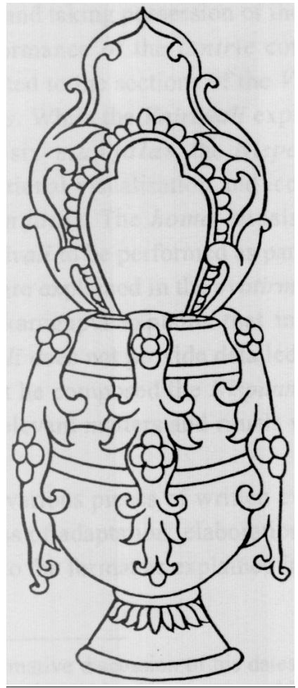

Abhayākaragupta is assumed to have lived during the second half of the 11th century and the initial decades of the 12th century. 1 He was a Madhyamaka and *tantric* master at the monastic universities of Nālandā and Vikramaśīla. He wrote some twenty four works on Mahāyāna doctrines and on the *tantras* and *tantric* rituals. Among his works on rituals, the *Vajr*āvalī, Niṣ*pannayog*āvalī and *Jyotirmañjar*ī are the most important. Out of these three works, the *Vajr*āvalī 2 is the longest and it represents a manual of *tantric* rituals, which deal with the preparation, purification and taking possession of the ground, the construction of maṇḍ*alas*, and the performance of the *tantric* consecrations (*abhi*ṣeka). The Niṣ*pannayog*āvalī is related to the sections of the *Vajr*āvalī which deal with the construction of maṇḍ*alas*. While the *Vajr*āvalī explains the method of drawing the designs of twenty six maṇḍ*alas*, the Niṣ*pannayog*āvalī provides an exposition of the meditational visualisation and iconography of the deities that reside within those maṇḍ*alas*. The *homa* rituals, which Abhayākaragupta recommends in the *Vajr*āvalī to be performed as part of the *tantric* consecrations and on other occasions, are explained in the *Jyotirmañjar*ī. At a relevant point in the *Vajr*āvalī, Abhayākaragupta explains that in order to retain clarity and consistency, the *Vajr*āvalī does not provide detailed expositions of all the rituals mentioned in it, and that he composed the Niṣ*pannayog*āvalī and *Jyotirmañjar*ī in order to explain the relevant matters and rituals which are not fully treated in the *Vajr*āvalī.

It is evident from the various pieces of written evidence that the *homa* rituals underwent a long process of adaptation, elaboration, and systematisation before they were finally cast into the format as explained in the *Jyotirmañjar*ī.

 

<sup>1</sup> For a succinct but informative discussion of his dates and works see G. Bühnemann's "Some Remarks on the Author Abhayākaragupta and his Works", in G. Bühnemann & M. Tachikawa, compilers, Niṣ*pannayog*āvalī, *Two Sanskrit Manuscripts from Nepal,* Tokyo, The Centre for East Asian Cultural Studies, 1991, xiii–xxii.

<sup>2</sup> An analytical study and an edition of the Sanskrit and Tibetan versions of the *Vajr*āvalī have been done by M. Mori as part of his PhD thesis, SOAS, University of London, 1997.

The *homa* and related rituals, which involve the use of fire, are of pre-Buddhist origin. Already in the Vedic period, the fire occupied a central position as the domestic sacred fire and as the fire god Agni. As such the fire was considered as a divine force worthy of worship in its own right. In the context of the Vedic sacrifices and certain domestic rituals, the fire and the god Agni served as agents through whom offerings were conveyed to the gods, and as effective ways of driving away evil spirits. The Ṛ*g Veda* contains a considerable number of hymns, which are dedicated to Agni, and it is evident from such hymns that among Agni's various functions, his role as the sacrificial fire and the conveyer of offerings was the most important. 3 The very first verse of the Ṛ*g Veda* praises Agni as 'priest' (*purohita*), 'sacrificer' (hotṛ), and 'the greatest bestower of treasures.' The Gṛhya *Sutras* provide detailed instructions and descriptions of rituals which involved fire, and which were performed as part of daily ritual activities and on special occasions.

The *Brahmaj*ā*la-sutta* has a brief reference to different kinds of homa, 4 which the Buddha repudiated as part of his determined condemnation and rejection of brahmanical sacrifices and various base professions (*tiracch*ā*navijj*ā). It seems certain that during the Buddha's time and the immediate centuries after his demise, the *homa* rites were not practised by the early Buddhist tradition in India; although the Buddhists did adopt the practice of cremating dead bodies. Similarly, there is no indicative evidence to assume the practice of *homa* rituals in India by the Mahāyāna followers. It seems certain that it was only with the progressive infusion of *tantric* practices into Buddhism that the *homa*  rites became adopted as part of Buddhist ritual practices.

The *Jyotirmañjar*ī does not provide any information on the history of the *homa*  rites, and it does not deal in any detail with all the differences in their performance as attested in different *tantras* and commentaries. Rather, it mainly focuses on the four principal types of *homa*, and it only occasionally indicates some variants specified in different *tantras*. However, towards the end of his *Vajr*āvalī, Abhayākaragupta does provide a short but fairly informative survey of the designs of *homa* hearths for different types of *homa*. He starts his exposition with a statement that *homa* rites are performed in order to gain various benefits and attainments, and to eliminate obstructive spirits and adverse

 

<sup>3</sup> For a survey of the identity and different roles of Agni in the Vedic period, see A. Bergaigne, trans. by V.G. Paranjpe, *Vedic Religion,* 4 vols., Delhi, Motilal Banarsidass, 1978, vol. 1, 10–149. 4 Digha, I, 9. Their names are given as: fire-oblations *(aggi-homa),* ladled oblations *(dabbihoma),* oblations (dispensed through) the mouth *(mukha-homa),* oblations performed with husks *(thusa-homa),* grain-powder (kaṇ*a-homa),* rice-grains (taṇḍ*ula-homa),* ghee *(sappi-homa),* oil *(tela-homa),* and blood *(lohita-homa).*

forces. 5 He quotes but does not name a certain source which states: "One gains no attainments from the rituals which are not accompanied by *homa* rites. One should begin various activities by executing an appropriate *homa* in order to gain the peaceful, enriching and other relevant attainments." This statement clearly stresses the importance and efficacy of the *homa* rites.

Next, he proceeds to say that there are countless *homa* hearths when one takes into account the different categories of living beings. However, when one takes into consideration the differentiation into the five Buddha families, there are five different types of *homa* hearth. And again, when one classifies the various categories of *homa*  according to their different activities (*karmabheda*), there are four basic types of *homa*  hearth. After that, Abhayākaragupta refers to a certain *tantra* named *Vajrakrodhasam*ā*pattiguhya*6 in which it is said that there are one hundred and ten different kinds of *homa* hearth in relation to different activities. Thus, a round hearth (*parima*ṇḍala) should be used for the peaceful rite (śā*ntika*), square (*caturasra*) for the enriching rite (pauṣṭi), triangular (*triko*ṇa) for the fierce rite (*abhic*āra), designed like a hook (aṅkuśākāra) for the summoning rite (ākarṣa), and devised like a *vajra* for the rite of subjugation (*vasikara*ṇa). In order to attract wealth and grain (*dhanadh*ānya), the hearth should be shaped like a jewel (*ratna*), and to acquire an ability to change forms at will (kāmarū*pitva*), it should be shaped like a liṅga. When one wishes to become invisible (*antardh*āna), the hearth should be designed like a bow with an arrow, and for imposing one's authority (ājñā*pana*), it should be designed like a sword (khaḍga). In order to remove sins (pā*papra*ṇāśana), the hearth should be shaped like a circle with an arch (vṛ*tta satora*ṇa). In order to impassion one's *tantric* consort (*vidy*ā), the hearth should be designed like the *mudr*ā of one's Buddha family (*svakulamudr*ā), and to acquire an ability to fly in the sky (ākāś*a-gamana*), it should be designed like the vault of heaven (*vyomama*ṇḍala). And again, when one wishes to intensify one's learning (*vidyottejana*), the hearth should incorporate designs of blazing flames (*sajv*ālākāra). In order to accomplish the activities (sā*dhana*) inside the great maṇḍala, the hearth should be designed like a wheel (*cakra*). The hearth for the all-inclusive *homa* (*sarvakarma*) should be square, have four portals, and be enclosed within an outer circle. On the eastern side, it should be marked with a *vajra*, on the southern with a jewel, on the western with a lotus, and on the northern with a crossed *vajra* (*karmavajra*). It is also said in the same text that the hearth for the subduing rite can be triangular, and the one for the fierce rite (*abhic*āra) can be triangular or shaped like a half-moon (*ardhacandra*).

 

<sup>5 <</sup>i>Vajrāvalī, Sanskrit manuscript reproduced by Lokesh Chandra, New Delhi, 1977, folio 232ff; Tibetan Tripiṭaka, Peking edition, vol. 80, 122.2.2ff.

<sup>6 <</sup>i>rDo rje khro bo snyoms par 'jug pa gsang ba'i rgyud.

According to the *Susiddhikara*, a *tantra* of the Kriyā class, and several other *tantras*, 7 the hearth for the all-inclusive rite (sā*rvakarmika*) should be square (*caturasra*), one cubit big (*hasta*) and half a cubit deep. However, according to the Subā*huparip*ṛcchā and two other *tantras*, 8 the same hearth is described as having the shape of a lotus (*padma*). It is round, one cubit large and half a cubit deep. The lotus at the centre of the hearth is surrounded by eight lotuses, and the border (vedī) incorporates designs resembling lotus leaves. On the outside, it is surrounded by a lotus garland, and the inner border is enclosed by a garland made of *vajras* (*vajram*ālā). The lotuses positioned towards the cardinal directions (*dikpadma*) are marked with a *vajra*, a jewel (*ratna*), a lotus (*padma*), and a crossed *vajra* (viś*vavajra*). The lotuses facing the intermediate directions (*vidikpadma*) are marked with a pair of eyes (*locanayuga*), a three-pronged *vajra*  (*tris*ū*cikavajra*), *apadma*, and an *utpala*. Finally, the lotus at the centre has a design of an eight-spoked wheel (aṣṭā*racakra*).

According to the Kā*lacakra-tantra*, the hearth for the pacifying rite (śānti) is round (*vartula*) and one cubit large, and the hearth for the enriching rite (puṣṭi) is square and two cubits large. The hearth for the fierce rite (*abhic*āra) is shaped like a bow (*dhanu*) and it is half a cubit big. The hearth for summoning (ākṛṣṭi) is triangular and twenty fingers big. The hearth for despising (*vidve*ṣa) is shaped like a pentagon (*pañcako*ṇa), and the one for bewildering (*mohana*) like a hexagon (ṣaṭ*kona*) sixty fingers large. The hearth for subduing (vaśya) is shaped like a heptagon (*saptako*ṇa) forty fingers big, and the one for eradication (*stambhana*) is octagonal (aṣṭ*akona*) and sixty fingers big. Finally, the hearth for the all-inclusive rite (sā*rvakarmika*) is round in shape.

In the *Buddhakap*ā*la-tantra*, the hearth for the peaceful rite (śānti) is square and one span big (*vitasti*); for the enriching rite, it is round and three spans big; for the subduing rite, it is triangular and eight fingers big; and for the fierce rite (*abhic*āra), it is shaped like a half moon (*ardhacandra*) and it is one cubit big.

Towards the end of his brief survey, Abhayākaragupta says that depending on the individual *tantric* texts, the nature of the attainments, the designs, the measurements and other characteristics of the *homa* hearths, the places of the performance, the directional orientation, the articles for burning, the appearance of the fire-god (*agnidevat*ā), and all other relevant things are specified in different ways. Finally, he states that having considered all the relevant matters (*sarvam avagamya*), he composed the *Jyotirmañjar*ī in which are explained the characteristics of the hearths and the manner of performing the *homa* rites

<sup>7</sup> Abhayākaragupta mentions the following works: *Vajram*ālā*bhidh*āna, *Vairocan*ā*bhi-sambodhi*, *Trisamayavy*ūharāja, *Samant*ābhiṣ*ekajanana*, *Vajrap*āṇ*igarbhasambhava*,

<sup><</sup>i>Vajrā*bhyudaya*. 8 *Padmasambhava* and *Suprati*ṣṭha.

(*homavidh*āna) in conformity with the (*Sarvatath*ā*gata*) *Tattvasa*ṃ*graha* and other *tantras* belonging to the Yoga and Yogīni classes. 9 Thus, it is fairly evident that before composing the *Jyotirmañjar*ī, Abhayākaragupta has made a survey of *homa* rituals, and that consequently this work represents a further if not the final stage in the systematisation process of *homa* rituals in Indian Buddhism.

As a literary work, the *Jyotirmañjar*ī is written in a syntactically simple Sanskrit, its style is rather laconic, and it says no more than what is essential. As already mentioned above, Abhayākaragupta fundamentally restricts himself to explaining the essential elements of four main types of *homa* rituals, and does not discuss any other matters such as their history or theoretical background, something that would certainly enhance our knowledge of *homa* rites in India. However, despite its brevity, the *Jyotirmañjar*ī does represent perhaps the best exposition of *homa* rites that is left to us by the Indian tradition.

The present translation, revised in some sections, 10 of the *Jyotirmañjar*ī is based on an incomplete Sanskrit version edited by N. Okuyama, 11 and a complete Tibetan version included in the Peking edition of the Tenjur (bsTan 'gyur). I have also referred to the Cambridge manuscript (Add. 1653) on which Okuyama's edition is based, but I was unable to obtain a copy of the manuscript preserved in the National Archives of Nepal in Kathmandu. I have also referred to other editions of the Tibetan version, but basically, the translation follows Okuyama's edition and the Tibetan version included in the Peking edition.

* * *

Salutation to the glorious Vajrasattva. 12

The *homa* rituals interspersed by Vajradhara among the (*Sarvatath*ā*gata-*) *Tattvasa*ṃ*graha* and other *tantras* are compiled here by Abhaya who is fond of wisdom and compassion. There exists other compositions but this one is to be

 

<sup>9</sup> The same is stated in the opening section of the *Jyotirmañjar*ī. 10 Originally my English translation of the *Jyotirmañjar*ī was published under the title of "*Jyotirmañjar*ī: Abhayākaragupta's Commentary on Homa Rites", in *Bulletin of the Research Institute of Esoteric Buddhist Culture* (*Mikkyo Bunka Kenky*ā*sho Kiy*ō), Volume 8, December 1994, 206–236. Kōyasan University, Kōyasan.

<sup>11</sup> N. Okuyama's edition of the Sanskrit text was published in two parts: "Jyotirmañjarī no kenkyū I", *Bunka* (Sendai), 47.1–2, 1983, 29–46, and "*Jyotirmañjar*ī no kenkyū II," Tō*hoku lndogaku*  Shūkyō *Gakkai Ronsh*ū (Sendai), 13, 1986, 108–91. The pagination of the Sanskrit version refers to the Cambridge manuscript (Add. 1653) and the pagination of the Tibetan version to the Peking edition of the Tibetan Tripiṭaka, vol. 80. The Sanskrit version begins at 1b and the Tibetan version at 154.2.8.

<sup>12</sup> Sanskrit reads *namo buddh*āya.

designated as brightness which resembles the moon among twinkling stars dispensing deep pleasure. 13

## 1. *The hearths* (kuṇḍa)

On an auspicious day, one assumes the nature of one's chosen deity14 and offers a preliminary act of worship and a *bali*, 15 following a prescribed rite. Next, placing the right hand on the ground, and reciting one hundred and eight times "Oṃ Āḥ Hūṃ" and "Oṃ *hana hana krodha H*ūṃ Phaṭ" or the *mantra* of one's chosen deity, (one purifies the ground) by means of the conventional (sāṃvṛta) purity or by means of emptiness, whichever appropriate. The ground is purified in order to dig out the hearths. Alternatively, at the benefactor's request, the purification of the ground, taking possession of the ground, striking the obstructive spirits with a kīla, and instalment of Vasundharā, 16 are performed according to the rites explained in the *Vajr*āvalī. Depending on the specific requirement, one performs them in an extended or abridged manner. The hearths are excavated on the breast section of the place nāga. 17

The hearth for the peaceful rite18 is made on white ground. It is round in shape, one cubit large and (2a) twelve fingers deep. At its centre, there is a lotus sixteen fingers large, and on the top of it, a wheel or a five-pronged *vajra*, eight fingers big and one finger high with its top facing the east. Above the hearth, at a distance of four fingers, there is a border, 19 four fingers wide and high, having the same shape as the heart, and its surface slopes inwards. On the outer comers (the hearth) is marked with three-pronged *vajras* (154.4.1) or designs of wheels. 20 The hearth is smeared with white soil, and the surrounding outer ground, half a cubit large, with cow dung. These two, (the hearth and the surrounding area), are sprinkled with white scent endowed with white ambrosia, and strewn with loose white flowers. 21

<sup>13</sup> This sentence represents a paraphrased version of the title: *Jotirmañjari—*"A Cluster of Celestial Brightness."

<sup>14</sup>

sveṣṭ*adevat*ā / *rang gi 'dod pa'i lha*. 15 Sanskrit text could be translated as: "having given a *bali* gift with the right hand."

<sup>16 <</sup>i>tridhābhūmiś*odhanavidhi*, bhū*miparigrahavidhi*, *vighnak*ī*lanavidhi*, *vasundhar*ādhivā*sanavidhi.*

<sup>17</sup> The position and movement of the *place-n*āga (vā*stun*āga / *sa bdag klu*) through the phases of the year are explained in some detail in Kuladatta's Krī*yasa*ṃ*graha* and Jagaddarpaṇa's Krī*yasammuccaya*. 18

sā*nti* / *zhi ba*. 19 vedī / *kha khyer*. 20 Tibetan reads: "wheels on triangles."

<sup>21</sup> Since the precise meaning of the Sanskrit term *trisandhya*ṃ (*thun gsum du*) included in this sentence is not clear, it has been left untranslated.

The hearth for the enriching rite22 is made on yellow ground. It is square or shaped like an octagonal jewel, 23 two cubits wide and one cubit deep. At its centre, it has an eight-spoked wheel, and on the top of it, a jewel which is six fingers big and marked with a *vajra*. Above the hearth, at a distance of eight fingers, there is a border, eight fingers wide and high, having the same shape as the hearth, and sloping outwards. On the outer comers of the border, it is marked with jewels. The hearth is smeared with yellow soil and its outside with cow dung. These two, (the hearth and the surrounding area), are sprinkled with white scent endowed with yellow ambrosia, and scattered with yellow flowers.

The hearth for the subduing rite 24 is made on red ground or on whatever appropriate. It is shaped like a vagina (*bhaga*) with its top pointing towards the east and resembling an aś*vattha* leaf. Alternatively, it is shaped like a half-moon with its centre having a red lotus marked with a *vajra*. For (the rite of) wilful summoning, 25 one makes the (same) hearth(s) or one makes a hearth shaped like a one-pointed *vajra* with its centre having a red lotus marked with a *vajra*-hook. The above three *homa* hearths are surrounded by borders, which have the same shapes as the hearths, and are marked with hooks, which in tum are marked with the symbol of the principal deity. They are smeared with red soil and red scent with ambrosia, and strewn with loose red flowers. The depth, borders and other measurements of these three hearths are reckoned in the same way as for the peaceful hearth.

The hearth for the fierce rite26 is made on the ground that is cleft, salty and astringent. It is dark-blue like the sky, triangular in shape, and oriented towards the north. Its sides are twenty fingers long and ten fingers deep. (154.5.1) At the centre, it is adorned with a wrathful *vajra*, eight fingers big and resting on a black lotus, or it is adorned with a wrathful *vajra* resting on a trident. Above the hearth, at a distance of three fingers, (3a) there is a border, three fingers wide and high, sloping backwards, and surrounded by wrathful *vajras*. It is smeared with black soil together with ambrosia, cremation ashes, and whatever available dung of donkeys, buffaloes and other animals. It is scattered with red or blue flowers with an unpleasant smell or without any smell, and (or) 27 with rice husks and similar things. It is also provided with lamps made of human and other fats, and burning in an agitated and frightful manner.

 

<sup>22</sup>

puṣṭi / *rgyas pa*. 23 aṣṭāṃśaratna / *rin po che zur brgyad pa*. 24

<sup><</sup>i>vasya / *dbang*. 25 vaśyākarṣaṇa / *dbang gis dgug pa*. 26 *abhic*āra / *mngon spyod*. 27 Sanskrit version reads 'or' while Tibetan 'and'.

The hearth for the all-inclusive rite28 is made on the grounds corresponding to the (individual) rites, and it is comparable to the peaceful hearth. However, on its mouth, it has a blue lotus-flower together with filaments, 29 and lotus petals on its border. It is because of this (description) that it is surrounded by a border shaped like a wide open lotus with its outer sections marked at the cardinal and intermediate directions with *vajras*, crossed *vajras* or swords. On the inside, it has the symbols of the four Tathāgatas. The symbols are the size of leaves and they are placed on leaves and surrounded by a *vajra*-garland. Inside that, there are inserted their individual symbols, eight fingers big and one finger high. The symbol of Vairocana is a wheel or a *vajra*, which is said to epitomise the absolute; Ratnasambhava's symbol is a jewel; Amitābha's symbol is a lotus; Akṣobhya's symbol is a wrathful *vajra;* and Amoghasiddhi's symbol is a sword or a crossed *vajra*. 30 Some people say: "The border (vedī) is surrounded all around by an outer *vajra*-garland, 31 (155.1.1) but it has no *vajras* towards the directions. There is no *vajra*-garland in the middle of the hearth." Some other people hold the opinion that the central sections of all the hearths are adorned with the symbol of one's chosen deity placed on a lotus. They also say that the principal deity's symbol is eight fingers long and one finger high, but others say that its size should be six fingers. One particular characteristic, which has not been mentioned in the above two opinions, is that the border has a garland made of the chief deity's symbol.

The peaceful hearth is positioned towards the eastern direction of the maṇḍalapalace;32 the enriching one towards the south; the subduing hearth and the one for wilful summoning towards the west; the fierce hearth and the one for ferocious summoning33 towards the north. However, there are also other (opinions about) the directions. It is said in the Saṃpuṭ*a-tantra*: "The peaceful hearth is towards the east; likewise the fierce one is towards the south; the one for subduing and summoning towards the west; and the enriching hearth towards the north."34

Alternatively, the hearths can be painted with coloured powders in conformity with the (individual) rites.

- oṣṭhe *sakesara*ṃ puṣ*kara*ṃ / *mchur ge sar dang bcas pa'i ze'u 'bru*. This description refers to the shape of the forepart of the hearth.
- 30 This list of symbols is not included in the Sanskrit text.
- 31 Tibetan version adds: "which is on the outer wall" (*khor yug; cakrav*āla).
- 32

<sup>28 <</sup>i>sarvakarmika / *las thams cad pa*. 29

maṇḍ*alag*ṛha / *dkyil 'khor gyi khang pa*. 33 krūrākarṣaṇa / *drag pos dgug pa*. 34 This quotation is omitted in the Sanskrit version.

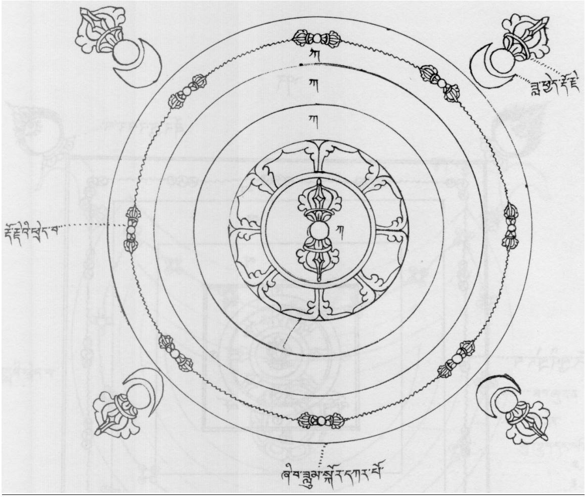

11. Design of the hearth for the peaceful *homa*

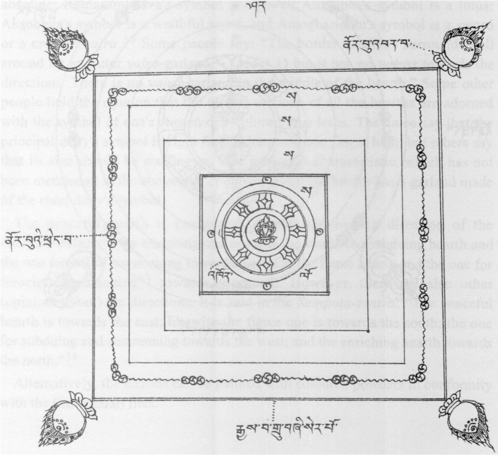

12. Design of the hearth for the enriching *homa*

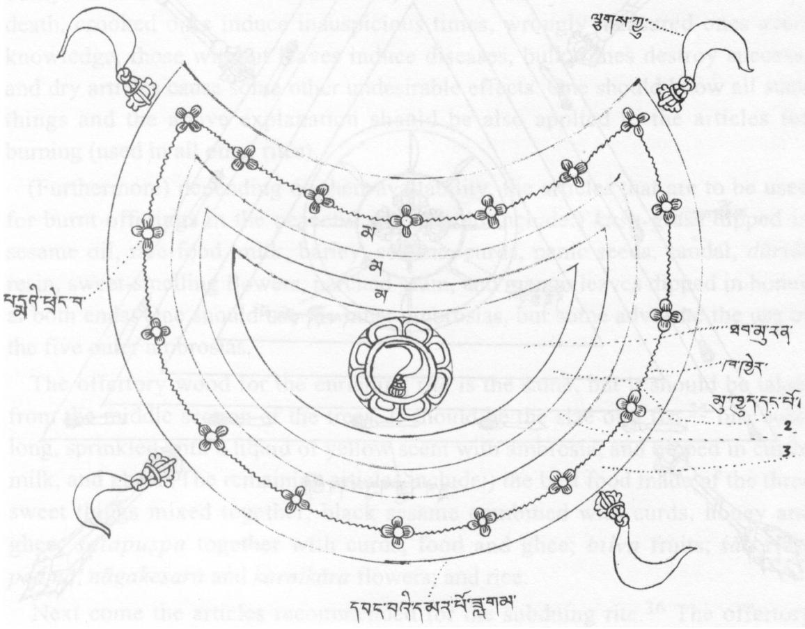

13. Design of the hearth for the subduing *homa*

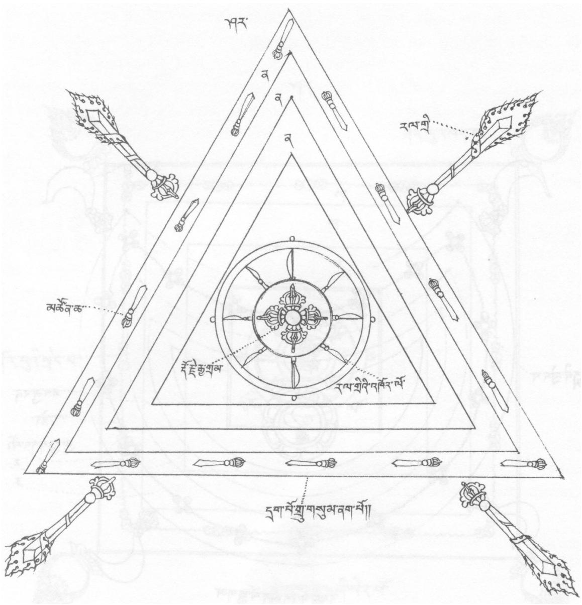

14. Design of the hearth for the fierce *homa*

## 2. *The articles* (*dravya*)

The offertory wood (*samidh*) for the peaceful rite derives from the palāśa, *udumbara*, aś*vattha*, kaś*mari*, āmra, *kadamba*, śamī, *plak*ṣa, vaṭa and other similar kinds of trees. It should be taken from the treetops which ooze with sap. It should have a couple of leaves, and it should be succulent, evenly chopped, twelve fingers long, and thick as the little finger. It should be dipped at both ends in honey, milk and ghee, and sprinkled with ambrosia, scent and its own sap. It should be held with the thumb and the ring finger at the end with a couple of leaves, and presented for burning with the other end. The kuśa, mango leaves, and dūrvā grass should be arranged in pairs with their tops joined together. The articles, which are decayed, thick or thin, crooked, long or short, without leaves, eaten by insects, thrown away, without bark, with holes, split ends or bulky, should be discarded. (155.2.1)

The articles which are decayed cause death, crooked ones induce inauspicious times, wrongly measured ones avert knowledge, those without leaves induce diseases, bulky ones destroy success, and dry articles cause some other undesirable effects. One should know all such things and the above explanation should be also applied to the articles for burning (used in all other rites).

(Furthermore) depending on their availability, the articles that are to be used for burnt offerings in the peaceful rite (should include:) kuśa grass dipped in sesame oil, ricefood, milk, barley, sesame, curds, panic seeds, sandal, dūrvā, resin, sweet-smelling flowers, parched grain, and mango leaves dipped in honey at both ends. One should use the inner ambrosias, but some advocate the use of the five outer ambrosias.

The offertory wood for the enriching rite is the same, but it should be taken from the middle section of the trees. It should be the size of a fist, 35 one cubit long, sprinkled with a liquid of yellow scent with ambrosia, and dipped in curds, milk, and ghee. (The remaining articles include:) the best food made of the three sweet things mixed together; black sesame combined with curds, honey and ghee; ś*atapu*ṣpa together with curds, food and ghee; *bilva* fruits; śāli rice; *padma*, nā*gakesara* and kaṇikāra flowers; and rice.

Next come the articles recommended for the subduing rite. 36 The offertory wood, undamaged, with leaves and of good quality, just as explained with regard to the peaceful rite, comprises the *priya*ṅgu, *campaka*, *punn*āga, nā*gakesara*, *lakuca*, and aś*oka* trees. (The remaining articles include:) forest products, red

35 muṣṭ*ipram*āṇā / *chad pa'i tshad*. 36

vaś*yakarma* / *dbang gi* las.

and sour fruits and flowers, or some other articles specified in one's ritual ordinance. 37

In the rite of wilful summoning, 38 (the offertory-wood is the same), but it has thorns shaped like hooks. (The rest is) as in the previous case.

In the fierce rite, the offertory wood comprises the *nimba*, *khadira*, *kovid*āra, *bhillo*ṭaka, and *madana* trees, or some other kinds of pungent, thorny and bitter trees, or singed logs from cremation heaps. 39 (155.3.1) It should be taken from the root sections, split and pointed. It should be ten fingers long, and its both ends should be smeared with poison, blood and sesame oil. Depending on their availability, (the remaining articles include:) mustard, pungent sesame oil, blood, salt, rājikā and *nimba* leaves, ashes from cremation heaps (Sa), dirt from feet, dung of asses, buffaloes and other animals, hair, fat of the wild cock (*kukku*ṭa), crow and other feathers, faeces and urine, thorns, bones, chalk, flesh40 and other similar articles. One mixes each article with poison, salt, and blood, or one makes an enemy's representation from these articles, or from ashes, charcoal, husks and other articles mixed with poison and other things. One cuts it up with a sharp weapon, starting with the little toe of the left foot. In the rite of ferocious summoning, one does not employ an enemy's representation.

In the all-inclusive rites, the offertory wood is produced from the palāśa, *plak*ṣa, *udumbara*, *khadira*, *arka*, *nyagrodha*, *vaika*ṅ*kata*, āmra, śamī, kāśmarī, apāmārga, and aś*vattha* trees. It should be young, a short span in length, straight, and sprinkled with the water containing good scent with ambrosia, and smeared at both ends with grease and other things in accordance with the (individual) rites. The barley, milk and other articles, as specified for the peaceful and other rites, should be also offered in the all-inclusive rites. Some amount of the articles for the peaceful and enriching rites, 41 one's own food, all such articles, and bdellium or sāla extracts smeared with ghee, should be offered in *homa* day by day (*pratyaha*ṃ) along with their individual *mantras*. (155.4.1) The scent, flowers and other offerings for the fierce rite are also recited over with their *mantras* (5b) in accordance with this rite.

Thus, it has been said:

"*Vaika*ṅ*kata*, *arka*, *khadira*, pā*rthiva*, 42 apāmā*rgaka* and so forth are specified for the peaceful rite (śānti). Leaving out the kā*damba* wood, the

 

<sup>37 <</sup>i>kalpa / *rtogs pa*. 38

vaśyākrṣṭi / *dbang gis dgug pa*. 39 *cityulmukak*āṣṭha / *ro sreg pa mgal dum* 40

<sup>40</sup> Sanskrit māṃsa / Tibetan specifies *glang po che'i sha* (elephant's flesh).

<sup>41</sup> Sanskrit has only śā*ntikadravya*

<sup>42</sup> Tibetan reads *arjuna*.

other ones are selected as judged fit. The offertory woods are like in the peaceful rite, or they generally agree with the ritual texts (*vidhi*)."

## 3. *The firewood* (*indhana*)

The firewood for the peaceful rite43 is selected from among the trees used for worship. 44 It should not contain living insects, and it should be shorter in measure than the hearth. Alternatively, one uses forest cow dung.

Leaving out the cow dung, the above-described firewood with fruits is also used for the enriching rite. 45

In the case of the subduing rite, 46 one uses as firewood the *nimba* and ā*mla* wood as well as other kinds of wood together with flowers. The wood with thorns is used in the summoning rite. 47

For the fierce rite, one uses as firewood the wood of the trees, which are pungent, thorny, bitter, and having an unpleasant smell or without any smell, the wood from cremation grounds or dried bark, 48 and dung of donkeys, buffaloes and other animals.

The firewood for the all-inclusive rite49 should be in agreement with (each) rite.

# 4. *The ladle* (ś*ruva*) *and the spoon* (pātrī)

The spoon should be made from gold or copper, or from the wood suitable for worship. 50 Its stem (daṇḍa) should be twenty-four fingers measured with a man's thumb. It should have a *vajra* and other things, and it should be comfortable to hold with a clenched hand. Above the stem, it is square, four fingers wide and two fingers deep, and it is marked with a five-pronged *vajra* two fingers big. The width of half a finger on the (edge of the) square should be marked with a *vajra-*garland. Above the square, it has a design of a lotus flower, four fingers big, and it is marked with a *vajra*, four fingers big and half a thumb deep. Alternatively, the upper section of the stem should have the shape of a lotus leaf, eight fingers long. So that it has a suitable appearance, its declivity should be square, four fingers wide and two fingers deep, and its centre should be marked with a three or five-pronged *vajra*, four fingers big. The groove for discharging liquids should be the size of the thumb, or of the little finger, and above that, it should

<sup>43</sup> śā*ntika* / *zhi ba*. 44 yā*jñikav*ṛkṣa / *mchod sbyin gyi shing.*

<sup>45</sup> pauṣṭ*ika* / *rgyas pa*. 46

vaśī*kara*ṇa / *dbang du bya ba*. 47 ā*karsa*ṇa / *dgug pa*. 48 śuṣka / *shing shun*. 49 *sarvakarma* / *las thams cad pa*. 50 *yajña* / *mchod sbyin*.

have a three-pronged *vajra*, four fingers big. It is considered appropriate that beneath the stem, it should have a jewel, three fingers big, and below it, a *vajra* also three fingers big. 51 The underneath of the stem of the ladle is the same.

The ladle should be also made from the above-mentioned substances or from wood. Its stem, measuring a small cubit, should be half the size of the stem of the spoon. Its mouth, shaped like a lotus leaf, two fingers wide and one finger deep, should be marked in the middle with a five-pronged *vajra*. Beneath the stem, it should have a *vajra*  and a jewel so that it has a fine appearance.

It is said:

"When the spoon and ladle are not available, one executes a full burnt oblation52 with five fingers joined together, and the other burnt oblation53 with three fingers joined together."

Or again, it is said:

"The full burnt oblation is remembered on account of five fingers joined together, and likewise the other one as three fingers joined together—the ladle and the spoon."

It is also said that both kinds of burnt oblations54 are executed with a *pippala* leaf, and when the ladle is not available, the other burnt oblation is executed with the spoon.

# 5. *The performer* (sā*dhaka*)

The performer, endowed with compassion and benevolence, should wash himself, smear with good scent, and put on white ornaments. He should perform recitations and a protective rite55 by executing the *yoga* of his chosen deity in conformity with the relevant rite. He should remain silent and sit in the lotus posture56 on a soft and comfortable seat. In the evening, he should face towards the east and concentrate his thoughts on the things that are to be accomplished. Starting on the first day of the bright moon, and retaining a peaceful mental disposition, he should perform the peaceful rite.

Likewise, anointed and adorned with a yellow garland and variegated ornaments, seated in an elegant posture57 and facing the north, he should retain his mind in a cheerful disposition. Beginning on the full moon, he should perform the enriching rite in the morning. (7a)

 

<sup>51</sup> Sanskrit does not mention the jewel and says that the *vajra* should be one finger big.

<sup>52</sup> Pūrṇā*huti* / *dgang blugs.*

<sup>53 <</sup>i>itarā*huti* / cig *shos bsreg blugs*. 54 ā*hutidvaya*. 55 rakṣā*vidh*āna / *bsrung ba'i cho ga*. 56 *padm*ā*sana* / *padma'i 'dug stangs*. 57 *bhadr*ā*sana* / *bzang po'i 'dug stangs*.

With his mind impassioned, adorned with red and other ornaments, facing towards the west, and seated in the *vajra-*posture58 on a high and comfortable seat, he should perform the subduing rite59 in the middle of the night or at another time. The wilful summoning is done in the same way, but he should look upwards and in order to gladden60 the deities, he should also face towards the west.

In the case of the fierce rite, he should sit on a hard seat and face the south, be wrathful and adorned with a blue garment, or a garment stained with bloody water. Alternatively, he should rest on the breast of the image61 of the one that is to be perfected, 62 or he should squat without a seat, pressing one foot with the other. He should gnash his teeth, his face should look angered, and his eyes should be firmly fixed. He should be seated in the wrathful *vajra*-posture, acting with great compassion in order to remove the harm done to the Three Jewels and the like. The timings are the days of the dark moon either at midday or at midnight. Applying a wrathful *yoga*, he should envisage the protective deity63 resting on a lotus inside the heart of the one to be perfected, and performing the activities of striking and expelling with a *vajra*-hook issued from a wrathful Hūṃ, and subsequently dissolving into his heart. Alternatively, he envisages himself as striking with his kīla inside the *prajñ*ā*'s* lotus, and the one to be perfected as being abandoned by all the deities. While wishing for his escape from sins (pāpa), he should act with compassion and bring about his rebirth in a pure buddha-field (156.2.1), or in some other beneficial and happy abode. The ferocious summoning is done in a similar way.

(During the rites of) suppression64 and confusion, 65 he should face the north-east and sit in the vajra-posture. He performs (these rites) in a square hearth while reciting the *mantras* appended with vauṣaṭ.

Clad in yellow and white ornaments, he remains intent upon the rite appropriate for enriching. Likewise (in the rite of) eradicating, 66 he faces the south-east and (uses) an ointment consisting of buffalo and other kinds of dung.

 

<sup>58 <</sup>i>vajraparyanka / *rdo rje skyil krung*. 59

vaśī*kara*ṇa / *dbang gi las*. 60 ārā*dhana* / *mnyes par bya ba*. 61 *pratik*ṛti / *gzugs brnyan*. 62

sā*dhya* / *bsgrub bya*. 63 rakṣā / *srung ba*. 64

<sup>64 <</sup>i>stambha / *rengs*. 65 *moha* / *rmongs*. 66

uccāṭa / *bskrad*.

Clad in black and white, 67 he draws with poison, and the articles for burning (*havya*) are the best crow and other feathers68 fastened with an appendix. 69 Here the crow and other feathers are appended with an inscribed *mantra* which ends with the words: "*Expel such and such a person H*ūṃ Phaṭ" 70

Likewise (in the rite of) despising, 71 he faces the south-west, sits with inverted feet, and wears yellow and black ornaments. He draws with pungent sesame oil and poison.

It is said:

"In all cases, when one faces the cardinal and intermediate directions, one should remain positioned in the cardinal and intermediate directions which are directly opposite. Alternatively, in the absolute sense, on account of the directions not being taken into consideration, whichever way one is positioned, one should meditate with one's mind pervaded with audacity, and one should perform all activities accordingly."

6. *The water for the face* (*argha*)

The vessels for the water for the face, the water for sprinkling and so forth, 72 are made from gold, silver, stone, copper, wood, clay, mother of pearl, conch, or folded leaves.

In the peaceful rite, the water contains barley, milk, white flowers, sesame, *darbha* grass, 73 parched grain, and white scent together with ambrosia. It is poured inside the victorious vase, fumigated with incense, recited over one hundred times with the *mantra* of one's chosen deity, or the all-operative *mantra* (156.3.1) with Svāhā added at the end.

Likewise in the enriching rite, the water contains sesame with curds, yellow flowers, yellow scent and other (similar) things. The syllable Oṃ (is added) at the end of the *mantra*.

In the subduing rite, the water contains red scent and other (similar) things. The syllable Hūṃ (is added) at the end of the *mantra*. The same applies to the summoning rite, 74 (except for) the syllable Jaḥ (which is added) at the end of the *mantra*.

 

<sup>67</sup> Sanskrit reads: "on black and white ground."

<sup>68</sup> Sanskrit reads: "a mass of crow and other feathers."

<sup>69 <</sup>i>vidarbhaṇa / *spel tshig*. 70 *amukam ucc*āṭ*aya h*ūṃ phaṭ. 71 dveṣa / *dbye ba*. 72 Tibetan version specifies: "water for the face, water for sprinkling, water for sipping, and water for the feet."

<sup>73</sup> Tibetan version reads kuśa. 74 ākarṣa / *dgug pa*.

In the fierce rite, the water contains food that has been spat out, pieces of broken vessels and other similar things, *kodrava* grains with blood, cow dung and urine, black flowers with an unpleasant smell or without any smell, and other (similar) things. The syllable Phaṭ (is added) at the end (of the *mantra*). In the rite of ferocious summoning (the water) is similar.

In the all-inclusive rite, which always incorporates the enriching and other rites, the water contains scent, flowers, sesame, *darbha*75 grass, and parched grain, depending on their availability and in conformity with the (individual) rites.

# 7. *The arrangements* (nyāsa)

In the peaceful, enriching, subduing, and (8b) wilful summoning rites, the vessel containing the all-operative water76 is recited over with the *mantra* of Amṛtakuṇḍali and the syllable Hūṃ. The three vessels with the water for the face and so forth are placed to its left side, and in front of them, the three receiving vessels. 77 They are arranged on stools78 and similar things. Taking the kuśa grass with the right hand, one dips its tips in the water recited over with (Amṛtakuṇḍali's) *mantra*, and then one sprinkles all the articles, 79 offertory wood, fire-wood and other articles, which should be arranged on the right side. One also sprinkles oneself, the ladle and the spoon. The emplacement of the victorious vase (*vijayakala*śa), the all-operative vase (sā*rvakarmikakala*śa), and other things should be done by following the rite explained in the *Vajr*āvalī. Some people say that in the abridged rites there are no vases.

In the slaying, 80 eradicating81 and other rites, and also in the rite of ferocious summoning, the sprinkling is done with the left hand. On the right side, one arranges the all-operative vase, the vessel with the water for the face and the rest, and on the left side one arranges the articles for burning.

## 8. The *fire* (*agni*)

The fire for the peaceful rite is produced from the wood imbued with milk or from the attrition wood. 82 The sacred83 and *homa* fires are also appropriate.

The fire for the enriching rite originates from the residence of a king or some royal personage, forest conflagrations, gems or monastic kitchens. For the

 

<sup>75</sup> Tibetan reads kuśa. 76 Sanskrit reads sā*rvakarmikodakabh*ā*jana*, and Tibetan reads only *chu snod*. 77 *prat*ī*cchakabh*ā*jana* / *bzed zhal gyi snod*. 78 *yantraka* / maṇ *'ji*. 79 *dravya* / *bsreg rdzas*. 80

māraṇa / *gsad pa*. 81

uccāṭana / *skrad pa*. 82

araṇi / *gtsub shing*. 83 āhitāgni / *dgon pa'i me*.

subduing rite, the fire comes from the house of a prostitute or a merchant. For the rite of wilful summoning, the fire is produced by a dancer, a traveller or a wandering singer. 84 The fire for the ferocious rite85 and that of ferocious summoning should be acquired from the cremation heaps of human bones, stones or the house of an outcast and the like. The fire for the all-inclusive rite is kindled in conformity with the individual rites.

# 9. *Gratifying the deities* (*devat*āsaṃ*tarpa*ṇa)

Following the rite explained in the *Vajr*āvalī, one shakes the *vajra*, rings the bell and presents a *bali*. Abiding in a state of protection, 86 one places the flame (*vahni*) inside a vessel by means of the three syllables. Next, one kindles the fire (*agni*) with a lit lamp of melted ghee and recited over with the *mantra* of Amṛtakuṇḍali. Taking the kuśa grass, one sprinkles87 with its tips the water recited over with the *mantra* (of Amṛtakuṇḍali).88 One does it three times. In (the peaceful rites one sprinkles) in a clockwise direction and in the ferocious rites89 in an anticlockwise direction. (After completing the sprinkling), one places it in the hearth together with a bunch of clean and well dry grass, avoiding to induce much smoke; in the fierce rites, one acts to the contrary. One sets the fire ablaze by reciting "*jvala jvala H*ūṃ" (Tib 156.5.1), or with the syllable Hūṃ and the current of air created with a fan. One should intensify the fire with the ghee placed in the ladle and blessed seven times (9b) with the heart *mantra* of the (appropriate) family. In the fierce rites, one uses pungent sesame oil just as (explained) above.

Next, one recites over the kuśa grass saying: "Oṃ *Vajrasattva* Āḥ." The kuśa is taken in pairs and it should be fresh, 90 clean, green, unimpaired, without broken leaves, and not too long. One arranges it on the border of (the hearth) 91 with its tops towards the east, south, west, and north. Then one should overlay the hearth with not too long kuśa grasses with their tops pointed towards the east and (arranged) like a cow's ear. In the hearths for the enriching, subduing and fierce rites, the kuśa tops are placed in a proper order facing the north, west, and south. However, in the first instance, two kuśa pieces are placed on the border of the hearth with their tops facing towards the appropriate directions. Concerning the direction in which the performer (sā*dhaka*) faces, in a conventional manner

 

<sup>84</sup> Sanskrit cāraṇa. Omitted in the Tibetan version.

<sup>85</sup> krūra / *drag po*. 86 Sanskrit reads rakṣāvān. The Tibetan version connects this word with the three protective syllables: "by means of the three syllables endowed with protection."

<sup>87 <</sup>i>Paryukṣya / *bsang gtor byas la*. 88 Sanskrit reads *japtodakena* while Tibetan reads *brjod pa'i ku sha*. 89 krū*rakarman* / *drag po las*. 90 Sanskrit reads *pratyagra* while Tibetan reads *rtse mo gzhibs pa*. 91 Tibetan reads: "first on the border which is to the left of the performer."

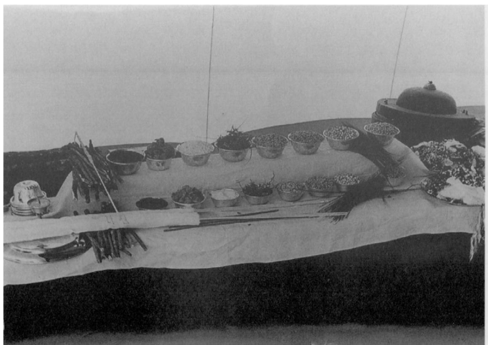

15. Table with two rows of bowls with the articles for offering in the enriching *homa*. From left to right: offertory wood, sesame, food, rice, dūrvā grass, barley, peas, kuśa grass, wheat. Bauddha, Nepal, 1981.

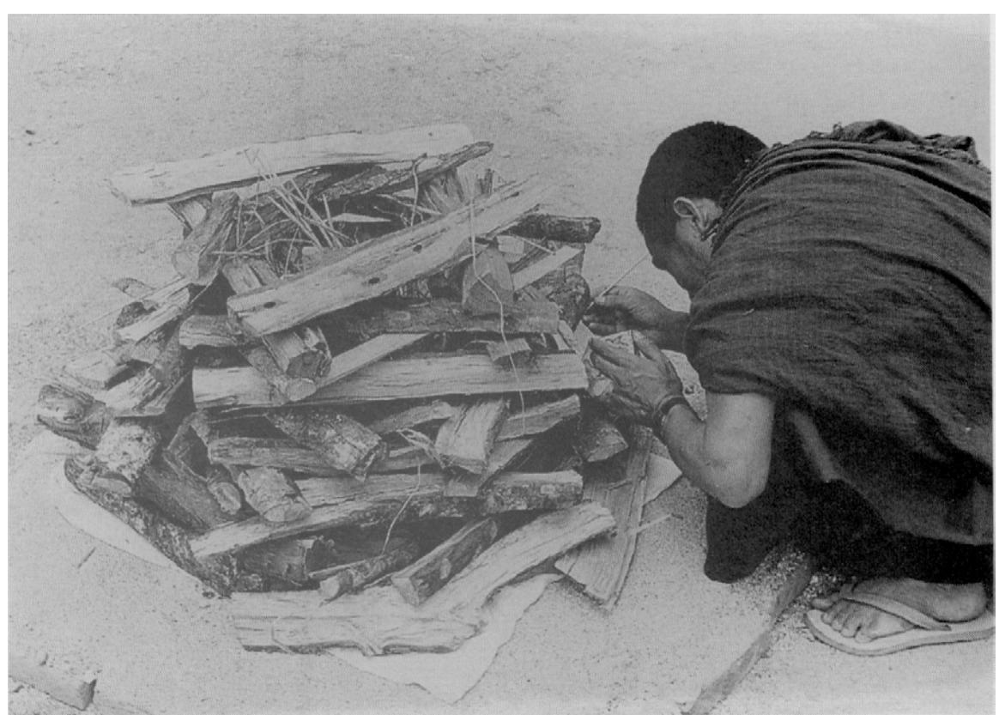

16. Kindling the fire inside the hearth of the peaceful *homa*. Bauddha, 1981.

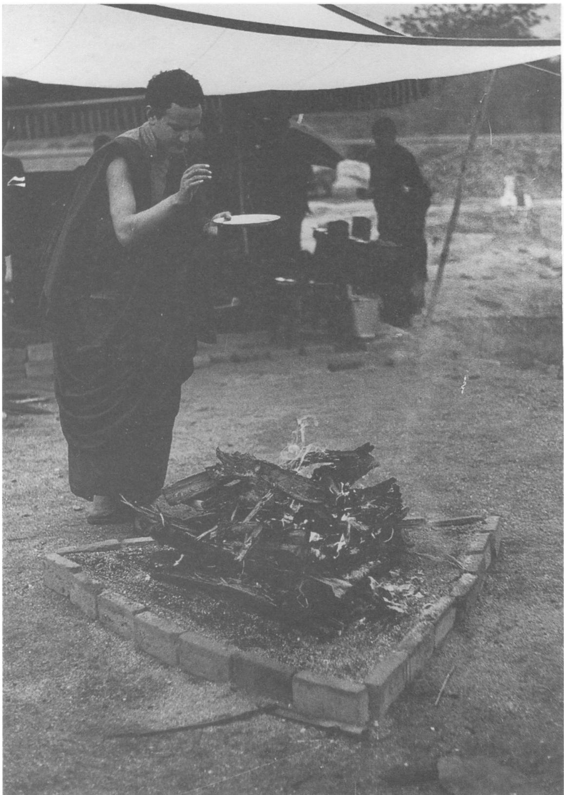

17. Throwing offerings into the hearth of the fierce *homa*. Bauddha, 1981.

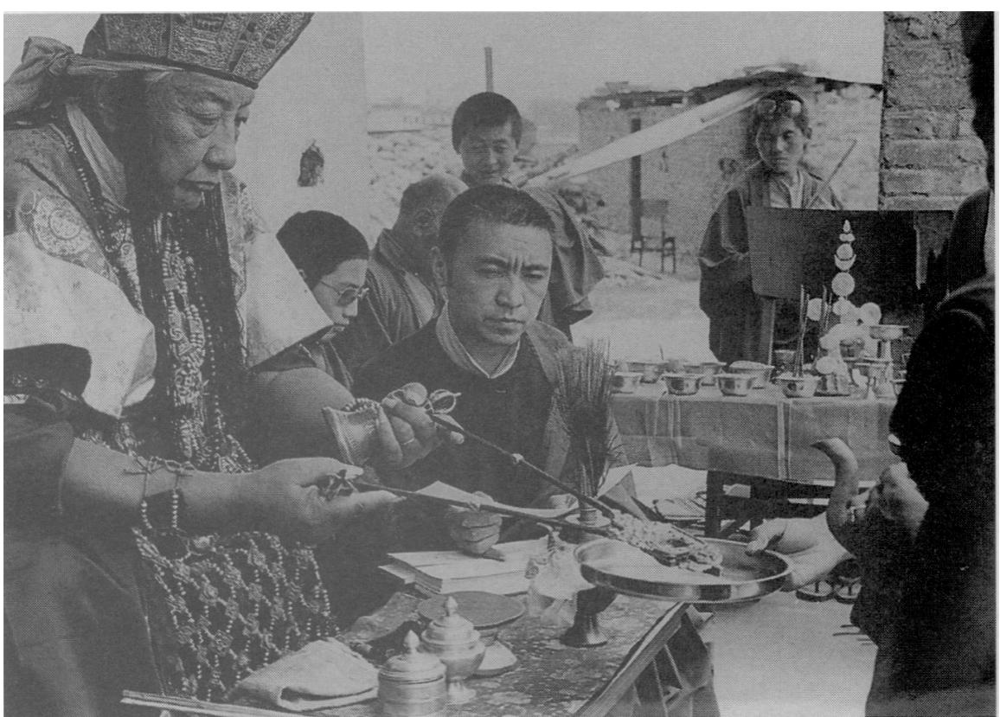

18. Offering butter libations during the enriching *homa* performed by Dilgo Khyentse at Bauddha in 1981.

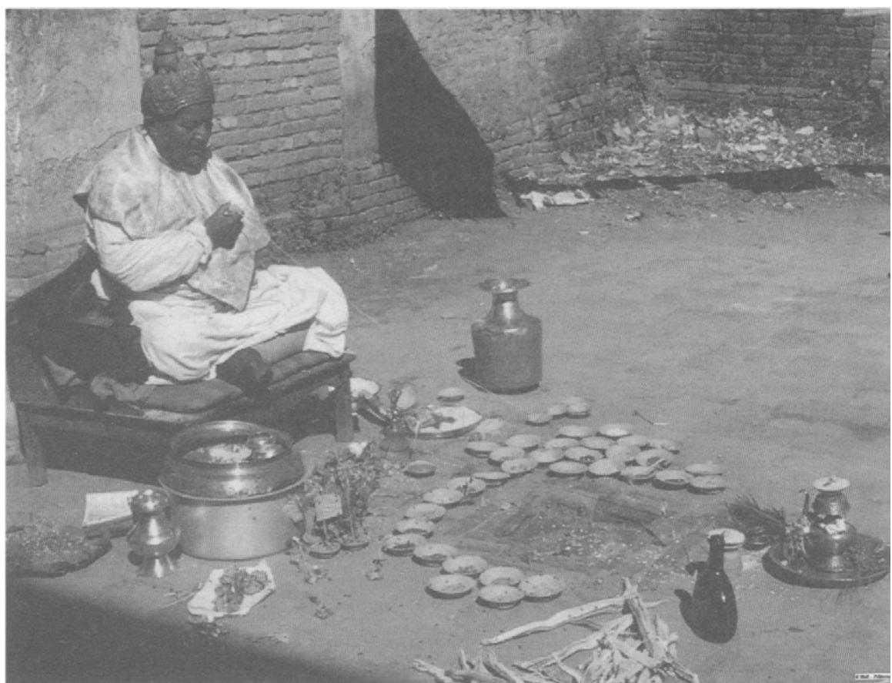

19. A Newari *vajr*ācā*rya* performing a sā*dhana* at the beginning of the all-inclusive *homa*. He is linked with the victorious vase (*vijayakala*śa) with a thread. Svayambhūnāth, Nepal, 1981.

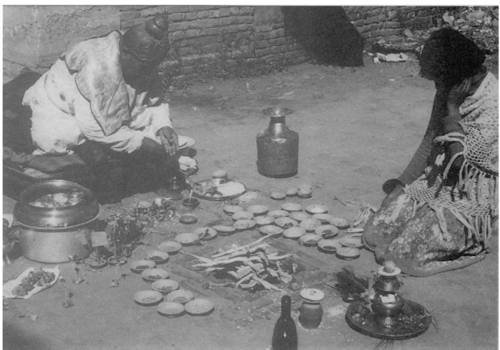

20. The all-inclusive *homa* in progress. The performing *vajr*ācā*rya* is assisted by a maiden. The *homa hearth* is delineated in red powder at the base of the square enclosure covered with wood, and it is surrounded by thirty two offerings arranged in clay dishes. Svayambhūnāth, 1981.

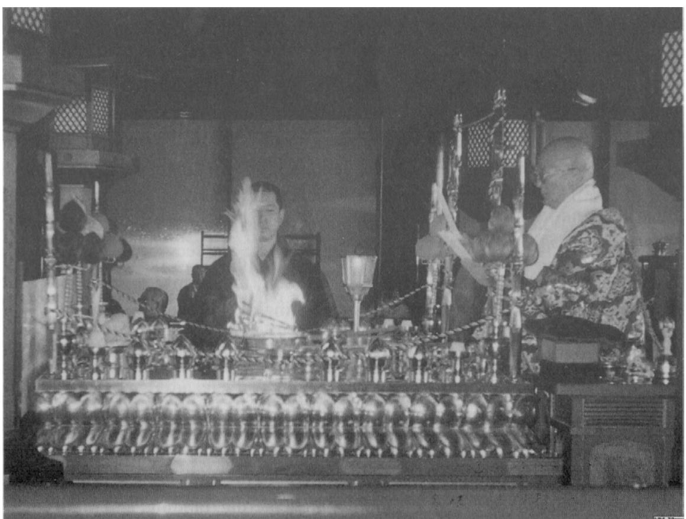

21. *Homa* performed by a Shingon priest inside the main temple at Narita, Japan, in 1987.

of speaking, it is said to be the eastern and other directions. (However) in the absolute sense, the eastern and other directions do not exist.

Having become endowed with the nature of one's deity, one generates the hearth with the seed syllable placed in one's heart. Perceiving the fire ablaze, one envisages inside it the non-existence (*nair*ā*tmya*) (of all *dharmas*). One visualises a lotus and a sun on a triangular fire maṇḍala arisen from the syllable Raṃ, and on the top of them the fire god Agni arisen from the syllable Raṃ or produced instantly. Agni has a pending belly, a fleshy and dwarfish body, and three faces with three eyes each. With one of his right hands, he makes the gesture of fearlessness, and with the second right hand, he holds a rosary. In his two left hands, (10a) he holds a club and a pitcher, and with his two principal hands, he embraces his radiant consort (*prajñ*ā). (Tib 157.1.1) His colour, garments and ornaments are in agreement with the particular rite. He is endowed with a surrounding garland of rays (symbolising) consciousness (*vijñ*āna), and the seal (*mudra*ṇa) of the chief deity of the (appropriate) family. He has a beard and his hair is made into a bundle. Inside his heart, there is the seed syllable placed on the fire maṇḍala.

With the hooks of light rays dispersed into space from the seed syllable placed in the heart of the pledge-being, one summons Agni the knowledge-being, which resembles the pledge-being. He arrives from the south-eastern direction accompanied by a host of hermits. The colour of his principal face is the same as that of the body. When it is white, the right and left faces are black and red respectively. When it is yellow, red or greenish, the other two faces are blue and white. When it is blue, the other two faces are white and red.

One should invite the god Agni by motioning the thumb of the right (hand making the gesture of) fearlessness while reciting the following *mantra*:

> "Oṃ *come*, *come here great being*, *divine hermit and highest br*āhmaṇa. *Please come near to partake of this burnt oblation and food*."

Next, having summoned Agni with the *mantra*: "Oṃ *agnaye* ā*dipya* ā*dipya* ā*visa* ā*visa*  mahāś*riye havyakavyav*āhanā*ya Sv*āhā," one should disperse all the (10b) obstructive spirits which accompany him by reciting the *mantra* of Yamāri and other deities. Reciting the *mantra* "Jaḥ Hūṃ Vaṃ Hoḥ." one should perform in a proper order the activities of summoning, entering, binding, and gratifying.

The water for the face should be presented with one of the following *mantras*:

"Oṃ *agnaye* ā*dipya* ā*dipya* ā*visa* ā*visa mah*āś*riye havyakavyav*āhanā*ya argha*ṃ *prat*ī*ccha Sv*āhā."

Or "Oṃ Āḥ Ruṃ *argha*ṃ *prat*ī*ccha* Hūṃ."

Or "Oṃ Āḥ Hrīḥ *pravarasatk*āraṃ *argha*ṃ *prat*ī*ccha* Hūṃ Svāhā."

Instead of the word *argha* (the water for the face), one inserts the words pā*dya* (water for the feet), ā*camana* (water for sipping) and *abhyuk*ṣaṇa (cleansing

water), when offering these items. In conformity with the rite, one should also offer flowers and the other articles of worship, the secret worship and the rest.

The abridged procedure, which conforms with the practice handed down by our distinguished *gurus*, is as follows:

> One should dispense the triple sprinkling (*prok*ṣaṇa) into the first vessel with a bunch of kuśa grass, and with the water recited over with all the heart *mantras*, one offers the water for sipping into the same vessel. 92

> Taking a flower with the forefinger and turning the fist downwards, one should release it in due order with the little finger, ring finger, middle finger, and forefinger.

> Taking the water contained in two conch shells, one should present the water for the face (11a) into the two receiving receptacles while unfolding the *vajr*ā*ñjali*  gesture. The third is the water for the feet.

> Grasping a flower with the forefinger and the thumb of (one's hand made into) a fist, one should move it three times in a circular manner in front of the Buddhas, and then one should release it in a proper order with one's fingers: forefinger, middle finger, ring finger, and little finger. 93

The extended procedure is as follows. Reciting "Oṃ Āḥ Jaḥ Hūṃ, " one summons (Agni) and makes (him) rest on a bunch of kuśa grass to the side of the fire inside the hearth. One offers the water for the face and so forth. Pronouncing in a proper order "Jaḥ Hūṃ Vaṃ Hoḥ" impregnated with the three natures (*tritatva*), and holding the *vajra* and (Tib 157.3.3) the bell in an embracing position, one snaps the fingers of both hands. One makes Agni enter into the pledge-being, and then one binds and subdues him. Once again, one offers all the articles, the water for the face and the rest.

Next, one should recite three times the following pledge:

 

"Oṃ. O Vajra-fire and Great Spirit, blaze, set aflame all these things and turn to ashes all the enemies, Hūṃ Phaṭ. Behold Jaḥ Hūṃ Vaṃ Hoḥ. You are the pledge. I am the pledge."94

One holds the spoon filled with ghee in the left hand raised in an upright position and clenched into the fist of the highest enlightenment, and in the right hand facing downwards, one holds the ladle facing upwards and filled with ghee. In the ferocious rite, the spoon filled with pungent oil together with poison is

<sup>92</sup> Tibetan version reads: "One should dispense the triple sprinkling into the first vessel with a bunch of kuśa grass and with the water recited over with the all-operative (*mantra*). This in fact represents the water for sipping."

<sup>93</sup> Tibetan adds: "As for other sources, it is said in the Saṃpuṭ*a-tantra*: At the beginning one considers what has been said about the vessel for the water for the face."

<sup>94</sup> Oṃ *vajr*ā*nala mah*ābhū*ta jvala jv*ā*laya sarva*ṃ *bhasm*ī*kuru sarvadu*ṣṭān hūṃ phaṭ dṛ*sya ja*ḥ hūṃ vaṃ hoḥ *samayas tva*ṃ *samayo 'ham*.

held in the right hand, and the ladle in the left hand. On the spouts of the spoon and the ladle, one arranges the seed syllable of one's chosen deity with the three syllables attached to it and radiant with rays. On the mouth of the fire god Agni, one deposits the syllable Raṃ. One places the ladle's spout on the top of the spout of the spoon. One holds one's hands between the knees, but in the ferocious rite (one holds them) on the outside.

In the peaceful, enriching, subduing, and wilful summoning rites, the *mantras* conclude with Svāhā, Oṃ, Hoḥ, and Jaḥ (respectively), and in the ferocious rite with Hūṃ Hūṃ or Phaṭ. One's face should be somewhat benign, but in the ferocious rite and that of ferocious summoning, it should be gaping. (In the peaceful rites) the spoon is turned in a clockwise manner, and in the ferocious rite in an anticlockwise manner. Depending on the benefactor's resources (ś*akti*), one offers three or seven ladlefuls with Agni's *mantra*95 or with the *mantra* for the full burnt oblations: "Oṃ *salutation to the fire*  of *all the Buddhas Sv*āhā."96 The following *mantra* is used for the remaining burnt oblations with ghee: 97 "Oṃ *agnaye sv*āhā."

Next, one should examine the omens inside the fire (to discern) whether it contains obstructive spirits (*savighna*) or whether it remains (Tib 157.4.1) free from them (*nirvighna*).

> "The appearance of the best fire resembles an endless knot, a chowrie, an umbrella, a victory banner, a lotus, or ajar. Alternatively, the fire has the appearance of a trident, a sword, a fish, a firefly, 98 or a *svastika*.

> It is noble and shaped like a *vajra*, a conch and the like, a ladle or a spoon. It is pure and endowed with radiance, of elegant hue, or similar to Sakra's bow.

> It twists in a clockwise direction, issues pleasant fragrance, and resembles corals or gold. It is stainless like the radiance of safflowers, silver, sapphires or brilliant sun. It is free from smoke, fragrant and resounding like a flute (12b) or a tabor.

> It shines white in the peaceful rite, and yellow in the enriching rite. It has a fine red crest in the subduing rite, and it is dark blue in the fierce rite. In the peaceful and other rites, it shines like gold. It has one fine crest, two moderately blazing crests, or it resembles a cloud with three small crests.

> In the ferocious rite, it is full of smoke, adverse and sluggish. Its crest is split and impure. It is rough, black and spiky. It resembles the palāśa

<sup>95</sup> oṃ *agnaye* ā*dipya* ā*dipya* āviśa āviś*a mah*āśrī*ye havyakavyav*āhanā*ya sv*āhā. 96

oṃ *nama*ḥ *samantabuddh*ānā*m agnaye sv*āhā. 97 *itaragh*ṛtā*huti* / *cig shos kyi mar gyi bsreg blugs*. 98 Sanskrit *indragopa* / Tibetan *indran*īla.

blossom or a cow's head. It sparks, issues harsh sounds, and exudes like corpses.

When the fire contains obstructive spirits and adverse omens, one sprinkles it with the cleansing water, and executes an act of protection (rakṣā) by offering seven times a burnt oblation with ghee recited over with the all-operative *mantra*. Then once again, having sprinkled the cleansing water with Agni's *mantra*, or the all-operative *mantra*, one offers a full burnt oblation with ghee, either three or seven times, or just once, depending on its availability. After that, one should perform a burnt oblation with ghee and other articles, either three or seven times, or just once, depending on their availability, using the ladle and so forth.

It is said: "The ghee is offered for burning with the ladle. The rice grains should be presented with the same." However, in the first instance, one should purify the offertory wood (13a) and the remaining articles:

> Oṃ Āḥ Svāhā—the *mantra* for purifying the offertory wood. Oṃ Śriṃ 99 Svāhā—the *mantra* for purifying the ghee. Oṃ Oṃ 100 Svāhā—the *mantra* for washing the articles. Oṃ Jriṃ 101 Svāhā—the *mantra* for purifying the rice. Oṃ *kuru kuru Sv*āhā—the *mantra* for purifying the remaining articles.

The correct order (of offering the articles) is as follows. Having offered for burning the offertory wood, one should offer ghee, sesame, dūrvā, grain, rice with curds, kuśa and other articles into the fire (burning with) the offertory wood. (The articles are presented with) their own *mantras*, which will be given later. The offertory wood, dūrvā and kuśa are taken with the thumb and the ring finger. In all cases, the liquid items are dispensed on the face; the offertory wood, the powder of human bones and other items on the circle of light;102 rice with curds, solid food, 103 water for sipping, sesame seeds, and other articles into the hand; scent at the heart; flowers into hands; incense into the flame; water for the feet on the feet; butter lamps and the water for the face at the front. The water for the face is also dispensed into a bowl. Some people say:

> "One should always sprinkle the cleansing water on the body, bum the incense at the front, offer thrice the water for sipping into the mouth, but the water for the face (13b) on the head."

Next, having offered the water for sipping, and having sprinkled the cleansing water, one should place Agni in the hearth at the south-eastern side in the form

<sup>99</sup> Tibetan reads śrīḥ. 100 Tibetan reads āḥ

<sup>101</sup> Tibetan reads dzi. 102 *prabh*āmaṇḍale / *'od kyi dkyil 'khor*

<sup>103</sup> khādya / *bza' ba*.

of a flame or in his proper form. Then once again, just as before, while reciting the syllable Hūṃ and the *mantra* of Amṛtakuṇḍali, one sprinkles the cleansing water over the required things (Tib 158.1.1) in accordance with the rite.

In the peaceful rite, the chief deity of the (appropriate) family should be peaceful, white, seated on a white lotus and moon, clad in white garments and ornaments, radiant with white light, abiding in meditation, and having the appearance of a sovereign or a uniform appearance (*ekar*ūpa). Those who are to be perfected (sā*dhya*) are consecrated with the vase held in the hands of Locanā and other deities produced by dispersing rays of light. The vases are made of moonstone and filled with ambrosia and the thought of enlightenment. Through this consecration, all their afflictions and other defects become removed.

In the enriching rite, (the deity) is cheerful and magnanimous, yellow in colour, wearing yellow ornaments and resting on a yellow seat. Just as above, a shower of jewels or ambrosia is poured from a golden vase on the body of the one to be perfected, or on the (intended) house, removing thus scarcity and other things, or poverty.

In the subduing rite, the seat and other things are red in colour. Just as before, the act of subduing is done by piercing the (enemy's) heart with an arrow resembling a lotus bud. 104 In the rite of wilful summoning, the act of summoning is done by binding and piercing with a noose and a hook.

In the fierce rite, (the deity is) wrathful and the seat and other things are black. A shower of *vajra*-fire is cast down on the head of the one to be perfected, and it turns him into ashes. In the rite of ferocious summoning, 105 one should perform the visualisation in a similar way.

In the all-inclusive rite, one places one's own deity106 inside the hearth in conformity with the (particular) rite with regard to the form, ornaments and other things. Alternatively, the *yoga* of one's own deity (assumes) the *yoga* of the deity which is to be placed inside the hearth. 107

So far as the specific differences are concerned, in the peaceful rite, one is endowed with the *yoga* of the lord Vairocana; in the enriching rite with that of Ratnasambhava; in the rites of subduing and wilful summoning with that of Amitābha; in the rites of slaying (Tib 158.2.1), calamity and destruction108 with

 

<sup>104</sup> Tibetan reads: "with an arrow which resembles an unfolded red *utpala*."

<sup>105</sup> krūrākṛṭi / *drag pos dgug pa*. 106

svā*dhidaivat*ā / *rang gi lhag pa'*i lha. 107 Tibetan reads: "Similarly, in the all-inclusive rite, one is endowed with the *yoga* of one's own deity in agreement with the (particular) rite, or one is endowed with the *yoga* of the deity which is to be placed in the hearth."

<sup>108</sup> mārī*tyupadravan*āśa / *bsad pa dang yams dang nye bar* (*'tshe ba*).

that of Amoghasiddhi or Vairocana; and in the fierce rite with that of Akṣobhya, Yamāntaka or some other fierce deity.

In the peaceful rite, one executes the (process) of generating the pledge-being, summoning the knowledge-being, and all other activities up to the consecration by following the order explained in (14b) the relevant evocation manual. 109 Having done this, one should offer worship with white and fragrant flowers, and with other articles recited over with their own *mantras* and with the *mantra* of one's own deity. In the enriching rite, one does the same, but the particular (things) are yellow in colour, and in the rites of subduing and wilful summoning, they are red. The specific peculiarities of the ferocious rite are said to be (as follows). One executes it using the flowers with an unpleasant smell or without any smell, such as *bilva*, *arka*, *java* and other flowers, incense made from *sarjarasa* and other trees, lamps110 fuelled with human, fish and other kinds of fats, 111 and pungent, bitter and other kinds of food.

Next, reciting "Oṃ Āḥ Hrīḥ *receive this excellent and reverential water for the face H*ūṃ Svāhā,"112 one offers just as before the water for the face, water for the feet, water for sipping, 113 and cleansing water. Having thus worshipped, one places the seed syllable of one's chosen deity on (Agni's) tongue shaped like a *vajra* and coloured in agreement with the (individual) rites, and then reciting (the deity's) *mantra*, one offers a full burnt oblation just as before. After having offered the ghee and all the remaining articles individually, either three or seven times, 114 one should offer a burnt oblation with the ghee together with ambrosia in proportion to their availability.

In the rite of drawing the maṇ*4ala* and so forth, one places inside the hearth the maṇḍ*ala's* chief deity, 115 or the deities to be sanctified, 116 or the deities to be perfected, 117 or the deities assigned118 to the peaceful and other rites, or one's chosen deities. One does it by following a proper procedure. As for one's own disposition, one should be endowed with the *yoga* of one's own deity119 or with the *yoga* of the deity placed inside the hearth.

<sup>109</sup> sā*dhanop*āyikā / *sgrub thabs dang mngon par rtogs pa*. 110 Sanskrit reads dhūpa

<sup>111</sup> Sanskrit reads *taila* and Tibetan reads *zhag*. 112 Oṃ āḥ hrīḥ *pravarasatk*ārā*rgha*ṃ *prat*ī*ccha h*ūṃ svāhā. 113 Omitted in the Tibetan version.

<sup>114</sup> Tibetan adds "or once."

<sup>115</sup>

maṇḍalā*dhipa* / *dkyil 'khor gyi gtso bo*. 116 *prati*ṣṭhā*tavya* / *rab tu gnas par bya ba*. 117

sā*dhyadevat*ā / *sgrub bya'i lha.*

<sup>118 <</sup>i>adhikṛta / *dbang du byas pa*. 119

svā*dhidaivat*ā / *rang gi lhag pa'i* lha.

In the peaceful rite, the *mantras* (of the articles) are appended with the words: "*amukasya* śāntiṃ *kuru Sv*āhā;" in the enriching rite with the words: "puṣṭiṃ *kuru O*ṃ;" in the subduing rite with the words: "vaśyaṃ *kuru Ho*ḥ;" in the summoning rite with the words: "ākṛṣṭiṃ *kuru Ja*ḥ;" in the fierce rite and the rite of ferocious summoning with the words: "mā*raya Pha*ṭ*''* or "Hūṃ Hūṃ," and such words as "ākarṣaya," "uccāṭaya" and the like, recited in a loud and proud manner. Optionally, the *mantras* may be appended with a stanza expressing one's desired intention. 120 While endeavouring to sustain the peaceful and other mental dispositions, one performs the recitations and offers the burnt oblations with the articles prepared for burning. One does it one hundred times, one thousand times, or an unlimited number of times.

Alternatively, one envisages either one's own deity arisen from its seed syllable, or the maṇḍala circle (*cakra*), or the chief and other deities of the previously explained maṇḍala resting inside the heart of the fire-god Vahni, who epitomises the knowledge of suchness (*tathat*ā), and stands by himself in the middle of the hearth.

Next, after executing the activity of summoning the knowledge maṇḍala, making it merge and so forth, one should present the burnt oblations into (Agni's) mouth. On this occasion, one should make a proclamation121 saying: "Agni is truly the face of the gods and the bestower of the *homa* attainments."

Now come the *mantras* of the fire deity and the rest for presenting (158.4.1) the burnt oblations:

> Oṃ *sarvap*ā*padahanavajr*ā*ya sarvap*āpaṃ *daha Sv*āhā—for sesame seeds in order to pacify.

Oṃ *vajr*āyuṣe Svāhā̦—for dūrvā grasses to increase life.

Oṃ *vajrapu*ṣṭaye Svāhā̦—for unhusked and unbroken rice to induce riches.

Oṃ *sarvasampade Sv*āhā̦—for rice and curds, and best food, in order to bring success.

Oṃ *apratihatavajr*ā*ya Sv*āhā—for kuśa grass smeared with sesame oil for the purpose of protection (rakṣā).

Oṃ *vajrab*ījā*ya Sv*āhā—for husked grain.

Oṃ mahāvīryā*ya Sv*āhā—for barley.

Oṃ mahābalā*ya Sv*āhā—for māṣa peas.

Oṃ *vajraghasmare Sv*āhā—for wheat.

Oṃ *vajrayajñ*ā*ya Sv*āhā—for *audumbara*.

Oṃ *bodhiv*ṛkṣāya Svāhā—for aś*vattha*. (16a)

Oṃ *vajralat*ā*yai Sv*āhā—for *plak*ṣa wood.

Oṃ *vajrakuver*ā*ya Sv*āhā—for *nyagrodha*.

 

<sup>120 <</sup>i>abhipretapada / *rang gang 'dod pa'i ming spel bcug pa*. 121

<sup><</sup>i>pravacana / *gsung rab*.

Oṃ *sahak*ārā*ya Sv*āhā̦—for āmra. Oṃ *vajr*ārkā*ya Sv*āhā̦—for *arka* branches. Oṃ *vajrabrahma*ṇ*e Sv*āhā̦—for palāśa. Oṃ *vajrag*ātrā*ya Sv*āhā̦—for *khadira*. Oṃ *vajra*śruvā*ya Sv*āhā—for *vaika*ṅ*kata*. Oṃ *vajra*śivā*ya Sv*āhā̦—for śamī. Oṃ *sarvato bhadr*ā*ya Sv*āhā—for *gambh*ārī. Oṃ *vajra*ś*ikhar*ā*ya Sv*āhā—for apāmārga.

Optionally, for the unhusked grain and other articles, one may use the *mantra* of the deity which is to be gratified. 122 However, the remaining articles should be offered for burning with the *mantras* of the deities which are to be gladdened. The learned people who know the sacred instructions123 say:

> "One should offer the burnt oblation with all the articles for burning being sprinkled with the five ambrosias, the excrement and so forth, and envisaged as being imbued with the essence of ambrosia."

Thus, one offers the *homa* (158.5.1) with whatever is available, following one's own rite or the rite of some other ritual ordinance. Reciting the heart *mantra* of one's Buddha family, three, seven or twenty-one times, one should set ablaze the burnt oblations with the ghee. At the end, one offers one full oblation, and then reciting the heart *mantra* of the family's chief deity, 124 one should present the water for the face. After that, having sprinkled the cleansing water, one offers the water for sipping, 125 a piece of new cloth, and a betel126 without lime, 127 but with lime in the ferocious rite. Then, just as before, one offers worship, recites praises, makes obeisance, and offers the water for the face. Holding a flower with one's hands cupped128 and placed at the heart, one should beg the Lord for forgiveness129 in order to appease the faults of deficiency and other faults. 130

> "O Protector, since you are the defender of living beings, please forgive me whatever faults have been committed by me, a foolish man. I have done here what was to be done with inability and inefficiency because of ignorance. O Guide please deign to forgive me everything."

Having duly begged for forgiveness, and having made a request for desired attainments, one sets one's thoughts on deliverance and recites "Oṃ *Vajrasattva*

 

<sup>122</sup>

saṃ*tarpan*ī*yadevat*ā / *tshim par bya ba'i lha*. 123 āmnāya / *man ngag*. 124 kūlā*dhipati* / *rigs* kyi *bdag po*. 125 Sanskrit reads ā*camana* and Tibetan reads *zhabs bsil*. 126 tāmbūla / *so rtsi*. 127

cūrṇ*arahita* / *rdo thal med*. 128

<sup><</sup>i>sampuṭā*ñjali* / *bcas pa'i thal mo*. 129 kṣ*amayet* / *bzod par gsol*. 130

nyūnā*dido*ṣa / *ma tshang ma la sogs pa'i nyes pa.*

Āḥ" in order to appease the faults of deficiency and excess. 131 Having repeated it many times, one should recite the hundred syllables (of Vajrasattva).132

> "Oṃ. Vajrasattva protect my pledge. Vajrasattva be in attendance, be firm for me, be favourable to me, remain attached to me, promote me, and grant me all attainments. Ascertainer of all *karma*, make superior my mind Hūṃ *Ha Ha Ha Ha*  Hoḥ. O Lord Vajra of all the Tathāgatas do not abandon me. Vajra-Essence, Great Pledge-being Āḥ." (Tib 159.1.1)

After that one says:

"Oṃ. As you act for the benefit of living being, I ask you to grant the appropriate attainments. Although you have already reached the Buddha land, I ask you to proceed there once again." Having admonished (the deities) with these words, one recites their *mantras* inserted between the three syllables and the syllable Muḥ placed at the end. One should request (the deities) to depart in accordance with the rite by applying the mental disposition of the protective deity who is their master.

Next, one summons the fire-god into the hearth. Once again, one offers worship, and then one presents the cleansing water, the water for the feet, a betel without lime but with lime in the fierce rite, and a piece of new cloth. One offers a *homa* with the remaining articles, and at the end, one rings the bell and recites praises. This rite is done mostly for the purpose of gaining one's desired attainments. In the cases such as sanctifications133 and other intended purposes, one holds with the left little finger the right thumb of the disciple, who presents the gifts (for such purposes), and one makes him circumambulate the hearth three times in a clockwise direction. One also conducts him to present a burnt oblation seven times by placing (the articles) in a clockwise manner on the spouts of the ladle and the spoon. One fastens on his hand a white protective thread134 recited over with the *mantra* of Amṛtakuṇḍali, and one sprinkles the cleansing water. When one does it for the benefactor, one creates a mental disposition for the happiness of the ruler and others, and one offers a burnt oblation. Likewise, the ruler, the protectors of the world, all living beings, and one's disciples, who have certain desired intentions, every one of them, should also offer a burnt oblation three times or once in each rite. (Tib 159.2.1) They also present some gifts. So it is said. However, this is a specific particularity.

Next, one offers the sipping water and sprinkles the cleansing water. Then, having offered worship, one presents the water for the face, asks for forgiveness, and requests for the attainments which one desires. One recites "Oṃ *Vajrasattva*

<sup>131</sup> nyūnā*tiriktado*ṣa / *lhag pa dang chad pa'i nyes pa*. 132 śatākṣara / *yi ge brgya*. 133 *rab tu gnas pa*. 134 *bsrung skud*.

Āḥ" and just as before one admonishes (the deity) to leave. Saying "Oṃ *vajra Mu*ḥ." one requests it to leave in accordance with the rite. When one does away with the arrangement of the mundane deities inside the hearth, then the generation of the pledgedeities, the summoning of the knowledge-deities and their merging with the pledgedeities, worship, burnt oblation, and other things are to be performed in the manner executed in the case of the fire-god. At the end, one requests them to leave in the same way as it is done for the fire-god. One should practise this every day, or at specified times, or during the three or four (meditational) periods (*thun*).

Next, taking milk, uncrushed rice, butter, honey, and sugar, one seasons them with one's favourite flavours, and pours them inside a vessel with the ladle or the spoon. The vessel should not be black, and it should be fastened around its neck with a garland of flowers. One places it over a tripod and cooks a meal135 over the fire of the (*homa*) hearth, transforming (the cooked articles) into having the quality of ambrosia by following the rite explained in the *Vajr*āvalī. While doing it, one meditates in conformity with the *yoga* of one's doctrinal orientation. (The first share of the cooked meal should offered to) the Tathāgatas. The next share (is distributed) to gratify the gods, the protectors of the world, and oneself, while making supplications for the removal of evil. After that, the remainder should be handed out in shares to the attendants (to distribute to) the benefactor and all other people.

In the peaceful rite, the base of the fire (is imbued) with milk, (Tib 159.3.1) in the enriching rite with yellow water, and in the subduing rite with milk tinted red and black.

Next, the ashes and charcoals from the *homa* hearth are placed inside the alloperative vase and disposed into waters such as a river and so forth. Such is the rite of the outer *homa*. 136

# 10. *Meditational homa*

Then all things are neither in excess nor in deficiency, one should act through the mind alone and all aspirations certainly become fulfilled. This is a particular kind of mental *homa*. 137 A different way of doing it is as follows. Being duly endowed with the *yoga* of one's chosen deity, one visualises the chief deity of the drawn maṇḍ*ala* as being seated in the middle of the maṇḍ*ala* positioned in the sky in front of oneself, having a seat and other attires in conformity with the (individual) rites, and essentially abiding inside the fire, just as it has been already explained. At the deity's side, one positions a vessel filled with honey

 

<sup>135</sup>

pā*yasa* / *'o thug*. 136 *phyi rol gyi sbyin bsreg gi cho ga*. 137 *yid kyi shying bsreg*.

and ghee, and having the nature of the seven jewels (*saptaratna*). One performs a mental *homa* by offering burnt oblations, using the spoon and the ladle endowed with the nature of the seven jewels. Likewise, having envisaged the entourage of one's chosen deity, one should duly accomplish with one's mind the rite of summoning them and so forth. One should gratify them with burnt oblations. This *homa* rite is supreme. 138 It is so because the highest mind is the source (*rgyu*) of mental formations, 139 because it constitutes the absolute essence in the outer *homa*, and because the mind has the essential character of stainless clear light (*'od gsal*), and it resembles the Buddhas, Vajradharas and others, who assume different illusory manifestations despite the fact that they are fully perfected. Such is the rite of the mental *homa*. (159.4.1)

As one is endowed with the *yoga* of one's chosen deity, one becomes purified in consecutive stages by means of one's deity's nature or by Vajrasattva's nature, or one should acquire the nature, form and whatever other desired qualities of Vairocana and other deities. There is no doubt that one should enjoy such things. It is said:

> "At the time of eating one transforms all one's food into ambrosia by means of the purity of sameness. 140 Using one's hand as a spoon and so forth in accordance with the rite, one gratifies the retinue of one's own deity, which abides inside one's heart enveloped with the fire of the abdomen's hearth."

Thus, it is by means of the outer *homa* that one performs the inner *homa*. 141 The inner *homa*, which has no recourse to any external articles as the source (*rgyu*) of the highest happiness and excellence, has been explained by me (= Abhayākaragupta) in my commentary on the Saṃ*puta*-*tantra*. 142 It is from that text that one should learn it. Just as the threefold world is committed into the wisdom-fire shaped like a circle of non-dual emptiness and compassion, the destruction by fire of the firewood of the *skandhas* and the rest represents the highest *homa*. 143

## 11. *Summary*

I have outlined and explained here all the rites of all the deities. However, when some of the Yoga and Yogīni *tantras* explain the ritual particularities in a

<sup>138 <</sup>i>anuttara / *bla na med pa*. 139 *abhisa*ṃskṛta / *mngon par 'du byed pa*. 140 *samat*ā / *mnyam pa nyid*. 141 *nang gi sbyin bsreg*. 142 Ś*ri-Sa*ṃpuṭ*atantrar*ājaṭīkā Āmnā*yamañjari-n*āma / *dPal yang dag par sbyor ba'u rgyud kyi rgyal po'i rgya cher 'grel pa Man ngag gi snye rna zhes bya ba*. Tibetan Tripiṭaka, Peking edition, vol. 55, 105.1.1 ff.

<sup>143 <</sup>i>bla na med pa'i sbyin bsreg.

slightly different way, then one should follow them and act in accordance with the circumstances.

Now comes the summary. One worships with the essence of the deity. Having purified the ground with a *bali*, one should construct the hearth. In the peaceful, enriching, subduing and fierce rites, the hearths are positioned to the east, south, west and north of the maṇḍala. The teacher faces the east, north, west, and south. To his left there are arranged the vessels with the (different kinds of) water, the water for the face and so forth. To the right, there are the offertory wood, butter (Tib 159.5.1) and other articles for burning. Having kindled the fire, one arranges and overlays the kuśa grass inside the hearth. One kindles the firewood with liquid butter. Having merged the fire with its knowledge-body, one worships with the water for the face and so forth. One lifts the spoon and the ladle towards the face, and then, having offered a burnt oblation, one should perform the act of gratification. Complying with the benefactor's aptitude (*nus pa*) one performs it in a clockwise manner. Next, one should offer the burnt oblations with the butter and other articles, using the spoon and the ladle. The water for the feet, sipping water, cleansing water, and water for the face, should be respectively offered on the feet, into the hands, on the body, and at the front; liquids into the mouth; offertory wood into the light (circle); solid food and other articles into the hands; flowers on the head; incense and lamps at the front; and scented water (*dri chab*) at the heart. The fire-god Agni and the higher deities144 are the ones whom one should gratify and so forth. Following a proper order, one offers butter, sesame, dūrvā tops, rice, food and cooked articles, 145 kuśa, unhusked grain, barley, maṣā peas, wheat, *udumbara*, *bilva*, *plak*ṣa, *nyagrodha*, āmra, *arka*, *brahmav*ṛkṣa, *khadira*, *vaika*ṅka, śamī, *gambh*ārī, and apāmārga. After that, one should present a garment, 146 perform recitations, ring the bell and recite praises. Then one asks for forgiveness, beseeches the gods and the fire-god Agni to bestow attainments, and finally, one invites them to leave.

As far as virtuous conduct in the peaceful and other rites is concerned, inappropriate talking is not a virtuous deed. In accordance with the engagement, one's mind and body should duly focus on the recitations and the ritual performance, or one should perform everything with the mind alone. It is said that the *homa*, which inwardly (bums) the sentient beings in the knowledge-fire of emptiness and the nature of compassion, represents the worship of the Victorious Ones. The burnt articles epitomising the waves of adherence to existence and non-existence become appeased with the blaze of wisdom rays.

 

<sup>144 <</sup>i>adhidevatā / */hag pa'i* lha. 145 *bza' ba 'o thug*. 146 *vastra* / gos.

# **The** Saṃpuṭ*a-tantra* **Sanskrit and Tibetan Versions of Chapter Two**

The Sanskrit and Tibetan versions of Chapter One of the Saṃpuṭ*a-tantra* have been edited in *The Buddhist Forum,* volume IV, pages 216–244. The edition of Chapter One also includes an analysis of the structure and content of the Saṃpuṭ*a-tantra* (pages 191– 215), which was produced on the basis of the information culled from the commentaries composed by Abhayākaragupta, Indrabodhi and Vīryavajra.

The edition of Chapter Two is based on the three Sanskrit manuscripts and two Tibetan editions, 1 which were also used for editing Chapter One. The Sanskrit manuscripts A and C, although they differ from each other in a number of places, on the whole, they are closely related. The Sanskrit manuscript B, when compared with the manuscripts A and C, appears to appertain to a different line of transmission. Its punctuation is different and it shows a considerable tendency to provide feminine nouns and adjectives with masculine endings. There are several places where the discrepancies between manuscript B and manuscripts A and C amount not merely to individual words or grammatical forms, but to whole phrases; this occurs in particular in Section Three of Chapter Two. In addition to that, manuscript B corresponds more closely to the Tibetan version than manuscripts A and C.

!!!!!!!!!!!!!!!!!!!!!!!!!!!!!!!!!!!!!!!!!!!!!!!!!!!!!!!

<sup>1</sup> The three Sanskrit manuscripts are designated here as A, B and C. Manuscripts A and B are preserved in the Bibliothèque Nationale in Paris. Their respective identification numbers are given as Sanscrit 148 and Sanscrit 144, and their microfilm numbers are R.19830 and R.19829. Manuscript A is written in *devan*ā*gari* script and numbers 135 folios. Manuscript B is also in *devan*ā*gari* and numbers 211 folios. Manuscript C is kept in Kyōtō and its identification number is given as 2739287. It is in Newari script and numbers 241 folios.

The edition of the Tibetan version is based on the Peking and sTog Palace editions; abbreviated in the footnotes to P and T.

P: *rgya gar skad du Sampu*ṭi-nā*ma-mah*ā*tantra* / *bod skad du Yang dag par sbyor ba zhes bya ba rgyud chen po.* Peking edition, vol. 2, 245.5.2 to 291.1.3.

T: *rgya gar skad du Sampu*ṭa-nā*ma-mah*ā*tantra* / *bod skad du Yang dag par sbyor ba zhes bya ba'i rgyud chen po.* sTog Palace edition, vol. 93, Kha, 30lb6–446a4.

The Sanskrit manuscripts contain a number of grammatical forms, which are peculiar to Buddhist texts written in the so-called Buddhist Hybrid Sanskrit, which frequently mingles classical and vernacular grammatical forms. Such a mixture of different grammatical forms cannot be simply attributed to random selections of forms or to personal preferences of the original compiler, but it seems to be due either to the required number of syllables in a metre, or to the influence of the prevailing vernacular forms. While editing Chapter Two, all such grammatical forms have been mostly retained, and no attempt has been made to unduly tamper with the text by introducing classical forms. However, an effort has been made to correct or improve the corrupted readings by eliminating scribal errors and by inserting better readings on the basis of the available manuscripts. In a few places, where it was not easy to establish correct readings, the text is left untouched and the alternative readings are provided in the footnotes.

The Tibetan version is free from serious errors and it has been often helpful in improving corrupted readings in the Sanskrit text. The sTog Palace edition has fewer errors, and in a number of places, it has better readings than the Peking edition.

Chapter Two is divided into four sections. The first two sections are provided with headings, and the remaining two sections do not have headings, but they have been provided with headings invented on the basis of the commentaries and their contents.

Section One, called "the consecration of the thought of enlightenment," provides an exposition of the ritual and theoretical framework relative to the *tantric* consecrations. The text begins by explaining in general terms the preparatory stages leading to the consecrations, such as the construction of the maṇḍ*ala* drawn in coloured powders, the different categories of women that should be engaged during the *tantric* consecrations, the preliminary activities of the teacher, and the disciple's request for the consecrations. Next, the text outlines the *tantric* vows, the four joys, and the four *tantric* consecrations. The consecrations, and the relevant activities that normally precede and follow the consecrations, are clearly outlined, but their actual performance is not explained in any detail. The focus is on the essential stages of the consecrations, on their doctrinal and spiritual significance, on their beneficial efficacy such as being born in a Buddha family, on the purification from defilements, and the certainty of gaining buddhahood.

Section Two explains the doctrinal significance ofthe meditation on the non-dual nature of wisdom and means. The text firmly asserts that the state of enlightenment is not attained through mental differentiations, but through making no distinctions between the opposites. The *yogin* should not meditate

on emptiness or on non-emptiness, and he should neither grasp nor abandon emptiness. It is so because both grasping emptiness and abandoning non-emptiness involve a complicated series of mental processes. The text continues to elaborate on this non-dual process of meditation and provides several similes. The *yogin* should not meditate on the existence or non-existence of living beings because the supreme wisdom is free from mental constructs. Ultimately, there should be neither a meditator nor a state of meditation. Taken as a whole, this section provides a coherent explanation of the fundamental *tantric* assumptions rooted in the concept of non-duality.

Section Three deals with the process of generating and visualising the set of deities appertaining to the maṇḍala of the Saṃpuṭ*a-tantra,* and with the relevant recitations. First, the *yogin* meditates on the four immeasurables, benevolence and so forth, and then he proceeds to envisage the maṇḍala foundation. Next, he assumes a wrathful disposition by generating the wrathful Heruka and the eight goddesses, Gaurī, Vetālī and others. After that, he generates a wrathful form of Vajrasattva as the principal deity of the maṇḍala of the Saṃpuṭ*a-tantra.* The essential nature of Vajrasattva consists of the four joys, stainless purity, and freedom from the four mā*ras.* He is embraced by his consort, the goddess Vajravārāhī. Next, the text describes the eight attendant goddesses and the four protective guardians inside the portals of the maṇḍ*ala.* The remaining deities belonging to this maṇḍala are not mentioned in this section; the entire maṇḍala includes thirty-seven deities.

Section Four, which serves as a supplement to the previous section, provides further instructions relative to the process of evocation. The main part of this section outlines the production of a protective retinue based on the *mantra* of the goddess Tārā. The overall purpose of this section is to teach the methods of averting and controlling adverse forces, and of gaining control over the world through the practice of meditation and recitations.

Considered as a whole, Chapter Two provides a fairly coherent and insightful exposition of the *tantric* perception of the essential nature of the thought of enlightenment, its consecration for buddhahood, and the practical methods of bringing it to maturation, which is the state of buddhahood understood as the perfection of wisdom abiding in non-duality.

The Sanskrit and Tibetan texts of Chapter Two that now follow are arranged on the opposite pages so that they can be easily read together.

* * *

#### *The Saf!'lpu(a-tantra: Sanskrit Version of Chapter Two*

1.

athiita}:l 1 siidhakiinii111 hitiiya vai211 (16a6) yena vidhiniipi ca3 kathyate II vasudhii111 sodhayed4 yogi prathama111 deviitmaka}:l II hU111va-(16b )-jrilqtayatnena pasciid maQ(ialam iilikhet5 II udyiine vijane dese ca II sUnyama:r:H.lapiigiiramadhye6 vartayet maQ(ialaJ11 vara111 II divyena rajasii likhyed7 atha vii madhyamena tu II pafi.caratnamayais clifi:lair atha vii taQ(iuliidibhi}:l II trihasta111 maQ(ialaJ11 kiirya111 tathii II caturvidyiis9 tatra divyii}:l pafi.cakulodbhavii}:l // mantramiirgiinusareQa 10 yadii 12 budha}:l II sarvabuddhiinii111 maQ(iale sugatiilaye 14 II anantalokadhiitvisa111 griihyaJ1115 tathiipi dhimatii II priipya II mantramiirge tathii cokta111 saJ11buddhai}:l paramiirthatal). II vajrasattviidideviiniiJ11 samayo duratikramal). II etad arthaii).16 prayatnen-17 jiniitmajal).18 II upasarpayed yathiiyoga11119 vajriiciirya111 II atha vii bhiigini (17a) putri bhiigini20 II

- I. A
2 . B hita hi

- 3. A capi, B vidhinapi sa
- 4. A&C sodhayet, B sadhayet

5. B alikhan

- 6. A -gii:re, C ca
7. B likhet, C lekhayet

- 8. B
- 9. A&C caturthidya4
- 10. A&C margantasii:reQa
- II . A&C

12. B yatha

13. A

14. A&C sugatalayam

15. B C grlihyat

16. B

17. A prajatnena, B sarvayatnena

18. B -ja

19. B upama tad yatha, A&C upasaryayet

20. B mataiva cesta bhagni putri ca bhagineyikiima

*The Saf!lpufa-tantra: Tibetan Version of Chapter Two*  1. byang chub sems kyi dbang

de nas yang dag rab bshad bya I sgrub pa po Ia phan don du II (249.5.7) gang gis slob rna dbang bskur ba'i I cho ga yang ni bshad par bya II dang por lha yi bdag nyid kyi I mal'byor pas ni nor 'dzin sbyang II 'bad pas hurplas rdo rje can I byas te (250.1.1) phyi nas dkyil'khor bri II tshal dang skye bo med gnas dang I byang chub sems dpa'i khyim dang yang II khang stong dang ni khyim nang du I dkyil'khor dam pa bzhengs par bya II rdul tshong dam pa nyid dang ni I yang na 'bring po nyid kyis te II rin chen lnga yi bdag nyid phyes I yang na 'bras la sogs pas bri II dkyil'khor khru gsum bya ba dang I mthe bong gsum yang lhag par bya II der ni rigs lnga las byung ba'i I rigs rna bzang po bzhug par bya II sngags kyi lam gyi rjes btsal bas I gang tshe mkhas pas dbang bskur ba II sangs rgyas kun gyi mngon sum du I dkyil'khor bde bar gshegs gnas su II jig rten khams ni mtha' yas bdag I blo dang ldan pas de bzhin blang II rang byin brlab pa'i gnas thob pas I dam tshig nyams pas jigs pa yis II rdzogs sangs rgyas kyis don dam las I sngags kyi lam ni de bzhin gsungs II rdo rje sems dpa' la sogs lha'i I dam tshig rim pa shin turing II de phyir don kun la 'bad pas I dbang don rgyal ba'i bdag nyid skyes II rdo rje slob dpon yon tan mtsho I ji bzhin sbyor bas gsol ba gdab II yang na rna dang sring thu 1 mo I bu sring mo yi bu mo nyid II

#### *The Saf!!puta-tantra: Sanskrit Version of Chapter Two*

iisiirp1 madhye yiirp tiirp yathii2 tiisiirp siidhanarp kurute II yadi vai tii 3 na syul:t sarvajfiavaiT,Iitii vidyiil:t *I I* 

tasmiid anyiil:t siidhitavyii iibhyo buddhail:t II

dvijakanyiim5 atha vii rajakim6 atha vii atha vii <,lombinikulajii7 I atha vii rajii.i8 natadiirii silpikiitha vii mrganayanii tanumadhyii9 I vipulanitambii stanottatii subhagii tattvasthii11 mantratantrajii I etiil:t kanyiil:t kathitiil:t tribhuvaniinaghiil:t 12 siidhakendriit:tiirp I iibhib sarvasiddhir bhavatiti kulakramet:taiva I atha vii yiirp tiirp13 yathiilabdhiiql tathaiva ca I navayauvanasarppanniirp priipya mudriirp sulocaniirp I tiirp vidyiirp sarpgrhya 15 trisarat:tagamanakramet:ta sarpsodhya kathayet tattvarahasyarp mantratantrakramarp sarvarp I sabdarp vii adhamiirgarp j ihvii tatva-q11 6 tathordhva- 17 ( 17b sarvavidagdharp kiiryarp niiniikarat:takramarp caiva I kut:t<,lalakatisutriidyiihiiranupurakati.kat:tair yuktii 19 I uttamasiddhirp pradadiity 20evarp yii sodhitii vidyii sarvopadravarahite sthiine vidyiidharal:t sukham iipadye21 I

atha22 srakcandanavastriidyair nivedayet II gandhamiilyiidisatkiirail:t II

bhaktyii23 sampujya yatnena mudrayii saba siidhakal:t II

- 1. c asa
- 2. A&C latha, B yas tiiqlladdya111
- 3. B nacedeta
- 4. B tasmat samgrahaQiya asyas ca
- 5. B dvijadaram
- 6. C rajakam
- 7. B caQ<Jalika 9ombimaQikulaja
- 8. A raji, B raji
- 9. B&C -madhya111
- 10. A&C samayacarastunipUQiil11
- II . B tamvasthiiql
- 12. A tribhuvananarghadya, B tribhuvananarghaJ:!, C tribhuvanadya
- 13. B yantiitn, C yaq1ta
- 14. A&C -sabdika
- 15. A&C samagrhya
- 16. Bjihva111
- 17. C tathodva111
- 18. B
- 19. B
- 20. A&C -siddhipada
- 21 . B vidyadhara sasvayadyaJ:!
- 22. B omits
- 23. B&C

## *The Saf!lpu!a-tantra: Tibetan Version of Chapter Two*

'di nang gang de ji Ita bar I myed nas bsgrub pa nyid du gyis II

yang na mngon du 'di med na I kun mkhyen gyis bsngags rig rna ni II

sangs rgyas mams kyis khyad mdzad pa I de ni de phyir gzung bar bya II

skye ba gnyis kyi bu mo dang I yang na btso blag rna dang II

yang na gdol pa mo dang I g.yung mo dang I rigs las skyes rna dang I yang na rgyal mo rna dang I gar mkhan gyi bu mo dang I bzo mo dang I yang na ri dvags kyi mig rna dang I rked pa phra ba dang I ro smad rgyas pa dang I nu rna mtho ba dang I bhaga bzang pa dang I dam tshig gi spyod pa la shin tu 1 dam pa dang I de kho na kha gnas pa dang I sngags pa po'i dbang po la gnas gsum du che ba'i bu mo 'di (250.2.1) dag bshad do II

rigs kyi rim pa nyid kyis 'di mams kyis thams cad 'grub par2 'gyur ro I

rna myed j i I tar gang myed de I de bzhin bcu drug Ion pa nyid *I I* 

dang po'i lang tsho phun sum tshogs I mig mdzes phyag rgya myed nas ni II

rig rna de nyid blangs nas ni I skyabs su 'gro ba'i rim pas ni II

sbyangs pas de nyid gsang ba dang I sngags dang rgyud kyi rim kun bsgrags II

sgra 'am 'og gi lam du lees I de nyid de bzhin steng du gzhug II

kun gyi tsha reg3 sna tshogs byed I rim pa nyid kyis rna cha dang II

ska rags che dang se modo I lag gdub dang ni rkang gdub ldan II

de !tar dngos grub dam pa ster I gang zhig sbyangs ba'i rig rna kun II

nye bar 'tshe ba med gnas suI rig pa 'dzin pa 'khor mang po II

de nas tsan dan gos phreng sogs Imam par brgyan nas dbul bar bya II

dri dang me tog rim gro yis I 'o ma'i mchod sogs rgyas pas ni II

phyag rgya thabs gcig sgrub pa pos I gus par 'bad pas yang dag mchod II

I . P du

<sup>2.</sup> P omits 'grub par

<sup>3</sup> prig

#### *The SaTrJputa-tantra: Sanskrit Version of Chapter Two*

bhumau samaropya2 sraddhayajanumal).<;ialaqt3 II sastaraqt stotrel).anena II namas te4 sunyatagarbha sarvasaqtkalpavarjita II sarvajiiajiianasaqtdohajiianamurte5 namo 'stu te6 II 7j agadajiiana viccheda-8-suddhatatv _9 *I I*  dharmanairatmyasaqtbhutavajrasattva namo 'stu te II saqtbuddha bodhisattvas ca II sambhavanti sada 12natha bodhicitta namo 'stu te II ratnatrayaqt maha-(18a)-yanaqt tatha13 sthavarajaqtgamaiP II traidhatukam idaiP sarvaJ11jagadvi:ra14 namo 'stu te II cintamal).ir ivodbhuto15 II sugatajfiakarasriman buddhaputra 16 namo II jiiatuJ11 me 17 'nuttaraqt tattvaqt tvatprabhavad gul).afl).ava II sarvajiia-18-prasadaqt kuru samprataqt II rahasyaJ11 sarvabuddhanaqt darsitaqt vajradharmine l9 II yatha sri:cittavajrel).a tatha natha prasi:da me II bhagavat-20_padambujaJ11 tyaktva21 nanya me vidyate II tasmat kuru dayaqt natha II vajracaryas sriman sanukampo II krpaqt samutpadya ahuya23 gal).amal).<;iale II

- I . A&C pascat, B
- 2. A&C samalopya
- 3. A&C mar,u;lale
- 4 . A&C -tu
- 5. B miirti
- 6. C namo te
- 7. B iti
- 8. C vicchedi
- 9. C taty-
- 10. A&C tvattal)
- II. A gaiJal)
- 12. A&C maha:-
- 13. A&C tvattal), B catul)
- 14. A viran, C vita
- 15. A&C -bhuta
- 16. A putraJTI, B putral)
- 1 7. B jfiatumo
- 18. A sarvaJTI, C sarvajfie
- 19. B dharmiiJai, C dharmiiJo
- 20. A bhavat
- 21. A tyaska
- 22. A nirjitaJTI, C nirjita
- 23. B samutpadya lqpaJTI ahuya

*The Saf!lpu{a-tantra: Tibetan Version of Chapter Two*  slob mas pus mo'i lha nga ni I sa Ia dad pas gtsugs nas ni II thai mo sbyar nas bstod pa 'dis I ston pa Ia ni zhu ba bya II stong pa'i snying po phyag 'tshal bstod I rtog pa thams cad yang dag spangs II thams cad mkhyen pa'i ye shes tshogs I ye shes sku Ia phyag 'tshal bstod II 'gro ba'i mi shes gcod pa 1 can I dad pa'i de nyid don ston mdzad II bdag med chos las byung ba'i I rdo rje sems dpa' phyag 'tshal bstod II rdzogs sangs rgyas dang byang chub sems I pha rol phyin pa'i yon tan mams II mgon po las ni rtag tu byung I byang chub sems Ia phyag 'tshal bstod II dkon mchog gsum dang theg chen dang I de bzhin brtan dang 'gro ba dang II khams gsum po2 ni 'di dag kun I 'gro ba'i dpa' bo phyag 'tshal bstod II yid bzhin nor bu !tar gyur pa'i I 'gro ba'i 'dod pa'i don grub phyir II dpalldan bde gshegs bka' bzhin mdzad I sangs rgyas sras po phyag 'tshal bstod II (250.3.1) de nyid blamed bdag 'tshal bas I yon tan mdzod khyod bka' drin las II kun mkhyen rdo rje dbang gis ni Ida !tar nyid du bka' drin skyobs II sangs rgyas kun gyi gsang bani I ji ltar dpal thugs rdo rje yis II rdo rje chos can Ia gsungs pa I de bzhin mgon pos bdag Ia skyobs II bcom !dan zhabs pad spangs nas ni I gzhan du bdag Ia 'gro rna mchis II 'khor ba'i 'gro las nges rgyal bar I de phyir mgon po thugs rje mdzod II de nas rdo rje slon dpon dpal I rjes su brtse bcas phan sems kyis II slob Ia snying rje bskyed nas ni I tshogs kyi dkyil'khor dgug pa dang II

I . P cod ban for gcod pa 2. Pmo

#### *The Saf!1pU(a-tantra: Sanskrit Version of Chapter Two*

paficakamagul).akirt:J.e vitanavitato jvale II yogiruyogasarp.yukte1 ghaiJ.takal).akal).asvane2 II ramye suramodamahasukhe3 II srivajrasattvadi-( 18b )-devanarp. maiJ.<;iale paramadbhute *I I*  mudrayogarp.4 tata}:l krtva acarya}:l subhagottama}:l II nivesya padmabhal).<;ie tu bodhicittarp.jinatmaja}:l II uddhuta-5-camarais chattrair gathamailgalagttibhi}:l II mudrayuktarp. tata}:l jagatprabhu}:l II acarya}:l paramesvara}:l II dadyad vai samayarp. ramyarp. divyarp. prakrtisarp.sk[tarp. II maharaktarp. sakarpurarp. rakta-7 -candanayojitarp. *I I*  kulisambu-8-samayuktarp. paficamarp. cittasambhavarp. II idarp. te samayarp. samyaksambuddhair yad udah[tarp.9 II palayasva sada bhadra sarp.vararp. Sfl:IU sarp.pratarp. II na hi pral).ivadha}:IIO karya}:l striratnarp. na parityajet II acaryas te na sarp.tyajya}:l sarp.vararp. duratikrama}:l II purvoktaniirp. vidyanam atha vatmayoginirp. suddharp.ll *I I*  tatha12 tarp. nirmitarp. vidyarp. sihlakarplirabhavitarp. II tavat sevayet (19a) mudrarp. yavac13 chukravati bhavet II mudrayas tu mukharp. baddhva upayasya mukharp. tatha II sevaya tatra yad bhutarp. 14 nipatayet II karitavyarp.15 ca tatraiva samarasarp. *I I*  svasarp.vedyarp. bhavej jfianarp. svaparasarp.vitti-17 -vatj itarp. *I I*  khasamarp. virajarp. siinyarp. bhavabhavatmakarp. pararp. II

- I . A yoginigasaJTiyukte
- 2. B.-svana, C karal)akal)iisvane
- 3. B sragsuramodasambhave
- 4. B -yogatta
- 5. A uddhrita
- 6. A&C
- 7. A omits
- 8. B kulisaJTibu
- 9. B idanta samaya saptamatal) saJTibuddhail) samudahrtaJTI
- IO. A vedhal)
- II . A&C omit
- I2. B omits
- I3. B tavan mevayetedyogidyava
- I4. B yat samudbhiita
- I5. A&C karitavyas
- I6. B siddhya
- 17. A parasaJTicitta-

*The Saf!!pufa-tantra: Tibetan Version of Chapter Two*  'dod yon lnga yis gang ba dang I blare bres pas nye bar 'bar II mal 'byor rna dang sbyor ldan zhing I dril bu sil sil sgra dang ni *I I*  me tog bdug 'khyil 1 nyams dga' ba I lha yi dri phreng bde ba'i mchog II dpalldan rdo rje sems lha'i I dkyil 'khor mchog tu ngo mtshar bar II slob dpon skal ba bzang po mchog2 I de nas phyag rgya sbyor byas nas II rgyal ba'i bdag skyes byang chub sems I pad ma'i snod du gzhag par bya II mga yah g.yob cing gdugs dang ni I bkra shis tshigs bead glu mams kyis II phyag rgya ldan pas slob rna de I 'gro ba'i gtso bos dbang bskur bya II slob dpon mchog gi dbang phyug gis I dbang ni rin chen mchog byin nas II bzang po'i rang bzhin legs sbyangs pa'i I dam tshig yid 'ong nges par sbyin II khrag chen dang ni ga pur bcas I tsan dan dmar po sbyar ba dang II rigs kyi bdag po'i chu ldan zhing I lnga pa sems las yang dag byung II 'di mams dam tshig yang dag par I sangs rgyas mams kyis nye bar gsungs II bzang po rtag tu bskyang bar gyis I sdom pa yang ni da ltar3 nyon II srog chags gsad parmi bya zhing I bud med rin (250.4.1) chen yong mi spang II des ni slob dpon spang mi bya I sdom pa shin tu dpyad par dka' II gong du gsungs pa'i rig rna 'am I yang na bdag gi mal 'byor rna II dag cing sprul pa'i rig rna ni I si hla ga pur bsgos pa ni II ji srid khu ba ldan gyur pa I de srid phyag rgya bsten par bya II phyag rgya'i gdong yang being ba dang I thabs kyi gdong yang de bzhin te II bsten pas yang dag gang byung ba I slob ma'i kha ru btung4 bar bya II ro mnyam slob ma'i spyod yul nyid I de nyid la ni bya bar bshad II rang rig ye shes nyid du 'gyur I rang gzhan yang dag rig pa spangs II mkha' mnyam rdul bral stong pa nyid I dngos dang dngos min bdag nyid mchog II

- 2. P mchod
- 3. T Ita

I. P dri

<sup>4.</sup> P stung

#### *The Saf!lpu{a-tantra: Sanskrit Version of Chapter Two*

prajfiopiiyavyatimisraq11 riigaviriiga-2-misritaq13 II sa eva4 priit)iniiq1 sa eva II sarvavyiipi sa eviisau sa eva buddhajfiiini5 II sriheruketi nigadyate *116* 

bhiiviibhiivau tadudbhlitau 7 anyani yani tani ca II iinandaq1 prathamaq1 vira paramanandaq1 tu yogini II samas tu9 caitat sarvavit II prathamiinandamiitraq1 tu paramiinandaq1 II qtiyaq1 viramaq1 khyiitaq110 caturthaq1 sahajaq1 smrt:a111 II tac caturvidhaq1 II

prathamaq1 dvitiyaq1 *I I*  prajfiiijfiiinaq1 qtiyaq1 (19b) tu caturthaq1 tat punas tatha.13 II 14 15 II anujfiiiql ca tato dadyiit tatra buddhapure vare16 II bodhimal)9a- 17 -paryantaq1 disiiq1 cakre *I I*  pravartaya samantagraq1 dharmacakram anuttaraq1 II prajfiopiiyasvariipiitrnii cintiimat)ir II ali no 18 sattviirthaq1 kuru siiq1prataq1 *I I*  anujfiiiq1 II vadet sumadhuriiq1 viil)iqljagadiinandakiiril)iql II adya me saphalaq1janma saphalaq1jivitaq1 came II adya buddhakule jato buddhaputro 'smi siiq1prataq1 II kalpiifl)avamahiighoriij janmiivici-20_samiikuliit II

6. B only

- 7. A -to
- 8. B sahajananda
- 9. A&B samasta
- 10. B trtiyo viramakhyarp tu
- II. B
- 12. B&C
- 13 . B caturtharp tu tatha puna}:!
- 14. B -bhikhena
- 15. A&C
- 16. B tasmai buddhiigrasilnave
- 17. A abodhicitta-, C bodhicitta-
- 18. A alimmo, B asvinno, C akhinno
- 19. A praka
- 20. A&C janmavici

I . A&C sarpbhiltarp

<sup>2.</sup> A rajaviraja

<sup>3.</sup> B vimisritarp

<sup>4.</sup> A aiseva, C sarva-

<sup>5.</sup> A& C omit buddhajfiani and read: A sa eva sriheruka}:!, C sa etu sriheruha}:!

*The Saf!lpu{a-tantra: Tibetan Version of Chapter Two*  thabs dang shes rab rnam par 'dres I 'dod chags 'dod chags bral bas 'dres II de nyid srog chags rnams kyi srog I de nyid yi ge dam pa nyid II de nyid 'di ni kun khyab byed II de nyid sangs rgyas ye shes can II he ru ka dpal zhes byar bijod I

gzhan rnams gang rnams de rnams dang I dngos dang dngos med de las byung II dga' ba dang po dpa' bo ste I mchog tu dga' ba rnal'byor rna II shin tu bde dga' thams cad nges I de bde thabs las thams cad rig II dang po dga' ba tsam nyid de I mchog tu dga' ba gnyis pa'i grangs II gsum pa dga' bral dga' bar bshad I bzhi pa lhan cig skyes par bijod II de yang dbang ni rnam pa bzhi *I I* 

dang po la ni bum pa'i dbang I gnyis pa la ni gsang ba'i dbang *I I*  gsum pa shes rab ye shes te I bzhi pa de yang de bzhin no II byang chub sems kyi dbang gis ni I slob rna sdig pa bral ba yin II sangs rgyas grong khyer mchog sngon du I de nas de la gnang ba sbyin II byang chub snying po'i bar du ni I phyogs kun du ni 'khor lo ni II chos kyi 'khor lo bla named I kun tu mchog tu rab tu bskor II thabs dang shes rab rang bzhin bdag I yid bzhin (250.5.1) nor bu ltar mthong basi II sbyor med bral zhing rna zhum pas I sems can don ni de ltar gyis II dbang dang bkas gnang thob nas ni I bya ba byas pas rab 'dzum zhing II 'gro ba dga' bar byed pa yi I shin tu snyan pa'i tshig 'di bijod II deng2 bdag skye ba 'bras bur bcas I bdag gi 'tsho ba 'bras bur bcas *I I*  de ring sangs rgyas rigs su skyes I de ni sangs rgyas rigs su 'gyur II bskal pa rgya mtshor 'jigs chen por I mnar med skye ba yang dag 'khrugs II

I. P nas 2. P ding

*The Saf!1puta-tantra: Sanskrit Version of Chapter Two* 

tarito 'harp. tvaya I natha klesapailkasudustarat2 II ivatmanarp. jfiane tvat-4-padaprasadataQ II sarp.bodhau na came sarvavasana II nipatya padayor5 bhaktya6 7 -(20a)-locanaQ II yad yad dravyarp. tat tad eva8 nivedayet9 II niravagrahacittena guru!).api kfPaluna10 II

grahanasaya11 grahyat12 tadvihitaya13 ca II tataQ sampiijya dattva14 ca II suvafl).asatasahasrarp. ratnani vividhani ca II vastrayugmasatarp. caiva eva ca II -gul ikarp. tatha 16 *I I*  yajfiopavltarp. sauvafl).arp. svabharyarp.I7 duhitam api va II dasarp. daslrp. ca 18 bhaginlrp. nivedayet II atmanarp. sarvabhavena bhaktya20 guror nivedayet21 II adya prabhrtidaso 'ham samarpito maya tava22 II evarp. vijfiapayed bhiiyaQ sarp.praptabhimatas23 padaQ II adhuna sarvabuddhanarp. suprasado mamantike24 II yatha te 'nuttararp. bodhirp. prabhavat sadhayamy aharp. II padarp. sarvagrapiijitarp. II

I. A toya

2. A B

3. A nirutpannam, C nirupannam

4 . A tva, B

5. C -dayo

6. B C

7. B prahrstatpulla, C

8. A&C tat sarval!l

9. A vinivedayet

10. c

II. B grahasyaya

12. A grahye, C grahyal!l

13. B&C tadvitaya

14. A&C dadya

15. B kal)thil!l

16. B agulim uttamal!l

17. A svabharya

18. B&C omit

19. Bva

20. C

21. B sarvabhavena pral)ipatya nivedayet gurol:l

22. A&C 'hal!l atma te samarpito maya

23. A abhimatas, B nimatas

24. A manantike

25. B anuttariil!l

*The Sarrrpura-tantra: Tibetan Version of Chapter Two*  nyon mongs 'dam ni brgal dka' las I bdag ni mgon po khyod kyis bsgral II khyod kyi zhabs kyi bka' drin las I theg pa rdzogs pa Ita bur bdag II bag chags thams cad bra! bas na I bdag Ia byang chub 'tshal rna mchis II rangs shing mig ni phye ba'i yis I zhabs Ia 'jus nas gus par bya II gang dang gang zhig sdug pa'i rdzas I re ba med pa'i sems kyis ni II de dang de nyid dbul bar bya I bla rna 'ang snying rje !dan pas ni II slob ma'i zhen pa bzlog pa'i phyir I de Ia phan pa'i bsam pas bzung II de nas phyag 'tshal mchod nas ni I bla rna Ia ni yon mams dbul II gser ni stong phrag brgya dang ni I rin chen mam pa sna tshogs dang II gos ni zung 'gyur brgya nyid dang I glang porta dang yul'khor nyid II rna cha dang ni rkang gdub dang I nor bu dang ni sor gdub sogs II gser las byas pa'i mchod phyir thogs I rang gi chung rna bu mo dang II bran po bran mo sring mo nyid I phyag 'tshal nas ni dbul bar bya II bdag gi I dngos po thams cad kyis I blo dang !dan pas bla rna dbul II de ring tshun chad bdag bran du I khyod Ia bdag ni 'bullags zhes II de !tar zhu ba byas gyur pas I mngon par 'dod pa'i gnas thob nas II de ni sangs rgyas thams cad kyis I bdag Ia bka' dring legs par skyobs II ji !tar blamed byang chub de I byin gyis brlabs kyis bdag gis bsgrubs II bla na (251 .1.1) med pa'i byang chub gnas I kun mchog mchod pa bskyed par bgyi *I I* 

#### *The Sa"f!lputa-tantra: Sanskrit Version of Chapter Two*

tatraival (20a) sattvan2 II

deyo3 'dhuna vidhina muninaiva ca4 II

manasavagamya udaragambhiranayadhimuktai4 6 *I I* 

vacaiva dadyad I 7ya48 pravarakulisa-I labdhanujiias 12 triloka-13_duritaripujayarambhasaJTlbaddha-14_ buddhir bodhav aropya cittaJTI vipulam iha vare nirmalas 15 tatvayogi II iti dvitiyasya prathamaJTI II

#### 2. prajiiopayarthabhavana

athatal) prajiiopayarthabhavanaJTI II parartharata-16-viryanaJTI sadhakanaJTI hitaya vai II yaJTI vibhavya na saJTlsare ghoradustaravaridhaJTI II ca na yoginal) (21 a) svarthamatrakaifll7 II yasyal) buddhanam amaladbhute II hanivrddhivinirmuktajata bodhir anuttara II paiicaskandhadikan dharman natikramet triyanaJTI ca II kadali:vat dharmadhatusamasamanl8 II na sunyabhavanaJTI kuryad napi casunyabhavanam II na sunyaJTI SaJTltyajed yogi na casunyaJTI parityajet II asunyasunyayor19 grahe20 jayate 'nalpakalpana21 II parityage ca saiflkalpas tasmad etad dvayaJTI tyajet II

- I . B tenaiva
- 2. A sattvas, C satyam
- 3. A desayo
- 4. B for the whole line: deyo vidhibhir yathoktaiJ:i
- 5. B-adhimukti
- 6. B -nayavimu)cte
- 7. A&C pascat svasaqwedayate
- 8. A&Comit
- 9. A&C
- 10. C
- II . A&C 1qta
- 12. A labdhanurjus
- 13 . A&C trilokaiJ1, B triloki
- 14. A sannaddha, C sannadva
- 15. B nirmalaiJ1
- 16. B parartharaddha
- 17. B matrake, C matrakaiJ:i
- 18. B samasama
- 19. A& C-yo
- 20. C gohe
- 21. B -bhavana

## *The Saf!!pu{a-tantra: Tibetan Version of Chapter Two*

sems can gnas gsum spyod pa mams I de nyid Ia ni gzhag par bgyi II dbang chog 'dis sbyin par bya zhing slob ma'i lhag par mos pa dang I zab pa dang rgya che ba'i rig pas Ihag par mos pa'i yid kyis shes par byas nas tshig nyid kyis dbang rin po che sbyin par bya'o I gang thob dbang rab mchog ni rigs kyi bdag por gzung ba myed par dka' zhing mtshungs pa med par gdams I longs spyod rdzogs pa'i zhing gi dpal dag blang bar byas pas byang chub sems dpa' chen po'i dbang bskur ba I bka' yig gnang ba myed nas jig rten gsum gyi dgra po las rgyal rtsom pa'i go bgos pa yi bios I byang chub dag Ia dgong pa'i sangs rgyas 'dir ni de nyid mal 'byor pas ni dri rna med par spyod II byang chub sems kyi dbang I gnyis pa las rab tu byed pa dang po'o II

2. thabs dang shes rab kyi don bsgom pa

de nas thabs dang shes rab don I bsgom pa yang dag rab bshad bya II pha rol 1 don brtson brtson 'grus kyi I sgrub pa po Ia phan pa'i phyir II 'khor ba' rgya mtsho'i 'jigs pa las I bsgral dka' gang zhig mam bsgom pas II mal'byor pas ni rang don du I mya ngan 'das par gnas rna 'gyur II gang gis khyad 'phags mthar thug par I sangs rgyas dri med ngo mtshar rmad II 'grib dang 'phellas mam par grol I byang chub blamed thob par2 'gyur II phung po lnga sogs chos mams dang I theg gsum shin tu spang mi bya II chos dbyings shin tu3 mnyam pa nyid I chu shing Ita bur yongs su gzung II stong pa bsgom parmi bya ste I stong min bsgom parmi bya'o II stong pa mi spang mal'byor pas I stong min yongs su mi spang ngo II stong dang stong min gzung ba las I rtog pa nyung min skye bar 'gyur II yongs su spangs na kun rtog te I de phyir de gnyis yongs su spang II (251.2.1)

I. P dol

2. P pa de

3. P du

#### *The Saf11puta-tantra: Sanskrit Version of Chapter Two*

ubhaya-1-grahaparityaga-2-vimukto vigatat3 pada}:! II aham ity ei?a sa111kalpas tasmad etac ca sa111tyajet II nirvikaro nirasailko II adyantakalpanamukto vyomavad bhavayed budha}:! II na6 capi sattvavaimukhya111 kartavya111 II sattvo namasti7 nastiti na caival11 parikalpayet II b )-svariipatva111 prajfieti parikirtyate8 *I I*  II niralambapade prokta niralambamahiilqpa *I I*  ekibhiitadhiya sardha11110 gagane gagana111 yatha II na yatra bhavaka}:!ll kascin napi kascid vibhavana II bhavamya111 na caivasti socyate tattvabhavana II na ca kascitl 2 kriyastyl3 atral4 bhoktavya111 naiva vidyate II kartrbhoJctr-15-vinirmukta}:!l6 paramarthavibhavana II na catra sadhaka}:! kascid na ca kascit samarpaka}:! II na pariharyata}:!l7 ki111cid grahya111 naivatra IB vidyate II gandharvanagaropamal11 mayamaricisa!11nibha!1119 II hari-20-candrapuritulya111 svapnakri<;leva drsyate II drsyate sprsyate21 caiva yatha mayadi-22-sarvata}:! II na copalabhyate23 kacit sarvasyajagata}:! sthiti}:! II

- I . B udaya
- 2. A&C grahastatyaga
- 3 . A gigatas, B vimuktas
- 4. A nil,kai)1ko, C
- 5. C
- 6. Amana
- 7. B sattvanam asti
- 8. B prajfiati ca prakirtyate
- 9. C satyartha
- I 0. A&C ekibhiita.dhipasardha!J1, B ekibhiita ..
- II. A eyatravakal,
- 12. B kaci
- 13. A kriyastv
- 14. B kriyasthatra
- 15. A bhokta
- 16. A vinirmukta, C vinitmukta
- 17. B pariharyam atra, C pariharyamatal,
- 18. B na catra
- 19. A mayacamaricisa!J1bhava!J1
- 20. A&B haris
- 21 . B sprsate
- 22. A&C mayahi
- 23. Ana ropatyate, B copa1abhate

*The Tibetan Version of Chapter Two*  gnyis kyi I gzung ba yongs spangs pa2 Imam grol gnas dang bra! baste II nga zhes bya ba'i kun rtog 'di I de phyir de ni yang dag spang II mam pa med cing dogs pa med I 'dod pa med cing sdig pa bra! II thog rna tha ma'i rtog las grol I nam mkha' Ita bur mkhas pas bsgom II snying Ije I dan pas sems can Ia I rgyab kyis phyogs par mi bya zhing II sems can yod dang yod min zhes I de !tar yongs su brtag mi bya II spros pa med pa'i rang bzhin nyid I shes rab ces ni rab tu grags II yid bzhin nor ltar rna Ius pa'i I thams cad don byed snying Ije nyid II dmigs med gnas su shes rab dang I dmigs med snying Ije chen po nyid II blo dang !han cig gcig 'gyur ba I nam mkhar nam mkha' ji Ita ba'o II gang Ia sgom pa po yang med I gang yang mam par sgom pa 'ang med II bsgom bya nyid kyang yod min pa I de yi de nyid bsgom par bijod II gang yang bya ba yod min 'dir I bza' bya nyid kyang yod rna yin II byed po bza' las mam par grol I don dam mam par sgoms pas ni II 'di Ia sgrub po gang yang med I gang yang bstod par byed pa med II dor ba cung zad med par bijod I blang ba cung zad yod rna yin II dri za'i grong khyer Ita bu dang I sgyu rna smig rgyu 'dra ba dang II 'phrog pa zla ba'i grong3 khyer mtshungs I rmi lam rtse ba Ita bur blta II sgyu rna ji bzhin thams cad du I blta ba nyid dang reg par bya II 'gro ba thams cad gnas pa ni I gang yang myed parmi 'gyur te II

I . P kyis

2. T pas

3. P gror

*The Saf!!pu{a-tantra: Sanskrit Version of Chapter Two*  samaje 'cintyasaJ11parkei svapnaprabodhanayor iva *112*  yatha (22a) kumarariipetfa3 dvitlyendriya-4-milanaJ11 II bhage linga111 buddhanus111rtibhavana II kim apy utpadyate jfianam adimadhyantanirmala111 II svasaJ11vedyaJ11 hi tad5 jfiana111 vaktuJ11 nanyatra6 sakyate II pasyata111 sarvariipatfi smvata1117 sabdam eva ca II hasata111 capi9 prasruta111 vividhan rasaniO II kurvata111 sarvakarmatfi nanyatra gatacetasa II II ajasra111 yogina111 yogoi 2 jayate tatvavedinaJ11I3 II etad advayami 4 ity ukta111 bodhicittam idaJ11 para111 II vajra111I 5 srivajrasattvas ca I6 saJ11buddho bodhir eva ca II prajfiaparamita I? IS sarvaparamitamay!I 9 *I I*  samata ceyam evokta sarvabuddhagrabhiivana II atraiva sarvam utpanna111 jagatsthiracalatmakaJ11 II ananta bodhisattva$ ca SaJ11buddhaJ:t sravakadayaJ:t II tad eva111 bhavayed yogi bhavabhavaviyogataJ:t II bhavabhavavinirmuktaJ11 bhavayan sidhyate laghu20 II (22b) saJ1lkl esa -22-vi mukhadhruva11123 *I I*  anantas tasya jayante srimantaJ:t24 saugata gutfal:t II

- I . A&C saf!1pake
- 2 . B omits the whole line
- 3. B
- 4 . B ubhayendriya
- 5. A&C ta
- 6. A&C jfiiinaf!1 vaktruf!1 nanyasya, B jfianaf!1 sakutranyatra
- 7. c srootaf!'l
- 8. B ja1patif!1
- 9. B vapi
- 10. A&C vividhatrasan
- II . A&C cetasam
- 12. B yoga
- 13. A vadina
- 14. A&C etadvayaf!1
- 15. A vajral)
- 16. B -sattvasya
- 17. A omits
- 18. A omits
- 19. A prajfiaparamitamayi
- 20. A&C 1aghul)
- 21 . B
- 22. A klesa
- 23. B vimukhoddhruvam
- 24. B&C -manta

*The Saf!!puta-tantra: Tibetan Version of Chapter Two*  sbyar ba'i 'dus par bsam mi khyab I rrni lam sad pa lta bu ni II ji ltar gzhon nu'i gzugs kyis ni I dbang po gnyis ni 'dus pa yis II bhagar ling ga bzhag nas ni I sangs rgyas Ijes su dran pa sgom II ye shes ci zhig skye zhe na I thog rna dbus mtha' dri rna med II rang gis rig pa'i ye shes de I gzhan du smra bar mi nus so *I I* (251.3 .1) gzugs roams thams cad blta ba dang I sgra roams nyid kyang nyan pa dang II smra ba dang ni rgod pa dang I sna tshogs ro ni za ba dang II las roams thams cad byed pa na I gzhan du sems ni mi 'gro bas II de nyid rig pa'i mal 'byor pa'i I mal 'byor rtag tu skye bar 'gyur II 'di ni gnyis su med par bijod I 'di ni byang chub sems mchog nyid II rdo Ije rdo Ije sems dpa' dpal I rdzogs pa'i sangs rgyas byang chub nyid II 'di ni shes rab pha rol phyin I pha rol phyin pa kun gyis dngos II mnyam nyid bsam bya nyid du gsungs I sangs rgyas kun mchog bsgom bya nyid II 'gro ba brtan dang g. yo ba'i bdag I byang chub sems dpa' mtha' yas dang II rdzogs sangs rgyas dang nyon thos sogs 1 I de nyid las ni thams cad skyes II dngos dang dngos med sbyor bra) ba I mal 'byor pas ni de nyid bsgom II dngos dang dngos med rnam grol pa I bsgoms na myur du 'grub par 'gyur II rna Ius skyon Ia sdang ba dang I kun nas nyon mongs rgyab phyogs nges II dpal ldan bder gshegs yon tan roams I mtha' yas de las skye bar 'gyur II

#### *The Saf!lputa-tantra: Sanskrit Version of Chapter Two*

anantya-1-satpk:alpatamo 'bhibhutarp prabhafijanonmattata<Jic calarp ca II ragadidurvaramalavaliptarp cittarp hi sarpsaram uvaca vajri // prabhasvararp2 kalpanaya vimuktarp // grahya111 na ca grahakam agrasattvas tad eva vararpjagada // atas ca nanyavaram4 asti kirpcid nimittabhutarp bahuduJ:!kharaseJ:t5 II anantasaukhyodayahetubhutarp nasti tatal:t pararp ca II sarpbuddhasatsaukhyam avaptukamaiJ:t II cittarp sthirilqtya vicarya yatnat tasya svabhavaJ:t6 kriyatam abhavaJ:t7 II

yavat kalpatamaJ:t8 patena ruddharp9 mano10 janminiiJ'11 tavad11 duJ:tkham anantakarp virahitarp syat tena yavat tataJ:t I tavat saukhyam12 udaram apratisamarp tatparyamayair13 ataJ:t (23a) karyarp 14 svayarp suvipularp 16 tatsadgatim 17 I evarp tattvayogi yogasya 18 niscayarplqtva anujfiataJ:! 19 svasamayastho20 bhavanarp kurute I kirpkaramudra-mantrapratima-21_harpkiirabhiivaniisamayaiJ:!

- I . A alpa, C analpa
- 2. A&C prabhasvara
- 3. A-mala}_!
- 4. A nova}_! param, C novaparam
- 5. Brase
- 6. A svamata}_!, B svabhavata}_!
- 7 .B kriyatasvabhava}_!
- 8. A C papama}_!
- 9. C buddha
- 10. A mano, B mana
- II. C tiirpvad
- 12. C saukham
- 13. A tanparyarata}_!
- 14. B kayal!l
- 15. B lqyate
- 16. B
- 17. B sal!lgatirp
- 18. A&C yogasa
- 19. A anujfiata
- 20. A&B stau
- 21. B pratiya

#### *The Sarrzpu(a-tantra: Tibetan Version of Chapter Two*

kun rtog mang po'i mun pas khyab gyur pa'i I rab tu 'joms pas smyo zhing glog 'gyur ba II chags sogs dgag dka'i dri mas gos gyur pa'i I sems ni rdo Ije can gyis 'khor bar gsungs II rang bzhin 'od gsa! rtog las mam par grol I dod chags Ia sogs dri mas gos bra! ba'i II gzung ba dang ni 'dzin med sems dpa' mchog I de nyid mya ngan 'das pa mchog tu gsungs II sdug bsngal phung po du ma'i mtshan gyur pa I di las gzhan du cung zad yod rna yin II bde ba mtha' yas 'byung ba'i rgyur gyur pa I de las gzhan du grol ba 'ang yod rna yin II sdug bsngal rna Ius zad par 'dod pa dang I rdzogs sangs rgyas kyi bde mchog thob 'dod pas II sems ni brtan par byas nas 'bad pas dpyad I de yi rang bzhin dngos po med par byed II ji srid rtog pa'i (251.4.1) mun pa'i yul stug po I skye dgu'i yid bsgribs sdug bsngal mtha' yas pa II ji srid de nas de ni bra! yin te I de srid bde ba rgya chen tha dad min II rnnyam pa nyid kyi mthar thug 'phags dgyes pa'i I de yi zad phyir rang gi bya ba yang I rgyas pa de yi yan lag 'gro ba blta II de !tar de kho na nyid kyi mal 'byor gyi nges pa byas nas bka'i gnang ba dang I rang gi dam tshig Ia gnas pas sgom par byed na I lag pa'i phyag rgya dang I sngags dang I sku gzugs kyi nga rgyal bsgom pa dang I dam tshig gisl

I. Pgi

#### *The Saf!lpu{a-tantra: Sanskrit Version of Chapter Two*

samanyasiddhijanakaiJ:i syad 1 kartavyaJ113 4-yogataJ:iS I utpanne6 7 tribhuvanam akasavad bhavati I sarvasarvataJ:i8 sa111tyajya praptapadadhyanayogata111 I abhyasayati diva nisi SaJ11vedanamatrakaJ11 I girisikhare sivanilaye10 padmodyane11 atha vii. rajodyane vii. vijane sarvasthanel2 svagrhe vii. cittam abhirucite sarvajiiaiJ:i sa111stuvitam 13 madhye tu yasya yat sthana11114 tatra stho 15 mantrajiiaJ:i sotsaho bhavana111 kuryatl6 I prajiiopayena vina buddhatva111 naiva labhyate I tasmat prajiia111 sa111tyajya samyagbodhipradaJ1117 divyam 18 I na (23b) dadaty 19 evaikaikam mudrabhisaJ11yuktaJ112I vina siddhi111 I jiianasyotpattitas22 tasmad yojya caturmudra sadhakena23 I mohas ca samayamudra prokta24 mahamudra II ca karmamudra tu dharmamudratmako ragaJ:i II eta111 mudraJ1125 vividha111 yogi bhajed27 vidya111 II

- I . B buddhatva syad iti
- 2. B
- 3. B repeats twice
- 4. B svasvadevata
- 5. B yogai:J
- 6. B utpanna
- 7. B
- 8. A sarve mata, C sarvamata
- 9. A&C
- 10. C -niraye
- II . B padmodyana)J
- 12. C sarvathane
- 13. A&C sasuvitam
- 14. A yatthanaf)1, C yasya sthanaf)1
- 15. B&C stha
- 16. B kurute
- 17. A&C -padiif)1
- 18. B -prada divya
- 19. A&C B na prapnoty, B vadadaty
- 20. A&C aivaika, B
- 21 . A&C -bhisaf)1yutiif)1
- 22. B -otpatti
- 23 . B omits
- 24. C prokte, B adds sada
- 25. B vidyaf)1
- 26. B
- 27. B gaje

#### *The Saf!1pu{a-tantra: Tibetan Version of Chapter Two*

thun mong gi dngos grub skyed par 1 byed pa yin no zhes bya2 bas ci zhig bya I sangs rgyas nyid kyis byin gyis brlabs pa'i mtshon pa mngon du rang gi lha'i mal 'byor yin te bskyed pa dang I de mtshon pa na gnas gsum po nam mkha' Ita bur 'gyur ro I gzhung thams cad spangs nas thob pa'i gnas kyi bsam gtan gyi mal 'byor de Ia brtson pas rang rig pa tsam Ia spro bas nyin dang mtshan du goms par bya'o I ri'i rtse mo dang I zhi ba'i gnas dang I padma'i tshal dang I rgyal po'i tshal dang I dben pa dang I thams cad mkhyen pa'i gnas dang I rang gi khyim 'am I sems Ia mngon par 'dod pa thams cad mkhyen pas bsngags pa 'di'i nang du gang dang gang gi gnas der gnas shing sngags shes pa sbro ba dang !dan pas sgom par byed de I thabs dang shes rab rna rtogs par sangs rgyas nyid mngon du thob par mi 'gyur ro I de'i phyir shes rab rna dngos su yang dag par rdzogs pa'i byang chub sbyin par byed pa bzang mo spang bar mi bya ste I phyag rgya re re dang !dan pa 'di rna rtogs par dngos sgrub ster bar mi 'gyur ro I

de phyir ye shes skyes pa ni I phyag rgya bzhi ni sbyar bar bya II gti mug dam tshig phyag rgya ste I zhe sdang phyag rgya chen por bijod II phrag dog las kyi phyag rgya ste I 'dod chags chos kyi phyag rgya bdag // yogis phyag rgya sna tshogs 'di I bskyed nas rig rna bza' (251 .5.1) bar bya II

I . P sgrub par 2. P omits

#### *The Saf!1pu(a-tantra: Sanskrit Version of Chapter Two*

sarpcitya tatra ubhayor1 api devatatiiparp I mohat santarp2 kruddha}:l3 krodhad ukto ragat karoti karmaJ:ll I tad artharp jino bhavati I divasante madhyahne 'rdharatri-5-samaye ca mudrayoga}:l karya}:l6 I samagamane naiva 7 anyatha siddhi}:l I sasananindabhiru}:l8 khara-9-janamadhye sthito hi yogi I svacitta- 10-matrarp tasya11 dhyayet12 ya}:l punar utpadyate 15 yogi yatnena yo gam iha sadhu}:l16 I prajfia 17 apraptya tiryagbhyo 'pi abhyaset18 satatarp I na karoty (24a) eva hi yogi 19 yadi padmadharasarpsparsanarp20 I pratidivase pratimase va tasya21 bhavati23 I tu jayate pramado25 I yogac ca bodhisattvasya samayotthapanarp krtva punar26 karyarp27 I tasmat sarpvarayuktena28 tattve mudrayoga}:l karya}:l I

- 2. A&C mahachantaiTI
- 3. A&C kruddha, B krudhal)
- 4. A&B prakaraQaiTI
- 5. A&C ratra
- 6. A&C omit mudrayogal) karyal)
- 7. A satagamane naiva, B samyagnauva-, C simagamanenai and reads on mudrayoga karyal) samyagorva
- 8. A -bharul), C -bhorul)
- 9. B khala, C khaiTira
- I 0. B svacaritta
- II . A satu, C sagu
- 12. A&c dhyayat
- 13. A&C tac-
- 14. B
- 15. A utpadyal) te, B puvarudyato
- 16. A sal) sadhul), C sasadhul)
- 17. A&C prajfiam
- 18. A atyaset
- 19. A&C yoyogi
- 20. B yogi yadi padmavarasya vanaiTI
- 21. B omits
- 22. A&C lqtir, B
- 23. A&C bhavet
- 24. A lqtes, B
- 25. A&C read on pramadat siddhi(r)hanir dul)khitas ca
- 26. A&C omit from yogac topunar and read instead A samayalqtau B tu punar
- 27. B vidadhe
- 28. A&C add samastena
- 29. B

I. A ubhayayor

#### *The Sarrzpu{a-tantra: Tibetan Version of Chapter Two*

de la gnyis ka yang! lha'i gzugs su mngon du bsam nas gti mug las zhi ba dang I khro bo las rna rungs pa dang I 'dod chags las chags pas las mams byed do I de'i don du rab tu byed pa lnga po 'di mams kyis rgyal ba mams yin no I snga dro dang nyi ma'i mtha' dang I nyi rna phyed dang I nam phyed kyi dus su yang phyag rgya'i mal 'byor bya'o I mnyam par sbyor ba gzhan du ni 'grub parmi 'gyur ro I bstan pa la smod pa'i 'jigs pa dang I skye bo gdug pa'i nang du gnas pa'i mal 'byor pas rang gi sems 'ba' zhig de bsams Ia !hag par mos pa mngon du bya'o I gang zhig yang mal 'byor pa brtson 'grus kyi 'bad pas mal 'byor 'di bsgrub par bya'o I shes rab mngon du rna myed na byol song dag Ia 'ang rtag tu goms par bya'o I de ltar gang zhig mal 'byor pas gal te padma 'dzin pa la rnngon du nyi rna re re 'am I zla ba so so 'am lo Ia reg par mi byed na dam tshig nyams par 'gyur ro I dam tshig nyams pas mal 'byor pa bag med par skye bar 'gyur te I byang chub sems dpa'i dam tshig blang bar byas nas yang mi byed par sdom pa gzung ste I de'i phyir kun gyis sdom pa dang !dan zhing de kho na Ia gnas pas phyag rgya'i mal 'byor bya'o I

#### *The Sarrzpu{a-tantra: Sanskrit Version of Chapter Two*

rahasya- 1-dravyair mantratantrair va2 I evaf11 buddha samyaksamputayogena nityaf11 saf11pravisya3 I bhiivayati padam avicintyaf114 tribhuvanam ekiigrariipeJ:Ia II prajiiopiiyiirthabhiivanii nama dvitlyasya dvitiyaf11 prakaraQam II

#### 3. sarvacakravikurvita

athiital:t saf11pravak!?yiimi5 sarvacakravikurvitaf11 II srivajrasattviidi-6-deviiniif11 sarvato visvam uttamaf11 II rahasye parame ramye sarviitman yatra7 siidhayet II vivikte8 bhuvane viipi svo-9-dyiiniidi!?u punal) II sarvato visvamudrii tu sarvato visvasamvarail:t II sarvato (24b) visvakiiryiiJ:Ii siidhayec ca 10 yathiisukhaf11 *I I*  maJ:I<;ialaf11 II sarvatathiigatiiniif11 siinyatiijiiiinam eva ca *I I*  krodhiiniif11 siidhanaf11 sarvaf11 saumye!?U 12 devate!?u ca 13 II kim ahaf11 kathayi!?yiimi acintyaf11 buddhaniitakaf11 I bhiivaniidevatiiyogajiipya-1 4-mantravidhikramaf11 *I I*  pataf11 vii pratimiif11 viipi sarvaf11 cittavikurvitaf11 *I I*  kathitaf11 ca 15 maya tantre sattviiniif11 hitakiimyayii II kulaf11 paiicavidhaf11 proktam ekaiva 16 siinyavajriJ:Iaf1117 I vajragarbha uviica I kathayasva prasiidena mahiisuratasuprabho II utpattivafJ:}ariipaf11 ca bhuja-18-saf11sthiinavidhikramaf11 II japamantravidhiinaf11 ca yena sidhyanti sadhakal) //

I . A&C omit, B rahasyaya-

2. B dha

- 3. B upavisya
- 4. B acintyarp
- 5. A&C
- 6. A sattvo
- 7. B -atmaniinu-
- 8. B vivikta
- 9. A&C so-
- l 0. c sadhayecatu
- II. A&C omit sarva
- 12. B saumyanarp
- 13 . Ana, C vii
- 14. B japya
- 15. Btu
- 16. A ekasya, B eka eva hi, C ekesyaiva
- 17. A&C varjiQa]:l
- 18. B teja

#### *The Saf!lputa-tantra: Tibetan Version of Chapter Two*

gsang ba'i nye ba'i rdzas dang sngags dang rgyud kyis 'di skad yang dag par rdzogs pa'i sangs rgyas yang dag par sbyor ba'i mal 'byor brtag tu nye bar 'dug ste I bsam gyis mi khyab pa'i gnas su gnas gsum po rtse 1 gcig pa'i tshul gyis bsgom par bya'o I thabs dang shes rab kyi don bsgom pa zhes bya ba gnyis pa las rab tu byed pa gnyis pa'o II

3. 'khor lo thams cad kyis Imam par 'phrul pa

de nas 'khor lo thams cad kyi2 I mam par 'phrul pa yang dag bshad II dpalldan rdo rje sems sogs lha'i I thams cad las ni sna tshogs byed II gsang ba mchog gi dgyes pa na I thams cad bdag nyid 'di Ia bsgrub II mam par bra! dang (252.1 .1) gnas su yang I rang gi tshal sogs mams su yang II kun las sna tshogs phyag rgya ste I kun las sna tshogs sdom pas ni *I I*  kun las sna tshogs bya ba mams I ji !tar bde bar bsgrub par bya II bde gshegs kun gyi dkyil 'khor ni I stong pa nyid kyi ye shes nyid II khro bo'i sgrub thabs thams cad dang I zhi ba mams kyi lha mams Ia II ci zhig nga yis bshad par bya I bsam gyis mi khyab sangs rgyas gar II bsgom pa lha yi mal 'byor dang3 I sngags kyis bzlas ba'i chog rim dang II bris sku 'am nisku gzugs dang I sems kyis thams cad sprul paste II sems can mams Ia phan 'dod phyir I nga yis rgyud du bsgrags pa yin II stong nyid gcig las rdo rje can I rigs ni mam pa lnga ru gsungs II rdo rje snying pos gsol pa I bskyed pa'i yig 'bru gzugs dang ni I phyag rgya dbyibs kyi mchog rim dang II sngags kyi bzlas pa'i cho ga yang I gang gis sgrub po 'grub 'gyur pa II gtso bo shin tu dga' chen pos I bka' drin gyis ni bskyab tu gsol II

I. P rtsa

2. P kyis

#### *The Sarrzputa-tantra: Sanskrit Version of Chapter Two*

bhagavan iiha I

bhavayed I maitriq1 dvitlyaq12 tatha3 // trtlyaq14 muditaq1 dhyayad5 upekf?iiJII sarvasef?atal).6 // punar api sunya-7bodhiqi dvitlye bijasaqigrahaqi // trtlye bimba-8-(25a)-nif?pattis caturthe nyasam akf?araqi // rephena suryaq19 purato vibhavya tasmin eva IO // tenaiva bhavayet' 1 prakaraq112 pafijaraq113 vidhivat14 // prathamaq1 bhavayed mrtakaqi dharmadhatvatmakaq1 vidui). // yogi tasyopari sthitva herukatvaqi15 vibhavayet // svabrdi bhavayed rephaq1 tadbhavaq1 II tatraiva hurrllqtiq1 caiva // huqikarad vajrasaqibhavai).17 // vajravaratakamadhyasthaqi 18huqitattvaqi bhavayet puna!). // tat drf?tva dvef?atmakaqi vibhavayet // vajrajanma-20-mahaviraqi nilapailkajasaqinibhaqi // atha vii ca bhavayet sraddhaya khalu // vyomni bhattarakaqi drf?tva vajrajanmamahakrpaq1 // pujayed af?tadevibhii). sarvalaqikaradharibhii). // gauri mrgalaqichanaqi dhatte21 cauri // (25b) vetan22 vari-23_hasta ca bhaif?ajyaqi dhatte24 ghasmari II

- I . B vibhavayet
- 2. B dvitiye
- 3. B vibhavayet
- 4 . B trtiye bhiivayed
- 5. B omits
- 6. A B sarva .. satai:J, C
- 7. A, B, c siinyata
- 8. B visva
- 9. B siinya111
- 10. B ravau, C navo
- II . B vibhavayet
- 12. A&C prakaraka111
- 13. A adds bandhanas ca, C adds bandhanas ca nasca
- 14. A&Comit
- 15. A herukaka111
- 16. A&C add param
- I 7. B cakrasa111vara111
- 18. C omits hfur1
- 19. B omits sarva
- 20. C vajajatma
- 21. B patti
- 22. A vetli.ri, B vettili
- 23. B vajra
- 24. B tvartti, C dhartti

#### *The Saf!!puta-tantra: Tibetan Version of Chapter Two*  bcom ldan 'das kyis bka' stsal pa I

dang por byams pa sgom par bya I gnyis pa snying rje mam par sgom II gsum pa dga' ba bsgom pa dang I kun gyi mtha mar btang snyoms so II yang ni stong pa'i byang chub sems I gnyis pa la ni sa bon bsdu II gsum pa la ni gzugs bmyan rdzogs I gzhi pa la ni yig 'bru dgod II re bas nyi rna sngon du mam bsgoms nas I nyi der hu111 byung sna tshogs rdo rje ste I rdo rje de nyid kyis ni ra ba dang gur yang cho ga bzhin du bsgom par bya I dang por ro ni bsgom par bya I chos kyi dbyings kyi bdag nyid brjod II de steng mal 'byor pa gnas nasI heruka nyid mam par bsgom II rang gi snying khar re pha bsgom I de las byung ba'i nyi dkyil 'khor II der ni hu111 gi dbyibs nyid ni I thabs dang shes rab bdag nyid can II kha dog nag po 'jigs chen po I hli111las byung ba'i rdo Ije nyid II rdo rje lte ba'i dbus gnas par I yang ni hli111 gi de nyid bsgom II de (252.2.1) nyid yongs su gyur bltas nas I zhe sdang bdag nyid mam par bsgom II rdo Ije skye ba dpa' bo che I 'dab skyes sngon po 'dra ba 'am II yang na sngo dang nyi rna ltar I dad pas nges par bsgom par bya II nam mkhar Ije btsun bltas nas ni I rdo Ije skye ba snying Ije che II rgyan mams thams cad 'dzin pa yi I lha mo brgyad kyis mchod par bya II dkar mo ri dags mtshan pa 'dzin I chom rkun bdud las rgyal ba'i snod II ro langs rna ni chu lag rna I ghasmari ni sman 'dzin cing II

#### *The Sarrzpura-tantra: Sanskrit Version of Chapter Two*

pukkasi vajra- 1-hasta ca savari2 rasadhari tatha II CaJ:.l9ali: 9amaruq13 vaded4 9omby aJiitgitabandhakai).5 II etabhii).6 pujavidhivistaraii). 7 saq1pujyate 8prabhui). II tatai). padavinirmuktaq1 sarvadharmatmakaqt bhavet II candralikalimartai_l9abijamadhyagataJ11 vidul).9 II tamiO eva sattvam ity ahui). paramanandasvabhavakaq1 II visphuranti 11 svadehabha gaganamal)9alachadakal). 12 II saqlbaryanaye hrdayel3 yogi dve1?iitmako bhavet14 II iti I nabho-15-dhatumadhyagataql. cintayet suryamal)4aiaql II tato hu!pkarajaq116 nilarui_labhaJ11 sarvala!pkarabhii1?itaq1 II dvibhujam ekavaktraq1 trinetraq1 piilgalordhvake1?aJ11 17 ca II krodha- 18-dr1?ti- 19 II vame kapalaq1 tu tathaiva ca21 II dak1?iJ:.le ca hu!pkaroccaraJ:.latmakaJ11 II (26a) smasane kri9ate nathai). avrtai). II evaq1 vibhavayed yogi sarvayogamrtasamvaraq123 II sa eva bhagavan yogi vajrasattvas tathagatai). II krodharupadharo bhutva caturbahuvirajitai). II caturanandasvabhavas24 caturmaravisuddhitai). II

- I. B gandha
- 2. A savali, B savari
- 3. B c;lamarukaf]1
- 4. A vadeta, B vadayan, C vadyete
- 5. A aliilgitadhekarab, C aliilgitabandharal), B omits this half line
- 6. B etani
- 7. A&C
- 8. A&C maha-
- 9. B vetti
- 10. B sa
- I I. All MS visphuramti
- 12. A&C -kab
- 13. B omits
- 14. B naved
- 15. B kha-
- 16. c -ja
- I 7. A&C piilgalordhvajai]1
- I 8. B krilra-
- 1 9. A&C a vakrantaf]1
- 20. A&C omit bhairavakrantab
- 2 I. B kapalaf11 capi vamatab
- 22. A&C
- 23. B -amrtaf11 varaf]1
- 24. B -bhavo hi

*The Saf!!puta-tantra: Tibetan Version of Chapter Two*  pukkasi ni rdo Ije lag I de bzhin ri khrod rna ro 'dzin II gdol pa mo ni cang te'u rdung I g.yung mo sku Ia 'khyud paste II mchod pa'i cho ga rgyas pa yis I 'di rnams kyis ni gtso bo mchod II de nas gnas las 1 rnam grol ba'i I chos rnams kun gyi bdag nyid 'gyur II ali zla ba kali nyi I sa bon nang du song rig pa II de nyid sems dpa' zhes byar bijod I mchog tu dga' ba'i rang bzhin can II nam mkha'i dkyil 'khor khyab pa yi I rang gi Ius mtshungs rnam par spro II bsdus nas snying khar dgug pa na I yo gi zhe sdang bdag nyid 'gyur II nam mkha'i khams kyi nang song par I de nas nyi ma'i dkyil 'khor bsam II hiiq1 skyes sngo dang nyi rna !tar I rgyan rnams kun gyis rnam par rgyan II phyag gnyis pa Ia zhal gcig pa lspyan gsum skra ni gyen du ser II sdang mig brgyad gnyis lo'i dbyibs I 'jigs byed mnan cing g. yon pa na II rdo Ije khatvail.ga nyid dang I thod pa yang ni g. yon pa na II g.yas na rdo Ije nag po nyid I hiiJ11 ni 'don par byed pa'i bdag II lha mo brgyad kyis bskor nas ni I dur khrod du ni mgon po rol II de !tar mal 'byor pas ni bsgom I mal 'byor bdud rtsi sdom pa2 kun II de nyid bcom !dan mal 'byor te I rdo Ije sems dpa' de bzhin gshegs II khro bo'i gzugs ni 'dzin gyur pa I phyag bzhi yis ni mam par brgyan II bdud bzhi mam par dag pa ni I dga' ba bzhi yi rang bzhin no II

1. P la 2. P sngon po

*The Sa1pputa-tantra: Sanskrit Version of Chapter Two* 

purvoktamaQ<;ialacakrastho I 2huqtkarabljasaqtbhavaqt3 II vame kapalaqt devasurliQliqt raktena puritaqt II sikhivadvajraqt bhayasyapi bhayaqt karaqt II

aparabhujabhyaqt 4samalingitavigrahaqt II

```
prajfiaqt vajravarahirrt5 bhagavadrupiQiqt bhavayet6 II
```
prathamaqt bhavayec chunyaqt karQikayaqt tu II

candramaQ<;ialamadhye sthaqt hiiqtkaraqt tatra7 bhavayet *118* 

```
bhavayed devatarupaqt trimukharrt tatha II
```

```
prathama111 sitavaktraqt tu tu sitasantaqt9 I
```

```
vame tu raktasaJ11llibhaqt 10 trinetraqt (26b) divyarupiQaqt II
```

```
sarvalaqtkarasaqtplirQaqt kapalasanasaqtsthitaqt 11 I I
```

```
viQmiitraraktasukraqt 12 ca kapalaqt vamapaQina II
```

```
dhanurvliQadharaqt caiva vajraghaQtlirrt tathaiva ca II
```

```
jvalavajras ca dvitlye trisUlaqt tatha II
```

```
apareQliliilgital). sriman jatamukutamaQ<;iital:_l II
```

```
sphuradbuddhamayair meghair rasmijvalam anekadha1311
```

```
atrnanaqt bhlivayet tatra bhagamadhye tu sadhakal). II
```

```
tato mudrliqt vibhavayet saqtyuktaqt devataqt 14 saba II
```
tu likhed devil). kapalasaqtsthital:_l II

```
visvarupa manorama ekavaktra caturbhujal:_l II
```

```
prathamaqt likhet vidyaqt dhanurvliQadhariqt subhaqt II
```

```
kapalaqt sukrasaqtpiirQam ail.kusaqt grhya pliQina II
```

```
dvitlyaqt sU!ahastaqt ca raktapiirQakapalakaqt II
```

```
vajraqt pasaqt tatha caiva likhed
```

```
qtlyaqt ca likhed devlqt uttare (27a) kha<;lgapaQikaqt16 II
```
I . B -sthaqt, C stha

- 3. A&C sal)1bhaval)
- 4. A&C prajfia-
- 5. A&C -rahi tathaiva
- 6. A&C dhyayat, B adds iti
- 7. A&C tatha
- 8 . From this line onwards and up to a few lines before the end of this section, the text is missing in B.
- 9. A tv asital)1 tatha
- 10. A raktananas caiva
- II. C -sthital)1
- 12. A suklasya
- 13. A aneka
- 14. A devata
- 15. C
- 16. A pasikaiJ1

<sup>2.</sup> A sau

*The Sarrtputa-tantra: Tibetan Version of Chapter Two*  sngar gsungs dkyil 'khor 'khor lor gnas I hiirp gi sa bon las byung (252.3 .1) ba'i II g. yon na thod pa lha dang ni I lha min khrag gis bkang ba dang II g.yas na rdo tje me Ita bus I 'jigs pa 'ang ni 'jigs par mdzad II gzhan pa yi ni phyag dag gis I Ius Ia yang dag 'khyud pa nyid II shes rab rdo tje phag mo ni I bcom !dan 'das kyi 1 gzugs su bsgom II dang por stong pa bsgom bya zhing I ze 'bru2 Ia ni cha bra! nyid II zla ba'i dkyil 'khor dbus gnas par I hurp ni der ni bsgom par bya II de bzhin zhal gsum phyag drug par I lha yi gzugs su bsgom par bya II dang po'i zhal ni dkar min zhing I g.yas pa dkar zhing zhi ba nyid II g. yon pa dmar po Ita bu ste I spyan gsum bzang po'i gzugs can nyid II rgyan mams kun gyis yang dag gang I thod pa'i gdan Ia yang dag gnas II bshang gci khu ba khrag mams kyis I thod pa phyag gis bzung ba dang II gzhu dang mda' ni 'dzin pa nyid I de bzhin rdo tje dril bu nyid II dang po rdo tje 'bar ba nyid I gsum par de bzhin rtse gsum pa II dpalldan shes rab 'khyud pa dang I raJ pa'i cod pan brgyan paste II sbrin gyi 'od 'bar du rna ni I sangs rgyas dam tshig spro bar bya II bhaga'i dbus su bsgrub po pas I der ni bdag nyid bsgom par bya II lha mo !han cig !dan par ni I de nas phyag rgya bsgom par bya II thod pa'i stan Ia gnas par ni I 'dab mar lha mo bri bar bya II sna tshogs gzugs rna yid 'ong rna I zhal gcig rna Ia phyag bzhi rna II dang por rig rna bri bar bya I gzhu dang mda' ni 'dzin rna mdzes II thod pa khu bas gang ba dang I lcags kyu lag pas 'dzin pa mo II gnyis pa rtse gsum lag pa dang I khrag gis gang ba'i thod pa dang II rdo rje de bzhin zhags pa nyid II

gsum pa lag par raJ gri dang I thod pa chu yis gang ba dang II

l .P kyis

<sup>2.</sup> P gnyis pa for ze 'bru

#### *The Saf!lpufa-tantra: Sanskrit Version of Chapter Two*

varipiifQakapalaJ11 ca vajraghaQtaJ11 tathaiva ca II caturthi111 tu likhed devi111 dale pascimake tatai) II vame khatvailgahastaJ11 ca kapala111 ca tathaiva hi II musuQ<_litripataka111 ca dhare kare II paiicami daJ:t<.lahasta tu kapala111 grhya paQina II utpala111 <_lamaru111 caiva likhet koQe !Sanake II likhet va vayavya- 1-koQe padmapaQikaJ11 II kapala111 medasaJ11piifQaJ11 darpaQaJ11 parasu111 tatha *I I*  saptami saktihasta tu sailkhacakradhara yudhaJ11 II kapala111 raktasaJ11piill).aJ11 tu koQe nairrtyake likhet II tu likhet devi111 koQe tv agnisa111jake II bhadrakalasahasta111 ca vajraghaQtii111 tathaiva ca II kapala111 dravyapiiTQam ca naracarmacchadita111 tatha II devih likhitva kafQikaya111 mahasukha111 II vadyani tu vicitraQi alikhed guhyamaQ<_lale II dvarapali samali-(27b )-khed de vi vajrankusi tatha II vajrapasa111 tatha sphota111 vajraghaQtii111 tathaiva ca II bhavayed bhagamadhye tu pascaj japaJ11 samarabhet II humkaraJTl vajrasattvasya OJ11karaJ11 svarabhedita111 II ai)kara111 vadyasaJ11yuktaJ11 suddhasphatika-3-SaJ11nibhaJ11 II hrii)karaJTl tatra sa111yojya svahakara111 tathaiva ca II japyamantrah dhyane tv bhavet II hrii)karaJTl devatina111 tu dalana111 vinyaset tatai) II caturbijasamayukta111 catui)pujariipatai) II adisvaradisaJTlyukta111 sarvatai) II tato nivesayed vajra111 eva tu sadhakah II uccaret tatra hii111kara111 hrii)kara111 tu tathaiva ca II vaktreQa4 chukram rtukaJe5 saraktaka111 II pujayed ca atmana111 bhagam eva ca II 6japas tatraiva kartavyo yadicchet siddhi111 sadhakai) II vajraraudri7 tatha caika vajrabimba tathaiva ca II

I . A&C vayuvya

- 2. A
- 3. A
- 4. A vaktre
- 5. A jtukala, C rtuka
- 6. The text resumes in B
- 7. B -rodri

*The Saf!lpu{a-tantra: Tibetan Version of Chapter Two*  de bzhin rdo Ije dril bu nyid II

bzhi pa khatvailga lag rna I g. yon pa'i lag pas thod pa nyid II mu sun di dang ba dan gsum II

lnga pa zhags pa'i lag pa dang I thod pa lag pas bzung ba dang II de bzhin udpala cang te'u nyid II

drug pa'i lag pas padma dang I thod pa tshil (252.4.1) gyis gang ba dang II de bzhin me long dgra sta nyid II

bdun pa 'phang mdung lag pa dang I dung dang 'khor lo'i mtshon cha 'dzin II thod pa khrag gis gang bar ni I khru gang tsam du yang dag bri II brgyad pa bum pa'i lag pa dang I de bzhin rdo Ije dril bu nyid II thod pa skyes pa'i lpags pa yis I bka' ba rdzas kyisl gang bani II ze 'brur bde ba chen po dang I 'dab mar lha mo bri bar bya II rol mo mam pa sna tshogs mams I gsang ba'i dkyil 'khor bri bar bya II lha mo rdo Ije lcags kyu dang I rdo Ije zhags pa lcags sgrog dang II de bzhin rdo Ije dril bu nyid I sgo yi skyong ba yang dag bri II bhaga'i dbus su bsgom bya zhing I phyis ni bzlas pa yang dag brtsam II huf!l ni rdo Ije sems dpa' yi I Of!l ni dbyangs kyi dbye ba nyid II a}:l ni ngag dang yang dag I dan I shel ni dag pa Ita bu nyid II hri}:l ni de Ia yang dag sbyar I de bzhin du yang svaha nyid II sngags kyis bzlas par yang dag gsungs I bsam gtan yi ge gcig po nyid II lha mo mams kyi hril;l nyid ni I 'dab rna mams Ia de nas dgod II mchod pa bzhi yi rang bzhin gyis I sa bon bzhi dang yang dag )dan II sgo yi skyong ba thams cad du I dang po dbyangs yig Ia sogs !dan II bhaga nyid du sgrub pa pos I de nas rdo rje gzhug par bya II hril;l yi mam pa nyid dang yang I de Ia huf!l ni bijod par bya II zla mtshan dus su khrag bcas pa'i I khu ba kha yis bza' bar bya II bdag nyid dang ni bhaga Ia I me tog dri yis mchod par bya II gal te sgrub po grub 'dod na I de nyid Ia ni bzlas par bya II rdo Ije drag mode bzhin gcig I de bzhin rdo Ije gzugs bmyan gnyis II

I. p kyi

#### *The SalflpU{a-tantra: Sanskrit Version of Chapter Two*

vajraragl trtlya (28a) tu vajrasaumya caturthika II paficaml vajrayak!?t1 ca !?a!?thl vajra<:liikinl II saptaml sabdavajra tu prthivlvajra tv a!?taml II dvitlyasya trtlyaprakaral)am II

#### 4. cakrasadya

smu vajra yatha nyayaq1 cakrasadhyaq12 vise!?atal:t II santipaU!?!ikavasyadi-3-rak!?abhicarakaql tatha II navako!?thadicakrasya bahyanimnaq14 tu karayet II karmavafl)adicakrasya bhavayed5 vicak!?al)ai:lfl 0111 tare tutttare 6svaha I asya bljaq1 tu sarve!?a111 pral)amahuta-7 -antikaq18 II yojayed madhye9 nama 10 tu rak!?avadyaq1ll tu karayet II samatajii.anasiinyena atmariipaq1 tu karayet II samata12 sarvavidya-13-sthane14 rak!?acakre niyojayet I bhavayed rak!?atrl jii.aninaq1 bhayaq1 sarvatra diiratal:t I !5 abhavena !6 tu sattvanaq1 yogabhavaq1 tu bhavayet II candra-17 -mal)<;lalamadhyasthaql padmasanaq1 vicintayet II bhavayed 18 (28b) atmadehaq1 tu sarvasiddhipradayakaq119 II Oql tare svaha I siral:t I 0111 tuttare20 svaha I cak!?ul:t I Oql ture21 svaha I nasa I

- I. B
- 2. B sadhya
- 3. B ca, C
- 4. B nimni111
- 5. A&C kannanuriipacakrasya van:tadi dhyayad
- 6. B ture
- 7. A&C praQavadbhuta, B praQavahyata
- 8. B antasya
- 9. B madhya
- I 0. A naman, C nama111
- II . A vasvaq1, B
- 12. B sama
- 13. A&C sarvacitta-, B sarvavita-
- 14. B -sthana
- 15. A&C place this line after the next line
- 16. B abhave
- 17. B mantra
- 18. A&C tatra dhyayad
- 19. B -pradayika111
- 20. B tuta
- 21. B re

*The SaTrJpUfa-tantra: Tibetan Version of Chapter Two*  gsum pa rdo rje 'dod chags rna I bzhi pa rdo rje zhi ba rna II lnga pa rdo rje gnod spyin rna I drug pa rdo rje mkha' 'gro rna II bdun pa sgra yi rdo rje rna I de bzhin brgyad pa rdo rje rna II gnyis pa las rab tu byed pa gsum pa'o II

40 'khor lo sgrub pa

'khor lo sgrub pa'i khyad par gyi I rim paji bzhin rdo rje nyon II zhi dang rgyas dang dbang dang ni I bsrung dang de bzhin mngon spyod nyid II re'u mig dgu sogs 'khor lo yi I phyi rol mu khyud nyid du bya II (2520501) 'khor lo las kyi kha dog sogs I mkhas pas mam par bsgom par bya II orp. tare tuttare ture svaha I

'di yi sa bon thams cad kyil I phyag 'tshal bsreg blug2 tha rna ni II dbus su ming ni sbyar bar bya I bsrung ba'i tshig kyang mam par bya II rnnyam nyid ye shes stong pas ni I bdag gi Ius ni bkru bar bya *I I*  rnnyam nyid thams cad rig pa'i gnas I bsrung ba 'khor lo sbyar bar bya3 II bsrung ba ye shes can gyi4 bsgom I 'jigs pa thams cad ring du byed II sems can dngos po med na ni I mal 'byor dngos po bsgom par bya II zla ba'i dkyil 'khor dbus gnas par I padma'i gdan ni bsam par bya II dngos grub thams cad rab ster mar I bdag gi Ius ni bsgom par bya II orp. tare svaha I mgo bo la'o I orp. ture svaha I mig dag la'o 15 orp. tuttare svaha I sna dag la'o I

1. P kyis

- 20 P blugs
- 3 0 P sbyar bya ba

50 T adds Of!1 tuttare svaha I mig dag la'o I

<sup>40</sup> P kyis

#### *The Sanskrit Version of Chapter Two*

0111 tu sviihii I kan:tayoi).1 I 0111 re sviihii I jihviiyii111 I 0111 sviihii I hrdaye3 I dhiirayed nitya111 cintayed iiryatiirikiim II dvibhujiiq1 sattvaparyankii111 *I I*  abhayahastii111 viime II siidhayet sarvadevanaq15 mantrariijena coditam611 0111 kurukulle 7 hrii). sviihii I sarvakarmikamantra iti II bandhana1118 II jvaravividha ailgasya *I I*  yatra yatra bhayasthiine tatra tatra prayojayet *1110*  mandaprajfiiisamedhiivi II dhiirayet II divyii iya11112 bhaya111 sarvatra mucyate *1113*  iti yogatattvii niruttarii *I I*  sa111citya II tasya madhye tu hrii).kara111 raktavan:tasamaprabha!11 II tato bhiivayed iitmiinam eka-(29a)-vaktral11 caturbhuja111 II ca *I I*  asya trailokya-18_vasam anayet II 19 riijiina111 prajiilokam20 ayutena21 tu II

- I. A kall).eyoh
- 2. B tarit:ti, c tarit:ti
- 3. A hrdi, c hrdayaJTI
- 4. B utpalamivyaparaJTI
- 5. A&C -devaJTI tu
- 6. A roditii.JTI
- 7. A kulukulle, B kurukule
- 8. B bandhana
- 9. B
- 10. A&C instead of the previous and this line read: jvalarogadiyuktii.nii.JTI alpamrtyubhayananiiJTI (C bhayanniiniiJTI) imaf!1 mantraJTI prayojayet.
- II . B
- 12. B idaJTI
- 13. A&C instead of the previous and this line read: dharestu (C dhareyamtu) samedhavi syat na saJTISayai)
- 14. B -liiJTI
- 15. B saradhanu
- 16. B hastii.
- 17. B dhariQiJTI
- 18. A&C trailokyaJTI
- 19. A
- 20. C -lokii.n
- 21 . A -lokaniyutena

*The Sarrzpu{a-tantra: Tibetan Version of Chapter Two*  OJ11 ture svaha I rna dag la'o I

0111 re svaha I Ice la'o I

0111 tareni svaha I snying khar ro I

yan lag drug ni mam par gzung I 'phags rna sgrol rna bsam par bya II phyag gnyis sems dpa' dkyil krung bcas I rgyan mams kun gyis mam par brgyan II kunIa skyabs sbyin lag pa dang I g. yon pa udpallta bu mchog II

sngags kyi rgyal pos bskul ba yis I lha mams thams cad bsgrub par bya II 0111 kurukulle I hri svaha I las thams cad pa'i sngags so I

dgra dang rgyal pos beings pa dang I 'gro ba'i shin tu 'jigs pa'i dug II yan lag rims ni sna tshogs dang I dus sogs dus min 'chi ba yi II

'jigs pa'i gnas ni gang gang Ia I de dang de Ia rab sbyar bya II

shes rab chud pa blo !dan par I bsrung ba bris nas gzung bar bya II bsrung ba bzang po 'di nyid ni I 'jigs pa thams cad du ni spangs II bsrung ba 'di ni thams cad las I mal 'byor de nyid gong named II 'bar ba'i 'od zer Ita bu yi I nyi ma'i dkyil 'khor bsam nas ni II

de yi dbus su hri nyid ni I kha dog dmar po Ita bu'i 'od II

de nas bdag nyid bsgom par bya I zhal cig (253.1.1) rna Ia phyag bzhi rna II mda' dang gzhu yi lag pa rna I udpala dang lcags kyu 'dzin II 'di ni bsgoms pa tsam gyis ni I 'jig rten gsum po dbang du byed II 'bum phrag gcig gis rgyal po mams I khri yis 'jig rten phal pa nyid II

*The Sarrzputa-tantra: Sanskrit Version of Chapter Two*  I kotya casuran3 II devarp.s4 ca satenaikena 5 mantriQaQ. I idarp. cakrarp. sitavarQarp. susobhanam II samatariiparp. sarp.citya traidhatuka-6-svabhavataQ. II purvoktenaiva 7 sadhayet II bhavayed asyas8 cakrarp. tu prajfia-9jvalakarmii.Qi 10 II orp. prajfie mahaprajfie burp. svaha I bhavayed bhavabhavena rasmijvalam anekadha II candramaQ<,ialamadhyastharp. prajfiatrneti vinirmitarp. 11 II dvibhujarp. sattvaparyailkarp. *I I*  sitavarQaprabhii.rp. divyarp. prajfiatmeti dharayetl2 II japitam asya bijasya prajfia vivardhate II ja<,iatvadurmedhakanarp. prajfiavardhanayogataQ.13 II (29b) candramaQ<,ialamadhyastham tatra vinyaset II tatra kapalasanastham ekavaktrarp. caturbhujarp. II cakraghaQtiidhararp. saumyarp. kapalarp. pasam eva ca *I I*  visphurantarp.l4 samantena jvalamalakularp. tatha II etena karmayogena bhavayed ratnasarp.bhavarp. II pltavarQarp. mahatejarp. taptakaficanasarp.nibharp. 15 II kapalasanamadhyastham ekavaktrarp. caturbhujarp. II ratnailkusadhararp. vlrarp. kapalarp. pasakarp. tatha 16 II etena karmayogena bhavayet padmavajriQarp. II ekavaktrarp. caturbhujarp. padmaragasamaprabharp. II dhanurvii.Qadhararp. vlrarp. kapalasamasthitarp. II padmapasadhararp. caiva II

I. B -adayal)

- 2. A
- 3. B eli
- 4. A devaniirp.
- 5. A&C
- 6. A&C -kaiTI
- 7. C adds tu
- 8. B inserts here by mistake two pieces of text from folios 26a and 26b above.
- 9. A&C prabo
- 10. A&C -karmaQi
- II. A vinirmitaiTI, B nirmaliiiTI, C nirmitaiTI
- 12. A&C bhavayet
- 13. A&C -vardhanam uttamam
- 14. C vispharantaiTI
- 15. B samaprabha
- 16. B pasarp. tathaiva ca

*The Saf!!puta-tantra: Tibetan Version of Chapter Two*  bye bas phyugs dang gnod sbyin sogs I 'bum phrag bdun gyis lha rna yin II 'bum phrag gnyis kyis lha mams nyid I brgya phrag gcig gis sngags pa nyid II 'khor lo 'dab rna brgyad pa 'di I kha dog dkar po shin tu mdzes II mnyam nyid gzugs su bsam nas ni I khams gsum gyi ni rang bzhin las 1 II sngar gsungs mtshan nyid yang dag !dan I gong du gsungs pas bsgrub par bya II shes rab 'bar ba'i las mams ni I 'di yi 'khor lo bsgom par bya II orp prajfie mahaprajfie burp svaha I

dngos po'i ngo bos bsgom par bya I 'od zer 'bar ba du rna yi II zla ba'i dkyil 'khor dbus gnas par I shes rab bdag nyid mam par sprul II phyag gnyis sems dpa'i skyil mo krung2 I rgyan mams kun gyis mam par brgyan II kha dog dkar po 'od gsa! rna I shes rab bdag nyid gzung bar bya II 'di yi sa bon bzlas nas ni I shes rab 'dab rna Ita bur 'phel II grub 'am blo ni dman pa yi I shes rab 'phel ba'i mal 'byor ro II zla ba'i dkyil 'khor dbus gnas par II yi ge de Ia dgod par bya II thod pa'i gdan gyi dbus gnas par I zhal gcig pa Ia phyag bzhi pa II zhi ba'i 'khor Jo dril bu 'dzin I thod pa dang ni zhags pa nyid II de bzhin 'bar ba'i phreng 'khrugs par I kun tu mam par spro bar bya II 'dis3 ni mal 'byor rim pas ni I rin chen 'byung gnas bsgom par bya II btso rna gser gyi mdog Ita bu I sku mdog ser po gzi btjid che II thod pa gdan gyi dbus bzhugs par I zhal gcig pa Ia phyag bzhi pa II dpa' bo rin chen lcags kyu 'dzin I thod pa de bzhin zhags pa nyid II 'dir ni mal 'byor rim pas ni I padma (253.2.1) rdo tje 'chang pa bsgom II zhal gcig pa Ia phyag bzhi pa I padmaraga Ita bu'i 'od II dpa' bo mda' dang gzhu 'dzin cing I thod pa'i gdan Ia yang dag bzhugs II padma zhags pa 'dzin pa nyid I rgyan mams kun gyis mam par brgyan II

I . P gyis

<sup>2.</sup> P dkyil mo dkrung

<sup>3.</sup> P 'dir

# *The Sarrzputa-tantra: Sanskrit Version of Chapter Two*

etena karmayogena amogha-1-kha<;lgapiil)inaf112 II kapiiliisanamadhyastham ekavaktraf11 caturbhujaT]1 II kapiilaf113 vajraghal)taf!14 ca ailkusaf11 savyaril udyataT]15 II harid-6-vai<;luryasaT]1nibhaf11 sarvalaT]1kiira-(30a)-bhii!?itaT]1 II khadhatumadhyagataT]1 vai7 cintayec candramal)<;lalaf11 II tatra madhyagataT]1 bljaT]1 bhrliT]1kiiraT]1locanalqtif!1 II kapalasanamadhyastham8 bhujair a!?tabhir bhii!?itiiT]19 II cakrahastaT]1 dhanurviil)af11 vajraghal)tiif!'l tataiva ca //10 piisakha<;lgakapiilaf11 paraf11'' trinetraT]1 vaktram ekaf11 ca 11 12 sarviilaf!'lkarasaf11plift:1af11 hiiranupurabhii!?itaT]1. 11 13 sitavafl)af11.' 4 susobhanaf1115 kapiilamukutaf1116 tathii *I I*  khadhatumadhyagataT]1 cai va saf11plift:1acandramal)<;lalaf11 *I I*  tatra madhye gataT]1 cinted 17 hliT]1.kiiraf11 miimakakrtif!118 II kapalasanamadhyasthiif11'9 nllavafl)iif!120 II trinetram ekavaktriiT]1 ca kapiilamiiliibhli!?itiiT]123 II dhanurviil)adharaf1124 caiva ankusaf11 kha<;lgam eva ca II pasavajraf11. tatha ghantakapalaf11 tu tathaiva ca II cakraratnapadmakhatvailgaf!1 caiva dviidasaT]125 II iilikhed guhyamal).<;lale sarviilaf!'lkarabhii!?itaT]126 II

- I . A&C amoghi
- 2. A&C pal)ina
- 3 . B ratnailkusakapalaJTl
- 4. C -ghai:Jthasci
- 5. A&C hastasaJTlyutaJTl for savyam udyataJTl
- 6. B harita
- 7. B caiva
- 8. B -sthaJTl
- 9. B
- I 0. A&C for the whole line: cakraJTl ( C cakra-) val)aJTl ca vajraJTl ca tu vare (C kasa for vare)
- II . B adds caiva
- 12. A&C for the whole line: dhanurghal)tapasaJTl caiva kapiiaJTl vamake dharet
- 13. A&C for the whole line: trinetram ekavaktraJTl tu
- 14. A&C -vafl)iiJTl
- 15. A&C susobhiiJTl tu
- 16. A&C -mukutiiJTl
- 17. B cittarp
- 18. B masakyakrtiJTl
- 19. B -stharp
- 20. B -vafl)aJTl
- 21. A&C maho-
- 22. B jvalaJTl
- 23. B trinetram ekavaktraJTl ca
- 24. B -dharaJTl
- 25. A&C dvadasa
- 26. A&C

*The Sa'!lputa-tantra: Tibetan Version of Chapter Two*  'dis ni rim pa'i mal 'byor gyis I don yod phyag na raJ gri 'dzin II thod pa'i gdan gyi I dbus bzhugs par I zhal gcig pa Ia phyag bzhi pa II thod pa rdo Ije dril bu dang I lcags kyu dang2 ni g.yas pa 'phyar II vai<;lurya ltar ljang khu ste I rgyan roams kyis ni mam par brgyan II nam mkha'i khams kyi3 dbus song par I zla ba'i dkyil 'khor bsam par bya II de yi nang song sa bon ni I bruJ:TIIas spyan gyi dbyibs su ni II thod pa'i gdan gyi 4 dbus gnas par I phyag ni brgyad kyis mam par brgyan II 'khor lo'i lag pa mda' dang gzhu I de bzhin rdo Ije dril bu nyid II zhags pa raJ gri thod pa nyid I spyan gsum pa Ia zhal gcig rna II rgyan roams kun gyis yang dag gang I do shal dang ni rkang gdub brgyan II kha dog dkar mo shin tu mdzes I de bzhin thod pa'i dbu rgyan nyid II nam mkha'i khams kyi dbu song pa I zla ba'i dkyil 'khor yongs gang ba II de yi nang song bsam par bya I huJ:TIIas mamaki yi dbyibs II thod pa'i gdan gyi dbus gnas par I kha dog sngon mo 'bar chen mo II spyan gsum pa Ia zhal gcig rna I thod pa'i phreng bas mam par brgyan II mda' dang gzhu ni 'dzin pa nyid I lcags kyu dang ni raJ gri nyid II zhags pa rdo Ije de bzhin du I dril bu dang ni thod pa'o II 'khor lo rin chen padma dang I khatvailga nyid bcu gnyis ni II gsang ba'i dkyil 'khor bri bar bya I rgyan roams kun gyis mam par brgyan II

I. P gyis 2. T dag 3. P kyis 4. P gyis

267

)

*The Saf!1puta-tantra: Sanskrit Version of Chapter Two*  bhavayed (30b) bhagamadhye tu II cintayet tatra hribkararp paQ<;iara- 1-khyarp vibhavayet II kapalasanamadhyastharp rakta vafDamaha-2-j val am *I I*  bhujair II dhanurvaQadharam caiva padmahastarp tu kha<;lgakarp3 II kapalarp vajraghaQtarp ca pasaratnarp tathaiva ca II *I I*  bhavayed imakarp6 yogi laghu buddhatvam apnuyat II bhavayed bhagamadhye tu sarppufDarp candramaQ<;ialarp II tatra madhye cintet tu tarak[tirp II kapalasanamadhyastharp7 bhujair II saragarp kha<;lgahastarp9 tu utpalankusakarpi o tatha *I I*  kapalarp raktasarppufDaJTI pasacakrarp tathaiva ca II dhanurvaQadhararpii caiva ekavaktrarp 12 samalikhet13 II haritavafDarp14 trinetrarp 15 II ity evarp bhavayed yogi (31a) vajrasattvasamo bhavet II sarvatantranidanarahasyat srisarpputodbhavakalparajo dvitiyal:l II

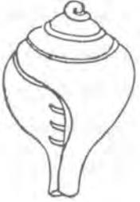

- I . A&C pfu)<,iala-
- 2. A&Cmaho-
- 3. B -kha<,lgayo
- 4. A&C
- 5. A&C read instead sarvasiddhiphalapradaJTI
- 6. A nemakaJTI, B idaJTI, C nimakaJTI
- 7. A&B -sthaJTI
- 8. A&B
- 9. B kha<;lgahastasaragaJTI
- I 0. A&C -akusakaJTI, B -akusas
- II . B -dharaJTI
- 12. B -vaktraJTI
- 13. B samacaret
- 14. B -vamaJTI
- 15. B -netraiJ1
- 16. B sarvabharal)a-

*The Saf!iputa-tantra: Tibetan Version of Chapter Two*  bhaga'i dbus su yongs gang ba'i I zla ba'i dkyil'khor bsgorn par bya II der ni hril). ni bsarn bya zhing I gos dkar zhes bya rnarn par bsgorn II thod pa'i gdan gyi dbus gnas par I (253.3.1) kha dog dmar rno 'bar chen rno II rgyan rnarns kun gyis yongs gang ba'i I phyag brgyad kyis ni rnarn par brgyan *I I*  gzhu dang rnda' ni 'dzin pa dang I padrna'i lag par ral gri dang II thod pa rdo Ije dril bu dang I zhags pa de bzhin rin chen nyid II do shal dang ni rkang dgub sgra I rgyan rnarns kun gyis rnarn par brgyan II rnal'byor pas ni 'di bsgorns nasI rnyur du sangs rgyas thob par 'gyur II narn rnkha'i dbus su yongs gang ba'i I zla ba'i dkyil'khor bsgorn par bya II de yi nang song I ta1112 nyid ni I sgrol rna'i dbyibs su bsarn par bya II thod pa'i3 dgan gyi dbus gnas par I phyag ni brgyad kyis rnarn par brgyan II ral gri phyag na chags bcas rna I udpala de bzhin lcags kyu dang II thod pa khrag gi gang ba dang I zhags pa de bzhin 'khor lo dang II gzhu dang rnda' ni 'dzin pa nyid I zhal gcig rna ni yang dag bri II kha dog ljang khu spyan gsurn rna I rgyan rnarns kun gyis rnarn par brgyan II de ltar rnal'byor pas bsgorns pas I rdo Ije serns dpa' mnyarn par 'gyur II rgyud tharns cad kyi gleng gzhi'i gsang ba dpal yang dag par sbyor ba las4 byung ba'i5 brtag pa'i rgyal po gnyis pa'o II

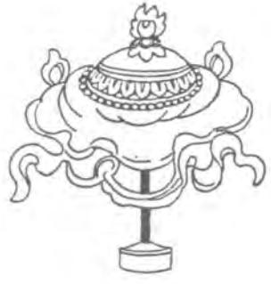

- 1. T son
- 2. T trliq1
- 3. P bde reads ba'i instead of thod pa'i
- 4. Tomits
- 5. P byung ba las

